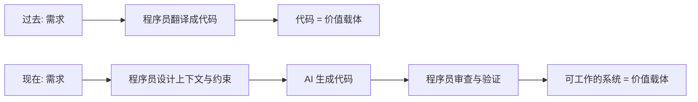
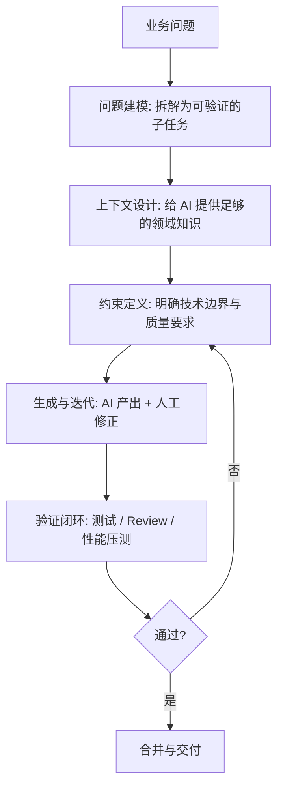
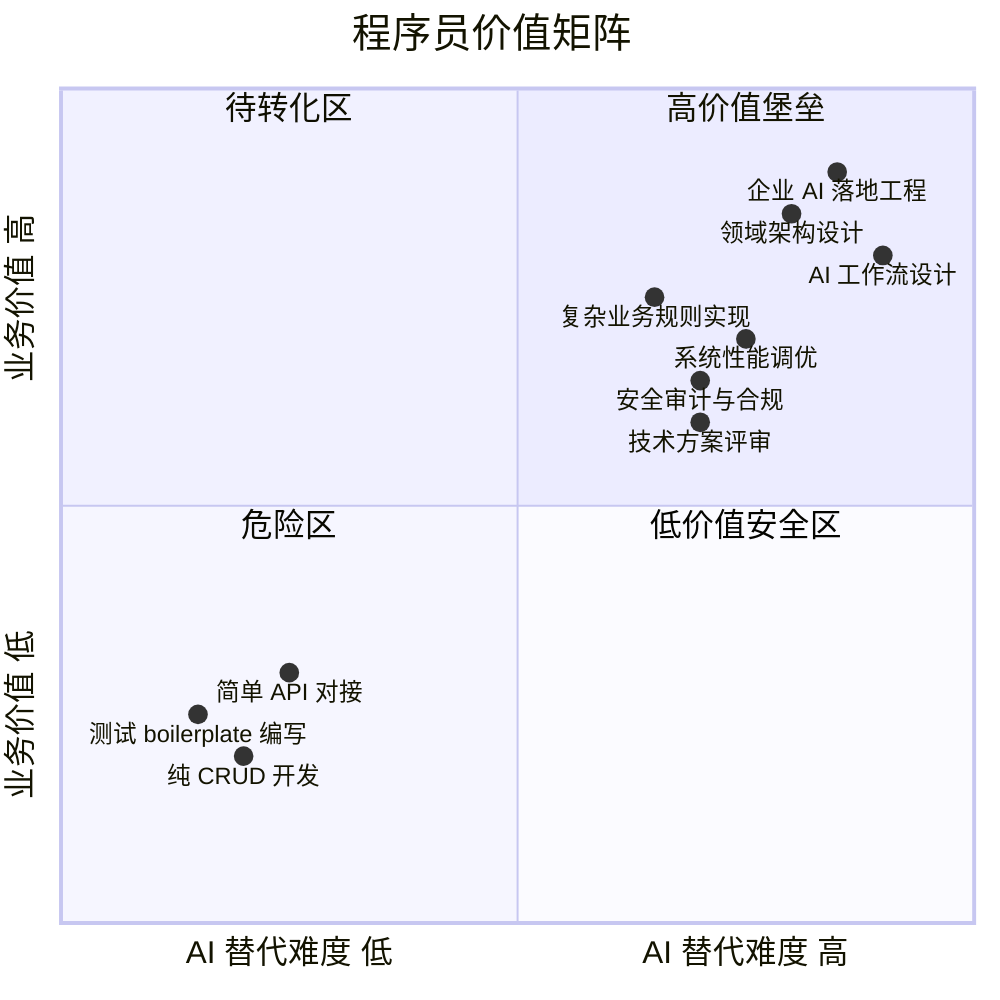

# 第0章 AI 时代程序员的角色变化

## 本章要解决的问题

"AI 写代码比我快，我是不是要失业了？"

"公司让我研究 AI 落地，但我又不是算法工程师，从哪开始？"

"我做了十年 Java 后端，CRUD 写得滚瓜烂熟，AI 来了我该往哪个方向走？"

如果你被这些问题困扰，这一章是给你的。核心结论在前面：**不是 AI 替代程序员，而是会用 AI 的程序员替代不会用的。** 但这句口号背后有更具体的分层逻辑 —— 哪些人被替代、哪些人更值钱、为什么，以及你具体该做什么。本章把这些说清楚。

学完本章你应该能回答：企业到底为什么需要懂 AI 的 Java 程序员？你做的工作哪些 AI 能干、哪些不能？你的职业护城河应该往哪里挖？

---

## AI 时代程序员的角色变化

### 过去十年程序员的工作模式

回顾你过去十年的日常：

1. 拿到需求文档（或者口头描述）。
2. 拆成接口、Service、DAO、数据表。
3. 一行一行写代码，包括 Controller 的参数校验、Service 的业务逻辑、MyBatis 的 SQL 映射。
4. 写单元测试，自测，提测。
5. 修 bug，上线，循环。

这个过程的核心是 **"翻译"**: 把业务需求翻译成代码逻辑。你花时间最多的事情是什么？查询数据库 → 拼装对象 → 返回 JSON。换个业务场景，换张表，流程一模一样。这就是 CRUD，也是大多数企业 Java 程序员的主要工作内容。

### 现在发生了什么变化

Claude Code、Codex、Gemini 这些工具，本质上做的是同一件事：**把"翻译"这一步自动化了**。

你现在对着 AI 说："根据这个表结构，生成一个 REST 接口，包含分页查询、按状态筛选、按创建时间排序，返回 DTO 不暴露主键"，它能给你输出完整的 Controller + Service + Mapper + 测试，代码质量不差。你过去写 40 分钟的东西，它 20 秒搞定。

这导致了一个根本性变化：

程序员从"翻译者"变成了"设计者 + 审查者"。你不再主要靠敲代码的量来创造价值，而是靠：

- **定义问题**的准确度
- **分解任务**的合理性
- **设计约束**的精确性
- **审查结果**的严谨性
- **验证质量**的系统性

### 角色变化的核心：从执行者到决策者

这不是比喻，是实际工作流的改变。以前你是一个严格执行者——拿到设计文档，按要求写出代码。现在 AI 代替了执行层，你的位置往上游移动：

| 维度 | 过去（执行者） | 现在（决策者） |
|------|--------------|--------------|
| 输入 | 详细设计文档 | 业务问题 + 非功能约束 |
| 过程 | 写代码实现 | 拆任务、给上下文、设边界条件 |
| 输出 | 代码 | 可验证的工作系统 |
| 核心技能 | 编程语言熟练度 | 问题建模与质量判断力 |
| 时间分配 | 80%编码 + 20%思考 | 20%编码 + 80%设计与验证 |

注意最后一行：**AI 没有减少你的工作量，它改变了你的工作结构。** 你省下的编码时间，必须投入到更高质量的设计、审查和验证中去。否则你的产出质量反而会下降 —— 因为 AI 生成的代码虽然快，但可能有隐藏的边界 bug、安全漏洞、性能问题，需要你来兜底。

---

## 从写代码到设计 AI 工作流

### 什么是 AI 工作流

举个例子。你要做一个"订单超时自动取消"的功能。过去你怎么做：

1. 写一个定时任务 `@Scheduled(cron = "0 */5 * * * ?")`
2. 查询状态为"待支付"且创建时间超过 30 分钟的订单
3. 批量更新状态为"已取消"，恢复库存
4. 发通知

这是传统的"写代码解决问题"的路径。

AI 工作流的方式：

1. 你定义上下文：订单系统的领域模型、取消订单的状态机规则、幂等性要求、补偿逻辑。
2. 你把上下文喂给 AI，描述需求："设计一个订单超时取消的模块，注意并发场景下的库存扣减竞态条件，给出完整的方案和代码。"
3. AI 给出方案：可能建议用延迟消息（RocketMQ 的延迟级别）而不是定时任务扫描，因为延迟消息更实时、数据库压力更小。
4. 你审查方案：延迟消息的可靠性够不够？消息丢了怎么办？你需要加一个对账任务做兜底。
5. AI 补上对账逻辑。
6. 你审查代码：事务边界对不对？异常处理完整吗？
7. 你写集成测试的约束条件，AI 生成测试用例。
8. 你跑测试，验证通过。

关键区别：**你不是在写代码，你是在设计一个让 AI 写出正确代码的工作流。** 你的产出不是代码行数，而是"拿到正确系统"这个结果。

### 工作流设计的层次

每一层都是程序员的新核心竞争力：

- **问题建模**：能不能把一个模糊的业务问题拆成 AI 能处理的明确子任务？拆得太粗，AI 输出失控；拆得太细，上下文碎片化。
- **上下文设计**：什么都丢给 AI 是灾难。你得筛选哪些领域知识必要、哪些噪音该排除。这本质上是信息架构能力。
- **约束定义**：`"用 RestTemplate 而不是 WebClient"`, `"异常必须捕获并转为业务异常码"`, `"SQL 必须只查需要的列"`——这些约束就是你的技术判断力。
- **验证闭环**：AI 说"搞定了"，你怎么证明它真的搞定了？这需要测试设计能力。

---

## 程序员会不会被替代

直接回答：**"程序员"不会整体被替代，但"只会写代码的程序员"正在被替代。**

回看 2000 年代，网页制作是一个独立职业，一个人切图、写 HTML、调 CSS，一个月挣一万。今天"网页制作师"这个岗位基本消失——不是因为网页没人做了，而是因为工具进化了，Dreamweaver 没人用了，但前端工程师的需求量翻了十倍。消失的是低附加值环节，增长的是高附加值环节。

AI 时代重演了同样的逻辑。

### 哪些程序员更容易被替代

**特征一：工作产出是"代码"，不是"可工作的系统"**

把需求文档翻译成代码、翻译质量尚可 —— 这是最容易被替代的环节，因为这就是 LLM 最擅长的事。如果你整天做的就是 Controller-Service-Dao 的简单翻译，没有复杂业务判断，没有架构决策，那你的工作 AI 已经能完成 80%。

**特征二：依赖单一语言/框架，不关心业务**

"我会 Spring Boot，你给我需求我就能写"—— 这种自我定位很危险。你提供的价值和外包公司没有本质区别，而 AI 的成本比外包公司低两个数量级。

**特征三：没有质量兜底意识**

AI 生成的代码你敢直接上生产吗？不敢。但如果你的价值仅仅是"检查一下 AI 写的代码"，那你的价值依然很薄。真正不可替代的是：你知道什么需要检查、怎么检查、检查到什么程度才算够了。

### 具体受影响的场景

以一个典型的 Java 后端项目为例，以下任务 AI 已经能完成得很好：

- 根据数据表生成标准的 CRUD 接口（分页、排序、过滤）
- 将 Swagger/OpenAPI 文档反向生成 Controller 代码
- 写 MyBatis 的 ResultMap 和基础 SQL 映射
- 生成单元测试的 boilerplate 代码
- 生成常见的工具类（日期处理、字符串处理、文件操作）
- 数据库迁移脚本（DDL）的生成
- API 对接代码（调第三方 REST 接口、解析 JSON 响应）

如果你每天 60% 以上的时间花在这些事情上，你需要警觉。

### 哪些程序员会更值钱

**类型一：懂业务、懂架构的领域专家**

假设你在医疗行业做了五年，你懂 HIS 系统的业务规则、医保结算的复杂逻辑、HL7 数据交换标准。AI 能帮你写代码，但它不知道"医保控费规则在医院端的落地坑有哪些"——除非你告诉它。你的价值在于**你知道要告诉 AI 什么**。

**类型二：能设计 AI 工作流的技术负责人**

不是让 AI 帮你写一个方法，而是设计一套流程：什么时候用 AI 生成、什么时候人工写、AI 的输入约束怎么定、Review 的 checklist 包含什么、质量门禁怎么自动化。这套流程设计能力比写代码能力价值高得多。

**类型三：能把 AI 落地到企业系统的工程师**

企业要在自己的系统里接入 AI——不是调个 ChatGPT API 就叫接入了。实际的落地包括：内部知识库的 RAG 系统怎么搭、AI 生成的代码怎么和 CI/CD 流水线集成、怎么在企业内网部署私有化模型、怎么保障代码安全（AI 生成的代码有没有注入风险？有没有泄露内部 API 地址？）。这些问题都需要有工程经验的人来解决。

**类型四：有质量工程思维的开发者**

AI 生成的代码可能 90% 正确，但剩下的 10% 可能是 NPE、SQL 注入、线程安全问题、事务边界错误。能在 30 秒内发现这些问题的人，比能在 30 分钟内写出来的人更稀缺。

### 一张图看清

- 左下角（纯 CRUD、简单对接）：AI 替代难度低，产生的业务价值也低。这是最危险的位置。
- 右上角（领域架构、AI 落地、工作流设计）：AI 替代难度高，业务价值高。这是你该迁移的方向。

---

## 企业为什么需要懂 AI 的程序员

### 管理层的真实焦虑

过去两年，你公司的 CTO 大概率收到了来自 CEO 的灵魂拷问："我们怎么用 AI？竞对都上了，我们不能落后。" 然后 CTO 把问题转给了技术团队。

问题是：**管理层不知道怎么用 AI，算法工程师不懂业务系统，业务程序员不懂 AI。** 这中间有一个巨大的断层。

### 企业需要的不是"算法研究员"

大多数企业（尤其是非互联网行业的传统企业、金融、医疗、制造、政府）不需要训练大模型。他们没有那个数据量、算力和场景。他们需要的是：

1. **把 AI 嵌入现有业务流程**：比如在 OA 审批系统里加一个 AI 助手，帮员工起草请假申请、报销单。
2. **内部知识库的智能检索**：公司有几百份制度文档，员工查不到，能不能用 RAG 做一个内部问答系统？
3. **开发效率提升**：代码生成、代码审查、测试用例生成、API 文档自动补全。
4. **运维与监控的智能化**：日志异常检测、故障根因分析、告警聚合。

这些场景需要的核心能力是**工程集成**，不是模型训练。而工程集成恰好是后端程序员的强项。

### 断层和机会

目前市场上的"AI 工程师"大致分成两拨：

- 一拨是研究背景，懂 Transformer、RLHF、LoRA 微调，但不知道企业 Java 项目的 CI/CD 怎么跑、事务怎么管、Redis 怎么用。
- 另一拨是企业后端开发，懂 Spring Cloud、MySQL 分库分表、消息队列，但看到 AI 就觉得"那是算法团队的事"。

这两拨人中间有一片蓝海：**懂企业系统的 AI 落地工程师。** 你不必会训练模型，但你要知道怎么把模型的能力变成企业系统的功能。这就是你的机会。

---

## 程序员如何帮助企业使用 AI

### 第一步：从你自己的工作中找切入点

不要一上来就想"帮公司做 AI 战略转型"。先从你每天在做的事情里找：

- 你用 Postman 调接口 → 能不能让 AI 帮你生成接口测试用例？
- 你写 PRD 评审纪要 → 能不能让 AI 帮你把会议录音转成结构化纪要？
- 你排查生产问题看日志 → 能不能用 AI 帮你做日志模式识别？

从自己的痛点开始，有两点好处：你了解场景（不需要额外调研），见效快（你自己就是用户）。

### 第二步：把一个场景做到能用

选一个最小的场景，做到可用的程度。什么叫"可用"？不是 demo 跑通了就叫可用：

- Java 后端项目中的代码生成：不是生成一个 Controller 就叫可用，而是生成的代码符合团队的编码规范（命名、异常处理、日志格式）、通过 Checkstyle 检查、集成了已有的公共库。
- 内部知识库问答：不是调通 LangChain 的 demo 就叫可用，而是文档切片策略合理、检索准确率够用、回复有来源引用、能在公司内网部署。

能上线跑、同事愿意用的才叫"可用"。否则只是你的个人实验。

### 第三步：形成可复制的工作流

当你把一个场景跑通了，你要做的不是"维护这个系统"，而是**把实现路径抽象成可复制的方法论**，让其他团队也能用：

- 上下文模板："给 AI 提供项目上下文时，必须包含：技术栈版本、现有代码结构、编码规范文档、相关数据表结构、异常处理约定。"
- Review checklist："AI 生成的代码必须检查：SQL 是否有注入风险、事务边界是否合理、异常是否妥善转换、外部 API 调用是否有超时和重试。"
- CI 集成策略："AI 生成的代码在合入主干前，必须通过现有单元测试、Checkstyle、SonarQube 扫描。新增代码覆盖率不低于 80%。"

这就是 AI 工作流的标准化。你从一个执行者变成了方法论的建设者。

### 具体场景案例：微服务项目的 AI 辅助开发流程

以一个典型的 Spring Cloud 微服务项目为例，完整的 AI 辅助开发流程可能长这样：

1. **需求分析阶段**：把产品需求文档输入 AI，生成结构化的接口定义（REST API 的路径、入参、出参、错误码）。
2. **设计评审阶段**：用 AI 检查接口设计的一致性 —— 分页参数命名是否统一、错误码是否冲突、数据模型是否有冗余字段。
3. **代码生成阶段**：用项目代码作为上下文，让 AI 生成 Service 层代码，约束为"使用项目已有的 `BaseService`、统一异常类 `BizException`、日志使用 `@Slf4j`"。
4. **测试生成阶段**：根据接口定义和业务规则，AI 生成集成测试用例，覆盖正常场景、边界场景、异常场景。
5. **代码审查阶段**：AI 先做第一轮 Review，检查常见问题（NPE、资源未关闭、SQL 拼接），人工做第二轮，聚焦业务逻辑正确性和架构合理性。
6. **文档阶段**：AI 根据代码和注释生成 API 文档，保持和 Swagger 注解一致。

你在这个流程中的角色：定义每阶段的输入约束、审查关键节点的输出、在 AI 出错时修正方向。**你不是操作流水线的工人，你是设计流水线的工程师。**

---

## 常见误区

### 误区一："AI 生成的代码质量不行，所以我还得自己写"

这是用静态的眼光看动态的问题。AI 模型的能力在指数级提升。一年前 GPT-3.5 写的 Java 代码可能惨不忍睹，今天 Claude 4 生成的代码在很多场景已经超过初级程序员的水平。不要把今天的不足当成永久性的结论。

正确的思路是：**AI 现在能做什么，你就让它做什么；它做不到的，你来做。** 建立一个动态的能力边界判断习惯，每季度重新评估一次。

### 误区二："我要去学机器学习、深度学习才能跟上 AI 时代"

对于一个做了十年 Java 后端的人，去学反向传播算法、梯度下降的数学推导，这是方向性错误。你的比较优势在工程系统，不是在数学建模。你要学的是：Prompt Engineering（本质是问题描述和约束设计的能力）、RAG 系统搭建、AI API 的工程化封装、AI 工作流设计 —— 这些是你现有技能的自然延伸。

### 误区三："只要会用 ChatGPT / Claude Code 就够了"

会用工具和能用工具解决企业级问题之间差了十万八千里。你自己用 Claude Code 写一个 demo 很快，但让团队 20 个人都用、产出的代码符合公司质量规范、能和现有 CI/CD 集成、生成的代码不泄露公司内部 API——这些都是工程问题，不是"会不会用工具"的问题。

### 误区四："AI 只能做简单的事，复杂的业务逻辑还得靠人"

这是一个危险的错觉。复杂业务逻辑复杂在哪里？在规则多、分支多、异常情况多。这正是 LLM 擅长的——它能比你更快地穷举边界情况。真正难的从来不是"把复杂逻辑写出来"，而是"确定复杂逻辑的规则是正确的"——后者需要业务理解和判断，这才是你的战场。

### 误区五："公司没有 GPU，做不了 AI"

企业 AI 落地不等于训练大模型。API 调用（各种云厂商的模型服务）、RAG（向量数据库 + 检索）、Agent 编排，这些都用不到 GPU。你现在手里的 MacBook / ThinkPad 完全够用。

---

## 本章小结

1. **AI 正在把程序员从"代码翻译者"变成"系统设计者 + 质量审查者"。** 编码时间压缩，但设计与验证的需求被放大。
2. **没有产出的工作环节被替代，创造决策价值的工作环节被放大。** 纯 CRUD、简单 API 对接是高危区；领域架构、AI 工作流设计、企业 AI 落地是增长区。
3. **企业的痛点不是缺算法研究员，而是缺能把 AI 嵌入现有企业系统的工程师。** 这是 Java 后端的天然延伸。
4. **你的护城河不是"会 Spring Boot"，而是"理解业务 + 懂系统架构 + 能设计 AI 工作流 + 能兜底质量"。** 这四层的复合度越高，替代难度越大。
5. **行动路径：从自己的痛点开始 → 把场景做到可用 → 抽象成可复制的方法论。** 不要一上来想搞战略，先在一个点上打穿。

---

## 实战练习

### 练习 1：审计你自己的日常工作（30 分钟）

把你最近一个迭代做的所有事情列出来，每件事情归类：

- A 类：AI 可以生成 80% 以上，我只需 Review（如标准 CRUD、工具类、DTO 转换）
- B 类：AI 可以生成 50-80%，我需要大量修改和补充（如包含复杂业务规则的 Service）
- C 类：AI 当前难以胜任，必须我主导（如跨系统的分布式事务设计、性能瓶颈分析）

算出三类各自的占比。如果 A 类超过 60%，你需要认真考虑转型方向。

### 练习 2：选一个场景，完成一次 AI 辅助开发的完整闭环（2 小时）

在你当前的项目里选一个真实的开发任务（不是 demo），按以下步骤走完：

1. 用 200 字以内的自然语言描述任务，作为 AI 的输入。
2. 额外准备一份"项目上下文"，包括：技术栈版本、编码规范要点、相关表结构、异常处理约定。
3. 将上下文和任务描述一起喂给 AI，生成代码。
4. 用你自己团队的代码审查标准去审查 AI 的输出，记录发现的问题数量和类型。
5. 修复问题后，跑通全部现有测试。

完成之后记录：AI 生成的代码首次通过审查的比例是多少？你发现的最常见问题是什么？如果你每次都写一份上下文文档，你的效率能提升多少？

### 练习 3：设计一个 Mermaid 流程图，描述你理想中的 AI 辅助开发流程（1 小时）

用 Mermaid 画出你在当前项目中的理想开发流程，标注每个环节中 AI 的角色和人的角色。重点标注：哪些检查是必须人工做的、哪些可以自动化。

---

## 自测问题

回答以下问题，检验你对本章的理解。建议在学完后续章节后回头再做一遍，看答案有没有变化。

1. 用自己的话说清楚：AI 时代程序员的核心价值从"写代码"转移到了哪些具体能力上？（至少列出 5 项）
2. 你当前的工作内容中，哪些是 A 类（AI 可大量替代的）？你打算怎么应对？
3. 为什么"懂业务规则的程序员"比"只会写代码的程序员"更难被替代？结合你所在行业举例说明。
4. 企业 AI 落地为什么主要缺的是工程集成能力，而不是算法研究能力？
5. 描述一个你实际做过的开发任务，思考如果重新用 AI 辅助的方式做，你会怎么设计工作流？
6. 一个团队引入 AI 辅助开发后，代码审查的标准应该怎么调整？哪些检查项需要加强？
7. "用户用 AI 写了一个 Demo 能用" 和 "团队把 AI 集成到企业开发流程里" 之间的差距具体体现在哪些方面？
8. 你身边有没有陷入本章描述的五大误区的同事？你准备怎么跟他们沟通？

---

> **下一章预告**：第1章《LLM 如何工作——给程序员的最小必要知识》。不讲数学推导，用人话把 LLM 的原理讲清楚。你要理解 token、context window、temperature、embedding 到底是什么，以及这些概念如何直接影响你的日常使用效果。
