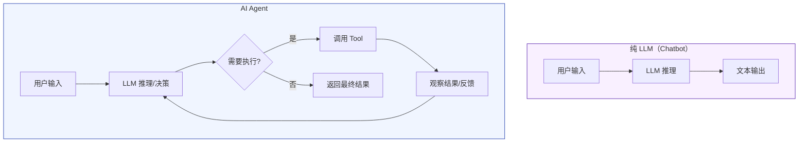
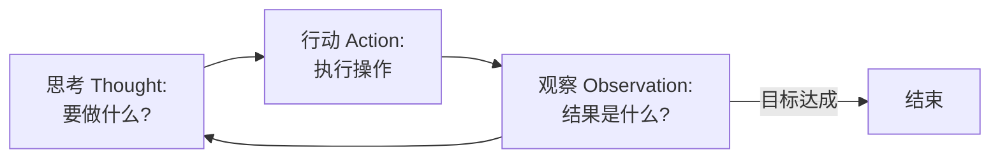
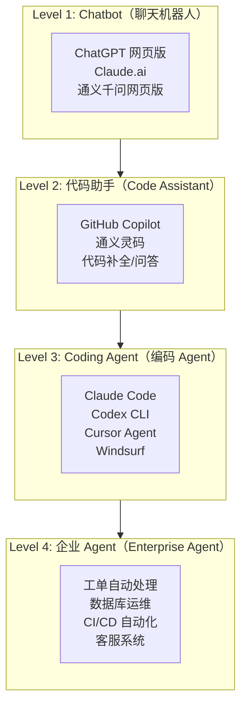
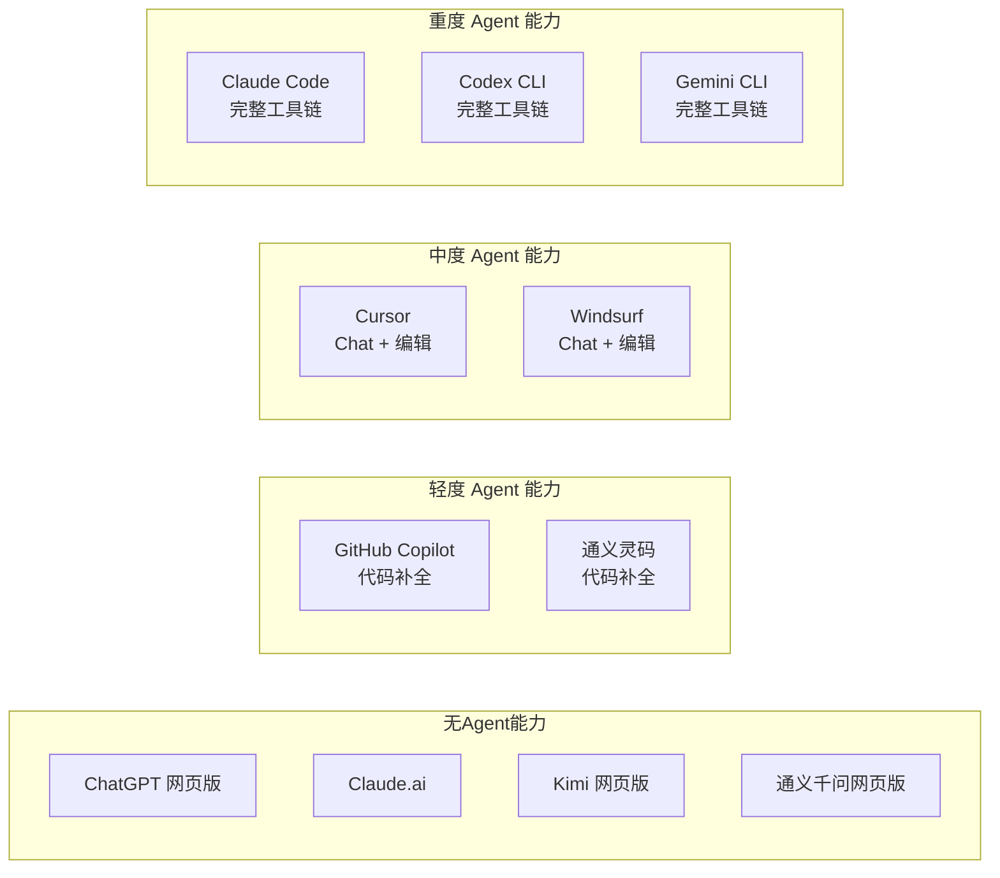

# 第 1 章：从 LLM 到 Agent

## 1. 本章要解决的问题

作为一个有十年经验的 Java 后端程序员，你在日常工作中已经在用 Claude Code、ChatGPT、Codex 这些工具了。但你可能会困惑：

- GPT-4 和 Claude Code 到底有什么区别？不都是"大模型"吗？
- 为什么 ChatGPT 只能聊天，而 Claude Code 能直接改你的代码、创建文件、执行命令？
- "AI Agent"这个词满天飞，它和"LLM"是什么关系？和"RAG"又是什么关系？
- 你们公司说要搞"企业 Agent"，这跟你在用的 Claude Code 是一回事吗？

本章的目标：**用工程语言（不是数学语言）把这些概念讲清楚**。读完这一章，你不需要理解 Transformer 的注意力机制，但你能准确地告诉同事：Claude Code 是 Agent，ChatGPT 网页版是 Chatbot，它们的区别在于执行能力的有无。

## 2. LLM 是什么（工程视角）

### 2.1 一个输入输出的黑盒

从工程角度看，LLM（Large Language Model，大语言模型）就是一个函数：

```
String output = llm.predict(String prompt);
```

你给它一段文本，它还你一段文本。仅此而已。

这个函数的特别之处在于：

1. **输入不限于指令**——你可以给它自然语言、代码、JSON、Markdown，甚至让它扮演某个角色（"你是一个资深的 Java 代码审查者"）
2. **输出是概率性的**——同样的输入可能产生不同的输出（受 `temperature` 参数控制）
3. **它不理解"真假"**——它只是根据训练数据中的统计规律，预测最可能的下一个字（token），依次生成整个回复
4. **它有上下文窗口**——一次调用能处理的输入+输出总量有限，比如 200K tokens（约 15 万英文单词）

### 2.2 类比：一个读过所有文档的高级工程师

把 LLM 想象成一个**读过 GitHub 上所有公开代码、Stack Overflow 上所有问答、以及互联网上大量技术文档的高级工程师**。

他的特点是：

- 你问他一个技术问题，他能给出非常专业的回答
- 你给他一段代码让他审查，他能指出潜在问题
- 你让他翻译一段文档，他能做得很漂亮
- 你让他写一个单元测试，他能直接产出

但他有一个致命限制：**他只能坐在椅子上回答你。他不能站起来去操作你的电脑。**

他不能：

- 打开你的 IDE 创建一个文件
- 执行 `mvn test` 看测试是否通过
- 查你的数据库看某张表的结构
- 调你的 API 接口验证返回结果
- 读你的 Git 日志分析提交历史

这就是纯 LLM 的边界：**推理能力强，执行能力为零**。

### 2.3 LLM 的核心能力（从工程视角理解）

作为一个后端开发者，你可以把 LLM 的核心能力映射到你熟悉的概念上：

| LLM 能力 | 工程类比 | 说明 |
|-----------|----------|------|
| **文本理解** | 自然语言处理的终极形态 | 理解需求文档、Bug 描述、日志信息，比正则表达式强几个数量级 |
| **代码生成** | 模板引擎的智能版 | 不是简单的字符串拼接，而是根据语义生成符合上下文的代码 |
| **推理** | if-else 的模糊版 | 能做多步推理，但不像确定性逻辑那样 100% 可预测 |
| **翻译/转换** | 数据格式转换器 | JSON 转 XML、Java 转 Python、SQL 转 HQL |
| **摘要** | 日志压缩器 | 把 1000 行异常堆栈压缩成 3 行关键信息 |
| **分类** | 智能路由器 | 判断一条消息是 Bug 报告、功能请求还是咨询问题 |

这些能力全部在一个黑盒里，通过同一个接口（文本输入，文本输出）完成。这就是 LLM 的魅力，也是它的局限——接下来的 Agent 要解决的就是这个"只能输出文本"的问题。

## 3. Agent 是什么

### 3.1 一个比喻：大脑 vs 完整的人

如果把 LLM 比作**大脑**（负责思考、推理、决策），那么 Agent 就是一个**完整的人**：

- 有大脑（LLM）——思考、推理、决策
- 有手（Tools）——可以操作外部世界
- 有记忆（Memory）——能记住上下文和历史
- 有眼睛（Perception）——能观察环境反馈
- 有计划能力（Planning）——能把大任务拆解成步骤

### 3.2 工程定义

从工程角度看，Agent 是一个**以 LLM 为核心的自主运行系统**：

```
Agent = LLM + Tools + Memory + Planning + Feedback Loop
```

每个组件的作用：

- **LLM**：决策引擎。决定"下一步该做什么"。
- **Tools**：执行器。实际的执行能力——调用 API、读写文件、执行命令、查询数据库。
- **Memory**：状态管理。记住之前做了什么、用户是谁、当前处于什么上下文。
- **Planning**：任务拆解。把一个复杂目标分解为可执行的步骤序列。
- **Feedback Loop**：感知-行动循环。执行一个动作后观察结果，根据结果调整下一步决策。

### 3.3 类比：Spring 应用架构

作为 Java 后端开发者，你可以把 Agent 的架构直接映射到 Spring 应用的经典分层：

```
┌─────────────────────────────────────────────┐
│                 Agent 系统                   │
│                                             │
│  ┌─────────┐    ┌──────────────────────┐    │
│  │   LLM   │    │    Controller 层      │    │
│  │ (大脑)  │◄──►│  (决策/路由/编排)     │    │
│  └─────────┘    └──────────┬───────────┘    │
│                            │                │
│         ┌──────────────────┼──────┐         │
│         │                  │      │         │
│         ▼                  ▼      ▼         │
│  ┌────────────┐  ┌──────────┐  ┌────────┐  │
│  │   Tools    │  │  Memory  │  │Planning│  │
│  │  (DAO 层)  │  │ (Redis)  │  │(工作流) │  │
│  └────────────┘  └──────────┘  └────────┘  │
│                                             │
└─────────────────────────────────────────────┘
```

- **LLM = Controller + Service 层的业务逻辑**：接收请求，做判断，决定调用什么
- **Tools = DAO/Repository 层**：实际执行具体操作——写文件、调 API、查数据库
- **Memory = Redis/Session**：保持状态，跨调用共享数据
- **Planning = 工作流引擎（如 Activiti/Flowable）**：把大任务拆成小步骤，按序执行

## 4. LLM 与 Agent 的本质区别

### 4.1 一句话总结

> **LLM 只会回答，Agent 可以执行。**

LLM 的输出永远是文本。Agent 的输出可以是：一个创建好的文件、一次成功的部署、一张填好的数据表、一封发出的邮件。

### 4.2 对比图



纯 LLM 的路径：**用户输入 -> 推理 -> 文本输出**（单向，一次完成）

Agent 的路径：**用户输入 -> 推理 -> 执行 -> 观察 -> 再推理 -> 再执行... -> 最终输出**（循环，多轮）

### 4.3 具体例子：创建一个 Spring Boot 项目

**纯 LLM (Chatbot) 的做法：**

```
你：帮我创建一个 Spring Boot REST API 项目
LLM：好的，你需要做以下步骤：
1. 使用 Spring Initializr 创建项目，选择 Web 和 JPA 依赖...
2. 创建 Controller 类，代码如下：...
3. 创建 Service 类，代码如下：...
4. 配置 application.yml，内容如下：...
   （给你一大段文字，你需要自己复制粘贴执行）
```

**Agent (如 Claude Code) 的做法：**

```
你：帮我创建一个 Spring Boot REST API 项目
Agent：好的，开始执行。
  → 执行 spring init 命令创建项目骨架
  → 创建 Controller.java 文件
  → 创建 Service.java 文件
  → 创建 application.yml 配置文件
  → 执行 mvn compile 验证代码是否编译通过
  → 报告结果：项目已创建，编译成功
  需要我启动应用验证接口吗？
```

区别显而易见：**Agent 不只是告诉你"应该怎么做"，而是直接帮你"做完了"。**

## 5. 为什么 LLM 只会回答，而 Agent 可以执行任务

### 5.1 本质原因：LLM 是推理引擎，不是执行引擎

LLM 的训练数据全是文本。它学到的是"给定一段文本，下一段文本大概率是什么"。它从来没有学过"如何调用一个 API""如何读写文件系统""如何执行 Shell 命令"。

Agent 给 LLM 补充了**执行通道**。核心机制是 **Tool Calling（函数调用）**：

```
LLM：我需要调用 file_write 工具，参数是 {path: "/src/UserController.java", content: "..."}
系统：执行 file_write，返回结果 {success: true}
LLM：写入成功。接下来我需要调用 maven_test 工具...
```

### 5.2 Tool Calling 的工作原理

Tool Calling 并不是 LLM 真的"学会"了执行操作。它是一种**协议**：

1. 开发者先定义好可用的工具（Tool Definition），告诉 LLM "你有哪些功能可用"，比如：

```json
{
  "name": "execute_sql",
  "description": "执行一条 SQL 查询",
  "parameters": {
    "sql": "要执行的 SQL 语句",
    "database": "目标数据库名"
  }
}
```

2. LLM 在推理过程中，如果判断某个工具可以帮助完成任务，就在输出中标记"我要调用这个工具"
3. 系统层（不是 LLM）收到这个标记后，真正去执行工具，把结果传回 LLM
4. LLM 拿到结果后，继续推理下一步

**关键理解**：LLM 不执行工具，LLM 只"决定"调用哪个工具。真正的执行是由 Agent 框架（系统层）完成的。LLM 的角色更像是**决策者**，不是执行者。

### 5.3 类比：下单和做菜

- **LLM = 服务员**：知道菜单上有什么，能理解你的需求，能推荐菜品，但不会做菜
- **Tool Calling = 服务员向后厨下单**：服务员决定"这道菜需要做"，然后把订单传给厨房
- **系统层 = 厨房**：真正做出菜品的地方
- **Agent = 整家餐厅**：从接单到出餐的完整系统

## 6. Agent 为什么需要工具、记忆、计划、上下文、反馈循环

### 6.1 工具（Tools）——行动能力

没有工具，Agent 就是一本会说话的百科全书。有了工具，它变成了操作系统的 CLI。

**Java 类比**：Tool 就是 Service 层调用的 Repository/DAO。Service 不做实际的数据库操作，它通过 Repository 来执行。Agent 中的 LLM 不做实际的系统操作，它通过 Tool 来执行。

常见的工具类型：

| 工具类型 | 例子 | 工程等价物 |
|----------|------|-----------|
| 文件系统 | 读写文件、创建目录 | `java.io.File`, `Files` API |
| Shell 命令 | 执行 bash 命令 | `Runtime.getRuntime().exec()` |
| 数据库 | 执行 SQL、查询数据 | JDBC, MyBatis, JPA |
| 网络请求 | HTTP API 调用、RPC | RestTemplate, Feign, gRPC |
| 代码执行 | 运行脚本、编译代码 | Maven/Gradle 插件 |
| UI 操作 | 点击按钮、填写表单 | Selenium, Playwright |

### 6.2 记忆（Memory）——状态保持

LLM 本身是**无状态的**。每次调用都是独立的一次推理，不记得 5 分钟前你跟它说过什么。

Agent 的记忆机制填上了这个坑：

**Java 类比**：

| Agent 记忆类型 | Java 类比 | 生命周期 |
|---------------|-----------|---------|
| **短期记忆**（上下文窗口内的对话历史） | 方法内的局部变量 | 一次会话内有效 |
| **工作记忆**（当前任务的中间状态） | ThreadLocal / Request Scope | 一个任务周期内有效 |
| **长期记忆**（持久化的用户偏好、历史记录） | Redis / 数据库 | 跨会话持久化 |

**实际例子**：你在 Claude Code 中告诉它"我们的项目用 Java 17，包名是 `com.kane.order`，数据库是 PostgreSQL，记得用 MyBatis-Plus"。它把这些信息存入记忆，后续创建任何文件、生成任何代码都会自动遵守这些约束。你不需要每次都说一遍。

### 6.3 计划（Planning）——任务拆解

面对复杂任务时，Agent 不能一步完成。它需要：

1. 理解目标
2. 拆解为子任务
3. 按依赖关系排序
4. 逐步执行
5. 根据中间结果调整计划

**Java 类比**：Planning 就是一个智能版的**工作流引擎**（Activiti / Flowable / Temporal）。传统工作流的流程是预先定义好的（BPMN 图），Agent 的 Planning 是动态生成的——根据目标和环境实时规划。

**例子**：你说"把这个项目从 Spring Boot 2.7 升级到 3.2"。

Agent 的 Planning 过程：
```
1. 分析当前 pom.xml，列出所有依赖及其版本
2. 识别哪些依赖需要升级，哪些不再兼容
3. 升级 spring-boot-starter-parent 到 3.2.x
4. 迁移 javax.* 到 jakarta.* （Spring Boot 3 的关键变更）
5. 更新 Spring Security 配置（API 有变化）
6. 检查是否有废弃的 API 需要替换
7. 运行 mvn compile，修复编译错误
8. 运行测试，修复测试失败
```

实际执行时，步骤 7 的编译结果可能揭示新的问题，Agent 会动态调整后续步骤。

### 6.4 上下文（Context）——环境感知

上下文告诉 Agent"你现在在哪里，在干什么"。

**Java 类比**：Context 就是 Spring 的 `ApplicationContext`——一个集中的信息源，包含了运行环境的所有关键信息。

Agent 的上下文通常包括：

- **项目上下文**：当前项目的技术栈、目录结构、代码风格
- **对话上下文**：用户之前说过什么、当前在解决什么问题
- **系统上下文**：操作系统、可用工具、环境变量
- **业务上下文**：当前所在的业务领域、术语定义、特殊规则

### 6.5 反馈循环（Feedback Loop）——感知-行动闭环

这是 Agent 区别于普通程序最核心的特征。Agent 不是"执行一次就完事"，而是：

```
执行 → 观察结果 → 判断是否符合预期 → 调整策略 → 再执行 → 再观察 → ...
```

**ReAct 模式（Reasoning + Acting）**是反馈循环的经典实现：



**Java 类比**：就是一个**带重试和回滚的事务循环**：

```java
while (!goalAchieved && retries < maxRetries) {
    Action action = plan(goal, context);   // 思考：制定下一步行动
    Result result = execute(action);       // 行动：执行操作
    context = observe(result);             // 观察：分析结果
    if (result.isSuccess()) {
        goalAchieved = checkGoal(result, goal);  // 判断是否完成
    } else {
        rollback(action);                  // 失败则回退
        retries++;
    }
}
```

不同的是，Agent 的 `plan()` 是由 LLM 完成的，所以它能处理传统程序难以处理的"模糊场景"——比如编译错误信息不明确时，它能根据经验猜测可能的原因。

## 7. 普通聊天机器人、代码助手、Coding Agent、企业 Agent 的区别

这些概念容易混淆，但它们的能力层级和自主程度完全不同。



### 7.1 各层级的核心区别

| 维度 | Chatbot | 代码助手 | Coding Agent | 企业 Agent |
|------|---------|----------|-------------|-----------|
| **输入** | 自然语言 | 自然语言 + 代码上下文 | 自然语言 + 完整项目上下文 | 自然语言 + 企业系统上下文 |
| **输出** | 文本 | 文本 / 代码片段 | 实际的文件变更、命令执行 | 实际的业务操作、系统变更 |
| **自主性** | 零（每轮被动应答） | 极低（补全建议） | 高（自主规划执行） | 极高（自主决策+执行） |
| **工具权限** | 无 | 极有限（读文件） | 广泛（文件系统、Shell、Git） | 企业级（数据库、K8s、CI/CD、内部系统） |
| **记忆** | 单次会话 | 单次会话 + 项目知识库 | 会话 + 项目 + 用户偏好 | 企业知识库 + 用户画像 + 历史操作记录 |
| **安全要求** | 低 | 低 | 中（本地沙箱） | 高（审批流、权限控制、审计日志） |

### 7.2 实例说明

**Chatbot（Level 1）**：
> 你："这段 SQL 有什么性能问题？"
> 它："你的 SQL 缺少索引，建议在 user_id 和 create_time 上建联合索引..."（返回文本建议）

**代码助手（Level 2）——GitHub Copilot**：
> 你输入 `// find all active users with orders in last 30 days`，它自动补全出完整的方法实现。（在 IDE 内工作，但只是补全建议，不会自己运行）

**Coding Agent（Level 3）——Claude Code**：
> 你："分析这个模块的性能瓶颈并修复。"
> 它：读取代码 → 运行性能测试 → 定位慢查询 → 添加索引 → 修改代码 → 再次测试 → 确认修复有效。（自主完成闭环）

**企业 Agent（Level 4）——工单处理 Agent**：
> 系统收到一条工单"用户反馈订单支付成功但状态未更新"。
> Agent：查询支付记录 → 查询订单状态 → 发现状态未同步 → 检查消息队列消费情况 → 补发消息 → 更新订单状态 → 回复用户 → 记录处理日志。（全流程自动，涉及多个企业系统）

## 8. 主流工具的 Agent 程度分类



### 8.1 分类依据

| 工具 | 提示补全 | 多文件编辑 | 执行命令 | Git 操作 | 自我纠错 | 自主规划 |
|------|:--:|:--:|:--:|:--:|:--:|:--:|
| ChatGPT/Claude.ai | - | - | - | - | - | - |
| GitHub Copilot | Y | - | - | - | - | - |
| Cursor | Y | Y | 部分 | 部分 | 部分 | - |
| Windsurf | Y | Y | 部分 | 部分 | 部分 | - |
| **Claude Code** | Y | Y | Y | Y | Y | Y |
| **Codex CLI** | Y | Y | Y | Y | Y | Y |
| **Gemini CLI** | Y | Y | Y | Y | Y | Y |

### 8.2 Claude Code 为什么是 Agent 而非 Chatbot

Claude Code 是典型的 Agent，因为它具备完整的 Agent 特征：

1. **Tool Calling**：拥有文件读写、Shell 命令执行、Git 操作、网络请求等工具
2. **Memory**：通过 CLAUDE.md 和 Memory 文件持久化项目上下文和用户偏好
3. **Planning**：面对复杂任务（如"重构这个模块"），自动拆解步骤
4. **Feedback Loop**：执行命令后会读取输出，根据结果决定下一步——编译失败了就分析错误信息并修复
5. **自主性**：你只需要给目标，不需要手把手教每一步

### 8.3 Cursor / Windsurf 的定位

Cursor 和 Windsurf 介于代码助手和完整 Agent 之间。它们有 Agent 模式，但功能范围更集中在 IDE 内的代码编辑。它们的优势在于**与 IDE 的深度融合**——所见即所得的编辑体验比纯 CLI 工具更直观；劣势在于**自主规划能力和工具链完整性不如 Claude Code 和 Codex**。

## 9. 为什么 Agent 是 AI 落地的关键

### 9.1 LLM 的落地瓶颈不在智能，在能力

LLM 本身已经足够聪明了——GPT-4、Claude 4 在大多数技术问题上给出的建议质量都很高。但只给建议不执行，意味着：

- 效率瓶颈在人：LLM 生成答案只需要 3 秒，你照着操作可能需要 30 分钟
- 无法规模化：一个 LLM 可以同时服务 1000 个用户，但它只能"回答"，不能"干活"
- 前后关联靠人：LLM 不记得你上次做了什么，你每次都得重新描述背景

Agent 解决了这三个问题：**自动执行、自主规划、记忆保持**。

### 9.2 企业场景下的价值

以一个典型的 Java 后端团队日常为例：

| 场景 | 没有 Agent | 有 Agent |
|------|-----------|----------|
| **写 CRUD** | 手工建 Controller、Service、Mapper、Entity | Agent 读表结构自动生成全部代码 |
| **Code Review** | 互相 Review，耗半天 | Agent 自动 Review，标注问题，给出建议 |
| **Bug 修复** | 定位半天，修一会儿，验证半天 | Agent 分析日志、定位代码、修改、测试一条龙 |
| **升级依赖** | 查文档、改 POM、修兼容、跑测试 | Agent 自主完成分析-升级-验证循环 |
| **写文档** | 不爱写、拖延、质量差 | Agent 读代码自动生成接口文档、部署文档 |
| **数据库变更** | 写 SQL、找人 Review、执行、验证 | Agent 生成 SQL、自检语法、模拟执行、生成回滚脚本 |

### 9.3 Agent 改变的不只是效率，是角色

有了 Agent 之后，一个高级工程师的角色会从"写代码的人"转变为"给 Agent 定方向的人"：

- **以前**：你的任务是实现功能（写代码）
- **以后**：你的任务是定义目标（描述要做什么），Agent 负责实现，你负责审查和决策

这和十年前从手工部署变成 CI/CD 管道的变化是类似的——从操作者变成了管道设计者。

## 10. 常见误区

### 误区 1：「Agent 就是套了壳的 LLM」

**错误**。Agent 的本质是**给 LLM 配上了执行能力**。LLM 仍然是大脑，但 Agent 不只是 LLM——它是一个完整的系统，包含了工具层、记忆层、规划层。一句话：LLM 是引擎，Agent 是整车。

### 误区 2：「Agent 越智能，就越不需要工具」

**恰好相反**。Agent 越智能，越知道该用什么工具。就像高级工程师不仅会写代码，还会用各种工具提升效率（IDE 快捷键、命令行、CI/CD、监控面板）。工具是 Agent 能力的外延，不是替代品。

### 误区 3：「只要接了 LLM API 就是 Agent」

**错误**。一个调用了 LLM API 的应用不一定是 Agent。比如：

- 用 LLM 做文本翻译 → 只是 LLM 应用，不是 Agent
- 用 LLM 生成 SQL 然后自动执行并验证结果 → 这才是 Agent

区别在于：**是否有自主的执行-观察-调整循环**。

### 误区 4：「Agent 能完全取代人的决策」

**目前做不到，长期也不应该**。Agent 擅长执行明确的任务，但在以下方面仍然需要人的判断：

- 架构设计的选择（选型权衡涉及 non-functional 因素）
- 产品方向的决策（理解用户需求的深层动机）
- 安全边界的判断（什么操作是允许的，什么不行）
- 代码的所有权（出问题了谁负责）

Agent 是**执行助手**，不是**决策者**。

### 误区 5：「RAG 就是 Agent」

**两个不同的概念**。RAG（Retrieval-Augmented Generation）是一种**知识增强技术**——让 LLM 在回答前先去知识库检索相关信息。Agent **可能**使用 RAG 作为它获取知识的工具之一，但 RAG 本身没有执行能力。关系是：RAG 是 Agent 工具箱里的一件工具，不是 Agent 本身。

## 11. 风险与边界

### 11.1 权限失控

Agent 有了执行能力，也就意味着它可能"做错事"。一个编码 Agent 可以：

- 删除关键文件（`rm -rf` 的误调用）
- 向生产数据库写入错误数据
- 在错误的 Git 分支上推送代码
- 消耗大量 API 调用的费用

**防御措施**：

- **权限最小化**：只给 Agent 完成当前任务所需的最小权限
- **关键操作确认**：删文件、改数据库、Git push 等操作需要人工确认
- **沙箱执行**：在隔离环境中运行，避免影响生产系统
- **可回滚设计**：关键操作前自动创建快照/备份

### 11.2 幻觉放大

LLM 本身就有幻觉问题（生成看起来合理但实际错误的内容）。在纯 Chatbot 场景下，幻觉只是一段错误的文本。但在 Agent 场景下，幻觉可能变成**真实的破坏**——它会真的去创建错误的文件、执行错误的命令。

**防御措施**：

- 对 Agent 的输出始终保持验证习惯
- 关键代码变更必须有测试覆盖
- Agent 执行结果需要 readable/reviewable

### 11.3 成本不可控

Agent 的一次任务可能涉及 10-50 次 LLM 调用，每次都有 token 成本。一个看似简单的任务（"升级这个依赖"）可能消耗几十万 tokens。

**防御措施**：

- 设置单次任务的 token 上限
- 用更便宜的模型做简单判断（Gemini Flash、Claude Haiku）
- 对 Agent 任务做"性价比"评估——不是所有任务都值得用 Agent

### 11.4 依赖退化

过度依赖 Agent 可能让你的编程能力退化。就像过度依赖 GPS 导航会削弱你的方向感。

**建议**：把 Agent 用在它擅长的地方（重复性工作、模板代码、文档生成、测试编写），但在架构设计、性能优化、安全审计等需要深度思考的领域，保持自己的判断力。

## 12. 本章小结

1. **LLM 是推理引擎**：输入文本，输出文本。它聪明但不具备执行能力。
2. **Agent 是完整系统**：LLM（大脑）+ Tools（手脚）+ Memory（记忆）+ Planning（计划）+ Feedback Loop（感知反馈）。
3. **Tool Calling 是核心机制**：LLM 不是直接执行操作，而是"决定"调用哪个工具，由系统层执行。
4. **ReAct 循环**：思考(Thought) → 行动(Action) → 观察(Observation) → 再思考...这个闭环是 Agent 区别于普通程序的特征。
5. **Agent 分级**：Chatbot < 代码助手 < Coding Agent < 企业 Agent。每一步都在增加自主性和执行能力。
6. **Claude Code = Agent**：它不只是回答问题，它能改文件、跑命令、操作 Git、自我纠错。
7. **风险真实存在**：权限失控、幻觉放大、成本失控、能力退化——Agent 不是银弹，使用时要保持工程素养。

用一句话记住本章的核心：

> **LLM 让你知道怎么做，Agent 帮你做完了。**

## 13. 实战练习

### 练习 1：识别 Agent 组件

打开你正在使用的 Claude Code，执行一个简单任务（比如"在项目中新增一个 HealthCheck 接口"），观察它的行为，尝试识别出以下组件在过程中的体现：

- [ ] Tool Calling：它调用了哪些工具？（读文件、写文件、执行命令）
- [ ] Planning：它是如何拆解这个任务的？
- [ ] Memory：它是否记住了你的项目信息（包名、框架、代码风格）？
- [ ] Feedback Loop：执行编译命令后，它是否根据结果做了调整？

### 练习 2：设计一个最小 Agent

用你熟悉的 Java 技术栈，设计一个"最小可行 Agent"的架构：

- LLM 层：调用哪个模型 API？（OpenAI / Claude / 通义千问）
- Tools 层：定义 3 个工具（如：读文件、写文件、执行 Shell）
- Memory 层：用什么存储对话历史？（内存 Map / Redis / 数据库）
- Feedback Loop：如何实现 ReAct 循环？

不需要真的写代码，画出架构图并标注每个组件的技术选型即可。

### 练习 3：工具对比实验

对同一个任务（"分析一个 Java 项目的所有 Controller 类，列出它们的接口路径和参数"），分别尝试：

1. ChatGPT / Claude.ai 网页版
2. Claude Code 或 Codex CLI

记录两者的差异：
- 哪个给出了更准确的答案？
- 哪个的执行过程更高效？
- 如果项目有 50 个 Controller，网页版怎么办？Agent 又怎么办？

## 14. 自测问题

完成本章后，你应该能回答以下问题：

1. 纯 LLM 的输入和输出分别是什么？它的核心局限在哪？
2. Agent 的五个核心组件是什么？各自解决什么问题？
3. Tool Calling 的工作原理是什么？LLM 是直接执行工具吗？
4. 画一个 ReAct 循环图，并解释每一步的作用。
5. GitHub Copilot 和 Claude Code 在 Agent 程度上有什么区别？
6. Agent 为什么需要记忆，而不是每次都用完整的对话历史？
7. 如果把 Agent 的 Planning 能力类比为 Java 工作流引擎，哪里相同，哪里不同？
8. Claude Code 是 Agent 还是 Chatbot？列出三条理由。
9. Agent 在企业落地中的三个最大风险是什么？如何防御？
10. RAG 和 Agent 是什么关系？为什么不能把 RAG 等同于 Agent？

---

> **下一章预告**：第 2 章《AI 时代项目开发的知识管理》，我们将探讨如何使用 Claude Code、Codex 等工具构建个人和团队的知识管理体系，让项目管理不再依赖"靠脑子记"。
