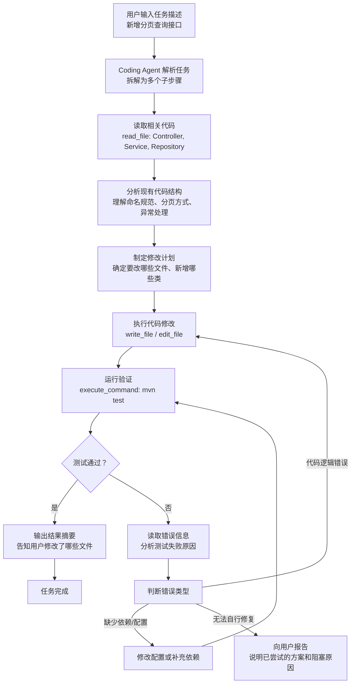

# 第2章 Agentic Coding 工作机制

## 本章要解决的问题

写完这一章，你会搞清楚三件事：

1. **Agentic Coding 到底是什么，和你已经在用的代码补全、Chat 编程有什么区别。** 很多程序员用了半年 AI 工具，仍然说不清这三者的边界，碰到复杂任务不知道选哪种方式最合适。
2. **Coding Agent 内部到底是怎么工作的。** 不是表面的「AI 帮你写代码」，而是从你输入一句需求开始，Agent 经历了哪些步骤才产出一段可运行的代码。
3. **怎么在实际项目中安全、高效地使用它。** 作为一个十年 Java 后端，你关心的不是玩具 demo，而是：怎么防止它乱改生产代码、一次给多少任务合适、出错时怎么快速止损。

目标读者是你自己 -- 有经验的 Java 后端开发，熟悉 Spring Boot、Maven/Gradle、MySQL、Redis 这套技术栈，日常用 Claude Code 或 Codex。本章不教基础概念，直接讲工作机制和实战方法。

---

## Agentic Coding 是什么

**Agentic Coding 是一种让 AI 自主完成多步骤编程任务的工作模式。** 和传统的「你问一句、AI 答一句」不同，Agentic Coding 的核心特征是 **自主循环**：AI 拿到一个目标后，自己规划步骤、执行操作、观察结果、修正错误，直到任务完成或遇到无法解决的阻塞。

打个比方：

- **代码补全** 像一个帮你接话的同事 -- 你写 `public User findById(`，它帮你补上 `Long id)`。
- **Chat 编程** 像一个你可以随时请教的专家 -- 你把问题描述清楚，它给你一段代码或方案，你来执行和验证。
- **Agentic Coding** 像一个你分配任务的 junior 程序员 -- 你告诉它「给 UserService 加一个按部门分页查询的方法，包括 Controller、Service、Repository 三层，写单元测试」，它自己读代码、写代码、跑测试、修错误，最后告诉你做完了。

Agentic Coding 的「Agent」不是营销词汇。它对应一个技术事实：AI 模型通过 **工具调用** 获得了对开发环境的操作能力 -- 读文件、写文件、执行命令、搜索代码 -- 然后用一个 **反馈循环** 把操作结果喂回模型，驱动下一步决策。

这就是 Agentic Coding 和 Chat 编程的本质区别：**Chat 编程是单向输出，Agentic Coding 是闭环迭代。**

---

## Coding Agent 的工作机制

下面用 Mermaid 流程图展示一个完整的 Agentic Coding 循环。以「给 Spring Boot 项目新增一个带分页和条件筛选的查询接口」为例：



### 每一步在干什么

**第一步：解析任务。** Agent 不是直接开始写代码。它先理解你的需求：这是一个查询接口，需要分页，需要条件筛选，需要三层都写。

**第二步：读取现有代码。** 这是 Agentic Coding 和 Chat 编程最关键的区别。Agent 会主动调用 `read_file` 工具去读你项目里的 Controller、Service、Repository，理解现有的代码风格、分页实现方式（Spring Data Pageable 还是手动分页）、异常处理模式、返回值包装类。

**第三步：分析代码结构。** 读完之后，Agent 内部推理：这个项目的 Controller 返回 `Result<T>` 包装类，Service 层用 `PageHelper` 做物理分页，Repository 继承 `JpaRepository`。这些信息决定了新代码应该怎么写，而不是凭空生成一段风格不搭的代码。

**第四步：制定修改计划。** Agent 在内部整理出：要新建 `UserQueryDTO`、修改 `UserController` 加一个 GET 方法、修改 `UserService` 和 `UserServiceImpl` 加查询方法、`UserRepository` 可能需要加一个 `@Query` 注解方法。

**第五步：执行修改。** 调用 `write_file` 或 `edit_file` 工具实际写入代码。这里不是一次调一个文件，而是一次调一组相关的修改，减少来回次数。

**第六步：运行验证。** 这是 Agentic Coding 的杀手特性。Agent 执行 `mvn test -Dtest=UserControllerTest`，观察测试是否通过。

**第七步：观察结果。** 如果测试通过，任务完成，Agent 向你报告。如果失败，Agent 读取失败日志，分析原因。

**第八步：继续修复。** 根据错误类型决定下一步：编译错误就修正语法，逻辑错误就修正实现，缺依赖就加依赖。然后再次执行验证。这个「修改-验证-修复」循环可以自动迭代多轮，直到测试通过或遇到无法自行解决的问题。

---

## 为什么 Agentic Coding 不等于代码补全

很多程序员把 AI 编程工具统称为「AI 写代码」，这混淆了三个完全不同的东西。

**代码补全是「续写」思维。** 它的工作方式是：你写前半句，AI 猜后半句。输入是光标前的上下文，输出是光标后的一小段代码。它不关心你的项目结构，不关心这段代码能不能编译，不关心测试过不过。它的唯一目标是：在当前光标位置插入一段看起来合理的代码。

**Agentic Coding 是「完成」思维。** 它的工作方式是：你给一个目标，AI 自主拆解步骤并执行，直到目标达成。输入是整个代码库的上下文加任务描述，输出是可运行的代码加验证结果。它需要理解项目结构、需要保证代码可编译、需要跑测试确认正确性。

举一个具体的 Java 开发场景来感受区别：

你要给项目加一个「批量更新用户状态」的接口。这是一个常见的后端需求，涉及 Controller 接收 ID 列表和新状态、Service 做批量更新、加上事务注解、写单元测试覆盖正常路径和异常路径。

- **代码补全**：你在 `UserController` 里开始写 `@PostMapping("/batch-update-status")`，然后 IDE 里的 AI 插件帮你补了方法签名和两三行代码。Service 层的逻辑、事务注解、测试代码，全部需要你自己写。
- **Agentic Coding**：你在 Claude Code 里输入「给 UserController 加一个批量更新用户状态的接口，接收 List<Long> userIds 和 String status，在 Service 层用 @Transactional 做批量更新，写单元测试」。Agent 自己去读 Controller、Service、Repository 的代码，了解项目的事务配置和测试框架，写好三层的代码，跑测试，如果失败了自己查看错误修好，最后告诉你完成了。

**核心差异不是「智能程度」，而是「工作模式」。** 代码补全是你在驾驶，AI 帮你踩油门。Agentic Coding 是 AI 自己开车，你给目的地。

---

## 三种 AI 编程模式的对比

| 维度 | 代码补全 | Chat 编程 | Agentic Coding |
|------|----------|-----------|----------------|
| **交互模式** | IDE 内实时续写 | 对话式问答 | 自主执行循环 |
| **任务粒度** | 行级/块级 | 函数级/文件级 | 功能级/模块级 |
| **上下文范围** | 当前文件 + 打开的其他文件 | 你粘贴的代码片段 | 整个代码库 |
| **主动性** | 被动续写，等你键入 | 被动回答，等你提问 | 主动规划、执行、修复 |
| **验证能力** | 无 | 无（你自行验证） | 内置：跑编译、跑测试、看日志 |
| **错误修复** | 无 | 你描述错误，AI 给新方案 | 自动读错误、分析原因、修复 |
| **安全性** | 相对安全（只补代码片段） | 安全（不操作文件） | 需要权限控制（可直接改文件） |
| **适合场景** | 日常编码中的重复性补全 | 算法咨询、方案讨论、代码审查 | 完整功能开发、重构、BUG 修复 |
| **代表工具** | GitHub Copilot、Tabnine、Codeium | ChatGPT、Claude.ai | Claude Code、Codex CLI |
| **工作效率** | 节省 10-20% 敲键盘时间 | 加速方案设计和技术调研 | 完整功能可委托，节省 50-70% 时间 |

**三种模式不是互斥的，是互补的。** 在一个功能开发中，你可以用 Chat 编程讨论方案，用代码补全加速日常编写，用 Agentic Coding 完成整个子模块的开发和测试。有经验的程序员会根据任务特点切换模式，而不是固守一种。

---

## Claude Code / Codex 的完整工作循环解析

Claude Code 和 Codex 是目前最主流的两个 Coding Agent 实现。它们的工作循环在原理上相同，在细节上有差异。下面以 Claude Code 为主拆解一个完整循环，Codex 做对比说明。

### Claude Code 的工具集

Claude Code 提供了以下工具，这些工具组合起来构成了对代码仓库的完整操作能力：

| 工具 | 功能 | 在 Agent 循环中的作用 |
|------|------|----------------------|
| `Read` | 读取文件内容 | 理解现有代码结构 |
| `Write` | 创建或覆盖文件 | 生成新代码 |
| `Edit` | 精确替换文件中的字符串 | 修改已有代码，避免重写整个文件 |
| `Bash` | 执行 Shell 命令 | 运行编译、测试、Lint、Git 操作 |
| `Glob` | 按通配符搜索文件名 | 找到项目中的相关文件 |
| `Grep` | 按正则搜索文件内容 | 定位特定代码片段、引用关系 |
| `WebSearch` | 搜索网络 | 查阅最新 API 用法、框架文档 |
| `WebFetch` | 获取网页内容 | 读取官方文档、StackOverflow 答案 |

### 一个真实案例的完整循环

假设你在一个 Spring Boot 项目中输入：

> 把 UserController 里的分页查询从 PageHelper 物理分页改成 Spring Data 的 Pageable 分页，保持接口签名不变。

以下是 Claude Code 内部发生的事（省略了部分中间交互）：

**第 1 轮：信息收集**

```
Agent 调用 Grep: 搜索 "UserController" 找到文件路径
Agent 调用 Read:  读取 UserController.java
Agent 调用 Grep:  搜索 "PageHelper" 找到所有使用点
Agent 调用 Read:  读取 UserServiceImpl.java（含分页逻辑）
Agent 调用 Read:  读取 UserRepository.java（确认已继承 JpaRepository）
```

**第 2 轮：制定计划**

Agent 内部推理（你不会在界面上看到完整内容，但大致逻辑是这样）：
- `UserController` 的 `listUsers` 方法接收 `pageNum` 和 `pageSize` 整型参数
- `UserServiceImpl` 里调用了 `PageHelper.startPage(pageNum, pageSize)` 然后执行查询
- 目标：改成 Spring Data 的 `Pageable`，Controller 方法签名不变
- 需要改的文件：`UserController.java`（参数类型）、`UserServiceImpl.java`（去掉 PageHelper，用 Pageable）、可能还需要确认 PageHelper 依赖能否从 pom.xml 中移除

**第 3 轮：执行修改**

```
Agent 调用 Edit: 修改 UserController.java
       - int pageNum, int pageSize → @PageableDefault Pageable pageable
       
Agent 调用 Edit: 修改 UserServiceImpl.java
       - 删除 PageHelper.startPage() 调用
       - repository.findAll(spec, pageable) 直接返回 Page<>
       - 手动构造分页结果对象
```

**第 4 轮：运行验证**

```
Agent 调用 Bash: mvn compile -q
       → 编译通过
       
Agent 调用 Bash: mvn test -Dtest=UserControllerTest -q
       → 有一个测试失败：expected pageNum=1 but was pageNum=null
```

**第 5 轮：分析错误**

```
Agent 调用 Read: 读取测试代码 UserControllerTest.java
Agent 发现：测试里传的是 pageNum=1, pageSize=10，返回结果里 pageNum 字段取自 Pageable 对象
Agent 意识到：手动构造分页结果时漏设了 pageNum
```

**第 6 轮：修复**

```
Agent 调用 Edit: 修复 UserServiceImpl.java 中分页结果的构造逻辑
```

**第 7 轮：重新验证**

```
Agent 调用 Bash: mvn test -Dtest=UserControllerTest -q
       → Tests run: 5, Failures: 0, Errors: 0
```

**第 8 轮：检查副作用**

```
Agent 调用 Grep: 搜索 "PageHelper" 确认没有残留引用
Agent 调用 Grep: 搜索 "import com.github.pagehelper" 确认 import 已清理
Agent 输出：任务完成，修改了 UserController.java 和 UserServiceImpl.java
```

整个过程中，你只发了一条指令，剩下的工作 Agent 自己完成了。关键不是它写得有多好，而是 **它自己发现了错误并修好了** -- 这是 Agentic Coding 区别于以往所有 AI 编程工具的核心能力。

### Codex 的差异

Codex（OpenAI Codex CLI）的工作循环与 Claude Code 类似，区别主要在：

- **工具粒度**：Codex 更倾向于一次生成完整文件，而 Claude Code 的 `Edit` 工具支持精确的字符串替换，对已有文件的大文件修改更友好。
- **模型策略**：Codex 默认使用 GPT 系列模型，在代码生成的一次性准确率上可能更高，但在多轮修复循环中的自我纠错能力上，两者的差异取决于具体任务。
- **安全沙箱**：Codex 支持更细粒度的权限控制，可以配置为「允许读取整个项目但只允许写入特定目录」。

---

## 如何正确使用 Claude Code / Codex 完成开发任务

### 写清楚任务描述

Agent 越清楚你的意图，完成质量越高。好的任务描述包含四个要素：

1. **做什么**：明确的功能描述
2. **在哪里**：涉及的文件或模块，如果知道的话
3. **怎么做**：技术约束（如「用 MyBatis-Plus 的分页插件」「保持现有异常处理方式」）
4. **验证标准**：怎么算完成（如「确保所有现有测试通过」「新增的接口需要写集成测试」）

**对比一下：**

差：`改一下用户查询接口`

好：

```
修改 UserController 中的 /users/search 接口：
- 把查询参数从 @RequestParam 三个单独字段改成接收 UserSearchDTO
- UserSearchDTO 包含：keyword(模糊匹配name和email字段)、departmentId(精确匹配)、status(精确匹配)、createTimeRange(时间范围)
- Service 层用 JpaSpecificationExecutor 动态构建查询条件
- 分页保持现有的 Pageable 方式不变
- 写 UserSearchDTO 的单元测试（字段校验）
- 修改 UserControllerTest 中相关测试用例适配新参数
- 确保 mvn test 全部通过
```

差别不在于字数，而在于好的描述消除了歧义：参数怎么传、用什么技术实现、改哪些文件、怎么算完成，全部明确了。

### 先让它读，再让它写

对于已有项目的修改，不要直接说「在某个文件里加一个方法」。让 Agent 先理解上下文：

```
先读一下 UserController.java 和 UserServiceImpl.java，理解现有的 CRUD 接口是怎么组织的，然后参照这个模式新增一个「按角色查询用户列表」的接口。
```

「参照现有模式」这四个字的价值在于：它保证了新代码和已有代码在命名、异常处理、返回值包装、日志记录这些细节上保持一致。大多数 AI 写的烂代码不是逻辑错误，而是风格不一致。

### 善用验证循环

Agentic Coding 最大的优势不是写代码，而是修错误。但你得让它跑验证：

```
写完代码后，运行 mvn compile 确认编译通过，然后运行相关的单元测试。如果失败，分析原因并修复。
```

你不需要手动跑测试看结果再告诉 Agent 哪里错了 -- 你只需要在任务描述里加上这句话，Agent 会自己完成「写代码-编译-测试-修复」的循环。

### 分阶段提交

不要让 Agent 一口气改完十个文件然后你一次性 Review。每完成一个独立的子任务就提交：

```
先完成 DTO 的定义和测试，我确认后继续改 Service 层。
```

这样做的好处：
- 出错时回滚范围小
- 你可以逐步确认方向正确
- Git 历史清晰，方便以后 review

---

## 如何设计安全边界，避免 AI 乱改

这是在实际项目中使用 Agentic Coding 最需要重视的问题。AI 的「自主性」是一把双刃剑 -- 它能帮你省时间，也可能改坏代码。

### 文件级：.gitignore 与 CLAUDE.md 指令

**不要把敏感文件暴露给 Agent。** 如果你的项目里有生产环境的配置文件、包含真实密钥的 .env，确保它们在 .gitignore 里，这样 Agent 在读取文件时不会接触到。

在项目的 CLAUDE.md 中明确声明权限边界：

```markdown
## AI 协作规则

- 允许修改：src/main/java/、src/test/java/
- 不允许修改：src/main/resources/application-prod.yml、pom.xml（除非明确要求）
- 涉及数据库 schema 变更时，必须先讨论方案
- 禁止执行 mvn deploy、git push、数据库迁移命令
```

Claude Code 和 Codex 都会读取 CLAUDE.md 作为行为约束。在 CLAUDE.md 中写好边界是成本最低的安全措施。

### 目录级：权限控制

- **Claude Code**：支持通过 settings.json 配置 `allowedPaths` 和 `deniedPaths`，限制 Agent 的读写范围。
- **Codex**：支持 `--sandbox` 模式，可以指定 Agent 只能操作哪些目录。

对于结构化项目，最简单的做法是让 Agent 的工作范围限定在 `src/main/java/` 和 `src/test/java/`，这样可以避免误改配置文件、构建脚本和部署描述符。

### 命令级：禁止高危操作

在 Agent 配置中明确禁止以下命令：

```json
{
  "deniedCommands": [
    "rm -rf",
    "git push",
    "git push --force",
    "mvn deploy",
    "DROP TABLE",
    "DELETE FROM"
  ]
}
```

大多数 Coding Agent 支持命令白名单/黑名单配置。至少，你应该让 Agent 在执行以下命令前需要你的明确确认：
- 任何 Git 写操作（push、force push、hard reset）
- 数据库 schema 变更
- 构建产物发布（deploy、publish）

### 验证前置：让测试成为安全网

在你允许 Agent 改代码之前，确保项目有足够的测试覆盖。如果项目的单元测试覆盖率低于 50%，不建议让 Agent 自由修改核心业务代码 -- 没有测试兜底，AI 引入的 bug 你可能很久以后才会发现。

**建议的工作流程：**

1. 让 Agent 先补测试，你 Review 通过
2. 再让 Agent 做功能修改，利用已有测试保护回归
3. 最后让 Agent 补充新功能的测试

这样，测试覆盖率是在上升而不是下降的。

---

## 任务粒度控制：一次给多少任务合适

这是一个经验问题。给太少浪费上下文，给太多 Agent 容易迷失。

### 粒度参考

| 任务规模 | 描述 | 适合场景 | 预计时间 |
|----------|------|----------|----------|
| **微任务** | 修改一个方法、加一个字段校验 | 小修小补 | 1-2 分钟 |
| **小任务** | 新增一个 DTO + Mapper 方法 + Service 方法 | 单个接口开发 | 3-5 分钟 |
| **中任务** | 完整功能：Controller + Service + Repository + 测试 | 标准功能点 | 5-15 分钟 |
| **大任务** | 一个完整的业务模块，涉及多张表、多个接口 | 风险较高，建议拆分 | 不好预估 |

### 拆分原则

**高内聚低耦合原则同样适用于给 AI 分配任务。** 一个任务涉及的文件应该相互紧密关联。比如「用户模块的 CRUD 接口」是高内聚的任务，「用户模块的查询接口 + 订单模块的统计图表」是低内聚的，应该拆成两个。

**依赖方向原则。** 先做被依赖的，后做依赖别人的。比如先让 Agent 写公共的 DTO 和工具类，确认无误后再写业务代码。反过来，如果 Agent 先写了 Controller 后发现缺一个 DTO，它会临时造一个，这个临时造的 DTO 可能和后面的不一致。

**独立性原则。** 每个任务应该有独立的验证标准。如果你分配的任务需要多个步骤且中间无法独立验证，说明这个任务应该再拆分。

### 实际例子

假设你要做一个「员工管理」模块，包含员工的基本信息 CRUD、部门关联、离职状态管理。

**不推荐的分配方式：**

> 帮我实现员工管理模块的全部功能。

Agent 可能会生成一堆代码，但每个部分都可能有问题，你需要一次性 review 十几个文件。

**推荐的分配方式：**

> 任务 1：创建 Employee 实体类和对应的数据库迁移脚本。用 JPA 注解，包含 id、name、email、departmentId、status、createTime、updateTime 字段。先只做实体定义，不写业务代码。

> 任务 2：（确认实体正确后）基于 Employee 实体，完成基本的 CRUD：Controller 的 GET/POST/PUT/DELETE、Service、Repository。参照 UserController 的代码风格。写单元测试。

> 任务 3：（确认 CRUD 完成后）添加分页查询和条件筛选：按 departmentId 筛选、按 status 筛选、按 name 模糊搜索。写对应测试。

> 任务 4：添加离职功能：PUT /employees/{id}/resign，修改 status 同时记录离职日期和原因到单独的 EmployeeResignRecord 表。

每一步完成后你 Review 并确认，然后进入下一步。每步的 Git commit 也是独立的，出问题可以精准回滚。

---

## 常见误区

### 误区一：把 Agent 当成万能的

**实际情况：** Agent 擅长在已有模式上扩展，不擅长从零设计架构。如果你让它「设计一个高并发秒杀系统」，它会给一个看起来合理的方案，但这个方案没有经过压力测试，可能在实际并发下崩溃。

**正确的用法：** 你做架构决策，Agent 做实现细节。你说「用 Redis 分布式锁 + 数据库乐观锁来实现扣库存」，Agent 负责把这些逻辑写成代码。

### 误区二：一次给太多上下文

**实际情况：** 把整个项目的所有文件都塞给 Agent，不如给它精准的小范围上下文。Agent 的上下文窗口有限，无关代码会稀释关键信息，导致输出质量下降。

**正确的用法：** 指定具体模块或文件范围。比如「在 com.example.user 包下」而不是「在整个项目里」。

### 误区三：不验证直接合入

**实际情况：** Agent 写的代码和你自己写的一样会包含 bug。不同的是，你自己的 bug 你在写的时候就大概知道哪里容易出错，Agent 的 bug 你可能完全没意识到。

**正确的用法：** Agent 的输出必须经过 Review。运行测试是最低要求，最好再用 IDE 打开改动的文件快速浏览一遍。AI 有时会在代码里夹带奇怪的东西 -- 比如一个从来不会被调用的 private 方法，或者一条没有实际用途的 import。

### 误区四：不和 Agent 讨论方案，直接让它写

**实际情况：** 如果你不确定最佳实现方式，先和 Agent 讨论方案，让它给出几个选项并分析利弊，选定后再让它写代码。

**正确的用法：**

```
# 先讨论
用 MyBatis-Plus 的分页插件和 Spring Data 的 Pageable，在这个项目里哪个更合适？

# 选定后再写
用 Pageable，按刚才讨论的方案实现。
```

这比直接让它写然后反复修改高效得多。

### 误区五：Agent 第一轮没写好就放弃

**实际情况：** Agentic Coding 的核心价值恰恰在于它能在反馈循环中自我修复。第一版代码不完美是正常的。关键是给它明确的错误信息，让它自己修。

**正确的用法：** 「生成的代码在 XX 场景下有 NPE，run 一下这个测试用例看看，然后修复它。」

### 误区六：依赖 Agent 学新技术

**实际情况：** Agent 可以帮你写你不熟悉的框架代码，但它写出来的代码可能用的是过时的 API 写法和反模式。因为它的训练数据包含了大量低质量代码。

**正确的用法：** 对于你不熟悉的技术，你应该先花时间看懂官方文档的核心概念，然后再让 Agent 辅助编写。你理解概念、Agent 负责拼写 -- 这个分工才合理。

---

## 风险与边界

### 安全风险

**代码注入。** 如果 Agent 读取了包含恶意注释的代码，它可能在不经意间将恶意模式复制到其他文件中。确保你的代码库干净，没有来源不明的代码片段。

**敏感信息泄露。** 你的代码会被发送到云端 API 处理。如果你的代码里硬编码了 API Key、数据库密码、内网地址，这些信息会离开你的机器。**使用环境变量或配置中心管理敏感信息，不要在代码里硬编码。** 这是良好的安全实践，和用不用 AI 无关。

**权限越界。** Agent 工具的执行能力取决于你给它多少权限。如果你让 Agent 拥有 `sudo` 权限，它就能做任何事。始终以最小权限原则配置 Agent。

### 质量风险

**风格不一致。** Agent 可能在不同的任务中使用不同的代码风格，因为你每次对话的上下文是独立的。解决方法：在 CLAUDE.md 中声明代码风格规范，让 Agent 每次执行前先读取。

**过度工程。** Agent 倾向于写出比实际需要更复杂的代码。你让它加个查询方法，它可能顺便帮你加了缓存、加了异步、加了重试机制。Review 时重点砍掉这些「附赠品」。

**测试覆盖率幻觉。** Agent 可能写出「看起来覆盖了所有分支」但「实际上没有验证任何业务逻辑」的测试。比如所有测试都只测了 null 输入，从不测正常业务流程。Review 测试代码时，关注断言是否真正验证了业务逻辑。

### 流程风险

**跳过 Code Review。** Agent 写完你直接合入，这个习惯会毁掉代码质量。把 Agent 的输出当作一个 junior 程序员的 PR 来 review。

**假阳性通过。** Agent 运行测试时可能只跑了部分测试类，或者跳过了失败用例。确认 Agent 执行了完整测试套件，而不是单独的测试文件。

**上下文断裂。** Agent 的一次对话结束后，下一次新对话不会记得之前做了什么。这就是为什么 CLAUDE.md 那么重要 -- 它是跨会话的持久记忆。每次完成重要变更后，更新 CLAUDE.md 记录项目当前状态和关键决策。

---

## 本章小结

Agentic Coding 的核心是 **自主循环**：读取代码、分析理解、制定计划、执行修改、运行验证、观察结果、修复错误 -- 这个闭环让 AI 从「辅助工具」变成了「执行者」。

它不是要替代程序员，而是改变了程序员的工作方式。你把精力从「怎么写」转移到「做什么」和「怎么验证」。技术决策和代码审查仍然是你不可替代的价值。

三个关键原则记住：

1. **先让它读再让它写。** 给 Agent 上下文比给它指令更重要。
2. **测试兜底。** 没有测试的项目不适合深度使用 Agentic Coding。先补测试，再让它改代码。
3. **小步快跑。** 拆成小任务，每步验证，逐步构建。一次给太多，Agent 迷失，你 Review 痛苦。

---

## 实战练习

以下练习在你自己的 Spring Boot 项目上完成，建议使用 Git 分支隔离实验。

### 练习 1：体验三种模式的差异（30 分钟）

选取项目中一个已有的查询接口。分别用以下三种方式尝试修改它（加一个新的筛选条件）：

1. **纯代码补全模式**：不主动和 AI 对话，只依赖 IDE 里的代码补全插件，手动完成修改。
2. **Chat 编程模式**：在 ChatGPT 或 Claude.ai 中描述需求，复制生成的代码到项目中。
3. **Agentic Coding 模式**：用 Claude Code 或 Codex 在项目根目录下直接给指令，让它读代码、修改、运行测试。

记录每种方式的：花费时间、遇到的问题、最终代码质量感受。

### 练习 2：拆解一个完整功能（45 分钟）

选一个你计划开发但还没开始的功能。按本章的任务粒度建议，把它拆成 3-5 个顺序执行的小任务。为每个任务写一段完整的需求描述（包含：做什么、在哪里、怎么做、怎么验证）。

让 Agent 逐个完成，每步结束后你 Review 并确认下一步。记录 Agent 在哪些步骤做得好，哪些步骤需要你反复纠正。

### 练习 3：设计安全边界（15 分钟）

为你当前的项目更新 CLAUDE.md，添加 AI 协作安全规则：

- 声明允许 Agent 修改的目录范围
- 声明禁止 Agent 执行的命令
- 声明代码风格要求（命名规范、异常处理方式、日志格式）

---

## 自测问题

回答以下问题来检验你的理解。如果你能不看前文完整作答，这一章就真正掌握了。

1. **Agentic Coding 的核心工作循环包含哪几个步骤？** 用自己的话描述每一步在做什么。
2. **代码补全、Chat 编程、Agentic Coding 的本质区别是什么？** 不是功能列表，而是工作模式的根本不同。
3. **为什么 Agentic Coding 需要「先读再写」？** 如果 Agent 不读现有代码直接写，会出现什么问题？在你的项目中举一个具体例子。
4. **Agent 执行 `mvn test` 失败后会发生什么？** 描述 Agent 处理失败的完整流程。
5. **如何防止 Agent 误改生产配置？** 列举至少三种具体的防护措施。
6. **一个「新增用户查询接口」的任务，怎样拆分成合理的子任务？** 写出你的拆分方案，并说明为什么这样拆而不是更粗或更细。
7. **Agent 写完代码后，你的 Review 重点应该放在哪些方面？** 不是「检查代码有没有 bug」这类笼统的回答，而是具体要检查什么。
8. **Agent 生成的测试代码可能有哪些隐蔽问题？** 结合上面「常见误区」和「风险与边界」的内容回答。
