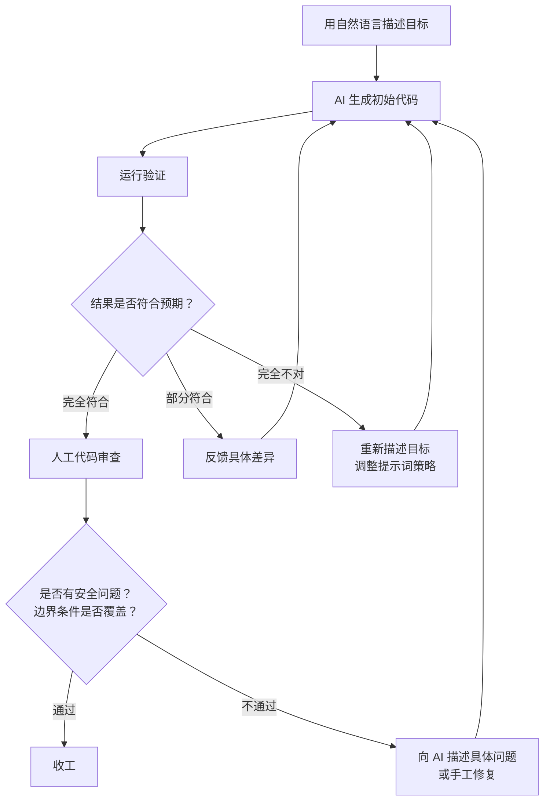

# 第三章：Vibe Coding 方法论

## 本章要解决的问题

读完本章，你会清楚知道：

- Vibe Coding 到底是什么，它怎么来的，为什么在2025年突然火了。
- 哪些场景用它效率极高，哪些场景用了就是给自己挖坑。
- 一套可操作的 Vibe Coding 流程，拿来就能用。
- 它和传统开发、Agentic Coding 的本质区别在哪。
- 为什么企业不能放任团队无治理地使用 Vibe Coding。
- 一个真实的 Spring Boot 接口测试小工具完整示例，从提示词到最终成品。

---

## Vibe Coding 是什么

### 定义

**Vibe Coding** 是一种以自然语言描述意图、由 AI 直接生成可运行代码、通过快速试错迭代来完成软件开发的轻量级编程范式。它的核心特征是：程序员不逐行写代码，而是用自然语言向 AI 描述"我想要什么"，然后运行、观察、反馈、再生成，循环迭代直到满意。

这个词由 OpenAI 联合创始人 Andrej Karpathy 在2025年初提出。他这样描述自己的体验：

> "有一种新的编程方式，我称之为 'vibe coding'——你完全沉浸在 vibe 里，拥抱大模型，忘记代码的存在。你只描述你想要什么，AI 生成代码，你运行它，如果不对就反馈，然后继续。你几乎不看代码本身。"

这个描述准确地击中了当时大量开发者的真实体验：用 Claude、ChatGPT、Cursor、Copilot 写代码时，很多人发现自己越来越"不看代码"，越来越依赖"描述-生成-运行-反馈"这个循环。

### 起源：从 Stack Overflow 到自然语言

回顾程序员获取"外部帮助"的演进路径，事情变得很清楚：

| 时代 | 获取帮助的方式 | 典型耗时 |
|------|---------------|---------|
| 2008以前 | 查纸质书、看 MSDN/Javadoc | 几十分钟到几小时 |
| 2008-2020 | Stack Overflow 搜索、复制粘贴、改参数 | 几分钟到几十分钟 |
| 2021-2023 | GitHub Copilot 行内补全、写注释生成函数体 | 几秒到几分钟 |
| 2024-2025 | Claude/ChatGPT 对话生成完整文件/项目 | 几十秒到几分钟 |

每一步都在缩短"想法"到"可运行代码"之间的距离。Vibe Coding 是这个趋势的自然终点（至少是当前的终点）：你脑子里有个画面，用自然语言说出来，AI 把它变成代码，你跑起来看效果。中间没有"逐行思考语法"这个步骤了。

---

## 它为什么流行

Vibe Coding 在2025年大范围流行，不是偶然的。以下几个因素叠加推动了它的爆发：

**1. 模型能力过了临界点**

2024年下半年到2025年初，Claude 3.5 Sonnet、GPT-4o、Claude 4 等模型在代码生成任务上的能力突破了可用性门槛。生成的代码不再是"大部分对但总有个小错"，而是"90%以上情况跑得通"。这个体验差异是质变的。

**2. 反馈循环极短**

传统开发中，从"我想加个功能"到"看到效果"可能几小时甚至几天。Vibe Coding 把这个循环压缩到了秒级。这种即时满足感让人上瘾，也极大地加速了试错。

**3. 非程序员也能参与了**

产品经理、设计师、甚至完全不懂代码的业务人员，用自然语言就能让 AI 生成一个可用的原型。虽然他们写的"代码"可能有问题，但"能用就行"的场景下，这已经够了。

**4. 社交传播的放大器效应**

大量开发者晒出"零代码经验做了一个 App""用一句话生成一个完整网站"的视频，推动了 Vibe Coding 的出圈。Karpathy 的推特起到了催化剂的作用。

**5. 工具链成熟**

Cursor、Windsurf、Cline、Claude Code 这类工具把 AI 的能力直接嵌入了 IDE 和终端，让 Vibe Coding 从一个"ChatGPT 网页里复制粘贴"的尴尬流程，变成了一个流畅的开发体验。

---

## 它适合哪些场景

Vibe Coding 不是银弹。它在以下场景表现极好：

### 原型验证

你有一个产品想法，想在半天内做出一个能跑的东西给老板或投资人看。Vibe Coding 是这个场景的最佳选择。你不需要考虑架构、可维护性、边界条件，只需要"看起来像那么回事"。

### Demo 和演示

明天要给客户做 Demo，需要一个能演示核心流程的系统。自己从头写时间不够，用 Vibe Coding 一个晚上就能搞出来。

### 技术探索和调研

你想知道"用 Spring AI 接 Claude 要写多少代码""WebSocket 长连接在 Spring Boot 里怎么实现"，与其看三天文档，不如让 AI 生成一个可运行的最小示例，跑起来调几下就懂了。

### 小工具和脚本

内部用的数据转换脚本、日志分析小工具、批量重命名工具、简单的自动化脚本。这些工具生命周期短、用户只有你自己或少数同事，可维护性完全不重要。

### 个人项目

你自己用的记账工具、博客系统、Todo 应用。你既是开发者又是用户，出了问题你自己知道、自己修。

### 一次性代码

跑一次就扔的数据迁移脚本、临时报告生成器、实验性分析代码。写完就跑，跑完就不要了。

---

## 它不适合哪些场景

以下场景用 Vibe Coding 是在给自己和团队埋雷：

### 企业生产系统

面向数万甚至数百万用户的系统，任何故障都直接影响收入和声誉。Vibe Coding 生成的代码没有经过系统的架构设计，没有考虑高可用、灾难恢复、灰度发布、监控告警。这样的代码进生产等于自杀。

### 金融核心系统

涉及资金交易、账务处理、风险计算的核心系统。这类系统对正确性的要求是"不能错"而非"大概率对"。Vibe Coding 的生成代码缺少形式化验证、缺少边界条件的穷举测试、缺少对并发和事务的严格保证。

### 需合规审计的系统

医疗（HIPAA）、金融（PCI-DSS、SOX）、政务（等级保护）等领域的系统需要完整的审计追踪、代码审查记录、安全扫描报告。Vibe Coding 生成的代码没有这些过程的痕迹，合规审计根本过不了。

### 长期维护的基础设施

中间件、基础库、框架、公共组件。这些代码会被几百个团队依赖，任何改动都要考虑向后兼容、性能影响、安全边界。Vibe Coding 做不到这种级别的审慎。

### 安全敏感的系统

认证授权系统、加密模块、安全网关。Vibe Coding 的代码可能有微妙的权限绕过、不安全的默认配置、过时的加密算法。等你发现的时候，数据可能已经泄露了。

### 一个简单的判断标准

问自己：**如果这段代码明天凌晨三点出故障，有人会半夜被叫起来修吗？** 如果答案是"是"，那就不要用 Vibe Coding 来写它。

---

## Vibe Coding 的标准流程



这不是一个理论上的流程。让我用一次真实的 Vibe Coding 经历来展开每一步：

### 第一步：用自然语言描述目标

这是最关键的一步。你的描述质量直接决定了生成质量。一个不好的描述：

> "帮我写个测试工具"

好的描述：

> "我需要一个 Spring Boot 应用，启动后提供一个 Web 页面。在这个页面上，我可以输入一个 REST API 的 URL、请求方法（GET/POST/PUT/DELETE）、请求头和请求体，点击发送后显示响应状态码、响应头和响应体。响应体如果是 JSON 要格式化显示，如果是其他格式就原样显示。整个应用打包成一个可执行的 JAR，不需要数据库。"

关键要素：技术栈、功能边界、输入输出、运行方式、不需要什么。

### 第二步：AI 生成初始代码

把你描述好的提示词发给 AI（Claude、ChatGPT、Codex 等），它会生成一批文件。在 Claude Code 中，AI 会直接在你的项目目录里创建文件；在 ChatGPT 中，你会拿到代码块需要手动复制。

### 第三步：运行验证

代码生成后，第一时间跑起来看效果。不要先读代码，先跑。很多时候你读代码以为有问题的地方其实是对的，你以为没问题的地方反而炸了。

```bash
mvn spring-boot:run
# 或者
java -jar target/demo-0.0.1-SNAPSHOT.jar
```

### 第四步：反馈修改

这是 Vibe Coding 最有价值的部分，也是最考验沟通能力的部分。反馈不是说"改一下"，而是精准描述差异：

**差的反馈：**
> "页面有点丑"

**好的反馈：**
> "输入框和按钮的间距太小，增加16px的间距。整个页面宽度限制在800px并居中。添加一个简单的标题栏。"

**差的反馈：**
> "有bug"

**好的反馈：**
> "发送请求后，响应区域没有清空上一次的结果，导致新旧结果混在一起。每次点击发送时，清空响应区域再显示新结果。"

### 第五步：继续迭代

重复"反馈→生成→运行→反馈"的循环。通常3-5轮就能得到一个相当可用的东西。超过10轮还在来回改，说明你的初始描述不够好，或者这个问题本身超出了当前模型的能力。

### 何时停下来

三个信号告诉你该停了：

1. **功能满足需求了**：你最初描述的核心功能都能用了。
2. **边际收益已经很低**：再加一轮迭代，改进的幅度已经很小。
3. **"差不多"的感觉**：你开始纠结字体大小、颜色微调这类细节，而不是功能问题。

到了这个点，要么收工，要么切回传统开发模式手工打磨。

---

## Vibe Coding 的优势

### 极快的开发速度

一个熟练的 Vibe Coder，可以在30分钟内做出一个传统开发需要半天到一天的功能原型。这不是夸张——你省掉的是查文档、写类结构、处理配置、写模板代码的时间。

### 低技术门槛

不懂前端的人能做出带页面的工具，不懂 DevOps 的人能搞出 Dockerfile。AI 填补了知识盲区。

### 创意友好

你有一个想法，但不确定值不值得投入时间。Vibe Coding 让你可以花半小时验证一下，而不是花三天。这个"试错成本极低"的特性，鼓励了更多的探索和创新。

### 学习加速器

当你让 AI 生成一个你不熟悉的技术栈的代码时，跑通之后反过来读代码，比从头看文档学得快得多。你已经有了一个能工作的实例，然后去理解它为什么能工作。

---

## Vibe Coding 的风险

这一节必须诚实。Vibe Coding 的风险不是"偶尔有点问题"，而是系统性的。

### 可维护性差

AI 生成的代码往往缺少有意义的抽象。它能把功能做出来，但通常是一堆平铺直叙的代码，没有分层、没有模块化、没有清晰的责任边界。一个月后你回来看这段代码，会怀疑是不是别人写的。

### 架构不稳定

Vibe Coding 是"走一步看一步"的开发方式。每次迭代都只在上一轮代码上打补丁，没有整体架构规划。功能一复杂，代码就开始腐烂：重复逻辑、不一致的命名、混乱的依赖关系。

### 隐藏 Bug

AI 生成的代码能跑，但可能有你完全没意识到的 Bug。边界条件没覆盖、异常处理缺失、并发安全问题、资源泄漏。这些问题在你手动测试时不会暴露，但在生产环境的真实负载下会炸。

### 安全风险

这是最严重的问题。AI 模型训练数据里的大量代码都是不安全的，它会忠实地"学习"这些不安全实践：

**SQL 注入**：AI 可能会生成拼接 SQL 字符串的代码。
```java
// AI 可能生成这样的代码——绝对不要用
String query = "SELECT * FROM users WHERE name = '" + userName + "'";
```

**XSS 攻击**：AI 可能不会做输出编码。
```html
<!-- AI 可能直接渲染用户输入，中了 XSS -->
<div>${userInput}</div>
```

**权限绕过**：AI 可能忘记添加权限检查，或者只在某些路径上加了检查而遗漏了其他路径。

**不安全的默认配置**：AI 可能使用默认密钥、关闭认证、使用 HTTP 而非 HTTPS。

### 人不知道代码具体做了什么

当你越来越依赖 AI，你越来越不知道代码具体在干什么。这很危险——当问题发生时，你不知道该往哪找。

### 交付边界不清晰

传统开发有明确的交付边界：需求分析→设计→开发→测试→上线。Vibe Coding 中这个边界模糊了。什么叫"做完了"？AI 生成的代码算不算"完成了开发"？测试要不要做？做什么范围？这些问题没有标准答案。

---

## Vibe Coding vs 传统开发 vs Agentic Coding

很多人把这三个概念混为一谈。它们有关联但本质不同。

| 维度 | 传统开发 | Vibe Coding | Agentic Coding |
|------|---------|------------|----------------|
| **谁来写代码** | 程序员逐行写 | AI 生成，人做方向引导 | AI 自主规划并执行多步骤任务 |
| **决策粒度** | 每行代码都由人决策 | 整体目标由人定，实现细节交给 AI | AI 自己拆解任务、选方案、执行 |
| **反馈周期** | 编译/运行一次几秒到几分钟 | 描述到运行几十秒到几分钟 | AI 自己迭代，人只在关键节点审查 |
| **人的角色** | 作者 | 指挥者/编辑 | 审查者/批准者 |
| **代码质量** | 取决于程序员水平 | 取决于提示词质量和审查 | 取决于 AI 能力和约束规则 |
| **适用阶段** | 生产系统的核心模块 | 原型、工具、探索 | 需要多文件多步骤的任务 |
| **对编程能力要求** | 高 | 中 | 中高 |

### 关键区分

- **Vibe Coding**：你告诉 AI 要什么，AI 写代码，你看结果、反馈、继续改。你仍然在每个循环里做"要不要改、改什么"的决策。
- **Agentic Coding**：你给出一个高层目标，AI 自己规划步骤、创建文件、写代码、运行测试、修 Bug，最后给你结果。你在整个过程中可能只需要在几个关键节点确认一下。
- **传统开发**：你理解需求、设计架构、写代码、写测试、调试、重构。AI 可能帮你补全代码，但主要决策和实现都是你在做。

一个不精确但有用的类比：传统开发是你自己开车，Vibe Coding 是你坐在副驾指挥一个新手司机，Agentic Coding 是你给出租车司机一个地址然后自己看手机。

---

## 程序员如何正确使用 Vibe Coding

### 1. 把它当探索工具，不当生产线

Vibe Coding 最大的价值在于快速试错和学习。你不知道某个技术怎么用？让 AI 生成个例子跑一下。你有个想法不确定能不能实现？半小时用 Vibe Coding 验证一下。但不要把 Vibe Coding 生成的东西直接当产品用。

### 2. 每次迭代后必须读代码

Vibe Coding 最大的陷阱就是"不读代码"。你必须读。不一定要逐行精读，但至少要理解：这个类做什么、数据怎么流转、敏感操作在哪。如果你完全不了解代码在干什么，你就失去了对软件的控制。

### 3. 安全相关代码必须人工检查

涉及认证、授权、输入验证、SQL 操作、文件上传、加密解密的代码，必须逐行人工审查。看一个检查项清单：

- [ ] 所有用户输入是否经过了验证和清理？
- [ ] SQL 是否使用了参数化查询？
- [ ] 页面输出是否做了适当的编码？
- [ ] 认证和授权逻辑是否在所有路径上都生效？
- [ ] 敏感数据是否以明文存储或传输？
- [ ] 外部 API 的返回是否做了验证再使用？

### 4. 给 AI 设定约束

好的提示词不只是描述功能，还要描述约束。比如：

> "使用参数化查询，不要拼接 SQL 字符串"
> "所有用户输入都要做服务端验证"
> "不要使用 eval 或类似动态执行的方式"
> "遵循 Spring Boot 最佳实践，使用构造器注入而非字段注入"

### 5. 复杂逻辑先拆解再生成

不要让 AI 一次性生成一个包含十几个功能的庞然大物。拆成小的、职责单一的模块，逐个生成、逐个验证、逐个理解，然后手工组合起来。

### 6. 版本管理不能省

Vibe Coding 生成的代码也必须进 Git。每轮迭代做一次提交，方便回退。不要一个 `initial commit` 后面跟一堆乱七八糟的改动。

### 7. 做好随时手工接管的准备

当 AI 开始在一个问题上反复出错、或者生成的代码越来越乱时，停下来，切到手写模式。Vibe Coding 是有递减收益的，前几轮效率极高，但超过某个阈值后，继续用 AI 改还不如自己动手快。

---

## 为什么企业不能无治理地使用 Vibe Coding

这不是危言耸听。如果一家公司的工程团队无限制地使用 Vibe Coding，以下是必然会发生的几个问题：

### 1. 代码质量失控

不同人用不同的 AI 工具、不同的提示词风格、不同的审查标准，产生的代码质量天差地别。一个模块可能结构清晰，另一个模块可能是一坨意大利面。Code Review 的标准也会被冲击——"这代码 AI 生成的，差不多能用就行了"。

### 2. 安全漏洞系统化扩散

安全不是一个人检查一下就能保证的。企业系统有大量层次的安全要求：网络层、应用层、数据层、身份层。Vibe Coding 生成的代码通常只覆盖应用层的核心逻辑，其他层的安全约束被忽略了。而且这些被忽略的问题会在系统里系统地、反复地出现。

### 3. 责任模糊

出故障了算谁的？写提示词的开发？生成代码的 AI？批准合并的 Reviewer？不出事的时候大家都觉得"没问题"，出了事就开始互相指责。

### 4. 知识流失

当代码都是 AI 写的，团队里没人真正理解系统的全部细节。资深工程师离职后，新人面对 AI 生成的代码根本无从下手。传统项目里，资深工程师的代码本身就是知识库和最佳实践的体现。

### 5. 合规风险

如前所述，合规审计要求有迹可循。AI 生成代码的过程没有决策记录、没有设计文档、没有审慎的权衡。审计员问你"为什么选择这个加密算法？"你的回答是什么？"AI 选的"。

### 企业应该怎么做

不是禁用 Vibe Coding，而是建立治理框架：

- **明确允许 Vibe Coding 的场景**（原型、Demo、内部工具、一次性脚本）和禁止的场景（生产核心模块、安全模块、支付模块）。
- **统一工具和提示词规范**：团队使用相同的 AI 工具和推荐的提示词模板。
- **强化 Code Review**：AI 生成的代码 Review 标准要比手写代码更高，不是更低。
- **增加安全扫描**：AI 生成的代码必须经过静态安全分析工具（如 SonarQube、Fortify）的自动扫描。
- **保留设计文档**：即使是 Vibe Coding 的项目，也要写清楚的架构设计文档，说明为什么这样做。

---

## 完整示例：用 AI 做一个内部接口测试小工具

下面是一个真实的、完整的 Vibe Coding 实操示例。我们的目标是做一个 Spring Boot 工具，用于内部测试 REST API。

### 初始提示词

```
我需要你帮我创建一个 Spring Boot 应用，功能是一个内部用的 REST API 测试工具。

技术栈：
- Spring Boot 3.2+
- Thymeleaf 模板引擎
- Maven 构建
- Java 17
- 不需要数据库

功能需求：
1. 启动后在 localhost:8080 提供一个 Web 页面
2. 页面上有一个表单，包含以下字段：
   - API URL（输入框，必填）
   - 请求方法（下拉选择：GET/POST/PUT/DELETE）
   - 请求头（文本框，JSON 格式，选填，例如 {"Content-Type": "application/json"}）
   - 请求体（文本框，选填，POST/PUT 时使用）
3. 点击"发送请求"按钮后，向后端发送请求，后端代理调用目标 API
4. 在页面上显示响应信息：
   - 响应状态码
   - 响应头（以可读格式展示）
   - 响应体（如果是 JSON 则格式化显示，否则原样显示）
   - 请求耗时（毫秒）
5. 页面风格简洁专业，不花哨
6. 整个应用打包成一个可执行 JAR

安全约束：
- 使用参数化方式构建 HTTP 请求，防止注入
- 不要在前端执行 eval
- 响应体的 JSON 格式化在前端安全实现
- 限制请求体大小不超过 5MB

其他：
- 项目命名为 api-tester
- groupId 为 com.example
```

### AI 生成后如何运行

AI 生成代码后，你会看到类似这样的项目结构：

```
api-tester/
├── pom.xml
├── src/
│   ├── main/
│   │   ├── java/com/example/apitester/
│   │   │   ├── ApiTesterApplication.java
│   │   │   ├── controller/
│   │   │   │   └── ProxyController.java
│   │   │   ├── service/
│   │   │   │   └── ProxyService.java
│   │   │   └── dto/
│   │   │       └── ProxyRequest.java
│   │   └── resources/
│   │       ├── templates/
│   │       │   └── index.html
│   │       └── application.properties
│   └── test/
│       └── java/com/example/apitester/
│           └── ApiTesterApplicationTests.java
```

运行它：

```bash
cd api-tester
mvn clean package -DskipTests
java -jar target/api-tester-0.0.1-SNAPSHOT.jar
```

打开浏览器访问 `http://localhost:8080`，你应该能看到测试页面。

### 如何反馈修改

第一版通常不会完美。以下是一个典型的反馈对话：

**你发现的问题：响应头没有显示。**

你的反馈：
> "页面上响应头区域是空的，没有显示实际的响应头。检查一下 ProxyService 是否正确获取了响应头，以及前端是否正确渲染了。另外，响应时间显示的是秒而不是毫秒，帮忙改成毫秒。"

**你发现的问题：POST 请求发送 JSON 时报错。**

你的反馈：
> "发送 POST 请求，Content-Type 设为 application/json，请求体放一个合法的 JSON 字符串时，后端报 415 Unsupported Media Type。可能是因为 RestTemplate 没有正确设置 Content-Type 头。帮我修复。"

**你发现的问题：页面太简陋。**

你的反馈：
> "页面需要改进：添加一个标题栏，背景色用深蓝色，文字白色，字体稍微大一点。请求区域和响应区域用卡片样式分隔开，加一点阴影和圆角。整体的 padding 加到 20px。"

### 如何判断可以停下来

经过4-5轮迭代后，检查以下清单：

- [x] GET/POST/PUT/DELETE 四种方法都能正常发送并收到响应
- [x] 请求头能正确设置并显示在结果中
- [x] JSON 响应体能格式化显示
- [x] 非 JSON 响应体能原样显示
- [x] 响应时间以毫秒显示
- [x] 错误处理：目标 API 不可达时显示友好错误信息
- [x] 页面在 Chrome 和 Edge 上显示正常
- [x] JAR 包能独立运行

如果以上全部通过，这个工具就可以用了。不要再纠结"按钮颜色是不是完美的蓝色"这类问题——这已经是传统开发的领域了。

### 哪些地方必须人工检查

即使功能都跑通了，以下代码你必须打开文件逐行看：

1. **ProxyService 中构建 HTTP 请求的部分**：确认 URL 没有拼接风险、请求头没有注入风险。
2. **响应处理部分**：确认没有将服务端的错误栈直接暴露给前端页面。
3. **application.properties**：确认没有硬编码的密钥、Token 或密码。确认 debug 模式没有开启。
4. **pom.xml**：确认没有引入不必要或已知有漏洞的依赖。

**检查 ProxyService 示例：**

AI 可能生成的代码：
```java
RestTemplate restTemplate = new RestTemplate();
HttpHeaders headers = new HttpHeaders();
// 解析用户输入的请求头
if (request.getHeaders() != null && !request.getHeaders().isEmpty()) {
    // 这里需要检查：请求头是否以不安全的方式被解析
    request.getHeaders().forEach(headers::add);
}
```

你需要确认：用户输入的请求头有没有可能覆盖 `Host` 头导致 SSRF 攻击？有没有可能注入 `Transfer-Encoding` 或其他危险头？如果没有过滤，要手工加。

---

## 常见误区

### 误区一："AI 写的代码不用 Review"

恰恰相反，AI 写的代码更需要 Review。AI 没有安全意识，没有业务上下文，没有对边界条件的深刻理解。它写出来的代码"能跑"和"安全"之间的距离，比人的代码大得多。

### 误区二："反正就一个小工具，安全不用管"

SQL 注入不挑项目大小。内部工具暴露在局域网里，但内网攻击也是真实存在的威胁。而且小工具的数据泄露一样会造成严重问题——一个内部工具能访问测试数据库的话，它就是一个潜在的攻击入口。

### 误区三："Vibe Coding 可以替代学编程"

Vibe Coding 降低了编程的门槛，但没有消除编程的必要性。当代码出问题时，当安全问题暴露时，当需要优化性能时，你仍然需要理解代码在做什么。完全不懂编程的人用 Vibe Coding，就像一个不会开车的人坐在自动驾驶汽车里——大部分时候没问题，出问题了毫无办法。

### 误区四："所有场景都能用 Vibe Coding"

前文已经详细分析过，Vibe Coding 有明确的适用边界。生产核心系统、金融系统、合规系统不能用。这不是"我技术好就能用"的问题，而是工程治理层面的问题。

### 误区五："Agentic Coding 就是高级版 Vibe Coding"

它们是不同的范式。Vibe Coding 是人类主导方向、AI 辅助实现。Agentic Coding 是 AI 主导执行、人类做审查。后者对 AI 的能力要求更高，对人的审查能力要求也更高。不能简单地认为用了 Agentic Coding 就可以更不关心代码。

### 误区六："AI 生成的代码，版权没问题"

这是一个灰色地带。当前的法律框架下，AI 生成代码的版权归属、训练数据的授权合规性、生成代码与训练数据代码的相似度问题，都没有明确的法律定论。对于个人项目影响不大，但对于商业产品，这是需要法务介入的问题。

---

## 风险与边界

### 技术债务的隐性积累

Vibe Coding 最大的风险不是当场出错，而是隐性技术债务。代码能工作、看起来没问题，但在架构层面已经开始腐烂。这种债务不会在短期内暴露，而是在功能复杂度增长到某个临界点时集中爆发。

### 安全盲区

AI 的安全知识是"见得多"而非"理解得深"。它知道 SQL 注入不好，但可能不会意识到某个特定的代码模式在某种边界条件下会导致注入。这种"看起来没问题但实际有漏洞"的代码，比明显的漏洞更难发现。

### 依赖链风险

Vibe Coding 生成的代码可能引入你完全不了解的依赖。AI 为了快速实现功能，可能引入一个有已知漏洞的旧版本库。版本号是 AI 从训练数据里"学"来的，不是从 Maven Central 实时查询的。

### 建议的边界

| 场景 | 能否用 Vibe Coding | 条件 |
|------|-------------------|------|
| 个人项目/原型 | 可以 | 做好安全检查 |
| 内部工具 | 可以 | 人工审查安全相关代码 |
| 团队协作项目 | 谨慎 | 统一规范，强化 Code Review |
| 客户交付项目 | 不建议 | 除非有严格的治理流程 |
| 生产核心系统 | 禁止 | -- |
| 安全敏感模块 | 禁止 | -- |
| 合规系统 | 禁止 | -- |

---

## 本章小结

Vibe Coding 是 AI 时代程序员必须掌握的技能，但不是唯一技能。它适合快速探索、原型验证、小工具开发。它不适合需要严谨性、安全性、可维护性、合规性的生产系统。

核心要点：

1. **Vibe Coding = 自然语言描述 + AI 生成 + 运行验证 + 反馈迭代**。
2. **速度是它的最大优势，隐性风险是它的最大代价**。
3. **必须读代码，特别是安全相关代码**。
4. **它和 Agentic Coding 是不同范式，不能混淆**。
5. **企业必须有治理框架，不能放任团队无限制使用**。
6. **Vibe Coding 是工具，不是替代品——你仍然是软件的责任人**。

作为十年经验的 Java 后端工程师，你的价值不在于"能写多少代码"，而在于"知道怎么写是对的"。Vibe Coding 帮你省掉打字的时间，让你把精力花在架构决策、安全审查、代码质量把控上。用得好，它是效率倍增器；用不好，它是技术债制造机。

---

## 实战练习

### 练习一：基础体验
用你常用的 AI 工具，生成一个简单的 Spring Boot REST API，实现一个内存中的图书管理功能（增删改查列表），不涉及数据库。用 Vibe Coding 的方式完成它，记录你做了几轮迭代。

### 练习二：安全审查
将练习一生成的代码做一次完整的安全审查。找出所有可能的安全问题（SQL 注入、XSS、权限绕过、敏感信息泄露等），手工修复。

### 练习三：工具实战
用 Vibe Coding 做一个"SQL 格式化小工具"：上传一个 SQL 文件或粘贴 SQL 文本，点击按钮后返回格式化后的 SQL，保留关键字高亮效果。

### 练习四：边界测试
用 Vibe Coding 生成一个文件导入功能（CSV 导入到 List），然后手工测试以下边界条件：
- 文件为空
- 文件超过100MB
- 文件格式不是 CSV
- CSV 中包含 SQL 注入的 payload
- 编码不是 UTF-8
记录哪些边界条件 AI 处理了，哪些没有。

---

## 自测问题

1. Vibe Coding 和 Agentic Coding 的本质区别是什么？
2. 列出三个不适合用 Vibe Coding 的场景，并分别说明原因。
3. 在 Vibe Coding 的标准流程中，"反馈修改"这一步最容易犯什么错误？
4. Vibe Coding 生成代码中，最常见的三类安全风险是什么？
5. 企业建立 Vibe Coding 治理框架时，最少应该包含哪几条规则？
6. 你如何判断一次 Vibe Coding 迭代"该停下来了"？
7. 为什么说"AI 写的代码更需要 Code Review"？
8. Vibe Coding 的最大优势和最大风险分别是什么？
