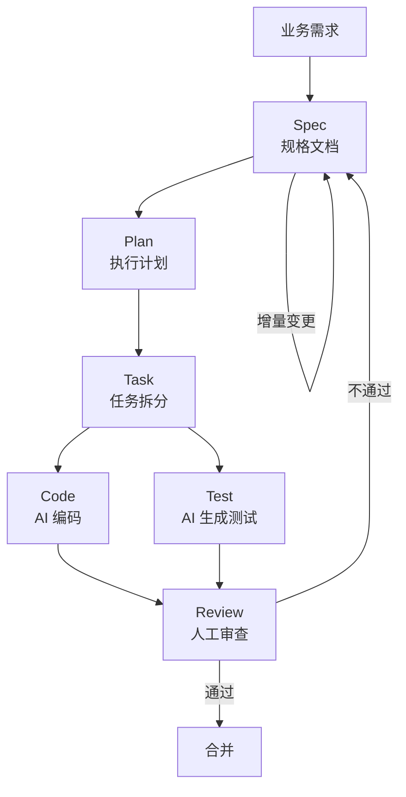

# 第四章：Spec-Driven Development / Spec Coding

## 4.1 本章要解决的问题

做 Java 后端十年，你一定见过这些场景：

- 需求文档写了 50 页，开发看到第 5 页就开始写代码，后面 45 页形同虚设
- PRD 里写的"用户可导出报表"，开发问"导出什么格式？Excel 还是 PDF？包含哪些字段？权限怎么控制？"产品经理说"你们先做着，后面再说"
- 代码写完了，测试问"异常情况怎么处理"，发现文档里根本没有定义
- Code Review 时争论"这个设计不合理"，因为没有一份双方都认可的规格可供对照

这些问题本质上是一个问题：**需求描述和代码执行之间的鸿沟太大**。

传统模式下，人脑填补了鸿沟。一个资深开发拿着模糊的需求，用自己的经验和判断力把模糊的东西填实。但 AI 没有你的业务经验，它只能执行你给它精确界定的任务。

Spec-Driven Development 的核心主张很简单：**把填坑的工作前移，在写代码之前，把规格写清楚。** 这不是新理念，但 AI 让它从"最佳实践"变成了"必须这样做"。

## 4.2 Spec-Driven Development 是什么

Spec-Driven Development（规格驱动开发）是一种开发方法论：**以一份机器可执行、人类可读的规格文档作为软件开发的唯一真相来源**。代码、测试、文档全部从同一份 Spec 派生，而不是各自独立维护。

核心原则有三条：

1. **Spec First**：先写规格，再写代码。不是"边写边定"，不是"先写代码再补文档"
2. **Spec as Contract**：规格是业务方和开发方之间的契约，任何一方不能单方面修改
3. **Spec as Driver**：规格不仅是给人看的，更是给 AI 执行的——AI 读 Spec 生成代码，AI 读 Spec 生成测试，AI 读 Spec 做 Review

用一句话概括：**Spec 是驱动 AI 的"源代码"，而不是写完就扔的"过程文档"。**

## 4.3 Spec Coding 是什么

Spec Coding 是 Spec-Driven Development 在 AI 时代的实践形态。它的工作流是：

1. 你写 Spec
2. AI 读 Spec，生成代码
3. AI 读 Spec，生成测试用例
4. AI 读 Spec，执行代码 Review
5. 你 Review AI 的输出，确认是否符合 Spec
6. 你修改 Spec（不是直接修改代码），AI 重新生成

关键区别在于第 6 步：**当你发现 AI 生成的代码不符合预期时，你改的是 Spec，不是代码。** 改了 Spec 之后，让 AI 重新生成。这确保了 Spec 始终是真相来源，代码始终从 Spec 派生。

不是每次都从头生成。小改动可以手动改代码然后同步更新 Spec，但原则是：Spec 和代码出现不一致时，以 Spec 为准。

## 4.4 为什么 AI 时代 Spec 反而更重要

很多人的直觉是反的：他们认为 AI 能理解自然语言，所以不需要写清楚规格，"我随便说说 AI 就懂了"。

这是对 AI 能力的根本性误判。

AI 确实能理解自然语言，但问题不在于 AI 能不能理解，而在于：

### 4.4.1 模糊性导致的不可复现

你跟 AI 说"写一个用户管理模块"。 AI 这次生成的代码可能用 MyBatis，下次用 JPA；这次字段名叫 `user_name`，下次叫 `username`；这次用软删除，下次用物理删除。每次生成的结果都不一样，你无法建立稳定预期。

没有 Spec，AI 的输出就是抽奖。有 Spec，AI 的输出是可预测的。

### 4.4.2 上下文窗口的衰减

一个真实的企业级项目，业务规则可能有几十上百条。当你跟 AI 在对话中逐条讨论时，前 30 条在上下文里，后 70 条必须压缩或丢弃。AI 会"忘记"之前约定好的规则。

Spec 解决了这个问题：你不依赖对话上下文来传递规则，AI 每次执行都从 Spec 文件读取完整规则。上下文窗口不够大？无所谓，Spec 文件可以分拆、可以按需加载。

### 4.4.3 变更追溯

一个审批流模块，上线三个月后要加"会签"功能。如果没有 Spec，你需要从代码反推当时的业务规则是什么，这通常意味着重新读一遍几千行代码的上下文。

有 Spec 的话，你直接看 Spec 中关于"审批规则"的章节，改完 Spec，让 AI 读 diff 做增量修改。省去大量代码考古的时间。

### 4.4.4 AI 不会质疑你的需求

这是最大的隐藏风险。一个经验丰富的程序员拿到一份有问题的需求，会主动说"这个地方逻辑不对，如果金额为负数怎么办？" AI 不会。你给它什么它就做什么，你的 Spec 里没写的边界条件，AI 不会主动帮你补。

因此，Spec 的质量直接决定 AI 产出的质量。**Garbage Spec in, Garbage Code out.**

### 4.4.5 一句话总结

传统开发中，模糊需求由经验丰富的开发者的大脑来消化和补充。AI 开发中，你没有这个"大脑缓冲层"。**AI 让你的需求质量直接暴露在了代码质量面前。** Spec 就是你要自己构建的缓冲层。

## 4.5 Spec、Plan、Task、Code、Test、Review 的关系

在 Spec-Driven Development 中，这些概念的上下游关系是清晰的：



**关键要点：**

- **Spec 是起点，也是终点。** 所有下游产物（Plan、Task、Code、Test）都从 Spec 派生。如果 Review 发现问题，Root Cause 追踪到 Spec，修改 Spec 后重新派生。
- **Plan 不是 Spec。** Spec 描述"要建成什么"，Plan 描述"怎么建"——技术选型、模块拆分、开发顺序。两者分开，不要混在一起。
- **Test 从 Spec 生成，不是从 Code 生成。** 从 Code 生成的测试只能验证"代码做了它做的事"，不能验证"代码做了它该做的事"。
- **Review 的参照物是 Spec。** Review 不是看代码写得漂不漂亮，而是看代码是否实现了 Spec 定义的每一件事。

## 4.6 如何写适合 AI 执行的 Spec

一份好的 AI 可执行 Spec 不是散文。它需要用特定格式和结构来写，确保 AI 能精确解析无误执行。

以下是 Spec 的组成部分，以及每部分的写法规范和示例。

### 4.6.1 需求 Spec

需求 Spec 描述**用户能看到什么、能做什么**，不涉及技术实现。

写法要点：

- 用编号列表，不要用段落描述
- 每条需求一句话，主语明确
- 包含触达条件（when/then 结构）
- 标记优先级（P0/P1/P2）


**示例："企业内部审批流模块"需求 Spec**

```markdown
## 功能需求

### FR-01 提交审批申请
- FR-01-1 [P0] 员工可提交审批申请，包含申请标题、申请类型（请假/报销/采购/其他）、申请金额、申请事由、附件（可选）
- FR-01-2 [P0] 提交申请时系统根据审批类型和金额自动匹配审批链
- FR-01-3 [P1] 员工可在提交前预览审批链上各级审批人
- FR-01-4 [P0] 员工提交后不可修改，仅可撤回（审批开始前）

### FR-02 审批流程
- FR-02-1 [P0] 审批人收到待办通知后，可查看申请详情并做出通过/驳回/转交操作
- FR-02-2 [P0] 审批通过后流转到下一级审批人，直至最后一级
- FR-02-3 [P0] 任一级驳回即终止流程，申请单状态变为"已驳回"
- FR-02-4 [P0] 驳回时必须填写驳回理由
- FR-02-5 [P1] 审批人可将申请转交给同级其他审批人
- FR-02-6 [P0] 同一级有多个审批人时，支持"或签"（任一通过即可）和"会签"（全部通过才可）
- FR-02-7 [P2] 审批超时（48小时未处理）自动提醒

### FR-03 审批链管理
- FR-03-1 [P0] 管理员可配置审批类型（请假/报销/采购/其他）
- FR-03-2 [P0] 每种审批类型支持按金额区间配置不同审批链
- FR-03-3 [P0] 审批链由1-N级组成，每级指定1-N个审批人

### FR-04 查询与统计
- FR-04-1 [P0] 员工可查看自己提交的所有申请及当前状态
- FR-04-2 [P0] 审批人可查看自己待审批和已审批的申请列表
- FR-04-3 [P1] 管理员可查看全量申请列表，支持按状态、类型、时间筛选
- FR-04-4 [P2] 提供审批效率统计（平均审批时长、驳回率等）
```

### 4.6.2 非功能约束

非功能约束定义系统在性能、安全、可用性上的硬性指标。这些是 AI 编码时必须遵守的边界条件。

```markdown
## 非功能约束

### 性能
- NF-01 申请单列表查询（含筛选）响应时间 P95 < 500ms，单表数据量 100 万级
- NF-02 审批操作（通过/驳回）响应时间 P95 < 200ms
- NF-03 审批链匹配计算在提交申请时完成，不在查询时实时计算

### 安全
- NF-04 所有接口通过 Spring Security + JWT 鉴权，无 Token 请求直接拒绝
- NF-05 审批人只能看到与自己相关的申请单（待审批/已审批），不可越权查看
- NF-06 敏感字段（申请金额、附件URL）传输层 HTTPS 加密，存储层不做明文日志输出
- NF-07 审批操作记录完整审计日志：操作人、操作时间、操作类型、操作前后状态

### 可用性
- NF-08 核心审批接口（提交、通过、驳回）要求 99.9% 可用
- NF-09 审批链配置变更不对进行中的申请单生效（快照机制），避免审批人突然变化导致流程混乱
- NF-10 数据库故障时读操作可降级返回缓存数据，写操作直接报错

### 代码规范
- NF-11 后端使用 Java 17 + Spring Boot 3.x + MyBatis-Plus
- NF-12 数据库使用 MySQL 8.0，字符集 utf8mb4
- NF-13 Controller 层不包含业务逻辑，只做参数校验和路由
- NF-14 所有 API 返回统一响应格式 `Result<T>`，包含 code、message、data
- NF-15 日期时间字段统一使用 `LocalDateTime`，API 传输格式 `yyyy-MM-dd HH:mm:ss`
```

### 4.6.3 API Spec

API Spec 定义所有 RESTful 接口的协议。格式上要包含：路径、方法、请求参数、请求体 JSON、响应体 JSON、异常码。

**不要只写"返回申请单详情"。写具体的字段名、类型和示例值。** AI 需要这些细节来生成准确的代码。

```markdown
## API Spec

### 1. 提交审批申请

POST /api/v1/approval/application

Request Body:
{
  "title": "2025年Q4差旅报销",           // String, 必填, max 100
  "type": "REIMBURSEMENT",              // String, 必填, 枚举: LEAVE/REIMBURSEMENT/PURCHASE/OTHER
  "amount": 12500.00,                   // BigDecimal, 必填, > 0
  "reason": "参加上海行业峰会差旅费用",    // String, 必填, max 1000
  "attachments": [                      // List<String>, 可选
    "https://oss.example.com/files/a1b2c3.pdf",
    "https://oss.example.com/files/d4e5f6.xlsx"
  ]
}

Response 200:
{
  "code": 200,
  "message": "success",
  "data": {
    "applicationId": 10001,             // Long, 申请单ID
    "status": "PENDING",                // String, 状态: PENDING/APPROVING/APPROVED/REJECTED/WITHDRAWN
    "approvalChain": [                  // 此次匹配的审批链
      {
        "level": 1,                     // 第几级
        "approvers": [
          { "userId": 2001, "userName": "张三" }
        ],
        "strategy": "OR"                // OR=或签, AND=会签
      },
      {
        "level": 2,
        "approvers": [
          { "userId": 3001, "userName": "李四" }
        ],
        "strategy": "OR"
      }
    ]
  }
}

Error Cases:
- 400: 参数校验失败（金额≤0、必填字段缺失、type 不在枚举范围内）
- 401: 未登录
- 403: 无提交权限
- 500: 审批链匹配失败（未找到匹配的审批链配置）

### 2. 审批操作（通过/驳回）

POST /api/v1/approval/application/{applicationId}/action

Path Variable:
  applicationId: Long, 申请单ID

Request Body:
{
  "action": "APPROVE",                  // String, 必填, 枚举: APPROVE/REJECT
  "comment": "费用合理，同意报销",        // String, 必填, max 500
  "transferToUserId": null              // Long, 转交目标用户ID, 仅 TRANSFER 动作时使用
}

Response 200:
{
  "code": 200,
  "message": "success",
  "data": {
    "applicationId": 10001,
    "newStatus": "APPROVING",           // APPROVING(流转中)/APPROVED(全部通过)/REJECTED
    "currentLevel": 2,                  // 当前审批级数，流程结束时为 null
    "nextApprovers": [                  // 下一级审批人，流程结束时为空数组
      { "userId": 3001, "userName": "李四" }
    ]
  }
}

Error Cases:
- 400: action 不在枚举范围、comment 为空、非当前审批人操作
- 404: 申请单不存在
- 409: 申请单状态不允许审批（已通过/已驳回/已撤回）
- 423: 同一级会签模式下，已被其他审批人锁定

### 3. 查询我的申请

GET /api/v1/approval/application/my?page=1&size=20&status=APPROVING&type=REIMBURSEMENT&startDate=2025-01-01&endDate=2025-12-31

Query Parameters:
  page:     int, 默认1
  size:     int, 默认20, max 100
  status:   String, 可选, 枚举同申请单状态
  type:     String, 可选, 枚举同申请类型
  startDate: String, 可选, 格式 yyyy-MM-dd
  endDate:   String, 可选, 格式 yyyy-MM-dd
  keyword:   String, 可选, 模糊匹配标题

Response 200:
{
  "code": 200,
  "message": "success",
  "data": {
    "total": 156,
    "page": 1,
    "size": 20,
    "records": [
      {
        "applicationId": 10001,
        "title": "2025年Q4差旅报销",
        "type": "REIMBURSEMENT",
        "amount": 12500.00,
        "status": "APPROVING",
        "currentLevel": 2,
        "totalLevels": 3,
        "createdAt": "2025-12-15 10:30:00",
        "updatedAt": "2025-12-16 14:20:00"
      }
    ]
  }
}
```

### 4.6.4 数据模型 Spec

数据模型 Spec 直接写 DDL 语句，附带字段说明和索引设计理由。AI 应该能够直接使用你的 DDL 生成对应的 Entity 类和 Mapper。

```markdown
## 数据模型 Spec

### 审批链配置表

```sql
CREATE TABLE approval_chain_config (
    id              BIGINT AUTO_INCREMENT PRIMARY KEY COMMENT '主键',
    type            VARCHAR(32)  NOT NULL COMMENT '审批类型: LEAVE/REIMBURSEMENT/PURCHASE/OTHER',
    min_amount      DECIMAL(18,2) NOT NULL DEFAULT 0 COMMENT '金额区间下限（含）',
    max_amount      DECIMAL(18,2) NOT NULL DEFAULT 99999999.99 COMMENT '金额区间上限（不含）',
    level           INT          NOT NULL COMMENT '审批级数，从1开始',
    strategy        VARCHAR(8)   NOT NULL DEFAULT 'OR' COMMENT '审批策略: OR=或签, AND=会签',
    approvers       JSON         NOT NULL COMMENT '审批人列表，格式: [{"userId":1001,"userName":"张三"}]',
    is_enabled      TINYINT      NOT NULL DEFAULT 1 COMMENT '是否启用: 1=是, 0=否',
    created_at      DATETIME     NOT NULL DEFAULT CURRENT_TIMESTAMP,
    updated_at      DATETIME     NOT NULL DEFAULT CURRENT_TIMESTAMP ON UPDATE CURRENT_TIMESTAMP,
    INDEX idx_type_amount (type, min_amount, max_amount),
    INDEX idx_type_level (type, level)
) ENGINE=InnoDB DEFAULT CHARSET=utf8mb4 COMMENT='审批链配置表';
```

### 申请单主表

```sql
CREATE TABLE approval_application (
    id              BIGINT AUTO_INCREMENT PRIMARY KEY,
    title           VARCHAR(100)  NOT NULL COMMENT '申请标题',
    type            VARCHAR(32)   NOT NULL COMMENT '申请类型',
    amount          DECIMAL(18,2) NOT NULL COMMENT '申请金额',
    reason          VARCHAR(1000) NOT NULL COMMENT '申请事由',
    status          VARCHAR(16)   NOT NULL DEFAULT 'PENDING' COMMENT 'PENDING/APPROVING/APPROVED/REJECTED/WITHDRAWN',
    current_level   INT           DEFAULT 1 COMMENT '当前审批级数',
    total_levels    INT           NOT NULL COMMENT '总审批级数',
    applicant_id    BIGINT        NOT NULL COMMENT '申请人ID',
    applicant_name  VARCHAR(64)   NOT NULL COMMENT '申请人姓名',
    department_id   BIGINT        COMMENT '申请人部门ID',
    created_at      DATETIME      NOT NULL DEFAULT CURRENT_TIMESTAMP,
    updated_at      DATETIME      NOT NULL DEFAULT CURRENT_TIMESTAMP ON UPDATE CURRENT_TIMESTAMP,
    INDEX idx_applicant_status (applicant_id, status),
    INDEX idx_status_created (status, created_at),
    INDEX idx_type_status (type, status)
) ENGINE=InnoDB DEFAULT CHARSET=utf8mb4 COMMENT='审批申请单主表';
```

### 审批链快照表（提交时固化）

```sql
CREATE TABLE approval_chain_snapshot (
    id               BIGINT AUTO_INCREMENT PRIMARY KEY,
    application_id   BIGINT        NOT NULL COMMENT '申请单ID',
    level            INT           NOT NULL COMMENT '审批级数',
    strategy         VARCHAR(8)    NOT NULL COMMENT '审批策略: OR/AND',
    approver_id      BIGINT        NOT NULL COMMENT '审批人ID',
    approver_name    VARCHAR(64)   NOT NULL COMMENT '审批人姓名',
    status           VARCHAR(16)   NOT NULL DEFAULT 'PENDING' COMMENT 'PENDING/APPROVED/REJECTED/TRANSFERRED',
    comment          VARCHAR(500)  COMMENT '审批意见',
    operated_at      DATETIME      COMMENT '审批操作时间',
    created_at       DATETIME      NOT NULL DEFAULT CURRENT_TIMESTAMP,
    INDEX idx_application (application_id),
    INDEX idx_approver_status (approver_id, status)
) ENGINE=InnoDB DEFAULT CHARSET=utf8mb4 COMMENT='审批链快照表，提交时固化';
```

### 附件表

```sql
CREATE TABLE approval_attachment (
    id               BIGINT AUTO_INCREMENT PRIMARY KEY,
    application_id   BIGINT        NOT NULL COMMENT '申请单ID',
    file_name        VARCHAR(255)  NOT NULL COMMENT '文件名',
    file_url         VARCHAR(512)  NOT NULL COMMENT '文件URL',
    file_size        BIGINT        COMMENT '文件大小（字节）',
    created_at       DATETIME      NOT NULL DEFAULT CURRENT_TIMESTAMP,
    INDEX idx_application (application_id)
) ENGINE=InnoDB DEFAULT CHARSET=utf8mb4 COMMENT='审批附件表';
```

### 审计日志表

```sql
CREATE TABLE approval_audit_log (
    id               BIGINT AUTO_INCREMENT PRIMARY KEY,
    application_id   BIGINT        NOT NULL COMMENT '申请单ID',
    operator_id      BIGINT        NOT NULL COMMENT '操作人ID',
    operator_name    VARCHAR(64)   NOT NULL COMMENT '操作人姓名',
    action           VARCHAR(32)   NOT NULL COMMENT '操作类型: SUBMIT/APPROVE/REJECT/TRANSFER/WITHDRAW',
    from_status      VARCHAR(16)   COMMENT '操作前状态',
    to_status        VARCHAR(16)   COMMENT '操作后状态',
    comment          VARCHAR(500)  COMMENT '操作备注',
    created_at       DATETIME      NOT NULL DEFAULT CURRENT_TIMESTAMP,
    INDEX idx_application (application_id),
    INDEX idx_operator_time (operator_id, created_at)
) ENGINE=InnoDB DEFAULT CHARSET=utf8mb4 COMMENT='审批操作审计日志';
```
```

### 4.6.5 权限规则

权限规则用矩阵表格呈现，AI 应该能直接据此生成权限校验注解或拦截器逻辑。

```markdown
## 权限规则

| 操作 | 申请人 | 审批人（当前级） | 审批人（非当前级） | 管理员 | 普通用户 |
|------|--------|-----------------|-------------------|--------|----------|
| 提交申请 | Y | Y | Y | Y | Y |
| 撤回申请 | Y(仅PENDING/APPROVING) | N | N | Y(仅PENDING/APPROVING) | N |
| 查看申请详情 | Y(仅自己的) | Y(仅待审批的) | N | Y(全部) | N |
| 审批通过 | N | Y(仅待审批) | N | N | N |
| 审批驳回 | N | Y(仅待审批) | N | N | N |
| 转交审批 | N | Y(仅待审批) | N | N | N |
| 查询全量列表 | N | N | N | Y | N |
| 查询自己的申请 | Y | Y | Y | Y | N |
| 配置审批链 | N | N | N | Y | N |
| 查看审计日志 | N | N | N | Y | N |

### 角色定义

| 角色 | 判断逻辑 | 说明 |
|------|---------|------|
| 申请人 | application.applicantId == currentUserId | 申请单的创建者 |
| 审批人（当前级） | currentUserId ∈ snapshot[application.currentLevel].approvers[*].userId AND snapshot.status == 'PENDING' | 当前审批级的待审批人 |
| 管理员 | 数据库中 role 字段为 ADMIN | 系统管理员 |
```

### 4.6.6 异常规则

异常规则至关重要。AI 倾向于只写"正常路径"的代码，异常处理需要显式指定。

```markdown
## 异常规则

### 提交申请阶段
- EX-01: 金额 <= 0 → 返回 400，"申请金额必须大于0"
- EX-02: 无匹配审批链配置 → 返回 500，"未找到审批链配置，请联系管理员"（同时记录ERROR级别日志）
- EX-03: 必填字段缺失 → 返回 400，逐字段报错，不聚合

### 审批阶段
- EX-04: 申请单不存在 → 返回 404，"申请单不存在或已删除"
- EX-05: 当前用户不是审批人 → 返回 403，"您不是当前审批人"
- EX-06: 申请单状态不可审批 → 返回 409，"申请单当前状态为{status}，不允许审批"
- EX-07: 会签模式下存在并发审批 → 使用乐观锁（version字段），第二个审批人返回 423，"该申请单正在被其他审批人处理"
- EX-08: 审批意见（comment）为空 → 返回 400，"审批意见不能为空"
- EX-09: 驳回时 comment 包含敏感词 → 校验不通过，返回 400（敏感词列表可配置）

### 撤回阶段
- EX-10: 申请单状态非 PENDING/APPROVING → 返回 409，"仅待提交和审批中的申请可撤回"
- EX-11: 非本人且非管理员撤回 → 返回 403，"无权撤回此申请"

### 查询阶段
- EX-12: 分页参数 size > 100 → 自动截断为 100，不报错
- EX-13: 日期格式非法 → 返回 400，"日期格式错误，请使用 yyyy-MM-dd"

### 审批链配置阶段
- EX-14: 同一类型+金额区间存在重叠 → 返回 409，"审批链配置的金额区间不允许重叠"
- EX-15: 审批链修改影响进行中的申请单 → 允许修改，但不传播到已提交的申请单（快照机制）
```

### 4.6.7 验收标准

验收标准是 Spec 的最后一部分，定义"怎样算做完"。**必须是可验证的，不能是"用户体验良好"这种主观表述。**

```markdown
## 验收标准

### 功能验收
- AC-01: 提交申请后返回的审批链与配置表匹配，金额区间边界值（含/不含）正确
- AC-02: 单级或多级审批链路全部通过后，申请单状态变为 APPROVED
- AC-03: 任一级驳回后，申请单状态变为 REJECTED，后续级别不触发
- AC-04: 会签模式下，同一级所有审批人均通过后才流转到下一级
- AC-05: 或签模式下，同一级任一审批人通过即流转到下一级
- AC-06: 撤回后申请单状态变为 WITHDRAWN，审批人不再看到此待办
- AC-07: 修改审批链配置后，新提交的申请使用新配置，已提交的申请不受影响
- AC-08: 所有操作记录均可在审计日志表中查询

### 性能验收
- AC-09: 10万条历史申请单数据下，列表查询 P95 < 500ms
- AC-10: 审批操作在500 QPS并发下，P95 < 200ms，错误率 < 0.1%

### 安全验收
- AC-11: 无 Token 请求所有接口返回 401
- AC-12: 普通用户无法通过修改 applicationId 查看他人申请单详情
- AC-13: 非审批人调用审批接口返回 403
- AC-14: 日志中不出现明文敏感数据（申请金额可记录，附件URL不可记录为明文）

### 场景验收
- AC-15: 请假3天以内（金额区间0-0元）走一级审批，3天以上走两级审批
- AC-16: 报销5000元以下走一级审批，5000-50000走两级，50000以上走三级
```

## 4.7 如何把业务需求变成 AI 可执行规格

从业务方的口头描述到可执行的 Spec，有一套转换流程：

### 4.7.1 第一步：结构化

业务方常见的描述方式："我们要做一个审批功能，员工可以请假报销，领导批一下就行。"

你需要把它结构化为：

- **有哪些角色？** 员工、审批人、管理员
- **有哪些实体？** 申请单、审批链、审批记录
- **有哪些状态流转？** 草稿→待审批→审批中→已通过/已驳回/已撤回
- **有哪些边界条件？** 金额阈值、审批级数、会签/或签

这一步需要人来完成。AI 可以辅助（"帮我整理一下这个需求中的实体和状态"），但最终确认需要你对业务的判断。

### 4.7.2 第二步：边界穷举

这是最容易被忽视但最重要的一步。对每一个操作，穷举异常情况：

- 如果金额为 0 怎么办？
- 如果审批人离职了怎么办？
- 如果有人同时在 PC 和手机端审批同一个申请怎么办？
- 如果审批链被删除，但还有进行中的申请怎么办？

**让 AI 帮你穷举边界**是一个高效的策略。Prompt 示例：

```
我设计了一个审批流模块，核心流程是：员工提交申请 → 匹配审批链 → 逐级审批 → 通过/驳回。
请帮我穷举所有可能的异常场景，按模块分类（提交、审批、撤回、查询、配置）。
```

AI 输出的异常列表经过你筛选确认后，直接写入 Spec 的"异常规则"章节。

### 4.7.3 第三步：技术落地

将业务描述翻译为技术约束：

| 业务描述 | 技术落地 |
|---------|---------|
| "审批不能太慢" | 审批操作 P95 < 200ms |
| "审批人离职了怎么办" | 审批人不存在时自动跳过该级，记录异常日志并通知管理员 |
| "同一级多人审批" | 支持或签（OR）和会签（AND）两种策略 |
| "审批链可能变" | 提交时快照审批链，后续变更不影响已提交申请 |

### 4.7.4 第四步：给 AI 写 Prompt

当你把 Spec 写好后，给 AI 的指令极其简洁。不需要在 Prompt 里重复 Spec 内容。

```
请根据 docs/spec/approval-module-spec.md 中的 Spec，实现以下内容：
1. 数据模型（Entity + Mapper）
2. 审批链匹配服务
3. 提交审批接口
4. 审批操作接口
5. 单元测试（覆盖率 > 80%）
请严格按照 Spec 中的 API 定义和异常规则实现。
```

Spec 文件放在项目仓库里，AI 每次执行前读取。这是 Spec-Driven Development 的核心工作方式。

## 4.8 如何通过 Spec 控制 AI 输出质量

### 4.8.1 Spec 的严格程度决定 AI 输出的精确程度

| Spec 写法 | AI 输出 | 质量 |
|----------|--------|------|
| "实现审批功能" | 随意生成，不可预测 | 不可控 |
| "实现审批流程，支持多级审批和驳回" | 大致能跑，但细节全靠猜 | 勉强可用 |
| 完整的 API Spec + 数据模型 + 异常规则 | 精确匹配，边界覆盖 | 可直接生产使用 |

### 4.8.2 使用 Spec 做 Prompt 模板

为不同类型的 AI 任务准备 Spec 章节模板。每次让 AI 写代码时，引用对应的 Spec 章节：

- 写 Controller → 引用 API Spec + 权限规则 + 异常规则
- 写 Service → 引用需求 Spec + 非功能约束 + 异常规则
- 写测试 → 引用验收标准 + 异常规则
- 做 Review → 通读全部 Spec，逐条核对

### 4.8.3 Spec 驱动的 Review

Review 时不再凭感觉说"这个代码写得不好"，而是对照 Spec 逐条检查：

```markdown
## Review 清单（基于 Spec）

- [ ] API 路径和方法是否与 API Spec 完全一致？
- [ ] 请求参数校验是否覆盖了 API Spec 中标注的所有必填/格式约束？
- [ ] 响应体字段名和类型是否与 API Spec 一致？
- [ ] 异常处理是否覆盖了异常规则中的所有场景？
- [ ] 状态流转是否符合需求 Spec 中的定义？
- [ ] 权限校验是否覆盖了权限矩阵中的所有规则？
- [ ] SQL 查询是否使用了索引（对照数据模型 Spec 的索引定义）？
- [ ] 审计日志是否记录了所有操作？
```

这份清单本身就是从 Spec 派生的。你甚至可以写一个脚本，扫描 Spec 中的异常规则编号，自动生成 Review 清单。

### 4.8.4 用 Spec 做回归测试

当 Spec 变更时，你可以用 Git diff 精确定位受影响的范围：

```bash
# 查看 Spec 中哪些规则被修改了
git diff HEAD~1 docs/spec/approval-module-spec.md

# 只关注 API Spec 的变更
git diff HEAD~1 -- docs/spec/ -G "^### \d\."

# AI 根据变更生成针对性的测试用例
# Prompt: 以下 Spec diff 中新增了异常规则 EX-16 和 EX-17，请生成对应的集成测试：
# [粘贴 git diff 输出]
```

## 4.9 Spec-Driven Development 与传统需求文档的区别

| 维度 | 传统需求文档 | Spec-Driven Development 的 Spec |
|------|------------|-------------------------------|
| **定位** | 业务方写给人看的叙述文档 | 写给 AI 执行的规格说明书 |
| **格式** | 段落、截图、流程图 | 编号列表、代码块、矩阵表格 |
| **使用方式** | 开发读完后自己理解，文档归档 | AI 逐条读取执行，持续引用 |
| **更新频率** | 写完即止，很少更新 | 随代码变更持续更新，是活文档 |
| **验证性** | "功能实现了"（主观） | 验收标准逐条可测（客观） |
| **与代码的关系** | 文档和代码各自独立维护 | Spec 是真相来源，代码从 Spec 派生 |
| **粒度** | 粗略，依赖开发者自行细化 | 精细到字段名、API 路径、异常码 |
| **是否可执行** | 否，必须经过人脑翻译 | 是，AI 可直接读取执行 |
| **生命周期** | 需求阶段结束后即废弃 | 从需求到维护，贯穿整个生命周期 |
| **所有权** | 产品经理 | 开发团队（规格由开发维护，业务确认） |

一句话总结：传统需求文档是**描述需求的文档**，Spec 是**定义系统的规格**。前者是叙述性的，后者是指令性的。

## 4.10 Spec-Driven Development 与 Vibe Coding 的对比

Vibe Coding 是当前 AI 编程圈很火的概念：写一句话描述，让 AI 生成全部代码，不满意就改描述再让 AI 重新生成，直到满意为止。整个过程像对话一样自然。

Spec-Driven Development 看起来和 Vibe Coding 目标相同（让 AI 写代码），但哲学完全不同。

| 维度 | Vibe Coding | Spec-Driven Development |
|------|------------|------------------------|
| **核心工具** | 对话聊天框 | Spec 文件 + AI 读取执行 |
| **规格载体** | 对话历史（不可持久化、不可追溯） | 版本控制的 Spec 文件 |
| **可靠性** | 每次对话可能产生不同结果 | 同一份 Spec 产生一致结果 |
| **上下文管理** | 依赖对话窗口，窗口越长越容易丢失上下文 | Spec 文件按需加载，不占用对话上下文 |
| **团队协作** | 单人对话，难以共享 | Spec 在 Git 仓库中，全员共享 |
| **变更追溯** | 无（对话记录不是版本化的） | Git diff，清晰可见 |
| **适用项目** | 原型、Demo、个人项目 | 企业级项目、团队协作、长期维护 |
| **与测试的关系** | 手工验证为主 | 测试用例从 Spec 自动生成 |
| **学习曲线** | 极低，会说人话就行 | 需要学习 Spec 编写规范 |
| **风险和边界** | 高（代码质量不可预测，不适合生产） | 中（依赖 Spec 质量，Spec 写错则代码出错） |

## 4.11 五种 AI 编程模式详细对比

| 维度 | Vibe Coding | Prompt Coding | Agentic Coding | Spec-Driven Development | 企业级 AI 工作流 |
|------|------------|--------------|----------------|------------------------|-----------------|
| **目标** | 快速出原型，体验 AI 编程的快感 | 用精炼 Prompt 控制单次输出质量 | 把多步任务交给 Agent 自主完成 | 以 Spec 为真相来源驱动全流程 | 融合 Spec + Agent + CI/CD 的工业化流水线 |
| **适用场景** | 个人玩具项目、Demo、Hackathon | 单函数、单模块的快速实现 | 跨文件的复杂特性开发 | 企业后端模块、需要长期维护的系统 | 金融、医疗等强合规领域的核心系统 |
| **速度** | 极快（分钟级出效果） | 快（分钟级） | 中等（需要多轮 Agent 自主决策，10-30分钟） | 中慢（写 Spec 需要几小时，但编码极快） | 慢（整个流水线包含人工审核节点） |
| **质量** | 不可预测 | 单次质量高，但集成质量取决于上下文 | 取决于 Agent 能力和任务描述的精确度 | 高且稳定，Spec 定义了质量边界 | 最高，多层质量门禁 |
| **可维护性** | 差，没有结构化文档 | 一般，Prompt 不一定留存 | 一般，任务描述留存但不够结构化为长期文档 | 好，Spec 即是文档 | 最好，Spec + 审计日志 + 合规记录 |
| **是否适合生产** | 否 | 局部可用（辅助生成工具函数） | 谨慎（需要 Review 把关） | 是 | 是 |
| **是否需要程序员深度参与** | 不需要，产品经理也能用 | 需要，Prompt 工程本身就是编程 | 需要，任务拆解和验收必须程序员做 | 需要，Spec 编写是核心技能 | 需要+（架构师+合规+QA 多方参与） |
| **风险** | 代码质量不可预测，安全漏洞常见，无异常处理 | Prompt 不够精确时输出偏差大 | Agent 可能走偏方向，需人工检查点 | Spec 质量直接决定输出质量；Spec 写错则全盘皆错 | 流程过重，响应需求变更慢 |
| **典型工具** | Cursor / v0 / Replit / Claude Chat | Claude Code / ChatGPT / Codex | Claude Code Agent / Cursor Agent / Devin | Claude Code + Spec 文件 / GitHub Copilot Workspace | 自研平台 + 多模型编排 + 审批流 |
| **企业落地建议** | 不推荐用于企业核心业务 | 作为辅助工具，用于非核心模块的快速实现 | 用于中等复杂度的功能开发，辅以 Spec 做约束 | **推荐作为企业 AI 开发的标准模式** | 在 Spec-Driven Development 基础上按需叠加合规和审核流程 |


### 解释表格中的几个关键概念

**Vibe Coding**：描述式编程。"我要一个待办事项应用，要有添加、删除、标记完成功能。" AI 一通生成，你看着效果不断调整描述。适合快速验证想法，不适合写需要维护的代码。

**Prompt Coding**：用精心构造的 Prompt 控制 AI 的单次输出。"用 Spring Boot 3 + MyBatis-Plus 实现一个 RESTful 接口，POST /api/users，支持分页查询，返回统一格式 Result<PageResult<UserDTO>>，按创建时间倒序，包含参数校验。" 输出质量高于 Vibe Coding，但 Prompt 本身不持久化、不版本化。

**Agentic Coding**：把任务拆解后交给 AI Agent，Agent 自主规划执行步骤。"开发用户管理模块的 CRUD 功能，包括数据库迁移、Entity、Service、Controller、单元测试。" Agent 会自动创建文件、写代码、运行测试、修复错误，直到任务完成。你需要验收结果。

**Spec-Driven Development**：本章主题。先写 Spec，AI 从 Spec 执行。核心区别是 Spec 作为持久化的、版本化的、结构化的真相来源。

**企业级 AI 工作流**：在 Spec-Driven Development 基础上叠加合规审查、安全扫描、性能基准测试、多模型交叉验证、人工审批节点等企业需要的流程。这不是一个独立的方法论，而是 Spec-Driven Development 在企业环境中的增强版。

### 你应该选择哪种模式

结合你的实际情况（十年 Java 后端，Claude Code 使用者，做企业级项目）：

- **日常单函数/单模块开发**：Prompt Coding（快速交互，不需要完整的 Spec）
- **完整功能模块开发**：Spec-Driven Development（本章推荐的默认模式）
- **复杂特性的探索性开发**：Agentic Coding + Spec（先让 Agent 探索，锁定方案后固化到 Spec）
- **原型验证**：Vibe Coding（快速试错，验证想法后重新用 Spec 实现）
- **核心系统/合规要求高的系统**：企业级 AI 工作流

## 4.12 完整示例：开发一个企业内部审批流模块

以下是一个从 Spec 到代码的完整流程示意。前面 4.6 节已经写了 Spec 的各个组成部分（需求 Spec、非功能约束、API Spec、数据模型 Spec、权限规则、异常规则、验收标准），这里补上执行阶段的内容。

### 4.12.1 AI 执行计划

将 Spec 提交给 AI 后，AI 首先生成执行计划：

```markdown
## AI 执行计划

### 第一阶段：基础设施（预计 30 分钟）
1. 创建数据库迁移脚本（基于数据模型 Spec）
2. 生成 Entity 类：ApprovalApplication, ApprovalChainConfig, ApprovalChainSnapshot, ApprovalAttachment, ApprovalAuditLog
3. 生成 Mapper 接口（MyBatis-Plus BaseMapper）
4. 生成统一响应类 Result<T>、分页工具 PageResult<T>

### 第二阶段：核心业务（预计 2 小时）
5. 实现审批链匹配服务 ApprovalChainMatcher（根据 type + amount 匹配审批链）
6. 实现申请提交服务 ApplicationSubmitService
7. 实现审批操作服务 ApprovalActionService（通过/驳回/转交）
8. 实现撤回服务 ApplicationWithdrawService
9. 实现消息通知服务 NotificationService（通过 WebSocket 或消息队列推送待办通知）

### 第三阶段：API 层（预计 1 小时）
10. 实现 ApplicationController（提交、查询）
11. 实现 ApprovalController（审批操作）
12. 实现 AdminController（配置、统计）

### 第四阶段：权限与切面（预计 1 小时）
13. 实现 JWT 鉴权过滤器
14. 实现审批权限校验切面 @RequireApprovalPermission
15. 实现审计日志切面 @AuditLog

### 第五阶段：测试（预计 2 小时）
16. 单元测试：审批链匹配逻辑（覆盖各种金额区间边界）
17. 单元测试：状态机流转（覆盖所有合法和非法转换）
18. 集成测试：完整审批流程（提交→审批→驳回/通过）
19. 集成测试：会签/或签策略
20. 集成测试：异常场景全覆盖

### 第六阶段：Review 与修复（预计 1 小时）
21. 对照 Spec 逐项 Review
22. 修复 Review 发现的问题
23. 性能测试验证
```

### 4.12.2 AI 编码任务拆分

每个任务拆分到文件级别，AI 可以并行执行：

```markdown
## Task 1: 数据模型层
文件: src/main/java/com/example/approval/entity/*.java
文件: src/main/java/com/example/approval/mapper/*.java
文件: src/main/resources/db/migration/V1__approval_schema.sql
依赖: 无
执行顺序: 1

## Task 2: 审批链匹配服务
文件: src/main/java/com/example/approval/service/ApprovalChainMatcher.java
依赖: Task 1
执行顺序: 2
关键逻辑:
  - SELECT * FROM approval_chain_config WHERE type=? AND is_enabled=1 ORDER BY level
  - 遍历结果，按 min_amount <= amount < max_amount 筛选
  - 不存在匹配时抛出 ApprovalChainNotFoundException

## Task 3: 申请提交服务
文件: src/main/java/com/example/approval/service/ApplicationSubmitService.java
文件: src/main/java/com/example/approval/service/impl/ApplicationSubmitServiceImpl.java
依赖: Task 1, Task 2
执行顺序: 3
关键逻辑:
  - 参数校验 → 匹配审批链 → 固化审批链快照 → 保存申请单 → 发送通知 → 记录审计日志
  - 使用 @Transactional 确保原子性
  - 审批链快照使用 INSERT INTO ... SELECT 批量插入

## Task 4: 审批操作服务
文件: src/main/java/com/example/approval/service/ApprovalActionService.java
文件: src/main/java/com/example/approval/service/impl/ApprovalActionServiceImpl.java
依赖: Task 1, Task 3
执行顺序: 4
关键逻辑:
  - 校验权限 → 校验状态（PENDING 才可审批）→ 执行操作 → 更新快照 → 判断是否流转 → 更新申请单状态 → 通知下一级
  - 使用乐观锁（快照表 version 字段）防止会签并发问题
  - 会签逻辑：COUNT(PENDING) == 0 → 流转；或签逻辑：任一 APPROVED → 流转

## Task 5: 通知服务
文件: src/main/java/com/example/approval/service/NotificationService.java
依赖: Task 1
执行顺序: 5
关键需求:
  - 支持 WebSocket 实时推送 + 数据库消息表兜底
  - 通知类型：NEW_PENDING（新待办）、APPROVED（已通过）、REJECTED（已驳回）

## Task 6: Controller 层
文件: src/main/java/com/example/approval/controller/ApplicationController.java
文件: src/main/java/com/example/approval/controller/ApprovalController.java
文件: src/main/java/com/example/approval/controller/AdminController.java
依赖: Task 3, Task 4
执行顺序: 6
要求:
  - 严格按 API Spec 实现路径、方法、参数、返回值
  - 使用 @Valid 做参数校验
  - 异常通过全局 @ControllerAdvice 统一处理

## Task 7: 权限切面
文件: src/main/java/com/example/approval/security/ApprovalPermissionAspect.java
文件: src/main/java/com/example/approval/annotation/RequireApprovalPermission.java
依赖: Task 6
执行顺序: 7

## Task 8: 测试
文件: src/test/java/com/example/approval/service/ApprovalChainMatcherTest.java
文件: src/test/java/com/example/approval/service/ApprovalActionServiceTest.java
文件: src/test/java/com/example/approval/controller/ApprovalControllerIntegrationTest.java
依赖: Task 1-7
执行顺序: 8
```

### 4.12.3 测试用例

根据 Spec 中的验收标准和异常规则生成：

```java
// ============================================
// 审批链匹配测试
// ============================================
class ApprovalChainMatcherTest {

    @Test
    void shouldMatchChainByTypeAndAmount() {
        // FR-03-2: 每种审批类型支持按金额区间配置不同审批链
    }

    @Test
    void shouldMatchLowerBoundaryInclusive() {
        // min_amount <= amount
    }

    @Test
    void shouldMatchUpperBoundaryExclusive() {
        // amount < max_amount
    }

    @Test
    void shouldThrowWhenNoMatchingChain() {
        // EX-02: 无匹配审批链配置 → ApprovalChainNotFoundException
    }
}

// ============================================
// 审批操作测试
// ============================================
class ApprovalActionServiceTest {

    @Test
    void shouldApproveAndMoveToNextLevel() {
        // 正常通过 → 流转到下一级
    }

    @Test
    void shouldSetApprovedWhenLastLevelApproved() {
        // 最后一级通过 → 状态变为 APPROVED
    }

    @Test
    void shouldRejectAndTerminate() {
        // 驳回 → 状态变为 REJECTED，后续级别不触发
    }

    @Test
    void shouldRequireAllApproversInAndStrategy() {
        // 会签模式：全部通过才流转
    }

    @Test
    void shouldPassWithAnyApproverInOrStrategy() {
        // 或签模式：任一人通过即流转
    }

    @Test
    void shouldThrowWhenNotCurrentApprover() {
        // EX-05: 非审批人 → 403
    }

    @Test
    void shouldThrowWhenStatusNotApproving() {
        // EX-06: 已通过/已驳回的申请不可审批 → 409
    }

    @Test
    void shouldThrowWhenConcurrentApprovalInAndStrategy() {
        // EX-07: 会签并发 → 乐观锁异常 → 423
    }

    @Test
    void shouldThrowWhenCommentEmptyOnReject() {
        // EX-08: 驳回时意见为空 → 400
    }
}

// ============================================
// 权限测试
// ============================================
class ApprovalPermissionTest {

    @Test
    void shouldRejectUnauthenticatedRequest() {
        // AC-11: 无 Token → 401
    }

    @Test
    void shouldRejectCrossUserAccess() {
        // AC-12: 用户A查看用户B的申请单 → 403
    }

    @Test
    void shouldRejectNonApproverAction() {
        // AC-13: 非审批人调用审批 → 403
    }
}
```

### 4.12.4 人工 Review 清单

AI 生成代码后，你需要对照 Spec 逐条检查：

```markdown
## 人工 Review 清单

### 数据模型 Review
- [ ] 表名、字段名是否与 DDL Spec 完全一致
- [ ] 字段类型是否匹配（特别注意 BigDecimal ↔ decimal, LocalDateTime ↔ datetime）
- [ ] 索引是否创建，索引列顺序是否正确
- [ ] approval_chain_snapshot 是否在应用层保证了"提交时固化"
- [ ] 审计日志表是否覆盖了所有操作类型（SUBMIT/APPROVE/REJECT/TRANSFER/WITHDRAW）

### API Review
- [ ] 接口路径、HTTP 方法是否与 API Spec 一致
- [ ] 请求体字段名、类型、必填/可选是否与 API Spec 一致
- [ ] 响应体结构是否与 API Spec 一致（特别注意嵌套对象的字段名）
- [ ] 异常 HTTP 状态码是否与异常规则一致
- [ ] 分页参数 size 上限 100 是否已截断

### 业务逻辑 Review
- [ ] 审批链匹配是否正确处理了金额区间的边界值（等号位置）
- [ ] 状态流转是否所有路径都正确（画状态图验证）
- [ ] 审批链配置修改是否不影响进行中的申请（快照机制）
- [ ] 会签模式下的并发控制是否正确（乐观锁的位置和重试逻辑）
- [ ] 撤回操作是否只在 PENDING/APPROVING 状态下允许

### 安全 Review
- [ ] 所有接口是否经过 JWT 鉴权
- [ ] 权限校验是否在 Service 层而非仅在 Controller 层
- [ ] 敏感字段是否在日志中脱敏
- [ ] SQL 注入防护（MyBatis-Plus 默认防注入，但检查是否有手动拼接 SQL）
- [ ] 越权检查：能否通过修改请求参数访问他人的数据

### 性能 Review
- [ ] 列表查询是否走了索引（EXPLAIN 验证）
- [ ] 审批链匹配是否缓存了配置（配置不频繁变化，加本地缓存 + TTL）
- [ ] 是否存在 N+1 查询
- [ ] 事务边界是否合理（不要事务中调用外部服务如消息推送）

### 异常处理 Review
- [ ] 全局异常处理器是否覆盖了所有自定义异常
- [ ] 异常信息是否对用户友好（不暴露堆栈、不暴露数据库错误）
- [ ] ERROR 级别日志是否只记录需要人工介入的异常
```

## 4.13 常见误区

### 误区一：Spec 要写全才能开始编码

不需要。Spec 可以增量和迭代。核心原则是：**先写核心流程的 Spec，边缘情况可以后补。** 比如审批流模块，先把"提交→逐级审批→通过/驳回"的主流程 Spec 写完就可以开始编码。后续再加"转交""撤回""会签"等特性时，更新 Spec 再让 AI 增量修改代码。

### 误区二：Spec 写完了就不能改

恰恰相反。Spec 应该比代码更频繁地修订。发现 Spec 有问题就改 Spec，然后让 AI 重新生成。如果先改代码再改 Spec，Spec 很快就会过时，失去"真相来源"的地位。

### 误区三：Spec 要包含所有技术细节

Spec 描述"是什么"，不描述"怎么实现"。不要在 Spec 里写"使用 Redisson 分布式锁"或"使用 RabbitMQ 发送消息"——这些是 Plan 阶段的事。Spec 只写行为约束："同一级审批在会签模式下不允许并发操作"，具体用乐观锁还是分布式锁，在 Plan 中决定。

### 误区四：有了 Spec 就不需要 Code Review

Spec 不能替代 Review。AI 可能理解偏差、可能遗漏细节、可能生成能编译但逻辑错误的代码。Review 的职责是验证"代码是否忠实实现了 Spec"以及"Spec 本身是否合理"。

### 误区五：Vibe Coding 和 Spec-Driven Development 互斥

不互斥。实际工作中可以混合：先 Vibe Coding 快速生成一个原型验证想法，确认方向后，再写正式的 Spec，用 Spec-Driven 方式重写。Vibe Coding 负责探索，Spec-Driven 负责落地。

### 误区六：Spec 写好 AI 就能一次性生成完美代码

不会。通常是多轮迭代：AI 生成第一版 → Review 发现 5 个问题 → 修正 Spec（不是代码）→ AI 重新生成 → Review 发现 2 个问题 → 修正 Spec → 直到通过。迭代是正常的，不是 Spec 写得不好。

## 4.14 风险与边界

### Spec-Driven Development 不适用的情况

- **UI 密集型的快速迭代**：前端样式调整、动画效果等，写 Spec 的成本高于收益。用 Vibe Coding 或直接在浏览器里调更高效
- **探索性研究任务**：你都不知道最终要做什么，Spec 自然写不出来。例如"帮我想想这个推荐算法怎么设计"
- **一次性脚本**：跑完就扔的脚本不需要 Spec

### Spec-Driven Development 的风险

1. **Spec 质量陷阱**：Spec 的保真度决定了代码的质量。如果你的 Spec 写得模糊，AI 生成的就模糊；你的 Spec 有逻辑错误，AI 照做不误。**AI 不会质疑你的 Spec。**

2. **过度规格化**：把一切细节都写进 Spec 会导致维护成本爆炸。不是每个字段约束都需要写在 Spec 里。经验法则是：**Spec 写接口契约和业务规则，不写实现细节。**

3. **Spec 腐烂**：如果团队没有严格执行"改代码先改 Spec"的纪律，Spec 会逐渐落后于代码，最终成为无用的装饰。这需要团队纪律或工具约束（Hook：Spec 文件没改就不允许提交代码）。

4. **学习成本**：写好 Spec 需要训练。你需要学会用结构化方式描述需求，这对习惯"靠嘴说需求"的产品经理和习惯"先写代码后补文档"的开发者都是新技能。

### 你作为十年 Java 程序员需要转变的地方

- **从"代码思维"到"规格思维"**：你习惯的第一反应是"怎么写代码实现这个需求"，需要转变为"怎么把需求描述成精确的规格"
- **从"实现者"到"指令者"**：你不是亲自写代码的人，你是给 AI 下指令的人。你的价值在于设计出正确的 Spec，而不是写出漂亮的代码
- **从"调试代码"到"调试 Spec"**：发现 Bug 后，第一反应不是去代码里改，而是先去 Spec 里看是不是规则没定义或定义错了

## 4.15 本章小结

Spec-Driven Development 的核心主张就三句话：

1. **Spec 是软件开发的唯一真相来源。** 代码、测试、文档都从 Spec 派生，不是各自独立维护。
2. **AI 时代 Spec 是必需品，不是奢侈品。** 因为 AI 没有人的业务经验和判断力，你必须把规则写清楚，写精确，写到 AI 能无歧义执行的程度。
3. **你的核心竞争力从"写代码"转移到"写 Spec"。** 十年 Java 经验不会白费——你设计系统架构、判断业务合理性、穷举边界条件的能力，正是写好 Spec 所需的能力。这些 AI 做不到。

最后记住一个循环：

```
写 Spec → AI 生成代码 → Review 对照 Spec → 修改 Spec → AI 重新生成 → Review → ...
```

永远改 Spec，不要攒着一堆手动修改在代码里。Spec 是方向盘，代码是车轮。方向盘转对了，车轮自然会走对。

## 4.16 实战练习

### 练习一：为一个已有的功能模块补写 Spec

选一个你当前项目中已上线的模块（比如用户管理、订单管理），从零写一份完整的 Spec。包含：

- 需求 Spec（至少 5 条功能需求）
- 非功能约束（至少 3 条）
- API Spec（至少 3 个端点，含请求/响应示例）
- 数据模型 Spec（建表 DDL）
- 权限规则（矩阵表格）
- 异常规则（至少 5 条）
- 验收标准（至少 5 条）

写完后思考：如果当时有这份 Spec，AI 能独立完成多少？

### 练习二：用 Spec-Driven 方式开发一个新模块

选一个中等复杂度的新需求（比如"消息通知模块"或"文件上传模块"），执行完整流程：

1. 写 Spec（预计 2-3 小时）
2. 将 Spec 交给 AI 生成代码
3. 对照 Spec 做 Review
4. 修正 Spec 中不准确的地方
5. 让 AI 重新生成
6. 记录整个过程中 Spec 修改了多少次、AI 的代码有多少需要手动改

### 练习三：让 AI 帮你穷举边界条件

对一个已有的功能模块（你熟悉的最好），写下核心功能描述（不要给已有代码），然后让 AI 穷举边界条件和异常场景：

```
我设计了一个 XXX 模块，核心流程是：
1. ...
2. ...
请帮我穷举所有可能的异常场景，按操作分类。
```

对比 AI 的穷举结果和你实际代码中的异常处理，找出你遗漏了哪些。

### 练习四：将 Spec 作为 Code Review 的参照物

下一次 Code Review 时，不直接看代码，而是：

1. 先读 Spec（如果项目中没有，花 20 分钟写一份简化的）
2. 对照 Spec 逐条检查代码
3. 记录下代码中有多少不符合 Spec 的地方
4. 反思：这些问题是 Spec 不清晰导致的，还是开发者理解偏差导致的？

## 4.17 自测问题

1. Spec-Driven Development 和传统"先写需求文档再开发"的核心区别是什么？
2. 为什么 AI 时代 Spec 反而更重要？给出至少三个理由。
3. Spec 和 Plan 的区别是什么？在 Mermaid 流程图中它们分别在什么位置？
4. 一份完整的 AI 可执行 Spec 包含哪些组成部分？
5. 为什么异常规则在 Spec 中特别重要？给出 AI 在异常处理上的常见缺陷。
6. 审批流模块中，"会签"模式下的并发问题如何用 Spec 描述清楚？
7. Vibe Coding、Prompt Coding、Agentic Coding、Spec-Driven Development 的区别和使用场景分别是什么？
8. 在什么情况下，Spec-Driven Development 不适用？
9. "Spec 腐烂"是什么意思？如何预防？
10. 作为十年 Java 程序员，你从"写代码"到"写 Spec"需要转变的三个思维是什么？
11. 审批链配置修改后，为什么不能影响进行中的申请单？这在 Spec 中如何体现？
12. 如果 AI 生成的代码有 Bug，你应该先改 Spec 还是先改代码？为什么？
