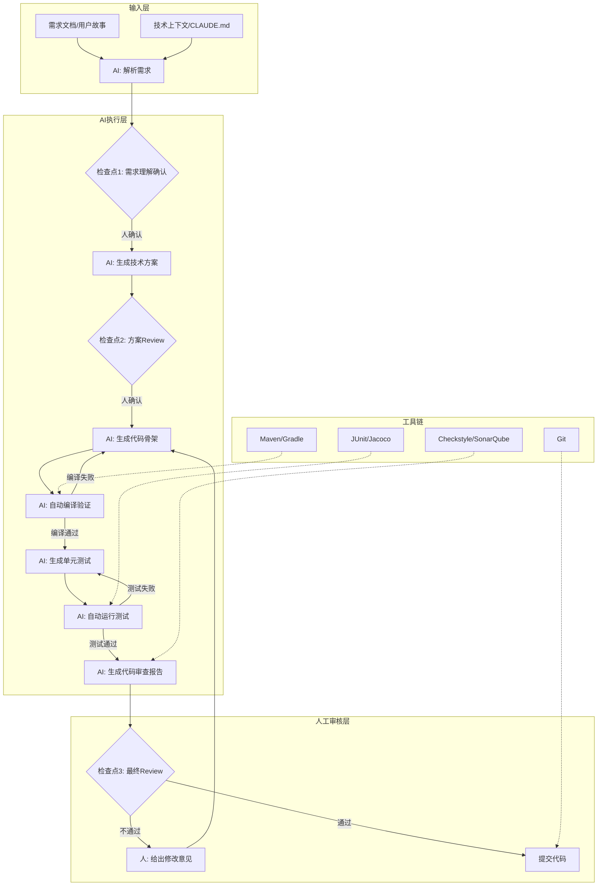
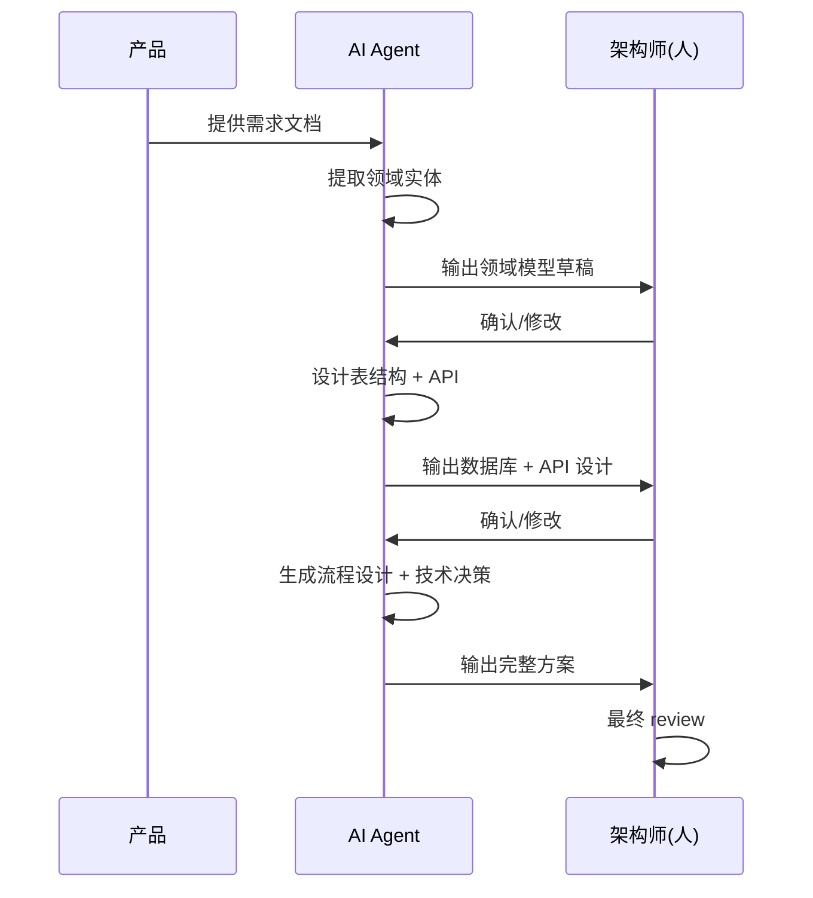

# 第5章 AI 工作流设计

## 5.1 本章要解决的问题

你已经会用 Claude Code、ChatGPT、Codex 回答单个问题了。但你发现：

- 每次做一个完整需求，还是要手动把 AI 的回答粘贴到各个文件里
- AI 生成的代码看着没问题，一跑就报错，来回修五六次
- 让 AI 帮你排查一个生产 bug，它给你的排查方向完全跑偏，浪费半小时
- 团队其他人问你"你是怎么用 AI 的"，你发现说不清楚，只能现场演示一遍

这些问题的根因是同一个：**你把 AI 当成问答工具在用，没有把它当成流程节点来设计**。

本章解决的核心问题是：**如何把一次性的 AI 问答升级为可复用、可验证、可协作的 AI 工作流**。

学完本章你会：

- 能判断什么任务适合设计成 AI 工作流，什么不适合
- 掌握 AI 工作流的通用设计公式，能自己设计新的工作流
- 知道在企业 Java/Spring Boot 研发场景中，哪些环节已经有成熟的工作流模板可以直接用
- 能把个人的 AI 使用经验沉淀成团队 SOP，而不是靠口口相传

## 5.2 什么是 AI 工作流

> AI 工作流：将一项研发任务的执行过程拆解为多个步骤，其中部分步骤由 AI 自动执行，部分步骤由人审阅决策，通过明确的输入、输出、检查点和交接协议串联起来，形成稳定可复用的任务管道。

三个关键特征：

1. **多步骤**：不是一次 prompt 出结果，而是多个 prompt 按顺序串联，前一步的输出是后一步的输入
2. **人机协作**：AI 执行的部分和人工审阅的部分有明确的边界和交接点
3. **可复用**：同一个工作流，换一个需求输入，能稳定地产出质量可预期的结果

对比一下：

| | 单次 AI 问答 | AI 工作流 |
|---|---|---|
| 步骤数 | 1 步 | 多步串联 |
| 质量控制 | 靠运气 | 有检查点 |
| 人工介入 | 随意，没有约定 | 在预设节点介入 |
| 可复制性 | 换一个人，问不出同样的结果 | 换一个人，跑出同样质量的结果 |
| 典型耗时 | 5-10 分钟 | 10-30 分钟（但产出完整） |

举个例子：用 AI 写一个 Spring Boot 接口。

**单次问答模式**：你把需求描述扔给 AI，AI 返回一段 Controller 代码。你复制粘贴，发现少了 Service 层、没写参数校验、异常处理用的是 `printStackTrace()`、没给测试。你追问三次，分别拿到 Service、DTO、测试，然后手动对齐字段名。

**工作流模式**：你运行一个预定义的流程 -- 第一步 AI 读需求生成接口 spec → 你确认 spec → 第二步 AI 同时生成 Controller/Service/DAO/DTO → 第三步 AI 自动生成单元测试 → 第四步 AI 自动跑编译验证 → 你做最终 review。每次步骤完成后自动进入下一步，出错自动回退修正。

## 5.3 什么任务适合设计成 AI 工作流

判断标准，三个问题：

### 问题一：这个任务有明确的输入和输出吗？

输入和输出必须能写成文档或代码。模糊的需求（"让用户体验好一点"）不适合，具象的需求（"根据这个接口文档生成 Controller/Service/DAO 代码"）适合。

### 问题二：这个任务的正确性能被客观验证吗？

要有"对错"判断标准。代码能编译吗？测试能通过吗？SQL 执行计划走了索引吗？这些都是客观可验证的。"这段代码设计得优雅吗"不适合作为唯一标准，但可以作为人工 review 的维度。

### 问题三：这个任务你一个月做几次？

如果一个月只做一次，设计工作流的投入产出比不够。但如果你和团队其他人加起来一个月做十次以上，就值得设计工作流。

### 快速判断表

| 任务 | 适合？ | 理由 |
|---|---|---|
| 写一个新 CRUD 接口 | 适合 | 输入（需求文档/接口定义）、输出（代码）、验证（编译+测试）都明确，高频 |
| 设计系统架构 | 不适合全自动 | 正确性无法客观验证，但可以做人机协作半自动 |
| 生成单元测试 | 非常适合 | 输明确、可验证、高频、模式固定 |
| 排查一个未知的生产 bug | 部分适合 | 前半段（收集信息、生成排查方向）可以；后半段（定位根因）必须人参与 |
| 写项目周报 | 非常适合 | 输入（git log、issue 列表）明确，输出结构固定 |
| Code Review | 适合 | 输入（diff）、输出（review 意见）、验证（规则可定义）都明确 |
| 需求澄清 | 部分适合 | 可以生成澄清问题清单，但回答需要人来做 |
| 数据库表设计 | 适合 | 从领域模型到 DDL，有规可循 |

### 投入产出判断公式

```
工作流价值 = (单次节省时间 × 月均执行次数 × 参与人数) - (设计工作流耗时 × 1.5) - (维护工作流月均耗时)
```

如果结果是正数，就值得做。一个月跑 20 次的任务，每个节省 15 分钟，一个月就是 5 小时 -- 花 3 小时设计一个工作流很划算。

## 5.4 通用公式

> **AI 工作流 = 目标 + 上下文 + 约束 + 工具 + 步骤 + 检查点 + 验收标准 + 人工介入点**

这 8 个要素缺一不可。逐个拆解。

### 5.4.1 目标（Goal）

一句话说清楚这个工作流要产出什么，给谁用。

```
坏目标：用 AI 提高开发效率
好目标：输入接口需求文档，自动生成 Spring Boot Controller/Service/DAO/DTO 代码和单元测试，编译通过且测试覆盖率大于 80%
```

目标要包含：输入是什么、输出是什么、质量底线是什么。

### 5.4.2 上下文（Context）

AI 在执行每一步之前需要知道什么。上下文不是一次给完，而是每个步骤给对应的上下文。

典型上下文包括：

- **项目技术栈**：Spring Boot 2.7 / MyBatis-Plus / MySQL 8.0 / Java 17
- **代码规范**：统一响应体格式 `Result<T>`、异常处理用 `@RestControllerAdvice`、禁止使用 `printStackTrace()`
- **项目结构**：包路径约定、已有的 BaseService/BaseController 等基类
- **业务领域知识**：核心实体关系、状态机、业务流程
- **参考示例**：项目中已有的类似实现，作为风格参考

上下文要写成文件或系统 prompt，不要每次手动描述。可以用项目的 `CLAUDE.md` 或专门的 `context/` 目录存放。

### 5.4.3 约束（Constraints）

告诉 AI **不能做什么**。约束比提示更可靠 -- 提示是建议，约束是边界。

约束分三类：

**代码级约束**：
- 不允许使用已废弃的 API
- 不允许引入 `spring-boot-starter-web` 之外的未授权依赖
- 不允许在 Controller 里写业务逻辑
- 所有 SQL 必须用参数化查询，不允许字符串拼接
- 禁止 `catch (Exception e) { e.printStackTrace(); }`

**流程级约束**：
- 每一步输出必须包含自检结果
- 如果上一步失败，不允许进入下一步
- 生成代码后必须自动尝试编译，编译失败自动修正

**业务级约束**：
- 金额计算必须用 `BigDecimal`，不允许用 `float`/`double`
- 对外接口必须做参数校验（`@Valid`）
- 数据库操作必须考虑乐观锁或悲观锁

### 5.4.4 工具（Tools）

每个步骤 AI 可以调用哪些工具。在 Claude Code 中，这意味着配置 `allowedTools`；在自定义 pipeline 中，这意味着给 AI 提供什么能力。

研发工作流常用工具：

| 工具 | 用途 | 示例 |
|---|---|---|
| 文件读写 | 生成代码、读取已有代码 | Read/Write/Edit |
| 编译执行 | 验证代码是否能编译通过 | `mvn compile -q` |
| 测试执行 | 验证功能正确性 | `mvn test -pl <module>` |
| Git 操作 | 创建分支、提交代码 | `git diff` / `git log` |
| 代码质量 | 静态分析 | SonarQube CLI / Checkstyle |
| 数据库工具 | 查询表结构、验证 SQL | 数据库客户端（只读） |
| 文档读取 | 读取需求文档、设计文档 | Read 已有的 .md 文件 |

关键原则：**给 AI 最小必要权限**。第一步只需要读文档，就别给它写代码的权限。最后一步才需要 git 权限，前面步骤不需要。

### 5.4.5 步骤（Steps）

工作流的核心骨架。每个步骤的定义包含：

```
步骤 N：[步骤名称]
- 输入：[从哪来，是什么格式]
- 任务：[AI 要完成什么]
- 输出：[产出什么，什么格式，放哪里]
- 自检：[AI 必须自己检查什么]
```

步骤设计原则：

1. **单步骤粒度**：一个步骤只做一件事。生成 Controller 是一个步骤，生成 Service 是另一个步骤，不要混在一起
2. **输入明确**：每一步的输入必须来自上一步的输出或指定的文件，不允许 AI "自行推理"上游结果
3. **输出物化**：每一步的输出必须写入文件或终端输出，不能只存在 AI 的上下文里。这样出错时可以回溯到具体步骤
4. **可回退**：如果第 N 步失败，能够从第 N-1 步的输出重新开始，而不是从头再来

### 5.4.6 检查点（Checkpoints）

每个关键步骤之后设置检查点，验证这一步的输出质量。

检查点分三种：

**自动检查点**：AI 自己执行，无需人参与
- 代码能编译通过？（跑 `mvn compile`）
- 测试能跑过？（跑 `mvn test`）
- 代码风格符合 Checkstyle 规则？

**半自动检查点**：AI 生成检查报告，人确认
- AI 列出生成的接口列表，你确认没有遗漏
- AI 列出异常情况的处理方案，你确认覆盖全面

**人工检查点**：必须人来判断
- 需求理解是否正确
- 业务逻辑是否有遗漏
- 最终代码 review

检查点不是越多越好。每个检查点都在消耗时间。通常一个 10 步的工作流，设置 3-4 个检查点就够了：开始前 1 个（确认需求理解正确），中间 1-2 个（确认核心逻辑），结束时 1 个（最终 review）。

### 5.4.7 验收标准（Acceptance Criteria）

整个工作流跑完后，如何判断结果可用。验收标准是客观的、可度量的。

```
坏验收标准：代码质量好
好验收标准：
  1. mvn compile 零错误
  2. 单元测试覆盖率 ≥ 80%（通过 jacoco 验证）
  3. Checkstyle 零违规
  4. 所有接口参数校验都有 @Valid 注解
  5. 所有数据库操作都有事务注解 @Transactional
```

### 5.4.8 人工介入点（Human-in-the-Loop Points）

人工介入点不是"出错了人来看看"，而是**刻意设计的人机交接节点**。详见 5.7 节。

## 5.5 AI 工作流设计图

用 Mermaid 流程图，同时展示系统架构视角下的工作流全景，以及 AI 如何与研发工具链协作。



这个流程的核心设计思想：**AI 负责生成和验证，人负责方向和质量把关**。每次 AI 完成产出后，先跑自动验证（编译、测试），验证通过才交给人类 review。人只看"机器验证通过但需要人工判断"的东西。

## 5.6 如何把研发任务拆成 AI 可执行步骤

一个研发任务（比如"开发用户管理模块"）到 AI 可执行步骤的拆解，遵循 **任务分解三原则**。

### 原则一：从人的工作流程逆推，不是从 AI 的能力出发

先想"人是怎么做的"，再拆成步骤。别想"AI 能做什么"。

人的开发流程：
1. 理解需求 → 2. 设计方案 → 3. 建数据表 → 4. 写 DAO 层 → 5. 写 Service 层 → 6. 写 Controller 层 → 7. 写测试 → 8. 自测 → 9. Code Review

AI 工作流步骤就跟这个一一对应，每步一个 prompt。不需要"发明新流程"。

### 原则二：每个步骤必须有且仅有一个输出文件

如果一个步骤"生成 DAO 和 Service"，那就拆成两步。为什么？

- **可回退**：如果 Service 生成错了，你不用重新生成 DAO
- **可并行**：DAO 和 Service 可以在两个沙箱里同时生成
- **可追踪**：出问题时，你知道是哪个文件、哪个步骤出的问题

### 原则三：写的步骤放后面，读的步骤放前面

AI 工作流中，步骤顺序很重要。能决定后续方向的理解性步骤，必须放在生成性步骤前面。

正确顺序：
```
步骤1: AI 读需求 → 输出理解摘要 → 人确认
步骤2: AI 读表结构 → 输出实体关系图 → 人确认
步骤3: AI 生成 DDL
步骤4: AI 生成 DAO
步骤5: AI 生成 Service
步骤6: AI 生成 Controller
步骤7: AI 生成测试
```

错误顺序：
```
步骤1: AI 读需求 → 直接生成全部代码 → 人 review → 发现理解错了 → 重来
```

### 拆解实例：用户积分模块

原始需求："实现用户积分功能，用户下单获得积分，积分可以抵扣订单金额，积分有一年有效期"

拆解为 10 个步骤：

| 步骤 | 名称 | 输入 | 输出 | 检查点 |
|---|---|---|---|---|
| S1 | 需求解析 | 需求原文 | 领域模型草稿 + 核心流程描述 | 人确认理解 ✅ |
| S2 | 表结构设计 | 领域模型 | `points_account` / `points_record` DDL | 人确认字段 ✅ |
| S3 | DAO 生成 | DDL + MyBatis-Plus 规范 | `PointsAccountMapper.java` `PointsRecordMapper.java` | 编译通过 |
| S4 | 积分获取 Service | 需求 + DAO | `PointsEarnService.java` | 编译通过 |
| S5 | 积分消费 Service | 需求 + DAO | `PointsConsumeService.java` | 编译通过 |
| S6 | 积分过期处理 | 需求 + DAO | `PointsExpireService.java` | 编译通过 |
| S7 | Controller 层 | Service 接口汇总 | `PointsController.java` + 请求/响应 DTO | 编译通过 |
| S8 | 单元测试生成 | 所有 Service + Controller | 对应测试类 | `mvn test` 通过 |
| S9 | 集成测试生成 | 完整流程 | 下单积分类 + 抵扣类 | `mvn verify` 通过 |
| S10 | 最终 Review | 全部代码 | Review 报告 | 人确认 ✅ |

注意：S3-S7 之后都有一个隐含的自动检查点 -- `mvn compile -q`。失败了就自动回退当前步骤重试。

## 5.7 如何设计人工介入点

Human-in-the-loop（HITL）是 AI 工作流质量的最后防线。设计 HITL 的关键不是"要不要人看"，而是"在哪个节点看、看什么、怎么看"。

### HITL 设计三原则

**原则一：在高不确定性的步骤之后介入**

AI 最不可靠的地方不是代码生成，而是**需求理解**和**方案选择**。在这两步之后必须设人工介入。

```
确定性的（AI 做得好）：
  DDL → DAO 代码：规则明确，模式固定，AI 擅长

不确定性的（需要人介入）：
  需求描述 → 领域模型：可能理解偏差
  多种方案 → 选择方案：需要业务权衡
```

**原则二：介入时给上下文，不要让人去回忆**

坏的 HITL："请确认上面的代码是否正确"

好的 HITL：
```
检查点 #3：积分消费逻辑审查

请在 PointsConsumeService.java 中确认以下关键逻辑：

1. 优先消费即将过期的积分（行 45-62）
   → 验证：顺序是否按 expire_time ASC 排列？
2. 积分不足时回滚操作（行 78-85）
   → 验证：事务回滚是否包含了积分和订单两边？
3. 并发扣减使用了乐观锁（行 34, version 字段）
   → 验证：version 字段在 UPDATE 语句中是否正确？

审查结论：[ ] 通过  [ ] 不通过，原因：___
```

**原则三：介入点数量与流程风险成正比**

| 流程类型 | 介入点数量 | 介入位置 |
|---|---|---|
| 简单 CRUD 接口 | 2 个 | 需求确认 + 最终 review |
| 含复杂业务逻辑的接口 | 3-4 个 | 需求确认 + 核心业务逻辑 + 异常处理 + 最终 review |
| 从零搭建新模块 | 4-6 个 | 每个层次完成后 |
| 架构方案设计 | 每个关键决策点 | 选型 + 概要设计 + 详细设计 |

### HITL 反模式

- **处处介入**：每个步骤都让人点确认，流程比手写还慢，人会疲劳，变成机械点"确认"
- **末端介入**：只有最后一步让人看，前面全自动。结果是前面理解错了，最后推倒重来
- **无上下文介入**：只给一段代码让人审，不告诉人这段代码在解决什么问题、关键逻辑在哪

## 5.8 如何避免 AI 在长任务中跑偏

当工作流超过 5 步，AI 开始出现"跑偏"现象 -- 忘记最初的目标、生成的内容前后矛盾、格式越来越随意。这不是 AI "变傻"了，而是上下文窗口管理出了问题。

### 问题根因

AI 的上下文窗口是有限的。随着步骤推进，早期的指令和约束被"挤"出了有效注意范围。AI 开始基于最近几步的局部信息做决策，忽略了全局目标。

### 对策一：每步重新注入核心约束

不要指望 AI 记住第一步给的约束。每一步的 prompt 里，把最关键的 3-5 条约束重新带入。

```
步骤 N 的 prompt 模板：

# 本步任务
[当前步骤的具体任务]

# 全局约束（每次重复）
1. Spring Boot 2.7, Java 17, MyBatis-Plus 3.5
2. 统一响应体 Result<T>，异常用 GlobalExceptionHandler
3. 禁止 printStackTrace()，禁止 System.out.println()
4. 金额用 BigDecimal，禁止 float/double

# 上一步输出
[第 N-1 步的输出摘要]

# 本步要求
[具体输入和输出要求]
```

### 对策二：用"锚点"保持方向

在第一步就定义一份"不变清单"（immutable checklist），后续每一步生成输出时，AI 必须自检是否偏离了这份清单。

```
不变清单（贯穿全流程）：
- [ ] 接口路径是否在 /api/v1/ 下？
- [ ] 是否使用了 Result<T> 包装返回值？
- [ ] 是否对入参做了 @Valid 校验？
- [ ] 是否使用了 @Transactional？
- [ ] 异常是否由 GlobalExceptionHandler 统一处理？
```

每步结束时 AI 自己打勾。三步之后如果某个项开始不满足了，AI 自己就能发现并修正。

### 对策三：限定单步输出长度

给每一步的输出长度设上限。如果一个步骤的输出超过了预期，说明这个步骤的粒度过大，应该拆成两步。

```
步骤 N 的输出要求：
- Controller 代码：不超过 80 行（不含 import）
- Service 代码：不超过 150 行（不含 import）
- 超过上限说明步骤粒度过大，请只输出核心逻辑并标注待拆分部分
```

### 对策四：设置"方向检查点"

长流程中每隔 3-5 步设置一个方向检查点，让 AI 自己回答三个问题：

```
方向检查（第 N 步完成后）：
1. 当前产出是否仍然服务于原始目标？[是/否]
2. 是否偏离了不变清单中的任何一项？[无偏离/有偏离：___]
3. 下一步做什么？[一句话描述]

如果第 1 题回答"否"或第 2 题有偏离，回到最后正确的步骤重来。
```

### 对策五：步骤失败自动回退，不继续

最常见的跑偏场景：第 3 步编译失败，AI 说"没关系我先继续写第 4 步，回头修"。绝对禁止。一步不通过绝不进入下一步。工作流脚本必须执行这个规则，不能靠 AI 自觉。

## 5.9 企业 IT 场景工作流示例

### 5.9.1 需求评审工作流

**目标**：输入一份产品需求文档（PRD），输出结构化的需求澄清问题清单和技术可行性评估。

**输入**：
- 产品需求文档（PRD）
- 现有系统架构说明（可从项目的 CLAUDE.md 获取）

**步骤**：

| 步骤 | 操作 | 输出 |
|---|---|---|
| S1 | AI 解析 PRD 全文，提取功能点列表，标注每个功能点的优先级和依赖关系 | 功能点清单（Markdown 表格） |
| S2 | AI 逐条检查功能点是否描述完整（正常流程、异常流程、边界条件、非功能需求） | 完整度评估报告 |
| S3 | AI 对不完整的功能点生成澄清问题 | 问题清单（按功能点分组） |
| S4 | AI 评估每个功能点对现有系统的影响范围和潜在风险 | 影响评估矩阵 |
| S5 | 人确认问题清单，补充遗漏，标记已解答的问题 | 最终评审结论 |

**输出**：
- 功能点清单
- 澄清问题清单
- 影响评估矩阵
- 评审结论（通过/有条件通过/不通过）

**关键提示词片段**：

```
你是一位资深 Java 后端架构师，正在评审一份 PRD。

请完成以下任务：

1. 从 PRD 中提取所有功能点，按优先级（P0/P1/P2）和依赖关系排列
2. 对每个功能点，检查是否覆盖了以下维度：
   - 正常流程（Happy Path）
   - 异常流程（错误输入、超时、依赖服务不可用）
   - 边界条件（空值、极值、并发）
   - 非功能需求（性能、安全、数据一致性要求）
3. 对覆盖不完整的功能点，生成具体的澄清问题
4. 评估对现有系统的影响，标记高风险项

约束：
- 问题必须具体，禁止问"这个需求确认了吗"这类无效问题
- 每个问题都要指向具体的功能点和缺失维度
- 影响评估要说明涉及的模块和改动范围
```

### 5.9.2 技术方案生成工作流

**目标**：输入需求文档和现有架构，输出可执行的技术方案文档。

**输入**：
- 已确认的需求文档
- 现有系统架构文档
- 技术栈约束

**步骤**：

| 步骤 | 操作 | 输出 |
|---|---|---|
| S1 | AI 分析需求，提取核心领域实体和它们的关系 | 领域模型图 + 实体说明 |
| S2 | AI 设计数据库表结构，包含索引策略、分表策略（如需要） | DDL 草稿 + 索引设计说明 |
| S3 | AI 设计接口列表（REST API），包含路径、方法、入参、出参、错误码 | API 设计文档 |
| S4 | AI 设计核心业务流程的时序图/流程图 | 流程设计（Mermaid 图） |
| S5 | AI 识别技术风险点，给出备选方案和推荐方案 | 技术决策记录 |
| S6 | 人 review 整体方案，确认技术决策 | 最终方案文档 |

**输出**：
- 领域模型
- 数据库设计
- API 设计
- 流程设计
- 技术决策记录

**Mermaid 流程示例**：



### 5.9.3 接口开发工作流（Spring Boot）

这是最核心的企业场景。完整覆盖从 spec 到 review 的全流程。

**目标**：输入接口定义 spec，输出完整的 Controller / Service / DAO / DTO 代码和测试，编译通过且测试覆盖率 > 80%。

**输入**：
- 接口 spec：包含路径、方法、请求参数、响应结构、业务逻辑说明、异常情况
- 项目上下文：CLAUDE.md、现有 BaseController/BaseService、已有实体类
- 数据库表结构

**步骤**：

```
步骤 1：解析 spec → 生成编码计划
步骤 2：生成 DTO（Request / Response）
步骤 3：生成 DAO 层（Mapper + 实体 + XML 如需要）
步骤 4：生成 Service 层（接口 + 实现）
步骤 5：生成 Controller 层
步骤 6：生成单元测试（Service 测试）
步骤 7：生成接口测试（Controller 集成测试）
步骤 8：自动编译 + 运行测试 → 修复失败
步骤 9：AI 自我 Code Review → 生成 review 报告
步骤 10：人最终 review → 确认或打回
```

**详细步骤定义**：

**S1 - 解析 spec → 生成编码计划**

```
输入：接口 spec 文档
任务：
  1. 提取所有接口清单
  2. 列出需要的实体、DTO、Mapper、Service、Controller
  3. 标注依赖关系（哪个 Service 需要哪个 Mapper）
  4. 列出需要修改的已有文件
输出：编码计划（Markdown），存入 docs/plan/{feature-name}.md
自检：是否遗漏了任何 spec 中提到的接口？是否有循环依赖？
检查点：人确认编码计划 ✅
```

**S2 - 生成 DTO**

```
输入：编码计划 + spec 中的请求/响应定义
任务：
  1. 生成 Request DTO（放在 dto/request/ 包下）
  2. 生成 Response DTO（放在 dto/response/ 包下）
  3. 所有字段添加校验注解（@NotNull/@NotBlank/@Valid 等）
  4. 添加 Swagger/OpenAPI 注解
输出：
  - CreateUserRequest.java
  - UpdateUserRequest.java
  - UserQueryRequest.java
  - UserResponse.java
  - PageResult.java（如需要通用分页）
自检：
  - 每个 DTO 是否都标注了 @ApiModel / @Schema？
  - 必填字段是否有 @NotNull / @NotBlank？
  - 日期字段是否使用了 @JsonFormat？
检查点：编译通过
```

**S3 - 生成 DAO 层**

```
输入：编码计划 + 表结构 + MyBatis-Plus 规范
任务：
  1. 生成实体类（使用 @TableName、@TableId、@TableField）
  2. 生成 Mapper 接口（继承 BaseMapper<T>）
  3. 如有复杂查询，生成对应的 Mapper XML
  4. 逻辑删除使用 @TableLogic
输出：
  - User.java（实体）
  - UserMapper.java（Mapper 接口）
  - UserMapper.xml（如需自定义 SQL）
自检：
  - 实体字段是否正确映射了数据库字段？
  - 是否使用了 MyBatis-Plus 的逻辑删除？
  - 索引字段是否在实体中标注？
检查点：编译通过
```

**S4 - 生成 Service 层**

```
输入：编码计划 + DTO + DAO + spec 中的业务逻辑
任务：
  1. 生成 Service 接口
  2. 生成 ServiceImpl 实现类
  3. 业务方法添加 @Transactional
  4. 使用 BizException 和统一错误码抛出业务异常
  5. 分页查询使用 MyBatis-Plus 的 Page
  6. 调用 Mapper 方法，组装返回 DTO
  7. 如有复杂业务规则，提取为私有方法
输出：
  - UserService.java（接口）
  - UserServiceImpl.java（实现）
自检：
  - 所有写操作是否加了 @Transactional？
  - 异常是否使用了 BizException 而非 RuntimeException？
  - 是否存在 N+1 查询问题？
  - DTO 转换是否使用了 MapStruct 或手动映射方法？
检查点：编译通过
```

**S5 - 生成 Controller 层**

```
输入：编码计划 + Service 接口 + DTO + spec 中的接口定义
任务：
  1. 生成 Controller，使用 @RestController + @RequestMapping
  2. 入参使用 DTO + @Valid
  3. 返回值使用 Result<T> 包装
  4. 添加 Swagger @Tag / @Operation 注解
  5. Controller 方法只做参数校验和调用 Service，不写业务逻辑
输出：
  - UserController.java
自检：
  - 接口路径是否与 spec 一致？
  - 所有入参是否都有 @Valid？
  - 是否直接返回了 Service 结果（没有额外业务逻辑）？
  - @Operation 注解的 summary 是否准确描述了接口功能？
检查点：编译通过
```

**S6 - 生成单元测试**

```
输入：Service 实现类
任务：
  1. 为每个 Service 方法生成单元测试
  2. 使用 @ExtendWith(MockitoExtension.class)
  3. Mock 所有 Mapper 依赖
  4. 覆盖正常场景、边界场景、异常场景
  5. 断言具体的返回值字段，不只断言 "not null"
输出：
  - UserServiceImplTest.java
自检：
  - 是否使用了 @Mock 而非 @MockBean？
  - 每个 public 方法是否至少有 1 个测试用例？
  - 异常场景是否有测试？
检查点：mvn test -Dtest=UserServiceImplTest 通过
```

**S7 - 生成接口测试**

```
输入：Controller 类 + 接口 spec
任务：
  1. 使用 @SpringBootTest + @AutoConfigureMockMvc
  2. 生成正常请求的集成测试
  3. 生成参数校验失败的测试（缺少必填字段、格式错误等）
  4. 有数据库操作的测试，使用 @Transactional 自动回滚
输出：
  - UserControllerIT.java
自检：
  - 是否使用了 MockMvc？
  - 是否验证了 HTTP 状态码和响应体内容？
  - 参数校验失败的用例是否覆盖了主要校验规则？
检查点：mvn verify -Dtest=UserControllerIT 通过
```

**S8 - 自动编译 + 运行测试**

```
任务：
  1. mvn compile -q → 如果失败，分析错误，修正代码，重新编译
  2. mvn test -q → 如果失败，分析测试失败原因，修正代码或测试
  3. mvn jacoco:report → 检查覆盖率，如果 < 80%，补充测试
自检：编译零错误，测试零失败，覆盖率 ≥ 80%
```

**S9 - AI 自我 Code Review**

```
输入：所有生成的代码
任务：
  1. 检查代码规范（Checkstyle 或项目约定的规则）
  2. 检查是否有明显的性能问题（N+1 查询、未建索引的查询等）
  3. 检查异常处理是否完整
  4. 检查是否存在安全风险（SQL 注入、XSS、敏感信息泄露等）
输出：Code Review 报告（Markdown）
自检：是否覆盖了规范、性能、安全三个维度？
```

**S10 - 人最终 review**

```
输入：Code Review 报告 + 全部代码
人检查：
  1. 业务逻辑是否正确
  2. 异常处理是否合理
  3. 是否有过度设计或设计不足
  4. 是否需要补充日志埋点
输出：Review 结论（Approved / Changes Requested）
```

**时间估算**（一个典型 CRUD 模块，约 8 个接口）：

| 步骤 | AI 耗时 | 人耗时 |
|---|---|---|
| S1 编码计划 | 30s | 3min |
| S2 DTO | 1min | 0 |
| S3 DAO | 1min | 0 |
| S4 Service | 2min | 0 |
| S5 Controller | 1min | 0 |
| S6 单元测试 | 2min | 0 |
| S7 接口测试 | 2min | 0 |
| S8 编译+测试 | 2-5min（含修复） | 0 |
| S9 AI Review | 1min | 0 |
| S10 人 Review | 0 | 10min |
| **合计** | **约 13min** | **约 13min** |

人工手写同样的代码通常需要 3-4 小时。工作流把人的时间从"写代码"变成了"确认方向 + 最终审核"。

### 5.9.4 单元测试生成工作流

**目标**：输入一个 Service 类的实现代码，输出完整的单元测试，覆盖率 > 85%。

**输入**：
- Service 实现类源码
- 相关的 DTO 和实体类

**步骤**：

| 步骤 | 操作 | 输出 |
|---|---|---|
| S1 | AI 分析 Service 类，列出所有 public 方法和它们的输入输出类型 | 方法清单 + 参数依赖分析 |
| S2 | AI 为每个方法设计测试用例矩阵（正常/边界/异常） | 测试用例矩阵表 |
| S3 | AI 生成单元测试代码（Mockito + JUnit 5） | XxxServiceTest.java |
| S4 | AI 运行测试，修复失败用例 | 测试通过报告 + 覆盖率报告 |
| S5 | 人审核测试用例矩阵，确认没有遗漏关键场景 | 审核结论 |

**测试用例矩阵示例**（以 `createUser` 方法为例）：

| 场景分类 | 用例名 | 输入 | 预期结果 |
|---|---|---|---|
| 正常 | 正常创建用户 | 合法的 CreateUserRequest | 返回 UserResponse，userId 不为空 |
| 正常 | 创建管理员用户 | role=ADMIN 的请求 | 返回 UserResponse，role=ADMIN |
| 边界 | 用户名为空 | username=null | 抛出 BizException(PARAM_ERROR) |
| 边界 | 用户名为最大长度 | username=50个字符 | 正常创建 |
| 边界 | 用户名超过最大长度 | username=51个字符 | 抛出 BizException(PARAM_ERROR) |
| 异常 | 用户名已存在 | 重复的 username | 抛出 BizException(USER_EXISTS) |
| 异常 | 部门不存在 | deptId=999 | 抛出 BizException(DEPT_NOT_FOUND) |
| 异常 | 数据库异常 | Mock Mapper 抛异常 | 抛出 BizException(DB_ERROR) |

### 5.9.5 代码 Review 工作流

**目标**：对一个 PR 的 diff 进行自动化 review，输出结构化的 review 意见，人做最终确认。

**输入**：
- Git diff（当前分支 vs 目标分支）
- 项目代码规范文档

**步骤**：

| 步骤 | 操作 | 输出 |
|---|---|---|
| S1 | AI 分析 diff，提取变更文件清单并按类型分类（新增/修改/删除） | 变更概览 |
| S2 | AI 逐文件检查代码规范 | 规范违规清单 |
| S3 | AI 检查潜在 Bug（空指针、事务遗漏、SQL 问题、并发问题） | 潜在缺陷清单 |
| S4 | AI 检查性能问题（N+1 查询、不必要的对象创建、循环内 IO） | 性能风险清单 |
| S5 | AI 检查安全问题（SQL 注入、XSS、敏感信息日志打印） | 安全风险清单 |
| S6 | AI 检查设计问题（违反单一职责、循环依赖、不合理的抽象） | 设计改进建议 |
| S7 | AI 汇总生成 Review 报告 | 结构化 Review 报告 |
| S8 | 人审核报告中的 Critical/High 问题，确认是否需要修改 | 最终 Review 结论 |

**Review 报告结构**：

```markdown
# Code Review Report — feature/user-points

## 变更概览
- 新增文件：7 个
- 修改文件：2 个
- 删除文件：0 个
- 新增代码：420 行

## Critical（必须修改）
1. [SECURITY] PointsConsumeService.java:56 — SQL 拼接风险
   → 使用了字符串拼接构建 WHERE 条件，存在 SQL 注入风险
   → 建议：改用 MyBatis-Plus 的 LambdaQueryWrapper

2. [BUG] PointsAccountServiceImpl.java:34 — 缺少 @Transactional
   → 积分扣减操作涉及 account 和 record 两张表，但没有事务保护
   → 建议：方法添加 @Transactional(rollbackFor = Exception.class)

## High（强烈建议修改）
3. [PERF] PointsRecordMapper.xml:23 — N+1 查询
   → 循环内调用 pointsRecordMapper.selectById()，建议批量查询

## Medium（建议修改）
4. [DESIGN] PointsEarnService.java — 方法过长（120 行）
   → earnPoints() 方法做了太多事情，建议拆分成多个私有方法

## Low（可选优化）
5. [STYLE] UserController.java:15 — 未使用的 import
```

**风险分级标准**：

| 级别 | 定义 | 示例 |
|---|---|---|
| Critical | 会影响线上正确性或安全性的问题 | SQL 注入、事务遗漏、关键逻辑错误 |
| High | 在生产负载下会暴露的性能问题，或可能导致 bug 的设计缺陷 | N+1 查询、未处理并发 |
| Medium | 代码质量或可维护性问题 | 方法过长、命名不规范 |
| Low | 风格或可读性建议 | 未使用的 import、注释拼写错误 |

### 5.9.6 生产问题排查工作流

**目标**：输入错误日志或问题描述，输出排查方向和根因假设，辅助人快速定位问题。

**注意**：这个工作流是**辅助性**的，AI 不直接操作生产环境，不修改代码。只做分析和假设生成。

**输入**：
- 错误日志（堆栈信息）
- 问题发生时间、影响范围描述
- 相关代码（从代码仓库中读取）

**步骤**：

| 步骤 | 操作 | 输出 |
|---|---|---|
| S1 | AI 解析错误堆栈，提取异常类型、发生位置、调用链 | 异常摘要 |
| S2 | AI 搜索源码中的相关代码，还原异常发生时的上下文 | 代码上下文分析 |
| S3 | AI 生成可能的原因假设列表（按可能性排序） | 根因假设清单 |
| S4 | AI 为每个假设生成验证方法 | 验证步骤 |
| S5 | 人根据验证步骤去排查，确定根因 | 最终根因 |
| S6 | AI 根据确定的根因生成修复方案 | 修复方案（RCA 文档） |

**S3 根因假设清单示例**：

```
问题：积分扣减接口偶发返回"积分不足"但用户积分充足

假设 1（可能性：高）：并发扣减导致积分被重复消费
  → 依据：PointsAccountServiceImpl.consume() 仅使用了 version 乐观锁，
    但在高并发下，retry 逻辑可能未正确处理
  → 验证：查看该时间段的接口 QPS，检查是否有同一用户多次并发请求

假设 2（可能性：中）：积分过期任务与扣减操作竞态
  → 依据：PointsExpireJob 在扣减同时运行，可能将即将过期的积分标记为已过期
  → 验证：检查过期任务执行时间和问题时间的重叠情况

假设 3（可能性：低）：用户积分记录中存在脏数据
  → 依据：sum(points) != account.available_points
  → 验证：SELECT SUM(amount) FROM points_record WHERE user_id=? AND status='AVAILABLE'
```

### 5.9.7 知识库问答工作流

**目标**：基于团队内部文档（技术方案、设计文档、运维手册、故障复盘等），回答研发过程中的知识性问题。

**输入**：
- 用户的自然语言问题
- 团队知识库（Markdown 文档集合）

**步骤**：

| 步骤 | 操作 | 输出 |
|---|---|---|
| S1 | AI 分析用户问题，提取关键实体和意图 | 检索查询列表 |
| S2 | AI 在知识库中检索相关文档片段 | 相关文档摘要 |
| S3 | AI 基于检索结果生成回答，并标注引用来源 | 带引用的回答 |
| S4 | AI 自检：回答是否准确？引用是否真实存在？ | 置信度评估 |
| S5 | 如果置信度 < 70%，标记为"需要人工确认" | 最终回答 + 置信度标签 |

**RAG 策略**（检索增强生成）：

```
问题："用户积分过期策略是什么？"

检索查询：
  1. "积分 过期 策略"（关键词匹配）
  2. "points expire"（代码中的英文名）
  3. "points-account" 表结构中的 expired_time 字段用途

检索结果：
  - 文档1：积分模块技术方案.md（第 3.2 节"过期策略"）
  - 文档2：积分账户表设计.md（expired_time 字段说明）
  - 文档3：积分过期任务 SOP.md（定时任务执行流程）

回答：
  用户积分过期策略为：
  1. 积分有效期 365 天，从获取日算起
  2. 每日凌晨 2:00 由 PointsExpireJob 扫描 expired_time <= NOW() 的积分
  3. 过期积分状态变为 EXPIRED，同时扣减 account.available_points
  4. 策略定义在：积分模块技术方案.md §3.2
  5. 表结构：points_record 表的 expired_time 字段
  6. 任务配置：积分过期任务 SOP.md

  置信度：高（85%）— 引用来源 3 个，内容一致
```

**置信度评估标准**：

| 置信度 | 条件 | 处理 |
|---|---|---|
| 高 (>80%) | 2 个以上来源，内容一致 | 直接返回 |
| 中 (60-80%) | 只有 1 个来源，或来源间有小矛盾 | 返回 + 标注不确定性 |
| 低 (<60%) | 没有直接来源，或来源矛盾明显 | 标记为"需要人工确认" |

### 5.9.8 项目周报生成工作流

**目标**：输入项目仓库的 Git 历史和 issue 跟踪系统数据，自动生成结构化的项目周报。

**输入**：
- 本周的 Git 提交记录（`git log --since="7 days ago" --oneline`）
- 本周的 Issue/Pull Request 变动（通过 GitHub/GitLab API 获取）
- 上周的周报（用于对比和趋势分析）

**步骤**：

| 步骤 | 操作 | 输出 |
|---|---|---|
| S1 | AI 提取本周提交记录，按作者和模块分组 | 提交分类摘要 |
| S2 | AI 分析提交信息，提炼主要功能点和修复 | 功能/修复列表 |
| S3 | AI 统计 Issue/PR 变化 | 需求/缺陷动态 |
| S4 | AI 与上周周报对比，标注进度变化 | 进度对比 |
| S5 | AI 识别本周风险和阻塞项（从 commit message 的 WIP/FIXME/TODO 中提取） | 风险清单 |
| S6 | AI 生成下周计划草稿 | 下周计划 |
| S7 | 人审核并补充业务层面的上下文 | 最终周报 |

**AI 生成周报草稿示例**：

```markdown
# 项目周报 — 2026-W26 (6.25-7.01)

## 本周进展

### 积分模块（张三）
- ✅ 积分获取/消费/过期核心逻辑开发完成（commit: a3f2b1e, c5d6e2a）
- ✅ 积分账户表 + 积分记录表建表完成
- ✅ 积分过期定时任务开发 + 单元测试完成
- 🔄 积分抵扣订单接口联调中（预计 7.02 完成）

### 订单模块（李四）
- ✅ 订单状态机重构完成（commit: b7c8d3f）
- ✅ 订单超时取消逻辑优化
- ❌ 订单批量导出性能优化 — 阻塞：等待 DBA 审核索引变更

## 风险与阻塞
- 🔴 订单导出优化：等待 DBA 审核索引变更，已阻塞 3 天
- 🟡 积分抵扣联调：依赖支付模块新接口上线（预计 7.01 部署）

## 下周计划
- 积分抵扣联调 + 提测
- 订单导出索引变更上线 + 性能验证
- 用户模块 v2 评审

---

*由 AI 工作流自动生成，人工审核确认*
```

## 5.10 如何把个人 AI 使用经验沉淀成团队 SOP

个人用 AI 提效和团队用 AI 提效是两回事。个人的 prompt 技巧靠手感，团队需要的是可复制、可度量的 SOP。

### 沉淀三步走

**第一步：记录，不要口述**

搞一个共享文档（或项目的 `docs/ai-workflows/` 目录），每个人把自己反复使用的 prompt 模式录进去。格式：

```markdown
# 工作流：Spring Boot Controller 生成

## 作者
张三

## 适用场景
已有 Service 接口和 DTO，需要生成 Controller 层代码

## 前置条件
- 项目使用 Spring Boot + Result<T> 统一响应
- Service 接口已定义
- DTO 类已创建

## 输入
- Service 接口的 Java 文件路径
- 接口 spec 描述

## Prompt 模板
[具体的 prompt 文本，用 {{变量名}} 标注可变部分]

## 输出
- {{Entity}}Controller.java

## 验证方法
1. mvn compile -pl {{module}} 确认编译通过
2. 检查接口路径是否与 spec 一致
3. 检查是否使用了 @Valid 校验

## 使用记录
- 2026-06-15: 用户模块，8 个接口，AI 生成 + 人 review 共 20 分钟
- 2026-06-20: 商品模块，12 个接口，AI 生成 + 人 review 共 25 分钟
```

**第二步：提取共性，建立模板**

当积累 10+ 条记录后，开始找共性。比如：

- 代码生成类 prompt 的结构都是：上下文 + 约束 + 输入 + 输出要求 + 自检清单
- Code Review 类 prompt 的检查维度都是：安全、性能、规范、设计

提取共性后，形成标准模板。每个人写新工作流时基于模板改，而不是从零写。

**第三步：设定质量门禁**

SOP 不是"建议"，是"要求"。为每个工作流设质量门禁：

| 工作流 | 质量门禁 |
|---|---|
| 接口开发 | 编译通过 + 测试覆盖率 > 80% + Checkstyle 0 违规 |
| 代码 Review | Critical 问题必须 0 个 |
| 单元测试生成 | 覆盖率 > 85% + 测试全部通过 |
| 技术方案 | 通过架构师 review |

### SOP 维护机制

- **月度回顾**：每月 review 一次工作流的使用效果。哪些工作流大家爱用？哪些从来不用？为什么？
- **版本管理**：工作流 prompt 模板用 Git 管理，改动走 PR，评审通过后生效
- **效果基线**：每个工作流记录"人工耗时 vs AI+人工耗时"，用数据证明价值，驱动推广

### 避免的陷阱

- **不要搞太多工作流**：10 个精选工作流 > 50 个鸡肋工作流。维护也有成本
- **不要让新人先学 SOP 再用 AI**：应该让新人先用 AI（自由探索），习惯了再引入 SOP（规范提效）。顺序反了会产生抵触
- **不要写成学术论文**：SOP 就是操作手册，写"怎么做"就行，不要论证"为什么这么做"

## 5.11 常见误区

### 误区一：工作流越长越好，越细越好

12 个步骤不一定比 6 个步骤好。步骤越多，上下文窗口压力越大，跑偏概率越高。每个步骤必须有明确的增量价值。

**判断标准**：这个步骤如果去掉，会不会导致后续步骤出错？如果不会，这个步骤就可以合并。

### 误区二：AI 能做全流程自动化，不需要人

当前阶段（2026 年），AI 在代码生成上的准确率大约是 80-90%。这意味着 10 步的工作流，如果全自动，几乎必然在某一步出错。而且 AI 缺少业务判断力 -- 它能写正确的代码，但不知道"这个设计是否符合业务未来半年的演进方向"。

人机协作不是妥协，是当前最优解。

### 误区三：直接用别人的 prompt 模板，不用改

每个团队的技术栈、代码规范、业务特点都不同。拿来的模板必须本地化适配。尤其是约束部分 -- 你项目里用 `GlobalExceptionHandler` 做统一异常处理，别人的模板里写的是 `@ControllerAdvice`，直接抄就会生成不一致的代码。

### 误区四：工作流设计一次就完事

工作流是需要持续迭代的。每次跑完工作流，记录遇到的问题和改进点。一个月后回过头看，通常会有明显的优化空间。

### 误区五：只设计"快乐路径"的工作流

工作流最常见的失败不是步骤本身出错，而是输入不理想 -- 需求文档不清楚、表结构有遗留字段、依赖服务接口变更。工作流必须包含对这些"不理想输入"的处理策略：是暂停等人工介入，还是用默认值继续？

### 误区六：把 AI 工作流当黑盒

工作流的每一步输出都必须可审查、可回溯。如果某一步 AI 生成了 500 行代码然后直接进入下一步，出了问题你根本不知道是哪个 prompt 的问题。物化每一步的输出，是诊断和优化的前提。

### 误区七：忽视上下文质量

Garbage in, garbage out。工作流的第一步往往不是让 AI 干活，而是检查输入质量。输入有问题，后续全白费。

## 5.12 风险与边界

### 风险一：过度依赖

当团队习惯了工作流的一键生成，可能丧失对生成代码的批判性审视。AI 生成的代码看起来"结构完整"容易让人放松警惕。

**对策**：始终保留人工最终 review。AI review 不能替代人工 review。

### 风险二：技术债务累积

AI 倾向于使用最常见的模式解决问题。如果你给它的上下文里有一个不合理的旧模式（比如某个 Service 里把业务逻辑写在 Controller），AI 会学习并复制这种模式。

**对策**：先清理"坏的示例"，再跑工作流。或者在约束中明确禁止反模式。

### 风险三：安全边界模糊

工作流中的 AI 可能拥有文件写权限、数据库读权限、甚至生产环境的命令执行权限。权限边界必须清晰。

**对策**：
- 生产环境工作流只给只读权限，不允许修改
- 代码生成工作流限制在开发分支上执行
- 敏感配置（数据库密码、API 密钥）不允许出现在 AI 的上下文中

### 风险四：知识产权和代码合规

AI 生成的代码是否包含 GPL 协议的代码？这是个尚未完全解决的法律问题。

**对策**：
- 不要用 AI 生成核心算法或专利相关的代码
- 对 AI 生成的代码进行许可证扫描（如 FOSSA）
- 关注公司对 AI 生成代码的政策

### 风险五：团队能力分化

善于用 AI 工作流的人效率远超不用的人，可能导致团队内部的能力分化，甚至影响绩效评估的公平性。

**对策**：将 AI 工作流能力作为团队的基础设施，而非个人技能。目标是"每个人都能用"，而非"少数人用得好"。

### 边界：AI 工作流不该做的事

| 绝对不要 | 原因 |
|---|---|
| 让 AI 直接操作生产数据库 | 安全风险，不可逆 |
| 让 AI 完全自主做架构决策 | AI 缺少对业务长期演进的判断 |
| 跳过人工 review 直接合并 AI 生成的代码 | 代码质量和安全性无法保证 |
| 用 AI 评审同事的代码并直接作为绩效依据 | 伦理问题，AI 评审不具权威性 |
| 让 AI 处理用户的敏感个人信息 | 隐私合规风险 |

## 5.13 本章小结

1. AI 工作流不是"更长的 prompt"，而是**对研发任务的系统化分解和编排**，核心是 8 要素公式：目标 + 上下文 + 约束 + 工具 + 步骤 + 检查点 + 验收标准 + 人工介入点。

2. 判断一个任务是否适合设计成工作流：输入输出是否明确？正确性能否客观验证？执行频率是否足够高？

3. 拆解任务的核心原则：从人的工作流逆推、每个步骤只输出一个文件、理解性步骤放在生成性步骤前面。

4. 人工介入点设计的关键：在不确定性高的节点介入、给人充分上下文、不做末端唯一审查。

5. 避免长任务跑偏的五个对策：每步重新注入约束、用不变清单保持方向、限定单步输出长度、设置方向检查点、失败不继续。

6. 团队沉淀的三步：个人记录 → 提取模板 → 设定质量门禁。SOP 要写成操作手册，不要写成学术论文。

7. 当前阶段 AI 工作流的最佳模式是**人机协作**，不是全自动。人做方向+质量把关，AI 做生成+验证。

## 5.14 实战练习

### 练习一：设计你的第一个 AI 工作流（30 分钟）

选一个你最常做的研发任务（比如写单元测试、生成 CRUD 代码、写接口文档），按照 8 要素公式设计一个工作流。

要求：
1. 写出完整的 8 要素定义
2. 至少包含 5 个步骤
3. 至少包含 2 个检查点
4. 至少包含 1 个人工介入点
5. 定义验收标准

### 练习二：实际使用并迭代（1 周）

用你设计的工作流完成 3 个不同的任务。记录：
- 每次使用花了多少时间（AI + 人工）
- 遇到了什么问题
- 哪个步骤最容易出问题
- 对比纯人工的方式，节省了多少时间

一周后，基于记录对工作流进行一轮迭代优化。

### 练习三：为团队沉淀 SOP（1 小时）

选择一个你验证过效果不错的工作流，按照 5.10 节的格式，写成团队 SOP 文档。要求：
- 包含完整的 prompt 模板
- 包含使用前提和验证方法
- 包含至少 3 次实际使用记录作为效果证据

### 练习四：分析一个失败案例（20 分钟）

回忆一次你用 AI 但结果不理想的经历，用工作流的视角分析：
1. 如果用本章的 8 要素公式重新设计，会加什么、改什么？
2. 失败的根本原因是哪个要素没做好？
3. 如果加入一个合适的人工介入点，是否能避免这次失败？

## 5.15 自测问题

1. 单次 AI 问答和 AI 工作流的本质区别是什么？列出至少 3 点。

2. 一个任务要适合设计成 AI 工作流，需要满足哪三个条件？

3. AI 工作流 8 要素公式中，哪三个要素最容易在新手设计中被忽略？为什么？

4. 为什么说"每个步骤必须有且仅有一个输出文件"？这解决了什么问题？

5. 人工介入点为什么不能只放在工作流的最末尾？应该怎么分布？

6. AI 在长任务中跑偏的根因是什么？请给出至少 3 个对策并解释原理。

7. 在接口开发工作流中，为什么 S1（编码计划）之后需要人确认，而 S2-S5（代码生成）不需要？

8. 生成一个 Spring Boot CRUD 接口，完整工作流需要几步？每一步的输出是什么？

9. 代码 Review 工作流中，风险分级的四个等级是什么？各举一个例子。

10. 团队 SOP 沉淀的三步走是哪三步？每一步的核心目标是什么？

11. 为什么说"先让新人自由用 AI，再引入 SOP"比反过来更好？

12. AI 工作流有哪些绝对不该做的事？列出至少 3 个并解释原因。

---

> **下一章预告**：第 6 章「AI 辅助测试」-- 从单元测试自动生成到 AI 驱动的测试策略设计，如何让 AI 成为你的测试搭档。
