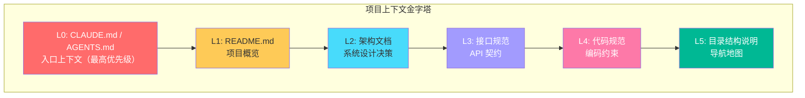

# 第6章 Context Engineering：给 AI 正确的上下文

## 6.1 本章要解决的问题

当你用 AI 写代码时，有没有遇到这些情况：

- AI 给出了一段看起来不错的代码，但和你项目的技术栈完全不搭
- AI 在同一个会话里聊了半小时后，开始"忘记"你前面说过的话
- 你在一个 Spring Boot 项目里问 AI 怎么优化查询，它给了你 Node.js 的方案
- 团队里每个人用 AI 的方式不一样，产出的代码风格五花八门
- 你把整个项目的代码都丢给 AI，结果它越回答越离谱

这些问题都有一个共同的根因：**上下文没管好**。

本章将系统地讲解 Context Engineering--如何设计、维护和传递 AI 工作所需的上下文信息。这不是什么玄学，而是一门工程学科：什么信息给 AI，以什么格式给，在什么时候给，给多少。

## 6.2 Context Engineering 是什么

Context Engineering 是一套系统化的方法，用来**设计和管理传递给 AI 的上下文信息**，以确保 AI 在一个明确的、受控的信息边界内工作，产出符合预期的高质量结果。

把 AI 想象成一个新加入团队的资深程序员。这个程序员技术很强，但他对你的项目一无所知。你给他分配任务时，不会直接把整个代码仓库扔给他让他自己看，而是会告诉他：

- 项目是干什么的（README）
- 技术栈和架构约定（架构文档）
- 代码怎么写（编码规范）
- 当前任务的具体背景（需求、关联模块、已知约束）

Context Engineering 就是把这些信息**结构化、标准化、可复用**的过程。它不是一次性的 prompt 技巧，而是持续维护的工程资产。

## 6.3 为什么它比 Prompt Engineering 更重要

2023-2024 年，整个行业都在讲 Prompt Engineering。各种"你必须知道的 10 个 prompt 技巧"满天飞。但到了 2025-2026 年，一个共识逐渐形成：**对于专业开发者而言，Context Engineering 的战略价值远高于 Prompt Engineering。**

原因很简单：

**Prompt Engineering 解决的是"怎么说"的问题，Context Engineering 解决的是"说什么"的问题。** 如果你的上下文里没有正确的信息，再好的 prompt 技巧也产出不了正确的结果。反过来，上下文给对了，一个简单的"请帮我实现这个功能"就能得到高质量的代码。

类比一下数据库查询：

| | Prompt Engineering | Context Engineering |
|---|---|---|
| 类比 | SQL 语法技巧 | 数据建模和索引设计 |
| 作用域 | 单次查询 | 整个系统 |
| 复用性 | 低 | 高 |
| 投资回报 | 边际递减 | 持续累积 |

一个数据库老手不会花大量时间研究"怎么写 WHERE 子句更优雅"，而是会把精力放在设计好的表结构、建对索引、写好视图。同理，一个成熟的 AI 辅助开发者，应该把精力放在建设上下文资产上，而不是反复调试 prompt 措辞。

## 6.4 上下文窗口是什么：Token 限制的工程意义

### 6.4.1 Token 基础

AI 模型不是按"字"来理解文本的，而是按 token。一个 token 大约对应：

- 英文：1 个 token ≈ 0.75 个单词
- 中文：1 个 token ≈ 0.5-0.7 个汉字

每款模型都有上下文窗口上限（context window），也就是单次对话能处理的 token 总量。主流模型的窗口大小在 2025-2026 年已经到了 200K-1M token 级别：

- Claude：200K token
- GPT-4o：128K token
- Gemini：1M token（部分模型）

200K token 听起来很多，大约相当于一本 300 页的技术书。但工程实践中，这个窗口很快就会被填满。

### 6.4.2 上下文预算

你需要建立"上下文预算"的思维模式。每次和 AI 对话，你手里有固定数额的预算（模型窗口大小）。每一段对话历史、每一个附加文件、每一段系统提示都在消耗这个预算。

一个实际场景：你在一个中等规模的 Spring Boot 微服务项目里工作。

| 消耗项 | Token 估算 |
|---|---|
| 系统提示（CLAUDE.md 等） | 2,000-5,000 |
| 对话历史（50 轮） | 10,000-30,000 |
| 当前打开的文件（5 个 Java 类） | 8,000-15,000 |
| 附加的上下文文件 | 5,000-20,000 |
| **剩余可用** | 取决于模型窗口 |

**上下文预算管理的核心原则：只给 AI 它完成当前任务需要的信息，不多给，也不少给。** 这和写 SQL 是一个道理——你不会写 `SELECT *` 然后指望数据库自己挑出需要的字段。

### 6.4.3 窗口之外的"记忆"

上下文窗口内的信息是 AI 能"看到"的。窗口之外的，AI 完全看不到，除非你重新传入。

理解这一点很重要：AI 在同一个会话里不会自动记住你之前说过什么。每次请求，整个对话历史都会重新发送给模型。当对话历史超出窗口上限时，最早的消息会被截断。这就是为什么长对话中 AI 会"失忆"——不是模型变笨了，而是关键信息被挤出窗口了。

## 6.5 为什么上下文不是越多越好

很多开发者的直觉反应是："既然模型窗口这么大，我把整个项目都给它不就行了？"

这样做有四个致命问题。

### 6.5.1 噪音干扰

大量无关信息会稀释关键信号。类比：你在一个嘈杂的餐厅里和朋友聊天，周围桌的人也在说话。你的大脑需要额外精力过滤噪音才能听清朋友说什么。AI 模型同理——上下文中塞入越多无关内容，模型越容易"分心"，在不相干的信息之间建立错误的关联。

实际案例：你让 AI 帮你优化一个订单查询接口，但你同时把用户模块、支付模块、通知模块的代码都放在上下文里。AI 可能会把支付模块里的一段逻辑误用到了订单查询里，因为它"看到"了那段代码，觉得"可能相关"。

### 6.5.2 注意力稀释

LLM 的注意力机制在长上下文中存在"中间丢失"问题——模型对上下文中间部分的信息关注度天然低于开头和结尾。你把关键信息放在一大段无关内容的中间，模型很可能会忽略它。

这就是著名的"Lost in the Middle"现象（Liu et al., 2023）。研究表明，当相关信息位于上下文中间位置时，模型的表现显著下降。

### 6.5.3 成本上升

AI API 的计费是按 token 算的。每次请求，你都要为上下文中的所有 token 付费——即使其中 80% 和当前任务无关。

快速算一笔账。假设你用一个 200K token 上下文的模型，每次请求你塞入了 100K token 的背景信息，其中只有 15K 是真正需要的。你的 Token 利用率是 15%。长期下来，这意味着你 85% 的 API 费用都花在了噪音上。

### 6.5.4 速度下降

上下文越长，模型的处理时间越长。对于需要多轮交互的复杂任务，每轮多等几秒，累积下来就是几分钟甚至更久。

**结论：上下文设计的核心不是"多多益善"，而是"精准投喂"。**

## 6.6 如何设计项目级上下文

好的上下文设计是分层的，像一个金字塔。每一层解决不同颗粒度的问题，AI 在不同阶段会读取不同层的信息。



### 6.6.1 L0: CLAUDE.md ——项目入口上下文

CLAUDE.md（在 Claude Code 中）或 AGENTS.md（通用名称）是整个上下文体系中最关键的文件。AI 在开始任何任务之前，首先读取的就是这个文件。

它是项目的"使用说明书"，告诉 AI：

- 这个项目是什么，谁在用，解决什么问题
- 技术栈是什么，有什么关键依赖
- 项目结构是怎样的
- 有什么硬性约束（不可逾越的红线）
- 工作流程是什么样的

**一个 Java 微服务项目的 CLAUDE.md 实例：**

```markdown
# order-service

订单微服务，负责订单的创建、查询、状态流转和取消。
B2B 电商平台核心服务，日均订单量 50 万。

## 技术栈

- 语言: Java 17
- 框架: Spring Boot 3.2, Spring Cloud 2023.0
- ORM: MyBatis-Plus 3.5
- 数据库: MySQL 8.0 (主库) + Redis 7.0 (缓存)
- 消息队列: RocketMQ 5.0
- RPC: Dubbo 3.2
- 注册中心: Nacos 2.3

## 启动

```bash
# 本地开发
mvn spring-boot:run -Dspring.profiles.active=dev

# 运行测试
mvn test

# 构建镜像
mvn clean package -DskipTests && docker build -t order-service:latest .
```

## 结构

```
order-service/
├── order-service-api/       # Dubbo API 接口定义（对外暴露）
├── order-service-core/      # 核心业务逻辑
│   ├── controller/          # HTTP 控制器
│   ├── service/             # 业务服务层
│   ├── mapper/              # MyBatis Mapper
│   ├── model/               # 领域模型
│   └── config/              # 配置类
├── order-service-infra/     # 基础设施（MQ、缓存、外部调用）
└── docs/                    # 项目文档
```

## 代码风格

- Controller 层只做参数校验和路由，不写业务逻辑
- Service 层使用 `@RequiredArgsConstructor` 注入依赖，不写 `@Autowired`
- 数据库操作统一使用 MyBatis-Plus 的 BaseMapper，禁止手写 XML 除非复杂查询
- 所有 API 返回值统一使用 `Result<T>` 包装
- 异常统一使用 `BizException`，错误码定义在 `ErrorCode` 枚举中

## 约束

- 禁止直接在 Controller 中调用 Mapper
- 禁止在循环中调用数据库或 RPC
- 状态变更必须通过领域方法，禁止直接 set 状态字段
- SQL 查询必须加 LIMIT，单次查询不允许超过 1000 条
- 敏感数据（手机号、地址）日志输出时必须脱敏

## 测试要求

- Service 层单测覆盖率 > 80%
- 使用 H2 内存数据库做 DAO 层测试
- MockMvc 做 Controller 层集成测试
```

注意 CLAUDE.md 的几个设计要点：

1. **技术栈写全称带版本号**——不要写"Spring Boot"，写"Spring Boot 3.2"。AI 知道 3.2 和 2.7 的 API 差异很大。
2. **约束写明禁止项**——只说"应该怎么用"不够，还要说"禁止怎么用"。
3. **结构说明配合目录**——让 AI 知道代码在哪，而不是靠猜。
4. **保持精简**——CLAUDE.md 不是设计文档，控制在 2000 token 以内。

### 6.6.2 L1: README.md ——项目概览

README 面向的是人类开发者，但它同时也是 AI 的第二层上下文。一个好的 README 应该包含：

- 项目定位：一句话说清楚这个服务干什么
- 业务域：在电商/金融/医疗等什么业务背景下
- 技术选型理由：为什么选这个技术栈（帮助 AI 理解架构决策）
- 快速启动指南：让 AI 知道怎么跑起来

### 6.6.3 L2: 架构文档 ——系统设计决策

这一层记录的是"为什么这么设计"，而不是"代码长什么样"。

示例——订单服务的架构决策记录（ADR）：

```markdown
## ADR-003: 订单状态机使用状态模式

### 背景
订单有 12 个状态，53 种状态转换。最初用 if-else 实现，3 个月后变成不可维护的嵌套判断。

### 决策
使用状态模式重构。每个状态一个 StateHandler，状态转换规则集中在 StateMachine 中管理。

### 后果
- 新增状态只需新增 Handler，符合开闭原则
- 测试每个状态变更可独立单测
- 代价是类数量从 1 个增加到 14 个
```

这样的文档让 AI 理解：这个项目用状态模式管理订单流转，不要建议用 switch-case 来实现状态切换。

### 6.6.4 L3: 接口规范 ——API 契约

对内（团队内部的 AI 使用），维护 API 契约文档可以帮助 AI 生成正确的接口调用代码。

对外（第三方 API），维护接口文档让 AI 生成正确的集成代码。特别是当你需要 AI 帮你对接一个外部系统时，把对方的接口文档放进去比让 AI "去网上搜索"可靠得多。

### 6.6.5 L4: 代码规范 ——编码约束

在 CLAUDE.md 中简要写代码约束（见 6.6.1 示例），在独立文件中维护完整的代码规范。

推荐工具：
- `.editorconfig`：IDE 级别的格式约定（缩进、换行符等），AI 生成代码时应该遵守
- `checkstyle.xml` 或 `spotbugs.xml`：Java 项目的静态检查规则
- `.cursorrules` / `.windsurfrules`：Cursor 和 Windsurf 编辑器的 AI 规则文件，效果等同于 CLAUDE.md 但针对特定编辑器

### 6.6.6 L5: 目录结构说明

告诉 AI 代码在哪、文件怎么组织的。不要指望 AI 自己去翻目录——它每次"翻"就要消耗上下文预算。

## 6.7 如何压缩上下文：只给 AI 需要的

### 6.7.1 选择性剪枝

不要给 AI 整个文件，只给相关的方法和类。

**坏的做法：** "帮我优化这个 Service，我把整个文件给你。"

```java
// UserService.java (500 行)
// ... 包含 15 个方法，其中 12 个和当前任务无关 ...
```

**好的做法：** "帮我优化 getActiveOrders 方法，这是当前实现。"

```java
// 只提供相关的方法
public List<Order> getActiveOrders(Long userId, OrderQuery query) {
    // 当前实现：全表扫描，无索引，无缓存
    return orderMapper.selectList(
        new LambdaQueryWrapper<Order>()
            .eq(Order::getUserId, userId)
            .eq(Order::getStatus, query.getStatus())
    );
}

// 关联的模型
@Data
@TableName("t_order")
public class Order {
    private Long id;
    private Long userId;
    private OrderStatus status;
    private BigDecimal amount;
    private LocalDateTime createTime;
}
```

### 6.7.2 使用结构化摘要代替原始数据

当你需要告诉 AI 数据库结构时，不需要把整个 DDL 给它。一个简洁的表结构说明就够了：

```markdown
## t_order 表结构摘要

| 字段 | 类型 | 说明 |
|------|------|------|
| id | bigint | 主键，雪花算法生成 |
| user_id | bigint | 用户ID，索引 idx_user_id |
| order_no | varchar(32) | 订单号，唯一索引 uk_order_no |
| status | tinyint | 状态：0草稿 1待支付 2已支付 3已发货 4已完成 5已取消 |
| amount | decimal(10,2) | 订单金额 |
| create_time | datetime | 创建时间 |
| update_time | datetime | 更新时间，索引 idx_update_time |

索引：idx_user_id(user_id), uk_order_no(order_no), idx_create_time(create_time), idx_user_status(user_id, status)
```

### 6.7.3 增量更新，不全量重传

在长任务的连续对话中，不要每次都把完整上下文重新发送一遍。而是只发送变化的部分。

实际技巧：在 Claude Code 或 ChatGPT 中，当你完成了一个任务进入下一个时，明确告诉 AI "上一个任务已完成，现在开始新任务：xxx"。这样你在心理上重置了上下文边界，AI 会更聚焦当前任务。如果对话太长（超过 50 轮），考虑新开会话，把必要背景精简后重新传入。

## 6.8 如何维护团队级 AI 上下文资产

Context Engineering 不只是个人的事。在一个 5-10 人的团队中，如果每个人用 AI 的方式不一样，产出的代码就是"巴别塔"。

### 6.8.1 建立上下文资产的版本控制

把 CLUADE.md、AGENTS.md、.cursorrules 等文件纳入 Git 版本控制。它们的变更应该和代码变更一样走 PR review。

好处：
- 新人加入时，AI 自动获取团队共识好的上下文
- 技术决策变更时，一次性更新，全员受益
- 可以追溯"为什么上次 AI 生成的代码风格变了"

### 6.8.2 上下文文件的责任人制度

指定每个上下文文件的负责人（owner），负责：
- 定期审核内容是否过期
- 技术栈升级时同步更新版本号
- 合并团队成员的改进建议

### 6.8.3 多编辑器、多工具的上下文同步

现代团队可能同时使用多种 AI 工具：Claude Code、Cursor、Windsurf、GitHub Copilot、Codex 等。每个工具读的上下文文件不一样：

| 工具 | 上下文文件 | 备注 |
|------|-----------|------|
| Claude Code | `CLAUDE.md`（项目根目录） | 也支持 `CLAUDE.md` 在子目录 |
| Cursor | `.cursorrules` | 可引用 CLAUDE.md |
| Windsurf | `.windsurfrules` | 类似 .cursorrules |
| GitHub Copilot | `.github/copilot-instructions.md` | 2024 年底开始支持 |
| Codex CLI | `AGENTS.md` | 项目根目录 |
| Cline | `.clinerules` | VS Code 插件 |

建议做法：**以 CLAUDE.md 为单一真相源（single source of truth），其他文件通过符号链接或简单的同步脚本从 CLAUDE.md 派生。**

示例同步脚本 `sync-context.sh`：

```bash
#!/bin/bash
# 从 CLAUDE.md 同步到其他上下文文件

cp CLAUDE.md AGENTS.md
cp CLAUDE.md .cursorrules
cp CLAUDE.md .windsurfrules

echo "Synced CLAUDE.md -> AGENTS.md, .cursorrules, .windsurfrules"
```

更精细的做法是用 CI 流水线检查各上下文文件是否一致：

```yaml
# .github/workflows/context-check.yml
name: Context Consistency Check

on: [pull_request]

jobs:
  check-context:
    runs-on: ubuntu-latest
    steps:
      - uses: actions/checkout@v4
      - name: Check context files consistency
        run: |
          diff CLAUDE.md AGENTS.md || echo "::warning::CLAUDE.md and AGENTS.md differ"
          diff CLAUDE.md .cursorrules || echo "::warning::CLAUDE.md and .cursorrules differ"
```

### 6.8.4 上下文资产的层次划分

| 层次 | 文件 | 更新频率 | 负责人 |
|------|------|---------|--------|
| 公司级 | `CLAUDE.md`（组织 repo） | 季度 | 架构组 |
| 项目级 | 项目根 `CLAUDE.md` | 每迭代 | Tech Lead |
| 模块级 | 模块内 `CLAUDE.md` | 按需 | 模块 owner |
| 任务级 | 会话内临时上下文 | 实时 | 开发者自己 |

## 6.9 如何防止上下文污染和过期知识

### 6.9.1 上下文污染

上下文污染是指过时的、错误的信息残留在 AI 上下文中，导致 AI 基于错误前提做判断。

常见污染源：

1. **遗留的废弃代码仍在文档中描述**
   - 对策：每次代码重构后，同步更新 CLAUDE.md 和相关文档

2. **过期的技术栈版本号**
   - 对策：在 CLAUDE.md 的版本号旁边标注更新日期

3. **"我们已经不这么做了"的旧约定**
   - 对策：删除比新增更重要。如果一个约束不再适用，果断删掉它

4. **不同工具上下文文件不一致**
   - 对策：见 6.8.3 的同步机制

### 6.9.2 过期知识

AI 模型的训练数据有截止日期。如果你的技术栈用了模型训练截止日期之后才发布的版本，AI 可能给出不正确的 API 调用方式。

对策：
- **在 CLAUDE.md 中明确标注版本号**（如 Spring Boot 3.2 而非"最新版"）
- **对于关键 API，在上下文中附带官方文档摘要或代码示例**
- **使用 AI 工具的联网搜索功能验证新技术栈的用法**

### 6.9.3 定期审计上下文资产

每个迭代结束时，花 5 分钟检查：

- [ ] CLAUDE.md 中的版本号和实际依赖是否一致
- [ ] 目录结构描述是否和实际代码结构匹配
- [ ] 约束条款是否有过时的
- [ ] 新增的模块是否有对应的上下文说明

## 6.10 长任务中如何保持上下文不跑偏

这是一个非常实际的工程问题。假设你要 AI 帮你完成一个跨越多个文件的复杂重构，对话可能持续 30-50 轮。如何确保第 50 轮的 AI 还知道第一轮你提的需求？

### 6.10.1 检查点策略

在长任务中设置"检查点"。每完成一个逻辑阶段，做一次上下文重置：

**实际操作的对话模板：**

```
# --- 检查点 1：订单查询重构 —— 阶段 1 完成 ---
# 已完成：
# - OrderController.queryOrders() 重构为参数对象
# - OrderQueryDTO 新增字段 deliverType
#
# 下一步：重构 OrderService.queryOrders() 业务逻辑
# 关键约束：保持 API 向后兼容，不能改接口签名
```

把这个模板追加到新消息中，相当于给 AI 一份阶段性纪要。

### 6.10.2 使用 Claude Code 的 /compact 能力

Claude Code 提供了 `/compact` 命令，它会自动总结对话历史，压缩上下文。在对话超过 30-40 轮后主动执行一次，可以显著提升 AI 的连贯性。

### 6.10.3 任务分解

把大任务拆成小任务，每个小任务在独立的会话中完成。用 CLAUDE.md 或临时上下文文件在会话之间传递状态。

示例：把一个"迁移订单模块到 DDD 架构"的大任务拆成：

1. 会话 1：设计新的包结构，更新 CLAUDE.md
2. 会话 2：创建领域模型和聚合根
3. 会话 3：迁移 Service 层到领域服务
4. 会话 4：调整 Controller 适配新接口
5. 会话 5：更新测试

每个会话独立进行，但都读取同一个 CLAUDE.md（在上一个会话中更新过），上下文信息通过文件传递而不是靠 AI 的"记忆"。

## 6.11 企业场景：如何为团队建立共享 AI 上下文

### 6.11.1 组织级上下文仓库

在企业级场景中（10+ 个微服务，50+ 个开发者），建议建立组织级的 AI 上下文仓库：

```
ai-context/
├── CLAUDE.md                   # 组织级入口（公司技术栈、统一规范）
├── java-standards/             # Java 通用规范
│   ├── coding-style.md         # 编码风格
│   ├── exception-handling.md   # 异常处理规范
│   └── logging.md              # 日志规范
├── spring-boot-standards/      # Spring Boot 项目规范
│   ├── project-structure.md    # 项目结构约定
│   ├── api-design.md           # API 设计规范
│   └── database-access.md      # 数据访问层规范
├── frameworks/                 # 公司内部框架文档
│   ├── biz-framework-2.0/      # 业务框架
│   └── common-util-1.5/        # 通用工具库
└── templates/                  # 项目 CLAUDE.md 模板
    ├── web-service.md          # Web 服务模板
    ├── job-service.md          # 定时任务模板
    └── gateway.md              # 网关模板
```

每个具体项目的 CLAUDE.md 开头引用组织级上下文：

```markdown
# 继承组织级上下文

本项目遵循公司统一的 Java 和 Spring Boot 规范。规范详情：
- 编码风格：https://git.company.com/ai-context/java-standards/coding-style.md
- API 设计：https://git.company.com/ai-context/spring-boot-standards/api-design.md

## 本项目特有约定

以下内容仅适用于 order-service，覆盖或补充组织级规范：
...
```

### 6.11.2 CI/CD 集成

把上下文检查集成到 CI 流水线中：

```yaml
# .github/workflows/ai-context-check.yml
name: AI Context Check

on:
  pull_request:
    paths:
      - 'src/**'
      - 'pom.xml'
      - 'CLAUDE.md'

jobs:
  check-context:
    runs-on: ubuntu-latest
    steps:
      - uses: actions/checkout@v4
      - name: Check CLAUDE.md tech stack matches pom.xml
        run: |
          # 检查 Spring Boot 版本一致性
          CLAUDE_VERSION=$(grep "Spring Boot" CLAUDE.md | grep -oP '\d+\.\d+')
          POM_VERSION=$(grep "<spring-boot.version>" pom.xml | grep -oP '\d+\.\d+')
          if [ "$CLAUDE_VERSION" != "$POM_VERSION" ]; then
            echo "::error::CLAUDE.md reports Spring Boot $CLAUDE_VERSION but pom.xml has $POM_VERSION"
            exit 1
          fi
      - name: Check context files consistency
        run: |
          diff <(grep -v "^#" CLAUDE.md | head -5) <(grep -v "^#" AGENTS.md | head -5) \
            || echo "::warning::CLAUDE.md and AGENTS.md headers differ"
```

### 6.11.3 新人入职的上下文引导

新人入职时，不需要花 2 周读文档。直接打开 Claude Code，CLAUDE.md 就是他们的"AI 导师"。AI 在上下文加持下，自动按照团队规范回答问题和生成代码。

## 6.12 常见误区

### 误区 1：CLAUDE.md 写得越详细越好

CLAUDE.md 的目的是让 AI 快速建立对项目的认知模型，而不是把架构文档全文复制进去。太长的 CLAUDE.md 会消耗宝贵的上下文预算——想想你每次对话，这 8000 token 的 CLAUDE.md 都在沉默地吃掉你的预算。

**正确做法：CLAUDE.md 控制在 2000-3000 token 以内。** 详细的架构说明放在独立的文档中，AI 需要时再附加。

### 误区 2：上下文文件写好就不用改了

技术栈升级、架构重构、团队规范调整都会让上下文文件的内容过时。过时的上下文比没有上下文更危险——AI 会基于错误的假设给出建议。

**正确做法：上下文文件是活文档，每次迭代都需要审阅和更新。** 把"更新 CLAUDE.md"当作 Code Review 的检查项之一。

### 误区 3：所有 AI 工具用同一套上下文就够了

不同的 AI 工具有不同的上下文处理机制。Claude Code 会主动读取文件系统，Cursor 更依赖编辑器内打开的标签页，Copilot 主要看当前文件和相邻文件。

**正确做法：针对每个工具的特点精调上下文策略。** 但核心原则一致——CLAUDE.md 是统一的信息源。

### 误区 4：上下文工程是架构师的事，和一线开发没关系

所有和 AI 协作的人都在做上下文工程——区别只在于做得有意识还是无意识。每次你选择给 AI 看哪个文件、说哪句话，都是在管理上下文。

**正确做法：把"下意识"变成"有方法"。** 每个用 AI 写代码的开发者都应该掌握本章的核心概念。

### 误区 5：把密钥和敏感信息放在上下文文件里

CLAUDE.md 和 AGENTS.md 会被提交到 Git。如果把数据库密码、API 密钥写进去，它们就会出现在代码仓库中。

**正确做法：上下文文件中只放非敏感信息。** 敏感配置使用环境变量或 vault 方案。考虑在 CLAUDE.md 末尾加一段：

```markdown
## 敏感信息策略

本项目所有密钥、密码、Token 统一通过环境变量或 Vault 管理。
上下文文件中不包含任何敏感信息。如需本地开发，参考 .env.example。
```

## 6.13 风险与边界

### 6.13.1 AI 的"迷信权威"倾向

当 CLAUDE.md 中写了"本项目必须使用某某模式"时，AI 会严格遵守这个指令，即使这个模式在当前场景下不是最优解。这既是优点（保证一致性），也是风险（可能盲目应用）。

**缓解措施：在约束条款中留出例外空间。** 例如：

```markdown
# 好
Controller 层优先使用 @Valid 做参数校验（特殊场景如复杂跨字段校验可经 Tech Lead 确认后使用自定义 Validator）

# 不好
Controller 层必须使用 @Valid 做参数校验
```

### 6.13.2 上下文信息的泄露风险

在团队协作中，上下文信息可能被 AI 工具上传到云端处理。如果你的行业有严格的数据合规要求（金融、医疗），需要评估上下文文件中是否含有不能出内网的信息。

**缓解措施：**
- 业务敏感内容不进入 CLAUDE.md（如具体的客户数据样例、实际业务规则细节）
- 使用脱敏的示例数据
- 考虑使用本地模型或私有化部署方案处理含敏感上下文的场景

### 6.13.3 过度依赖上下文导致思维固化

当团队严重依赖 AI + 标准化上下文时，可能会出现"我们一直这么做，因为 CLAUDE.md 这么说"的局面，抑制创新和架构演进。

**缓解措施：上下文文件不是法典，是当前最佳实践的记录。** 定期审视上下文约定是否仍然合理——就像定期审视代码中的 TODO 一样。

## 6.14 本章小结

Context Engineering 不是玄学，而是一门工程学科。核心思想很简单：

1. **上下文预算有限**——每次对话有固定的 token 预算。省着用，精准用。
2. **分层设计**——CLAUDE.md 是入口，架构文档、接口规范、代码规范层层递进，按需加载。
3. **持续维护**——上下文文件是活文档，随代码演进同步更新。过时的上下文比没有更危险。
4. **团队共建**——把上下文资产纳入版本控制，CI 检查一致性，减少团队 AI 协作的熵增。
5. **精准投喂**——给 AI 它需要的，不给它不需要的。这和写 SQL 只 SELECT 需要的列是一个道理。

一句话记住：**Context Engineering 决定了 AI 能帮你写多好的代码，而不是 Prompt Engineering。**

## 6.15 实战练习

### 练习 1：为你的项目写一份 CLAUDE.md

选一个你正在做的 Spring Boot 项目，按以下步骤操作：

1. 打开 AI 工具（Claude Code / Cursor / ChatGPT），不提供任何项目背景，直接问："帮我优化 UserService 的查询性能"
2. 观察 AI 给出的回答——大概率是泛泛的通用建议
3. 现在写好一份 CLAUDE.md（参考 6.6.1 的模板），放到项目根目录
4. 重新开一个会话，问完全一样的问题
5. 对比两次回答的差异，记录体会

预期结果：有了 CLAUDE.md 后，AI 的建议会精准很多——用你项目的框架、符合你的代码风格、避开你的约定红线。

### 练习 2：上下文压缩训练

1. 找一段你写的 Java 代码（一个完整的 Service 类，约 200-300 行）
2. 从中提取一个方法，模拟"我需要 AI 帮我优化这个方法"的场景
3. 写出你对此方法的上下文描述（包含：方法功能、关联的数据模型结构摘要、现有问题描述）
4. 计算你写的上下文描述的 token 数（可以用 OpenAI 的 tokenizer 工具或者 Claude 的 token 计数功能）
5. 目标：上下文描述 < 500 token，同时包含足够的精度让 AI 能给出有价值的建议

### 练习 3：团队上下文资产建立

1. 列出你团队当前使用的所有 AI 工具
2. 为每个工具找到它读取的上下文文件位置
3. 检查这些文件的内容是否一致
4. 如果不一致，设计一个同步方案
5. 提出一个 PR 建议：将上下文文件纳入版本控制管理

## 6.16 自测问题

1. Context Engineering 和 Prompt Engineering 的核心区别是什么？为什么前者更重要？

2. 一个模型的上下文窗口是 200K token。解释为什么实际可用 token 可能只有 160K token，并说明这些 token 去了哪里。

3. 为什么上下文"越多越好"是错误的？列出三个具体的工程理由。

4. CLAUDE.md 中应该包含哪些内容？哪些内容不应该放进去？

5. 你有一个 Spring Boot 3.2 + MyBatis-Plus 项目，AI 反复建议用 JPA 的 `@Query` 注解。分析问题出在哪里，如何通过上下文工程解决。

6. 团队有 8 个人，各自用不同的 AI 工具（Claude Code、Cursor、Copilot）。描述你会如何建立统一的上下文体系。

7. 在和 AI 对话 60 轮后，AI 开始"忘记"你最开始的要求。解释为什么会这样，给出两种解决方案。

8. 你的项目刚刚从 Spring Boot 2.7 升级到 3.2。CLAUDE.md 需要做哪些更新？列出检查清单。
