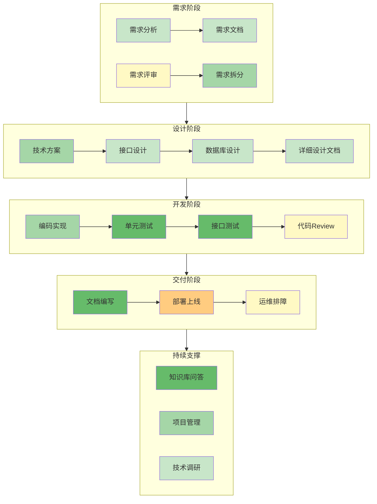

# 第7章：企业 IT 工作中的 AI 应用场景

## 7.1 本章要解决的问题

前面几章讲了 AI 工具怎么用、Prompt 怎么写。这一章换个角度：回到你每天干的活，看 AI 能帮到什么程度。

一个典型的 Java 后端程序员，日常工作是这些：接需求、出方案、画接口、建表、写代码、写单测、提测、修 bug、写文档、值班排查。每件事都有 AI 可以介入的环节，也有 AI 搞不定的环节。

本章的目标不是给你一个"AI 万能"的幻觉，而是给你一张精确的地图：**每个场景下，AI 能做什么、人必须做什么、怎么验收 AI 的输出**。看完你应该能判断：这个活交给 AI 省多少时间，那个活必须自己把关。

## 7.2 全景地图

先看一张全景图，理解 AI 在企业 IT 各环节的介入程度。颜色越深，AI 可替代性越高。



图例说明：

| 颜色 | 含义 | 典型场景 |
|------|------|---------|
| 深绿 | AI 可完成 80%+，人做最终审核 | 单测生成、API 文档生成 |
| 浅绿 | AI 完成 50-70%，人做关键决策和补充 | 编码实现、接口设计 |
| 黄色 | AI 辅助分析 30-50%，人做主要判断 | 代码 Review、运维排障 |
| 橙色 | AI 只能提供参考，人主导 | 部署策略、架构决策 |

## 7.3 需求分析

### 场景描述

产品经理给了一段需求描述，你需要把它转化为可执行的技术需求。这步的关键是把模糊的业务语言翻译成精确的技术语言。

### AI 能做什么

- 从产品需求文档中提取功能点，按优先级排序
- 识别需求中的边界条件、异常情况
- 发现需求中互相矛盾的地方
- 生成结构化的用户故事和验收标准
- 估算各功能点的复杂度（人天）

### 人必须做什么

- 理解业务上下文，判断需求的合理性
- 与产品、业务方沟通，确认理解一致
- 对 AI 识别的边界条件做取舍（哪些要做、哪些不做）
- 最终拍板优先级

### 输入、输出与验收标准

**输入（你给 AI 的）**：

```
我是一家银行的开发人员，现在接到一个需求，帮我分析：

【需求描述】
客户通过手机银行提交贷款申请后，系统需要自动审批。
审批规则：
- 贷款金额 ≤ 5万，且客户等级为 A 级，自动通过
- 贷款金额 5-20万，需要人工审核
- 贷款金额 > 20万，需要人工审核 + 风控经理复核
- 如果客户有逾期记录，无论金额大小，转人工

请帮我：
1. 提取功能点，按优先级排序
2. 找出需求中没有明确的边界情况
3. 生成验收标准
4. 估算每个功能点的复杂度
```

**AI 输出示例**：

```
## 功能点提取

### P0（核心流程）
1. 贷款申请提交接口 - 接收客户贷款申请数据
2. 自动审批决策引擎 - 根据金额、客户等级、逾期记录判断审批路径

### P1（必要支撑）
3. 人工审核任务分配 - 将需人工审的申请分配给审核员
4. 风控经理复核流程 - 超20万的额外复核环节

### P2（增强体验）
5. 审批结果通知 - 短信/App推送通知客户
6. 审批进度查询 - 客户查看申请当前状态

## 边界情况（需求未明确）

1. 客户等级从哪里获取？是实时查询还是申请时快照？
2. 逾期记录的时间范围？最近6个月、1年、还是全部历史？
3. 如果客户等级在审批过程中发生变化怎么办？
4. 夜间提交的申请，人工审核由谁处理？
5. 审批超时（如24小时未处理）怎么处理？自动拒绝还是升级？
6. 同一客户短时间内多次提交怎么处理？
7. 贷款金额刚好等于5万、20万时走哪个分支？（建议明确边界值归属）

## 验收标准

- [ ] 金额≤5万 + A级客户 + 无逾期 → 自动通过，状态变为"已批准"
- [ ] 金额5万<X≤20万 → 进入人工审核队列
- [ ] 金额>20万 → 进入人工审核+风控复核队列
- [ ] 有逾期记录 → 无论金额，转人工审核
- [ ] 审批结果在3秒内返回（自动场景）
- [ ] 人工审核任务包含完整客户信息和申请详情

## 复杂度估算

| 功能点 | 复杂度 | 估算人天 | 说明 |
|-------|--------|---------|------|
| 贷款申请提交接口 | 中 | 1天 | 标准CRUD+参数校验 |
| 自动审批决策引擎 | 高 | 2天 | 规则引擎设计+多条件组合 |
| 人工审核任务分配 | 中 | 1.5天 | 需要了解现有工单系统 |
| 风控经理复核 | 低 | 0.5天 | 复用人工审核逻辑 |
```

**验收方式**：

1. 检查功能点是否遗漏核心业务流程
2. 逐一确认 AI 提出的边界情况，把需要的补充进需求文档
3. 带着 AI 生成的验收标准去跟产品经理确认，让产品在验收标准上签字
4. 复杂度估算仅作参考，根据自己的代码库情况调整

## 7.4 技术方案

### 场景描述

需求确认后，需要出技术方案：选型、架构、模块划分、关键流程设计。

### AI 能做什么

- 根据需求描述生成技术方案初稿（架构图用 Mermaid、时序图描述关键流程）
- 列出技术选型的候选方案和对比（含优缺点）
- 识别技术风险点
- 估算各模块的开发工作量

### 人必须做什么

- 结合公司技术栈约束做选型（公司统一用 MySQL 你就不能推 MongoDB）
- 判断方案是否符合现有系统架构（不能引入与现有架构冲突的设计）
- 评估性能、安全、可维护性等非功能需求
- 与团队评审方案，达成共识

### 具体方法

**输入 Prompt**：

```
基于以下需求，帮我出技术方案：

【需求】贷款自动审批系统（见上节）

【技术栈约束】
- 后端：Spring Boot 2.7 + MyBatis-Plus
- 数据库：MySQL 8.0
- 消息队列：RocketMQ
- 注册中心：Nacos
- 缓存：Redis

请生成：
1. 模块划分和职责说明
2. 核心表结构概要（不需要完整 DDL）
3. 审批决策引擎的设计方案（规则引擎 vs 硬编码 vs Drools）
4. 关键流程时序图（Mermaid 格式）
5. 技术风险点
```

**AI 输出要点**（节省篇幅，不贴完整输出）：

- 模块划分：`loan-application`（申请服务）、`loan-approval`（审批服务）、`loan-notification`（通知服务）
- 审批引擎选型对比：硬编码 if-else（简单但难维护）→ 推荐规则表方案（规则存 DB，支持热更新）→ 不推荐 Drools（团队没有相关经验，维护成本高）
- 风险点：并发申请时的数据一致性、规则变更后的历史数据兼容

**验收标准**：方案是否覆盖所有功能点、技术选型是否有理有据、风险点是否有应对措施。

## 7.5 接口设计

### 场景描述

方案定了，开始设计 RESTful API。这是后端的基本功，但 AI 能让你从"写接口文档"变成"审接口文档"。

### AI 能做什么

- 根据功能描述生成完整的 RESTful API 设计（URL、Method、Request/Response、错误码）
- 自动遵循 RESTful 规范（资源命名、HTTP 动词、状态码）
- 生成 OpenAPI 3.0 格式的接口文档
- 检查接口设计中的常见问题（缺少分页、缺少幂等性、安全性遗漏）

### 人必须做什么

- 确认接口粒度是否合适（不能太少导致一个接口干太多事，也不能太多导致调用链过长）
- 判断哪些字段该返回、哪些不该返回（敏感信息脱敏）
- 确认接口的权限控制策略

### 具体方法

**输入 Prompt**：

```
为贷款自动审批系统设计 RESTful API，生成 OpenAPI 3.0 格式。

核心接口要求：
1. 客户提交贷款申请
2. 查询申请状态
3. 审核员获取待审核列表
4. 审核员审批（通过/拒绝）
5. 风控经理复核

约束：
- 统一前缀 /api/v1
- 需要分页的接口用 pageNo/pageSize
- 认证用 JWT，放在 Header: Authorization: Bearer <token>
- 响应体统一格式：{"code": 0, "message": "success", "data": {...}}
```

**AI 输出示例（核心部分）**：

```yaml
openapi: "3.0.0"
info:
  title: 贷款审批系统 API
  version: "1.0.0"

paths:
  /api/v1/loan-applications:
    post:
      summary: 提交贷款申请
      security:
        - BearerAuth: []
      requestBody:
        content:
          application/json:
            schema:
              type: object
              required: [amount, term, purpose]
              properties:
                amount:
                  type: number
                  description: 贷款金额（元）
                  minimum: 1000
                  maximum: 500000
                term:
                  type: integer
                  description: 贷款期限（月）
                  minimum: 3
                  maximum: 60
                purpose:
                  type: string
                  description: 贷款用途
                  maxLength: 200
      responses:
        '201':
          description: 申请已提交
          content:
            application/json:
              schema:
                type: object
                properties:
                  code: {type: integer, example: 0}
                  message: {type: string, example: "success"}
                  data:
                    type: object
                    properties:
                      applicationId: {type: string, example: "LA202607010001"}
                      status: {type: string, example: "AUTO_APPROVED"}
        '400':
          description: 参数校验失败
        '401':
          description: 未认证

  /api/v1/loan-applications/{applicationId}:
    get:
      summary: 查询申请状态
      security:
        - BearerAuth: []
      parameters:
        - name: applicationId
          in: path
          required: true
          schema: {type: string}
      responses:
        '200':
          description: 查询成功

  /api/v1/approval/pending:
    get:
      summary: 获取待审核列表
      security:
        - BearerAuth: []
      parameters:
        - name: pageNo
          in: query
          schema: {type: integer, default: 1}
        - name: pageSize
          in: query
          schema: {type: integer, default: 20}
      responses:
        '200':
          description: 查询成功

  /api/v1/approval/{applicationId}/review:
    post:
      summary: 审核员审批
      security:
        - BearerAuth: []
      parameters:
        - name: applicationId
          in: path
          required: true
          schema: {type: string}
      requestBody:
        content:
          application/json:
            schema:
              type: object
              required: [decision, comment]
              properties:
                decision:
                  type: string
                  enum: [APPROVED, REJECTED]
                comment:
                  type: string
                  maxLength: 500
      responses:
        '200':
          description: 审批完成
        '409':
          description: 申请状态冲突（已被其他人处理）
```

**验收方式**：

1. 核对接口是否覆盖所有业务场景
2. 检查是否有并发冲突处理（如 409 响应）
3. 确认敏感字段是否已脱敏
4. 用 AI 生成的 OpenAPI 文件直接导入 Swagger UI，让前端同事提前看

## 7.6 数据库设计

### 场景描述

接口定了，该建表了。这步涉及 ER 图、DDL、索引设计——全是 AI 的强项。

### AI 能做什么

- 根据接口和业务描述生成 ER 图（Mermaid erDiagram）
- 生成完整 DDL（含字段类型、注释、默认值）
- 设计索引方案（覆盖查询场景）
- 生成初始化数据脚本
- 分析现有 SQL 的执行计划，建议优化方向

### 人必须做什么

- 确认表关系（一对多、多对多）是否准确
- 判断字段类型和长度是否合理（特别是金额用 decimal 还是 bigint）
- 决定分表策略（如果数据量大）
- 评估索引对写入性能的影响

### 具体方法

**输入 Prompt**：

```
基于贷款审批系统的接口设计，生成数据库表结构。

要求：
1. 先给 ER 图（Mermaid 格式）
2. 再给完整 DDL（MySQL 8.0）
3. 所有表都要有 id, create_time, update_time, is_deleted（逻辑删除）
4. 金额字段用 decimal(18,2)
5. 状态字段用 varchar，给出所有可能值
6. 分析每个查询场景的索引需求

核心业务：
- 客户提交贷款申请（金额、期限、用途）
- 系统自动审批或转人工
- 审核员审批
- 风控经理复核
- 查询申请历史和状态
```

**AI 输出示例**：

```
## ER 图

erDiagram
    loan_application ||--o{ approval_record : "1对多"
    loan_application ||--o| customer_info : "关联"
    approval_record }o--|| sys_user : "审核人"

    loan_application {
        bigint id PK
        varchar application_no UK "申请编号 LA+日期+序号"
        bigint customer_id FK "客户ID"
        decimal amount "贷款金额"
        int term "期限(月)"
        varchar purpose "用途"
        varchar status "状态"
        varchar reject_reason "拒绝原因"
        datetime auto_approval_time "自动审批时间"
        datetime create_time
        datetime update_time
        tinyint is_deleted
    }

    approval_record {
        bigint id PK
        bigint application_id FK
        varchar approval_type "审批类型:AUTO/MANUAL/REVIEW"
        bigint approver_id "审批人ID"
        varchar decision "PENDING/APPROVED/REJECTED"
        varchar comment "审批意见"
        datetime create_time
    }

    customer_info {
        bigint id PK
        varchar customer_no UK
        varchar name
        varchar id_card UK "身份证号"
        varchar grade "客户等级 A/B/C/D"
        tinyint has_overdue "是否有逾期记录"
    }

## 关键 DDL（贷款申请表）

CREATE TABLE loan_application (
    id BIGINT AUTO_INCREMENT PRIMARY KEY COMMENT '主键',
    application_no VARCHAR(32) NOT NULL COMMENT '申请编号',
    customer_id BIGINT NOT NULL COMMENT '客户ID',
    amount DECIMAL(18,2) NOT NULL COMMENT '贷款金额',
    term INT NOT NULL COMMENT '期限(月)',
    purpose VARCHAR(200) DEFAULT '' COMMENT '贷款用途',
    status VARCHAR(20) NOT NULL DEFAULT 'PENDING' COMMENT '状态',
    reject_reason VARCHAR(500) DEFAULT '' COMMENT '拒绝原因',
    auto_approval_time DATETIME COMMENT '自动审批时间',
    create_time DATETIME NOT NULL DEFAULT CURRENT_TIMESTAMP,
    update_time DATETIME NOT NULL DEFAULT CURRENT_TIMESTAMP ON UPDATE CURRENT_TIMESTAMP,
    is_deleted TINYINT NOT NULL DEFAULT 0 COMMENT '逻辑删除:0-未删除,1-已删除',
    UNIQUE KEY uk_application_no (application_no),
    KEY idx_customer_id (customer_id),
    KEY idx_status_create (status, create_time),
    KEY idx_amount_status (amount, status)
) ENGINE=InnoDB DEFAULT CHARSET=utf8mb4 COMMENT='贷款申请表';

-- status 取值说明：
-- PENDING: 待审批
-- AUTO_APPROVED: 自动通过
-- MANUAL_PENDING: 待人工审核
-- MANUAL_APPROVED: 人工通过
-- MANUAL_REJECTED: 人工拒绝
-- REVIEW_PENDING: 待风控复核
-- REVIEW_APPROVED: 风控通过
-- REVIEW_REJECTED: 风控拒绝

## 索引分析

| 查询场景 | SQL 示例 | 建议索引 | 命中类型 |
|---------|---------|---------|---------|
| 客户查自己的申请 | WHERE customer_id=? ORDER BY create_time DESC | idx_customer_id | ref |
| 审核员查待审核列表 | WHERE status='MANUAL_PENDING' ORDER BY create_time | idx_status_create | ref+filesort(可优化) |
| 按金额范围统计 | WHERE amount BETWEEN ? AND ? AND status=? | idx_amount_status | range |
| 按申请编号查 | WHERE application_no=? | uk_application_no | const |
```

**验收方式**：

1. 检查 ER 图中的关系是否正确（特别注意一对一 vs 一对多）
2. 在测试环境跑 DDL，确认无语法错误
3. 用 `EXPLAIN` 验证索引是否被使用
4. 检查状态流转是否完整（有没有遗漏的状态转换路径）

## 7.7 编码

### 场景描述

到了最核心的环节：写代码。企业 Java 项目的代码有明确的分层结构：Controller → Service → DAO → Entity → DTO。AI 在每一层的表现不同。

### AI 能做什么

| 层次 | AI 表现 | 说明 |
|------|--------|------|
| Entity/DTO | 优秀 | 纯数据结构，字段映射，几乎不用改 |
| DAO/Mapper | 优秀 | 标准 MyBatis-Plus 写法，按约定生成 |
| Controller | 良好 | 参数校验、返回值包装，但权限注解需要人确认 |
| Service | 中等 | 核心业务逻辑，AI 能写框架，但业务细节需要人把关 |
| 工具类/Utils | 良好 | 通用逻辑，AI 擅长 |

### 人必须做什么

- Service 层的业务逻辑必须逐行审查（一个 if 条件不对就是生产事故）
- 事务边界确认：什么时候需要 `@Transactional`，隔离级别选什么
- 异常处理策略：哪些异常往外抛、哪些吞掉记日志
- 与外部系统交互的代码（调用第三方 API、消息队列发送/消费）
- 缓存策略：什么数据适合缓存、过期时间多长

### 具体方法：逐层生成

**第一步：生成 Entity 和 DTO**

```java
// Prompt: 根据 loan_application 表生成 Entity 和 DTO
// AI 生成的 Entity（几乎不改就能用）

@Data
@TableName("loan_application")
public class LoanApplication {
    @TableId(type = IdType.AUTO)
    private Long id;
    private String applicationNo;
    private Long customerId;
    private BigDecimal amount;
    private Integer term;
    private String purpose;
    private String status;
    private String rejectReason;
    private LocalDateTime autoApprovalTime;

    @TableLogic
    private Integer isDeleted;

    @TableField(fill = FieldFill.INSERT)
    private LocalDateTime createTime;

    @TableField(fill = FieldFill.INSERT_UPDATE)
    private LocalDateTime updateTime;
}

// DTO
@Data
public class LoanApplicationRequest {
    @NotNull(message = "贷款金额不能为空")
    @DecimalMin(value = "1000", message = "贷款金额最小1000元")
    @DecimalMax(value = "500000", message = "贷款金额最大50万元")
    private BigDecimal amount;

    @NotNull(message = "贷款期限不能为空")
    @Min(value = 3, message = "期限最少3个月")
    @Max(value = 60, message = "期限最长60个月")
    private Integer term;

    @Size(max = 200, message = "贷款用途最多200字")
    private String purpose;
}
```

**第二步：生成 DAO 层**

```java
// MyBatis-Plus 标准写法，AI 零失误
@Mapper
public interface LoanApplicationMapper extends BaseMapper<LoanApplication> {

    @Select("SELECT * FROM loan_application WHERE customer_id = #{customerId} " +
            "AND is_deleted = 0 ORDER BY create_time DESC")
    List<LoanApplication> selectByCustomerId(@Param("customerId") Long customerId);

    // 待审核列表（状态+时间排序）
    @Select("SELECT * FROM loan_application WHERE status = #{status} " +
            "AND is_deleted = 0 ORDER BY create_time ASC LIMIT #{limit}")
    List<LoanApplication> selectPendingList(@Param("status") String status,
                                            @Param("limit") int limit);
}
```

**第三步：生成 Service 层（关键，需要人细审）**

```java
// AI 生成的 Service —— 框架正确，但业务逻辑需要你确认
@Service
@Slf4j
public class LoanApprovalService {

    // AI 生成了审批决策逻辑，但每个条件你都要确认
    public ApprovalResult autoApprove(LoanApplication application, CustomerInfo customer) {
        // 规则1: 有逾期 → 转人工（AI 理解正确）
        if (customer.getHasOverdue() == 1) {
            return ApprovalResult.manual("客户有逾期记录");
        }

        BigDecimal amount = application.getAmount();
        String grade = customer.getGrade();

        // 规则2: ≤5万 + A级 → 自动通过（AI 理解正确）
        if (amount.compareTo(new BigDecimal("50000")) <= 0 && "A".equals(grade)) {
            return ApprovalResult.autoApproved();
        }

        // 规则3: 5-20万 → 人工审核
        if (amount.compareTo(new BigDecimal("50000")) > 0
                && amount.compareTo(new BigDecimal("200000")) <= 0) {
            return ApprovalResult.manual("金额在5-20万区间");
        }

        // 规则4: >20万 → 人工审核 + 风控复核
        if (amount.compareTo(new BigDecimal("200000")) > 0) {
            return ApprovalResult.manualWithReview("金额超过20万");
        }

        // ⚠️ 人需要检查：AI 没有处理 A 级以外的客户等级
        // 如果客户是 B/C/D 级，金额≤5万，应该走什么逻辑？
        // 这需要你来补充
        return ApprovalResult.manual("客户等级不满足自动审批条件");
    }
}
```

**验收方式**：

1. Controller 层：用 Swagger 看接口定义是否完整
2. Service 层：对照需求文档，逐一验证每个 if 条件
3. DAO 层：`EXPLAIN` 验证 SQL 是否走索引
4. 全局：跑一遍 `mvn compile` 确认无编译错误

### 常见陷阱

- AI 生成的 Service 代码，业务规则的边界条件经常不完整（如上面的客户等级问题）
- AI 不会主动加事务注解，你需要判断哪些方法需要 `@Transactional`
- AI 的异常处理通常很粗糙，需要你补充具体的异常类型和错误码

## 7.8 单元测试

### 场景描述

单元测试是 AI 最强的领域之一。给定一个 Service 方法，AI 能生成覆盖主要分支的测试用例，包括 Mock 依赖、断言结果。

### AI 能做什么

- 根据 Service 方法自动生成 JUnit 5 + Mockito 测试
- 覆盖正常路径、边界条件、异常情况
- 生成 Mock 数据的工厂方法
- 生成测试覆盖率报告的分析

### 人必须做什么

- 确认测试用例覆盖了所有业务分支（AI 可能漏掉隐含分支）
- 补充真实业务场景中才有的边界数据
- 确认 Mock 的行为是否合理（Mock 得太假会导致测试通过但生产报错）

### 具体方法

**输入 Prompt**：

```
为以下方法生成 JUnit 5 + Mockito 单元测试：

[贴上 LoanApprovalService.autoApprove() 方法代码]

要求：
1. 覆盖所有分支（正常路径 + 边界 + 异常）
2. 使用 @ExtendWith(MockitoExtension.class)
3. Mock 所有外部依赖
4. 测试方法命名用 should_xxx_when_xxx 格式
5. 每个测试方法加 @DisplayName 中文描述
```

**AI 输出示例**：

```java
@ExtendWith(MockitoExtension.class)
@DisplayName("贷款自动审批决策引擎")
class LoanApprovalServiceTest {

    @InjectMocks
    private LoanApprovalService loanApprovalService;

    // ==================== 自动通过场景 ====================

    @Test
    @DisplayName("A级客户 + 金额≤5万 + 无逾期 → 应自动通过")
    void shouldAutoApprove_whenGradeA_andAmountLE50000_andNoOverdue() {
        LoanApplication app = buildApplication(new BigDecimal("50000"));
        CustomerInfo customer = buildCustomer("A", false);

        ApprovalResult result = loanApprovalService.autoApprove(app, customer);

        assertEquals(ApprovalDecision.AUTO_APPROVED, result.getDecision());
    }

    // ==================== 转人工场景 ====================

    @Test
    @DisplayName("有逾期记录 → 应转人工，无论金额和等级")
    void shouldManual_whenHasOverdue() {
        LoanApplication app = buildApplication(new BigDecimal("1000"));
        CustomerInfo customer = buildCustomer("A", true); // 有逾期

        ApprovalResult result = loanApprovalService.autoApprove(app, customer);

        assertEquals(ApprovalDecision.MANUAL_PENDING, result.getDecision());
        assertTrue(result.getReason().contains("逾期"));
    }

    @Test
    @DisplayName("金额在5-20万之间 → 应转人工审核")
    void shouldManual_whenAmountBetween50000And200000() {
        LoanApplication app = buildApplication(new BigDecimal("100000"));
        CustomerInfo customer = buildCustomer("A", false);

        ApprovalResult result = loanApprovalService.autoApprove(app, customer);

        assertEquals(ApprovalDecision.MANUAL_PENDING, result.getDecision());
    }

    @Test
    @DisplayName("金额超过20万 → 应转人工+风控复核")
    void shouldManualWithReview_whenAmountGT200000() {
        LoanApplication app = buildApplication(new BigDecimal("300000"));
        CustomerInfo customer = buildCustomer("A", false);

        ApprovalResult result = loanApprovalService.autoApprove(app, customer);

        assertEquals(ApprovalDecision.MANUAL_WITH_REVIEW, result.getDecision());
    }

    // ==================== 边界情况 ====================

    @Test
    @DisplayName("金额刚好等于5万 → 应自动通过（边界值）")
    void shouldAutoApprove_whenAmountEquals50000() {
        LoanApplication app = buildApplication(new BigDecimal("50000"));
        CustomerInfo customer = buildCustomer("A", false);

        ApprovalResult result = loanApprovalService.autoApprove(app, customer);

        assertEquals(ApprovalDecision.AUTO_APPROVED, result.getDecision());
    }

    @Test
    @DisplayName("金额刚好等于20万 → 应转人工审核（边界值）")
    void shouldManual_whenAmountEquals200000() {
        LoanApplication app = buildApplication(new BigDecimal("200000"));
        CustomerInfo customer = buildCustomer("A", false);

        ApprovalResult result = loanApprovalService.autoApprove(app, customer);

        assertEquals(ApprovalDecision.MANUAL_PENDING, result.getDecision());
    }

    @Test
    @DisplayName("金额刚好等于200000.01 → 应转人工+风控复核（边界值）")
    void shouldManualWithReview_whenAmountGT200000_boundary() {
        LoanApplication app = buildApplication(new BigDecimal("200000.01"));
        CustomerInfo customer = buildCustomer("A", false);

        ApprovalResult result = loanApprovalService.autoApprove(app, customer);

        assertEquals(ApprovalDecision.MANUAL_WITH_REVIEW, result.getDecision());
    }

    // ==================== 辅助方法 ====================

    private LoanApplication buildApplication(BigDecimal amount) {
        LoanApplication app = new LoanApplication();
        app.setAmount(amount);
        app.setTerm(12);
        app.setPurpose("消费贷款");
        return app;
    }

    private CustomerInfo buildCustomer(String grade, boolean hasOverdue) {
        CustomerInfo info = new CustomerInfo();
        info.setGrade(grade);
        info.setHasOverdue(hasOverdue ? 1 : 0);
        return info;
    }
}
```

**验收方式**：

```bash
# 跑测试，看覆盖率
mvn test -Dtest=LoanApprovalServiceTest
# 查看覆盖率报告
mvn jacoco:report
# 确认分支覆盖率 > 80%
```

关键检查点：AI 有没有漏掉 `buildCustomer("B", false)` 这种场景的测试？如果业务规则是"非 A 级客户不走自动审批"，这个测试用例必须手动补充。

## 7.9 接口测试

### 场景描述

单测覆盖了单元逻辑，还需要验证接口整体行为：HTTP 状态码、响应体结构、业务数据正确性。

### AI 能做什么

- 根据 Controller 代码生成 MockMvc 集成测试
- 生成各种请求场景的 JSON 请求体
- 断言 HTTP 状态码、响应体结构、业务字段
- 生成测试数据初始化脚本（`@Sql` 注解）

### 人必须做什么

- 准备测试数据库的环境（H2 还是 Docker MySQL）
- 确认测试数据是否符合真实业务场景
- 判断哪些场景还需要手工用 Postman 验证（如文件上传、SSE 流式响应）

### 具体方法

```java
// AI 生成的 MockMvc 集成测试
@SpringBootTest
@AutoConfigureMockMvc
@Transactional
@Sql(scripts = "/sql/init_test_data.sql")
@DisplayName("贷款申请接口集成测试")
class LoanApplicationControllerTest {

    @Autowired
    private MockMvc mockMvc;

    @Test
    @DisplayName("提交有效申请 → 返回201 + 申请编号")
    void shouldReturn201_whenSubmitValidApplication() throws Exception {
        String requestBody = """
            {
                "amount": 30000,
                "term": 12,
                "purpose": "个人消费"
            }
            """;

        mockMvc.perform(post("/api/v1/loan-applications")
                .header("Authorization", "Bearer " + getTestToken())
                .contentType(MediaType.APPLICATION_JSON)
                .content(requestBody))
            .andExpect(status().isCreated())
            .andExpect(jsonPath("$.code").value(0))
            .andExpect(jsonPath("$.data.applicationId").isNotEmpty())
            .andExpect(jsonPath("$.data.status").value("AUTO_APPROVED"));
    }

    @Test
    @DisplayName("金额小于最小值 → 返回400 + 校验错误")
    void shouldReturn400_whenAmountTooSmall() throws Exception {
        String requestBody = """
            {"amount": 500, "term": 12, "purpose": "测试"}
            """;

        mockMvc.perform(post("/api/v1/loan-applications")
                .header("Authorization", "Bearer " + getTestToken())
                .contentType(MediaType.APPLICATION_JSON)
                .content(requestBody))
            .andExpect(status().isBadRequest())
            .andExpect(jsonPath("$.code").value(400))
            .andExpect(jsonPath("$.message").value(containsString("金额")));
    }

    @Test
    @DisplayName("不带 Token → 返回401")
    void shouldReturn401_whenNoToken() throws Exception {
        mockMvc.perform(post("/api/v1/loan-applications")
                .contentType(MediaType.APPLICATION_JSON)
                .content("{}"))
            .andExpect(status().isUnauthorized());
    }
}
```

**验收方式**：跑通全部测试，确认每个接口至少覆盖正常、参数校验失败、鉴权失败三种情况。

## 7.10 代码 Review

### 场景描述

代码 Review 是 AI 辅助价值很高但**绝对不能放手**的环节。AI 能抓出一堆问题，但哪些是真问题、哪些是误报，必须人来判断。

### AI 能做什么（能抓到的问题）

| 类别 | 示例 | AI 准确率 |
|------|------|---------|
| **代码风格** | 命名不规范、魔法数字、方法过长 | 95% |
| **空指针风险** | 未检查 Optional/null 直接调用 | 90% |
| **SQL 注入** | 拼接 SQL 字符串 | 95% |
| **资源泄漏** | 未关闭 Connection/Stream | 85% |
| **线程安全** | SimpleDateFormat 静态共享 | 90% |
| **事务问题** | 事务中调远程接口 | 70% |
| **性能隐患** | 循环内查数据库（N+1） | 85% |

### 人必须 Review 的（AI 搞不定的）

| 类别 | 为什么 AI 搞不定 |
|------|-----------------|
| **架构合理性** | 不了解系统全貌，无法判断分层是否合理 |
| **业务逻辑正确性** | 不了解业务规则，看不出逻辑错误 |
| **扩展性设计** | 无法判断未来需求变化方向 |
| **过度设计** | AI 倾向于建议抽象，无法判断是否过度 |
| **政治敏感代码** | 如权限控制、数据脱敏，AI 看不出遗漏 |

### 具体方法

**输入 Prompt**：

```
Review 以下代码，请检查：
1. 空指针风险
2. SQL 注入风险
3. 事务使用是否正确
4. 异常处理是否合理
5. 性能问题（N+1查询、不必要的数据库调用）
6. 线程安全问题

[贴上 LoanApprovalService.java 完整代码]
```

**AI Review 输出示例**：

```
## Review 结果

### 🔴 严重问题

1. **空指针风险** - 第23行
   customerInfoMapper.selectById(application.getCustomerId()) 可能返回 null，
   第24行直接调用 customerInfo.getGrade() 会 NPE。
   建议：用 Optional.ofNullable 包装或判断 null。

2. **事务问题** - 第35行
   autoApprove() 方法内调用了 notificationService.send()（发消息队列），
   如果发送失败是否需要回滚审批结果？当前没有事务控制，审批结果已入库，
   但通知没发出去。
   建议：明确事务边界，或者审批入库后再异步发通知。

### 🟡 警告

3. **硬编码魔法值** - 多处
   "50000"、"200000"、"A" 等字符串散布在代码中。
   建议：提取为常量或配置项。

4. **日志不完整** - 第42行
   只记了 error，没有包含关键业务字段（applicationNo、amount），
   排查问题时无法定位。
   建议：log.error("审批决策异常, applicationNo={}, amount={}", ... , e);

### 🟢 建议

5. **规则引擎考虑** - autoApprove() 方法
   当前是 if-else 链，规则多了会很难维护。建议考虑抽取为责任链模式，
   或者将规则配置化。
```

**验收方式**：

1. 严重问题必须修复
2. 警告类问题逐条判断：你觉得需要改就改，不需要的记 TODO
3. 建议类问题不强制，但值得思考
4. 最终 Review 结论由人签字

## 7.11 文档

### 场景描述

程序员最不爱干的活，AI 最擅长的活——天作之合。

### AI 能做什么

| 文档类型 | AI 完成度 | 说明 |
|---------|---------|------|
| API 文档（OpenAPI） | 95% | 从代码注解+Controller 直接生成 |
| 技术设计文档 | 70% | 需要人补充架构决策的理由 |
| 数据库文档 | 90% | 从 DDL + 注释直接生成 |
| 部署文档 | 60% | 环境相关配置需要人工核实 |
| 变更说明/Release Notes | 85% | 从 Git Log 总结 |
| 故障复盘报告 | 50% | 根因分析必须人写，AI 辅助整理时间线 |

### 人必须做什么

- 确认文档的准确性（特别是配置参数、环境变量、端口号）
- 补充"为什么这么设计"的背景（AI 只能写"怎么做"）
- 检查敏感信息是否泄漏（IP 地址、内部域名）

### 具体方法：生成 API 文档

直接给 AI 贴上 Controller 代码，让它生成给前端同事看的接口文档：

```markdown
## 贷款申请接口

### POST /api/v1/loan-applications - 提交贷款申请

**请求头**
| 参数 | 必填 | 说明 |
|------|------|------|
| Authorization | 是 | Bearer {{token}} |
| Content-Type | 是 | application/json |

**请求体**
| 字段 | 类型 | 必填 | 说明 | 校验规则 |
|------|------|------|------|---------|
| amount | BigDecimal | 是 | 贷款金额(元) | 1000-500000 |
| term | Integer | 是 | 期限(月) | 3-60 |
| purpose | String | 否 | 用途说明 | 最长200字 |

**成功响应 (201)**
{
  "code": 0,
  "message": "success",
  "data": {
    "applicationId": "LA202607010001",
    "status": "AUTO_APPROVED",
    "message": "申请已自动审批通过"
  }
}

**status 说明**
| 状态值 | 含义 | 后续操作 |
|--------|------|---------|
| AUTO_APPROVED | 自动通过 | 等待放款 |
| MANUAL_PENDING | 待人工审核 | 审核员介入 |
| MANUAL_REJECTED | 人工拒绝 | 流程结束 |

**错误码**
| code | HTTP状态码 | 说明 |
|------|-----------|------|
| 400 | 400 | 参数校验失败，message 中包含具体原因 |
| 401 | 401 | Token 无效或过期 |
| 409 | 409 | 已有进行中的申请，不能重复提交 |

**调用示例 (cURL)**
curl -X POST 'http://api.example.com/api/v1/loan-applications' \
  -H 'Authorization: Bearer eyJ...' \
  -H 'Content-Type: application/json' \
  -d '{"amount":30000,"term":12,"purpose":"个人消费"}'
```

**验收方式**：把 AI 生成的文档发给前端同事，问一句"能看懂不，有没有缺的"。前端的反馈是最有效的验收。

## 7.12 运维排障

### 场景描述

线上报错了，日志里一堆 stack trace，需要在最短时间内定位根因。AI 在日志分析上有天然优势——它能瞬间读完几千行日志，人做不到。

### AI 能做什么

- 快速解析堆栈信息，定位异常发生的精确位置
- 分析异常链条（Caused by 嵌套），找出根因
- 根据异常类型给出可能的原因和修复建议
- 关联多个微服务的日志，画出故障传播路径
- 对比正常时段和异常时段的日志差异

### 人必须做什么

- 确认 AI 定位的根因是否正确（AI 可能被表象迷惑）
- 判断修复方案是否安全（特别是涉及数据库、缓存的操作）
- 决定是否需要回滚还是热修复
- 在测试环境验证修复后再上线
- 写故障复盘报告

### 具体方法：分析 Stack Trace

**输入**：

```
线上服务突然开始报错，以下是日志片段，请帮我分析：

2026-07-01 14:32:15.123 ERROR [loan-approval-service,,] 
  [http-nio-8080-exec-5] c.e.loan.service.LoanApprovalService 
  : 审批处理异常, applicationNo=LA202607010042

org.springframework.dao.DataIntegrityViolationException: 
could not execute statement; SQL [n/a]; constraint [uk_approval_record];
nested exception is org.hibernate.exception.ConstraintViolationException: 
could not execute statement

Caused by: java.sql.SQLIntegrityConstraintViolationException: 
Duplicate entry 'LA202607010042-MANUAL' for key 'uk_approval_record'
	at com.mysql.cj.jdbc.exceptions.SQLError.createSQLException(SQLError.java:117)
	at com.xxx.loan.service.ApprovalRecordService.insert(ApprovalRecordService.java:45)
	at com.xxx.loan.service.LoanApprovalService.processManualApproval(LoanApprovalService.java:78)
	at com.xxx.loan.controller.ApprovalController.review(ApprovalController.java:34)
	...

另外，查询同一时间段 Nginx access log：
[14:32:15.120] POST /api/v1/approval/LA202607010042/review 200 45ms
[14:32:15.121] POST /api/v1/approval/LA202607010042/review 500 23ms  ← 这次报错了
```

**AI 分析输出**：

```
## 根因分析

### 直接原因
同一个申请单(LA202607010042)的审批请求被重复提交了。
第一次(14:32:15.120)成功插入审批记录，
第二次(14:32:15.121，仅隔1ms)再次插入时违反了 uk_approval_record 唯一约束。

### 为什么重复提交
最可能的原因：前端没有做防重复提交处理。
- 按钮点击后没有 disabled
- 或者用户快速双击
- 或者网络重试导致

### 为什么后端没拦住
approval_record 表有唯一约束(application_no + approval_type)，但：
1. Controller 层没有做幂等性校验
2. 没有使用分布式锁或 Redis 去重
3. 唯一约束抛出的异常没有转换为友好的业务异常

## 修复方案

### 临时止血（立即执行）
```sql
-- 如果有业务的重复数据需要清理
-- 但当前看起来只是并发提交，数据应该是一致的
-- 不需要数据修复
```

### 短期修复（今天上线）
```java
// ApprovalController.review() 修改
@PostMapping("/{applicationId}/review")
public Result<Void> review(@PathVariable String applicationId, 
                           @RequestBody ReviewRequest request) {
    // 1. 分布式锁防重
    String lockKey = "approval:review:" + applicationId;
    boolean locked = redisTemplate.opsForValue()
        .setIfAbsent(lockKey, "1", Duration.ofSeconds(10));
    if (!locked) {
        return Result.fail(409, "请勿重复提交");
    }
    try {
        return approvalService.processReview(applicationId, request);
    } finally {
        redisTemplate.delete(lockKey);
    }
}
```

### 长期优化
1. 前端加 loading 状态 + 按钮 disabled
2. 接口层做幂等性设计（请求ID去重）
3. 唯一约束异常统一转换为业务异常，返回友好提示而非500
```

**验收方式**：

1. AI 的分析结论要用你自己的经验验证：这个异常真的是并发问题吗？还是代码逻辑有 bug？
2. 修复方案先在本地复现问题，确认能修好
3. 修复后在测试环境做并发测试
4. 绝对不能直接拿 AI 的修复代码上线——必须经过测试环境验证

## 7.13 知识库问答（RAG）

### 场景描述

每个公司都有内部技术 Wiki：架构文档、故障手册、配置说明、公共组件使用指南。问题是：这些文档散落在 Confluence、语雀、GitLab 各处，真正需要的时候找不到。

RAG（Retrieval-Augmented Generation）方案解决的就是这个问题：把公司文档向量化存起来，问问题的时候先检索相关内容，再让 AI 基于检索结果回答。

### AI 能做什么

- 检索相关文档片段，综合多篇文档给出答案
- 回答"xx 组件怎么用""xx 错误码是什么"类问题
- 对比不同文档中的矛盾信息，指出需要人工核实的地方
- 自动更新知识库（新文档入库后自动索引）

### 人必须做什么

- 维护文档的质量和时效性（AI 只会基于已有文档回答，文档错了答案就错了）
- 标注哪些文档可信、哪些已过时
- 处理 AI 找不到答案的问题，补充新文档
- 审核 AI 答案的准确性（特别是涉及线上操作的建议）

### 典型场景

```
问：贷款审批服务的数据库连接池配置是多少？在哪里改？

AI 答（基于内部 Wiki 检索）：
审批服务使用 Druid 连接池，配置在 Nacos：
- DataId: loan-approval-service-dev.yaml
- Group: DEFAULT_GROUP
- 配置项: spring.datasource.druid.max-active
- 当前值: 20

如果要修改，在 Nacos 控制台更新配置后，服务会自动热更新。
相关文档：[数据库连接池配置规范] [Nacos 配置管理指南]
```

### 落地路径

1. **文档收集**：把 Confluence/语雀/GitLab Wiki 的文档导出为 Markdown
2. **切片入库**：按标题层级切片，每段 500-1000 字，存入向量数据库（Milvus/Qdrant/Elasticsearch）
3. **搭建问答服务**：用 LangChain 或直接调 OpenAI/Claude API，组合检索 + 生成
4. **反馈闭环**：记录用户对答案的点赞/踩，定期优化切片策略和 Prompt

**验收标准**：问 10 个你能确定答案的问题，看 AI 的正确率。低于 70% 说明文档质量或切片策略有问题。

## 7.14 项目管理

### 场景描述

项目管理中的很多重复性工作（写周报、整理进度、识别延期风险）非常适合 AI 辅助。

### AI 能做什么

| 任务 | 具体做法 | AI 完成度 |
|------|---------|---------|
| 写周报 | Git log + 任务系统 API → 自动生成周报 | 80% |
| 日报转周报 | 把一周的日报汇总成周报 | 90% |
| 进度跟踪 | 对比计划时间和实际完成时间，标出延期任务 | 85% |
| 风险识别 | 分析延期任务的依赖关系，预警连锁延期 | 60% |
| 会议纪要 | 从会议录音/文字记录提取决议和待办 | 75% |

### 人必须做什么

- 确认 AI 生成的周报是否准确反映了实际进展
- 判断延期的真实原因（AI 只能看数据，不能知道是不是因为需求变了）
- 做风险应对决策（加人、砍需求、延期上线）
- 沟通协调（跟产品谈优先级、跟其他团队谈接口排期）

### 具体方法

**输入 Prompt**：

```
以下是我本周的 Git 提交记录和任务完成情况，帮我生成周报：

【Git 提交】
- feat: 贷款审批决策引擎实现 (3 commits)
- fix: 修复审批记录唯一约束冲突问题
- test: 补充审批决策引擎单元测试
- refactor: 提取审批规则为配置化

【任务系统状态】
- STORY-1001 自动审批决策引擎 → 已完成
- STORY-1002 人工审核任务分配 → 进行中 80%
- STORY-1003 审批结果通知 → 未开始（等待消息队列配置）
- BUG-2001 审批记录重复插入 → 已修复

【下周计划】
- 完成 STORY-1002
- 启动 STORY-1003
- 配合测试同事验证已有功能

请生成：
1. 周报（本周进展 + 下周计划 + 风险）
2. 识别当前的风险项
```

**AI 输出要点**：

- 周报结构：本周进展（按功能点）、下周计划、风险与问题
- 风险识别：STORY-1003 依赖消息队列配置，属于外部依赖，可能成为阻塞项
- 建议：提前跟中间件团队确认排期

**验收方式**：检查 AI 生成的内容是否遗漏重要工作项，补充后发出。

## 7.15 AI 无法完全替代的工作

说完了 AI 能干的，必须诚实地说清楚哪些活 AI 替代不了。这些是人类程序员的护城河。

### 需要人类判断的工作

| 工作内容 | 为什么 AI 做不了 |
|---------|----------------|
| **架构决策** | 架构是权衡（性能 vs 可维护性、成本 vs 扩展性），AI 能做列表对比，但选哪个它不敢拍板 |
| **技术选型** | AI 不了解公司内部的政治和团队能力。比如团队全是 Java 程序员，AI 推荐 Go 就是不现实的 |
| **优先级排序** | "这个需求很重要"的判断来自业务理解，AI 无法判断 |
| **代码中的取舍** | 赶进度时可以接受一些技术债，但什么时候该还债、什么时候可以欠着，AI 判断不了 |

### 需要业务理解的工作

| 工作内容 | 为什么 AI 做不了 |
|---------|----------------|
| **需求真伪判断** | 产品经理说的需求可能是伪需求，只有深入了解业务的人才能识别 |
| **隐含需求挖掘** | 用户说"我要一个审批功能"，实际隐含了"审批要留痕""审批要能转交""审批超时要升级"，AI 不了解行业惯例 |
| **业务规则校验** | AI 生成的代码可能违反了业务规则，但它自己不知道。比如贷款审批中，风控规则必须100%准确，AI 写的 if-else 你敢不审？ |

### 需要承担责任的工作

| 工作内容 | 为什么 AI 做不了 |
|---------|----------------|
| **代码最终签字** | 出了生产事故，责任在写代码的人，不在 AI |
| **合规审计** | 金融、医疗行业的代码合规要求，AI 不了解具体法规 |
| **安全审查** | 涉及资金、用户隐私的代码，必须人工审查 |
| **数据修复** | 生产数据的 UPDATE/DELETE，必须是人在充分验证后执行 |

### 需要政治敏感的工作

| 工作内容 | 为什么 AI 做不了 |
|---------|----------------|
| **跨团队协调** | 跟别的团队谈接口、排期，涉及人际关系和利益平衡 |
| **技术债务谈判** | 跟产品经理解释"为什么需要花两周重构"，这是沟通艺术 |
| **向上汇报** | 给领导汇报进度、风险，需要判断什么该说什么不该说 |

一句话总结：**AI 可以帮你把事情做对，但不能帮你判断做什么事、为什么做、什么时候做**。

## 7.16 场景速查表

为了让你快速查阅，这里把每个场景的关键信息汇总成一张表。

| 场景 | AI 能做什么 | 人必须做什么 | 输入 | 输出 | 验收方式 |
|------|-----------|-------------|------|------|---------|
| 需求分析 | 提取功能点、找边界情况、生成验收标准 | 理解业务、评审需求合理性 | 需求文档原文 | 功能点列表+边界情况+验收标准 | 和产品确认验收标准 |
| 技术方案 | 生成方案初稿、对比选型、识别风险 | 结合公司约束做选型、评估非功能需求 | 需求文档+技术栈约束 | 架构图+模块划分+选型对比+风险清单 | 团队评审通过 |
| 接口设计 | 生成 OpenAPI 3.0、检查规范 | 定接口粒度、确认字段脱敏、定权限 | 功能描述+接口约束 | OpenAPI 文档+错误码定义 | 导入 Swagger，前后端确认 |
| 数据库设计 | 生成 ER 图+DDL+索引方案 | 确认表关系、定字段类型、评索引影响 | 接口文档+查询场景 | ER 图+完整DDL+索引分析 | EXPLAIN 验证索引命中 |
| 编码 | 生成各层代码框架 | 审业务逻辑、定事务边界、异常策略 | 接口文档+DB表结构 | Entity/DTO/DAO/Service/Controller | 编译通过+代码审查 |
| 单元测试 | 生成测试用例+Mock | 补充遗漏分支、校验Mock合理性 | Service方法源码 | 测试类 | 跑测试+覆盖率>80% |
| 接口测试 | 生成 MockMvc 测试 | 准备测试数据库、补充手工测试 | Controller 源码 | 集成测试类 | 全部用例通过 |
| 代码Review | 检查风格/空指针/SQL注入/性能 | 审架构/业务逻辑/扩展性 | 待Review代码 | 问题列表(分严重程度) | 严重问题全修复 |
| 文档生成 | 生成各类文档 | 确认准确性、补充"为什么" | 代码+注解+DDL | 对应文档 | 目标读者能看懂 |
| 运维排障 | 解析堆栈、定位根因、给修复建议 | 验证根因、判断修复安全性、测试后上线 | 日志+报错信息 | 根因分析+修复方案 | 测试环境复现+修复验证 |
| 知识库问答 | 检索文档+综合回答 | 维护文档质量、审核答案准确性 | 自然语言问题 | 基于文档的答案+引用来源 | 10个已知答案的问题正确率 |
| 项目管理 | 生成周报、跟踪进度、识别风险 | 确认进展准确性、做决策、沟通协调 | Git log+任务状态 | 周报+风险清单 | 补充遗漏后发出 |

## 7.17 常见误区

### 误区一："AI 生成的代码直接就能用"

**真相**：AI 生成的代码能编译通过，能跑通，但业务逻辑的边界条件经常不完整。特别是金融、医疗这种容错率极低的领域，每个 if 条件都要人确认。

**案例**：AI 生成的审批引擎，处理了金额、等级、逾期三个条件，但没处理"客户等级为空"的情况。在测试环境跑了一个月没问题，上线后有一个历史迁移客户等级为 null，所有申请全部报 500。

### 误区二："AI 的 Review 意见全都要改"

**真相**：AI Review 倾向于过度谨慎，会标出很多"潜在问题"。比如每个方法都建议加 `@Transactional`，但只读查询加了反而浪费资源。AI 的建议是参考，不是圣旨。

### 误区三："有了 AI 就不需要写文档了"

**真相**：AI 能根据代码生成文档，但文档的质量取决于代码的注释质量。如果代码里的注释是 `// 处理业务逻辑`，AI 生成的文档也是"处理业务逻辑"。文档的核心价值——"为什么这么设计"——需要人写。

### 误区四："AI 可以替代 Code Review"

**真相**：AI 能发现代码层面的问题，但架构层面、业务逻辑层面的问题它看不出来。一个典型的场景：AI 说代码写得没问题，但实际上这个功能不应该放在这个 Service 里，它属于另一个领域。AI 不了解你的领域划分。

### 误区五："AI 排障就是贴日志让它分析"

**真相**：AI 分析日志的能力很强，但前提是你给的信息足够。只给一行报错日志，AI 只能猜；把完整堆栈+上下文日志+业务参数都给它，准确率才能上去。另外，AI 给出的修复建议必须验证——它可能建议删唯一约束来"修复"重复插入问题，显然是不对的。

## 7.18 本章小结

这一章覆盖了企业 IT 工作的 12 个核心场景。核心结论只有三条：

1. **AI 的强项是"生成"和"分析"**：生成代码框架、生成测试用例、生成文档、分析日志、分析需求。这些工作 AI 能做到 70-95% 的完成度，人是审核者而非执行者。

2. **AI 的弱项是"判断"和"决策"**：架构选择、业务逻辑正确性、优先级排序、风险评估——这些需要上下文、经验、责任归属的工作，AI 只能辅助，不能替代。

3. **每个场景的协作模式是固定的**：AI 出初稿 → 人审核 → 人修改 → 人签字。这个模式不需要重新发明，直接在各个场景套用就行。

记住那张全景地图：越靠近底层技术实现（代码、测试、文档生成），AI 替代度越高；越靠近业务决策和人际沟通（需求分析、架构设计、项目管理），人的价值越不可替代。

## 7.19 实战练习

以下练习按难度递增，建议按顺序完成。

### 练习一：需求分析（30分钟）

找一个你最近做过的需求，把原始需求描述发给 AI，让它：
1. 提取功能点并排序
2. 找边界情况
3. 生成验收标准

然后对比你自己当初做的分析，看看 AI 有没有抓到你没注意到的点。

### 练习二：接口设计（20分钟）

选一个你维护的 Controller，贴给 AI，让它生成一份给前端同事看的接口文档。把生成的文档发给前端，问"这个能看懂吗，有没有缺的"。

### 练习三：单元测试生成（40分钟）

挑一个你项目里还没写单测的 Service，让 AI 生成完整的单元测试。要求：
- 覆盖所有分支
- 覆盖率 > 80%
- 跑通后把代码提交

### 练习四：代码 Review（30分钟）

让你团队同事给你一段他写的代码（或者找你项目里的历史代码），先自己 Review 一遍，记录你发现的问题。然后让 AI Review 同一段代码，对比两份 Review 结果的差异：AI 发现了你没注意到的？你发现了 AI 漏掉的？

### 练习五：运维排障实战（60分钟）

在测试环境故意制造一个故障（比如改错一个配置项、关掉一个依赖服务），然后：
1. 收集日志和报错信息
2. 发给 AI 分析
3. 对比 AI 的分析和你实际设置的故障根因
4. 评估 AI 的修复建议是否可行

### 练习六：搭建知识库问答（半天）

把你的项目文档（技术方案、API 文档、部署文档）收集起来，用 LangChain + 向量数据库搭建一个简单的 RAG 问答。然后问它 10 个关于项目的问题，统计正确率。

## 7.20 自测问题

1. 在全景地图中，哪些场景 AI 可以完成 80% 以上？哪些场景必须人主导？各举两个例子。

2. 需求分析中，AI 提取了 6 个边界情况，你怎么判断哪些需要处理、哪些可以忽略？

3. AI 生成的技术方案推荐使用 MongoDB，但你们公司统一用 MySQL。正确的做法是什么？

4. 数据库设计中，AI 建议给某个字段加索引，你需要验证什么？写出验证 SQL。

5. AI 生成的 Service 代码中，审批决策的边界条件不完整（漏了 B/C/D 级客户的逻辑）。你在验收时应该做什么？

6. AI 生成的单元测试覆盖率显示 85%，但漏掉了什么类型的测试用例？为什么这种用例 AI 容易漏？

7. 代码 Review 中，AI 标出了 10 个问题，你怎么判断哪些是真问题、哪些是误报？

8. AI 分析了一个生产故障的堆栈，给出的修复方案是"删除唯一约束"。这个方案为什么不能接受？正确的做法是什么？

9. RAG 知识库问答的正确率只有 60%，可能的原因有哪些？至少列出 3 个。

10. 列举 3 个 AI 无法替代程序员的工作，并说明为什么无法替代。

---

> **版权声明**：本章所有代码示例均经过脱敏处理，不包含任何真实生产系统的代码或配置。
