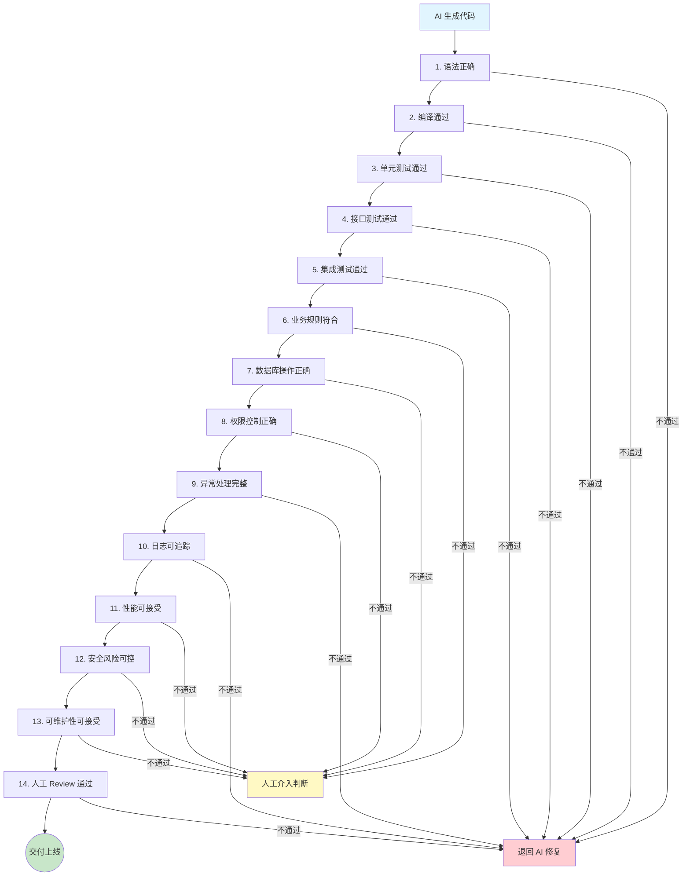

# 第 8 章：AI 代码验收与风险控制

##  本章要解决的问题

使用 AI 生成代码之后，你面临一个无法回避的问题：**这段代码你敢直接上线吗？**

前面的章节已经覆盖了需求分析、方案设计、代码生成。现在到了最后一道防线：验收。本章解决以下几个核心问题：

1. AI 生成的代码，如何系统性地验证其正确性？
2. 从编译到上线，每一层验证该检查什么、用什么工具？
3. AI 输出与人工责任之间的边界在哪里？
4. 企业如何制定 AI 代码使用规范，避免合规风险？

这不是"锦上添花"的章节。在企业环境中，验收环节缺失的代价可能是生产事故、数据丢失、安全漏洞。10 年经验的 Java 程序员，你的价值恰恰不在于"能写出这段代码"，而在于"能判断这段代码能不能用"。

---

##  AI 生成内容为什么必须验收

### 责任归属：一个无法回避的事实

代码是谁写的，责任就是谁的。这句话在 AI 时代依然成立，但主语变了：

- **AI 写的代码，责任在使用 AI 的开发者。**
- Claude、ChatGPT、Codex 不会为生成的代码承担任何法律责任。
- 你 merge 了 AI 生成的代码，就等于你对这段代码签了字。

这不是哲学讨论，而是已经在发生的现实：

- 2024 年，某金融科技公司因 AI 生成的 SQL 包含未加事务边界的批量更新，导致对账数据偏差，回滚耗时 6 小时。
- 多家企业已经在劳动合同和外包协议中加入了"AI 辅助生成代码的验收责任条款"。
- SOC 2、ISO 27001 等合规审计开始关注"AI 辅助开发的质量管控流程"。

**结论：AI 是工具，你是负责人。验收不是可选项，是必选项。**

### AI 代码的典型风险模式

经过大量实际使用，AI 生成代码的常见问题集中在以下几类：

| 风险类型 | 典型表现 | 实际案例 |
|---------|---------|---------|
| 幻觉代码 | 调用不存在的 API、使用不存在的依赖 | Spring Boot 3.x 项目调用 `WebMvcConfigurerAdapter`（3.x 已移除） |
| 业务逻辑偏差 | 对业务规则的实现与需求不符 | 金额计算用 `double` 而非 `BigDecimal` |
| 安全漏洞 | 缺少输入校验、SQL 拼接、敏感信息泄露 | 生成的 Controller 未加 `@Valid` 注解 |
| 性能陷阱 | N+1 查询、大事务、未分页 | `forEach` 中逐条查询关联数据 |
| 异常处理缺失 | 未捕获预期异常、异常信息暴露内部结构 | try-catch 后 `e.printStackTrace()` |
| 事务边界错误 | 事务范围过大或过小、缺少回滚策略 | 非事务方法中调用多个 Repository |

这些不是 AI 的"bug"——AI 在概率上倾向于生成最常见、最通用的写法，而你的业务场景恰恰需要针对性的处理。

---

##  完整验收框架

验收不是"跑一下看看能不能用"，而是一个结构化的分层流程。下图展示了从代码生成到可上线交付的完整验收流水线：



验收分为 14 层，每层检查不同的维度。这 14 层又可以归为四个阶段：

| 阶段 | 包含层次 | 自动化程度 | 负责人 |
|------|---------|-----------|--------|
| 快速验证 | 1-4（语法、编译、单元测试、接口测试） | 全自动 | CI 流水线 |
| 集成验证 | 5-7（集成测试、业务规则、数据库操作） | 半自动 | 开发者 + CI |
| 质量门禁 | 8-13（权限、异常、日志、性能、安全、可维护） | 自动 + 人工 | SonarQube + 技术负责人 |
| 最终审批 | 14（人工 Review） | 人工 | 团队 Code Review |

---

##  每层验收详解

### 第 1 层：语法正确

**检查目标**：代码没有语法错误，IDE 无红色波浪线。

**检查方法**：
- IDE 实时语法检查（IntelliJ IDEA / VS Code）
- 人工确认 import 语句正确、方法签名匹配、注解用法无误
- 检查 AI 是否使用了当前项目不存在的 Java 版本特性

**常见问题**：
- AI 混用不同版本 Java 的 API（如 `var` 在 Java 10 之前不可用）
- Lombok 注解使用错误（`@Data` 在 JPA Entity 上使用会造成循环引用）
- 泛型类型推断与实际用法不匹配

**工具**：
- IDE 内置语法高亮和错误提示
- IntelliJ IDEA Inspections

---

### 第 2 层：编译通过

**检查目标**：`mvn compile` 或 `gradle build` 零错误通过。

**必须执行的命令**：

```bash
# Maven 项目
mvn clean compile

# Gradle 项目
gradle clean compileJava

# 如果编译失败，查看详细错误
mvn clean compile -e
```

**常见问题**：
- AI 生成的代码引用了未导入的依赖
- 依赖版本不兼容（Spring Boot 2.x vs 3.x）
- `pom.xml` 或 `build.gradle` 中缺少必要的 starter

**关键检查点**：
- 所有 `@Autowired`、`@Resource` 注入的 Bean 是否存在于 Spring 容器中
- 配置类（`@Configuration`）引用的属性是否在 `application.yml` 中有定义
- MapStruct、Lombok 等编译期注解处理器是否正确配置

---

### 第 3 层：单元测试通过

**检查目标**：JUnit 5 + Mockito 单元测试全部绿色，覆盖率达标。

**执行命令**：

```bash
# 运行全部单元测试
mvn test

# 运行特定类的测试
mvn test -Dtest=UserServiceTest

# 生成覆盖率报告（JaCoCo）
mvn test jacoco:report
```

**覆盖率要求**：

| 项目类型 | 最低行覆盖率 | 最低分支覆盖率 | 说明 |
|---------|------------|--------------|------|
| 核心业务逻辑 | 80% | 70% | Service 层、领域模型 |
| 工具类 | 90% | 80% | 纯函数，容易覆盖 |
| Controller | 60% | 50% | 通过集成测试覆盖更合适 |
| 配置/常量类 | 可选 | 可选 | 收益率低 |

**AI 生成单元测试的特殊检查**：
- AI 可能生成"为了覆盖率而覆盖率的测试"——只调用方法不看断言
- Mock 对象的行为是否合理（是不是把什么都 Mock 了，什么都没真正验证）
- 边界条件测试是否充分（null、空集合、极值）

**JaCoCo 配置示例**：

```xml
<!-- pom.xml -->
<plugin>
    <groupId>org.jacoco</groupId>
    <artifactId>jacoco-maven-plugin</artifactId>
    <version>0.8.12</version>
    <executions>
        <execution>
            <goals>
                <goal>prepare-agent</goal>
            </goals>
        </execution>
        <execution>
            <id>report</id>
            <phase>test</phase>
            <goals>
                <goal>report</goal>
            </goals>
        </execution>
    </executions>
</plugin>
```

---

### 第 4 层：接口测试通过

**检查目标**：Controller 层的 HTTP 接口行为符合预期。

**工具选择**：

| 工具 | 适用场景 | 特点 |
|------|---------|------|
| `MockMvc` | 不启动完整容器的轻量测试 | 快，不依赖 Servlet 容器 |
| `TestRestTemplate` | 需要完整 Spring 上下文 | 接近真实环境 |
| `WebTestClient` | WebFlux 响应式项目 | 支持异步 |

**MockMvc 示例**：

```java
@WebMvcTest(UserController.class)
class UserControllerTest {

    @Autowired
    private MockMvc mockMvc;

    @MockBean
    private UserService userService;

    @Test
    void shouldReturn400WhenRequestBodyInvalid() throws Exception {
        mockMvc.perform(post("/api/users")
                .contentType(MediaType.APPLICATION_JSON)
                .content("{\"name\":\"\"}"))  // 名字为空
                .andExpect(status().isBadRequest())
                .andExpect(jsonPath("$.code").value("400"))
                .andExpect(jsonPath("$.message").exists());
    }

    @Test
    void shouldReturn200WithPageWhenQueryingUsers() throws Exception {
        Page<UserDto> page = new PageImpl<>(List.of(new UserDto(1L, "张三")));
        when(userService.findUsers(any(Pageable.class))).thenReturn(page);

        mockMvc.perform(get("/api/users?page=0&size=10"))
                .andExpect(status().isOk())
                .andExpect(jsonPath("$.content[0].name").value("张三"));
    }
}
```

**检查清单**：
- 正常请求返回正确的 HTTP 状态码和响应体
- 参数校验失败返回 400 + 明确错误信息
- 资源不存在返回 404
- 未授权访问返回 401 或 403
- 请求方法不匹配返回 405
- 不支持的 Content-Type 返回 415
- 响应体中不泄露敏感信息（密码、内部异常堆栈）

---

### 第 5 层：集成测试通过

**检查目标**：多个组件协作的行为正确，包括数据库、缓存、消息队列。

**核心工具**：Testcontainers + H2 / 真实数据库。

**Testcontainers 配置示例**：

```java
@SpringBootTest
@Testcontainers
class OrderServiceIntegrationTest {

    @Container
    static PostgreSQLContainer<?> postgres = new PostgreSQLContainer<>("postgres:16")
            .withDatabaseName("testdb")
            .withUsername("test")
            .withPassword("test");

    @DynamicPropertySource
    static void configureProperties(DynamicPropertyRegistry registry) {
        registry.add("spring.datasource.url", postgres::getJdbcUrl);
        registry.add("spring.datasource.username", postgres::getUsername);
        registry.add("spring.datasource.password", postgres::getPassword);
    }

    @Autowired
    private OrderService orderService;

    @Test
    void shouldCreateOrderInTransaction() {
        OrderRequest request = new OrderRequest(1L, List.of(
                new OrderItem("SKU-001", 2, new BigDecimal("99.00"))
        ));

        OrderResult result = orderService.createOrder(request);

        assertNotNull(result.getOrderId());
        assertEquals(OrderStatus.PENDING, result.getStatus());
    }
}
```

**集成测试检查要点**：

| 检查项 | 说明 |
|--------|------|
| 数据库事务 | 回滚是否正确，嵌套事务行为 |
| 缓存一致性 | 更新后缓存是否失效 / 更新 |
| 消息可靠性 | 事务消息是否和数据库操作一致 |
| 外部 API Mock | 用 WireMock 模拟外部服务 |
| 数据库迁移 | Flyway / Liquibase 脚本是否在集成测试中执行 |

**WireMock 外部 API Mock 示例**：

```java
@SpringBootTest
@WireMockTest(httpPort = 8089)
class PaymentIntegrationTest {

    @Test
    void shouldRetryWhenPaymentGatewayFails() {
        stubFor(post(urlEqualTo("/pay"))
                .willReturn(aResponse().withStatus(503)));

        // 验证重试机制
        assertThrows(PaymentException.class,
                () -> paymentService.pay(orderId));
    }
}
```

---

### 第 6 层：业务规则符合

**检查目标**：代码实现的业务逻辑与需求规格一致。这是 AI 最容易出错的一层，因为 AI 不理解你的业务上下文。

**检查方法**：
1. **对照需求文档**：逐条核对需求规格中的业务规则
2. **边界条件验证**：金额为 0、数量为负数、日期跨越闰年等
3. **业务状态机**：确认状态流转路径完整且不可逆操作有防护
4. **业务计算精度**：金融计算是否使用 `BigDecimal`，除法是否指定舍入模式

**Java 中常见的 AI 业务错误**：

```java
// 错误：金额计算用 double
double total = price * quantity;  // 浮点精度问题

// 正确：金融计算使用 BigDecimal
BigDecimal total = price.multiply(BigDecimal.valueOf(quantity));
```

```java
// 错误：未处理业务幂等性
public void deductBalance(Long userId, BigDecimal amount) {
    Account account = accountRepo.findById(userId).get();
    account.setBalance(account.getBalance().subtract(amount));
    accountRepo.save(account);
}

// 正确：增加幂等键防重
public void deductBalance(Long userId, BigDecimal amount, String idempotentKey) {
    if (deductLogRepo.existsByIdempotentKey(idempotentKey)) {
        return; // 已处理
    }
    // 加锁、扣款、记录日志
}
```

---

### 第 7 层：数据库操作正确

**检查目标**：SQL 正确、索引合理、无 N+1 问题、事务边界清晰。

**检查清单**：

| 检查项 | 工具/方法 | 说明 |
|--------|----------|------|
| SQL 正确性 | 审查生成的所有 SQL / JPQL / Criteria | 对复杂查询手动 EXPLAIN |
| 索引使用 | Spring Data JPA 方法名→SQL 映射 | 确认 WHERE/JOIN 字段都有索引 |
| N+1 查询 | `spring.jpa.show-sql=true` + 日志审查 | 或用 Hypersistence Optimizer |
| 事务边界 | `@Transactional` 位置审查 | 事务范围是否合理 |
| 批量操作 | 确认使用 `saveAll()` 而非循环 `save()` | JDBC batch 配置检查 |
| 连接池 | HikariCP 监控指标 | 确认无连接泄漏 |

**N+1 检测配置**：

```yaml
# application-dev.yml
spring:
  jpa:
    show-sql: true
    properties:
      hibernate:
        format_sql: true
        # 发现 N+1 时打印警告或抛异常
        batch_fetch_style: PADDED
logging:
  level:
    org.hibernate.SQL: DEBUG
    org.hibernate.type.descriptor.sql.BasicBinder: TRACE
```

**JPA Entity 关键检查**：
- `@OneToMany` 默认 LAZY，AI 可能写成 EAGER 导致性能问题
- `@ManyToOne` 默认 EAGER，需要显式改为 LAZY
- `equals()` 和 `hashCode()` 实现是否正确（使用业务键而非代理 ID）

---

### 第 8 层：权限控制正确

**检查目标**：认证和授权逻辑没有被绕过，敏感接口有保护。

**Spring Security 检查清单**：

```java
// 检查 SecurityConfig 的每一个规则
@Bean
public SecurityFilterChain filterChain(HttpSecurity http) throws Exception {
    http
        .authorizeHttpRequests(auth -> auth
            .requestMatchers("/api/admin/**").hasRole("ADMIN")    // 检查：角色是否正确
            .requestMatchers("/api/users/{id}").access(this::isOwnerOrAdmin)  // 检查：资源归属
            .requestMatchers("/api/public/**").permitAll()         // 检查：公开接口范围
            .anyRequest().authenticated()
        )
        .csrf(csrf -> csrf
            .ignoringRequestMatchers("/api/webhook/**")  // 检查：CSRF 豁免是否必要
        );
    return http.build();
}
```

**权限检查要点**：

| 检查项 | 方法 |
|--------|------|
| 水平越权 | 用户 A 能否访问用户 B 的数据？URL 参数暴露 ID 时必须有归属校验 |
| 垂直越权 | 普通用户能否调用管理员接口？每个接口都要有角色/权限注解 |
| 未认证访问 | 所有非公开接口是否都经过认证过滤器 |
| Token 管理 | JWT 过期时间、刷新策略、退出登录后的 Token 失效 |
| 敏感数据 | 密码、手机号、身份证等是否在接口返回中脱敏 |

---

### 第 9 层：异常处理完整

**检查目标**：所有异常都有统一处理，不暴露内部实现细节，不影响业务流程。

**全局异常处理器检查**：

```java
@RestControllerAdvice
public class GlobalExceptionHandler {

    @ExceptionHandler(MethodArgumentNotValidException.class)
    public ResponseEntity<ErrorResponse> handleValidation(MethodArgumentNotValidException ex) {
        // 检查：错误信息是否对用户友好
        // 检查：是否暴露了字段名、类名等内部信息
        String message = ex.getBindingResult().getFieldErrors().stream()
                .map(e -> e.getField() + ": " + e.getDefaultMessage())
                .collect(Collectors.joining("; "));
        return ResponseEntity.badRequest()
                .body(new ErrorResponse("400", message));
    }

    @ExceptionHandler(BusinessException.class)
    public ResponseEntity<ErrorResponse> handleBusiness(BusinessException ex) {
        // 检查：业务异常的错误码是否规范
        return ResponseEntity.badRequest()
                .body(new ErrorResponse(ex.getCode(), ex.getMessage()));
    }

    @ExceptionHandler(Exception.class)
    public ResponseEntity<ErrorResponse> handleUnknown(Exception ex) {
        // 检查：是否记录了完整堆栈（日志中）
        log.error("Unhandled exception", ex);
        // 检查：返回给客户端的是否是通用错误信息（不暴露堆栈）
        return ResponseEntity.internalServerError()
                .body(new ErrorResponse("500", "系统繁忙，请稍后重试"));
    }
}
```

**AI 代码常见异常处理问题**：
- `catch (Exception e) { e.printStackTrace(); }` —— 既不记录日志也不给用户提示
- `catch (Exception e) { return null; }` —— 吞掉异常，上层不知道发生了什么
- `throw new RuntimeException(e.getMessage())` —— 丢失原始异常堆栈
- 未区分业务异常和系统异常，导致 500 返回给用户

---

### 第 10 层：日志可追踪

**检查目标**：关键操作有日志，异常有全量日志，日志不泄露敏感信息。

**日志检查要素**：

| 类型 | 内容 | 日志级别 |
|------|------|---------|
| 关键操作日志 | 用户注册、下单、支付、退款等 | INFO |
| 异常日志 | 完整堆栈 + 上下文（用户 ID、请求参数） | ERROR |
| 审计日志 | 权限变更、配置修改、数据删除 | WARN |
| 调用链追踪 | TraceId 全链路透传 | DEBUG/INFO |

**AI 生成代码的日志检查要点**：

```java
// 错误：在日志中打印密码
log.info("用户登录：用户名={}, 密码={}", username, password);

// 正确：密码不进入日志
log.info("用户登录：用户名={}", username);

// 错误：异常日志缺少上下文
log.error("处理失败", e);

// 正确：携带业务上下文
log.error("订单创建失败, userId={}, productId={}, amount={}",
        userId, productId, amount, e);

// 错误：循环内打印日志
users.forEach(user -> {
    log.info("处理用户：{}", user.getId());  // 1 万条用户 → 1 万行日志
    processUser(user);
});

// 正确：批量操作摘要日志
log.info("开始处理 {} 个用户", users.size());
users.forEach(this::processUser);
log.info("用户批量处理完成, 成功: {}, 失败: {}", successCount, failCount);
```

**TraceId 配置（Spring Cloud Sleuth 或 Micrometer Tracing）**：

```yaml
logging:
  pattern:
    level: "%5p [${spring.application.name:},%X{traceId:-},%X{spanId:-}]"
```

---

### 第 11 层：性能可接受

**检查目标**：常见操作响应时间在可接受范围内，无明显的性能反模式。

**Java 常见性能反模式**：

| 反模式 | 检测方法 | 解决方案 |
|--------|---------|---------|
| N+1 查询 | 开启 SQL 日志 + 审查 | `@EntityGraph` / `JOIN FETCH` / 批量查询 |
| 大事务 | 审查 `@Transactional` 范围 | 缩小事务边界，非必要操作移出事务 |
| 循环中数据库调用 | 代码审查 | 批量操作 `saveAll()` / `IN` 查询 |
| 未分页查询 | 检查 Repository 方法返回值 | 返回 `Page` 或加 `Pageable` 参数 |
| 内存泄漏 | `jmap -histo` / `jconsole` / MAT | 检查静态集合、ThreadLocal 清理 |
| 字符串拼接 | 循环中用 `+` 拼接 | `StringBuilder` |
| 不合理的锁范围 | `synchronized` 方法体过大 | 减小临界区、用 `ConcurrentHashMap` |

**AI 高频问题示例——大事务**：

```java
// 错误：事务中包含非数据库操作
@Transactional
public OrderResult createOrder(OrderRequest request) {
    Order order = orderRepo.save(buildOrder(request));
    sendNotification(order);          // 发通知不应该在事务中
    callExternalInventory(order);     // 调外部 API 不应该在事务中
    generatePDF(order);               // 生成 PDF 不应该在事务中
    return toResult(order);
}

// 正确：事务只包裹数据库操作，其他操作在事务外
public OrderResult createOrder(OrderRequest request) {
    Order order = transactionalCreate(request);
    sendNotification(order);
    callExternalInventory(order);
    generatePDF(order);
    return toResult(order);
}

@Transactional
private Order transactionalCreate(OrderRequest request) {
    return orderRepo.save(buildOrder(request));
}
```

**性能测试工具链**：

```bash
# JMH 微基准测试
# 用于测试关键方法的性能基线

# 集成性能测试
mvn verify -Pperformance-test  # 自定义 Maven profile

# 数据库查询分析
# Hibernate Statistics
spring.jpa.properties.hibernate.generate_statistics=true
```

---

### 第 12 层：安全风险可控

**检查目标**：无 OWASP Top 10 中常见漏洞，无敏感信息泄露。

**OWASP 检查清单（Java / Spring Boot）**：

| 漏洞类型 | 检查方法 | 工具 |
|---------|---------|------|
| SQL 注入 | 所有 DB 操作是否使用参数化查询（JPA / MyBatis `#{}`） | SonarQube |
| XSS | 前端输出是否转义，富文本是否有白名单过滤 | OWASP Java Encoder |
| CSRF | Spring Security CSRF 配置，前后端分离项目 Token 校验 | Spring Security |
| 权限绕过 | 每个 Controller 方法是否有 `@PreAuthorize` 或 SecurityConfig | 代码审查 |
| 敏感信息泄露 | 配置文件、日志、接口返回 | GitLeaks / TruffleHog |
| 依赖漏洞 | 第三方依赖是否有已知 CVE | OWASP Dependency-Check |
| 不安全反序列化 | Jackson `@JsonTypeInfo` 使用、Java 原生反序列化 | 代码审查 |
| SSRF | URL 参数是否可控、是否有白名单 | 代码审查 + 网络策略 |

**OWASP Dependency-Check 集成**：

```xml
<!-- pom.xml -->
<plugin>
    <groupId>org.owasp</groupId>
    <artifactId>dependency-check-maven</artifactId>
    <version>10.0.4</version>
    <configuration>
        <failBuildOnCVSS>7</failBuildOnCVSS>  <!-- CVSS >= 7 构建失败 -->
    </configuration>
    <executions>
        <execution>
            <goals>
                <goal>check</goal>
            </goals>
        </execution>
    </executions>
</plugin>
```

```bash
# 执行依赖安全检查
mvn dependency-check:check

# 查看报告
# 打开 target/dependency-check-report.html
```

**SonarQube 静态分析**：

```bash
# SonarQube 扫描（需要先配置 SonarQube Server）
mvn sonar:sonar \
  -Dsonar.projectKey=my-project \
  -Dsonar.host.url=http://sonarqube:9000 \
  -Dsonar.login=<token>

# 质量门禁配置（sonar-project.properties）
# sonar.qualitygate.wait=true     # 等待质量门禁结果
```

**AI 代码安全检查要点**：

```java
// 错误：SQL 拼接（MyBatis 中用 ${} 而非 #{}）
@Select("SELECT * FROM users WHERE name = '${name}'")
User findByName(String name);

// 正确：参数化查询
@Select("SELECT * FROM users WHERE name = #{name}")
User findByName(String name);

// 错误：Controller 未校验输入
@PostMapping("/users")
public User createUser(@RequestBody User user) {
    return userService.save(user);
}

// 正确：加 @Valid 启用 Bean Validation
@PostMapping("/users")
public User createUser(@Valid @RequestBody User user) {
    return userService.save(user);
}
```

---

### 第 13 层：可维护性可接受

**检查目标**：代码可读、命名规范、复杂度可控、无过度设计。

**检查维度**：

| 维度 | 标准 | 工具 |
|------|------|------|
| 圈复杂度 | 单个方法 < 15 | SonarQube / PMD |
| 方法长度 | < 50 行 | SonarQube / Checkstyle |
| 类长度 | < 500 行 | SonarQube |
| 命名规范 | Java 命名约定、业务术语一致 | 人工 Review |
| 重复代码 | 3 处以上相似代码应抽取 | SonarQube / jscpd |
| 注释质量 | 为什么而非做了什么 | 人工 Review |

**AI 代码的可维护性问题**：

- **幻觉注释**：AI 可能生成与代码不符的注释。注释说"使用 Redis 缓存"，实际用的是 Caffeine。
- **过度抽象**：AI 倾向按常见模式生成代码，但你的场景可能不需要那一层抽象。
- **变量命名不一致**：同一概念在不同方法中用了不同名字。
- **冗余依赖**：AI 可能引入不必要的依赖，比如简单的判断引入了 Guava。

---

### 第 14 层：人工 Review 通过

这是最后一道防线，无法自动化。详见"人工 Review 清单"部分。

---

##  AI 代码验收方法论

前面描述了 14 层验收的结构，本节给出具体的技术实现方法。每项都包含明确的命令和配置。

### 编译验证

```bash
# Maven 编译 + 运行全部测试
mvn clean verify

# 跳过测试的快速编译（仅开发阶段）
mvn clean compile -DskipTests

# Gradle
gradle clean build

# 多模块项目指定模块
mvn clean verify -pl module-name -am
```

**CI 流水线中的编译阶段必须包含**：
- 代码编译
- 资源过滤
- 注解处理器执行（Lombok、MapStruct）
- 失败则阻断流水线

---

### 单元测试

```bash
# 运行全部测试
mvn test

# 特定 profile
mvn test -P unit-test

# 并行运行（加速）
mvn test -T 4

# 仅运行指定标签的测试（JUnit 5 @Tag）
mvn test -Dgroups="unit"
```

**JaCoCo 覆盖率门禁**：

```xml
<!-- pom.xml -->
<plugin>
    <groupId>org.jacoco</groupId>
    <artifactId>jacoco-maven-plugin</artifactId>
    <version>0.8.12</version>
    <configuration>
        <rules>
            <rule>
                <element>BUNDLE</element>
                <limits>
                    <limit>
                        <counter>LINE</counter>
                        <value>COVEREDRATIO</value>
                        <minimum>0.70</minimum>
                    </limit>
                    <limit>
                        <counter>BRANCH</counter>
                        <value>COVEREDRATIO</value>
                        <minimum>0.60</minimum>
                    </limit>
                </limits>
            </rule>
        </rules>
    </configuration>
</plugin>
```

---

### 接口测试（MockMvc）

```java
@SpringBootTest
@AutoConfigureMockMvc
class UserControllerIntegrationTest {

    @Autowired
    private MockMvc mockMvc;

    @Test
    void shouldReturn400WhenInvalidInput() throws Exception {
        String invalidJson = """
            {
                "username": "",
                "email": "not-an-email"
            }
            """;

        mockMvc.perform(post("/api/users")
                .contentType(MediaType.APPLICATION_JSON)
                .content(invalidJson))
                .andExpect(status().isBadRequest())
                .andExpect(jsonPath("$.errors").isArray());
    }
}
```

---

### 集成测试（Testcontainers）

```bash
# Docker 必须可用
docker info

# 运行集成测试（通常通过 maven-failsafe-plugin）
mvn verify -P integration-test

# 仅运行集成测试
mvn failsafe:integration-test
```

**Maven Failsafe 配置**：

```xml
<plugin>
    <groupId>org.apache.maven.plugins</groupId>
    <artifactId>maven-failsafe-plugin</artifactId>
    <version>3.2.5</version>
    <executions>
        <execution>
            <goals>
                <goal>integration-test</goal>
                <goal>verify</goal>
            </goals>
        </execution>
    </executions>
</plugin>
```

---

### 安全检查

**一条命令运行全部安全检查**：

```bash
# 组合命令（自定义脚本）
#!/bin/bash
echo "=== 1. OWASP Dependency Check ==="
mvn dependency-check:check || exit 1

echo "=== 2. SonarQube Scan ==="
mvn sonar:sonar || exit 1

echo "=== 3. SpotBugs Static Analysis ==="
mvn spotbugs:check || exit 1

echo "=== All security checks passed ==="
```

**SpotBugs Maven 插件**：

```xml
<plugin>
    <groupId>com.github.spotbugs</groupId>
    <artifactId>spotbugs-maven-plugin</artifactId>
    <version>4.8.6.0</version>
    <configuration>
        <effort>Max</effort>
        <threshold>Low</threshold>
    </configuration>
</plugin>
```

---

### 性能检查

**本地检测 N+1**：

```yaml
# application-dev.yml
spring:
  jpa:
    show-sql: true
    properties:
      hibernate:
        format_sql: true
  datasource:
    hikari:
      maximum-pool-size: 5   # 限制连接池大小，快速暴露连接泄漏
      leak-detection-threshold: 10000  # 10s 连接泄漏告警
```

**Hibernate Statistics**：

```yaml
spring:
  jpa:
    properties:
      hibernate:
        generate_statistics: true
```

然后在日志中检查：
- `Session Metrics` 中的 query 执行次数是否异常
- 一次 HTTP 请求触发的 SQL 数量

---

### 日志检查

**快速检查脚本**：

```bash
# 检查是否有 e.printStackTrace()——应替换为 log.error()
grep -rn "printStackTrace()" src/main/java/

# 检查是否有 System.out.println——应替换为 log
grep -rn "System.out.println" src/main/java/

# 检查日志中是否有可能包含敏感字段
grep -rn "password\|secret\|token\|apiKey" src/main/java/ | grep "log\."
```

**日志规范检查项**：
- 所有 `catch` 块中是否有日志记录
- 关键业务节点（订单创建、支付成功、退款）是否有 INFO 日志
- 是否有日志脱敏（手机号中间四位、身份证部分遮盖）
- MDC 中是否正确设置了 userId、traceId

---

### 异常处理检查

```bash
# 检查是否有空的 catch 块
grep -rn "catch.*{" src/main/java/ -A 2 | grep -B 1 "^\s*}$"

# 检查是否有 throw new RuntimeException 丢失原始异常
grep -rn "throw new RuntimeException" src/main/java/
```

---

### 数据一致性检查

**事务边界检查**：

```bash
# 查找所有 @Transactional 注解位置
grep -rn "@Transactional" src/main/java/

# 检查是否有在非事务方法中调用多个写操作
# 人工审查：同一个 Service 方法中是否有多次 repository.save()
```

**思路清单**：
- 涉及多个表的写操作是否在一个事务中
- `@Transactional(rollbackFor = Exception.class)` 是否有指定
- 分布式场景下的最终一致性方案是否有清晰文档

---

##  人工 Review 清单

自动化工具无法替代人工判断。以下是 Code Review 时针对 AI 生成代码的专项检查清单：

### 第一轮：业务正确性（必须全部通过）

- [ ] 代码实现的业务逻辑与需求文档一致
- [ ] 业务规则（计算规则、状态流转、权限规则）正确实现
- [ ] 边界条件已处理（金额为 0、数量为负数、空集合、null 参数）
- [ ] 金融/金额相关计算使用 `BigDecimal`，舍入模式明确
- [ ] 日期时间处理考虑了时区（使用 `ZonedDateTime` 或明确 `ZoneId`）
- [ ] 幂等性策略在需要的地方已实现（支付、扣款、消息消费）
- [ ] 并发场景下的数据一致性有保障（乐观锁 / 悲观锁 / 分布式锁）

### 第二轮：代码质量（必须全部通过）

- [ ] 命名清晰，方法名能表达意图，无 `data`、`info`、`temp` 等模糊命名
- [ ] 单个方法圈复杂度可接受（通常 < 15）
- [ ] 无重复代码（AI 有时会生成几乎相同的两个方法）
- [ ] 无明显的过度设计（为简单场景引入策略模式）
- [ ] 依赖方向正确（Controller → Service → Repository，无反向依赖）
- [ ] 配置集中管理（`application.yml` 或 `@ConfigurationProperties`），无硬编码
- [ ] 无未使用的 import、变量、方法

### 第三轮：安全检查（必须全部通过）

- [ ] 所有用户输入经过校验和过滤
- [ ] SQL/JPQL 使用参数化查询，无字符串拼接
- [ ] 接口有认证和授权控制
- [ ] 敏感字段在日志和返回值中脱敏
- [ ] 文件上传有类型和大小限制
- [ ] 外部 URL 跳转有白名单校验
- [ ] 随机数/Token 使用 `SecureRandom` 而非 `Random`

### 第四轮：运维可观测性（建议全部通过）

- [ ] 关键业务操作有 INFO 级别日志（包含用户 ID 和业务单号）
- [ ] 异常日志包含完整堆栈和业务上下文
- [ ] 健康检查接口可用（`/actuator/health`）
- [ ] 关键业务指标有 metrics 埋点（可选，核心业务必须）
- [ ] 数据库连接池、线程池有监控指标暴露

---

##  AI 输出责任边界

这是本章最关键的一节。技术验证可以用工具自动化，但**责任边界不能自动化**。

### AI 可以做什么

| 角色 | 可以 | 不可以 |
|------|------|--------|
| 代码生成 | 根据 Prompt 生成代码 | 保证代码在业务环境正确运行 |
| 代码解释 | 解释代码逻辑和意图 | 保证解释与实际行为一致 |
| 测试生成 | 生成单元测试用例 | 保证覆盖所有边界条件 |
| 漏洞检测 | 识别常见安全模式问题 | 保证无未知安全漏洞 |
| 文档生成 | 根据代码生成 API 文档 | 保证文档与实际实现一致 |

### 人工必须做什么

| 角色 | 必须由人工完成 | 原因 |
|------|--------------|------|
| 业务验证 | 确认代码实现符合业务需求 | AI 不懂你的业务 |
| 安全审计 | 对安全敏感代码进行专项审查 | 安全责任无法转嫁 |
| 最终决策 | 决定代码是否可以上线 | 法律和合规责任 |
| 事故负责 | 生产事故的责任归属 | 合同和法律义务 |
| 合规审查 | 金融、医疗、政府等行业的法规符合性 | 行业强制要求 |

### 责任边界线

```
┌─────────────────────────────────────────────────┐
│                  AI 辅助范围                       │
│  ┌──────────┐  ┌──────────┐  ┌───────────────┐  │
│  │ 代码生成  │  │ 测试生成  │  │ 文档/注释生成  │  │
│  └──────────┘  └──────────┘  └───────────────┘  │
│  ┌──────────┐  ┌──────────┐  ┌───────────────┐  │
│  │ 代码解释  │  │ 格式重构  │  │ 静态分析建议   │  │
│  └──────────┘  └──────────┘  └───────────────┘  │
├─────────────────────────────────────────────────┤
│                人工责任边界（不可转移）              │
│  ┌──────────┐  ┌──────────┐  ┌───────────────┐  │
│  │ 最终验收  │  │ 安全审计  │  │  上线决策       │  │
│  └──────────┘  └──────────┘  └───────────────┘  │
│  ┌──────────┐  ┌──────────┐  ┌───────────────┐  │
│  │ 事故责任  │  │ 合规审查  │  │  架构决策       │  │
│  └──────────┘  └──────────┘  └───────────────┘  │
└─────────────────────────────────────────────────┘
```

### 法律层面的关键认知

1. **著作权问题**：AI 生成的代码是否享有著作权，目前各国法律态度不一。美国版权局 2023 年的立场是"纯粹由 AI 生成的内容不受版权保护"。但人工修改、选择、编排后的 AI 生成代码，在有实质性人工创作的部分可以受版权保护。关键在于你的修改是否具有"创造性"。

2. **开源协议传染**：AI 模型可能使用 GPL 等 Copyleft 协议的开源代码进行训练。AI 生成的代码如果与训练集中的 GPL 代码实质性相似，理论上存在协议传染风险。企业应当关注模型的训练数据来源说明和自身的代码使用政策。

3. **责任归属**：在现有法律框架下，使用 AI 工具的开发者/企业是代码的最终责任主体。AI 工具提供商通常在服务条款中明确声明不对生成内容的质量、安全性、合规性负责。

4. **行业监管**：金融（PCI DSS、银保监会规定）、医疗（HIPAA、医疗器械软件注册）、政府等行业对软件有严格的审查要求。AI 生成的代码不能绕过这些审查流程。

---

##  企业如何制定 AI 使用规范

以下是一份可直接参考的规范文本框架，企业可以根据自身情况调整：

### 《AI 辅助开发使用规范（示例）》

**第一条 适用范围**

本规范适用于本公司所有使用 AI 工具（包括但不限于 Claude、ChatGPT、GitHub Copilot、Codex 等）辅助软件开发的场景。

**第二条 基本原则**

1. AI 是辅助工具，不是决策主体。所有 AI 生成的代码、文档、配置必须经过人工审核后方可使用。
2. 使用 AI 工具的员工对 AI 生成内容的质量、安全、合规负全部责任。
3. AI 工具不得接触生产环境、生产数据、客户隐私数据。

**第三条 禁止行为**

1. 禁止将包含客户信息、商业秘密、系统凭证的内容输入 AI 工具。
2. 禁止在未审核的情况下将 AI 生成的代码直接提交、合并、部署。
3. 禁止使用 AI 工具绕过代码审查、安全审计、合规审查流程。
4. 禁止使用 AI 生成安全敏感代码（加密实现、认证逻辑、权限判断）而不经安全团队审核。

**第四条 代码生成规范**

1. AI 生成的代码必须通过以下验证方可合并：
   - 编译通过（`mvn clean verify` / `gradle build`）
   - 单元测试通过，新增代码行覆盖率不低于 70%
   - 集成测试通过（涉及数据库/外部服务的场景）
   - 人工 Code Review 通过
   - OWASP Dependency-Check 无高危漏洞
   - SonarQube 质量门禁通过
2. AI 生成的 SQL 必须经过 DBA 审核（涉及生产数据库变更时）。

**第五条 安全要求**

1. AI 生成的代码必须通过安全扫描（SAST + 依赖检查）。
2. 涉及用户认证、授权、数据加密的代码必须由安全工程师审核。
3. AI 生成代码不得包含硬编码的密钥、密码、Token。所有凭证使用配置中心或密钥管理服务。

**第六条 文档和可追溯性**

1. 对于主要由 AI 生成的代码模块，建议在提交信息中注明（如 `Co-Authored-By: Claude <ai-assistant>`），便于后续追溯。
2. 重要业务模块应保留原始 Prompt 记录，以备审计。

**第七条 培训要求**

1. 使用 AI 工具的开发者必须接受"AI 代码验收与风险控制"培训。
2. 技术负责人和项目经理需了解 AI 生成代码的典型风险和验收流程。

**第八条 违规处理**

违反本规范的，根据情节严重程度给予通报批评、暂停 AI 工具使用权限、记过等处分。因违规造成生产事故或信息泄露的，依法追究责任。

---

##  常见误区

### 误区 1："AI 写的代码和我写的差不多，不需要特别检查"

事实：AI 写的代码看起来"像那么回事"，但经常在细节上出错。它不懂你的项目约定、命名规范、已有的工具类和基础设施。看起来对的代码，可能在参数类型、异常处理、事务边界上有隐蔽问题。

### 误区 2："单元测试也是 AI 生成的，跑通了就行"

事实：AI 生成测试可能不验证关键断言。一个测试方法可能 mock 了所有依赖，但最后只 `assertNotNull(result)`。跑通不能说明正确。检查 AI 生成的测试中的断言是否真正验证了业务行为。

### 误区 3："安全扫描工具没报问题就是安全的"

事实：工具只能检测已知漏洞模式。AI 生成的代码可能包含工具无法检测的逻辑漏洞，比如业务层面的权限绕过、流程漏洞。工具是辅助，安全判断最终靠人。

### 误区 4："AI 写了代码，出事了我可以说'这是 AI 的问题'"

事实：在法律和公司层面，你 merge 了代码就是你负责。没有法院会接受"是 AI 写的"作为免责理由。你的 Code Review 记录、merge 记录就是你承担责任的证据。

### 误区 5："小项目不需要验收流程"

事实：项目越小，单人决策的盲区越大。小项目往往没有充分的 Code Review 和测试覆盖，AI 生成代码的隐蔽问题更难被发现。越是小项目，越需要自觉执行验收流程。

### 误区 6："我们对外宣称不鼓励使用 AI，就没事了"

事实：禁止是禁止不了的。与其假装不用，不如建立规范、明确责任、提供工具。透明的管理比暗中的放任更安全。

---

##  本章小结

AI 代码验收不是一个技术问题，而是一个**责任管理问题**。

14 层验收框架从语法到人工 Review，覆盖了代码质量的全部维度。其中 1-13 层可以工具化、自动化，第 14 层必须由人完成。

记住三个核心结论：

1. **AI 生成代码，你承担全部责任。** 验收环节不能跳过、不能敷衍、不能让 AI 自己验收自己。

2. **验收是结构化的流程，不是一次性的感觉判断。** 从编译到安全，每一步都有明确的检查项和工具。

3. **企业必须建立明确的 AI 使用规范。** 规范不是为了限制使用，而是为了保护使用者的责任边界。

10 年经验的 Java 程序员，当 AI 能写出和你差不多质量的代码时，你能提供的差异化价值正是：**你能判断什么代码能用，什么代码不能用，以及为什么。**

---

##  实战练习

### 练习 1：验收流水线搭建（2 小时）

在一个 Spring Boot 项目中完成以下配置：
1. 集成 JaCoCo，设置行覆盖率门禁 70%
2. 集成 OWASP Dependency-Check，设置 CVSS >= 7 阻断构建
3. 编写一个 Shell 脚本，一键运行：编译 + 单元测试 + 安全扫描
4. 验证流水线在代码有问题时正确阻断

### 练习 2：AI 代码系统验收（1 小时）

1. 让 AI 生成一个"用户订单创建"功能（Controller + Service + Repository）
2. 按照 14 层验收框架逐层检查
3. 记录每一层发现的问题
4. 对每个问题评估严重程度和是否需要修复
5. 写出修改后的最终版本

### 练习 3：AI 使用规范制定（30 分钟）

1. 假想你的团队（5 人 Java 后端团队，负责一个金融系统）
2. 参考本章的企业规范框架，写一份适合你们团队的 AI 使用规范
3. 重点考虑：什么场景下 AI 可以用、什么场景下不能用、验收流程是什么

### 练习 4：责任边界推演（30 分钟）

构建一个责任推演表，包含以下场景：
- AI 生成的 SQL 导致数据丢失
- AI 生成的代码包含安全漏洞，被黑客利用
- AI 建议的架构方案导致性能问题
- AI 生成的测试用例漏掉了关键边界条件

在每个场景中回答：
- 谁承担直接责任？
- 流程中哪些环节可以防止问题？
- 管理制度如何改进？

---

##  自测问题

1. AI 生成的代码为什么必须验收？给出三个具体理由，要求基于实际风险而非抽象原则。
2. 14 层验收框架中，哪几层可以完全自动化？哪几层必须人工参与？为什么？
3. 单元测试覆盖率达到 80%，是否可以认为代码质量合格？为什么？
4. 描述至少三种 AI 生成代码中常见的 Java/Spring Boot 性能反模式及其检测方法。
5. OWASP Dependency-Check 和 SonarQube 分别解决什么问题？它们能发现 AI 生成代码的所有安全问题吗？
6. AI 生成的代码在责任上归属于谁？从法律和公司管理两个层面回答。
7. 当 AI 生成的代码通过了所有自动化检查（编译、测试、扫描），是否还需要人工 Review？如果需要，Review 什么？
8. 企业为什么不能简单"禁止使用 AI"来规避风险？
9. 假设你是技术负责人，团队中有成员频繁直接提交 AI 生成代码而不审核，你如何处理？给出具体的管理措施。
10. AI 辅助开发的最终价值是什么？程序员在 AI 时代的核心竞争力是什么？
