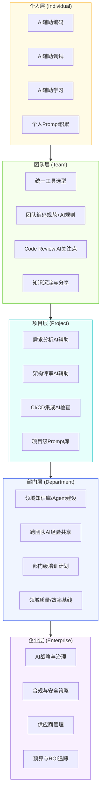

# 第10章 企业 AI 落地方法论

## 10.1 本章要解决的问题

前面几章我们讲的是你一个人怎么用 AI：怎么调 prompt、怎么搭工作流、怎么写 agent。但企业的现实是：你自己用得再溜，回到公司发现同事还在手写 boilerplate、产品经理还在 Word 里画线框图、测试还在手工点页面。你的效率提升在企业层面被稀释到接近于零。

这一章要解决的问题很直接：**从"我会用 AI"到"我的团队会用 AI"再到"公司能用好 AI"，这条路怎么走。**

读完这一章你会拿到一套完整的落地框架：知道从哪开始、怎么选第一个项目、怎么让老板掏钱、怎么让同事不抵触、怎么在银行这种强监管环境里也能推进。

这不是理论。这些方法论来自过去两年在一线推动 AI 落地的实际踩坑经验。有些坑我自己踩过，有些是看着别人踩的。好的做法和失败的做法都会讲。

---

## 10.2 企业为什么很难真正用好 AI

先泼一盆冷水：大多数企业的 AI 实践，停留在"买了几个 Copilot 授权，偶尔有同事用它写几行代码补全"的水平。这不是 AI 落地，这是 AI 过家家。

真正让企业用好 AI 的障碍，技术层面其实只占 20%，剩下的 80% 是人、流程、组织的阻抗。逐个来看。

### 10.2.1 管理层不理解

这是最致命的瓶颈，没有之一。

决策层对 AI 的认知通常两极分化：要么是"AI 就是 ChatGPT，不就是个聊天机器人嘛，跟用 Google 差不多"，要么是"AI 要取代程序员了，我们是不是不用招人了"。两个极端都是错的，但都导致同一个结果——不投入资源。

**典型症状**：
- 觉得买几个工具账号就算"拥抱 AI 了"
- 要求三个月内看到"AI 带来的效率提升百分比"，但不愿意给时间做真正的流程改造
- 把 AI 当成 IT 部门的事，认为和技术 Leader 聊一下就完了，不认为这是需要顶层设计的事

**怎么破**：不要讲概念，拿数据说话。找一个和你关系好的同事，用一周时间做一个对照实验：同一个任务（比如一个 CRUD 模块的开发），一份人写、一份 AI 辅助写，把时间、质量、bug 数量都记录下来。把结果扔给老板，比讲一百遍"AI 很重要"都管用。

### 10.2.2 团队抵制

程序员群体对 AI 的情绪是复杂的，我见过最典型的几种反应：

- **鄙视型**："AI 写的代码全是 bug，还不如自己写快"
- **恐惧型**："学这个是不是等于给自己掘墓"
- **漠不关心型**："反正现在工资照发，折腾这干嘛"
- **过度依赖型**："什么都要问 AI，失去了独立思考和调试能力"

前两种是正常的心理防御机制，后两种是管理问题。团队抵制不是靠讲道理能解决的，需要让每个人亲身感受到"AI 确实让我的活变少了，而不是让我的位置变没了"。

**关键认知**：团队抵制通常不是抵制 AI 本身，而是抵制"被改变"。人对未知的恐惧远大于对已知困难的忍耐。所以 AI 推进的核心不是技术推广，是**变革管理**。这个在 10.11 会详细讲。

### 10.2.3 缺乏规范

这是最普遍的中期问题。很多公司走过了"让大家试试"的阶段，然后发现每个人都各搞各的：

- 有人用 GitHub Copilot，有人用 Cursor，有人用 Claude Code，有人用通义灵码
- 有人把公司代码直接贴到公网 ChatGPT 里，有人把数据库表结构喂给 AI
- 同一个 prompt 指令，A 写出三层的 service，B 写出五层的 service，B 说 A 的不够严谨，A 说 B 的过度设计
- 代码审查的标准完全不知道怎么定——AI 写的代码要和人工代码一样标准吗？还是可以降低要求？

公司如果没人定规范，半年之后就会进入"每个人都觉得自己在用 AI，加在一起反而更混乱"的局面。

### 10.2.4 安全顾虑

这个顾虑是真实且合理的，特别是在强监管行业。几个典型场景：

- 代码被上传到海外 AI 服务商的服务器，算不算数据出境？
- 员工把内部架构文档贴到 ChatGPT 问问题，信息泄露谁负责？
- AI 生成的代码里会不会包含训练数据中的 GPL 协议代码，导致公司代码感染开源协议？
- AI 服务商的数据使用政策随时可能变，今天说不用你的数据训练，明天呢？

这些不是杞人忧天。在金融、银行、军工、政务领域，这些问题可以直接导致 AI 项目被安全部门一票否决。

### 10.2.5 ROI 不清晰

这是卡住预算的核心问题。

AI 的效率提升很难用传统的"投入-产出"模型衡量。你说 AI 让你写代码快了 30%，怎么证明？你跟去年同期对比吗？去年同期你做的项目和今年不一样。你跟不用 AI 的同事对比？人家能力不一样。你跑对照实验？实验环境不等于真实生产环境。

更麻烦的是，AI 真正的价值往往不在"写得快"，而在"想得更全面"——AI 提醒你考虑了一个你没想过的边界情况，避免了一个线上 bug，这个价值怎么量化？

### 10.2.6 工具选择混乱

2025-2026 年的 AI 工具市场是名副其实的百鬼夜行：每个季度都有新工具冒出来，每个都号称自己是"下一代编程范式"。团队 Leader 面临的决策压力是真实的——选错了工具，可能半年后该工具就停止维护或者被收购了。

更糟糕的是，有些公司允许每个人自己选工具，导致团队成员之间连协作都困难。A 在 Cursor 里写的 prompt 规则，B 在 Claude Code 里根本用不了，共享经验和 norms 的路径被切断。

### 10.2.7 没有懂的人推动

这是所有问题的放大器。

大部分传统企业的技术团队里，真正深入使用过 AI 辅助开发的不到 20%。这就意味着没有人能回答这些关键问题：

- 哪些场景适合用 AI，哪些反而不适合？
- 现有架构要不要因为 AI 做调整？
- 怎么评估团队里谁先用、谁后用？
- 出了风险（代码泄露、AI 幻觉导致的 bug 上线）怎么定责？

没有懂的人，上面的七个问题就没有人解。公司就会在"试试-发现有问题-算了别试了"的死循环里打转。

---

## 10.3 个人使用 AI 和组织使用 AI 的本质区别

很多技术 Leader 犯的第一个错误就是：以为把个人的 AI 使用经验复制到团队就行了。实际上这两者之间有本质差异。我用一张表格对比：

| 维度 | 个人使用 AI | 组织使用 AI |
|------|-----------|-----------|
| **目标** | 提高个人产出效率 | 提高团队整体交付能力和质量 |
| **工具选择** | 个人偏好，随意切换 | 需要统一标准，考虑团队兼容性 |
| **安全性** | 个人风险自担 | 公司承担风险，需要审慎评估 |
| **知识沉淀** | 脑子里或私人的 prompt 库 | 需要纳入团队知识管理体系 |
| **质量保障** | 自己 review，自己负责 | 需要代码审查规范，AI 生成代码的验收标准 |
| **成本模型** | 个人账号费，月付几十上百块钱 | 批量采购、API 调用量成本、培训成本、流程改造成本 |
| **效果衡量** | "我觉得快了" | 需要可量化或至少可论证的指标 |
| **失败影响** | 自己返工 | 影响项目周期、团队士气、甚至客户交付 |
| **推进重点** | 熟练度和技巧 | 规范制定、变革管理、持续运营 |
| **伦理/合规** | 基本不需要考虑 | 需要考虑代码版权、数据出境、行业合规 |

**核心观点**：个人使用 AI 是**技能问题**，组织使用 AI 是**工程问题加管理问题**。前者靠学习和练习，后者靠制度设计和流程建设。

---

## 10.4 如何从个人效率工具升级为团队工作流

升级路径不是一步到位的，大致分四个阶段：

### 阶段一：个人示范（1-2 个月）

找 1-2 个对 AI 有兴趣、技术不错的同事，形成"种子用户"。这几个人先深入使用 AI，验证哪些场景有效、哪些无效，积累可复制的经验。

**关键动作**：
- 记录每次 AI 辅助开发的实际用时和效果
- 整理有效的 prompt 模板和场景用法
- 积累"AI 确实好用"的案例，准备后续的推广素材

**不要做的事**：在这个阶段就要求全团队使用。种子还没发芽就要求所有人种田，只会招致反感。

### 阶段二：规范试点（2-4 个月）

选一个真实项目做试点（试点怎么选在 10.6 详细讲）。在这个项目里：

- 统一工具选型
- 制定团队的 AI 使用约定（什么能贴给 AI、什么不能）
- 建立代码审查中对 AI 生成代码的关注清单
- 记录试点数据，为扩大范围提供依据

### 阶段三：流程嵌入（1-3 个月）

把 AI 从"个人工具"变成"流程的一环"：

- 需求分析阶段：用 AI 做需求澄清和用例补全
- 设计阶段：用 AI 辅助架构方案评审、接口设计检查
- 编码阶段：统一编码辅助工具的配置和 prompt 规范
- 测试阶段：用 AI 生成测试用例和边界条件
- 文档阶段：用 AI 辅助生成 API 文档、变更说明

### 阶段四：持续运营（长期）

AI 工具和模型在快速迭代，团队的使用方式也需要持续演进。需要有一个**AI 实践负责人**（不一定是全职，可能是某个对 AI 有热情的资深开发兼任）持续做：

- 跟踪新工具和新模型的能力变化
- 更新团队的 AI 使用规范
- 收集团队反馈，调整策略
- 定期分享最佳实践和踩坑记录

**为什么不建议一步到位**：太快推进会触发组织的免疫反应。人的改变是有节奏的，组织的改变更有节奏。四个阶段的节奏可以加快，但不能跳过。

---

## 10.5 AI 落地分层架构

从实践角度，企业的 AI 能力建设应该分层推进，而不是一刀切。下面这张图描述了五层架构：



**每层的核心职责**：

- **个人层**：每个人掌握 AI 辅助开发的基本技能。这是最基础的一层，也是最先启动的一层。不需要管理层批准，你自己就可以开始。
- **团队层**：统一工具、统一规范、统一标准。这是承上启下的关键层，也是最容易被跳过的层。很多公司直接从个人跳到"公司采购一批 Copilot 账号"，跳过了团队规范的制定，结果就是乱。
- **项目层**：把 AI 的能力嵌入到项目研发流程中，让 AI 不是"额外做的事情"，而是流程的自然组成部分。
- **部门层**：多个团队之间共享经验，建立领域知识库，避免每个团队重复踩同样的坑。
- **企业层**：定大方向、管合规、管供应商、管预算。这层不需要一开始就建好，但在金融、银行等行业，尽早建立合规框架可以避免后期推倒重来。

**一个重要认知**：下面的层不稳固，上面的层就是空中楼阁。个人层没准备好就推团队层，只会引起反感和混乱。同样，团队层没有跑通就不要着急让公司采购全员工具。分层推进，逐层验证。

---

## 10.6 如何做试点项目

试点项目是决定 AI 在你这能否落地的关键战役。选对了，数据好看，后续推进水到渠成。选错了，浪费三个月，管理层说"AI 也不怎么样嘛"，后续难度翻倍。

### 10.6.1 选什么项目：四象限法则

用两个维度来评估候选项目：

- **业务价值**（纵轴）：对这个项目使用 AI，能带来多大可感知的收益
- **技术适配度**（横轴）：这个项目的技术特征多适合用 AI

```
        业务价值高
            ↑
    ②变革型   │   ①甜点型
   (慎选)     │   (首选)
            │
  ──────────┼──────────→ 技术适配度高
            │
   ④别碰     │   ③练手型
            │   (备选)
            ↓
        业务价值低
```

**①甜点型（首选试点）**：高价值 + 高适配。典型特征：CRUD 密集的模块、标准化的接口开发、模板化的报表生成、重复度高的代码迁移。这种项目用 AI 效果立竿见影，而且因为价值高，即使投入不算少也能轻松收回成本。

**②变革型（第二选择，但需谨慎）**：高价值 + 低适配。典型特征：老旧系统的重构、复杂业务逻辑的梳理。虽然价值大，但 AI 适配度低意味着你可能需要大量人工干预，试点周期被拉长，失败风险增大。选这类项目的条件是团队已经有比较强的 AI 使用能力和足够的耐心。

**③练手型（备选）**：低价值 + 高适配。典型特征：内部工具开发、非核心的脚本和自动化。适合让刚接触 AI 的同事练手，风险低，失败了影响不大。但不要用这类项目去跟管理层要预算。

**④别碰**：低价值 + 低适配。浪费时间。

### 10.6.2 多大规模

试点项目的时间周期建议控制在**3-6 周内、2-4 个人的团队**。

先说为什么不能太大：超过 6 周的项目意味着你无法快速验证，管理层会失去耐心。超过 4 个人的团队意味着协调成本急剧上升，而且很难判断是 AI 在起作用还是团队本身就在产出。

为什么不能太小：1 个人 1 周的项目即使成功了，也不具备说服力。管理层会认为"你这个太特殊了，换一个场景就不一定了"。

### 10.6.3 如何评估

试点项目的评估需要设计**前测和后测**：

**启动前记录基线**：
- 类似规模和复杂度的历史项目用时
- 团队当前的代码审查反馈周期
- 团队当前的千行代码缺陷密度（如果你们有统计的话）
- 团队成员的满意度 / 加班频率

**试点结束后对比**：
- 实际用时 vs 基线用时
- AI 生成代码占比和通过 Code Review 的比例
- 团队成员的体验反馈（主观但重要）
- 出现了哪些问题（不要回避，如实记录）

**一个诚实的建议**：评估报告里不要只说好处。你把问题和风险也写进去，反而会增强可信度。管理层不傻，一个全是优点的报告没人信。一份诚实的"试点效果显著提升 25%，但也暴露了代码审查流程需要调整和 2 个安全顾虑"的报告，远比"AI 提升效率 50%"更有可能获得后续支持。

---

## 10.7 如何选择适合 AI 改造的业务场景

不是所有场景都适合用 AI。选错场景比不用 AI 更糟糕——效率没提升还浪费了大家的时间和信任。

### 适合 AI 的场景特征

**强适合**：
- **模板化工作**：比如根据数据模型生成标准的 CRUD 代码、DTO 转换代码、单元测试骨架
- **翻译/迁移类**：比如从旧框架迁移到新框架、从一种语言翻译到另一种语言、数据格式转换
- **文档生成**：API 文档、变更记录、发版说明、技术方案说明
- **代码审查辅助**：检查明显的逻辑漏洞、安全风险、代码规范违反
- **重复度高的任务**：生成测试数据、写数据校验规则、批量添加日志

**弱适合（边际收益递减）**：
- **高度创新的架构设计**：AI 只能给你常见模式，真创新的架构它帮不上忙
- **强业务耦合的复杂逻辑**：AI 不理解你们的业务上下文，生成的代码需要对业务有深入理解才能验证
- **涉及大量遗留系统隐式约定的场景**：你们系统里那些"这段代码不能动，动了那个模块就崩"的知识，AI 不知道

### 场景评判清单

问自己三个问题：
1. 这个任务的主要难点在"怎么写"还是在"写什么"？如果是前者，AI 能帮忙。如果是后者（需要大量业务理解和判断），AI 帮不上大忙。
2. 这个任务的输入和输出是否明确？越明确，AI 效果越好。
3. 验证 AI 输出的成本是否远低于自己写的成本？如果验证比手写还累，就别用 AI。

---

## 10.8 如何评估 ROI

坦率地说，AI 辅助开发的 ROI 很难精确量化。但你不能因此就不做评估——你需要一个足够说服管理层的方法。

### 推荐的评估框架：三层递进

**第一层：时间节省（最直接的指标）**

计算方式：取试点项目中可对比的任务类型，记录 AI 辅助下的实际用时，对比历史数据或对照组。

例如：

| 任务类型 | 历史平均用时 | AI辅助用时 | 时间节省 | 说明 |
|---------|------------|-----------|---------|------|
| 新增CRUD模块（含Controller+Service+DAO+DTO） | 6小时 | 3.5小时 | 42% | AI生成骨架代码，人工处理业务逻辑和边界检查 |
| 单元测试编写 | 2小时 | 0.8小时 | 60% | AI生成测试用例框架，人工补充业务边界 |
| API文档编写 | 1.5小时 | 0.5小时 | 67% | AI根据代码生成文档初稿 |

**第二层：质量提升（间接但重要的指标）**

- AI 辅助 Code Review 发现的潜在 bug 数量（这些在人工 Review 时被遗漏了）
- AI 生成的测试用例覆盖的分支数对比人工编写的覆盖数
- 上线后缺陷密度的变化趋势（需要 3-6 个月的数据才有意义）

**第三层：组织效能（长期指标）**

- 新成员熟悉项目的时间是否缩短（因为有 AI 生成的更完整的文档）
- 技术债务积累速度是否降低
- 团队成员的工作满意度变化（加班是否减少）

### 算 ROI 时的诚实提醒

不要在 ROI 计算里"作弊"。我见过一些报告把 AI 的贡献和其他因素混在一起：

- "我们用了 AI 之后交付效率提升 50%"，实际上同期团队从 3 人扩充到了 5 人
- "AI 帮助减少了 80% 的 bug"，实际上同期引入了更严格的 Code Review 流程

把 AI 的贡献和流程改进的贡献分开讲清楚，你的结论才有说服力。管理层可能不懂技术，但对数字的游戏他们比你敏感。

---

## 10.9 如何做培训

AI 技能培训的最大陷阱是一刀切：给全公司安排同一场"AI 工具使用培训"，然后指望效果。结果就是有人觉得太浅、有人觉得听不懂、有人听完没地方用。

### 分层培训计划

**L1：全员认知培训（1-2 小时）**

目标：让所有人理解 AI 辅助开发是什么、不是什么、能做什么、不能做什么、有哪些风险。

内容：
- AI 编程工具的基本原理（消除"AI 很神秘"的误解）
- 真实的效率提升案例和局限案例
- 安全边界和红线（什么绝对不能贴给 AI）
- 公司的 AI 使用规范和合规要求

**L2：开发人员技能培训（3-5 天，分阶段）**

第一天：工具上手和基本使用
- 选定工具的基本操作
- 常用 prompt 模式和技巧
- 实操作业：完成 3-5 个典型编码任务

第二天：进阶技巧
- 代码上下文管理
- 多文件修改策略
- 调试和错误处理中如何使用 AI

第三天：质量与安全
- 如何 Review AI 生成的代码
- 常见 AI 生成的陷阱和幻觉识别
- 安全敏感场景的处理

第四天：团队协作
- 团队统一的编码规范如何与 AI 结合
- 共享 prompt 模板和工作流
- 实际项目模拟：用 AI 协作完成一个小功能

第五天：复盘和认证
- 每人展示一个 AI 辅助完成的任务
- 团队讨论踩坑经验和最佳实践
- 内部技能认证（可选：作为后续评审 AI 代码资格的参考）

**L3：AI Champion 培养（长期）**

从每个团队挑选 1-2 名对 AI 有热情且有能力的成员，作为团队的 AI Champion。

额外培训内容：
- 新工具和模型的跟踪与评估方法
- Prompt Engineering 进阶
- Agent 和工作流的搭建
- 如何在团队内部推广 AI 使用

AI Champion 的职责不是"帮别人写 prompt"，而是作为团队内部的"种子"，带着周围同事一起用起来。

### 培训的一个核心原则

**培训不能脱离实际工作**。不要在培训教室讲三天理论。最好的培训模式是"边做边学"：选一个团队当前的真实任务，在培训中用 AI 实际完成它。学员看完示范后自己上手做一遍，效果远超听十节理论课。

---

## 10.10 如何制定规范（AI 使用规范模板）

没有规范的 AI 使用等于没有制动系统的汽车，短距离内可能跑得快，但迟早出事故。

以下是一个可直接参考的规范模板，根据你的团队情况调整：

---

**《AI 辅助开发使用规范 v1.0》**

### 一、适用范围

本规范适用于团队所有成员在使用 AI 辅助工具（包括但不限于 Claude Code、GitHub Copilot、Cursor、ChatGPT、通义灵码等）进行开发活动时的行为准则。

### 二、工具选择

1. 团队统一使用 **[指定工具名称]** 作为主要 AI 辅助开发工具。
2. 如需使用其他工具，需提前向 AI 实践负责人报备并说明理由。
3. 禁止在未经批准的公开 AI 服务中输入以下信息：
   - 生产环境的数据库连接信息（host、port、用户名、密码）
   - API 密钥、Token、证书等凭证类信息
   - 客户真实数据（包括脱敏后仍可关联到具体客户的数据）
   - 公司内部系统的网络拓扑、IP 地址等基础设施信息

### 三、可输入内容指引

| 信息类型 | 是否可输入 | 说明 |
|---------|-----------|------|
| 公开的开源框架/库的代码片段 | 可以 | 本来就是公开信息 |
| 业务无关的通用技术问题 | 可以 | 例如：如何配置 Spring Boot 的连接池 |
| 脱敏后的表结构（不含数据） | 谨慎 | 建议抽象化字段名后使用 |
| 脱敏后的业务逻辑描述 | 谨慎 | 隐藏公司和客户特定信息 |
| 公司内部框架/工具的具体实现代码 | 禁止 | 除非使用本地部署的模型 |

### 四、AI 生成代码的验收标准

1. AI 生成的代码**必须**经过 Code Review，与人工编写的代码采用同等标准。
2. AI 生成的代码**必须**经过编译通过和单元测试验证。
3. 对于 AI 直接生成的完整代码块（超过 20 行），建议在 Code Review 时注明来源，便于审查者重点关注。
4. 以下情况禁止直接使用 AI 生成的代码：
   - 涉及金额计算、资金流转的代码
   - 涉及权限校验、安全控制的代码
   - 涉及数据加密、脱敏逻辑的代码
   - 涉及多线程并发控制的关键代码

### 五、Prompt 管理

1. 有效的项目级 prompt 模板应提交到团队的 `prompts/` 目录下进行版本管理。
2. 禁止在 prompt 中硬编码环境相关的配置信息。
3. 团队定期（建议每月）回顾和优化共享的 prompt 库。

### 六、安全与合规

1. 使用外部 AI 服务时，确保已与供应商签署数据处理协议（DPA）。
2. 定期审查 AI 工具的数据使用政策变更。
3. 如发现任何信息泄露风险，立即向安全负责人报告。

### 七、违规处理

违反本规范的行为将根据情节严重程度给予口头提醒、书面警告或暂停 AI 工具使用权限等处理。

---

**说明**：以上模板是一个起点，不是终点。随着团队实践深入，规范需要持续迭代。关键原则是**边界清晰、可操作、可检查**。规范写成"请大家注意安全"等于没写。

---

## 10.11 如何推进团队接受 AI（变革管理）

技术推广的本质是变革管理。光有好工具、好规范是不够的——需要让人愿意用、用得上、用得好。

### 理解团队成员的不同阶段

在 AI 采纳的曲线上，你的团队成员大致分布如下：

- **先行者（约 10%）**：已经在深度使用，甚至比你用得还深。这些人不需要你推，需要你给他们空间和资源。
- **早期追随者（约 20%）**：有兴趣但不知道从哪开始，或者担心用不好。给他们一个简单的切入点，一两次成功体验后就会自发使用。
- **早期大众（约 30%）**：持观望态度，等别人试过了觉得好再上。需要你提供证据和案例。
- **晚期大众（约 25%）**：抵触改变，只有看到身边大多数人都在用才会考虑。需要的是社会压力和制度推动。
- **落后者（约 15%）**：坚决抵制。说实话，不要花太多精力在这部分人身上。你的精力应该放在前三个群体。

**核心策略**：不要试图说服所有人。聚焦先行者和早期追随者，让他们产生真实的效率提升和好的口碑。当中间的大众看到身边同事确实受益了，他们的抵触会自然减弱。

### 推进的具体策略

**"拉"而非"推"**：
不要说"从下个月开始，所有人必须使用 AI 辅助开发"。这句话一出口，抵触情绪就起来了。改为"下周我们做一个 AI 辅助开发的分享，小张会演示他是怎么用 AI 把测试用例的编写时间缩短了一半，感兴趣的来听"。让受益的人去影响身边的人，比你下命令有效十倍。

**降低首次使用的门槛**：
准备 3-5 个"十分钟上手"的任务场景。不是让新人读一百页文档，而是让他用 AI 完成一个真实的、有成就感的小任务。成功体验是最好的推广手段。

**承认局限，不要神话 AI**：
如果你只讲 AI 有多厉害，一旦同事发现 AI 也会写 bug，你的公信力就没了。直接说清楚："AI 不是万能的，它写的代码需要 Review，它有时候会有幻觉，它在某些场景下效果不好。但在这些特定场景下，它确实能节省你大量时间。"诚实的介绍比夸大的宣传更有说服力。

**给大家一个"退路"**：
试点阶段明确说"这是一次尝试，如果效果不好就调整"。没有人愿意被绑在一辆不知道开往哪里的车上。允许试错、允许调整，反而能降低防御心理。

---

## 10.12 特殊场景注意事项

通用方法论在不同行业落地时有不同的侧重点。这里重点讲四个最典型的场景。

### 10.12.1 银行 / 金融行业

金融行业的 AI 落地，核心矛盾是：**效率提升的渴望 vs 合规安全的铁墙**。

**数据安全是第一红线**：

代码不出公司网络是基本要求，不是可选项。需要区分不同风险等级的场景：

- **高风险场景**（涉及核心系统、交易数据）：只允许使用本地部署的模型或严格审批的私有化部署服务。
- **中风险场景**（非核心系统开发、内部工具）：可以使用经安全评估的 SaaS 服务，但需要做数据脱敏处理。
- **低风险场景**（学习研究、开源代码分析）：相对灵活，但仍需遵守公司安全策略。

**合规审计是第一考虑**：

银行开发有一个被外部开发者经常低估的要素：什么东西都要能追溯。

- AI 使用记录需要可审计：哪个人、什么时间、用哪个工具、输入了什么类型的 prompt（不必记录具体内容，但需记录使用行为）
- AI 生成代码需要标注：在版本控制中可以识别出 AI 生成的代码段，便于后续的合规审查
- 供应商需要进入银行的供应商管理体系：不是随便注册一个账号就能用的

**推进策略**：

在银行推进 AI，不要从业务系统入手。**从内部工具和内控系统开始**。这些系统：
- 数据敏感度相对低
- 出问题影响范围可控
- 可以作为向安全部门证明"AI 可以安全使用"的案例

当你在非核心系统上跑通了完整的"安全-合规-效率"闭环后，再逐步向核心系统外围渗透。

### 10.12.2 外包行业

外包行业有其独特的痛点，AI 的切入点和价值点也和自有产品开发不同。

**最大的威胁**：如果 AI 让开发效率提升 40%，外包公司是不是只需要 60% 的人？客户会不会要求降价？

这个顾虑很真实。但更值得担心的是：**如果你的竞争对手用了 AI，而你没用**。价格劣势会让你先丢掉项目，然后才轮到人员结构的问题。

**实际的价值点**：

1. **知识沉淀**：外包最怕的是核心开发离职把知识带走了。AI 辅助生成的文档、注释、测试用例能大幅降低知识丢失的风险。以前人走了只留下一堆代码，现在至少代码里有关键逻辑的说明和测试。

2. **质量基线**：外包项目中大量的中低级开发者需要产出可交付的代码质量。AI 可以作为"自动导师"，帮助经验不足的开发者写出符合基本质量标准的代码。这意味着你可以用更少的资深开发去带更多的初中级开发。

3. **交接效率**：外包项目的交接周期一直是成本大头。AI 辅助生成的文档和知识库能显著缩短交接时间。

**代码所有权问题**：

这是外包行业最需要关注的法律问题之一。需要明确：
- 交付给客户的代码中，AI 生成部分的知识产权归属
- 使用外部 AI 工具是否违反了与客户签署的保密协议
- 是否需要在合同中增加 AI 使用相关的条款

**建议**：如果你的外包合同中没有关于 AI 使用工具的条款，现在是时候增加了。明确告知客户你会使用 AI 辅助工具但不会将客户代码上传到第三方服务，或承诺使用本地化部署方案。这不仅是法律保护，也是一种竞争差异——"我们有 AI 加持的质量保障流程"可以成为提案时的加分项。

### 10.12.3 传统企业（制造业、服务业等非互联网）

传统企业的 IT 团队通常不是核心利润部门，他们的痛点是**资源少、任务杂、技术要求分散**。

**特点**：
- 团队规模小（可能就三五个人），但要维护 ERP、OA、MES 等多套系统
- 技术栈老旧，大量的是"只要能跑就不要动"的系统
- 没有专门的架构师或技术 Leader，技术决策往往由业务人员兼任

**切入点**：
- 最适合的场景是**自动化脚本和维护任务**。数据库查询优化、日志分析、报表生成、数据迁移脚本——这些杂活占用了这类团队大量的时间，而 AI 在这方面效果非常显著。
- 不要想着引入复杂的 AI 工作流或 Agent。先让 AI 帮团队把日常最费时的琐事干掉，释放出时间。有时间了，他们才能去想"怎么优化架构"。

### 10.12.4 代码版权与所有权问题

这不仅是外包行业的问题，是每个使用 AI 辅助开发的企业都需要面对的法律灰色地带。

**目前（2026 年）的现实**：全球范围内没有明确的立法规定 AI 生成代码的版权归属。不同 AI 服务商的服务条款不尽相同，且随时可能变化。

**实用建议**：

1. AI 生成的代码**不要直接整块复制进核心产品代码**。让 AI 生成思路、框架、片段，然后人工理解、改写、整合。这样即使有版权争议，最终代码的主体是人类完成的工作。

2. 关注你使用的 AI 工具的服务条款中关于"训练数据使用"和"生成内容权利"的条款。有些工具明确声明不对生成内容的版权做任何保证。

3. 如果你们的代码有开源计划，特别注意 AI 生成代码中是否可能混入了 GPL/LGPL/AGPL 等具有"传染性"的许可证代码。这不是空穴来风——已经有公开案例显示 AI 工具在特定 prompt 下复现了训练数据中的 GPL 代码。

4. 保险的做法：在公司内部建立一个清单，记录哪些代码模块主要使用 AI 辅助生成，便于未来如果出现法律问题可以追溯。

---

## 10.13 常见误区

以下是我见过最多的十个错误认知：

**误区一："买了 AI 工具就等于落地了"**

落地 = 工具 + 规范 + 培训 + 验收标准 + 持续运营。买工具只是 1% 的工作。

**误区二："全公司统一推进，一个都不能少"**

让所有人同时用 = 让所有人同时产生意见 = 管理灾难。分层、分批、分场景推进。

**误区三："AI 生成的代码还需要 Review？那不跟自己写一样慢？"**

Review AI 代码和 Review 人写代码的侧重点不同：AI 代码你不需要检查代码风格和格式（AI 通常很规范），但你需要重点检查逻辑正确性、边界条件、安全隐患。Review 时间是比自己写短很多的。

**误区四："大模型只会越来越强，等它再强一点我们再用"**

等待的成本远高于上手的成本。AI 能力在进步，使用 AI 的经验也需要积累。等你想"可以用了"，你的竞争对手已经用了一年了。

**误区五："AI 是来替代程序员的"**

替代的不是程序员，是不会用 AI 的程序员。这个区别很重要，因为前者导向恐惧，后者导向行动。

**误区六："把公司内部框架文档全喂给 AI，这样它就能理解我们系统了"**

这是一个危险的做法。除非你用的是完全本地部署的模型，否则你的内部框架文档现在可能已经在某个海外服务器上了。

**误区七："用 AI 之后代码质量自然会提高"**

AI 可以提高某些维度的质量（规范性、完整性），也可能降低另一些维度（过度工程、不合理的抽象、幻觉代码）。质量提升不是自动的，需要配套的规范和实践。

**误区八："AI 落地是技术团队的事，跟业务部门没关系"**

AI 辅助的范围应该覆盖整个软件交付链。需求阶段没用好 AI，编码阶段再强也弥补不了需求模糊带来的返工。

**误区九："我们做一套完整的 AI 落地规划，六个月后全面铺开"**

在快速变化的 AI 领域，六个月的规划可能等你写完就过期了。做短周期的滚动规划，每 4-6 周回顾和调整。

**误区十："试点项目效果好就成功了"**

试点成功只说明在这个项目、这个团队、这个场景下 AI 有效。推广到其他项目和团队需要完全不同的能力（培训能力、规范建设能力、变革管理能力）。不要把试点成功当作落地成功。

---

## 10.14 本章小结

企业 AI 落地不是技术问题，是管理问题加工程问题加人性问题。

五个核心结论，你可以直接拿去用：

1. **先解决人，再解决流程，最后选工具**。大多数公司做反了：先买个工具账号，然后发现没人用，然后追问怎么回事。

2. **分层推进，逐层验证**。个人层不稳固就往上推，必然倒塌。

3. **第一个试点项目选甜点型**。高价值高适配，3-6 周出结果，有数据有案例，才能获得进一步推进的资本。

4. **诚实比完美重要**。跟管理层讲清楚 AI 能做什么、不能做什么、有什么风险。过度包装反而降低可信度。

5. **AI 落地不是一次性项目，是持续运营**。需要有专人负责、有规范迭代、有知识沉淀。没有"做完"的一天，只有"做得越来越好"的过程。

---

## 10.15 实战练习

### 练习一：试点项目选型

在你的当前工作中，列出 5 个候选任务/项目。用本章的四象限法则，把它们填入坐标系中，找出你的甜点型项目。对于你选出的甜点型项目，估算 AI 辅助和纯人工开发的时间对比。

### 练习二：AI 使用规范起草

基于 10.10 的规范模板，起草一份适合你当前团队（或假设的团队）的 AI 使用规范。规定：
- 允许使用的工具
- 禁止输入的信息类型（至少列出 5 种）
- AI 生成代码的验收标准（至少 3 条可检查的标准）

### 练习三：培训计划设计

假设你的团队有 8 名开发人员：2 名已经深度使用 AI，3 名有些了解但没深入用过，3 名完全没用过。设计一个为期 2 周的培训计划，说明每周的内容、形式和预期产出。

### 练习四：变革阻力分析

分析你当前团队中，哪些因素是推进 AI 的最大阻力？给每个因素打一个"影响程度"（1-10），然后针对影响度最高的 3 个因素，分别写出你能采取的具体应对行动。

### 练习五：ROI 估算

在你当前工作中选一个你熟悉的任务类型，记录你自己用 AI 辅助完成一次的实际用时。然后估算如果没有 AI，这个任务需要多长时间。用 10.8 的三层框架，为这个任务写一份简单的 ROI 分析。

---

## 10.16 自测问题

1. 个人使用 AI 和组织使用 AI 在"安全"维度上的核心区别是什么？
2. AI 落地五层架构中，为什么团队层是"承上启下的关键层"？
3. 一个项目是"高业务价值、低技术适配度"，按照四象限法则属于哪一类？这类项目作为试点的风险是什么？
4. 为什么试点项目的团队规模建议控制在 2-4 人？
5. 在银行/金融行业推进 AI 落地，为什么建议从内部工具和内控系统入手？
6. AI 生成的代码也需要 Code Review，但 Review 的侧重点和人工代码有什么不同？
7. "AI 落地是技术团队的事，跟业务部门没关系"为什么是误区？
8. 如果团队中有人强烈抵制使用 AI 辅助开发，你作为推进者应该怎么做？（提示：参考变革管理中的不同群体策略）
9. 列出至少 3 种绝对不能贴到外部 AI 工具中的信息类型。
10. 外包行业使用 AI 辅助开发时，需要在合同中增加什么特别条款？

---

*写完这一章，你应该已经有一套完整的企业 AI 落地方法论了。但这套方法论是骨架——真正让它有血肉的，是你在实际中一次次的尝试、调整和复盘。下一章开始，我们会深入到具体的工程实践，看看如何在真实项目中最大化 AI 的价值。*
