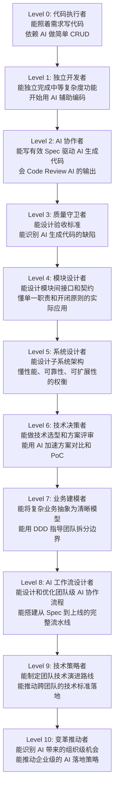

# 第 11 章 未来展望：程序员的下一步

## 11.1 本章要解决的问题

前面十章我们讲了 AI 时代程序员的具体工作方法：怎么用 Claude Code、怎么设计 Prompt、怎么做 Spec-Driven Development、怎么搭建 AI 工作流。这些是「今天就能用」的东西。

这一章换个角度：往远看 3 到 5 年，程序员的职业会发生什么变化？如果你现在是一个工作十年的 Java 后端，面对 AI 的冲击，应该往哪个方向积累？哪些能力会贬值，哪些能力会升值？

读完这一章，你应该能回答三个问题：

1. 我会不会被 AI 取代？
2. 如果不会，我需要变成什么样的人？
3. 从今天开始，我应该练什么？

这不是科幻畅想，也不是贩卖焦虑。以下所有判断基于一个前提：AI 是工具，不是神。它的能力边界清晰可见，只要你见过足够多的真实项目，就能推演出它做不到什么。

---

## 11.2 未来 3 到 5 年，程序员的工作方式会怎么变

先说结论：**程序员不会消失，但「写代码」这件事在工作的占比会持续下降。** 从 80% 降到 40%，再降到 20%。剩下的时间花在哪里？花在「决定写什么」和「验证写得对不对」上。

具体来说，以下变化已经在发生，3 到 5 年内会成为常态：

### 变化一：从「写代码」到「描述意图」

今天你用 Claude Code 写一个 Spring Boot 接口，大概率不是从 `@RestController` 开始手敲，而是用自然语言描述需求，让 AI 生成第一版，然后你审查、调整、补全。

三年后这个流程会更极端：你可能不再关心某个 Service 类的具体实现，你关心的是「这个接口的业务语义对不对」「边界条件有没有遗漏」「异常路径有没有覆盖」。代码本身变成中间产物，就像今天的字节码——你知道它存在，但你不会逐行去读。

### 变化二：从「调试代码」到「调试规格」

现在你花大量时间调试：为什么这个 NPE 没拦住？为什么这个事务没回滚？三年后，AI 生成的代码质量会大幅提升，这类低级 Bug 会急剧减少。但你会有新的调试对象：**规格本身**。

你发现系统行为不符合预期，排查到最后，不是代码写错了，而是你的 Spec 写漏了——你忘记定义「当用户余额不足且使用了优惠券时」的行为。调试点从代码层上移到规格层。

### 变化三：从「单人写代码」到「人+AI 协作流水线」

这不是说你会变成「AI 操作员」。恰恰相反，你的角色会更像**技术导演**：你决定这场戏的走向，AI 执行具体动作，你审核结果，给出调整指令。

举个例子。你今天做一个「订单超时取消」的功能，流程大概是：

1. 你在 Spec 里定义：超过 30 分钟未支付，订单自动取消，库存回滚
2. AI 生成代码：定时任务 + 状态机 + 补偿逻辑
3. 你审查：状态机是不是幂等的？补偿会不会重复扣库存？超时时间配在哪里？
4. AI 生成测试：正常取消、并发取消、部分退款、网络超时重试
5. 你审查测试覆盖：边缘情况有没有漏？

你写的代码行数变少了，但你做的**决策**变多了，每个决策的质量要求也更高了。

### 变化四：代码审查变成最重要的技能

当 AI 可以几秒钟生成几百行代码时，「会不会写」不再稀缺，「能不能判断好坏」才是稀缺能力。代码审查从「顺便看一眼」变成核心工作流——你的主要产出不是代码，而是对代码的判断。

---

## 11.3 自然语言会成为新的编程接口吗？

「以后编程就是跟 AI 说话」——这是最常见的一种简化叙事。真实情况要复杂得多。

### 自然语言的天然缺陷

自然语言编程有一个根本问题：**歧义**。你说「把这个列表排序」，是按时间排还是按金额排？升序还是降序？null 值放前面还是后面？如果列表里有重复元素，保持原有顺序还是任意？

这些歧义在人类对话中可以靠上下文消除，但在精确的软件工程中，每消除一个歧义，你就离「自然语言」远了一步，离「形式化规格」近了一步。

### 更可能的方向：受控自然语言 + 结构化规格

我个人判断，3 到 5 年内「纯自然语言编程」不会成为主流。更现实的路径是：

- **Spec 文档用结构化自然语言写**，而不是代码。比如 Gherkin 语法的 Given-When-Then，或者更灵活但仍有格式约束的 Markdown 模板
- **AI 负责从 Spec 到代码的翻译**，人负责确认翻译是否正确
- **关键逻辑仍然需要精确描述**，精确到「如果这个值是 null，跳过这一行，不要报错」

换句话说，编程接口会**上移一层抽象**，但不会变成「随便说说就行」的东西。英语也不会取代编程语言——它只是规格描述的工具之一，就像今天你用中文写技术方案，用 Java 实现一样。

---

## 11.4 程序员还需要懂代码吗？

需要。但「懂代码」的定义变了。

### 不再需要懂的

- 某个框架 API 的精确参数顺序（AI 可以随时查）
- 某个配置项的完整拼写（`spring.datasource.hikari.maximum-pool-size` 这种东西，让 AI 去记）
- 某个设计模式的样板代码（让 AI 去套模板）
- 某个工具类的所有方法签名

### 仍然需要懂的，而且比以往更重要

**第一，懂语义，而不是语法。** 你不需要记住 `CompletableFuture.allOf()` 的参数类型，但你必须知道：什么时候该用异步，异步的错误传播机制是什么，`allOf` 跟 `anyOf` 在业务上分别对应什么场景。语法可以查，语义必须在脑子里。

**第二，懂系统的运行原理。** GC 日志你看得懂吗？线程堆栈你能分析吗？数据库慢查询的执行计划你会读吗？无论 AI 怎么帮你写代码，线上出问题时，你得自己上去排查。AI 写出来的代码跑出问题了，你得能判断是哪一层的问题——是业务逻辑错了，还是代码没问题但系统资源不够。

**第三，懂代码的可维护性。** AI 生成的代码能跑，但不一定好维护。你能不能一眼看出这段代码的耦合太紧？能不能判断这个抽象层次不对？能不能识别出这段代码会成为未来的技术债？这些判断能力不会因为 AI 的到来而贬值。

### 一句话总结

过去「懂代码」是「能写出来」。以后「懂代码」是「能判断对错，能发现问题，能设计更好的结构」。写的能力外包给 AI，判断的能力留在自己手里。

---

## 11.5 为什么懂系统、懂业务、懂架构、懂验收的人更重要

回到开头的判断：写代码的时间占比下降，决策的时间占比上升。那么，什么样的决策最有价值？

### 懂系统

系统层面的决策一旦做错，修改成本极高。你选了一个不适合业务特点的数据库分片策略，半年后数据量上来才发现问题，重构的代价是重写一半代码。AI 可以帮你实现分片逻辑，但它不知道你的业务增长曲线，不知道你的团队维护能力，不知道你的预算约束。这些上下文只有人掌握。

### 懂业务

AI 生成代码的最大问题是：**它不理解业务上下文。** 你让它写一个「用户余额扣减」的逻辑，它会写出正确的代码。但它不知道你的业务里「余额」是不是实时扣减，还是先冻结再扣减。它不知道你们的财务规则要求在扣减失败时写入审计日志而不是静默跳过。它不知道这个接口在月底结账时需要特殊处理。

这些「不知道」的后果，不是代码报错，而是**业务数据出错**。代码跑得好好的，三个月后财务对不上账，你回头发现 AI 生成的逻辑在边界条件下少扣了一笔。这种 Bug，测试覆盖不到，Code Review 也未必能发现——因为它不是代码层面的错误，是业务语义层面的缺失。

### 懂架构

架构决策影响的是一个系统的天花板。选单体还是微服务？同步调用还是异步消息？强一致还是最终一致？这些决策没有标准答案，取决于具体的业务场景、团队规模、时间约束、运维能力。

AI 可以给你列出每种方案的优劣对比表，但它不能帮你做权衡，因为它不知道你的优先级。你更看重开发速度还是长期可维护性？你愿意在一致性上妥协到什么程度？这些问题只有人能做判断。

### 懂验收

当 AI 替你写代码时，你怎么知道它写对了？不是靠「看代码」，而是靠**定义验收标准**——什么样的输出算合格？边界条件有哪些？异常路径怎么验证？性能指标是多少？

验收不是测试，测试是验收的一种手段。验收是**对「什么算做完了」的精确定义**。这个能力在传统开发中是靠经验积累的隐性知识，在 AI 时代会变成显性的核心技能——因为你要把验收标准写给 AI，让它自己验证，而不是你自己一行行去验证。

---

## 11.6 程序员能力升级路线图

下面的 Mermaid 图展示了一个程序员从「纯执行」到「战略决策」的能力升级路径。Level 0 是刚入行只会照着需求写代码，Level 10 是能主导技术方向、推动组织变革。

### 怎么读这张图

- **Level 0-3 是 AI 时代的基础生存线。** 如果只停留在 Level 0（纯代码执行），三年内确实有被替代的风险。到达 Level 2（能有效使用 AI 协作），你就过了安全线。
- **Level 4-7 是传统高价值能力的升级版。** 模块设计、系统设计、技术决策、业务建模——这些能力在 AI 之前就很重要，但 AI 出现后，它们的**杠杆效应更大了**。一个 Level 7 的业务建模者借助 AI，可以产出以前需要一个小团队才能完成的交付量。
- **Level 8-10 是 AI 时代的新物种。** AI 工作流设计、组织级 AI 落地——这些是以前不存在或不需要的能力，现在变成了最稀缺的顶层技能。

对十年经验的 Java 后端来说，你现在大概率在 Level 4-6 之间。接下来的关键不是「学 AI」，而是用 AI 放大你已有的系统设计和业务理解能力，同时往上走，补业务建模和 AI 工作流设计。

---

## 11.7 AI 会替代哪些低价值工作

不用回避：AI 确实会替代一些工作内容。准确地说，它替代的不是「程序员」，而是程序员工作中的**低价值部分**。

### 重复 CRUD 编码

一个典型的 `UserController → UserService → UserRepository` 三层增删改查，手写大概需要 30 分钟，AI 生成只需要 30 秒。这不意味着做 CRUD 的程序员会失业，而是意味着**一个人能做更多套 CRUD**，需要的 CRUD 程序员总数会减少。

### 简单 Bug 修复

NPE 加判空、数组越界加边界检查、类型转换加 try-catch——这类机械修复 AI 做得比人快，而且不容易遗漏。但这里有一个关键限定词：**简单**。稍微复杂的 Bug，特别是涉及分布式状态、并发竞态、资源泄露的问题，AI 现在做得并不好，3 到 5 年内也很难追上人类专家的排查能力。

### 样板代码生成

DTO 和 Entity 之间的转换（`BeanUtils.copyProperties` 或 MapStruct）、Controller 的参数校验注解、MyBatis-Plus 的 Mapper XML——这些有固定模式的代码，AI 生成的质量已经很高了。属于明确会被替代的部分。

### 格式转换

JSON 转 XML、CSV 转 SQL、Proto 转 POJO——纯机械的格式转换工作，不仅是 AI，传统脚本也能做。AI 只是让这个过程更方便了。

### 简单测试编写

覆盖 happy path 的单元测试、简单的边界值测试、Mock 设置——AI 可以自动生成。但复杂场景的集成测试、需要构造特殊数据状态的测试、涉及多个微服务交互的端到端测试，仍然需要人来设计测试策略。

### 小结

这些被替代的工作有一个共同特征：**输入和输出之间有确定的映射关系**，不需要深度业务理解，不需要系统全局视角，不需要不确定条件下的权衡决策。如果你的日常工作中这些内容占据了 60% 以上，那确实需要考虑升级能力栈了。

---

## 11.8 AI 会放大哪些高价值能力

另一方面，AI 会**成倍放大**以下能力。拥有这些能力的人，借助 AI 的生产力会是普通程序员的 5 到 10 倍。

### 系统架构设计

架构师的瓶颈从来不是「画不出图」，而是「想不全所有影响因素」。AI 可以帮助你在短时间内列出更多候选方案、更完整的评估维度、更系统的风险清单。一个优秀的架构师 + AI，可以在一天内完成以前一周才能产出的方案对比。

具体来说：你可以把「业务量级、延迟要求、一致性要求、团队技能分布、预算上限」这些约束条件输入给 AI，让它帮你生成 3 种架构方案的对比分析，然后你基于自己的判断选择最优解和次优解，再让 AI 生成详细的设计文档。整个流程中，决策仍然是你做的，但信息收集和文档输出的时间压缩了 80%。

### 复杂业务建模

DDD（领域驱动设计）的落地一直有一个痛点：从业务专家那里获取知识之后，转化成代码模型的过程很慢。聚合根怎么划分？限界上下文怎么切？实体和值对象怎么区分？这些判断需要反复推敲。

AI 能做什么？你把业务描述（甚至是一段会议记录）给它，它能快速产出初版领域模型，包括聚合根、实体、值对象、领域事件。你不需要接受它的全部建议，但它能帮你快速看到一种可能的建模方式，然后你基于自己的业务理解去做调整。这个过程的价值在于：**把「从零开始思考」变成「在已有方案上修改」，速度提升显著。**

### 技术方案决策

技术选型（Redis 还是本地缓存？RabbitMQ 还是 Kafka？分库分表还是读写分离？）通常需要大量调研和对比。AI 可以帮你快速生成：

- 技术对比表（成熟度、社区活跃度、性能基准、学习成本）
- 适用场景分析（什么情况下用 A，什么情况下用 B）
- 潜在风险评估（该方案已知的坑和限制）

但最终决策仍然需要你来做，因为 AI 不知道你的团队能否驾驭 Kafka，不知道你的运维团队对 Redis Cluster 的熟悉程度，不知道你的项目有多少时间留给学习成本。

### 代码质量治理

单个模块的代码审查 AI 可以做，但跨模块的质量治理需要人来做。比如：

- 公司内部有没有重复造轮子？（同一个功能三个团队各写了一套）
- 公共组件的 API 设计是否合理？（易用性、一致性、向后兼容）
- 技术债的优先级怎么排？（哪个债先还能带来最大的开发效率提升）

这些问题的答案需要对全貌的理解，AI 可以作为分析工具帮你扫描代码库、生成统计报告，但判断力和推动力仍然靠人。

### 团队协作设计

AI 不能告诉你「你们团队的 Code Review 流程该怎么改」，也不能告诉你「前后端协作的契约应该以什么形式定义」。这些涉及人、流程、工具三者平衡的设计工作，需要对团队文化的深刻理解，是 AI 最不擅长的领域之一。

### AI 工作流设计

这是 AI 时代出现的新能力。具体包括：

- 设计团队的 Spec 模板（什么样的 Spec 能让 AI 生成更准确的代码）
- 设计 AI 辅助的 Code Review 流程（AI Review 第一轮，人 Review 第二轮）
- 搭建设计文档到代码到测试到部署的自动化流水线
- 制定团队级 Prompt 库和技能共享机制

这些相当于把 AI 从「个人工具」升级为「团队基础设施」，是 Level 8 的核心能力。

### 企业 AI 落地推动

更进一步：不只是工程团队用 AI，而是推动整个组织的 AI 采纳。包括：

- 识别哪些业务流程可以用 AI 优化（不只是写代码，还包括需求分析、测试管理、运维告警）
- 推动管理层接受 AI 友好的工作方式（如允许 Spec-Driven Development 取代传统需求文档）
- 搭建内部 AI 平台（统一模型访问、Prompt 管理、成本控制）

具备这种能力的人，在接下来几年会非常稀缺——因为它既需要技术深度（理解 AI 能做什么不能做什么），又需要组织推动力（能说服人改变工作方式）。

---

## 11.9 技能树规划：从今天开始练什么

以上分析落到行动上，就是四根技能树。

### 技术深度（保住基本盘）

AI 时代不意味着不用学底层了。相反，当 AI 帮你处理了表层代码之后，你更应该往深处走。

具体方向：

- **分布式系统**：一致性协议（Raft/Paxos）、分布式事务（Seata/Saga）、服务网格（还是那句话，AI 能帮你写配置，但不能帮你理解为什么丢消息、为什么脑裂）
- **性能优化**：JVM 调优（GC 日志分析、堆转储分析）、数据库性能（执行计划、索引策略、连接池调优）、缓存策略（穿透/击穿/雪崩的排查和处理）
- **安全架构**：OAuth2/OIDC 的深入理解（不只是配个 Spring Security）、API 安全（限流、幂等、防重放）、数据安全（脱敏、审计、加密）

判断标准：**如果某件事出了问题时 AI 也搞不定，这件事就应该在你的技能树里。**

### 业务理解（从代码走向领域）

技术十年之后，往上的增长空间大多在业务侧。

具体方向：

- **领域驱动设计（DDD）**：不是背概念，是真正在一个项目里落地过。怎么开 Event Storming 工作坊？怎么从业务事件推导出限界上下文？怎么做上下文映射？这些不是看书能学会的，要做过才知道。
- **业务流程建模**：能看懂业务流程图（BPMN），能跟业务方讨论流程优化的技术可行性，能把业务需求转译成技术团队能理解的结构化描述。

### AI 协作（新生产力）

这是 AI 时代独有的新技能树。

具体方向：

- **Context Engineering**：理解 AI 的工作机制（它需要什么信息才能产出高质量答案），学会设计上下文（System Prompt、Project Rules、Memory）。很多人以为 Prompt 就是一句话，实际上好的 Prompt 是一个精心设计的信息包——你喂给 AI 什么，决定了它吐出来什么。
- **Spec-Driven Development**：学会写可执行的规格。不是需求文档，是「精确到 AI 可以直接生成代码」的规格。包括业务规则、边界条件、异常路径、验收标准。
- **AI 工作流设计**：把 AI 从辅助编码工具升级为完整开发流程的一部分。你的目标不是「让 AI 替我写这个函数」，而是「让 AI 理解我的设计意图，生成代码并自测，我只用审查结果」。

### 软技能（放大器）

技术能力乘以软技能，才是最终的影响力。

具体方向：

- **技术写作**：能写出结构清晰、逻辑严密的设计文档。不是说 AI 不能帮你写，而是你得能判断 AI 写出来的质量。而且在推动事情的时候，一份自己写的、有深度分析的设计文档，说服力远强于 AI 生成的标准模板。
- **变革推动**：能识别组织中的痛点和改进机会，能设计落地方案（不是「我们应该用 AI」这种空话，而是「我们的 CRUD 接口开发流程可以改造成这样，预计节省 40% 时间」），能说服团队和管理层采纳。
- **团队培训**：能把自己学到的技能传授给团队。不是做 PPT 讲座，而是制定培训计划、设计练习项目、建立反馈循环。当你开始培训别人时，你自己的理解也会深化——教是最好的学。

---

## 11.10 常见误区

### 误区一：「以后不需要学编程了，AI 都能写」

这个误区的来源是：把自己做的事等价于「写代码」。如果你每天的工作就是写增删改查，那确实 AI 能写 90%。但这不叫「不需要学编程」，这叫「你之前的工作本身就在低价值区」。

只要软件开发还需要精确性、可靠性、可维护性，就必然需要懂编程的人。只是「懂」的层次从语法上移到了语义和架构上。

### 误区二：「AI 会取代所有程序员」

把「AI 可以写代码」直接推导为「AI 可以替代程序员」，跳过了中间最关键的一步：**软件开发的本质不是写代码，是解决问题。** 代码只是解决问题的手段之一。

AI 能解决什么问题？AI 擅长解决「问题定义清晰、解法已有先例」的问题——比如写一个标准 CRUD 接口。AI 不擅长解决「问题本身还需要定义」的问题——比如「我们这个老旧系统的性能瓶颈到底在哪里？在不大规模重写的前提下怎么优化？」这种问题需要调研、假设、验证、迭代，是人类专家的主场。

更准确的说法：**AI 不会取代程序员，但会取代「只会写代码」的程序员。会用 AI 的程序员，会取代不会用 AI 的程序员。** 这个差别不是未来时，而是现在进行时。

### 误区三：「只要学会 Prompt Engineering 就够了」

Prompt 写得好能让你用好当下的 AI 工具，但不能替代技术基础。当你审查 AI 生成的代码时，你看不出那个线程安全问题，不是因为 Prompt 没写好，而是因为你**不懂并发**。当你验收 AI 生成的系统设计时，你看不出那个单点故障，不是因为 Prompt 没写好，而是因为你**不懂高可用架构**。

Prompt Engineering 是放大器，但放大器不能放大零。

### 误区四：「我现在做的事情以后就没价值了，赶紧转行」

你的 Spring Boot 经验、你踩过的数据库坑、你处理过的生产事故、你跟产品经理吵过的架——所有这些都不会因为 AI 而失去价值。恰恰相反，这些经验会成为你使用 AI 的**差异化优势**。

一个没有实际项目经验的毕业生，给 AI 的 Prompt 可能是「帮我写一个用户登录模块」。一个有十年经验的你，给 AI 的 Prompt 会是「帮我写一个用户登录模块，需要支持手机号+验证码登录、微信 OAuth 登录、密码登录三种方式，密码需要加盐哈希存储，登录失败 5 次锁定 30 分钟，需要记录登录日志用于安全审计，Token 用 JWT，过期时间可配置，需要支持单设备登录和多设备登录的开关配置」。

差在哪里？差在你知道真实系统需要什么。这种知识来自经验，AI 抢不走。

### 误区五：「以后我们都会变成 AI 操作员，写代码能力会废掉」

这个担忧不无道理——如果你完全依赖 AI，自己不写也不复习，确实会退化。但这跟「用计算器会让人忘了怎么做算术」是同一类问题：工具在解放你的同时，也要求你有意识地去维护核心能力。

具体的做法：**AI 生成的代码，你要看懂。看不懂的部分，停下来学。** 让 AI 写不是你放弃学习的理由，反而是你学习更高层次知识的机会——因为你现在有时间学了。

---

## 11.11 本章小结

这一章我们聊了未来 3 到 5 年的变化方向。核心观点概括如下：

1. **程序员不会消失，但工作重心会从「写代码」转移到「决定写什么」和「验证写得对不对」。** 写代码的时间占比从 80% 降到 20%，决策和审查的时间升到 80%。

2. **自然语言不会取代编程语言。** 更可能的是「结构化规格 + AI 翻译成代码」的模式。你仍然需要精确思考，只是表达精确思考的工具从代码变成了更上层的形式。

3. **仍然需要懂代码，但「懂」的含义变了。** 不用记语法和 API，但必须懂语义、懂系统原理、懂可维护性。从「能写」变成「能判断」。

4. **懂系统、懂业务、懂架构、懂验收的人会更稀缺。** 当 AI 能处理执行层的工作时，决策层的价值被放大了——因为一个优秀的决策者 + AI，能撬动以前需要一个团队的生产力。

5. **AI 替代的是低价值工作（重复编码、简单 BugFix、样板代码），放大的是高价值能力（架构设计、业务建模、方案决策、工作流设计）。**

6. **技能树四个方向：技术深度（分布式/性能/安全）、业务理解（DDD/流程建模）、AI 协作（Context Engineering/SDD/工作流设计）、软技能（写作/变革推动/培训）。**

7. **最大的误区是「AI 会取代所有程序员」。** 真相是：会用 AI 的程序员取代不会用 AI 的程序员。你的经验不但不会贬值，反而会成为你使用 AI 的差异化优势。

最后，说一句务实的话：不用着急在 3 个月内转型成 AI 专家。这件事的窗口期有 3 到 5 年。你可以从容地从一个小点开始——比如先在当前项目里引入 Spec-Driven Development，用 Claude Code 写一个模块试一试，积累实际体感。能力的升级是渐进式积累，不是一夜之间的突变。但前提是：你现在就要开始。

---

## 11.12 实战练习

### 练习 1：技能审计

拿出一张纸或开一个 Markdown 文件，按以下四个维度给自己打分（1-10 分）：

| 维度 | 具体能力 | 你的自评 (1-10) |
|------|---------|----------------|
| 技术深度 | 分布式系统理解 | |
| 技术深度 | 性能优化实战 | |
| 技术深度 | 安全架构设计 | |
| 业务理解 | DDD 实践 | |
| 业务理解 | 业务流程建模 | |
| AI 协作 | Context Engineering | |
| AI 协作 | Spec-Driven Development | |
| AI 协作 | AI 工作流设计 | |
| 软技能 | 技术写作 | |
| 软技能 | 变革推动 | |
| 软技能 | 团队培训 | |

完成后，圈出分数最低的 2 项和与你当前工作最相关的 2 项。交集中的能力，就是你应该优先投入的方向。

### 练习 2：趋势推演

找一个你今天在工作中做的、比较重复性的任务（比如写一个标准 CRUD 接口），认真想一下：

1. 这个任务中有多少比例是纯执行（生成代码、写测试、写文档）？
2. 有多少比例是决策（设计接口、定义验收标准、评审代码）？
3. 3 年后，纯执行部分是否可能被 AI 完成？
4. 如果纯执行被 AI 完成，你在同一个任务中的价值会转移到哪里？

把这个分析写下来，500 字左右。

### 练习 3：尝试完整 Spec-Driven 流程

找一个你最近要做的小功能（不要太复杂，一个接口级别的就够了），尝试整个流程：

1. 用中文写一份 Spec，包括业务规则、输入输出、边界条件、异常路径、验收标准
2. 把 Spec 喂给 Claude Code 或 Codex，让它生成代码
3. 审查 AI 生成的代码：逻辑正确吗？遗漏了什么？代码质量如何？
4. 让 AI 生成测试代码，然后审查测试覆盖是否充分
5. 自己写总结：这个流程比你手写快了多少？质量是更高还是更低？哪里最不舒服？

---

## 11.13 自测问题

1. 未来 3 到 5 年，程序员的工作方式会发生哪四个主要变化？
2. 自然语言会成为新的编程接口吗？为什么？
3. AI 时代「懂代码」的含义发生了什么变化？哪些需要懂，哪些不需要？
4. 为什么懂系统、懂业务、懂架构、懂验收的人在 AI 时代更有价值？
5. 能力升级路线图中，Level 0 到 Level 10 分别代表什么？你目前在哪一级？
6. 列举 AI 会替代的 5 种低价值工作，并说明它们的共同特征。
7. 列举 AI 会放大的 7 种高价值能力，并从中选出对你当前工作最重要的 3 种。
8. 技能树规划的四个方向分别是什么？每个方向的具体内容有哪些？
9. 「AI 会取代所有程序员」这个说法为什么是错的？更准确的表述是什么？
10. 一个十年经验的 Java 后端程序员，为什么其经验在 AI 时代是优势而非负担？

---

*上一章：[第 10 章 - AI 时代的代码审查与质量保障](10-ai-code-review.md)*
*下一章：[第 12 章 - 总结与持续学习路线图](12-conclusion.md)*
