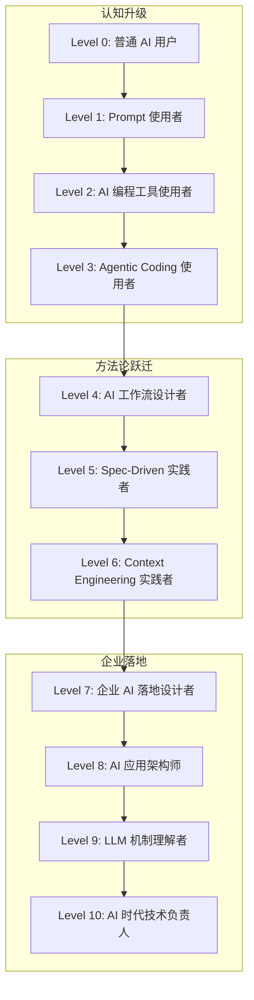

# 《AI 时代程序员成长路线图：从 LLM、Agent 到企业级 AI 工作流落地》

> 从「会用 AI 工具写代码」到「能设计 AI 工作流、制定 AI 落地方法论、帮助企业真正使用 AI 的技术负责人」。

---

## 一、教程总览

这是一套面向**已经在使用 Claude Code、Codex、ChatGPT、Gemini 等 AI 工具的程序员**的进阶教程。

它不同于：

- ❌ AI 科普教程（不讲「什么是 AI」）
- ❌ 大模型训练教程（不教你怎么训模型）
- ❌ 工具手册（不只介绍工具功能）
- ❌ 旧技术迁移指南（不讲 Struts2 转 Spring Boot）

它专注于：

- ✅ **方法论**：如何设计 AI 工作流、如何控制 AI 输出质量
- ✅ **流程**：从 Spec 到 Code 到 Test 到 Review 的完整链路
- ✅ **边界**：AI 能做什么、不能做什么、为什么
- ✅ **落地**：如何把 AI 从个人工具变成企业生产力系统
- ✅ **治理**：AI 代码验收框架、风险控制、使用规范
- ✅ **转型**：程序员如何从「写代码的人」变成「AI 工作流设计者」

## 二、适合人群

- 有 3 年以上经验的 Java 后端程序员
- 已经在日常工作中使用 ChatGPT、Claude Code、Codex 等 AI 工具
- 想知道「下一步该怎么深入」的开发者
- 被要求推动团队 AI 落地的技术负责人/Tech Lead
- 架构师 / 技术经理 关注如何让 AI 真正进入企业 IT 流程

## 三、不适合人群

- 零编程基础想学 AI 的初学者
- 想做 AI 科研、发表论文的研究人员
- 想学 Stable Diffusion 或 LLM 训练的开发工程师
- 只在找「AI 常用 Prompt 合集」的轻度用户

## 四、学习目标

完成本教程后，你应该能够：

1. 区分 LLM 和 Agent，理解为什么 Agent 是 AI 落地的关键
2. 理解 Vibe Coding、Spec-Driven Development、Agentic Coding 的适用场景和边界
3. 独立设计 AI 工作流，把研发任务变成 AI 可执行的步骤
4. 设计项目级 Context Engineering 策略，让 AI 理解你的项目
5. 用 14 层验收框架把控 AI 代码质量
6. 理解 RAG、MCP、Tool Calling 在企业中的应用
7. 设计团队级 AI 使用规范和落地路线
8. 从「会用 AI 写代码」升级为「能设计 AI 工作流的架构师」

## 五、总体路线图

## 六、Level 0 到 Level 10 简要说明

| Level | 名称 | 核心能力 | 对标角色 |
|-------|------|----------|----------|
| **L0** | 普通 AI 用户 | 会向 ChatGPT 提问，但不懂上下文和模型边界 | 所有人 |
| **L1** | Prompt 使用者 | 能写结构清晰的 Prompt，能控制输出格式 | 熟练用户 |
| **L2** | AI 编程工具使用者 | 能用 Claude Code/Cursor 写代码、改代码、解释代码 | 开发者 |
| **L3** | Agentic Coding 使用者 | 能利用 Agent 自动执行多步骤任务，有安全边界意识 | 高级开发者 |
| **L4** | AI 工作流设计者 | 能把研发任务设计成 AI 可执行的工作流 | Tech Lead |
| **L5** | Spec-Driven 实践者 | 能写 Spec 驱动 AI 开发，能控制 AI 输出质量 | 架构师 |
| **L6** | Context Engineering 实践者 | 能设计项目级上下文，让 AI 快速理解复杂项目 | 架构师 |
| **L7** | 企业 AI 落地设计者 | 能做试点、写规范、推培训、评估 ROI | 技术负责人 |
| **L8** | AI 应用架构师 | 能设计 RAG/MCP 架构、企业 AI 助手平台 | AI 架构师 |
| **L9** | LLM 机制理解者 | 理解 Token/Embedding/Attention/幻觉的工程意义 | 技术专家 |
| **L10** | AI 时代技术负责人 | 能制定企业 AI 战略、培养团队、治理风险 | CTO/VP |

**你现在的水平**：如果你已经在日常使用 Claude Code，你大致在 **Level 2-3**。本教程的目标是带你到 **Level 6-7**，为 Level 8-10 打基础。

## 七、推荐阅读顺序

### 路径 A：顺序阅读（推荐）

按照编号顺序阅读：

| 序号 | 文件 | 章节 | 阅读时间 |
|------|------|------|----------|
| 1 | `00-ai-era-programmer.md` | AI 时代程序员的角色变化 | 20 分钟 |
| 2 | `01-llm-agent-overview.md` | 从 LLM 到 Agent | 30 分钟 |
| 3 | `02-agentic-coding.md` | Agentic Coding 工作机制 | 30 分钟 |
| 4 | `03-vibe-coding.md` | Vibe Coding 方法论 | 35 分钟 |
| 5 | `04-spec-driven-development.md` | Spec-Driven Development | 45 分钟 |
| 6 | `05-ai-workflow-design.md` | AI 工作流设计 | 35 分钟 |
| 7 | `06-context-engineering.md` | Context Engineering | 25 分钟 |
| 8 | `07-enterprise-ai-use-cases.md` | 企业 AI 应用场景 | 35 分钟 |
| 9 | `08-ai-validation-risk-control.md` | AI 验收与风险控制 | 35 分钟 |
| 10 | `09-rag-mcp-tool-calling.md` | RAG、MCP 与 Tool Calling | 25 分钟 |
| 11 | `10-ai-adoption-in-enterprise.md` | 企业 AI 落地方法论 | 35 分钟 |
| 12 | `11-future-of-programming.md` | 未来展望 | 20 分钟 |
| 13 | `12-30-day-learning-plan.md` | 30 天学习计划 | 参考用 |
| 14 | `glossary.md` | 术语表 | 随时查阅 |

**总阅读时间**：约 6-7 小时（分多次完成）

### 路径 B：快速切入

如果你只有半天时间，先读这三章：

1. `00-ai-era-programmer.md` —— 理解大方向
2. `03-vibe-coding.md` —— 理解一种快速开发方式及其风险
3. `04-spec-driven-development.md` —— 理解企业级 AI 开发方法论

### 路径 C：实战优先

如果你希望边学边练，直接使用 `12-30-day-learning-plan.md` 作为主线，在需要理论支撑时查阅对应章节。

## 八、如何使用这套教程

### 个人学习

1. **先读 README**（你正在读的这个），建立整体认知
2. **选一条阅读路径**（推荐路径 A 顺序阅读）
3. **每章末尾有实战练习和自测问题**，不要跳过
4. **配合 `12-30-day-learning-plan.md`** 做系统练习
5. **用 `glossary.md`** 随时查阅不熟悉的术语

### 团队分享

1. 把 `00-ai-era-programmer.md` 发给团队所有人（建立共识）
2. Tech Lead 精读 04、05、06、08、10 章（方法论 + 落地）
3. 开发者精读 02、03、04、07 章（工具 + 方法论 + 场景）
4. 技术负责人精读 10 章（企业落地）

### 做分享/培训

这套教程可以拆成以下分享主题：

- **30 分钟分享**：「AI 时代，程序员的角色在怎么变」（基于 `00`）
- **60 分钟分享**：「Vibe Coding vs Spec-Driven Development」（基于 `03` + `04`）
- **90 分钟工作坊**：「用 Spec 驱动 AI 完成一个接口开发」（基于 `04` + `12` Day 10 练习）
- **半天培训**：「企业 AI 落地的第一步」（基于 `10` + `08`）

## 九、教程统计

| 指标 | 数值 |
|------|------|
| 章节数 | 15 个文件（14 章 + README） |
| 总行数 | 12,125 行 |
| 总大小 | 557 KB |
| 中文字数（估算） | 约 90,000+ 字 |
| Mermaid 图表 | 20+ 张 |
| 代码示例 | 50+ 段 |
| 实战练习 | 60+ 个 |
| 自测问题 | 100+ 道 |

## 十、核心方法论速览

### Vibe Coding

> 用自然语言描述目标，快速迭代，适合原型和探索。

**一句话**：说你要什么，让 AI 生成，跑起来看，不满意继续改。

**适合**：原型、Demo、小工具、个人项目

**不适合**：核心业务系统、需要合规审计的系统

详见 `03-vibe-coding.md`

---

### Spec-Driven Development

> 先写规格说明，再用规格驱动 AI 生成代码、测试和验收。

**一句话**：Spec 是给 AI 的「可执行需求文档」——AI 读 Spec，生成 Plan，拆成 Tasks，逐 Task 实现，每个 Task 对应测试和验收。

**适合**：企业级后端模块、需要明确契约的接口、多人协作项目

详见 `04-spec-driven-development.md`

---

### AI 工作流设计

> 目标 + 上下文 + 约束 + 工具 + 步骤 + 检查点 + 验收标准 + 人工介入点

**一句话**：把研发任务拆成 AI 可执行的步骤链，每步有检查点，关键节点人工介入。

详见 `05-ai-workflow-design.md`

---

### Context Engineering

> 设计 AI 看到什么上下文，比写 Prompt 更重要。

**一句话**：上下文不是越多越好——给 AI 精选的信息，比堆满文档更有效。

详见 `06-context-engineering.md`

---

### AI 验收框架

> 14 层验收：语法正确 → 编译通过 → 单元测试 → 接口测试 → 业务规则 → 数据库 → 权限 → 异常 → 日志 → 性能 → 安全 → 可维护性 → 人工 Review

**一句话**：AI 可以生成代码，但你必须验收。AI 可以辅助验证，但责任在你。

详见 `08-ai-validation-risk-control.md`

## 十一、如果我要继续扩展这套教程

欢迎在 Issue 中提出需求。当前正在考虑的扩展方向：

1. **「AI + 遗留系统改造」专题**：如何用 AI 理解旧代码、重构、补测试
2. **「Java Spring AI 深度实战」**：Spring AI 框架的完整项目教程
3. **「企业内部 AI 平台搭建指南」**：从零搭建代码库 RAG + MCP Server + AI 助手
4. **「AI 编程工具深度测评」**：Claude Code vs Codex vs Cursor vs Windsurf 横向对比
5. **「AI 时代团队管理」**：如何评估团队 AI 使用水平、如何做绩效考核
6. **「特定行业 AI 落地案例」**：银行、保险、电商、SaaS 的实际落地案例
7. **「Prompt 工程进阶」**：复杂链式推理、多步规划、结构化输出设计

---

## 十二、License

本教程采用 [CC BY-NC-SA 4.0](https://creativecommons.org/licenses/by-nc-sa/4.0/) 协议。

你可以自由分享、改编，但必须署名，不可用于商业目的，且改编后需以相同协议发布。

---

**开始阅读**：[00-ai-era-programmer.md](./00-ai-era-programmer.md)
