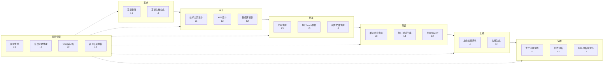

# 企业 IT AI 落地全景图

## 1. 全景图总览

企业 IT 系统的完整生命周期覆盖七个核心环节：需求、设计、开发、测试、上线、运维、项目管理。AI 不是要替换其中任何一个环节，而是在每个环节中找到最适合的切入点，嵌入工具链，提升整体效率。

下面这张全景图展示了 AI 在企业 IT 各环节中的定位。图中标注了每个环节 AI 可介入的具体场景，以及推荐的介入深度（L1-L4，详见第三节）。

**关键洞察**：从全景图可以清楚看到，AI 渗透最深的三个环节是开发、测试、项目管理。这三个环节的特点是高重复性、强模式化、产出物标准化——恰好是当前 AI 工具能力最强的方向。而需求澄清、技术方案设计、生产问题排查这些需要深度业务理解和系统全局视角的环节，AI 更适合处于辅助角色。

## 2. 详细场景表

以下表格覆盖企业 IT 团队日常工作中的 20 个典型场景，逐一分析 AI 的适用性、作用边界和落地建议。

| 工作环节 | 是否适合 AI | AI 作用 | 人的责任 | 风险 | 推荐落地方式 |
|---|---|---|---|---|---|
| **需求澄清** | 部分适合（L1辅助） | 将模糊需求结构化：追问遗漏点、识别矛盾、补全边界条件。例如，当需求只说"做一个审批流"，AI 可追问"审批节点是否固定？驳回后从头开始还是退回上一节点？" | 判断业务优先级，确认隐含假设，做出 trade-off 决策。AI 不知道这个审批流在监管上必须留痕三年 | AI 可能过度细化不重要需求的细节，造成精力分散；可能误解行业术语 | 将业务需求描述粘贴给 AI，让它生成追问清单和边界条件检查表。人逐一确认后，将结论写回 PRD |
| **需求文档生成** | 适合（L2 协作） | 根据会议纪要、聊天记录、用户故事片段，生成标准格式的 PRD 文档。自动补全验收标准、非功能需求、异常流程处理 | 提供原始素材，审核文档正确性，补充业务上下文。尤其是"什么不做"这个信息只有人能给 | 生成的文档看起来很完整，但可能遗漏关键约束。表面专业但内容空洞 | 建立团队 PRD 模板（包含固定章节），AI 按模板填充。人在 Git 上 review PRD diff，逐节确认 |
| **技术方案设计** | 部分适合（L1 辅助） | 针对给定需求生成多方案对比（如：用 Redis 做分布式锁 vs 用数据库行锁），列出各方案的优缺点、适用场景和潜在坑点 | 根据团队现状（技术栈成熟度、人员能力、运维能力）做最终决策。AI 的建议基于"通用最佳实践"，不一定适合你的上下文 | AI 可能生成表面合理但架构上有问题的方案（如循环依赖、雪崩隐患）。AI 不了解你们现有系统的技术债 | 先用自然语言描述问题场景和约束条件，让 AI 输出 2-3 个备选方案，团队评审后选定。方案必须经过技术评审会讨论，不能直接采用 AI 输出 |
| **API 设计** | 适合（L2 协作） | 根据数据模型和业务规则，生成 RESTful API 的路径、请求/响应结构、状态码、错误码定义。可自动遵循团队 API 规范（如命名风格、分页格式） | 确认资源划分是否合理，API 粒度是否合适。判断哪些接口合并、哪些拆分。设计幂等性、限流策略 | AI 倾向于生成 CRUD 风格的 API，可能忽略了业务流程含义。分页、排序、过滤参数可能命名不一致 | 在项目 CLAUDE.md 或 `.cursorrules` 中定义 API 设计规范（命名、分页格式、错误码体系），让 AI 遵守。生成后自动校验是否符合 OpenAPI 规范 |

| 工作环节 | 是否适合 AI | AI 作用 | 人的责任 | 风险 | 推荐落地方式 |
|---|---|---|---|---|---|
| **数据库设计** | 适合（L2 协作） | 根据实体关系描述，生成 DDL 建表语句，包含索引建议、字段类型选择、注释。能识别常见的范式问题和反模式 | 确认业务含义（枚举值的语义、字段是否可空的业务规则），审核索引是否对核心查询有效 | AI 可能为所有字段建索引，或建议不合理的联合索引。不了解实际数据量和查询模式 | 将 ER 描述给 AI → AI 生成 DDL → 人审核索引（Explain 分析）→ 提交代码。关键表必须做数据量预估和查询性能分析 |
| **代码生成（Controller/Service/DAO/DTO）** | 非常适合（L3 主导） | 根据接口定义或数据模型，生成完整的增删改查代码，包括参数校验、异常处理、事务管理。能保持项目现有的代码风格和分层结构 | 定义业务规则（如"订单金额不能为负"），审核边界条件处理（如并发、重复提交），确认事务边界 | AI 可能生成看似完整但有逻辑漏洞的代码。不会主动处理并发、幂等、分布式事务等复杂场景 | 核心做法：先定义接口契约（Controller 签名 + DTO 结构），再让 AI 生成实现。配置 Checkstyle/SpotBugs 自动检查生成代码质量。复杂业务逻辑必须由人编写或逐行 review |
| **单元测试生成** | 非常适合（L3 主导） | 对被测试方法的每个分支生成测试用例，覆盖正常路径、异常路径、边界值、空值。自动 mock 外部依赖 | 确认测试用例是否覆盖了真实业务场景，判断是否过度测试或漏测。AI 生成的边界值可能不符合业务含义（如年龄 -1 在业务上无意义） | 可能生成伪 green 测试（测试了但不验证关键断言）。mock 对象过多导致测试脆弱，重构时大面积失败 | 先写核心业务逻辑的测试（人写），AI 补全边界和异常路径。用 JaCoCo 检查覆盖率，确保分支覆盖率 >80%。AI 生成的测试必须用 `assertThat` 明确断言而非仅调用方法 |
| **接口测试生成** | 非常适合（L3 主导） | 根据 Controller 定义和 Swagger 文档，生成完整的 API 集成测试。包括请求构造、响应断言、状态码验证、错误场景测试 | 准备测试数据，设计测试场景（正常流程、异常流程、权限场景）。确认测试后数据的清理逻辑 | AI 可能生成测试数据之间互相依赖的脆弱的测试套件。不了解数据隔离策略 | 结合 Spring MockMvc 或 TestRestTemplate，AI 生成测试框架代码。测试数据用 `@Sql` 注解初始化，测试结束后自动回滚。关键业务流程的测试由人编写 |

| 工作环节 | 是否适合 AI | AI 作用 | 人的责任 | 风险 | 推荐落地方式 |
|---|---|---|---|---|---|
| **代码 Review** | 适合（L2 协作） | 自动扫描代码中的潜在问题：空指针风险、资源未关闭、SQL 注入、并发安全问题、不规范的命名、重复代码 | 判断问题的严重程度和修复优先级。理解业务逻辑正确性——AI 看不出"虽然代码没问题但业务上算错了" | AI 可能产生大量低优先级的 nitpick，掩盖真正重要的问题。可能对性能优化建议不切实际（如建议改数据结构但影响范围大） | CI 流水线集成：每次 PR 自动触发 AI review，结果作为评论贴在 PR 中。Reviewer 聚焦业务逻辑和架构层面，AI 负责语法、安全、规范检查。使用 `/code-review` 或 SonarQube + AI 插件组合 |
| **文档生成** | 适合（L3 主导） | 根据代码注释、接口定义、配置说明，自动生成 API 文档、技术设计文档、部署文档。能保持一致的文档风格和结构 | 补充"为什么"（设计决策、取舍理由），审核"怎么做"的准确性。AI 能写"做了什么"，写不出"为什么这么做" | 文档可能与实际代码不同步（代码改了但文档没重新生成）。自动生成的文档可能过于泛泛，缺乏团队当前上下文 | 文档以 Markdown 形式放在代码仓库中，与代码一起版本管理。CI 中增加文档 freshness check：当接口签名变化时自动提示更新文档。使用 Knife4j/SpringDoc 自动生成 API 文档，AI 补充业务说明 |
| **生产问题排查** | 部分适合（L1 辅助） | 分析异常堆栈，给出可能的原因和排查方向。辅助阅读和理解日志片段。根据错误信息搜索已知解决方案 | 理解系统全貌，判断到底层问题。快速决策是先回滚还是热修复。AI 不了解你们的发布记录和最近的变更 | 可能给出看似合理但完全错误的排查方向，浪费时间。不了解你们的系统架构和调用链 | AI 作为排查的"第二意见"——运维同学有了初步判断后，用 AI 验证思路是否遗漏。不要用 AI 代替从监控、链路追踪、日志系统获取事实信息 |
| **日志分析** | 适合（L2 协作） | 从大量日志中提取异常模式，按时间线整理事件，识别异常突增的时间点。将非结构化日志转为结构化数据 | 定义什么算"异常"，判断日志中的模式是否有业务含义。决定需要关注哪些指标 | AI 可能在正常波动中发现"假异常"。需要人理解日志的上下文和业务含义 | 结合 ELK/Splunk 等日志平台，AI 辅助查询语句生成（如"帮我写一条 ES 查询，统计过去一小时错误率最高的 10 个接口"）。异常检测规则由人设定 |

| 工作环节 | 是否适合 AI | AI 作用 | 人的责任 | 风险 | 推荐落地方式 |
|---|---|---|---|---|---|
| **SQL 分析与优化** | 适合（L2 协作） | 分析慢 SQL 的执行计划，建议索引优化、SQL 重写方案。自动识别 N+1 查询、缺失索引、全表扫描等问题 | 判断优化方案是否适合当前数据量和业务场景。确认索引增加的写入成本是否可接受 | AI 可能建议添加过多索引，导致写入性能下降。不了解分库分表策略和读写分离架构 | 将 Explain 结果 + 表结构 + 慢 SQL 一起给 AI，让它给出优化建议。DBA 或资深开发审核后再执行。生产环境索引变更必须在低峰期且有回滚方案 |
| **周报生成** | 非常适合（L3 主导） | 根据 Git 提交记录、任务管理系统（Jira/TAPD）的任务状态变更，自动生成结构化周报，包含完成事项、进行中事项、风险项和下周计划 | 补充 AI 看不到的信息：会议讨论结果、非代码类工作（跨部门协调、方案评审）、对风险的判断和处理计划 | 生成的周报可能过于流水账，缺少洞察。可能遗漏重要但未在工具中记录的工作 | 工作日结束时花 2 分钟在固定模板中记录关键事项（一句话即可），周末让 AI 聚合生成周报。人在发布前审核补充，重点确认"风险与阻塞"部分 |
| **会议纪要整理** | 适合（L3 主导） | 根据会议录音转文字或聊天记录，提取决议、待办事项、关键讨论点。按议题结构化整理 | 对决议内容进行把关确认。补充隐性的会议结论（如"大家没明说但基本同意先不做"）。标记敏感信息不要录入 | 转写中的错误可能导致关键信息失真（如技术术语、人名、数字）。涉密内容不能交给外部 AI | 使用支持本地部署的转写工具（如 Whisper），或先由人标记"可提交 AI 的部分"。AI 生成纪要后，必须由主持人或记录人花 3 分钟审核确认 |
| **知识库问答** | 适合（L2 协作） | 基于团队的历史文档、技术决策记录（ADR）、故障复盘报告、代码库，回答技术问题。新人可以问"我们项目的分页是怎么做的"、"上次 xx 故障的根本原因是什么" | 维护知识库的内容质量和时效性。定期清理过期文档。判断 AI 回答是否准确 | 知识库内容过时时，AI 会自信地给出错误答案。可能泄露跨团队不该共享的信息 | 搭建 RAG（检索增强生成）系统：将团队文档向量化存储，问答时先检索相关内容再让 AI 基于检索结果回答。每个答案附带引用来源，方便核实 |

| 工作环节 | 是否适合 AI | AI 作用 | 人的责任 | 风险 | 推荐落地方式 |
|---|---|---|---|---|---|
| **新人培训材料生成** | 适合（L2 协作） | 根据项目 README、CLA.md、架构文档、代码结构，自动生成新人 Onboarding 指南：环境搭建步骤、项目模块介绍、常见开发任务的操作流程 | 审核内容的正确性和完整性。补充"潜规则"（如"第三方的那个接口不稳定，调之前先确认"）。安排真人 mentor 带教 | 生成的文档可能是"理想世界"的操作步骤，遇到实际问题（环境依赖冲突、权限不足）新人无法自行解决 | AI 生成基础文档 + 人补充 FAQ（收集过往新人遇到的问题和解决方案）。在新人 onboarding 过程中持续更新这份材料。保持"一个新人、一个 mentor"的机制 |
| **上线检查清单生成** | 适合（L2 协作） | 根据本次发布的内容（代码 diff、配置变更、数据库变更），自动生成上线检查清单：需要执行的 SQL、需要刷新的缓存、需要通知的相关方、回滚步骤 | 补充 AI 不知道的事项（如"提前通知运营停止后台操作"），确认变更顺序和依赖关系 | AI 不了解跨系统依赖，可能遗漏需要联动上线的系统。对上线窗口、灰度策略等不了解团队约定 | 维护一份团队级别的上线检查清单模板（包含固定项如"已通知运维"、"已备份数据库"），每次上线时 AI 根据本次发布内容生成定制化补充项。人最终确认全部项目 |
| **接口 Mock 数据生成** | 非常适合（L3 主导） | 根据 DTO 定义和字段含义，生成符合业务逻辑的 Mock 数据。能生成正常数据、边界值数据、异常数据，并且数据之间有关联关系（如用户 ID 和订单中的用户 ID 一致） | 定义数据生成的业务规则。确认生成的 Mock 数据量足够覆盖前端测试场景 | AI 生成的 Mock 数据可能过于规律（如所有手机号都是 138 开头），不够贴近真实数据分布 | 使用 AI 生成 Mock 数据脚本 + 人补充特定场景数据。结合 MockJS 或自己写 DataFaker 工具。Mock 数据更新与 DTO 变更同步（CI 自动检查 Mock 数据是否匹配当前 DTO） |
| **配置文件生成** | 适合（L2 协作） | 根据项目依赖和部署环境描述，自动生成 application.yml、Dockerfile、docker-compose.yml、Nginx 配置等。能保持环境隔离（dev/test/prod）和配置项的合理默认值 | 确认环境特定值（数据库连接、密钥、外部服务地址）。审核安全相关配置（CORS、超时、连接池大小） | AI 可能生成不安全的默认配置（如开放所有 CORS、debug 模式开启）。不了解公司内部基础设施（如注册中心地址、配置中心地址） | 维护一个配置文件模板仓库，AI 基于模板生成。敏感信息使用环境变量或配置中心引用，不硬编码。生成的配置文件必须通过安全扫描（如 Trivy 扫描 Dockerfile） |

## 3. AI 介入深度分级

不是所有场景都需要 AI 深度介入。根据任务的特性和团队成熟度，我们定义四个介入级别。

### Level 1：AI 辅助（人主导，AI 提供建议）

AI 处于纯建议角色。人在做决策时，把 AI 当作"随时可问的资深同事"——可以问想法，但最终判断完全由人做出。

**适用场景特征**：高度依赖业务上下文、需要全局视角、错误后果严重。

**具体示例**：

1. **技术方案设计**：架构师在设计方案时，让 AI 列出"用消息队列解耦 vs 用 Feign 直接调用"的对比分析。AI 给出通用建议（解耦好、维护成本高、需要考虑最终一致性），架构师结合团队现状做出选择。
2. **生产问题排查**：线上出现 CPU 飙升，运维同学怀疑是某个定时任务的问题。把线程 dump 和 GC 日志给 AI，AI 分析了线程状态后指出"HashMap 在多线程下死循环"是可能原因。运维同学结合实际代码确认根因。
3. **需求澄清**：业务方说"我们要做一个报表"。AI 追问 15 个细节问题（报表给谁看、多久更新一次、数据从哪来、是否需要导出、有没有实时性要求），产品经理逐一确认。

### Level 2：AI 协作（人机共同完成，AI 生成初稿，人修改定稿）

AI 产出初稿，人在上面修改、补充、确认。这是最广泛适用的级别，也是大多数团队落地 AI 的起点。

**适用场景特征**：产出物标准化程度高、有模板可循、AI 能覆盖 60-80% 的工作量。

**具体示例**：

1. **API 设计**：开发人员描述"有一个用户管理模块，需要增删改查用户，用户有角色和权限"。AI 生成完整的 RESTful API 定义（路径、请求体、响应体、错误码）。开发人员审核后调整了权限校验的粒度，补充了批量操作的接口。
2. **代码 Review**：AI 在 PR 中自动检查了代码规范、空指针风险、SQL 拼接问题，留下 12 条评论。Reviewer 重点关注了 3 条高风险评论，其余低优先级的标记为 `nice-to-fix`。
3. **新人培训材料**：AI 生成了 Onboarding 文档初稿，包含环境搭建、项目结构、常见命令。Mentor 补充了 15 条 FAQ（来自过往新人实际遇到的问题），调整了环境搭建中与实际不匹配的步骤。

### Level 3：AI 主导（AI 执行，人审核验收）

AI 承担大部分执行工作，人的角色从"做"变成"审"。这个级别要求团队有明确的验收标准和质量门禁。

**适用场景特征**：高重复性、模式固定、产出物容易验证、错误影响可控。

**具体示例**：

1. **单元测试生成**：开发人员写完 `OrderService.createOrder()` 方法后，AI 自动生成 20 个测试用例覆盖正常流程、库存不足、重复提交、参数校验失败等场景。开发人员 review 测试用例的断言逻辑，确认无误后提交。
2. **代码生成**：根据数据库表结构和接口定义，AI 生成完整的 Controller → Service → DAO → DTO 四层代码，包含增删改查、分页查询、参数校验、统一异常处理。开发人员重点 review 业务逻辑部分（Service 层），CRUD 模板代码只做抽查。
3. **周报生成**：周五下午 5 点，AI 自动拉取本周 Git 提交、Jira 任务变更，生成周报草稿。TL 花 5 分钟审核调整后发出。

### Level 4：AI 自动化（AI 独立执行，人只看异常）

AI 完全接手，人只在出现异常或告警时介入。对 AI 输出的精确性和可靠性要求最高，当前能落地的场景有限。

**适用场景特征**：规则极其明确、边界清晰、错误可自动检测、历史数据充分。

**具体示例**：

1. **CI 质量门禁**：AI 在 CI 流水线中自动检查代码提交是否符合规范（命名、注释、复杂度），不符合的直接打回并给出修改建议。人不需要手动触发，不符合规范的代码无法合入。
2. **自动化文档同步**：当代码中的 API 定义变化时，AI 自动生成文档变更 PR。如果文档变更与原定义一致（通过 Schema 校验），自动合入；如果不一致，通知开发人员手动审核。
3. **SQL 优化建议自动化**：DBA 系统监控到慢 SQL 后，AI 自动分析并生成优化建议。如果建议是"添加索引"且索引大小预估小于 100MB，自动在低峰期执行；如果是"重写 SQL"，自动创建工单分配给对应开发人员。

**重要提示**：在当前阶段（2025-2026），企业 IT 团队应该以 L1 和 L2 为主力落地级别，L3 在测试和代码生成领域逐步推进，L4 仅用于确定性极高的自动化场景。不要因为 AI 可以做就盲目推向 L4——人在回路的机制在很长一段时间内都是必要的。

## 4. 各环节 AI 落地优先级

以下按落地优先级将各场景分为 P0-P3 四个梯队。优先级基于三个维度评估：ROI（投入产出比）、风险可控度、团队接受度。

### P0：立即可落地（本周内可以开始）

| 场景 | 理由 | 启动成本 | 预期收益 |
|---|---|---|---|
| **代码生成** | Java 分层架构高度模式化，Controller/Service/DAO/DTO 结构固定，AI 生成质量高。团队已有 AI 编码工具（如 GitHub Copilot、Cursor）即可开始 | 零成本启动（工具已有） | 减少 30-50% 的模板代码编写时间 |
| **单元测试生成** | 测试的结构化程度甚至高于业务代码，AI 对分支覆盖的处理能力强。与代码生成天然配对 | 在 IDE 中启用测试生成功能 | 单元测试编写时间减少 50-70%，覆盖率提升 |
| **代码 Review** | CI 集成成熟，大部分代码托管平台已支持 AI Review。不改变现有流程，只是在 Review 环节增加一个自动检查 | 在 Git 平台配置 AI Review 插件 | 减少 30% 的 Reviewer 时间，拦截 60% 的低级错误 |
| **周报生成** | 输入源明确（Git + 任务管理系统），输出格式固定，不需要复杂的上下文理解 | 30 分钟写一个脚本或 Prompt 模板 | 每人每周节省 20-30 分钟 |

### P1：1-3 个月内可落地

| 场景 | 理由 | 需要准备 | 预期收益 |
|---|---|---|---|
| **接口测试生成** | 需要先有 Swagger/OpenAPI 文档基础，测试数据管理方案也需要提前设计 | 完善 API 文档规范，建立测试数据管理策略 | API 测试覆盖率从 30% 提升到 80%+ |
| **API 设计** | 需要先在团队内统一 API 设计规范（命名、分页、错误码等），否则 AI 生成的 API 风格不一致 | 编写团队 API 规范文档，配置到 AI 工具的规则文件中 | API 设计时间减少 40%，接口一致性大幅提升 |
| **数据库设计** | 需要 DDL 的 Review 流程和索引审核标准，不能完全依赖 AI 的建议 | 建立数据库变更审核流程，配置 SQL 审查工具 | DDL 编写时间减少 50%，减少低级索引遗漏 |
| **日志分析** | 需要日志平台的基础设施（ELK/Splunk），AI 的价值在于辅助查询和分析，前提是日志已经集中存储 | 日志平台接入 AI 查询助手 | 日志排查时间减少 30-50% |
| **接口 Mock 数据生成** | 与 API 设计和接口测试配合，可以作为完整的"API 开发工作流"的一部分 | 统一 DTO 定义规范，建立 Mock 数据管理规范 | 前后端联调等待时间大幅减少 |

### P2：需要准备和试点

| 场景 | 理由 | 需要的准备 | 预期收益 |
|---|---|---|---|
| **需求文档生成** | 需要先有团队标准化的 PRD 模板。AI 生成的文档质量取决于输入素材的质量（会议纪要是否完整、决策是否记录） | 建立 PRD 模板，养成记录需求讨论的习惯 | 需求文档编写时间减少 40%，格式和完整性提升 |
| **文档生成** | 最核心的问题是文档与代码的同步。需要先解决"文档 freshness"问题，否则会成为新的技术债 | 建立文档自动更新机制，文档纳入 CI 检查 | 文档维护成本降低 60% |
| **SQL 分析与优化** | 需要 DBA 参与制定自动化规则，生产环境变更涉及安全审批 | 建立 SQL 审核自动化流水线，制定安全规则 | 慢 SQL 处理时间减少 50% |
| **会议纪要整理** | 需要转写工具和隐私审核流程。部分会议内容涉密，需要筛选哪些可以交给 AI | 选择合适的转写工具，建立审核流程 | 会议纪要产出时间减少 70% |
| **上线检查清单生成** | 需要维护发布流程的标准化描述。每个系统的上线步骤差异大，需要逐个梳理 | 梳理各系统的发布流程和检查项 | 减少因遗漏检查项导致的上线事故 |

### P3：暂不适合全力推进

| 场景 | 理由 | 当前建议 |
|---|---|---|
| **技术方案设计** | AI 不了解系统现状（技术债、性能瓶颈、团队能力），建议偏通用，容易出现"看起来对但实际不对"的方案。不适合直接采用，仅作参考 | 保持 L1 辅助模式，作为方案的"对比参考"和"风险检查"工具 |
| **生产问题排查** | 要求对系统的深度理解和即时决策能力。AI 可能给出看似合理的错误方向，在高压力下反而浪费时间 | 保持 L1 辅助模式，用于异常堆栈分析和已知问题搜索 |
| **需求澄清** | 核心价值在于理解业务，AI 追问可能偏离业务重点，且缺乏行业 know-how | 保持 L1 辅助模式，用 AI 生成追问清单，人做判断 |
| **知识库问答** | 需要大量前期建设（文档向量化、内容管理、权限控制），且内容质量高度依赖人工维护。容易变成"垃圾进垃圾出" | 先做好知识沉淀（文档化、结构化），再引入 RAG |

**优先级落地策略**：第一个月聚焦 P0（立竿见影），第二到三个月逐项推进 P1（建立规范），P2 在团队适应 AI 工作方式后启动试点。不要在第一个月就想全面推进——P0 场景的快速成功会为后续推进积累信任和经验。

## 5. 核心原则

### 原则一：AI 嵌入流程，不替代流程

AI 的价值在于加速现有流程中的某些环节，而不是创造全新的流程。

**实践含义**：你们的开发流程是什么——代码生成怎么做、代码 Review 怎么做、文档怎么写——这些流程本身不变。AI 进入的是流程中的具体步骤：写完代码让 AI 生成测试，提交 PR 让 AI 做初步 Review，接口变更后让 AI 更新文档。不要为了用 AI 而改流程，要在现有流程中找到 AI 能加速的瓶颈点。

**反面案例**：某团队听说 AI 能做代码 Review，于是取消了人工 Review 环节。结果一个月后线上出了严重 bug——AI 看不出业务逻辑错误。正确做法是 AI Review + 人 Review 并行，AI 负责规范和低级错误，人负责业务和架构。

### 原则二：先验收机制，后 AI 生成

在让 AI 生成任何产出之前，先定义清楚"什么算合格的产出"。

**实践含义**：如果你想让 AI 生成代码，先有 Checkstyle/SpotBugs 规则。如果你想让 AI 生成 API 设计，先有 OpenAPI 规范校验。如果你想让 AI 生成单元测试，先有覆盖率门槛和断言质量要求。没有验收标准的 AI 产出是不可控的——你可能得到高质量产出，也可能得到看起来整洁但完全错误的产出。

**反面案例**：AI 生成了 500 行 Service 代码，看起来方法命名规范、注释完整、结构清晰。但没有设置质量门禁，合并后才发现里面有三处逻辑错误和一处 NPE 隐患。正确做法是让 AI 生成后自动跑测试和静态分析，通过后才能进入 Review。

### 原则三：模板化优先于自由发挥

给 AI 的约束越具体，产出质量越高。给 AI 的约束越开放，产出越不可控。

**实践含义**：不要对 AI 说"帮我写一个用户管理的接口"——这太开放了。应该说"按照项目现有的 UserController 风格，创建 RoleController，包含分页查询、根据 ID 查询、创建、更新、删除五个接口。返回格式参考 Result<T> 封装类，异常处理使用 GlobalExceptionHandler"。模板、风格、参考物越明确，AI 的产出越可预测。

**反面案例**：团队没有统一 API 设计规范，每个人让 AI 按"自己觉得合理"的方式生成接口。两个月后项目里出现了四种分页格式、三种错误码风格、两种命名约定。正确做法是在 `CLAUDE.md` 中写明 API 规范，所有人使用同一套约束。

### 原则四：人最终负责

无论 AI 介入多深、产出多好，出问题时的责任在人不在于 AI。这个原则不只是法律免责，更是一种工作习惯。

**实践含义**：Code Review 时，Reviewer 不能因为"这是 AI 生成的，应该没问题"而降低审核标准。上线故障复盘时，不能把原因归结为"AI 建议了这个方案"。AI 是一个工具，人决定是否采用。TL 在制定 AI 使用规范时必须明确：每次使用 AI 产出的东西，审核通过即代表审核者对其正确性负责。

**反面案例**：某开发人员让 AI 生成了一段 SQL 查询用于数据迁移，没有审核直接执行，导致生产数据被错误更新。事后复盘时他说"这是 AI 生成的 SQL"。这不是 AI 的问题——是人在没有审核的情况下执行了生产变更。

### 原则五：从小处开始，逐步放大

AI 落地的最大风险不是技术问题，而是组织问题。一步到位往往导致抵触和混乱。

**实践含义**：第一周只推一个场景（如"所有新增 Service 方法必须由 AI 生成单元测试"），第二周推到两个场景，一个月后覆盖 5-6 个 P0/P1 场景。每个场景都先在一个小团队试点，验证有效后再推给全团队。让团队成员自己感受到 AI 的实际帮助，而不是来自 TL 的行政命令。

**反面案例**：TL 在一次周会上宣布"从下周起所有代码都要用 AI 生成"，没有试点、没有培训、没有规范。结果团队抵触情绪严重（"AI 写的代码还要我改，更慢了"），两周后不了了之。正确做法是先让 TL 自己用 P0 场景做出可见的效率提升，再让感兴趣的同事试用，逐步推广。

## 6. 常见误区

### 误区一："AI 什么都能做，我们直接用最深度介入模式"

**现实**：AI 的能力在不同场景差异巨大。在代码生成、测试生成、周报生成这些结构化场景中，AI 可以做到 L3（主导级）；在技术方案设计、故障排查这些需要深度上下文理解的场景中，AI 目前只能做到 L1（辅助级）。

**正确认知**：不要把 AI 看作万能工具，而是把它看作一个能力图谱——有些场景是甜蜜点（高结构化、高重复性），有些场景是盲区（需要深度上下文、全局判断）。对照第二节的详细场景表，找到你们团队的甜蜜点，先从这些场景入手。

### 误区二："AI 生成的代码有 bug，所以 AI 不靠谱"

**现实**：人写的代码也有 bug，为什么只对 AI 双标？AI 生成代码的正确率在简单到中等复杂度的 CRUD 场景中已经可以和初级到中级开发人员持平。真正的问题是团队没有建立"AI 生成的代码必须通过同样的质量门禁"的机制。

**正确认知**：把 AI 生成代码当成人写的代码来对待——同样的测试要求、同样的 Review 流程、同样的质量门禁。通过这些验证的代码就是合格的代码，不管它来自 AI 还是人。关键不是"AI 会出错"，而是"你们的验收体系是否足够"。

### 误区三："有了 AI，初级开发人员可以替代中级开发人员"

**现实**：AI 能加速执行，但不能替代判断。在"知道要做什么"的场景中，AI 确实可以让初级开发人员产出和中级开发人员相似的代码量。但在"不知道要做什么"的场景中（设计决策、技术选型、故障判断），AI 帮不上忙，反而可能让初级开发人员做出看起来有道理但实际错误的决策。

**正确认知**：重新定义角色分工。AI 让初级开发人员从"写代码"往"审代码"升级，让中级开发人员从"写复杂逻辑"往"做设计决策"升级，让高级开发人员从"部分写代码"往"全流程架构把控"升级。每个人的价值从"我写出了多少代码"变成"我确保了什么质量"。

### 误区四："引入 AI 工具就是 AI 落地了"

**现实**：让团队成员各自使用 GitHub Copilot 或 Cursor，不等于团队的 AI 落地。这只是把 AI 当成个人提效工具，没有形成团队级别的能力沉淀。每个开发人员在使用不同风格让 AI 生成代码，没有统一的规范、模板和质量标准。

**正确认知**：AI 团队落地 = 统一工具和配置 + 统一规范和模板 + 统一质量门禁 + 可复用的 Prompt 库和工作流 + 团队级的效果度量。对照本手册各组章节，逐步构建团队级别的 AI 能力体系。

### 误区五："AI 落地是技术问题，找几个同事调研一下就行"

**现实**：AI 落地本质上是工程文化变革。它涉及工作习惯的改变（从"我写"到"我审"）、质量责任的重新定义（Code Review 应该审什么）、团队规范的重建（AI 时代的编码规范应该怎么定）。技术选型（选哪个 AI 工具）只占 10% 的工作量，剩下的 90% 是流程、规范、习惯和文化的建立。

**正确认知**：AI 落地需要 TL 亲自推动。不是"我批准你们用 AI"，而是"我来定规范、建模板、设门禁、量效果，我们团队一起来"。TL 需要先吃透整个 AI 工具链、建立第一手经验，再制定团队方案。本手册的后续章节就是为这个路径设计的。

---

**本章总结**：企业 IT 的 AI 落地不是技术革命，而是工具升级。你的团队已经有了完整的开发流程、质量体系、协作规范。现在要做的，是找到 AI 在每个环节中最合适的切入点，嵌入进去，提升效率。全景图帮你建立全局视角，场景表帮你看清每个环节怎么做，介入分级帮你把握力度，优先级帮你排定先后顺序，核心原则帮你避坑。下一章开始，我们深入每个具体场景的操作细节。
