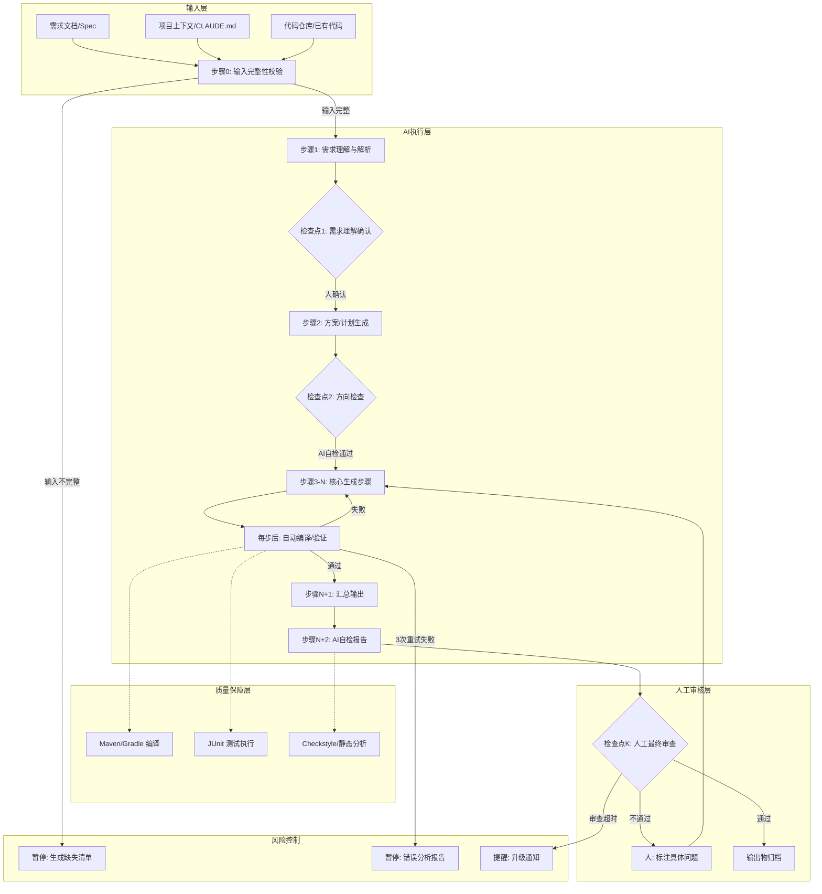
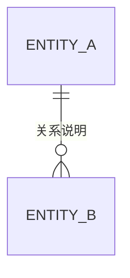

# 第3章 AI 工作流设计方法论

> 本章是全书最重要的方法论章节。学完本章，你将能够把任何企业 IT 研发任务设计成可复用、可验证、可协作的 AI 工作流。

## 3.1 为什么需要工作流方法论

你在日常开发中可能已经遇到过这些情况：

- 让 AI 写一个接口，它给出的代码语法正确但业务逻辑完全不对
- 用 AI 排查一个生产问题，排查方向跑偏了二十分钟才发现
- 每次让 AI 干活，都要手动复制粘贴结果到各个文件，来回修好几轮
- 同事问你"怎么用 AI 做这个"，你发现说不清楚，只能演示一遍

这些问题的根因是同一个：你把 AI 当成问答工具在用，没有当成流程节点来设计。

单次 AI 问答像是一次性快餐，AI 工作流像是一条生产线。前者每次从零开始，质量随机；后者有固定的工序、质检点和产出标准，质量可预期。

本章解决的核心问题：**如何把一次性的 AI 问答升级为可复用、可验证、可协作的 AI 工作流**。

## 3.2 AI 工作流通用公式

经过大量企业实践验证，一个完整的 AI 工作流由 11 个要素构成：

> **AI 工作流 = 目标 + 输入 + 上下文 + 约束 + 工具 + 步骤 + 检查点 + 输出物 + 验收标准 + 人工介入点 + 风险控制**

这 11 个要素缺一不可。逐个拆解。

---

### 3.2.1 目标（Goal）

**是什么**：一句话说清这个工作流要产出什么，给谁用，做到什么程度算完成。

**为什么重要**：目标是工作流的北极星。没有清晰目标，AI 会在执行中逐渐偏离原始意图，人也会在 review 时失去判断基准。目标是后续 10 个要素的设计依据。

**怎么写（模板）**：

```
目标：[用户角色]通过[输入材料]，得到[输出物]，满足[质量底线]

示例：
目标：后端开发通过接口需求文档，得到完整的 Controller/Service/DAO/DTO 
      代码和单元测试，编译零错误且测试覆盖率 >= 80%
```

**常见错误**：

| 错误写法 | 问题 | 正确写法 |
|---|---|---|
| "用 AI 提高开发效率" | 没有输入输出，无法验收 | "输入接口 spec，输出完整 Spring Boot CRUD 代码和测试" |
| "生成用户模块" | 没有质量标准 | "生成用户模块代码，编译通过 + 测试覆盖率 >= 80%" |
| "帮我写代码" | 角色和范围模糊 | "后端开发输入 PRD，输出用户管理接口的全部代码" |

**Java 后端场景示例**：

```
目标：开发者输入 GitLab MR 链接和项目代码规范，得到结构化的 Code Review 
      报告（包含 Critical/High/Medium/Low 四级问题分类），人工确认后直接作为
      MR 评审意见发布
```

---

### 3.2.2 输入（Input）

**是什么**：工作流启动前必须就位的全部材料，包括文档、代码文件、数据源、人工提供的决策信息。

**为什么重要**：输入决定了工作流的天花板。Garbage in, garbage out。工作流启动前必须校验输入完整性，否则后续步骤会基于错误的前提生成错误的产出。输入也是工作流可复用的前提——明确输入格式后，换一个需求只需要替换输入文件，工作流本身不变。

**怎么写（模板）**：

```
输入清单：
1. [输入项名称] — [格式要求] — [从哪里获取] — [缺失时如何处理]
2. ...
```

**常见错误**：

- 把"需求文档"作为输入，但不指定格式（Word/PDF/Markdown？结构要求？）
- 把"数据库表结构"作为输入，但不说明是 DDL 文件还是连接数据库实时读取
- 输入项之间相互矛盾时没有处理策略

**Java 后端场景示例**：

```
接口开发工作流输入清单：
1. 接口 spec 文档 — Markdown，包含路径/方法/入参/出参/业务逻辑/异常情况 — 
   产品提供 — 缺 spec 时工作流终止，不允许用口头描述代替
2. 项目上下文 — CLAUDE.md 文件 — 项目根目录 — 缺 CLAUDE.md 时先执行上下文初始化步骤
3. 已有实体类 — Java 源文件 — src/main/java/**/entity/ — 无已有实体时标注为全新模块
4. 数据库表结构 — DDL 文件或已存在的实体类 — 项目代码仓库 — 无表结构时先执行 DDL 生成步骤
```

---

### 3.2.3 上下文（Context）

**是什么**：AI 在执行每一步时需要知道的背景信息，包括技术栈、项目结构、代码规范、业务领域知识、参考示例。

**为什么重要**：AI 的能力上限由上下文质量决定。同样一个 prompt，给了充分的上下文（项目包路径、统一响应体格式、现有 BaseService 代码）和没给上下文，产出的代码质量天差地别。上下文不是一次给完，而是每个步骤按需注入。给得太多会挤占注意力窗口，给得太少会导致生成内容与项目不一致。

**怎么写（模板）**：

```
上下文配置（放在项目 CLAUDE.md 或 .claude/context/ 目录下）：

## 技术栈
- Java 17, Spring Boot 3.2, MyBatis-Plus 3.5, MySQL 8.0
- 统一响应体：Result<T>（code/message/data）
- 异常处理：GlobalExceptionHandler + BizException

## 包路径约定
- Controller: com.xxx.controller
- Service: com.xxx.service / com.xxx.service.impl
- DAO: com.xxx.mapper（MyBatis-Plus Mapper）
- Entity: com.xxx.entity
- DTO: com.xxx.dto.request / com.xxx.dto.response

## 代码风格约束
- 禁止 System.out.println() 和 printStackTrace()
- 日志使用 @Slf4j + log.info/error
- 金额必须用 BigDecimal，禁止 float/double
- 所有接口入参必须 @Valid 校验
```

**常见错误**：

- 把整个项目的 README 喂给 AI（信息噪音 >> 有效信息）
- 上下文只写一次，后续步骤不重复注入（长任务中前面的约束会被遗忘）
- 上下文包含敏感信息（数据库密码、内网 IP）

**Java 后端场景示例**：

```
# 用户模块开发上下文（随工作流步骤注入）

## 本模块特有约束
- 用户密码必须 BCrypt 加密存储，禁止明文
- 用户状态枚举：ACTIVE / DISABLED / DELETED
- 删除用户为逻辑删除（status=DELETED），使用 @TableLogic
- 手机号必须做格式校验（@Pattern(regexp = "^1[3-9]\\d{9}$")）

## 已有参考代码
- BaseService: com.xxx.common.base.BaseService（含通用 CRUD）
- 分页查询参考：com.xxx.controller.OrderController#page
- 统一异常参考：com.xxx.common.exception.BizException
```

---

### 3.2.4 约束（Constraints）

**是什么**：告诉 AI **绝对不能做什么**的硬边界，以及**必须做什么**的硬要求。约束是不可协商的规则，不是建议。

**为什么重要**：提示（Prompt）是建议，AI 可能忽略；约束（Constraint）是边界，必须遵守。经验表明，列出"不允许做什么"比列出"应该做什么"更可靠。约束保护的是代码安全性、合规性和一致性——这些恰恰是 AI 最容易出错的地方。

**怎么写（模板）**：

```
约束清单（按严重程度分级）：

## 安全约束（违反即阻断）
- 禁止 SQL 字符串拼接，所有查询必须用参数化方式
- 禁止在日志中打印用户密码、身份证号、手机号等敏感信息
- 禁止在 Controller 中直接返回 Entity，必须通过 DTO 转换

## 规范约束（违反需修正）
- 禁止在 Controller 中编写业务逻辑
- 禁止使用已标记 @Deprecated 的 API
- 禁止引入未在 pom.xml 中声明的依赖
- 所有写操作必须添加 @Transactional

## 业务约束（违反需人工确认）
- 金额计算必须用 BigDecimal，禁止 float/double
- 日期格式化统一使用 "yyyy-MM-dd HH:mm:ss"
- 分页查询页码从 1 开始，禁止从 0 开始
```

**常见错误**：

- 约束写成"建议"（"建议使用 @Transactional"→ AI 可能忽略）
- 约束太多（一页列 30 条，AI 前 5 条之后的有效关注度骤降）
- 约束与上下文矛盾（上下文说"参考 OrderController"，约束说"Controller 不能超过 100 行"——但 OrderController 有 300 行）

**Java 后端场景示例**：

```
接口开发工作流约束（硬边界）：

1. 所有 SQL 操作必须用 MyBatis-Plus 的 LambdaQueryWrapper/LambdaUpdateWrapper，禁止字符串拼接条件
2. 异常统一使用 throw new BizException(ErrorCode.XXX)，禁止直接 throw new RuntimeException()
3. Controller 方法入参使用 @Valid 注解触发校验，不在方法体内手动 if-null 判断
4. 返回值统一使用 Result<T> 包装，Controller 方法返回类型必须为 Result<XxxResponse>
5. 数据库写操作必须添加 @Transactional(rollbackFor = Exception.class)
6. 禁止在循环内执行数据库查询或调用远程接口
7. 日志级别：正常业务用 log.info，异常用 log.error("msg", e)，调试信息用 log.debug
```

---

### 3.2.5 工具（Tools）

**是什么**：AI 在每个步骤中可以调用的能力清单，包括文件读写、命令执行、API 调用、数据库查询等。

**为什么重要**：工具的边界就是 AI 的能力边界。工具配置有两个关键点：一是权限最小化（每个步骤只给必要工具），二是能力匹配（想验证编译就必须给 Maven 执行权限）。

**怎么写（模板）**：

```
步骤级工具配置：

步骤 N：[步骤名称] — 预置工具
- 文件读写：Read（读取已有代码），Write（写入生成代码）
- 命令执行：mvn compile -q（验证编译）
- 禁止：Git 操作、数据库连接、网络请求

全流程工具清单：
| 工具 | 用途 | 使用步骤 | 权限要求 |
|---|---|---|---|
| Read/Write/Edit | 读写代码文件 | 所有步骤 | 限制在 src/ 目录 |
| mvn compile | 验证编译 | S2-S8 | 仅开发环境 |
| mvn test | 运行测试 | S6-S8 | 仅开发环境 |
| git diff | 读取变更 | S1, S9 | 只读 |
| 数据库客户端 | 查询表结构 | S1, S3 | 只读 |
```

**常见错误**：

- 全流程给全权限（导致 AI 在需求分析阶段就开始改代码）
- 有读无写（AI 分析完不能写文件，人手动搬运）
- 给数据库写权限（极危险，可能导致数据丢失）

---

### 3.2.6 步骤（Steps）

**是什么**：工作流的核心骨架——每一步做什么、输入是什么、输出是什么、放到哪里。

**为什么重要**：步骤是工作流最核心的要素。步骤设计的好坏直接决定了工作流是否稳定、是否高效、是否容易排查问题。步骤过粗（AI 一次干太多事）会导致输出不可控；步骤过细（把"写 import 语句"也作为一步）会导致上下文压力大、执行效率低。

**怎么写（模板）**：

```
步骤 N：[步骤名称]（预计耗时）

输入：
  - [材料名] — [来源：上一步输出 / 指定文件 / 人工提供]

执行：
  1. [AI 的具体操作]
  2. ...
  3. 自检：[AI 必须自己检查的事项]

输出：
  - [文件名] — [存放位置] — [格式说明]

失败处理：
  - 编译失败 → 读取错误信息 → 修正代码 → 重新编译（最多重试 3 次）
  - 3 次重试仍失败 → 暂停工作流，通知人工介入
```

**常见错误**：

- 一个步骤产出多个不相关的文件（如同时生成 Controller 和 Service）
- 步骤没有明确输入来源（"AI 根据需求自行判断"）
- 输出不物化（只存在 AI 的上下文里，不出现在文件系统中）
- 失败处理策略缺失（AI 出错后不知道该做什么，继续往下走或直接放弃）

**Java 后端场景示例**：

```
步骤 4：生成 Service 层代码（预计 2 分钟）

输入：
  - 编码计划.md — 上一步输出 — 位于 docs/plan/{feature}.md
  - DTO 类文件 — 步骤 2 输出 — 位于 src/main/java/**/dto/
  - Mapper 接口 — 步骤 3 输出 — 位于 src/main/java/**/mapper/
  - spec 文档中的业务逻辑描述 — 原始输入

执行：
  1. 读取编码计划，确定本模块需要的 Service 接口和方法签名
  2. 生成 Service 接口（XxxService.java），定义业务方法签名和 JavaDoc
  3. 生成 ServiceImpl（XxxServiceImpl.java），实现业务逻辑
  4. 每个业务方法添加 @Transactional(rollbackFor = Exception.class)
  5. 异常场景统一 throw new BizException(ErrorCode.XXX)
  6. 复杂业务规则提取为私有方法，保持公共方法简洁
  7. 自检清单：
     a. 所有写操作是否都加了 @Transactional？[检查]
     b. 是否存在 N+1 查询（循环内调用 Mapper）？[检查]
     c. 异常是否正确使用了 BizException 而非 RuntimeException？[检查]
     d. DTO 转换逻辑是否清晰（考虑使用 MapStruct）？[检查]

输出：
  - XxxService.java — src/main/java/**/service/
  - XxxServiceImpl.java — src/main/java/**/service/impl/

失败处理：
  - 编译失败 → mvn compile -q 查看错误 → 修正 → 重试（最多 3 次）
  - 3 次仍失败 → 输出错误日志到 docs/errors/{feature}-step4.md，暂停等人工
```

---

### 3.2.7 检查点（Checkpoints）

**是什么**：在关键步骤之后设置的验证节点，用于确认该步骤的产出质量是否达标，决定是否继续下一步。

**为什么重要**：检查点是工作流质量的核心保障机制。没有检查点的工作流，错误会在步骤间传递放大——第 3 步的一个小偏差，到第 8 步变成完全错误的结果。检查点分三种：自动检查点（AI 自己验证，无需人参与）、半自动检查点（AI 生成检查报告，人确认）、人工检查点（必须人判断）。

**怎么写（模板）**：

```
检查点配置：

CP-1：需求理解确认（步骤 1 之后，人工检查点）
  检查内容：AI 对需求的理解是否与产品意图一致
  通过标准：产品经理/需求方确认功能点清单无遗漏
  不通过处理：AI 根据反馈修正理解，重新输出

CP-2：编译验证（步骤 2-6 之后各一次，自动检查点）
  检查内容：mvn compile -q 零错误
  通过标准：BUILD SUCCESS
  不通过处理：自动读取编译错误，修正对应文件，重试

CP-3：测试通过验证（步骤 7 之后，自动检查点）
  检查内容：mvn test 全部通过 + jacoco 覆盖率 >= 80%
  通过标准：Tests run: N, Failures: 0, Errors: 0，覆盖率达标
  不通过处理：分析失败用例，修正代码或测试

CP-4：最终人工审查（步骤 9 之后，人工检查点）
  检查内容：代码逻辑正确性、业务规则覆盖、异常处理完整性
  通过标准：审查人签字确认
  不通过处理：标注问题点，AI 修正后重新提交审查
```

**常见错误**：

- 检查点太密（每一步都设检查点，流程变成"每步等人点确认"，比手写还慢）
- 检查点全自动、无人工（AI 认为自己的输出没问题，实际业务理解错误）
- 检查点只有"通过/不通过"两种状态，没有"有条件通过"（小问题可以边改边继续）

---

### 3.2.8 输出物（Outputs）

**是什么**：工作流完成后产出的全部交付物清单，包括代码文件、文档、报告，每件产出物都要有明确的格式要求和存放位置。

**为什么重要**：输出物是工作流价值的最终体现。明确的输出物定义让使用者清楚"这个工作流到底给我什么"，也方便验证"工作流是否真的完成了"。输出物必须物化（写入文件系统），不能只存在 AI 的上下文里，否则无法回溯、无法审查、无法交接。

**怎么写（模板）**：

```
输出物清单：

1. [输出物名称] — [文件路径] — [格式] — [验收方式]
2. ...
```

**常见错误**：

- 输出物定义模糊（"代码文件"——具体是哪些文件？放在哪里？）
- 输出物和输入混在一起（将工作流中间产物和最终输出放在同一目录）
- 忘记文档类输出（只关注代码，忽略了"接口说明"、"变更记录"等辅助产出）

**Java 后端场景示例**：

```
接口开发工作流输出物：

代码类：
1. XxxController.java — src/main/java/**/controller/ — 包含 @RestController 注解
2. XxxService.java — src/main/java/**/service/ — 接口定义
3. XxxServiceImpl.java — src/main/java/**/service/impl/ — 业务实现
4. XxxMapper.java — src/main/java/**/mapper/ — MyBatis-Plus Mapper
5. XxxCreateRequest.java — src/main/java/**/dto/request/ — 创建请求 DTO
6. XxxUpdateRequest.java — src/main/java/**/dto/request/ — 更新请求 DTO
7. XxxResponse.java — src/main/java/**/dto/response/ — 响应 DTO
8. XxxServiceImplTest.java — src/test/java/**/service/impl/ — 单元测试
9. XxxControllerIT.java — src/test/java/**/controller/ — 集成测试

文档类：
10. 编码计划.md — docs/plan/{feature}.md — 步骤规划文档
11. self-review-report.md — docs/review/{feature}-self-review.md — AI 自检报告
```

---

### 3.2.9 验收标准（Acceptance Criteria）

**是什么**：判断整个工作流产出是否可交付的客观标准，必须是可度量、可自动验证的。

**为什么重要**：验收标准是工作流交付的最终门槛。没有验收标准，"完成"就是个主观判断——AI 说完成了，人觉得还差得远。验收标准必须是客观可度量的，理想情况下可以自动验证。

**怎么写（模板）**：

```
验收标准（全部满足才算完成）：

1. [标准项] — [验证方式] — [度量指标]
2. ...

不通过项的处理：
- [标准项] 不通过 → [处理方式]
```

**常见错误**：

| 错误写法 | 问题 | 正确写法 |
|---|---|---|
| "代码质量好" | 无法度量 | "Checkstyle 零违规 + SonarQube 无 Blocker" |
| "功能正常" | 太模糊 | "所有接口的集成测试通过，手动冒烟测试通过" |
| "没有 bug" | 不可能验证 | "单元测试覆盖率 >= 80%，已知业务场景全部覆盖" |

**Java 后端场景示例**：

```
接口开发工作流验收标准：

1. 编译：mvn compile -pl {module} → BUILD SUCCESS × 3（连续三次不修改代码通过）
2. 单元测试：mvn test → Tests run: N, Failures: 0, Errors: 0
3. 覆盖率：mvn jacoco:report → 行覆盖率 >= 80%，分支覆盖率 >= 70%
4. 代码风格：mvn checkstyle:check → 零违规
5. 依赖安全：mvn dependency-check:check → 无 Critical/High 级别漏洞
6. API 路径校验：所有接口路径与 spec 文档一致
7. 参数校验：所有 Request DTO 的必填字段有校验注解
8. 事务完整性：所有写操作的 Service 方法有 @Transactional
9. 异常处理：无 catch 后空处理，无 printStackTrace()
10. 日志规范：关键操作有 info 日志，异常有 error 日志含堆栈

不通过处理：
- 编译/测试失败（标准 1-3）→ 自动回退修正，重试最多 3 次
- 覆盖率/风格不达标（标准 4-5）→ AI 分析原因，补充测试或修正风格
- 人工审查不通过（标准 6-10）→ 标注具体问题，AI 逐项修正
```

---

### 3.2.10 人工介入点（Human-in-the-Loop Points）

**是什么**：工作流中刻意设计的人机交接节点，明确人在哪里介入、检查什么、如何反馈。

**为什么重要**：AI 在代码生成上准确率约 80-90%，但在需求理解和方案选择上不确定性高得多。人工介入点是在不确定性最高的环节设置的质量防线。设计人工介入点的关键不是"要不要人看"，而是"在哪个节点看、看什么、怎么看"——让人带着具体问题审查，而非泛泛地"看看对不对"。

**怎么写（模板）**：

```
人工介入点配置：

HITL-1：[节点名称]（位于步骤 N 之后）
  触发条件：[自动/半自动]
  审查内容：
    1. [具体的检查项，带行号或文件路径]
    2. ...
  上下文提供：给审查人看什么（不要让审查人去回忆上下文）
  决策选项：[通过] / [有条件通过，标注问题] / [不通过，打回重做]
  审查时限：建议 X 分钟内完成
```

**常见错误**：

- 处处介入：每个步骤都让人点确认，流程比手写还慢，人会疲劳变成机械点"确认"
- 末端介入：只在最终产出时让人看，前面理解错了全部推倒重来
- 无上下文介入：只给一段代码，不告知业务背景、设计意图和关键风险点
- 只有"通过/不通过"二元选项：缺少"基本通过，但有 N 个改进点"的灰度反馈

**Java 后端场景示例**：

```
接口开发工作流人工介入点：

HITL-1：需求理解确认（步骤 1 之后）
  审查内容：
    1. 编码计划中的接口清单是否覆盖了 spec 的所有端点？
    2. 领域实体识别是否正确？有没有遗漏的实体或错误的关系？
    3. 是否有 spec 中未明确但应从业务常识推断的需求？
  上下文提供：编码计划文档 + spec 原文（逐项对照标注）
  决策选项：[确认无误] / [有问题，详见批注] / [需求理解错误，需重新沟通]
  审查时限：5 分钟

HITL-2：核心业务逻辑审查（步骤 4-Service 之后）
  审查内容：
    1. 重点关注：金额计算、状态流转、权限判断 的实现逻辑
    2. 异常处理是否覆盖了 spec 中列出的异常场景？
    3. 是否有过度设计（为了 1% 的概率写了复杂的抽象）？
  上下文提供：ServiceImpl.java（高亮关键方法）+ spec 中的业务规则摘要
  决策选项：[逻辑正确] / [有偏差，标注具体行号] / [设计方向有问题]
  审查时限：10 分钟

HITL-3：最终代码 Review（步骤 9 之后）
  审查内容：
    1. 关注 AI 自检报告中标注为"需人工判断"的项
    2. 业务逻辑是否有遗漏？
    3. 是否有需要后续优化的 TODO 标记？
  上下文提供：AI 自检报告 + 变更文件列表 + git diff
  决策选项：[Approved] / [Changes Requested with inline comments]
  审查时限：15 分钟
```

---

### 3.2.11 风险控制（Risk Control）

**是什么**：识别工作流执行过程中可能出错的关键节点，预置应对策略，保证流程不中断或安全中断。

**为什么重要**：工作流最常见的失败不是步骤本身执行出错，而是外部条件不满足——需求文档不完整、依赖接口变更、数据库连接超时、AI 输出格式不符合预期。没有风险控制的工作流，遇到异常就崩溃；有风险控制的工作流，遇到异常能自动降级或安全暂停。

**怎么写（模板）**：

```
风险矩阵：

| 风险 | 概率 | 影响 | 检测方式 | 应对策略 |
|---|---|---|---|---|
| R1: xxxx | 高/中/低 | 严重/一般/轻微 | [如何发现] | [发现后怎么做] |

关键风险详细预案：

风险 R1：[名称]
  触发条件：[什么情况下发生]
  检测时机：[在哪个步骤检测]
  应急响应：
    方案 A（自动）：[AI 自动处理的步骤]
    方案 B（人工）：[超过自动处理能力时，如何通知人]
  降级策略：[如果风险无法消除，最低限度如何保证流程继续]
```

**常见错误**：

- 只设计"快乐路径"（所有输入都是理想的、AI 不犯错），不设风险预案
- 把"人工介入"作为所有风险的对策（等于没有风险控制）
- 风险识别只关注技术风险，忽略流程风险（比如"审查人休假无法审批"）

**Java 后端场景示例**：

```
接口开发工作流风险矩阵：

| 风险 | 概率 | 影响 | 检测方式 | 应对策略 |
|---|---|---|---|---|
| AI 生成的代码编译失败 | 高 | 一般 | 步骤后自动 mvn compile | 自动读取错误 → 修正 → 重试 3 次 |
| 需求 spec 有歧义/不完整 | 中 | 严重 | S1 需求解析时 AI 标注 | 生成澄清问题清单 → 暂停等人工澄清 |
| 生成的 DTO 与已有 entity 字段不匹配 | 中 | 严重 | S2 编译校验 | 自动对比 entity 字段 → 修正 DTO |
| Maven 依赖下载超时 | 低 | 一般 | mvn compile 超时 | 重试 3 次 → 提示检查网络/Maven 私服 |
| 3 次自动重试后仍然失败 | 中 | 严重 | 重试计数器 | 保存错误日志 → 暂停工作流 → 通知开发者 |
| 覆盖率不达标 | 中 | 一般 | jacoco 报告 | AI 分析未覆盖分支 → 补充测试 → 重新检查 |
| 人工审查不通过 | 低 | 严重 | 审查人反馈 | AI 读取反馈 → 逐项修正 → 重新提交审查 |

关键风险预案：

风险 R1：3 次自动重试后仍然失败
  触发条件：同一编译/测试错误在 AI 自动修正 3 次后仍未解决
  检测时机：每个自动编译/测试步骤之后
  应急响应：
    方案 A（自动）：AI 输出详细的错误分析报告，包含：
      - 错误堆栈原文
      - AI 尝试的 3 次修正方案及失败原因
      - AI 推测的根因
    方案 B（人工）：开发者收到报告后，判断是否需要修改 spec 或调整技术方案
  降级策略：跳过该步骤的其他文件也暂停（不继续生成依赖该步骤结果的后续代码）
```

---

## 3.3 工作流设计原则

除了 11 要素的公式，还有五条设计原则需要在设计每个工作流时刻遵守。

### 原则一：单一目标原则

**一个工作流只做一件事。**

反面案例：设计一个"用户管理模块开发工作流"——这个工作流包含需求分析、表设计、代码生成、测试、部署，覆盖了五个不同的阶段。当其中一个环节出问题时，整个工作流都要停止。

正确做法：拆成五个独立工作流，每个有独立的目标。需求分析工作流产出需求文档，表设计工作流产出 DDL，代码生成工作流产出代码和测试，部署工作流产出上线服务。每个都可以独立运行、独立迭代。

是否拆分的判断标准：如果工作流的中间产出可以独立给另一个人用，就应该拆。需求分析文档可以给架构师用，表设计 DDL 可以给 DBA 审核，代码可以给测试人员——每一个都是独立的价值交付单元。

### 原则二：可检验原则

**每一步的输出必须能客观验证，不能依赖主观判断。**

"代码看起来不错"不是可检验的。"编译通过，测试通过，覆盖率 85%"才是可检验的。

设计每一步时先问：这一步的输出能用什么命令跑出什么结果来证明它是正确的？如果回答不上来，说明这一步的定义还不够清晰。

可检验性的最低标准：对于生成型步骤（写代码），输出必须能编译或能跑；对于分析型步骤（需求分析），输出必须有具体的结构和可对比的检查项。

### 原则三：最小上下文原则

**只给 AI 完成任务必需的信息。**

一个开发者进入一个新项目，不会先把整个项目 10 万行代码读完再动手。他会先看入口文件、配置文件、一个类似的现有实现，然后就开始写。

AI 同理。很多团队把整个项目的文档、全部接口定义、全部实体类都塞进上下文，希望 AI"全面了解"。结果 AI 的信息注意力被稀释，反而生成了更差的代码。

正确的上下文裁剪策略：
- 通用上下文（技术栈、代码规范、包路径）——每步都带
- 局部上下文（当前模块的 entity、相关的 DTO、类似的现有代码）——只给相关步骤
- 全局上下文（系统架构、业务流程全貌）——只在需求理解和方案设计步骤给

经验值：每一步的上下文控制在 3000-8000 字以内（含代码）。超过这个量，AI 对核心指令的注意力会明显下降。

### 原则四：渐进式原则

**从简单到复杂，逐步增加 AI 的自主权。**

不要在第一次设计工作流时就追求全自动化。渐进式路径：

1. **第一阶段（人工主导）**：人做每一步，AI 辅助（比如 AI 只负责生成代码片段，人负责组装和验证）
2. **第二阶段（人机协作）**：AI 执行生成步骤，人在关键节点审核（当前大多数企业的最佳实践）
3. **第三阶段（AI 主导）**：AI 执行全流程，人只看最终结果和异常情况（仅适用于高确定性任务）

推进到下一阶段的条件：当前阶段连续成功执行 20 次以上，失败率低于 5%。

### 原则五：回退原则

**AI 走错方向时必须能及时纠正，而不是等流程跑完再重来。**

回退的实现方式：

- **步骤级回退**：如果第 N 步的输出验证不通过，回到第 N-1 步的输出重新执行，不要回到第 1 步
- **方向检查点**：在长流程中每隔 3-4 步设置一个方向检查，让 AI 自问"当前产出是否仍然服务于原始目标？"
- **物化中间产物**：每一步的输出必须写入文件，回退时从文件读取上游输出，不依赖 AI 的上下文记忆
- **禁止跨越失败步骤**：绝对禁止 AI 说"这一步编译失败了但我先继续写下一步回头再修"——一步不通过绝不进入下一步

---

## 3.4 AI 工作流标准结构

以下 Mermaid 图展示了 AI 工作流的完整标准结构，覆盖输入、AI 执行、检查点、人工审核和最终输出的全链路。



核心设计思想：

1. **输入校验先于执行**：工作流的第一步不是让 AI 干活，而是检查干活需要的材料是否齐全
2. **AI 负责生成和验证，人负责方向和质量把关**：确定性高的验证（编译、测试）由机器自动完成；不确定性高的判断（需求理解、业务逻辑）留给人
3. **失败不跨越，错误不累积**：每个自动验证环节失败后都必须修正才能继续，禁止带着错误往下走
4. **风险控制贯穿全流程**：输入不完整、重试超限、人工审查超时，都有对应的处理策略

---

## 3.5 企业 IT 工作流模板（8 个完整示例）

以下 8 个工作流模板覆盖了 Java 后端研发中最常见的场景。每个模板都遵循 11 要素公式，包含完整的可复制提示词。直接复制修改即可使用。

---

### 工作流 1：需求分析

**适用场景**：产品经理给出 PRD（产品需求文档），需要后端开发从技术视角做需求澄清和可行性评估，产出结构化的技术评审意见。

**输入材料**：
- 产品需求文档（PRD）：Markdown 或 Word，至少包含用户故事、功能描述、验收条件
- 现有系统架构说明：项目的 CLAUDE.md 或架构设计文档
- 相关模块已有代码（可选）：如果涉及已有系统改造

**上下文配置（CLAUDE.md 中需要的内容）**：
- 系统总体架构和模块划分
- 现有核心实体和它们的关系
- 技术栈和关键中间件版本
- 数据一致性要求（强一致/最终一致）
- 性能基线（QPS、RT、可用性）

**约束条件**：
- 禁止代替产品做需求决策（可以提建议，不能改需求）
- 评估必须给出量化数据（不能只说"有风险"）
- 影响范围必须精确到模块级别
- 问题必须具体——禁止问"这个需求确认了吗"这类无效问题

**推荐工具**：Claude Code

**AI 执行步骤**：

```
步骤 1：PRD 解析与功能点提取
  1. 阅读 PRD 全文，提取全部功能点
  2. 按 P0（必须）/ P1（重要）/ P2（锦上添花）三级标注优先级
  3. 画出功能点间的依赖关系（哪个功能是哪个的前置条件）
  输出：功能点清单（Markdown 表格）

步骤 2：完整度检查
  对每个 P0/P1 功能点，检查是否覆盖以下维度：
  - 正常流程（Happy Path）
  - 异常流程（数据库失败、依赖服务超时、第三方接口不可用）
  - 边界条件（空值、极值、并发冲突）
  - 非功能需求（性能要求、安全要求、数据一致性要求）
  输出：完整度评估矩阵（每个功能点 × 每个维度，打勾或标注缺失）

步骤 3：生成澄清问题
  对完整度评估中标注缺失的维度，生成具体的澄清问题：
  - 每个问题指向具体的功能点和维度
  - 给出建议方案（"通常的做法是 XXX，是否适用？"）
  - 标注不澄清此问题的后果（"若不确定，可能导致上线后 XXX 异常"）
  输出：澄清问题清单

步骤 4：影响范围评估
  对每个功能点，评估对现有系统的影响：
  - 涉及的模块和改动范围
  - 是否需要新建数据表或修改现有表
  - 是否影响现有接口的兼容性
  - 预估开发工作量（人天）
  输出：影响评估矩阵

步骤 5：技术可行性评估
  对每个功能点：
  - 现有技术栈能否支撑？（能/需扩展/需引入新技术）
  - 是否有已知的技术风险？（高并发/大数据量/外部依赖/合规要求）
  - 如有风险，给出替代方案或降级策略
  输出：技术可行性报告
```

**人工检查点**：

| 检查点 | 位置 | 检查内容 | 审查时限 |
|---|---|---|---|
| CP1 | 步骤 1 之后 | 功能点是否有遗漏？优先级标注是否合理？ | 5 分钟 |
| CP2 | 步骤 3 之后 | 澄清问题是否精准？是否还有需要补充的问题？ | 5 分钟 |
| CP3 | 步骤 5 之后 | 技术风险评估是否合理？是否有过度保守或过度乐观？ | 10 分钟 |

**输出物**：
1. 功能点清单.md
2. 完整度评估矩阵.md
3. 澄清问题清单.md
4. 影响评估矩阵.md
5. 技术可行性报告.md
6. 评审结论.md（汇总 + 通过/有条件通过/不通过的结论）

**验收标准**：
- 所有 P0 功能点的完整度评估不出现"未覆盖"维度
- 所有澄清问题都是具体的、可回答的（不接受"待确认"类型的模糊问题）
- 影响评估精确到模块级别
- 评审结论有明确的理由支撑

**风险点**：
- PRD 本身质量太差导致 AI 无法提取功能点 → 停止流程，要求产品完善 PRD
- AI 过度解读需求，添加 PRD 中没有的功能 → 在步骤 1 的检查点严格核对
- 现有系统文档过期导致影响评估不准 → 补充"阅读实际代码"步骤

**可复制提示词**：

```
你是一位资深 Java 后端架构师，正在评审一份产品需求文档（PRD）。

技术上下文：
- 系统基于 Spring Boot 3.2 + MyBatis-Plus 3.5 + MySQL 8.0
- 采用微服务架构，服务间通过 OpenFeign 通信
- 已有模块：[列出已有模块]
- 统一响应体：Result<T>，统一异常处理：GlobalExceptionHandler + BizException

请按以下步骤完成需求分析，每步完成后将输出写入对应的 Markdown 文件。

---

## 步骤 1：功能点提取

文件路径：docs/review/{需求编号}-功能点清单.md

从 PRD 中提取所有功能点，按以下结构组织：

| 编号 | 功能点 | 描述 | 优先级(P0/P1/P2) | 依赖功能点 | 备注 |
|---|---|---|---|---|---|

优先级定义：
- P0：核心业务流程，缺失则系统不可用
- P1：重要功能，影响用户体验但不阻塞核心流程
- P2：增强功能，可后续迭代

---

## 步骤 2：完整度检查

文件路径：docs/review/{需求编号}-完整度评估.md

对每个 P0 和 P1 功能点，按以下维度评估：

| 功能点 | 正常流程 | 异常流程 | 边界条件 | 非功能需求 | 完整性得分 |
|---|---|---|---|---|---|

每个维度：
- ✅ 已覆盖：PRD 中有明确描述
- ⚠️ 部分覆盖：有提及但不完整，标注缺失部分
- ❌ 未覆盖：PRD 中完全没提

---

## 步骤 3：澄清问题

文件路径：docs/review/{需求编号}-澄清问题.md

对 ⚠️ 和 ❌ 的项，生成澄清问题：

格式：
### 问题 N：[功能点] — [维度]

**现状**：PRD 中对此的描述是 [引原文]
**问题**：[具体问什么]
**建议方案**：行业通常做法是 [XXX]，是否适用？
**不澄清的后果**：如不确定，可能导致 [具体风险]
**产品回复**：[待填写]

---

## 步骤 4：影响评估

文件路径：docs/review/{需求编号}-影响评估.md

| 功能点 | 涉及模块 | 新建表/改表 | 接口兼容性 | 预估工作量(人天) | 风险等级 |
|---|---|---|---|---|---|

风险等级：
- 🟢 低：标准 CRUD，模式成熟
- 🟡 中：涉及复杂业务逻辑或性能优化
- 🔴 高：涉及核心链路改造、数据迁移、外部依赖

---

## 步骤 5：技术可行性

文件路径：docs/review/{需求编号}-技术可行性.md

| 功能点 | 技术栈支撑 | 技术风险 | 替代方案 |
|---|---|---|---|

---

## 步骤 6：评审结论

文件路径：docs/review/{需求编号}-评审结论.md

汇总前面五步的产出，给出评审结论：

- [ ] 通过：需求清晰，技术可行，可以进入方案设计
- [ ] 有条件通过：需先澄清 N 个问题（列出问题编号），澄清后可进入方案设计
- [ ] 不通过：存在阻塞性问题（列出问题编号和原因），需产品重新讨论

约束：
- 问题必须具体、可回答，禁止"这个需求确认了吗"这类无效问题
- 评估必须量化（人天、影响模块数、风险等级）
- 不要代替产品做需求决策
```

---

### 工作流 2：技术方案生成

**适用场景**：需求已经过评审确认，需要产出可执行的技术方案，涵盖数据库设计、接口设计、核心流程设计和关键技术决策。

**输入材料**：
- 已确认的需求文档（经过需求分析工作流评审通过）
- 现有系统架构文档（CLAUDE.md）
- 数据库 ER 图或现有表结构
- 非功能需求（性能基线、安全要求、可用性要求）

**上下文配置**：
- 现有模块架构和模块间调用关系
- 现有核心数据表结构
- 项目技术决策记录（ADR，如有）
- 现有类似功能的技术方案（作为参考）

**约束条件**：
- 不允许引入 pom.xml 中未声明的依赖
- 表设计必须遵循项目命名规范（表名前缀、字段命名、索引命名）
- API 设计必须符合 RESTful 规范，路径使用 /api/v{n}/
- 金额字段必须使用 decimal(18,2)，禁止 float/double
- 所有方案必须包含异常场景的处理策略

**推荐工具**：Claude Code

**AI 执行步骤**：

```
步骤 1：领域建模
  1. 从需求文档中提取核心业务实体
  2. 定义实体之间的关系（一对一/一对多/多对多）
  3. 画出实体关系图
  输出：领域模型文档（含实体定义和 ER 图）

步骤 2：数据库设计
  1. 设计数据表（字段名、类型、长度、默认值、注释）
  2. 设计索引策略（主键、唯一索引、普通索引、联合索引）
  3. 考虑分库分表策略（如需要）
  4. 设计数据归档/清理策略（如需要）
  输出：DDL 文件 + 索引设计说明

步骤 3：API 设计
  1. 列出全部接口（路径、HTTP 方法、请求参数、响应结构）
  2. 定义错误码和异常场景
  3. 定义接口间的调用顺序（如涉及多步操作）
  输出：API 设计文档（OpenAPI 格式）

步骤 4：核心流程设计
  1. 画出核心业务流程的时序图
  2. 标注每个步骤的异常处理策略
  3. 标注需要事务保护的步骤
  输出：流程设计文档（含 Mermaid 时序图）

步骤 5：技术决策记录
  1. 识别关键技术选型点
  2. 列出备选方案及优劣对比
  3. 给出推荐方案和理由
  输出：技术决策记录（ADR 格式）

步骤 6：风险评估
  1. 识别技术风险（性能瓶颈、单点故障、数据一致性）
  2. 评估风险概率和影响
  3. 给出缓解措施
  输出：风险评估表
```

**人工检查点**：

| 检查点 | 位置 | 检查内容 |
|---|---|---|
| CP1 | 步骤 1 之后 | 实体识别是否完整？关系是否正确？ |
| CP2 | 步骤 2 之后 | 表设计是否合理？索引是否够用/过多？ |
| CP3 | 步骤 4 之后 | 核心流程是否有遗漏？异常处理是否周全？ |
| CP4 | 步骤 6 之后 | 最终方案整体审查 |

**输出物**：领域模型.md、DDL.sql、API设计.md、流程设计.md、技术决策记录.md、风险评估.md、方案总览.md

**验收标准**：
- ER 图与需求文档中的实体描述一致
- DDL 能在目标数据库中执行成功
- API 路径符合 RESTful 规范
- 核心流程的异常场景有明确的处理方式
- 每个技术决策都有明确的理由

**风险点**：
- 领域模型过度设计（为了"扩展性"引入不必要的抽象）→ 在 CP1 严格把关
- 表设计与现有表冲突（字段名一致但含义不同）→ 提前读取现有表结构
- API 设计忽略了鉴权和限流 → 补充安全约束到上下文中

**可复制提示词**：

```
你是一位资深 Java 后端架构师，需要根据已确认的需求文档，设计完整的技术方案。

技术上下文：
[从项目的 CLAUDE.md 中复制技术栈、包路径、代码规范等信息]

请按以下步骤完成技术方案设计。

---

## 步骤 1：领域建模

文件路径：docs/design/{需求编号}-01-领域模型.md

从需求文档中提取核心业务实体，按以下格式输出：

### 实体列表
| 实体名 | 英文表名 | 核心字段 | 说明 |
|---|---|---|---|

### 实体关系


### 关键字段规则
- [实体.字段]：[规则说明]

---

## 步骤 2：数据库设计

文件路径：docs/design/{需求编号}-02-DDL.sql

生成完整的 DDL 语句，要求：

1. 表名使用项目统一前缀（如 t_）
2. 每个表包含标准字段：id, create_time, update_time, create_by, update_by, is_deleted
3. 字段注释完整（COMMENT）
4. 索引命名规范：idx_{表名}_{字段名}，uk_{表名}_{字段名}
5. 金额字段统一使用 decimal(18,2)
6. 状态字段使用 tinyint + COMMENT 说明枚举值

同时输出 docs/design/{需求编号}-02-索引设计.md：

| 索引名 | 表 | 字段 | 类型 | 用途说明 |
|---|---|---|---|---|

---

## 步骤 3：API 设计

文件路径：docs/design/{需求编号}-03-API设计.md

### 接口列表
| 编号 | 路径 | 方法 | 说明 | 请求参数 | 响应结构 |

### 错误码定义
| 错误码 | HTTP状态码 | 说明 | 触发条件 |

### 请求/响应示例
[为每个接口提供 JSON 示例]

---

## 步骤 4：核心流程设计

文件路径：docs/design/{需求编号}-04-流程设计.md

为核心业务流程画时序图：

```mermaid
sequenceDiagram
    participant 客户端
    participant Controller
    participant Service
    participant DAO
    participant 数据库
    [按实际流程填充]
```

每个关键步骤标注：
- 🔒 事务边界
- ⚠️ 异常处理策略
- 📝 日志埋点

---

## 步骤 5：技术决策

文件路径：docs/design/{需求编号}-05-技术决策.md

ADR 格式：

### ADR-001：[决策标题]
- **状态**：提议中
- **背景**：[为什么需要做这个决策]
- **方案**：
  - 方案 A：[描述 + 优点 + 缺点]
  - 方案 B：[描述 + 优点 + 缺点]
- **决策**：选择方案 X，理由：[具体理由]
- **影响**：[这个决策影响哪些模块]

---

## 步骤 6：风险评估

文件路径：docs/design/{需求编号}-06-风险评估.md

| 风险 | 概率(高/中/低) | 影响(高/中/低) | 缓解措施 | 应急预案 |

约束：
- 不允许引入 pom.xml 中未声明的依赖
- API 路径使用 /api/v{n}/ 格式
- 所有金额用 decimal(18,2)，禁止 float/double
- 所有方案必须包含异常处理策略
```

---

### 工作流 3：API 设计

**适用场景**：已有清晰的功能列表和领域模型，需要按 RESTful 规范设计完整的 API 接口定义，供前后端协作和 AI 代码生成使用。

**输入材料**：
- 功能列表（按模块分组，每个功能有输入输出说明）
- 领域模型/实体定义
- 项目 API 规范（RESTful 风格约定、版本号规则、统一响应体格式）
- 已有 API 列表（用于检查冲突和保持一致性）

**上下文配置**：
- 统一响应体 Result<T> 的定义（code/message/data 字段说明）
- 分页请求/响应的通用格式
- 鉴权方式（JWT/OAuth2/Session）
- 现有接口的命名和路径风格（保持一致性）
- 错误码体系

**约束条件**：
- URL 只能使用名词复数，禁止动词（/users 不是 /getUsers）
- HTTP 方法语义正确：GET=查询、POST=创建、PUT=全量更新、PATCH=部分更新、DELETE=删除
- 分页参数统一使用 pageNo/pageSize，pageNo 从 1 开始
- 排序参数使用 sortField/sortOrder（asc/desc）
- 批量操作单独设计端点（/users/batch-delete 而非 DELETE /users）
- API 版本统一使用 URL 前缀 /api/v{n}/

**推荐工具**：Claude Code

**AI 执行步骤**：

```
步骤 1：资源识别
  1. 从功能列表中提取核心资源（对应 REST 的 resource）
  2. 定义资源的层级关系（子资源）
  输出：资源清单

步骤 2：端点设计
  1. 为每个资源设计 CRUD 端点
  2. 为每个业务操作设计专用端点
  3. 标注每个端点的 HTTP 方法、路径、请求体、响应体、错误码
  输出：API 端点清单

步骤 3：请求/响应结构设计
  1. 定义每个端点的 Request Body 结构（字段名、类型、必填、校验规则）
  2. 定义 Response Body 结构
  3. 设计通用结构（分页响应、错误响应）
  输出：数据结构定义

步骤 4：生成 OpenAPI 文档
  1. 生成 OpenAPI 3.0 规范的 YAML/JSON 文件
  2. 包含完整的 schema 定义和 example
  输出：openapi.yaml
```

**人工检查点**：

| 检查点 | 位置 | 检查内容 |
|---|---|---|
| CP1 | 步骤 1 之后 | 资源识别是否完整？层级关系是否正确？ |
| CP2 | 步骤 2 之后 | 端点设计是否符合 RESTful 规范？是否与已有 API 冲突？ |
| CP3 | 步骤 4 之后 | 最终审查 OpenAPI 文档，确认可读性和完整性 |

**输出物**：资源清单.md、API端点清单.md、数据结构定义.md、openapi.yaml

**验收标准**：
- 所有端点路径符合 RESTful 命名规范
- 所有字段有类型、必填标注和校验规则
- OpenAPI 文件可通过 Swagger Editor 校验
- 每个端点至少有一个请求示例和一个响应示例
- 错误码在统一错误码体系中

**风险点**：
- URL 路径与已有 API 冲突 → 步骤 2 时读取已有 API 定义进行对比
- 请求体字段与数据库字段一一暴露 → 在数据结构定义时强调 DTO 与 Entity 分离
- 忘记批量操作和分页查询 → 在步骤 2 按 checklist 逐项确认

**可复制提示词**：

```
你是一位 API 设计专家，需要根据功能列表和领域模型，设计一组符合 RESTful 规范的 API 接口。

## 规范约束

- URL 使用名词复数（如 /api/v1/users）
- HTTP 方法语义：GET(查) POST(增) PUT(全量改) PATCH(部分改) DELETE(删)
- 统一响应体：
  {
    "code": 200,
    "message": "success",
    "data": { ... }
  }
- 分页请求参数：pageNo(Long, 从1开始), pageSize(Long, 默认20)
- 分页响应结构：
  {
    "code": 200,
    "message": "success",
    "data": {
      "records": [...],
      "total": 100,
      "pageNo": 1,
      "pageSize": 20
    }
  }

## 步骤 1：资源识别

文件路径：docs/api/{模块名}-01-资源清单.md

| 资源名 | 英文名 | 子资源(如有) | 说明 |
|---|---|---|---|

## 步骤 2：端点设计

文件路径：docs/api/{模块名}-02-端点清单.md

为每个资源设计端点：

### [资源名]

| 编号 | 方法 | 路径 | 说明 | 请求体 | 响应体 | 错误码 |
|---|---|---|---|---|---|---|
| 1 | POST | /api/v1/{resources} | 创建 | XxxCreateReq | Result\<XxxResp\> | 400, 409 |
| 2 | GET | /api/v1/{resources}/{id} | 查询详情 | - | Result\<XxxResp\> | 404 |
| 3 | GET | /api/v1/{resources} | 分页查询 | XxxPageReq | Result\<PageResult\<XxxResp\>\> | - |
| 4 | PUT | /api/v1/{resources}/{id} | 全量更新 | XxxUpdateReq | Result\<Void\> | 400, 404 |
| 5 | DELETE | /api/v1/{resources}/{id} | 删除 | - | Result\<Void\> | 404 |

## 步骤 3：数据结构定义

文件路径：docs/api/{模块名}-03-数据结构.md

### XxxCreateReq

| 字段名 | 类型 | 必填 | 校验规则 | 说明 |
|---|---|---|---|---|
| name | String | 是 | @NotBlank, 1-50字符 | 名称 |
| age | Integer | 否 | @Min(0) @Max(150) | 年龄 |

## 步骤 4：生成 OpenAPI

文件路径：docs/api/{模块名}-openapi.yaml

生成完整的 OpenAPI 3.0 规范文件，包含：
- info 块（标题、版本、描述）
- servers 块
- paths 块（每个端点完整的定义）
- components.schemas（所有请求/响应 DTO 的 schema）
- 每个端点至少有一个 example

约束：
- 禁止在 URL 中使用动词
- 禁止将数据库字段直接暴露在响应中
- 所有非查询请求体必须标注必填字段
```

---

### 工作流 4：Java 接口开发（Controller -> Service -> DAO -> DTO -> Test 全流程）

**适用场景**：核心场景。已有接口 spec 和数据库表，需要从头生成完整的 Spring Boot 后端代码，从 Controller 到测试全覆盖。最典型的 CRUD 模块开发工作流。

**输入材料**：
- 接口 spec 文档（API 设计工作流的产出，或手写的接口定义）
- 数据库表结构（DDL 或已有实体类）
- 项目上下文（CLAUDE.md）：技术栈、代码规范、包路径、BaseService 等基类

**上下文配置（CLAUDE.md 中必须有）**：

```
## 技术栈
- Java 17, Spring Boot 3.2, MyBatis-Plus 3.5, MySQL 8.0
- Lombok, MapStruct（DTO 转换）
- JUnit 5 + Mockito + Spring Boot Test
- 统一响应体：com.xxx.common.Result<T>

## 包路径
- controller: com.xxx.controller
- service: com.xxx.service / com.xxx.service.impl
- mapper: com.xxx.mapper
- entity: com.xxx.entity
- dto.request: com.xxx.dto.request
- dto.response: com.xxx.dto.response

## 基类和工具
- BaseMapper<T>（MyBatis-Plus）
- 分页查询：IPage<T> + Page<T>
- 异常：BizException(ErrorCode.XXX)
- 日志：@Slf4j
```

**约束条件**：
- 禁止 Controller 中出现任何业务逻辑（只能做参数校验 + 调 Service + 封装返回值）
- 禁止在 ServiceImpl 中直接操作 HttpServletRequest/HttpServletResponse
- 禁止 SQL 字符串拼接，使用 LambdaQueryWrapper
- 写操作必须 @Transactional(rollbackFor = Exception.class)
- 金额必须 BigDecimal
- 参数校验使用 @Valid + JSR-303 注解
- 异常统一 throw new BizException(ErrorCode.XXX)
- 日志使用 @Slf4j，异常日志必须带堆栈

**推荐工具**：Claude Code

**AI 执行步骤**：

```
步骤 1：解析 spec → 生成编码计划
  1. 读取接口 spec 文档
  2. 提取全部接口清单（路径 + 方法 + 入参 + 出参 + 业务逻辑）
  3. 列出需要创建/修改的类清单（Entity, Mapper, Service, ServiceImpl, Controller, DTO, Test）
  4. 标注类之间的依赖关系
  输出：编码计划.md → CP1 人确认

步骤 2：生成 DTO 类
  1. 为每个接口生成 Request DTO 和 Response DTO
  2. 添加校验注解（@NotNull/@NotBlank/@Valid 等）
  3. 日期字段添加 @JsonFormat
  输出：所有 DTO 文件 → 自检编译通过

步骤 3：生成 Entity + Mapper
  1. 生成实体类（@TableName/@TableId/@TableField/@TableLogic）
  2. 生成 Mapper 接口（继承 BaseMapper<T>）
  3. 如有复杂自定义 SQL，生成 Mapper XML
  输出：Entity.java + Mapper.java + Mapper.xml → 自检编译通过

步骤 4：生成 Service 层
  1. 生成 Service 接口（方法签名 + JavaDoc）
  2. 生成 ServiceImpl（实现业务逻辑）
  3. 所有写操作标注 @Transactional
  4. 使用 LambdaQueryWrapper 构建查询
  5. DTO 转换：建议使用 MapStruct 或显式转换方法
  输出：XxxService.java + XxxServiceImpl.java → 自检编译通过

步骤 5：生成 Controller 层
  1. 生成 Controller 类
  2. @Valid 校验入参
  3. Result<T> 包装返回值
  4. Controller 方法仅做校验和调用，无业务逻辑
  输出：XxxController.java → 自检编译通过

步骤 6：生成单元测试（Service 层）
  1. @ExtendWith(MockitoExtension.class)
  2. @Mock 所有 Mapper 依赖
  3. 覆盖正常/边界/异常场景
  4. 断言具体字段值，不只断言 notNull
  输出：XxxServiceImplTest.java → 自检 mvn test 通过

步骤 7：生成集成测试（Controller 层）
  1. @SpringBootTest + @AutoConfigureMockMvc
  2. 测试正常请求 + 参数校验失败场景
  3. 数据库写操作的测试使用 @Transactional 回滚
  输出：XxxControllerIT.java → 自检 mvn test 通过

步骤 8：自动验证与修复
  1. mvn compile -q → 失败则读取错误 → 修正 → 重试（最多 3 次）
  2. mvn test -q → 失败则分析 → 修正 → 重试
  3. mvn jacoco:report → 检查覆盖率 → 如果 < 80% 则补充测试
  输出：构建通过报告

步骤 9：AI 自我 Code Review
  1. 检查代码规范
  2. 检查安全风险（SQL 注入、敏感信息泄露）
  3. 检查性能问题（N+1 查询、循环内 IO）
  4. 输出结构化的 self-review 报告
  输出：self-review-report.md → CP2 人最终审查

步骤 10：人工最终审查
  审查 self-review 报告 + 变更文件 → Approved / Changes Requested
```

**人工检查点**：

| 检查点 | 位置 | 审查内容 | 审查时限 |
|---|---|---|---|
| CP1 | 步骤 1 之后 | 编码计划是否覆盖了 spec 的全部接口？依赖关系是否正确？ | 5 分钟 |
| CP2 | 步骤 9 之后 | 审查 self-review 报告，重点看标注为"需人工判断"的项 + 业务逻辑正确性 | 15 分钟 |

**输出物**：
- 代码：Controller、Service、ServiceImpl、Mapper、Entity、Request/Response DTO、单元测试、集成测试
- 文档：编码计划.md、self-review-report.md

**验收标准**：
1. `mvn compile -pl {module}` 零错误
2. `mvn test -pl {module}` 全部通过
3. 行覆盖率 >= 80%，分支覆盖率 >= 70%
4. `mvn checkstyle:check` 零违规
5. 所有接口路径与 spec 一致
6. 所有 Request DTO 的必填字段有校验注解
7. 所有 Service 写操作有 @Transactional
8. 无 catch 后空处理，无 printStackTrace()

**风险点**：

| 风险 | 应对 |
|---|---|
| 生成的代码编译失败 | 自动读取编译错误 → 修正 → 最多重试 3 次 |
| 生成的 DTO 与 entity 字段不匹配 | 步骤 2 时提供 entity 源码作为参考 |
| AI 生成的测试断言太弱（只 assertNotNull） | 在步骤 6 的 prompt 中明确要求断言具体字段值 |
| 生成的代码使用了项目禁止的依赖 | 在约束中提前声明禁止的依赖列表 |

**可复制提示词**：

```
你是一位资深 Java 后端开发工程师，需要根据接口 spec 文档，生成完整的 Spring Boot 后端代码。

## 项目上下文

[将项目的 CLAUDE.md 中相关内容粘贴在这里：技术栈、包路径、代码规范、基类信息]

## 全局约束（每一步都遵守）

1. Java 17, Spring Boot 3.2, MyBatis-Plus 3.5
2. 统一响应体：Result<T>(Integer code, String message, T data)
3. 统一异常：throw new BizException(ErrorCode.XXX)
4. 日志：@Slf4j, log.info/error, 异常日志必须带堆栈 log.error("msg", e)
5. 禁止：printStackTrace(), System.out.println(), SQL 字符串拼接
6. 金额必须 BigDecimal，禁止 float/double
7. 写操作必须 @Transactional(rollbackFor = Exception.class)
8. Controller 禁止写业务逻辑

---

## 步骤 1：编码计划

文件路径：docs/plan/{模块名}-编码计划.md

读取 spec 文档 [spec文件路径]，生成编码计划：

### 接口清单
| 编号 | 方法 | 路径 | 请求体 | 响应体 | 业务逻辑摘要 |

### 类清单
| 类名 | 类型 | 路径 | 职责 | 依赖 |

### 依赖关系图
[文字描述：哪个类依赖哪个类]

---

## 步骤 2：生成 DTO

### 创建 Request DTO

包路径：[DTO包路径]/request/

要求：
1. 类名：[Entity]CreateRequest, [Entity]UpdateRequest, [Entity]PageRequest
2. 所有字段添加校验注解（@NotNull/@NotBlank/@Valid/@Min/@Max/@Pattern）
3. 日期字段添加 @JsonFormat(pattern = "yyyy-MM-dd HH:mm:ss")
4. 为每个字段生成 @Schema(description = "xxx") Swagger 注解

### 创建 Response DTO

包路径：[DTO包路径]/response/

要求：
1. 类名：[Entity]Response
2. 字段仅包含需要返回给前端的字段（不要暴露数据库内部字段）
3. 日期字段添加 @JsonFormat
4. 添加 @Schema 注解

完成后运行 `mvn compile -q`，如有错误修正后重新编译。

---

## 步骤 3：生成 Entity + Mapper

### Entity

包路径：[实体包路径]

要求：
1. @TableName("t_xxx") 指定表名
2. @TableId(type = IdType.AUTO) 主键策略
3. @TableField("column_name") 映射数据库字段
4. @TableLogic 逻辑删除字段
5. 使用 Lombok @Data @Accessors(chain = true)

### Mapper

包路径：[Mapper包路径]

要求：
1. 接口继承 BaseMapper<Entity>
2. 简单 CRUD 不需要写方法（BaseMapper 已提供）
3. 复杂查询编写自定义方法 + 对应 XML

完成后 `mvn compile -q` 验证。

---

## 步骤 4：生成 Service

### Service 接口

包路径：[Service包路径]

每个方法包含完整的 JavaDoc：
```java
/**
 * [功能描述]
 * @param xxx [参数说明]
 * @return [返回值说明]
 * @throws BizException(XXX) 当[触发条件]时
 */
```

### ServiceImpl

包路径：[ServiceImpl包路径]

要求：
1. @Service + @Slf4j
2. 注入 Mapper
3. 所有写操作方法添加 @Transactional(rollbackFor = Exception.class)
4. 查询使用 LambdaQueryWrapper：
   ```java
   LambdaQueryWrapper<Entity> wrapper = new LambdaQueryWrapper<>();
   wrapper.eq(Entity::getField, value);
   ```
5. 异常：throw new BizException(ErrorCode.XXX)
6. 分页查询使用 MyBatis-Plus Page：
   ```java
   Page<Entity> page = new Page<>(pageNo, pageSize);
   mapper.selectPage(page, wrapper);
   ```
7. DTO 转换：使用 MapStruct 或显式转换方法（convertToResponse/convertToEntity）
8. 复杂业务逻辑提取为私有方法

完成后 `mvn compile -q` 验证。

---

## 步骤 5：生成 Controller

包路径：[Controller包路径]

要求：
1. @RestController + @RequestMapping("/api/v1/xxx") + @Slf4j
2. @Tag(name = "XXX管理") + @Operation(summary = "xxx")
3. 入参 @Valid + Request DTO
4. 返回 Result<T> 包装
5. 方法体内只做：参数日志 + 调用 Service + 封装返回，不做任何业务判断

示例：
```java
@PostMapping
@Operation(summary = "创建用户")
public Result<UserResponse> create(@Valid @RequestBody UserCreateRequest req) {
    log.info("创建用户, request={}", req);
    UserResponse response = userService.create(req);
    return Result.success(response);
}
```

完成后 `mvn compile -q` 验证。

---

## 步骤 6：生成单元测试（Service）

测试类路径：src/test/java/[包路径]/service/impl/XxxServiceImplTest.java

要求：
1. @ExtendWith(MockitoExtension.class)
2. @Mock 所有 Mapper 依赖
3. @InjectMocks ServiceImpl
4. 每个 public 方法至少覆盖：正常场景、边界场景、异常场景
5. 使用 Given-When-Then 结构
6. 断言具体字段值，禁止只 assertNotNull
7. Mock 返回值要合理（不要让 Mock 返回 null 就算测试通过）

示例：
```java
@Test
void shouldCreateUserSuccessfully() {
    // Given
    UserCreateRequest req = new UserCreateRequest();
    req.setUsername("test");
    when(userMapper.selectCount(any())).thenReturn(0L);
    
    // When
    UserResponse result = userService.create(req);
    
    // Then
    assertThat(result).isNotNull();
    assertThat(result.getUsername()).isEqualTo("test");
    verify(userMapper).insert(any(User.class));
}
```

完成后运行 `mvn test -Dtest=XxxServiceImplTest`，失败则修正。

---

## 步骤 7：生成集成测试（Controller）

测试类路径：src/test/java/[包路径]/controller/XxxControllerIT.java

要求：
1. @SpringBootTest + @AutoConfigureMockMvc
2. 注入 MockMvc
3. 正常请求场景：验证 HTTP 状态码 200 + 响应体内容
4. 参数校验场景：验证缺少必填字段、格式错误的返回（通常是 400）
5. 有数据库操作的测试方法加 @Transactional 自动回滚

示例：
```java
@Test
void shouldReturn400WhenUsernameIsBlank() throws Exception {
    String requestBody = "{\"username\": \"\"}";
    mockMvc.perform(post("/api/v1/users")
            .contentType(MediaType.APPLICATION_JSON)
            .content(requestBody))
            .andExpect(status().isBadRequest())
            .andExpect(jsonPath("$.code").value(400));
}
```

完成后运行 `mvn test -Dtest=XxxControllerIT`，失败则修正。

---

## 步骤 8：自动验证与修复

执行以下命令，全部通过后继续：
1. `mvn compile -q` → 编译错误自动修正，最多重试 3 次
2. `mvn test -q` → 测试失败自动修正，最多重试 3 次
3. `mvn jacoco:report` → 覆盖率 < 80% 则补充测试

3 次重试仍失败 → 输出错误分析报告并暂停。

---

## 步骤 9：自我 Code Review

文件路径：docs/review/{模块名}-self-review.md

按以下维度检查全部生成代码：

### 安全
- [ ] 是否存在 SQL 字符串拼接？
- [ ] 日志中是否打印了密码/手机号/身份证等敏感信息？
- [ ] 响应 DTO 是否暴露了不该返回的字段（如密码哈希）？

### 性能
- [ ] 是否存在 N+1 查询（循环内调用 Mapper）？
- [ ] 查询是否使用了合适的索引？

### 规范
- [ ] 控制器方法是否包含了业务逻辑？
- [ ] 是否使用了 @Transactional？
- [ ] 异常处理是否完整（没有空 catch 块）？

将问题按 Critical / High / Medium / Low 分级列出。

---

## 步骤 10：等待人工最终审查

审查 self-review 报告，重点关注标注为"需人工判断"的项。

审查完成后回复：Approved 或 Changes Requested + 具体问题。
```

---

### 工作流 5：单元测试生成

**适用场景**：已有完整的 Service 实现代码，需要为已有代码生成高覆盖率的单元测试。

**输入材料**：
- Service 实现类源码
- 相关的 Entity、DTO、Mapper 接口定义

**上下文配置**：
- 测试框架：JUnit 5 + Mockito + AssertJ
- 项目测试基类（如有）
- 现有的测试示例（保持风格一致）

**约束条件**：
- 使用 @ExtendWith(MockitoExtension.class)，不使用 @SpringBootTest（单元测试应快速）
- Mock 所有外部依赖（Mapper、Feign 客户端、消息队列等）
- 不 Mock 本模块内的其他 Service（如果 Service 调 Service，需要评估是否应该重构）
- 每个测试方法必须断言具体的返回值字段，禁止只 assertNotNull
- 测试方法命名规范：should[ExpectedBehavior]When[Condition]
- 禁止在单元测试中连接真实数据库

**推荐工具**：Claude Code

**AI 执行步骤**：

```
步骤 1：分析 Service 方法
  1. 读取 ServiceImpl 源码
  2. 列出所有 public 方法及其签名
  3. 分析每个方法的依赖注入（需 Mock 的对象）
  4. 分析每个方法的分支逻辑（if/else/switch/循环）
  输出：方法分析报告

步骤 2：设计测试用例矩阵
  对每个方法，设计测试用例：
  - 正常场景（至少 1 个）
  - 边界场景（空值、极值、空集合等）
  - 异常场景（依赖抛异常、参数无效等）
  输出：测试用例矩阵

步骤 3：生成测试代码
  1. 使用 Given-When-Then 结构
  2. Given：构造输入 + Mock 依赖行为
  3. When：调用被测方法
  4. Then：断言结果 + 验证 Mock 调用
  输出：测试类文件

步骤 4：运行测试并修复
  1. mvn test 运行生成的测试
  2. 分析失败原因并修正
  3. 检查覆盖率，不足则补充
  输出：测试通过报告 + 覆盖率报告
```

**人工检查点**：

| 检查点 | 位置 | 检查内容 |
|---|---|---|
| CP1 | 步骤 2 之后 | 测试用例是否覆盖了关键分支？有没有遗漏业务上重要的场景？ |
| CP2 | 步骤 4 之后 | 审查测试代码质量：断言是否充分？Mock 是否合理？ |

**输出物**：方法分析报告.md、测试用例矩阵.md、XxxServiceImplTest.java

**验收标准**：
- 测试全部通过
- 行覆盖率 >= 85%
- 每个 public 方法至少有 1 个正常场景 + 1 个异常场景 + 1 个边界场景
- 没有"只 assertNotNull"的弱断言

**风险点**：
- Service 方法耦合太重，导致需要 Mock 太多依赖 → 先重构 Service，拆分职责
- 测试代码变成"为了覆盖率而写"，没有业务价值 → CP1 时严格审查用例
- 静态方法调用无法 Mock → 考虑使用 MockedStatic 或重构为实例方法

**可复制提示词**：

```
你是一位资深测试工程师，需要为以下 Service 实现类编写完整的单元测试。

## 测试规范

- 使用 JUnit 5 + Mockito + AssertJ
- @ExtendWith(MockitoExtension.class)
- 测试方法命名：should[ExpectedBehavior]When[Condition]
- 使用 Given-When-Then 结构
- 必须断言具体字段值，禁止只 assertNotNull
- 使用 verify() 确认关键 Mock 方法被正确调用

---

## 步骤 1：分析 Service 方法

文件路径：docs/test/{模块名}-01-方法分析.md

分析目标类：[ServiceImpl完整路径]

### Public 方法列表
| 方法名 | 返回类型 | 参数 | 依赖注入 | 分支数 | 复杂度 |

### 依赖分析
| 依赖名 | 类型 | 是否需要 Mock | Mock 行为 |

---

## 步骤 2：设计测试用例矩阵

文件路径：docs/test/{模块名}-02-测试用例矩阵.md

### 方法：[方法名]

| 编号 | 场景 | 用例名 | Given | When | Then |
|---|---|---|---|---|---|
| TC1 | 正常 | shouldCreateUserSuccessfullyWhenValidRequest | 合法请求 + Mock Mapper.selectCount 返回 0 | 调用 create(req) | 返回 UserResponse + verify(insert) 调用 1 次 |
| TC2 | 边界 | shouldThrowExceptionWhenUsernameIsBlank | username="" | 调用 create(req) | throw BizException(PARAM_ERROR) |
| TC3 | 异常 | shouldThrowExceptionWhenUsernameExists | Mock Mapper.selectCount 返回 1 | 调用 create(req) | throw BizException(USER_EXISTS) |
| TC4 | 异常 | shouldThrowBizExceptionWhenDatabaseFails | Mock Mapper.insert 抛 DataAccessException | 调用 create(req) | throw BizException(DB_ERROR) |

请为此 Service 的每个 public 方法设计测试用例矩阵。

---

## 步骤 3：生成测试代码

基于测试用例矩阵，生成完整的测试类。

要求：
1. 使用 Given-When-Then 结构和清晰的注释分段
2. 使用 assertThat() 链式断言（AssertJ）
3. 使用 ArgumentCaptor / argThat 精确验证复杂参数
4. 异常场景使用 assertThatThrownBy()
5. Mock 返回值要合理（不要让 Mock 返回 null）

示例模板：
```java
@ExtendWith(MockitoExtension.class)
class UserServiceImplTest {

    @Mock
    private UserMapper userMapper;

    @InjectMocks
    private UserServiceImpl userService;

    @Test
    @DisplayName("should create user successfully when request is valid")
    void shouldCreateUserSuccessfullyWhenValidRequest() {
        // Given
        UserCreateRequest req = new UserCreateRequest();
        req.setUsername("testuser");
        req.setEmail("test@example.com");
        
        when(userMapper.selectCount(any(LambdaQueryWrapper.class))).thenReturn(0L);
        when(userMapper.insert(any(User.class))).thenReturn(1);

        // When
        UserResponse result = userService.create(req);

        // Then
        assertThat(result).isNotNull();
        assertThat(result.getUsername()).isEqualTo("testuser");
        assertThat(result.getEmail()).isEqualTo("test@example.com");
        assertThat(result.getId()).isNotNull();
        
        ArgumentCaptor<User> userCaptor = ArgumentCaptor.forClass(User.class);
        verify(userMapper).insert(userCaptor.capture());
        assertThat(userCaptor.getValue().getUsername()).isEqualTo("testuser");
    }

    @Test
    @DisplayName("should throw BizException when username already exists")
    void shouldThrowBizExceptionWhenUsernameExists() {
        // Given
        UserCreateRequest req = new UserCreateRequest();
        req.setUsername("existinguser");
        when(userMapper.selectCount(any(LambdaQueryWrapper.class))).thenReturn(1L);

        // When & Then
        assertThatThrownBy(() -> userService.create(req))
                .isInstanceOf(BizException.class)
                .hasFieldOrPropertyWithValue("errorCode", ErrorCode.USER_EXISTS);
        
        verify(userMapper, never()).insert(any());
    }
}
```

---

## 步骤 4：运行测试并修复

1. 执行 `mvn test -Dtest=XxxServiceImplTest`
2. 如果测试失败，分析原因并修正代码或测试
3. 执行 `mvn jacoco:report`，查看覆盖率
4. 如果覆盖率 < 85%，分析未覆盖分支，补充测试用例

完成后输出：
- 测试执行结果
- 覆盖率报告摘要
- 需要人工关注的测试场景（如"此方法涉及多线程，单元测试难以覆盖"）
```

---

### 工作流 6：代码 Review

**适用场景**：对一个 MR/PR 的变更进行自动化安全检查 + 人工业务审查，产出结构化的 Review 报告。

**输入材料**：
- Git diff（当前分支 vs 目标分支）：`git diff origin/master...HEAD`
- 项目代码规范文档（Checkstyle 配置、团队编码规范）
- 涉及变更的相关 spec/需求文档（帮助理解变更意图）

**上下文配置**：
- 项目安全规范（禁止的 API、必须的安全检查点）
- 项目性能基线和性能红线
- 已有代码风格（让 AI 能判断新增代码是否一致）

**约束条件**：
- AI 只能做安全/性能/规范层面的检查，不评判业务逻辑正确性（留给人工）
- 安全风险必须标注为 Critical
- 每条 Review 意见必须包含：位置（文件名+行号）、问题描述、严重级别、修改建议
- 如果发现了上一版本已存在的问题且不是本次变更引入的，标注为 Pre-existing 而非新问题

**推荐工具**：Claude Code

**AI 执行步骤**：

```
步骤 1：变更概览
  1. 分析 git diff，提取变更文件清单
  2. 按类型分类（新增/修改/删除）
  3. 统计变更规模（新增行数/删除行数）
  输出：变更概览

步骤 2：安全检查
  1. SQL 注入：检查是否有字符串拼接 SQL
  2. XSS：检查是否有未转义的用户输入输出
  3. 敏感信息泄露：检查日志中是否打印密码/Token/身份证号
  4. 权限控制：检查是否有缺少鉴权的接口
  5. 依赖安全：检查是否引入了有已知漏洞的依赖版本
  输出：安全风险清单

步骤 3：性能检查
  1. N+1 查询：循环内调用 Mapper 或远程接口
  2. 不必要的对象创建：循环内 new 大对象
  3. 缓存使用：频繁查询的数据是否应该缓存
  4. 数据库索引使用：新增查询是否能走索引
  输出：性能风险清单

步骤 4：规范检查
  1. 代码风格：命名、格式、注释
  2. 事务使用：写操作是否有 @Transactional
  3. 异常处理：是否有空 catch、是否有 catch Exception 吞掉
  4. 参数校验：是否有 @Valid
  输出：规范问题清单

步骤 5：设计审查
  1. 单一职责：类/方法是否做了太多事
  2. 循环依赖：新增的依赖关系是否合理
  3. 抽象层次：是否有过度设计或设计不足
  输出：设计建议清单

步骤 6：汇总生成 Review 报告
  将步骤 2-5 的发现汇总，按 Critical/High/Medium/Low 分级
  输出：Review 报告
```

**人工检查点**：

| 检查点 | 位置 | 审查内容 |
|---|---|---|
| CP1 | 步骤 6 之后 | 审查 Review 报告中的 Critical 和 High 问题，确认是否需要修改。对 AI 标注为"需人工判断"的 Medium/Low 问题做决策。 |

**输出物**：diff-summary.md、security-issues.md、performance-issues.md、style-issues.md、design-suggestions.md、review-report.md

**验收标准**：
- 每条 Review 意见包含：文件路径 + 行号 + 问题描述 + 严重级别 + 修改建议
- Critical 和 High 级别的问题有明确的代码示例说明风险
- 区分了"本次变更引入"和"Pre-existing"的问题

**风险点**：
- AI 的 Review 意见过于严格导致开发者抵触 → 设定单次 Review 最多报告 15 条意见（避免信息过载）
- AI 把个人代码风格偏好当成规范问题 → 约束中明确"以 Checkstyle 配置为准"
- 误报过多降低 Review 信任度 → CP1 时人工过滤明显误报

**可复制提示词**：

```
你是一位资深 Code Reviewer，请对本次代码变更进行系统性 Review。

## Review 范围

[执行 git diff origin/master...HEAD 的结果]

## 项目规范

[粘贴项目的代码规范、安全规范、Checkstyle 配置摘要]

---

## 步骤 1：变更概览

文件路径：docs/review/{MR编号}-01-变更概览.md

| 文件 | 类型(新增/修改/删除) | 新增行 | 删除行 | 模块 |

---
## 步骤 2：安全检查（逐文件检查）

文件路径：docs/review/{MR编号}-02-安全检查.md

按以下 Checklist 逐项检查：

### SQL 注入
- [ ] 是否存在 `"SELECT ..." + variable` 字符串拼接？
- [ ] 是否存在 MyBatis ${} 而非 #{}？
- [ ] 是否存在 `Statement.executeQuery(String.format(...))`？

### 敏感信息泄露
- [ ] 日志中是否打印了密码、Token、身份证号、手机号？
- [ ] 异常堆栈是否直接返回给前端？
- [ ] 响应中是否包含内部 IP、文件路径等系统信息？

### 权限控制
- [ ] 新增接口是否有 @PreAuthorize 或等效鉴权？
- [ ] 是否有越权风险（用户 A 能访问用户 B 的数据）？

### 依赖安全
- [ ] pom.xml 中新增的依赖是否有已知 CVE？
- [ ] 是否引入了不必要的依赖？

发现问题的格式：
| 文件:行号 | 问题类型 | 严重级别(Critical) | 问题描述 | 修改建议 | 代码片段 |

---

## 步骤 3：性能检查

文件路径：docs/review/{MR编号}-03-性能检查.md

### N+1 查询
- [ ] 是否存在循环内调用 Mapper 方法？
- [ ] 是否存在循环内调用远程接口？
- [ ] 是否存在循环内执行数据库操作？

### 对象创建
- [ ] 循环内是否创建了大对象（如 ArrayList 初始容量很大）？
- [ ] 是否有不必要的字符串拼接（循环内用 + 而非 StringBuilder）？

### 数据库查询
- [ ] 新增查询是否能使用索引？
- [ ] 是否有 SELECT * 全表扫描的风险？
- [ ] 是否有大批量数据一次性加载？

### 缓存
- [ ] 频繁查询且变更少的数据是否需要缓存？

---

## 步骤 4：规范检查

文件路径：docs/review/{MR编号}-04-规范检查.md

### 事务
- [ ] 写操作是否有 @Transactional？
- [ ] rollbackFor 是否指定为 Exception.class？

### 异常处理
- [ ] 是否有空的 catch 块？
- [ ] 是否有 catch (Exception e) { e.printStackTrace(); }？
- [ ] 是否有 catch 后不抛出、不记录日志就继续执行？

### 参数校验
- [ ] Controller 入参是否有 @Valid？
- [ ] 关键参数是否有非空校验？

### 代码风格
- [ ] 命名是否与项目风格一致？
- [ ] 是否有未使用的 import？
- [ ] 是否有过长的行（超过 120 字符）？

---

## 步骤 5：设计审查

文件路径：docs/review/{MR编号}-05-设计建议.md

### 职责划分
- [ ] Controller 方法是否包含了业务逻辑？
- [ ] Service 方法是否过长（超过 150 行）？
- [ ] 是否有上帝类（一个类做了太多不相关的事）？

### 依赖关系
- [ ] 新增的依赖是否产生了循环依赖？
- [ ] 依赖方向是否符合分层架构（Controller → Service → Mapper）？

### 抽象层次
- [ ] 是否存在过度设计（为了未来可能的变化做了不必要抽象）？
- [ ] 是否存在设计不足（硬编码了本应可配置的值）？

---

## 步骤 6：汇总 Review 报告

文件路径：docs/review/{MR编号}-review-report.md

按严重级别汇总所有发现：

## Critical（必须修改，阻塞合并）
[从安全检查中提取]

## High（强烈建议修改）
[从性能检查 + 严重规范问题中提取]

## Medium（建议修改）
[从规范检查 + 设计审查中提取]

## Low（可选优化）
[风格建议、可读性改进]

## Pre-existing Issues（非本次变更引入，仅记录）
[标注但不要阻塞合并]

---

严重级别定义：
- Critical：安全漏洞、数据丢失风险、生产事故风险 → 必须修改才能合并
- High：性能问题（生产负载下会暴露）、核心功能缺陷 → 强烈建议修改
- Medium：代码质量问题、可维护性问题 → 建议修改但不阻塞
- Low：风格偏好、命名建议 → 可选修改

约束：
- 每条意见必须包含：文件路径 + 行号 + 问题描述 + 修改建议
- 不要评判业务逻辑是否正确（留给人工审查）
- Pre-existing 的问题必须明确标注，不阻塞本次合并
- 单次 Review 总意见数不超过 15 条（聚焦最重要的问题）
```

---

### 工作流 7：生产问题排查

**适用场景**：收到生产环境告警或用户报障，需要快速分析日志和代码，生成根因假设和排查路径。注意：此工作流仅做分析和假设生成，不直接操作生产环境。

**输入材料**：
- 错误日志/堆栈信息（从日志平台或告警消息中获取）
- 问题描述（发生时间、影响范围、异常表现）
- 相关模块的源代码

**上下文配置**：
- 系统架构（服务拓扑、调用链路）
- 已知的模块间依赖关系
- 关键业务流程图

**约束条件**：
- 绝对禁止：连接生产数据库、执行生产环境命令、修改生产代码
- 只能读取代码仓库中的源代码（开发分支），不能直接读取生产服务器上的代码
- 分析报告必须标注"假设"而非"结论"
- 生成的修复方案仅限开发分支，不得直接应用到生产

**推荐工具**：Claude Code

**AI 执行步骤**：

```
步骤 1：异常解析
  1. 解析错误堆栈，提取：异常类型、异常消息、发生位置（类名.方法名:行号）、调用链
  2. 判断异常类型（业务异常/系统异常/未知异常）
  3. 提取关键信息（如 SQL 语句、请求参数、返回码）
  输出：异常摘要

步骤 2：代码上下文分析
  1. 根据堆栈信息，在代码仓库中定位源代码
  2. 读取异常发生位置及其上下游调用代码
  3. 分析异常发生的逻辑上下文
  输出：代码上下文分析

步骤 3：根因假设生成
  1. 基于异常信息和代码上下文，生成可能的原因假设
  2. 按可能性排序（高 > 中 > 低）
  3. 每个假设附带：依据、证据来源、可能性评估
  输出：根因假设清单

步骤 4：验证路径设计
  1. 为每个假设设计验证方法（查什么日志/看什么监控/跑什么 SQL/怎么复现）
  2. 标注验证操作的风险等级（安全/需审批/禁止）
  输出：验证步骤

步骤 5：修复方案生成（根因确认后）
  1. 基于确认的根因，生成修复方案
  2. 分析修复的影响范围
  3. 标注需要回归测试的场景
  输出：修复方案（RCA 文档）
```

**人工检查点**：

| 检查点 | 位置 | 检查内容 |
|---|---|---|
| CP1 | 步骤 3 之后 | 根因假设是否合理？有没有遗漏的可能性？ |
| CP2 | 步骤 5 之后 | 修复方案是否最小化？是否引入了新的风险？ |

**输出物**：异常摘要.md、代码上下文分析.md、根因假设清单.md、验证步骤.md、RCA文档.md

**验收标准**：
- 每个假设都有明确的依据（代码行号/日志内容/业务逻辑）
- 验证步骤是可执行的（具体到查哪个索引、跑哪条 SQL）
- 修复方案有影响范围评估和回滚方案

**风险点**：
- 日志不完整导致无法构建完整调用链 → 标注信息缺口，建议补充日志
- AI 基于过期的代码分析生产问题 → 明确标注代码版本，提醒确认生产版本
- AI 过度自信地给出确定性结论 → 强制每个结论标注置信度

**可复制提示词**：

```
你是一位资深 Java 后端故障排查专家，需要分析一个生产环境问题。

## 重要约束

- 绝对不要建议连接生产环境或执行生产命令
- 所有分析基于提供的日志和代码仓库
- 分析结论必须标注为"假设"并给出置信度
- 不确定的地方明确标出，不要推测

---

## 步骤 1：异常解析

文件路径：docs/incidents/{日期}-{问题简述}-01-异常摘要.md

### 异常基本信息
| 项目 | 内容 |
|---|---|
| 异常类型 | |
| 异常消息 | |
| 发生位置 | |
| 发生时间 | |
| 影响范围 | |

### 异常堆栈解析
```
[贴原始堆栈，逐层标注]
at com.xxx.controller.OrderController.create(OrderController.java:45)  ← 请求入口
at com.xxx.service.impl.OrderServiceImpl.create(OrderServiceImpl.java:89)  ← 业务逻辑
at com.xxx.mapper.OrderMapper.insert(OrderMapper.java:23)  ← 数据库操作 ← 异常触发点
Caused by: java.sql.SQLIntegrityConstraintViolationException: Duplicate entry 'xxx' for key 'uk_order_no'
```

### 异常类型判断
- [ ] 业务异常（BizException）：预期内的异常，有明确错误码
- [ ] 系统异常（SQLException/TimeoutException/...）：依赖服务或中间件异常
- [ ] 未知异常（NullPointerException/ClassCastException/...）：代码缺陷

---

## 步骤 2：代码上下文分析

文件路径：docs/incidents/{日期}-{问题简述}-02-代码上下文.md

分析异常发生位置的代码逻辑：

### 调用链代码
[逐层粘贴相关代码，标注关键逻辑]

### 数据流分析
[追踪异常的输入数据从哪来，经过了哪些处理]

### 关键发现
[代码中可能导致异常的逻辑点]

---

## 步骤 3：根因假设清单

文件路径：docs/incidents/{日期}-{问题简述}-03-根因假设.md

| 编号 | 假设 | 可能性 | 依据 | 排除方法 |
|---|---|---|---|---|
| H1 | [具体假设] | 高/中/低 | [代码依据/日志依据] | [如何验证] |

可能性评估标准：
- 高（>70%）：有直接代码证据或明确日志佐证
- 中（30-70%）：有间接证据，但缺少关键数据
- 低（<30%）：符合逻辑但不能排除巧合

---

## 步骤 4：验证路径设计

文件路径：docs/incidents/{日期}-{问题简述}-04-验证步骤.md

### 为 H1 设计的验证步骤

1. [验证步骤 1] — 风险等级：[安全/需审批/禁止] — 预期结果：[如果是此原因应该看到什么]
2. [验证步骤 2] — ...

### 验证操作风险说明
- 安全：纯查询操作，可在生产执行
- 需审批：涉及生产环境操作，需走审批流程
- 禁止：可能影响生产服务，禁止执行

---

## 步骤 5：修复方案（根因确认后执行）

文件路径：docs/incidents/{日期}-{问题简述}-05-RCA文档.md

### 根因确认
[确认后的根因描述]

### 修复方案
[具体的代码修改或配置调整]

### 影响范围
[修复影响了哪些模块、哪些接口]

### 回归测试
- [ ] [测试场景 1]
- [ ] [测试场景 2]

### 回滚方案
[如果修复引入新问题，如何回滚]

### 预防措施
[如何在未来避免同类问题：补充监控/告警/单元测试/代码规范]
```

---

### 工作流 8：项目周报生成

**适用场景**：从 Git 历史、Issue 追踪系统和项目管理工具中提取本周数据，自动生成结构化的项目周报。

**输入材料**：
- Git 提交记录：`git log --since="7 days ago" --format="%h %s (%an)" --no-merges`
- Issue/PR 变动数据（通过 GitLab/GitHub API 或项目管理工具导出）
- 上周周报（用于对比和进度追踪）

**上下文配置**：
- 团队成员和分工
- 当前迭代的目标（Sprint Goal）
- 团队周报模板和格式要求

**约束条件**：
- 不得编造数据（如果 Git 记录里没有，就写"无相关记录"）
- 风险项必须具体到阻塞原因和预计解决时间
- 不要粉饰问题（进展不顺利就如实写，不要包装成"正在积极推进"）

**推荐工具**：Claude Code

**AI 执行步骤**：

```
步骤 1：Git 提交分析
  1. 读取本周所有提交记录
  2. 按作者和功能模块分组
  3. 提取关键提交（merge commit、大改动、紧急修复）
  4. 剔除琐碎提交（typo 修复、格式调整）
  输出：提交分析表

步骤 2：功能/修复提取
  1. 从提交信息中提取完成的功能点
  2. 识别 bug 修复和紧急 hotfix
  3. 标注进行中的工作（WIP 标记、TODO 注释）
  输出：功能/修复清单

步骤 3：进度对比
  1. 与上周周报对比计划完成项
  2. 标注进度变化（✅完成 / 🔄进行中 / ❌未开始 / ⚠️延期）
  输出：进度对比表

步骤 4：风险识别
  1. 从提交信息中提取阻塞标记（BLOCKED/WAITING/WIP 三天以上）
  2. 从 Issue 中提取超期未解决项
  3. 标注风险等级
  输出：风险清单

步骤 5：生成下周计划
  1. 基于本周进行中的工作和迭代目标
  2. 生成下周计划草稿
  输出：下周计划

步骤 6：汇总生成周报
  整合以上产出，生成结构化周报
```

**人工检查点**：

| 检查点 | 位置 | 审查内容 |
|---|---|---|
| CP1 | 步骤 6 之后 | 准确性（是否有编造数据）、完整性（是否有遗漏的重要工作）、语气（是否客观） |

**输出物**：提交分析表.md、功能清单.md、进度对比.md、风险清单.md、周报.md

**验收标准**：
- 数据全部来自 Git 记录和 Issue 系统，无编造
- 进度对比与 Git 记录一致
- 风险项有明确的原因和处理人
- 周报格式符合团队模板

**风险点**：
- 提交信息不规范（如"fix bug"无法判断改了啥）→ 无法生成有意义的报告，需改进提交规范
- Git 记录不能反映全部工作（如方案设计、会议、Code Review）→ 周报标注"仅基于 Git 记录自动生成，请人工补充"

**可复制提示词**：

```
你是一个项目管理助手，需要基于 Git 提交记录和 Issue 数据，生成本周项目周报。

## 项目信息

- 项目名：[项目名称]
- 团队：[团队成员名单和分工]
- 迭代目标：[当前 Sprint 目标]

## 数据源

### Git 提交记录
```
[执行 git log --since="7 days ago" --format="%h %s (%an) [%ad]" --date=short --no-merges 的结果]
```

### Issue/PR 变动
```
[从项目管理工具导出的数据]
```

---

## 步骤 1：提交分析

文件路径：docs/weekly/{日期}-01-提交分析.md

### 按成员分组
| 成员 | 提交数 | 涉及模块 | 主要工作 |

### 按模块分组
| 模块 | 提交数 | 新增功能 | Bug修复 | 重构优化 |

---

## 步骤 2：功能/修复提取

文件路径：docs/weekly/{日期}-02-功能清单.md

### 本周完成
| 编号 | 功能/修复 | 负责人 | 相关提交 | 状态 |

### 进行中
| 编号 | 功能/修复 | 负责人 | 进度 | 预计完成 |

---

## 步骤 3：进度对比

文件路径：docs/weekly/{日期}-03-进度对比.md

| 上周计划项 | 状态 | 说明 |
|---|---|---|
| [计划项1] | ✅完成 / 🔄进行中 / ❌未开始 / ⚠️延期 | [具体说明] |

---

## 步骤 4：风险识别

文件路径：docs/weekly/{日期}-04-风险清单.md

| 风险 | 等级 | 阻塞原因 | 影响 | 预计解决时间 | 负责人 |

风险等级：
- 🔴 严重：阻塞核心功能，需要立即升级
- 🟡 一般：有一定影响但有 Plan B
- 🟢 低：可控，按计划处理即可

---

## 步骤 5：生成周报

文件路径：docs/weekly/{日期}-周报.md

基于以上分析，生成完整的项目周报：

---
# 项目周报 — [日期范围]

## 本周进展

### [模块名称]（[负责人]）
- ✅ [完成的功能]
- 🔄 [进行中的功能]
- ❌ [未按计划完成的功能及原因]

## 关键数据
- 代码提交：{提交数} 次
- 新增功能：{数量} 个
- Bug修复：{数量} 个
- Issue 关闭：{数量} 个

## 风险与阻塞
[从风险清单中提取 🔴 和 🟡 项]

## 下周计划
1. [计划项1]
2. [计划项2]

---
*本报告由 AI 工作流自动生成，基于 Git 提交记录和 Issue 数据。人工审核确认。*

---

重要约束：
1. 数据必须全部来自 Git 记录和 Issue 数据，不得编造
2. 风险项必须具体到阻塞原因和预计解决时间，不能写"存在风险"这种模糊描述
3. 如实反映进展，不要粉饰——延期就是延期，不要写成"正在积极推进"
```

---

## 3.6 工作流复用指南

以上 8 个工作流模板可以直接使用，但更现实的用法是：**以此为骨架，根据本团队的具体情况定制**。

### 定制清单

拿到模板后，按以下清单逐项适配：

1. **替换技术栈**：将模板中的 Spring Boot 3.2 / MyBatis-Plus 3.5 替换为你实际使用的版本和框架
2. **替换代码规范**：将模板中的 `Result<T>`、`BizException`、`@Transactional` 替换为你项目中的对应机制
3. **替换包路径**：将 `com.xxx.controller` 替换为实际包路径
4. **补充基类信息**：如果你的项目有 BaseController/BaseService/BaseMapper，在上下文配置中补充说明
5. **调整检查点位置**：根据你的团队流程，人工检查点可能需要在更多或更少的地方。判断标准：不确定性高的步骤之后必须设检查点
6. **调整约束**：删除不适用的约束，添加你团队独有的约束（如企业特有的安全合规要求）
7. **本地化验收标准**：替换为你项目使用的具体工具（Checkstyle/SonarQube/Jacoco 的具体配置项）
8. **补充团队特定风险**：如"审查人张三周四休假，周二周三需优先审查"

### 定制原则

- **先跑通，再优化**：先用模板跑通 3 个任务，收集问题，再一版调整到位。不要在第一次使用前画蛇添足
- **一次只改一个变量**：定制时如果同时改技术栈、代码规范、步骤顺序，跑不通时你很难定位是哪个改动导致的
- **保留原始约束的强度**：模板中的约束都是硬边界（如"禁止 SQL 字符串拼接"），定制时不要弱化成建议（如"建议尽量少用字符串拼接"）

### 工作流组合使用

这 8 个工作流可以串联使用，覆盖一个完整需求的端到端生命周期：

```
需求分析工作流 → 技术方案生成工作流 → API 设计工作流
    → 接口开发工作流 → 单元测试生成工作流
    → 代码 Review 工作流 → 项目周报生成工作流（记录进展）
```

串联使用时注意：
- 前一个工作流的输出直接作为下一个工作流的输入
- 每个工作流独立运行，独立验证——不要在一个工作流没有验收通过的情况下启动下一个
- 组合使用前，确认每个独立工作流都已经验证通过

---

## 3.7 常见误区

在大量企业实践中，以下五个反模式是最常见的。

### 误区一：工作流越长越好

**表现**：把一个本应 5 步完成的工作拆成 15 步。每一步的输出就几行代码，但人工检查点的审批流转比手写代码还慢。

**问题本质**：步骤的价值不是由"有没有可做的事情"决定的，而是由"与前后步骤的独立性和可检验性"决定的。两个输出总是一起变、一起验证的步骤，拆开就没有意义。

**正确做法**：用"步骤合并测试"判断——如果这个步骤的输出永远和下一步的输出一起提交、一起审查，那就合并。

### 误区二：追求全自动化，排斥人工介入

**表现**：设计工作流时把所有人工检查点都改成自动检查点，认为"人是最慢的环节"。

**问题本质**：当前阶段（2026 年），AI 在代码生成上的准确率约 80-90%，这意味着 10 步全自动工作流几乎必然在某一步产生有问题的输出。而这些输出是 AI 自己检查不出来的——它缺少业务判断力。AI 能写出语法正确、逻辑完备的代码，但它不知道"这个接口的返回字段是否过度暴露了用户隐私"。

**正确做法**：确定性高的验证（编译、测试、覆盖率）自动化；不确定性高的判断（需求理解、业务逻辑、安全性影响）保留人工。人工介入不是妥协，是当前最优架构的一部分。

### 误区三：直接复制别人的工作流，不做本地化

**表现**：从开源项目或技术博客拿到一个 prompt 模板，直接粘贴使用。

**问题本质**：工作流的 11 要素中有 4 个高度依赖本地环境——上下文（项目技术栈和代码规范）、约束（团队的安全和架构原则）、工具（可用的命令行和中间件）、输出物（项目的目录结构）。不本地化这 4 个要素，工作流生成的内容必然与项目不一致。

**正确做法**：至少替换模板中的技术栈、包路径、代码规范、统一响应体类名和异常处理方式。

### 误区四：设计一次就完事，从不迭代

**表现**：花 3 小时精心设计了一个工作流，跑了几次感觉还行，之后就再也不改了。

**问题本质**：工作流的输入在变（需求文档越来越规范/越来越乱），使用者在变（从资深开发到新人），AI 模型在升级（能力边界在扩展）。工作流必须随这些变化迭代。

**正确做法**：每次跑完工作流后，花 2 分钟记录一个问题点。每月汇总一次，迭代一版。常见迭代方向：
- 删掉没用的步骤（连续 10 次都一次通过的检查点是否还有必要？）
- 加强频繁出问题的步骤（某一步总是编译失败？可能是约束不够明确）
- 新增发现的风险点（新版本的依赖引入了安全漏洞扫描需求）

### 误区五：只设计"快乐路径"，不设计异常处理

**表现**：工作流的所有步骤都假设输入是完美的、AI 不犯错、依赖服务都是健康的。

**问题本质**：生产环境中，输入不完美（需求文档不完整、代码库有技术债）、AI 会犯错（生成代码编译失败、测试断言太弱）、依赖会出问题（Maven 私服超时、数据库连接断开）。没有异常处理的工作流，第一次遇到问题就崩溃。

**正确做法**：为每个工作流补充至少以下三种异常处理：

1. **输入异常**：工作流启动前校验输入完整性，缺失关键输入时暂停并生成缺失清单
2. **AI 执行异常**：编译/测试失败时的自动重试策略（最多 3 次），3 次后保存错误日志并暂停等人工
3. **流程异常**：人工审查超时（审查人休假/忙碌）时的升级机制（通知替代审查人/技术负责人）

---

## 3.8 本章小结

1. AI 工作流的本质是对研发任务的系统化分解和编排，核心是 11 要素公式：目标 + 输入 + 上下文 + 约束 + 工具 + 步骤 + 检查点 + 输出物 + 验收标准 + 人工介入点 + 风险控制。

2. 五条设计原则贯穿始终：单一目标、可检验、最小上下文、渐进式、回退。违反任何一条，工作流的稳定性和可复用性都会显著下降。

3. AI 工作流的标准结构是：输入校验 → AI 执行（带自动验证） → 人工检查点（关键节点） → 输出物交付。AI 负责生成和验证，人负责方向和质量把关。

4. 8 个工作流模板覆盖了 Java 后端研发的核心场景。每个模板都可以直接复制 prompt 使用，但建议按团队实际情况做本地化定制。

5. 工作流不是一次设计终身使用的。每次执行后记录问题，每月迭代一次。删掉没用的步骤，加强频繁出问题的步骤。

6. 避免五个典型误区：不要过度拆分步骤、不要排斥人工介入、不要跳过本地化、不要从不迭代、不要只设计快乐路径。

> **下一章预告**：第 4 章「Context Engineering」——如何设计 AI 看到的信息，让 AI 真正理解你的项目，而不是每次都从零开始。
