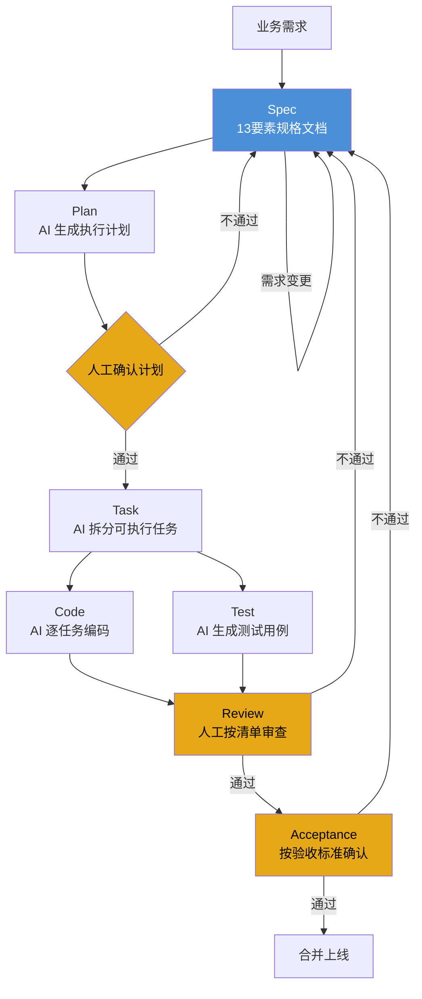
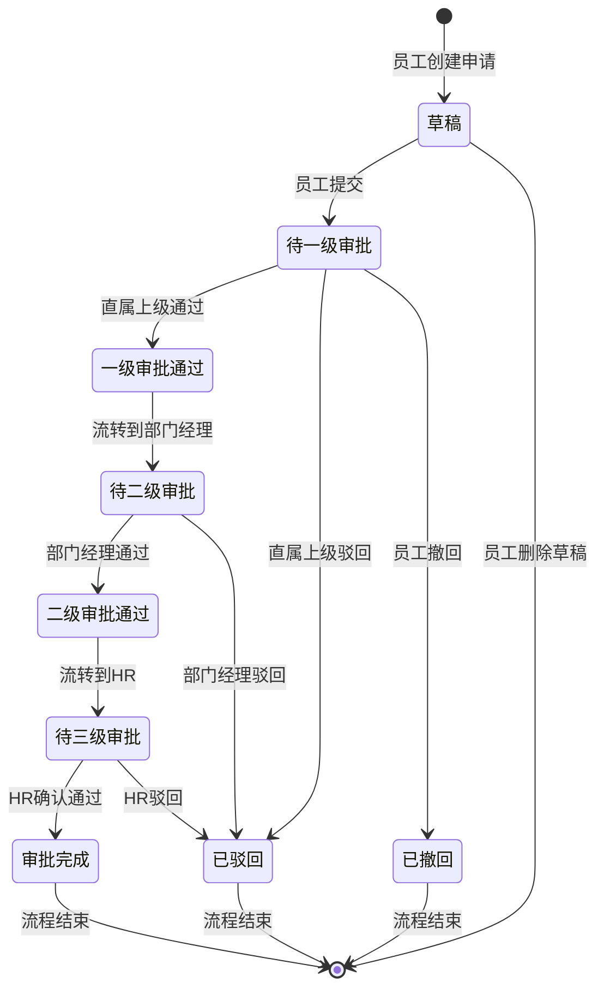

# 第五章：Spec-Driven Development 企业实战手册

## 本章要解决的问题

读完本章，你会获得：

- 一份可直接用于企业项目的 Spec 编写规范和 13 要素模板
- 一个完整的"内部审批流模块"Spec 示例，包含 DDL、API、状态机、权限矩阵
- 一条从 Spec 到代码到验收的完整流水线操作指南
- AI 执行提示词、任务拆分范例、测试用例、Review 清单，全部可复用
- Spec 维护策略和 5 个常见误区，避免踩坑

本章不讨论"要不要做 Spec-Driven Development"，只讨论"怎么做"。

---

## 5.1 为什么企业开发不能只靠 Vibe Coding

Vibe Coding 在原型验证、个人工具、一次性脚本这些场景里效率极高。但把它搬进企业项目，三个致命问题会立刻暴露。

### 5.1.1 不可复现

你用自然语言跟 AI 说"写一个审批接口"。今天 AI 生成一套字段名，明天你重新问一遍，AI 生成另一套。今天是 `approval_status`，明天变成 `status`，后天变成 `approval_state`。同一个需求，每次生成结果不同。

企业开发中，一个模块上线后要运行 3-5 年。这期间至少有几十次变更：加字段、改流程、修 bug、做性能优化。如果每次变更都依赖开发者当时的"vibe"，模块会逐渐变成一个不可维护的拼凑体——每个版本的味道都不一样，没有人能说清当前代码对应什么版本的业务规则。

Spec 解决了不可复现问题：**同一份 Spec，不管谁执行、什么时候执行，输出的代码在业务逻辑上一致。**

### 5.1.2 不可审计

银行、医疗、政务领域都有合规审计要求。审计官会问："这个审批流程为什么在 3 月 15 日改成了并行审批？谁批准的？依据什么？"

Vibe Coding 模式下，答案是"我跟 AI 聊了聊，觉得这样更好"——这在审计场景里不可接受。

Spec-Driven Development 模式下，答案是："请看 Spec 文件 `approval-workflow.md` 第 145-167 行，3 月 14 日由产品经理张三提交变更，技术负责人李四 Review 通过，3 月 15 日 AI 基于变更后的 Spec 重新生成了代码模块。Git 历史中有完整的变更记录。"

**Spec 是代码变更的业务依据。审计不看代码，看 Spec。**

### 5.1.3 质量不可控

AI 不会质疑你的需求。你跟 AI 说"如果审批人离职，自动跳过"，AI 就照做。它不会问你："离职审批人的待办单据怎么处理？转给谁？超时怎么办？通知谁？"

这些问题在企业系统中每一个都是生产事故的来源。一个十年经验的 Java 程序员做需求评审时会本能地追问这些，但 AI 不会。

**Vibe Coding 的质量依赖个人经验，Spec-Driven Development 用文档把经验固化了下来。** 13 个要素的 Spec 模板本质上是把一个资深开发的"需求评审脑回路"外化成了一份清单。你不需要每次靠人去想"还有什么没考虑到"，清单帮你兜底。

### 5.1.4 Spec-Driven 的三个核心优势

| 维度 | Vibe Coding | Spec-Driven Development |
|------|------------|------------------------|
| 可复现性 | 每次生成结果不同 | 同 Spec 同结果 |
| 可审计性 | 无据可查 | Spec 是审计证据 |
| 质量保证 | 依赖个人经验 | Spec 模板兜底 |
| 团队协作 | 单人模式 | Spec 是团队契约 |
| AI 利用率 | AI 做决策 | AI 做执行 |
| 变更成本 | 反向工程代码 | 改 Spec 重新生成 |

一句话总结：**Vibe Coding 把 AI 当决策者用，Spec-Driven Development 把 AI 当执行者用。人类做决策，AI 做执行，这是企业场景的正确分工。**

---

## 5.2 Spec-Driven Development 全流程



三个黄色节点是人工介入点。Spec-Driven 不是全自动，而是在关键决策点让人把关。

**各阶段说明：**

| 阶段 | 输入 | 输出 | 谁做 | 耗时占比 |
|------|------|------|------|---------|
| Spec | 业务需求 | 13 要素规格文档 | 人 | 30% |
| Plan | Spec | 执行计划 | AI | 5% |
| Task | Plan | 任务列表 | AI | 5% |
| Code | Task | 代码 | AI | 25% |
| Test | Spec | 测试用例 | AI | 10% |
| Review | 代码+测试 | Review 结论 | 人 | 20% |
| Acceptance | Review 结论 | 验收确认 | 人 | 5% |

人在写 Spec、Review、验收三个阶段投入最大精力。AI 负责从 Spec 到代码的执行阶段。**这是把人的精力从编码转移到设计的策略。**

---

## 5.3 Spec 的 13 个要素

以下 13 个要素构成一份完整的企业级 Spec。每个要素用一个真实的"内部审批流模块"示例说明。

### 要素 1：业务背景

说明为什么要做这个功能，解决什么业务痛点。

```markdown
## 业务背景

当前公司内部请假、加班、报销等审批流程全部依赖纸质单据和邮件流转。
存在以下问题：
1. 审批周期长：平均一个请假单需要 2-3 天完成全部审批
2. 流转不透明：申请人无法实时了解单据当前在谁手上
3. 数据难统计：HR 每月手工汇总请假数据，耗时约 1 个工作日
4. 合规风险：纸质单据易丢失，审计时无法提供完整记录

本模块实现电子化审批流，一期覆盖请假审批，后续扩展至加班、报销。
```

### 要素 2：功能范围

明确做什么、不做什么。这比做什么更重要。

```markdown
## 功能范围

### 本期范围（V1.0）

- 请假申请提交
- 三级审批流程（直属上级 → 部门经理 → HR 确认）
- 审批通过 / 驳回 / 撤回
- 待办列表和已办列表
- 审批进度查看
- 审批结果邮件通知

### 明确不做（V1.0）

- 加班审批、报销审批（二期）
- 移动端审批（二期）
- 会签 / 或签（二期）
- 审批转交 / 代理审批（二期）
- 与钉钉/企业微信集成（二期）
- 审批流程可视化配置（二期）
- 审批时效 SLA 统计（二期）
```

### 要素 3：用户角色

定义谁使用系统，有什么权限。

```markdown
## 用户角色

| 角色 | 编码 | 说明 | 权限范围 |
|------|------|------|---------|
| 普通员工 | EMPLOYEE | 所有在职员工 | 提交请假申请、查看自己的申请、撤回待审批的申请 |
| 直属上级 | MANAGER | 部门内带团队的管理者 | 审批直属下级的请假申请（一级审批） |
| 部门经理 | DEPT_MANAGER | 部门负责人 | 审批部门内员工的请假申请（二级审批） |
| HR | HR | 人力资源部门员工 | 最终确认请假申请（三级审批）、查看全公司请假数据 |
| 系统管理员 | ADMIN | IT 运维人员 | 配置审批流程、查看所有数据、手动干预异常单据 |
```

### 要素 4：业务流程

正常流程和异常流程，用 Mermaid 状态图表示。



### 要素 5：API Spec

完整的 RESTful API 定义。这是给 AI 的最精确的执行指令。

```markdown
## API Spec

Base URL: `/api/v1/approval`

### 5.1 提交请假申请

POST /api/v1/approval/leaves

Request:
{
  "leaveType": "ANNUAL",          // 请假类型: ANNUAL-年假, SICK-病假, PERSONAL-事假
  "startDate": "2026-07-05",      // 开始日期
  "endDate": "2026-07-07",        // 结束日期
  "durationDays": 3,              // 请假天数
  "reason": "年假休息"             // 请假事由
}

Response (201):
{
  "code": 0,
  "message": "success",
  "data": {
    "approvalId": 10001,
    "status": "PENDING_L1",
    "createdAt": "2026-07-01T10:30:00"
  }
}

错误码:
- 40001: 请假天数超过可用年假余额
- 40002: 请假日期与已有申请重叠
- 40003: 开始日期晚于结束日期
- 40004: 存在相同时间段的待审批申请(防重复提交)

### 5.2 审批操作

POST /api/v1/approval/leaves/{approvalId}/approve

Request:
{
  "action": "APPROVE",            // APPROVE-通过, REJECT-驳回
  "comment": "同意请假",           // 审批意见(驳回时必填)
  "rejectReason": null            // 驳回原因码: INSUFFICIENT_HANDOVER-交接不充分, NOT_URGENT-非紧急, OTHER-其他
}

Response (200):
{
  "code": 0,
  "message": "success",
  "data": {
    "approvalId": 10001,
    "status": "PENDING_L2",       // 流转到下一级
    "approvedAt": "2026-07-01T14:00:00"
  }
}

错误码:
- 40101: 无审批权限(审批人不匹配)
- 40102: 当前状态不可审批(状态机校验失败)
- 40103: 驳回时必须填写审批意见
- 40104: 重复审批(该节点已被处理)

### 5.3 撤回申请

POST /api/v1/approval/leaves/{approvalId}/withdraw

Request: (无请求体)

Response (200):
{
  "code": 0,
  "message": "success",
  "data": {
    "approvalId": 10001,
    "status": "WITHDRAWN",
    "withdrawnAt": "2026-07-01T11:00:00"
  }
}

错误码:
- 40201: 只能撤回待审批状态的申请(已驳回/已完成/已撤回不可撤回)
- 40202: 只能撤回自己的申请
- 40203: 已超过一级审批后不可撤回(流程已进入二级审批)

### 5.4 待办列表

GET /api/v1/approval/leaves/pending?page=1&size=20

Response (200):
{
  "code": 0,
  "message": "success",
  "data": {
    "total": 5,
    "list": [
      {
        "approvalId": 10001,
        "applicantName": "王小明",
        "applicantDept": "研发部",
        "leaveType": "ANNUAL",
        "startDate": "2026-07-05",
        "endDate": "2026-07-07",
        "durationDays": 3,
        "reason": "年假休息",
        "status": "PENDING_L1",
        "currentApprover": "直属上级-张三",
        "createdAt": "2026-07-01T10:30:00"
      }
    ]
  }
}

### 5.5 审批进度查询

GET /api/v1/approval/leaves/{approvalId}/progress

Response (200):
{
  "code": 0,
  "message": "success",
  "data": {
    "approvalId": 10001,
    "status": "PENDING_L2",
    "nodes": [
      {
        "level": 1,
        "levelName": "直属上级审批",
        "approverName": "张三",
        "status": "APPROVED",
        "comment": "同意",
        "operatedAt": "2026-07-01T14:00:00"
      },
      {
        "level": 2,
        "levelName": "部门经理审批",
        "approverName": "李四",
        "status": "PENDING",
        "comment": null,
        "operatedAt": null
      },
      {
        "level": 3,
        "levelName": "HR确认",
        "approverName": "待分配",
        "status": "WAITING",
        "comment": null,
        "operatedAt": null
      }
    ]
  }
}

### 5.6 已办列表

GET /api/v1/approval/leaves/processed?page=1&size=20

Response (200):
{
  "code": 0,
  "message": "success",
  "data": {
    "total": 12,
    "list": [
      {
        "approvalId": 9998,
        "applicantName": "赵六",
        "leaveType": "SICK",
        "status": "COMPLETED",
        "myAction": "APPROVED",
        "myComment": "同意",
        "operatedAt": "2026-06-30T09:00:00"
      }
    ]
  }
}
```

### 要素 6：数据模型 Spec

完整的 DDL，字段、类型、索引、约束全部写清楚。AI 拿这个能直接生成 Entity 和 Mapper。

```sql
-- 请假申请表
CREATE TABLE `leave_application` (
  `id` BIGINT NOT NULL AUTO_INCREMENT COMMENT '主键',
  `applicant_id` BIGINT NOT NULL COMMENT '申请人ID',
  `applicant_name` VARCHAR(64) NOT NULL COMMENT '申请人姓名(冗余,便于查询展示)',
  `applicant_dept_id` BIGINT NOT NULL COMMENT '申请人部门ID',
  `applicant_dept_name` VARCHAR(128) NOT NULL COMMENT '申请人部门名称(冗余)',
  `leave_type` VARCHAR(32) NOT NULL COMMENT '请假类型: ANNUAL-年假,SICK-病假,PERSONAL-事假',
  `start_date` DATE NOT NULL COMMENT '开始日期',
  `end_date` DATE NOT NULL COMMENT '结束日期',
  `duration_days` DECIMAL(4,1) NOT NULL COMMENT '请假天数(支持半天:0.5)',
  `reason` VARCHAR(500) NOT NULL COMMENT '请假事由',
  `status` VARCHAR(32) NOT NULL DEFAULT 'DRAFT' COMMENT '状态: DRAFT-草稿,PENDING_L1-待一级审批,APPROVED_L1-一级通过,PENDING_L2-待二级审批,APPROVED_L2-二级通过,PENDING_L3-待三级审批,REJECTED-已驳回,WITHDRAWN-已撤回,COMPLETED-已完成',
  `current_level` TINYINT NOT NULL DEFAULT 0 COMMENT '当前审批级别: 0-草稿,1-一级,2-二级,3-三级',
  `created_at` DATETIME NOT NULL DEFAULT CURRENT_TIMESTAMP COMMENT '创建时间',
  `updated_at` DATETIME NOT NULL DEFAULT CURRENT_TIMESTAMP ON UPDATE CURRENT_TIMESTAMP COMMENT '更新时间',
  `submitted_at` DATETIME DEFAULT NULL COMMENT '提交时间',
  `completed_at` DATETIME DEFAULT NULL COMMENT '完成时间',
  `version` INT NOT NULL DEFAULT 1 COMMENT '乐观锁版本号',
  PRIMARY KEY (`id`),
  INDEX `idx_applicant_id` (`applicant_id`),
  INDEX `idx_status` (`status`),
  INDEX `idx_current_level` (`current_level`),
  INDEX `idx_submitted_at` (`submitted_at`),
  INDEX `idx_applicant_status` (`applicant_id`, `status`)
) ENGINE=InnoDB DEFAULT CHARSET=utf8mb4 COMMENT='请假申请表';

-- 审批记录表
CREATE TABLE `approval_record` (
  `id` BIGINT NOT NULL AUTO_INCREMENT COMMENT '主键',
  `application_id` BIGINT NOT NULL COMMENT '关联请假申请ID',
  `approval_level` TINYINT NOT NULL COMMENT '审批级别: 1,2,3',
  `approval_level_name` VARCHAR(64) NOT NULL COMMENT '审批级别名称: 直属上级审批,部门经理审批,HR确认',
  `approver_id` BIGINT NOT NULL COMMENT '审批人ID',
  `approver_name` VARCHAR(64) NOT NULL COMMENT '审批人姓名',
  `action` VARCHAR(16) DEFAULT NULL COMMENT '操作: APPROVE-通过,REJECT-驳回',
  `comment` VARCHAR(500) DEFAULT NULL COMMENT '审批意见',
  `reject_reason` VARCHAR(32) DEFAULT NULL COMMENT '驳回原因码',
  `status` VARCHAR(16) NOT NULL DEFAULT 'WAITING' COMMENT '审批状态: WAITING-待审批,PENDING-审批中,APPROVED-已通过,REJECTED-已驳回,SKIPPED-已跳过',
  `operated_at` DATETIME DEFAULT NULL COMMENT '操作时间',
  `created_at` DATETIME NOT NULL DEFAULT CURRENT_TIMESTAMP COMMENT '创建时间',
  PRIMARY KEY (`id`),
  INDEX `idx_application_id` (`application_id`),
  INDEX `idx_approver_id` (`approver_id`),
  INDEX `idx_approver_status` (`approver_id`, `status`),
  CONSTRAINT `fk_record_application` FOREIGN KEY (`application_id`) REFERENCES `leave_application` (`id`)
) ENGINE=InnoDB DEFAULT CHARSET=utf8mb4 COMMENT='审批记录表';

-- 审批流配置表(一期硬编码,二期支持动态配置)
CREATE TABLE `approval_flow_config` (
  `id` BIGINT NOT NULL AUTO_INCREMENT COMMENT '主键',
  `flow_type` VARCHAR(32) NOT NULL COMMENT '流程类型: LEAVE-请假,OVERTIME-加班,EXPENSE-报销',
  `approval_level` TINYINT NOT NULL COMMENT '审批级别',
  `approval_level_name` VARCHAR(64) NOT NULL COMMENT '审批级别名称',
  `approver_role` VARCHAR(32) NOT NULL COMMENT '审批人角色: MANAGER-直属上级,DEPT_MANAGER-部门经理,HR-HR',
  `is_active` TINYINT NOT NULL DEFAULT 1 COMMENT '是否启用: 0-禁用,1-启用',
  `sort_order` TINYINT NOT NULL COMMENT '排序',
  PRIMARY KEY (`id`),
  UNIQUE KEY `uk_flow_level` (`flow_type`, `approval_level`),
  INDEX `idx_flow_type` (`flow_type`)
) ENGINE=InnoDB DEFAULT CHARSET=utf8mb4 COMMENT='审批流配置表';

-- 请假额度表
CREATE TABLE `leave_balance` (
  `id` BIGINT NOT NULL AUTO_INCREMENT COMMENT '主键',
  `employee_id` BIGINT NOT NULL COMMENT '员工ID',
  `year` SMALLINT NOT NULL COMMENT '年份',
  `leave_type` VARCHAR(32) NOT NULL COMMENT '请假类型',
  `total_days` DECIMAL(5,1) NOT NULL COMMENT '总额度',
  `used_days` DECIMAL(5,1) NOT NULL DEFAULT 0.0 COMMENT '已用天数',
  `created_at` DATETIME NOT NULL DEFAULT CURRENT_TIMESTAMP COMMENT '创建时间',
  `updated_at` DATETIME NOT NULL DEFAULT CURRENT_TIMESTAMP ON UPDATE CURRENT_TIMESTAMP COMMENT '更新时间',
  PRIMARY KEY (`id`),
  UNIQUE KEY `uk_employee_year_type` (`employee_id`, `year`, `leave_type`),
  INDEX `idx_employee_id` (`employee_id`)
) ENGINE=InnoDB DEFAULT CHARSET=utf8mb4 COMMENT='请假额度表';
```

### 要素 7：权限规则

角色-操作矩阵，直接把 RBAC 规则写清楚。

```markdown
## 权限规则

| 操作 | EMPLOYEE | MANAGER | DEPT_MANAGER | HR | ADMIN |
|------|----------|---------|-------------|-----|-------|
| 提交请假申请 | Y | Y | Y | Y | N |
| 查看自己的申请 | Y | Y | Y | Y | Y |
| 撤回自己的申请 | Y(仅待审批) | Y(仅待审批) | Y(仅待审批) | Y(仅待审批) | N |
| 一级审批 | N | Y(仅直属下级) | N | N | N |
| 二级审批 | N | N | Y(仅本部门) | N | N |
| 三级审批 | N | N | N | Y | N |
| 查看待办列表 | N | Y | Y | Y | N |
| 查看已办列表 | Y(自己的) | Y(审批过的) | Y(审批过的) | Y(审批过的) | Y(全部) |
| 查看审批进度 | Y(自己的) | Y(参与审批的) | Y(参与审批的) | Y(参与审批的) | Y(全部) |
| 手动干预异常单据 | N | N | N | N | Y |
| 查看全公司请假统计 | N | N | N | Y | Y |

权限校验实现规则:
1. 一级审批: approval_record.approver_id == 当前用户ID AND 当前用户是申请人的直属上级(通过组织架构接口校验)
2. 二级审批: approval_record.approver_id == 当前用户ID AND 当前用户是申请人的部门经理
3. 三级审批: 当前用户角色 == HR AND approval_record.status == 'WAITING'
4. 撤回: application.applicant_id == 当前用户ID AND application.status IN ('PENDING_L1')
5. 越级校验: 不允许跳过级别审批,每一级必须按顺序流转
```

### 要素 8：状态流转规则

完整的状态机定义，包括合法流转和非法流转。

```markdown
## 状态流转规则

### 合法流转

| 当前状态 | 触发动作 | 目标状态 | 触发角色 |
|---------|---------|---------|---------|
| DRAFT(草稿) | 员工提交 | PENDING_L1(待一级审批) | EMPLOYEE |
| DRAFT(草稿) | 员工删除 | (记录删除) | EMPLOYEE(仅自己的) |
| PENDING_L1 | 直属上级通过 | APPROVED_L1(一级通过) | MANAGER |
| PENDING_L1 | 直属上级驳回 | REJECTED(已驳回) | MANAGER |
| PENDING_L1 | 员工撤回 | WITHDRAWN(已撤回) | EMPLOYEE(仅自己的) |
| APPROVED_L1 | 系统自动流转 | PENDING_L2(待二级审批) | SYSTEM |
| PENDING_L2 | 部门经理通过 | APPROVED_L2(二级通过) | DEPT_MANAGER |
| PENDING_L2 | 部门经理驳回 | REJECTED(已驳回) | DEPT_MANAGER |
| APPROVED_L2 | 系统自动流转 | PENDING_L3(待三级审批) | SYSTEM |
| PENDING_L3 | HR确认通过 | COMPLETED(已完成) | HR |
| PENDING_L3 | HR驳回 | REJECTED(已驳回) | HR |

### 非法流转（代码必须拦截）

| 非法操作 | 拦截逻辑 |
|---------|---------|
| 非直属上级审批一级 | 校验审批人与申请人的汇报关系 |
| 已完成的单据再次审批 | 校验 status != COMPLETED |
| 已驳回的单据再次审批 | 校验 status != REJECTED |
| 跳过一级直接二级审批 | 校验 current_level == 1 且上一级 status == APPROVED |
| 重复审批同一级别 | 校验 approval_record.status == 'WAITING' 或 'PENDING' |
| 撤回已进入二级审批的单据 | 校验 current_level == 1 |
| 在非待审批状态下撤回 | 校验 status == 'PENDING_L1' |

### 状态流转实现原则

1. 状态变更必须在事务内完成（状态更新 + 审批记录写入 + 额度扣减必须原子）
2. 所有状态变更前必须乐观锁校验（`version` 字段）
3. 状态变更失败返回具体错误码，不返回"系统错误"
4. 禁止直接通过 SQL UPDATE 修改状态，必须通过 Service 层状态机方法
```

### 要素 9：异常处理规则

每一种异常场景的处理方式，不做假设。

```markdown
## 异常处理规则

### E1: 重复提交
- 场景: 员工提交了一个请假申请后,在审批通过前再次提交相同时段的申请
- 检测: 查询 `leave_application` 表中 `applicant_id = 当前用户 AND (start_date, end_date) 与本次重叠 AND status NOT IN ('REJECTED', 'WITHDRAWN')`
- 处理: 返回错误码 40004,前端提示"您已有一个相同时段的请假申请正在审批中"

### E2: 越级审批
- 场景: 部门经理试图在一级审批未完成时直接审批
- 检测: 查询 `leave_application.current_level` 和 `approval_record` 中上一级的审批状态
- 处理: 返回错误码 40102,提示"尚未流转到当前审批级别"

### E3: 撤回时机
- 场景: 员工在直属上级已通过后试图撤回(单据已进入二级审批)
- 检测: `leave_application.current_level >= 2`
- 处理: 返回错误码 40203,提示"申请已进入下一级审批,无法撤回。如需撤回请联系当前审批人驳回"

### E4: 审批人不匹配
- 场景: A 部门的经理审批了 B 部门员工的申请
- 检测: 校验 `approval_record.approver_id` 是否等于该级别应审批的人
- 处理: 返回错误码 40101

### E5: 请假额度不足
- 场景: 员工申请的年假天数 > `leave_balance.used_days - leave_balance.total_days`
- 检测: 提交时查询额度表
- 处理: 返回错误码 40001,附带可用余额信息

### E6: 审批流配置不存在
- 场景: 请假类型的审批流配置被误删
- 检测: 提交时查询 `approval_flow_config` WHERE `flow_type = 'LEAVE' AND is_active = 1`
- 处理: 返回错误码 50001,提示"审批流配置异常,请联系管理员"

### E7: 并发审批
- 场景: 两个 HR 同时对同一单据点击确认
- 检测: 乐观锁 `version` 字段
- 处理: 后者更新失败,返回错误码 40102,提示"该申请已被其他人处理"

### E8: 数据一致性
- 场景: 审批通过后扣减额度失败(数据库连接断开等)
- 检测: 事务回滚
- 处理: 整个审批操作回滚,不出现"审批通过但额度没扣"的情况
```

### 要素 10：日志审计规则

```markdown
## 日志审计规则

以下操作必须记录审计日志(存入 `audit_log` 表或输出到日志文件):

| 操作 | 必记字段 | 日志级别 |
|------|---------|---------|
| 提交申请 | 操作人ID、申请ID、操作时间、客户端IP | INFO |
| 审批通过 | 操作人ID、申请ID、审批级别、操作时间、客户端IP | INFO |
| 审批驳回 | 操作人ID、申请ID、审批级别、驳回原因、操作时间、客户端IP | WARN |
| 撤回申请 | 操作人ID、申请ID、撤回时间、客户端IP | INFO |
| 状态异常变更 | 操作人ID、申请ID、异常状态、原状态、操作时间 | ERROR |
| 权限校验失败 | 操作人ID、尝试的操作、目标申请ID、时间、IP | WARN |
| 额度扣减 | 员工ID、扣减天数、扣减后余额、关联申请ID | INFO |

审计日志格式规范:
```
[AUDIT] {timestamp} | {userId} | {action} | {applicationId} | {detail} | {result} | {ip}
```

示例:
```
[AUDIT] 2026-07-01T14:00:00 | 1001 | APPROVE_L1 | 10001 | approved by manager | SUCCESS | 192.168.1.100
[AUDIT] 2026-07-01T14:05:00 | 1003 | APPROVE_L2_FAIL | 10001 | permission denied: not applicant's dept manager | FAIL | 192.168.1.101
```
```

### 要素 11：非功能约束

```markdown
## 非功能约束

### 性能
- 提交申请接口: P99 < 500ms
- 待办列表查询: P99 < 200ms(单页 20 条)
- 审批操作: P99 < 300ms
- 审批进度查询: P99 < 200ms
- 并发支持: 至少 100 QPS 下不降级

### 安全
- 所有接口必须通过 JWT Token 鉴权
- 审批操作必须校验 CSRF Token
- 敏感字段(请假事由等)在日志中脱敏处理
- SQL 必须使用参数化查询,禁止拼接 SQL
- API 响应不暴露内部异常堆栈

### 可用性
- 服务可用性: 99.9%(月度)
- 审批流配置缓存: 使用 Redis 缓存,TTL=300s,DB 变更后主动失效
- 邮件通知异步发送,不阻塞主流程,发送失败不导致审批失败

### 数据
- `leave_application` 和 `approval_record` 必须在一个事务中写入
- 审批流配置缓存与数据库数据必须一致(通过主动失效保证)
- 审批记录不可物理删除(软删除或不可删除)
```

### 要素 12：验收标准

```markdown
## 验收标准

### 功能验收

1. [ ] 员工能成功提交请假申请,系统正确计算请假天数
2. [ ] 员工在待审批状态下能成功撤回申请
3. [ ] 员工无法撤回已进入二级审批的申请
4. [ ] 直属上级能看到直属下级的待审批申请,审批通过后流转到部门经理
5. [ ] 直属上级驳回后,流程结束,员工收到驳回通知
6. [ ] 部门经理能看到本部门经过一级审批的申请,审批通过后流转到 HR
7. [ ] HR能看到所有待三级审批的申请,确认通过后流程结束,额度正确扣减
8. [ ] 任何非审批人不显示该申请在待办列表中(权限隔离)
9. [ ] 审批进度查询正确显示每一级的审批状态和审批人信息
10. [ ] 重复提交被正确拦截,返回明确提示
11. [ ] 越级审批被正确拦截,返回明确提示
12. [ ] 并发审批(两人同时审批同一单据)被乐观锁正确拦截
13. [ ] 请假额度不足时提交被正确拦截

### 性能验收

1. [ ] 100 QPS 并发下,提交申请 P99 < 500ms
2. [ ] 100 QPS 并发下,审批操作 P99 < 300ms
3. [ ] 2000 条待办数据下,待办列表查询 P99 < 200ms
4. [ ] 压测期间无数据库死锁、无连接池耗尽

### 安全验收

1. [ ] 未登录用户无法访问任何接口
2. [ ] 普通员工无法调用审批接口审批他人的申请
3. [ ] 部门经理无法审批非本部门员工的申请
4. [ ] SQL 注入测试不通过(XSS 和 SQL 注入各至少 10 条测试用例)
5. [ ] 审计日志完整记录所有关键操作
```

### 要素 13：不做什么

重复要素 2 中"明确不做"的内容，但这里是最终版确认，防止范围蔓延。

```markdown
## 不做什么（最终确认）

以下功能不在本期范围内，即使开发过程中发现"实现起来不复杂"也不要做：

1. 加班审批、报销审批 —— 流程配置已预留扩展点,但本期不实现
2. 移动端适配 —— 本期仅支持 PC Web
3. 会签/或签 —— 审批逻辑预留了多审批人字段,但本期仅实现单人审批
4. 审批转交 —— 审批人请假或离职时的审批转交功能
5. 审批时效 SLA —— 统计每个审批节点的平均耗时
6. 与第三方 IM 集成 —— 钉钉/企业微信/飞书的审批消息推送
7. 审批模板自定义 —— 可视化拖拽配置审批流程

原因: 以上功能各有独立的业务需求和技术复杂度,混入本期会导致:
- Spec 膨胀,AI 理解偏差增大
- 任务拆分边界模糊
- 验收标准不可控
- 上线时间不可预测

列入二期 Spec,独立评估和实施。
```

---

## 5.4 审批流模块完整 Spec 示例

以上 13 个要素合并即构成一份完整的 Spec。在实际项目中，所有要素合并到一个 `spec/approval-workflow.md` 文件中，作为 AI 执行的唯一输入。

完整 Spec 文件输出到 `spec/` 目录，与代码仓库放在一起:

```
project-root/
├── spec/
│   └── approval-workflow.md    ← 本 Spec 文件
├── src/
│   └── main/java/com/company/approval/
│       ├── controller/          ← AI 根据 API Spec 生成
│       ├── service/             ← AI 根据业务逻辑生成
│       ├── entity/              ← AI 根据 DDL 生成
│       ├── repository/          ← AI 生成数据访问层
│       └── config/              ← AI 生成安全配置
└── src/test/java/               ← AI 根据验收标准生成测试
```

---

## 5.5 给 AI 的执行提示词

以下是给 Claude Code 或 Codex 的完整执行提示词，直接复制即可使用。

```markdown
## 任务

请阅读 `spec/approval-workflow.md` 文件，基于这份 Spec 完成以下工作。

## 执行步骤

### 第一步：分析 Spec，输出执行计划

1. 列出所有需要创建的文件清单（Controller、Service、Entity、Repository、Config、Test）
2. 标注文件之间的依赖关系（例如 Service 依赖 Entity 和 Repository）
3. 给出建议的开发顺序
4. 在执行计划中标注每个文件对应的 Spec 章节

### 第二步：确认计划

输出计划后等待我确认，不要直接开始编码。

### 第三步：逐任务编码

确认后，按以下顺序逐个实现：

1. **数据模型层**: Entity 类、Repository 接口
   - 对照 Spec 要素 6 "数据模型 Spec" 的 DDL
   - 使用 JPA 注解,字段名用驼峰映射数据库下划线
   - 必须实现乐观锁(version 字段)

2. **异常和枚举层**: 状态枚举、错误码枚举、异常类
   - 对照 Spec 要素 8 "状态流转规则"
   - 对照 Spec 要素 5 "API Spec" 的错误码定义

3. **DTO 层**: Request/Response DTO
   - 对照 Spec 要素 5 "API Spec" 的 JSON 结构
   - 使用 Bean Validation 注解校验入参

4. **业务逻辑层**: Service 层
   - 对照 Spec 要素 4 "业务流程"
   - 对照 Spec 要素 7 "权限规则"
   - 对照 Spec 要素 8 "状态流转规则"
   - 对照 Spec 要素 9 "异常处理规则"
   - 状态流转方法必须加 @Transactional,使用乐观锁

5. **控制器层**: Controller
   - 对照 Spec 要素 5 "API Spec"
   - 对照 Spec 要素 7 "权限规则" 实现接口鉴权
   - 全局异常处理器捕获并转换异常为统一响应格式

6. **配置层**: 安全配置、审计日志配置
   - 对照 Spec 要素 7 "权限规则" 配置角色拦截
   - 对照 Spec 要素 10 "日志审计规则"
   - 对照 Spec 要素 11 "非功能约束" 的安全要求

7. **测试层**: 单元测试、集成测试
   - 对照 Spec 要素 12 "验收标准"
   - 每个验收标准至少一个测试用例
   - 异常场景覆盖所有 Spec 要素 9 的 E1-E8

### 第四步：自检

编码完成后，检查以下内容：
- 所有 API 端点是否都有对应实现
- 所有状态流转是否都有校验
- 所有异常场景是否都有处理
- 所有审计日志是否都有记录
- 所有权限是否都有校验

## 约束

- 使用 Spring Boot 3.x + Java 17 + JPA + MySQL
- Layered architecture: Controller → Service → Repository
- 所有 Service 方法必须有事务边界
- 所有对外 API 统一返回 `ApiResponse<T>` 格式: `{ code, message, data }`
- 禁止直接修改 `leave_application.status` 字段,必须通过状态机方法
- 所有 SQL 使用参数化查询
- 禁止在代码中硬编码中文提示信息,使用 i18n 消息文件
- 审批人判断必须通过组织架构服务接口(先写一个 mock 实现)
```

---

## 5.6 AI 任务拆分结果示例

AI 收到上述提示词后，第一步应输出类似以下的执行计划：

```markdown
## 执行计划

### 文件清单

| 序号 | 文件 | 类型 | 依赖 | 对应 Spec 章节 |
|------|------|------|------|---------------|
| 1 | `LeaveApplication.java` | Entity | 无 | 要素 6 (数据模型) |
| 2 | `ApprovalRecord.java` | Entity | 无 | 要素 6 |
| 3 | `ApprovalFlowConfig.java` | Entity | 无 | 要素 6 |
| 4 | `LeaveBalance.java` | Entity | 无 | 要素 6 |
| 5 | `LeaveApplicationRepository.java` | Repository | 1 | 要素 6 |
| 6 | `ApprovalRecordRepository.java` | Repository | 2 | 要素 6 |
| 7 | `LeaveBalanceRepository.java` | Repository | 4 | 要素 6 |
| 8 | `LeaveStatus.java` | 枚举 | 无 | 要素 8 (状态流转) |
| 9 | `ApprovalAction.java` | 枚举 | 无 | 要素 5 (API) |
| 10 | `ErrorCode.java` | 枚举 | 无 | 要素 5 (错误码) |
| 11 | `BusinessException.java` | 异常 | 10 | 要素 9 (异常处理) |
| 12 | `SubmitLeaveRequest.java` | DTO | 8 | 要素 5 (API) |
| 13 | `ApproveRequest.java` | DTO | 9 | 要素 5 |
| 14 | `LeaveApplicationVO.java` | VO(Response) | 8 | 要素 5 |
| 15 | `ApprovalProgressVO.java` | VO(Response) | 8 | 要素 5 |
| 16 | `ApiResponse.java` | 通用响应 | 无 | 要素 5 |
| 17 | `LeaveApplicationService.java` | Service | 1-7, 8-11 | 要素 4,7,8,9 |
| 18 | `ApprovalFlowService.java` | Service | 3, 8 | 要素 4,8 |
| 19 | `OrgService.java` (接口) | Service | 无 | 要素 7 (权限) |
| 20 | `OrgServiceMockImpl.java` | Service实现 | 19 | 要素 7 |
| 21 | `AuditLogService.java` | Service | 无 | 要素 10 (审计) |
| 22 | `LeaveController.java` | Controller | 17, 12-16 | 要素 5 (API) |
| 23 | `GlobalExceptionHandler.java` | ControllerAdvice | 11, 16 | 要素 5,9 |
| 24 | `SecurityConfig.java` | Config | 无 | 要素 7,11 |
| 25 | `LeaveApplicationServiceTest.java` | Test | 17 | 要素 12 (验收) |

### 依赖图

```
Layer 0 (无依赖): Entity×4, 枚举×3, ApiResponse, SecurityConfig
Layer 1 (依赖Layer0): Repository×3, DTO×3, VO×2, BusinessException, OrgService接口
Layer 2 (依赖Layer1): LeaveApplicationService, ApprovalFlowService, AuditLogService, OrgServiceMockImpl
Layer 3 (依赖Layer2): LeaveController, GlobalExceptionHandler
Layer 4 (依赖Layer3): Test×N
```

### 开发顺序

按 Layer 0 → 1 → 2 → 3 → 4 的顺序实现，同一层内的文件无依赖可并行。

预计总文件数: 25+ 个文件，AI 编码时间: 约 5-10 分钟。
```

---

## 5.7 测试用例

基于验收标准，AI 应生成以下测试用例(以 JUnit 5 + Mockito 为例):

```java
@SpringBootTest
@AutoConfigureMockMvc
class LeaveApplicationServiceTest {

    // ========== 正常流程测试 ==========

    @Test
    @DisplayName("TC01: 员工提交请假申请 - 正常流程")
    void shouldSubmitLeaveApplicationSuccessfully() {
        // Given: 员工有足够年假余额,提交合法申请
        // When: 调用 submitLeave()
        // Then: 返回申请ID,状态为 PENDING_L1,创建一级审批记录
    }

    @Test
    @DisplayName("TC02: 三级审批完整流程 - 全部通过")
    void shouldCompleteFullApprovalFlow() {
        // Given: 已提交的申请(PENDING_L1)
        // When: 直属上级通过 → 部门经理通过 → HR确认通过
        // Then: 状态依次流转,最终 COMPLETED,额度正确扣减,审批记录完整
    }

    @Test
    @DisplayName("TC03: 员工撤回待审批申请")
    void shouldWithdrawPendingApplication() {
        // Given: PENDING_L1 状态的申请
        // When: 申请人调用 withdraw()
        // Then: 状态变为 WITHDRAWN
    }

    // ========== 异常流程测试 ==========

    @Test
    @DisplayName("TC04: 重复提交拦截")
    void shouldRejectDuplicateApplication() {
        // Given: 已有相同时段的 PENDING_L1 申请
        // When: 再次提交相同时段的申请
        // Then: 抛出 BusinessException,错误码 40004
    }

    @Test
    @DisplayName("TC05: 越级审批拦截")
    void shouldRejectSkipLevelApproval() {
        // Given: PENDING_L1 状态的申请
        // When: 部门经理(非直属上级)尝试审批
        // Then: 抛出 BusinessException,错误码 40102
    }

    @Test
    @DisplayName("TC06: 审批人不匹配拦截")
    void shouldRejectNonAuthorizedApprover() {
        // Given: A部门员工的申请在 PENDING_L1
        // When: B部门经理尝试审批
        // Then: 抛出 BusinessException,错误码 40101
    }

    @Test
    @DisplayName("TC07: 已进入二级审批后撤回拦截")
    void shouldRejectWithdrawAfterLevel2() {
        // Given: APPROVED_L1 状态(已进入二级)的申请
        // When: 申请人调用 withdraw()
        // Then: 抛出 BusinessException,错误码 40203
    }

    @Test
    @DisplayName("TC08: 已完成申请不可再次审批")
    void shouldRejectApproveCompletedApplication() {
        // Given: COMPLETED 状态的申请
        // When: 尝试审批
        // Then: 抛出 BusinessException,错误码 40102
    }

    @Test
    @DisplayName("TC09: 请假额度不足拦截")
    void shouldRejectWhenInsufficientBalance() {
        // Given: 员工年假余额为 1 天
        // When: 提交 3 天年假申请
        // Then: 抛出 BusinessException,错误码 40001
    }

    @Test
    @DisplayName("TC10: 并发审批乐观锁拦截")
    void shouldHandleConcurrentApproval() {
        // Given: 两个 HR 同时对同一 PENDING_L3 单据操作
        // When: 第一个成功,第二个尝试更新
        // Then: 第二个抛出 OptimisticLockException,错误码 40102
    }

    @Test
    @DisplayName("TC11: 驳回时必须填写意见")
    void shouldRequireCommentOnRejection() {
        // Given: PENDING_L1 申请
        // When: 审批人驳回但 comment 为空
        // Then: 抛出 BusinessException,错误码 40103
    }

    // ========== 权限测试 ==========

    @Test
    @DisplayName("TC12: 普通员工无法审批他人的申请")
    void shouldRejectEmployeeActAsApprover() {
        // Given: 普通员工(角色 EMPLOYEE)
        // When: 尝试调用审批接口
        // Then: 403 Forbidden 或抛出权限异常
    }

    @Test
    @DisplayName("TC13: 员工只能看到自己的申请")
    void shouldOnlyShowOwnApplications() {
        // Given: 员工A和员工B各有申请
        // When: 员工A查询申请列表
        // Then: 只返回员工A的申请
    }
}
```

共计 13 个核心测试用例，覆盖正常流程、异常流程和权限隔离。每个用例对应验收标准中的一项或多项。

---

## 5.8 人工 Review 清单

以下清单用于 Review AI 生成的代码。逐项检查，通过打勾。

### 数据模型 Review

- [ ] Entity 类字段是否与 DDL 完全一致(字段名、类型、注释)
- [ ] JPA 关系映射是否正确(@OneToMany, @ManyToOne 等)
- [ ] 乐观锁 @Version 注解是否正确添加在 `version` 字段上
- [ ] `@Enumerated(EnumType.STRING)` 是否正确用于状态字段
- [ ] `@CreatedDate` / `@LastModifiedDate` 审计注解是否正确配置
- [ ] 索引是否在 Entity 上通过 `@Table(indexes = {...})` 声明

### 业务逻辑 Review

- [ ] 状态流转方法是否加了 `@Transactional`
- [ ] 状态变更前是否做了乐观锁校验
- [ ] 审批权限校验是否调用了组织架构服务(不是硬编码 superiorId)
- [ ] 撤回逻辑是否正确校验了 `current_level == 1`
- [ ] 驳回逻辑是否强制要求 comment 非空
- [ ] 额度扣减是否与状态变更在同一个事务内
- [ ] 审批通过后是否正确创建了下一级审批记录(approval_record 插入)
- [ ] 审批拒绝后是否正确更新了当前审批记录状态
- [ ] 是否有防止重复提交的检查
- [ ] 是否有防止越级审批的检查
- [ ] 是否有防止重复审批同一节点的检查

### API 层 Review

- [ ] 端点路径是否与 Spec 完全一致
- [ ] Request DTO 是否有 Bean Validation 注解(@NotNull, @NotEmpty 等)
- [ ] Response 结构是否与 Spec 定义一致(字段名、嵌套结构)
- [ ] 错误码是否使用了 Spec 定义的枚举值而非魔法数字
- [ ] 全局异常处理器是否正确捕获 BusinessException 并返回统一格式
- [ ] 是否配置了 CORS 和 CSRF 保护

### 安全 Review

- [ ] 所有端点是否都经过 JWT 鉴权(除登录接口外)
- [ ] 审批接口是否校验了操作人与审批人的匹配关系
- [ ] 查询接口是否做了数据权限隔离(员工只看自己的,经理只看下级的)
- [ ] 是否有 SQL 拼接(全量搜索 `+` 字符串拼接)
- [ ] 审计日志是否记录了客户端 IP
- [ ] 敏感数据(请假事由)是否在日志中脱敏

### 测试 Review

- [ ] 每个验收标准是否至少有一个对应的测试用例
- [ ] 8 种异常场景(E1-E8)是否全部覆盖
- [ ] 权限隔离的边界测试是否充分
- [ ] 并发测试是否存在(乐观锁)
- [ ] 测试数据是否清理(避免污染其他测试)

### 通用 Review

- [ ] 代码是否遵循项目编码规范(包名、命名约定)
- [ ] 是否有未使用的导入、变量、方法
- [ ] 注释是否精确(没有"TODO"、"FIXME"标记,除非是计划中的)
- [ ] 日志级别是否合理(INFO/WARN/ERROR)
- [ ] 是否有硬编码的配置值(应从 application.yml 读取)

---

## 5.9 Spec 维护策略

### 5.9.1 Spec 是代码的"源代码"

Spec 和代码的关系是：**Spec 是主,代码是从。** 就像 Java 源码和 class 文件的关系——你改的是源码,编译生成 class 文件。你不会手动改 class 文件。

同样,你改的是 Spec,AI "编译"生成代码。永远不要让代码变成比 Spec 更权威的真相来源。

### 5.9.2 变更流程

当需求变更时,执行以下流程：

```
需求变更请求
    ↓
更新 Spec 对应章节(要素 1-13)
    ↓
标注变更点(使用 Git 的 diff 即可)
    ↓
将 Spec diff 提供给 AI,要求增量修改代码
    ↓
AI 生成代码变更
    ↓
运行全部测试(确认存量功能无损)
    ↓
Review + 验收
    ↓
合并 Spec 和代码变更(同一个 commit)
```

关键原则：**Spec 变更和代码变更必须在同一个 commit 中。** 不允许"先改代码,回头补 Spec"的流程。Git 历史中,Spec 的 diff 就是这次变更的业务说明。

### 5.9.3 版本管理

Spec 文件纳入 Git 版本管理,与代码放在同一个仓库。版本规则：

- Spec 文件本身不维护版本号(V1.0、V2.0 这种放在文件名里的)
- 每次业务变更自然形成 Spec 的版本历史
- 重大变更(如审批流从三级变为四级)在 Spec 变更 commit 中使用 `[MAJOR]` 标记
- 小改动(如字段新增、错误码补充)不做额外标记

### 5.9.4 防止 Spec 腐烂

Spec 腐烂是指:代码被直接修改了,但 Spec 没有同步更新。久而久之,Spec 变成废纸。

防止方案:

1. **CI 中加入 Spec-Code 一致性检查**: 解析 Spec 中的 API 定义,对比代码中的 Controller 注解,不一致则 CI 失败。这个检查脚本可以自己写(不难,正则匹配即可)或用工具。
2. **Code Review 阻断**: Review 时发现代码变更没有对应的 Spec 变更,直接驳回。
3. **新人入职第一课**: 明确告知"先改 Spec,再改代码",违反者 Code Review 不通过。
4. **AI 辅助同步**: 定期让 AI 读取代码和 Spec,输出一致性报告,标注不一致的地方。

### 5.9.5 Spec 复用

一个写得好的 Spec 可以复用到同类模块。请假审批流 Spec 的 80% 内容可以直接作为加班审批流 Spec 的模板:

- 要素 1-3(业务背景、功能范围、用户角色): 重写
- 要素 4(业务流程): 调整审批级别
- 要素 5(API Spec): 复制端点结构,修改路径和字段
- 要素 6(数据模型): 复用审批记录表和配置表,新增加班相关字段
- 要素 7-13: 大部分可复用,微调

---

## 5.10 常见误区

### 误区 1: Spec 写得越细越好

**错误做法**: 把 Spec 写成代码的"自然语言翻译",每个 if-else 都写进去。

**问题**: Spec 过于冗长,没人读,维护成本极高。AI 读大量冗余信息反而可能抓不住重点。

**正确做法**: Spec 是契约,描述"做什么"和"不做什么",不描述"怎么做"。实现细节(缓存策略、数据库连接池配置、具体算法的选择)留给 AI 和开发者判断。

**判断标准**: 一份 Spec 如果超过 5000 字,大概率写得太细了。本章的审批流 Spec 约 4000 字,已足够 AI 生成完整代码。

---

### 误区 2: Spec 写完就不用改了

**错误做法**: 花 3 天写一份完美 Spec,然后冻结,接下来的开发过程中完全参照 Spec,发现问题也不改。

**问题**: 开发过程中会发现 Spec 的疏漏。坚持不改会导致两个后果:要么代码照着有问题的 Spec 实现了错误功能,要么代码偏离了 Spec 而 Spec 没有更新(腐烂的开始)。

**正确做法**: Spec 是第一版就足够好,而不是完美。开发过程中发现 Spec 问题,先改 Spec,再改代码。用敏捷的方式迭代 Spec,每次 sprint 结束 Spec 都比开始时更准确。

---

### 误区 3: AI 生成的代码不需要 Review

**错误做法**: Spec 写好了,AI 生成的代码直接合入,理由是"AI 是按 Spec 写的,Spec 是对的所以代码也是对的"。

**问题**: 
- AI 可能误解 Spec 中的歧义表述
- AI 可能漏实现 Spec 中的某些规则(特别是异常处理)
- AI 可能有技术实现上的问题(性能、安全、事务边界)
- AI 不会主动质疑 Spec 中的逻辑矛盾

**正确做法**: AI 是执行者,人是审查者。Review 清单(见 5.8 节)必须逐项检查。Review 不需要像传统 Code Review 那样细看每行代码,但必须覆盖关键业务逻辑和安全检查。

---

### 误区 4: 小需求不需要写 Spec

**错误做法**: "就加一个导出按钮,直接让 AI 写就行了,写 Spec 比写代码还久"。

**问题**: 
- 累计 20 个"小需求"后,系统没有一个地方能查到这个导出按钮的业务规则(导出哪些字段?权限怎么控制?数据量限制多少?)
- 3 个月后产品经理问"为什么导出要限制 10000 条",没人记得当时怎么定的
- 新人接手时要靠口口相传

**正确做法**: 区分 Spec 的粒度。
- 大模块(如审批流): 完整的 13 要素 Spec
- 中型功能(如导出报表): 精简版 Spec,包含要素 1,2,5,12(业务背景、功能范围、API Spec、验收标准)
- 小改动(如加字段): Spec 就是在 commit message 中写清楚就够了

但原则不变: **任何功能变更,都必须有可追溯的业务描述。**

---

### 误区 5: 把 Spec 当成瀑布流程的"需求文档"

**错误做法**: 找一个"需求分析师"写完 Spec,丢给开发团队(或 AI),"你们照着做就行"。

**问题**: 这是把敏捷开发退回了瀑布模式。写 Spec 的人不了解技术约束,写代码的人不了解业务决策的上下文。最终 Spec 和代码两张皮。

**正确做法**: Spec 由开发人员(或 AI 辅助开发人员)编写。因为写 Spec 的人需要同时理解:
- 业务的真实需求
- 技术实现的可行性和成本
- 现有系统的约束

这三者缺一不可。在 AI 辅助开发模式下,最理想的 Spec 作者是**有业务理解能力的资深开发**,而不是纯业务人员。

---

## 5.11 本章小结

Spec-Driven Development 的本质是**把人的精力从编码转移到设计**。在 AI 能高效写出合格代码的时代,人的核心价值不再是"会写代码",而是"知道该写什么样的代码"。

本章给出的 13 要素 Spec 模板、审批流完整示例、AI 执行提示词、测试用例、Review 清单,构成了一套可直接在企业项目中落地的 Spec-Driven 工作流。

五个核心原则请记住:

1. **Spec First**: 先写 Spec,再写代码
2. **Spec as Contract**: Spec 是唯一真相来源,人与 AI 的共同契约
3. **Spec as Driver**: Spec 驱动 AI 生成代码、测试、Review
4. **Human at Decision Points**: 人在 Spec 编写、Review、验收三个节点把关
5. **Spec Never Rots**: Spec 和代码同仓库、同 commit,永不分离

下一章将进入 **Plan Mode 配合 Spec** 的实践,展示如何用 Claude Code 的 Plan Mode 将 Spec 转成可执行的多步骤计划。
