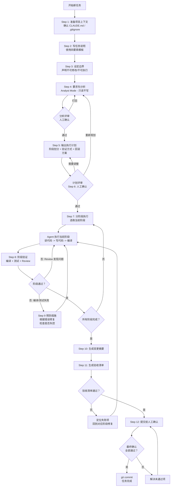

# 第7章 Claude Code / Codex / Cursor 等 Coding Agent 使用 SOP

## 本章要解决的问题

写完这一章，你会获得一套直接可用的操作手册：

1. **一套经过验证的 12 步 SOP**，覆盖从任务准备到代码提交的完整流程。不是理论框架，是每一步做什么、为什么这样做、常见错误是什么。
2. **8 个可复制的提示词模板**，每个都是完整、可直接粘贴使用的 prompt，覆盖项目分析、计划输出、小步执行、边界约束、编译修复、测试生成、代码审查、变更总结八个关键场景。
3. **5 条安全红线**，每条都附带违反后的真实后果。在银行、医疗这类强监管行业中，这些红线不是建议，是底线。
4. **一张完整的执行循环图**，包含安全检查门控，适合贴在团队 Wiki 上作为新成员的上手参考。

目标读者是企业 IT 团队中实际使用 Coding Agent 的开发者和技术管理者。假设你已经用过 Claude Code、Codex 或 Cursor 中的至少一种，本章不教基础安装和配置，直接讲怎么用得规范、安全、可重复。

---

## Agentic Coding 是什么

**Agentic Coding 是一种让 AI 自主完成多步骤编程任务的工作模式：AI 拿到任务目标后，自己读取代码、规划步骤、执行修改、运行验证、观察结果、修正错误，形成「计划-执行-验证-修复」的闭环迭代，直到任务完成或遇到无法解决的阻塞。** 它和代码补全、Chat 编程的本质区别在于：前者是你在驾驶、AI 帮你踩油门；后者是你给目的地、AI 自己开车。本章余下内容不展开理论，聚焦于如何在实际项目中把这套流程标准化、可复制、可审计。

---

## 标准操作流程 (SOP) -- 12 步

以下 12 个步骤构成一套完整的 Agentic Coding 操作规范。每一步都包含三个要素：**做什么**（具体操作）、**为什么重要**（不做的后果）、**常见错误**（最容易踩的坑）。

---

### Step 1: 准备项目上下文

**做什么：**

在启动任何 Agent 任务之前，确认两件事：

1. **CLAUDE.md / AGENTS.md 存在且内容最新。** 这个文件是 Agent 的「项目入职文档」。至少应该包含：项目用途（一句话）、技术栈（语言/框架/关键依赖）、目录结构说明、代码风格约定、AI 协作规则（允许改什么、禁止改什么）。
2. **.gitignore 正确配置。** 确保以下内容被排除：`node_modules/`、`target/`、`.env`（含密钥的）、`*.log`、IDE 配置文件（`.idea/`、`.vscode/`）、构建产物目录。

**为什么重要：**

没有 CLAUDE.md，Agent 每次启动都会从零猜测项目结构，产生大量不必要的文件读取，浪费上下文窗口。更糟的是，它可能用错误的框架假设（比如项目用 MyBatis-Plus，它当成 JPA 去写），产出风格完全不搭的代码。

.gitignore 配置不当是安全事件的高发来源。Agent 执行 `grep` 搜索代码模式时，如果 `.env` 不在 .gitignore 里，Agent 会在搜索结果中看到生产环境的数据库密码和 API 密钥。

**常见错误：**

- 把 CLAUDE.md 当成一次性文档写完就不管了。项目演进后（换了分页方案、改了异常处理模式、新增了模块），CLAUDE.md 过时，Agent 按照旧信息做决策。
- .gitignore 只忽略了构建产物，忘了 IDE 配置和日志文件。Agent 搜索代码时会在 `.idea/` 和 `logs/` 里浪费时间，还能读到调试日志中泄露的敏感数据。
- CLAUDE.md 写得太笼统（「本项目是一个 Spring Boot 应用」），缺乏 Agent 做决策真正需要的细节：用什么做分页、异常怎么包装、日志用哪个框架、测试用 JUnit 几。

**示例：Spring Boot 项目的上下文检查清单**

在启动 Agent 任务前，逐项确认以下清单：

```markdown
## Agent 任务启动前检查清单

### CLAUDE.md 检查
- [ ] 项目用途是否一句话说清
- [ ] 技术栈是否列出：Spring Boot 版本、Java 版本、Maven/Gradle
- [ ] 关键依赖是否列出：ORM（MyBatis-Plus / JPA / JdbcTemplate）、分页方式、缓存方案
- [ ] 目录结构是否说明：Controller/Service/Repository 在哪、DTO 放哪、工具类放哪
- [ ] 代码风格是否有约定：返回值包装类名、异常处理方式、日志规范、命名惯例
- [ ] AI 协作规则是否声明：允许/禁止修改的目录、禁止执行的命令

### .gitignore 检查
- [ ] *.log、target/、node_modules/ 是否被忽略
- [ ] .env、application-*.yml 中生产配置是否被忽略
- [ ] .idea/、.vscode/、*.iml 是否被忽略
- [ ] 构建产物目录（target/、build/、dist/）是否被忽略
```

---

### Step 2: 写任务说明

**做什么：**

在发给 Agent 之前，按以下模板组织你的任务说明。模板不是形式主义 -- 四个要素各解决一类信息缺口：

```markdown
## 任务说明模板

### 1. 做什么
[用 1-3 句话描述功能需求。不要写技术方案，写用户视角的结果。]

### 2. 在哪里
[指定涉及的文件路径、包名或模块。越精确越好。]

### 3. 技术约束
[明确技术选型、编码规范：用什么 ORM 方式、异常怎么包装、分页怎么实现。]

### 4. 怎么算完成
[可验证的验收条件：编译通过、指定测试通过、不引入新的警告、代码风格符合现有规范。]
```

**为什么重要：**

模糊的任务说明是 Agent 产出质量问题的最主要原因。Agent 不是人类，不会主动追问「你说改查询接口，是改 Controller 还是改 Service 还是都改？」-- 它会在最宽泛的范围内自由发挥，结果往往是你没让它改的地方它也改了。

**好的任务说明 vs 差的任务说明：**

差的：

```
改一下用户查询接口，支持按部门筛选。
```

Agent 不知道：部门筛选是精确匹配还是模糊匹配？参数名叫 departmentId 还是 deptId？现有查询用什么方式（JPA Criteria、MyBatis XML、QueryDSL）？需要改哪些文件？测试要不要一起改？

好的：

```
修改 UserController 中 GET /users/search 接口，新增部门筛选功能。

### 做什么
- 查询参数 DTO 中新增 departmentId 字段（Long 类型，非必填）
- departmentId 为精确匹配（=），不是模糊搜索（LIKE）
- 当 departmentId 为 null 时不作为筛选条件（保持现有全部查询行为）

### 在哪里
- UserController.java: com.example.user.controller 包
- UserQueryDTO.java: com.example.user.dto 包
- UserServiceImpl.java: com.example.user.service.impl 包
- UserRepository.java: com.example.user.repository 包（如需新增查询方法）

### 技术约束
- 使用现有的 JpaSpecificationExecutor 动态查询方式，不引入新的查询框架
- 返回值保持现有的 Result<PageResult<UserVO>> 包装格式
- 参数校验用 @Valid + JSR-303 注解，和现有 Controller 风格一致
- 日志记录方式参照现有的 log.info("查询用户列表, 条件: {}", dto)

### 怎么算完成
- mvn compile -q 通过
- mvn test -Dtest=UserControllerTest 通过
- 手动验证：传 departmentId=3 返回该部门用户，不传则返回全部
```

---

### Step 3: 设定边界

**做什么：**

在任务说明之外，用一段独立的边界声明告诉 Agent 不能改什么。这段话和任务说明分开写，因为它是不随任务变化的固定约束。

**边界约束模板：**

```markdown
## 边界约束

### 绝对不允许修改的文件
- src/main/resources/application.yml
- src/main/resources/application-prod.yml
- pom.xml（除非我明确要求）
- docker-compose.yml
- 任何 .sql 文件（数据库迁移脚本）

### 绝对不允许执行的操作
- git push / git push --force / git rebase
- mvn deploy / mvn release
- 任何涉及数据库连接的写操作（INSERT/UPDATE/DELETE/DROP/ALTER）
- rm -rf 或以任何方式删除 .git 目录

### 代码层面约束
- 不要重构现有代码，只做任务要求的修改
- 不要修改现有方法的签名（除非任务明确要求）
- 不要修改现有测试用例的逻辑（只能新增测试或在任务要求时适配参数）
- 不要引入新的第三方依赖（除非我明确同意）
- 保持现有的异常处理和日志记录风格
```

**为什么重要：**

Agent 的目标是「完成任务」，它不天然理解项目的安全边界和团队约定。没有明确的边界声明，Agent 在某些场景下会做出超出预期的行为：比如它发现 pom.xml 里某个依赖版本太旧，顺手帮你升了级，结果引入不兼容的 API 变更；或者它觉得某个配置文件应该按它的理解整理一下，结果覆盖了生产环境的数据库连接串。

边界声明还有一个重要作用：当 Agent 的建议触碰到边界时，你不需要费口舌解释为什么不能改 -- 直接告诉它「这违反了边界约束」。

**常见错误：**

- 边界声明写在 CLAUDE.md 里但本次任务中不重复提。Agent 的上下文足够大时会「遗忘」早期读取的内容，关键约束应该在任务开始时显式声明。
- 只约束了「不能改什么」，没有约束「不能执行什么」。Agent 通过 Bash 执行命令的能力和你给它的一样大 -- 它能在编译脚本里加参数、在运行时改环境变量、执行不安全的网络请求。

---

### Step 4: 要求先分析不要改代码

**做什么：**

在让 Agent 实际修改代码之前，先让它进入「只读分析模式」。用以下 prompt 启动这一阶段：

```markdown
## Analyst Mode Prompt

在修改任何代码之前，请先完成以下分析并向我汇报：

1. 列出所有需要修改的文件（完整路径）
2. 对每个文件，说明：当前状态是什么、需要改成什么、为什么这样改
3. 识别任何可能受影响的现有功能（例如：修改了 UserService 的 findByDepartmentId 方法签名后，哪些 Controller 调用了它）
4. 列出你认为存在风险的地方：不确定的业务逻辑、缺少测试覆盖的关键路径、可能引起级联修改的地方
5. 如果有多个可选技术方案，列出选项并给出推荐

在分析阶段不要修改任何文件。我确认分析结果后你再开始写代码。
```

**为什么重要：**

这一步是整个 SOP 中性价比最高的环节。花 2-5 分钟审阅 Agent 的分析，可以避免 15-30 分钟的代码返工。Agent 的分析会暴露出它是否理解了任务的全部含义 -- 如果它漏掉了某个需要修改的文件，或者选了一个和你预期不同的技术方案，在这个阶段纠正成本几乎为零。

**如何判断 AI 的分析是否到位：**

| 检查项 | 过关标准 | 不过关的表现 |
|--------|----------|-------------|
| 文件覆盖完整性 | 列出的文件包含了所有需要改动的位置（包括调用方） | 漏掉了某个需要适配的 Controller 或 Mapper XML |
| 方案合理性 | 技术方案和项目现有实践一致 | 提出了一个项目中不用的技术（如项目用 MyBatis，它建议 JPA Criteria） |
| 风险识别 | 指出了至少 1-2 个需要注意的点 | 风险部分为空或写「无风险」 |
| 调用链分析 | 改了 A 方法，指出了所有调用 A 的地方 | 改了方法签名，没提调用方需要适配 |

**常见错误：**

- 跳过这一步，直接让 Agent 开始写代码。看起来省了 2 分钟，后面花 20 分钟把它改错的地方改回来。
- 分析通过了就让它全量执行，没有在分析阶段拆分子任务（见 Step 7）。
- Agent 的分析写得很有道理，你没有认真看就点了确认。Agent 的文字能力远强于代码能力 -- 它的分析读起来都很合理，但实际执行可能完全不同。

---

### Step 5: 让 AI 输出计划

**做什么：**

分析通过后，让 Agent 输出一份结构化的执行计划。

**Plan 输出格式要求：**

```markdown
## 请按以下格式输出执行计划

### 执行阶段（按顺序）

每个阶段包含：
- **阶段名称**：[简短描述]
- **涉及文件**：[文件列表]
- **具体操作**：[新建/修改/删除 + 具体做什么]
- **验证方式**：[这个阶段怎么确认做对了]
- **预计风险**：[这个阶段最可能出问题的地方]
- **回滚方式**：[如果这一步做错了，怎么回到上一步状态]

### 依赖关系
[哪些阶段可以并行，哪些必须顺序执行]

### 测试策略
- 现有的哪些测试可能受影响需要重新运行
- 需要新增哪些测试用例（类型 + 场景描述）
```

**Plan 评审清单：**

在批准计划之前，对照以下清单逐项检查：

- [ ] 计划的步骤数是否和任务复杂度匹配（一个简单 CRUD 应该有 3-5 个阶段，不该有 15 个）
- [ ] 每个阶段的验证方式是否明确、可执行（「手动测试」不算验证方式，「运行 UserControllerTest」才算）
- [ ] 依赖关系是否合理（先建实体、再写 Service、最后 Controller -- 数据结构先行）
- [ ] 回滚方式是否具体（「git checkout -- 文件名」或「撤销某个 Edit」）
- [ ] 是否包含了你没提到的文件（查一下为什么，可能是合理的关联修改，也可能是 Agent 自作主张）
- [ ] 测试策略是否覆盖了新增功能的正常路径和至少一个异常路径

---

### Step 6: 人工确认计划

**做什么：**

阅读 Agent 输出的计划，做出三类决策：

1. **批准的**：方案正确，可以执行。
2. **需要调整的**：方向对，但某个具体做法需要修改。给出精确的修改要求，不要笼统说「再想想」。
3. **需要重做的**：方向就错了，或者方案和项目实践严重不符。给出为什么不对，让 Agent 重新规划。

**确认什么、不确认什么：**

确认的是架构决策和技术方案 -- 这些你必须把关：
- 分层设计是否正确（Controller -> Service -> Repository 这个链条有没有断裂）
- 数据模型是否合理（字段类型、关联关系、索引策略）
- 技术选型是否符合项目约定（分页方式、ORM 方式、异常处理模式）
- 有没有不可接受的副作用（改了共享的工具类、动了全局配置）

不需要逐行审阅 Agent 写的代码细节 -- 那是 Step 8 的事：
- 不在这一步纠结变量命名、日志格式、注释风格
- 不在这一步检查代码能不能编译 -- 执行阶段 Agent 自己会验证
- 不在这一步对比具体的代码实现和你的写法偏好 -- 除非涉及架构层面

**什么时候该让 AI 重新规划：**

以下情况必须打回重做，不要抱着「先执行看看，不对再改」的心态：

- **方案和项目技术栈冲突。** 比如项目用 MyBatis-Plus 做 ORM，Agent 的方案里写了 `@Query` 注解（那是 Spring Data JPA 的）。
- **漏掉了关键技术步骤。** 比如新增数据库字段但没有数据库迁移脚本的计划。
- **判断技术上不可行。** 比如 Agent 提议「用 WebSocket 实现一个简单的表单提交」-- 过度设计。
- **计划里有你明确说「不许动」的文件。** 这说明 Agent 没有遵守 Step 3 的边界约束。

**常见错误：**

- 计划没仔细看就批了。Agent 的 plan 文字表达往往比代码实现更流畅，读起来都有道理。但「读起来有道理」和「在项目里能跑对」是两回事。
- 因为某个小细节（比如一个字段命名）打回整个计划，浪费一轮对话。小问题标注「执行时把 xxx 改成 yyy」即可，不用推翻重来。
- 在计划阶段纠结性能优化。「这里要不要加缓存」这种问题放到执行和测试阶段再判断，有了实际数据和测试结果再决定。

---

### Step 7: 分阶段执行

**做什么：**

按 Agent 输出的计划分阶段执行，每完成一个阶段就暂停、验证、确认，然后进入下一个阶段。不要让 Agent 一次性执行所有步骤。

**任务粒度控制表：**

| 任务规模 | 代码量 | 涉及文件数 | 预计 Agent 执行时间 | 你 Review 时间 | 适合场景 |
|----------|--------|-----------|-------------------|---------------|---------|
| **微** | < 30 行 | 1 个 | 30 秒 - 1 分钟 | 30 秒 | 改一个方法、加一个字段、修一个 null 检查 |
| **小** | 30-100 行 | 1-2 个 | 1-3 分钟 | 1-2 分钟 | 新增一个 DTO、加一个 Service 方法、写一个简单测试 |
| **中** | 100-300 行 | 3-5 个 | 3-8 分钟 | 3-5 分钟 | 完整接口三层开发、一个包含多场景的测试类 |
| **大** | 300+ 行 | 5+ 个 | 8-20 分钟 | 5-10 分钟 | 新模块、多表关联功能。强烈建议拆成 2-3 个中任务 |

**每阶段的时间预估：**

实际执行中，Agent 的一个中等任务（100-300 行，3-5 个文件）大约需要 3-8 分钟。你不必盯着屏幕等 -- 可以让 Agent 在后台执行，完成后通知你。但每阶段的间隔不要超过 30 分钟：间隔太久你会忘记上一阶段的上下文，Review 效率急剧下降。

**为什么重要：**

Agent 一次性执行的步骤越多，单个步骤的质量越低。这不是模型能力的问题，是上下文管理的问题：当 Agent 在同一个对话轮次中生成 400 行代码后，它对前面 200 行的精确记忆已经开始衰减，后面的代码质量会下降。

分阶段执行也让你能尽早发现问题。如果第 1 个阶段的实体设计就有问题，在第 5 个阶段才发现，前面 4 个阶段的代码全要返工。

**常见错误：**

- 把 3 个小任务合并成 1 个中任务「节省 Review 时间」。合并后 Review 难度不是 3 倍，是 10 倍 -- 你需要同时关注更多文件、更多关联、更多潜在问题。
- 阶段之间不独立。如果第 2 阶段的代码依赖第 1 阶段的一个临时设计，第 1 阶段改了这个设计后第 2 阶段默默崩溃。确保每个阶段的输出是稳定的、可被后续阶段信赖的。

---

### Step 8: 每阶段编译 / 测试 / Review

**做什么：**

每完成一个阶段，执行三轮验证：

**第一轮：编译验证**

```bash
# Java / Maven 项目
mvn compile -q

# Java / Gradle 项目
./gradlew compileJava

# TypeScript 项目
npx tsc --noEmit

# Python 项目（语法检查）
python -m py_compile <修改的文件>
```

只要编译/语法检查不通过，这个阶段就是未完成状态。不要进入下一阶段。

**第二轮：测试运行**

```bash
# 先跑受影响的已有测试（范围小、速度快）
mvn test -Dtest=UserControllerTest,UserServiceTest -q

# 确认已有测试全部通过后，再跑新增的测试
mvn test -Dtest=NewFeatureTest -q

# 如果 Agent 新增了测试但没跑，明确要求它运行
# 「运行你新增的测试类，确认全部通过」
```

**第三轮：代码 Review**

每阶段 Review 重点（按优先级排序）：

1. **业务逻辑正确性。** 条件和边界判断是否覆盖了所有情况？null 值、空集合、非法参数是否有处理？
2. **副作用。** 这个修改是否影响了不该影响的代码？如果 Agent 改了共享的工具类，跑一下所有使用该工具类的测试。
3. **风格一致性。** 命名是否和现有代码一致（getById 还是 findById？status 还是 state？）？返回值包装、异常处理、日志记录格式是否和项目风格匹配？
4. **多余的代码。** Agent 经常加一些「看起来很合理但实际不需要」的东西：没有调用的 import、永远不会执行的 if 分支、写了一半没完成的 helper 方法。这些删掉。
5. **安全合规。** 硬编码的密钥/TODO 注释里的敏感信息、日志中是否打印了用户密码/手机号。

**为什么重要：**

编译 + 测试 + Review 三层验证每层拦下不同的问题。编译拦下的是语法和类型错误；测试拦下的是逻辑回归和边界条件错误；Review 拦下的是风格、安全和架构层面的问题。跳过任何一层都意味着某种类型的问题会漏到下一阶段。

**常见错误：**

- 只跑编译不跑测试，认为「编译过了就是对的」。Agent 的代码编译通过的概率很高（语法正确），但逻辑错误（空指针、边界漏处理、返回值类型不对）编译阶段完全不会报。
- 只跑 Agent 新增的测试，不跑受影响的老测试。Agent 改了一个共享方法，老测试默默失败了，你这个阶段确认通过，下一个阶段才发现，回滚成本大增。
- Review 只看了 diff 没看上下文。Agent 改了第 45 行，你看 diff 觉得没问题，但实际上第 45 行改完后和第 78 行的逻辑冲突了。Review 时至少打开完整文件，扫一眼改动附近的逻辑。

---

### Step 9: 防止大范围乱改

**做什么：**

识别并预防 Agent 容易「失控」的 5 种场景。

**5 种 AI 容易「失控」的情况：**

| 场景 | 典型表现 | 根本原因 | 预防措施 |
|------|----------|----------|----------|
| **1. 依赖版本升级冲动** | Agent 改着改着跟你说「pom.xml 里 spring-boot 版本太旧了，我帮你升级到 3.x」。一升级，十几个文件报错。 | Agent 在搜索代码时看到了版本号，认为「旧 = 不好」 | 边界约束明确禁止修改 pom.xml；任务说明显式声明「不要升级任何依赖」 |
| **2. 连锁重构** | 你让它改 UserService 的一个方法，它顺便把整个 Service 的重试逻辑、缓存注解、异常处理全部重写了一遍。 | Agent 看到「不够好」的代码时会触发优化冲动，它不理解「没坏就不要修」的原则 | 在边界约束中声明「不要重构现有代码，只做任务要求的修改」；如果它开始偏离，立即叫停 |
| **3. 过度抽象** | 你让它写两个相似的查询方法，它给你生成了一个 GenericQueryBuilder<T, R> 抽象基类、一个 QuerySpecification 接口、三个实现类。 | Agent 的泛化能力在代码生成场景下变成劣势 -- 它天然倾向「写一次、到处复用」 | 任务说明中明确：「不要引入新的抽象层，保持和现有代码的模式一致」 |
| **4. 幻觉式实现** | Agent 写了一段代码调用 `userRepository.findByDepartmentIdAndStatusIn()`，但你的 Repository 里根本没用 Spring Data JPA 的方法命名查询，用的是 MyBatis XML。Agent 凭空生成了一个不存在的 API。 | Agent 根据训练数据中的常见模式生成了代码，没有验证该方法是否真的存在 | 要求 Agent 在执行修改前先确认方法签名（Read 目标文件的相关部分）；编译验证会在第一时间发现这类错误 |
| **5. 上下文丢失后猜测** | 长对话到第 8 轮，Agent 开始「忘记」前面约定的技术方案，生成的代码回到默认模式。比如前面约定用 `Result<T>` 包装返回值，第 8 轮它直接返回了裸的 `Page<UserVO>`。 | 对话轮次越多，Agent 对早期上下文的注意力越弱 | 超出 6 轮对话后，在每轮指令中重新声明关键技术约束；或者在长任务的中途开启新对话，把已完成的代码作为新对话的上下文基准 |

**通用预防措施：**

- **每阶段开始前重新声明边界约束。** 不要假设 Agent 记得 Step 3 的内容。一个简单的做法是：每阶段指令前追加一行 `（边界约束和之前一样：不修改 pom.xml、不重构现有代码、不引入新依赖）`。
- **明确告诉 Agent「你只做这个阶段的事」。** 比如「现在只做实体类的字段新增，不要碰 Service 和 Controller」。
- **用 Review 作为最后一道防线。** Step 8 的 Review 不是形式 -- 当你发现 Agent 开始偏离时，Review 是止损点。

---

### Step 10: 生成变更摘要

**做什么：**

所有阶段执行完成后，让 Agent 生成一份结构化的变更摘要。

**变更摘要模板：**

```markdown
## 变更摘要

### 概述
[一段话说明本次变更的目的和范围]

### 修改的文件
| 文件路径 | 操作 | 变更说明 |
|----------|------|----------|
| src/main/java/com/example/user/controller/UserController.java | 修改 | 新增 GET /users/search 接口的 departmentId 查询参数 |
| src/main/java/com/example/user/dto/UserQueryDTO.java | 修改 | 新增 departmentId 字段 |
| src/main/java/com/example/user/service/impl/UserServiceImpl.java | 修改 | 新增 departmentId 精确匹配查询条件 |
| src/main/java/com/example/user/repository/UserRepository.java | 修改 | 新增 findByDepartmentId 方法 |

### 新增的测试
| 测试文件 | 测试场景 | 覆盖的代码路径 |
|----------|----------|---------------|
| UserControllerTest.java | testSearchByDepartment 正常查询 | Controller -> Service -> Repository 完整链路 |
| UserControllerTest.java | testSearchWithoutDepartment 不传条件 | departmentId=null 的行为验证 |
| UserQueryDTOTest.java | testDepartmentIdValidation | DTO 字段校验 |

### 潜在影响范围
- 其他使用 UserQueryDTO 的接口（OrderController 的关联查询）行为不受影响（departmentId 为非必填字段）
- 已有的 UserControllerTest 中 5 个测试用例全部通过，无回归问题

### 未完成事项
- 无

### 建议的 commit message
feat(user): add department filter to user search API

- Add departmentId field to UserQueryDTO (optional, exact match)
- Update UserServiceImpl to apply department filter condition
- Add unit tests for new filter and null-safety
```

**为什么重要：**

变更摘要的作用不是给 Agent 交作业，而是它有几个不可替代的实际用途：

1. **写 commit message。** 摘要里的「建议的 commit message」可以直接用作 `git commit -m` 的内容，省去你手动回顾 diff 再写注释的时间。
2. **代码评审。** 如果你需要同事 review 这次变更，这份摘要可以作为 PR description，让 review 的人不需要自己从 diff 中推断改了什么。
3. **项目记录。** 一个月后你回顾这个功能为什么这样实现，摘要比 git log 更清晰。
4. **审计痕迹。** 在金融、医疗等合规要求高的行业，人机协作的代码变更需要有清晰的记录。变更摘要可以作为「AI 辅助生成」的审计证据。

**常见错误：**

- 让 Agent 自由发挥摘要格式，结果每次的摘要结构不同，查找历史变更时信息散乱。应该固定模板，所有任务的摘要统一格式。
- 只写了改了什么文件，没写为什么这样改。技术决策的理由（为什么用精确匹配而不是模糊搜索）应该记录在摘要的「概述」或「潜在影响范围」部分。

---

### Step 11: 生成验收清单

**做什么：**

让 Agent 根据本次变更生成一份验收清单，供你和 QA（如有）逐项验证。

**验收清单模板：**

```markdown
## 验收清单

### 功能验收
- [ ] 传入 departmentId=3 查询，返回该部门的所有用户
- [ ] 传入 departmentId=null 或不传，返回全部用户（兼容旧行为）
- [ ] 传入不存在的 departmentId=999，返回空列表而非报错
- [ ] 分页参数正常生效（page=1, size=10 应返回 10 条）
- [ ] 其他已有查询条件（keyword、status）仍正常工作

### 兼容性验收
- [ ] 已有接口 GET /users/search 在不传 departmentId 时行为不变
- [ ] 已有测试 UserControllerTest 全部通过

### 异常场景验收
- [ ] departmentId 传入非数字字符串时，返回 400 错误而非 500
- [ ] 数据库连接异常时，返回统一错误格式（和现有异常处理一致）

### 非功能验收
- [ ] 接口响应时间不高于修改前（新增查询条件不应导致性能退化）
- [ ] 日志中不打印用户敏感信息（密码、手机号）
- [ ] 新增代码无硬编码密钥、Token、内网地址

### 文档验收
- [ ] 变更摘要已生成
- [ ] commit message 已准备
- [ ] 如有 API 文档（Swagger/OpenAPI），注解已更新
```

**为什么重要：**

验收清单把「感觉没问题」变成「这些条件全部确认通过」。它是人类和 Agent 之间的契约 -- Agent 宣布任务完成，你按清单逐项验收。如果任何一项不通过，任务就是未完成。

验收清单也是团队协作的工具。如果你们有专门的 QA 人员，这份清单直接成为测试用例的草稿。

**常见错误：**

- 验收清单只覆盖了正常路径，没有覆盖异常路径和边界条件。Agent 生成的验收清单往往会遗漏 null 值、空输入、并发场景。
- 手动补充验收项后忘记标注。验收清单是你和 Agent 共同完善的：Agent 生成初稿，你补充它没想到的验收点。补充后的清单就是最终版本。

---

### Step 12: 提交前人工确认

**做什么：**

在 `git commit` 之前，完成最终确认清单。

**最终确认清单：**

```markdown
## 提交前最终确认

### 代码完整性
- [ ] 所有阶段均已执行完成（没有跳过或半途而废的阶段）
- [ ] 每个阶段的编译都通过
- [ ] 每个阶段的测试（新增 + 已有回归）都通过
- [ ] 每个阶段都经过了人工 Review

### 边界合规
- [ ] 没有修改「边界约束」中标为不允许修改的文件
- [ ] 没有执行「边界约束」中标为不允许执行的操作
- [ ] 没有引入新的第三方依赖（如有，已经过评审批准）

### 安全确认
- [ ] 新增代码中无硬编码密钥、密码、Token
- [ ] 新增代码中无内网 IP、内部域名
- [ ] 日志中不打印用户敏感数据
- [ ] 新增的 SQL 查询使用了参数化（无 SQL 注入风险）

### 品质确认
- [ ] 代码风格与现有项目一致（命名、异常处理、返回值包装、日志格式）
- [ ] 变更摘要已生成并审阅
- [ ] 验收清单已逐项通过
- [ ] commit message 已准备

### 团队沟通（如适用）
- [ ] 如涉及公共模块修改，已通知相关同事
- [ ] 如涉及 API 变更，已更新接口文档
- [ ] 如涉及数据库变更，迁移脚本已就绪且经过 DBA 评审
```

**为什么重要：**

这是最后一道门。人在长时间工作后会疲劳，疲劳时容易跳过某些检查、对某些告警视而不见。最终确认清单的设计目的就是防疲劳错误 -- 在你最想「就这样吧先提交」的时候，强迫你逐项确认。

清单中的每一项都对应着前面某个步骤的输出。如果某个勾打不上，回到对应的步骤重新执行，不要硬提。

**常见错误：**

- 「先提交了再说，反正可以 amend」。这句话在 Agent 辅助开发的场景下特别危险 -- amend 只改 commit message 和作者信息，不会帮你修代码。一个有问题的 commit 合入主分支后，后面所有人都基于有问题的代码继续开发。
- 最后一步赶时间，清单只扫了一眼。整个 12 步 SOP 的价值在最后这一步集中兑现 -- 你省掉了前期多个环节的时间，前提是最后一步你没有跳过去。

---

## Coding Agent 提示词模板库

以下是 8 个完整的、可直接复制粘贴使用的提示词模板。每个模板的中文描述是给你的使用说明，英文部分是发给 Agent 的 prompt 正文。

---

### 模板 1: 项目分析提示词

**用途：** 让 Agent 全面理解项目结构，输出一份结构化的分析报告，不修改任何代码。

```markdown
Analyze this project and give me a structured report. Do NOT modify any files.

## Analysis Requirements

### 1. Project Overview
- What does this project do? (one sentence)
- What is the tech stack? (language, framework, build tool, database)

### 2. Architecture
- Package/module structure and what each package contains
- How are the layers organized? (Controller -> Service -> Repository? Other patterns?)
- How is dependency injection configured?

### 3. Key Patterns
- How does the project handle exceptions? Show the pattern.
- How does the project format API responses? Show the wrapper class structure.
- How does the project do pagination?
- How does the project do validation?
- How are database queries written? (ORM, raw SQL, query builder?)

### 4. Configuration
- Where are configuration files located?
- Which configurations are environment-specific?

### 5. Testing
- What testing framework is used?
- Where are tests located?
- What patterns do existing tests follow?

### 6. AI Collaboration Boundaries (suggest)
- Which directories should an AI agent be allowed to modify?
- Which files should be off-limits?
- Which commands should be forbidden?

Output as a structured markdown report.
```

---

### 模板 2: 修改前计划提示词

**用途：** 在修改代码之前，要求 Agent 先输出执行计划和风险分析。

```markdown
Before writing any code, create an execution plan for the following task.

## Task
[在此插入你的任务说明 -- 使用 Step 2 的模板]

## Plan Requirements

Your plan must include:

### 1. Impact Analysis
- List every file that needs to be modified (full path + current state + target state)
- Identify every existing function/endpoint that calls the code you're changing
- Flag any shared utilities or base classes that might be affected

### 2. Execution Phases (ordered, sequential)
For each phase:
- **Phase name and purpose**
- **Files involved** (list)
- **Specific operations** (create/modify/delete + what exactly)
- **Verification** (how to confirm this phase is done correctly)
- **Estimated risk** (low/medium/high + why)
- **Rollback** (how to undo this phase if something goes wrong)

### 3. Dependencies
- Which phases depend on which others?
- What must be completed before what?

### 4. Test Strategy
- Which existing tests should be re-run after changes?
- What new tests should be written? (scenario + coverage target)

Do NOT start implementing. Wait for my approval of this plan.
```

---

### 模板 3: 小步执行提示词

**用途：** 限制 Agent 一次只执行一个阶段，禁止跨阶段操作。

```markdown
Execute ONLY Phase [N] of the approved plan: [Phase Name]

## Scope Lock
- You are ONLY working on this phase. Do NOT touch files from other phases.
- Do NOT refactor unrelated code you find along the way.
- Do NOT upgrade dependencies or reformat existing code.

## What to Do
[粘贴计划中本阶段的详细内容]

## Boundaries (re-stated)
- Allowed to modify: [列出本阶段涉及的文件路径]
- NOT allowed to modify: pom.xml, application.yml, any config files
- NOT allowed to execute: git push, mvn deploy, database write operations

## After Completion
1. Run compilation: `mvn compile -q`
2. Run affected tests: `mvn test -Dtest=[测试类名] -q`
3. Report:
   - What files were changed (with diff summary)
   - Compilation result
   - Test result (all passed / N failed)
4. Do NOT proceed to the next phase. Wait for my confirmation.
```

---

### 模板 4: 禁止乱改提示词

**用途：** 在 Agent 开始偏离时立刻使用的「刹车」prompt。

```markdown
STOP. You are going beyond the task scope.

## What You Were Asked to Do
[原始任务描述]

## What You Are Doing That Is Out of Scope
[指出 Agent 当前偏离的地方，例如：
- You are refactoring the error handling in the entire Service layer
- You are upgrading the Spring Boot version in pom.xml
- You are creating a new abstraction layer that wasn't requested]

## What to Do Instead
- Revert any out-of-scope changes immediately
- Return to the approved plan, Phase [N]
- Only modify the files listed in the plan
- Do NOT "improve" code you weren't asked to touch

## Principle
"Do not fix what isn't broken." Execute the task, nothing more, nothing less.
```

---

### 模板 5: 编译修复提示词

**用途：** 当 Agent 修改代码后编译失败时，让它根据错误信息精准修复。

```markdown
The code you produced has compilation errors. Fix them.

## Error Output
```
[粘贴 mvn compile 或 tsc 的完整错误输出]
```

## Fix Requirements
1. Read the error messages carefully. Fix the ROOT CAUSE, not the symptoms.
2. Only modify files that have actual compilation errors. Do NOT touch files that compile successfully.
3. After each fix, re-run compilation to verify.
4. Do NOT change any logic -- only fix syntax, types, imports, and missing references.
5. Do NOT introduce new dependencies or workarounds.
6. If an error seems to require a logic change beyond syntax, report it to me instead of guessing.

## Success Criteria
- `mvn compile -q` exits with zero
- No new warnings introduced (compare to pre-change state)
```

---

### 模板 6: 测试生成提示词

**用途：** 让 Agent 为本次修改的代码生成有针对性的测试。

```markdown
Generate tests for the code modified in this task.

## Context
- Files changed: [列出本次修改的所有源代码文件路径]
- Change summary: [简要说明改了什么]

## Test Requirements

### Coverage
- Happy path: at least one test for the primary expected behavior
- Edge cases: null inputs, empty collections, boundary values
- Error handling: invalid inputs, expected exceptions
- Integration: if the change crosses layers, test the full chain

### Style
- Follow the existing test patterns in this project (framework, assertion style, naming convention)
- Use the same test base classes and test utilities as existing tests
- Test method names should describe the scenario: `test[MethodName]_[Scenario]_[ExpectedResult]`

### What NOT to Do
- Do NOT generate tests for unchanged code
- Do NOT generate tests that only check null inputs without verifying business logic
- Do NOT use mocking frameworks or patterns that aren't already used in the project

After generating:
1. Run the new tests: `mvn test -Dtest=[TestClassName] -q`
2. Run existing tests to check for regression: `mvn test -Dtest=[affected test classes] -q`
3. Report results.
```

---

### 模板 7: 代码 Review 提示词

**用途：** 让 Agent 对自己的修改做一轮自我审查，在人工 Review 之前先过一遍。

```markdown
Review the code you just produced. Act as a senior developer reviewing a junior developer's PR.

## Review Scope
[列出本次修改的文件]

## Review Checklist

### Correctness
- Does the logic handle all edge cases? (null, empty, boundary)
- Are there any off-by-one errors, incorrect conditions, or missing early returns?
- Does the code work correctly with the existing codebase, or does it make assumptions about other modules?

### Safety
- Is there any hardcoded secret, token, or internal URL?
- Are SQL queries parameterized (no string concatenation)?
- Does logging print any sensitive user data?
- Are there any potential NPE (NullPointerException) paths?

### Consistency
- Naming: do new methods/variables follow the project's existing conventions?
- Error handling: same pattern as existing code?
- Response format: same wrapper class?
- Logging: same format and level?

### Code Quality
- Are there any unused imports, unused variables, or dead code?
- Are there overly complex methods that should be split?
- Is there any duplicated logic that should be extracted?

### Regression Risk
- Could this change break any existing functionality?
- List every existing test class that should be re-run to confirm no regression.

Output findings as a structured list with severity (critical / major / minor) and fix suggestion for each issue.
```

---

### 模板 8: 变更总结提示词

**用途：** 让 Agent 生成 commit message 和完整的变更说明文档。

```markdown
Generate a complete change summary for this task.

## Summary Requirements

### 1. One-Line Summary
A conventional commit format message:
```
<type>(<scope>): <description>
```
Where type is one of: feat, fix, refactor, test, docs, chore

### 2. Commit Body
- What changed and why (not just what)
- Any breaking changes or migration notes
- Related issue or ticket numbers (if applicable)

### 3. Files Changed Table
| File | Operation | Description |
|------|-----------|-------------|

### 4. New Tests
| Test file | Scenario | Coverage |
|-----------|----------|----------|

### 5. Impact Assessment
- Which existing features/components could be affected?
- Any performance implications?

### 6. Rollback Plan
- How to undo this change if something goes wrong in production?

### 7. Verification Checklist
- [ ] Compilation: `mvn compile -q` passed
- [ ] Tests: all affected test classes passed
- [ ] No new warnings or errors in build output
- [ ] Code review completed
- [ ] No hardcoded secrets or sensitive data in new code

Output the complete summary in markdown format.
```

---

## 安全红线

以下是 5 条不可违反的红线。每条说明红线本身、为什么是红线、以及违反后的真实后果。在企业环境中（特别是金融、医疗等强监管行业），这些不是建议，是底线。

---

### 红线 1: 不要让 Agent 一次性做太大任务

**为什么是红线：**

Agent 在单次对话中处理的任务规模越大，输出质量越不可控。这不是模型「能力」问题，而是上下文衰减问题。当 Agent 在同一个对话中生成 500+ 行代码、修改 10+ 个文件时，它对任务初始约束的记忆已经严重衰减，后期的代码往往偏离原始的架构要求。

**违反后果的真实案例：**

一个团队让 Claude Code「给订单模块加上完整的退款流程，包括退款申请、审核、回调通知、退款记录」。Agent 在同一个对话中修改了 14 个文件，生成了 800+ 行代码。前 6 个文件的代码质量和风格基本正常，后面 8 个文件出现了：异常处理方式不一致（一半用 try-catch、一半用全局异常处理器）、退款金额计算的精度处理方式不一致（BigDecimal 和 double 混用）、回调通知的 URL 硬编码了测试环境地址。Review 花了 3 个小时，最终推倒重来。

**正确做法：** 拆成 4 个独立的对话/阶段：退款申请、退款审核、回调通知、退款记录。每个阶段独立验证后再进入下一个。

---

### 红线 2: 不要让 Agent 无限制修改整个项目

**为什么是红线：**

没有目录级权限限制的 Agent 拥有和你一样的文件系统访问权限。它能读到它不应该读到的东西（密钥、生产配置），也能改到它不应该改的东西（构建脚本、部署配置、数据库迁移文件）。

**违反后果的真实案例：**

一个开发者在 CLAUDE.md 中没有设置任何 AI 协作规则。Agent 在执行一个 Service 层修改时，发现 application-dev.yml 中的数据库连接池配置「不合理」，自作主张把最大连接数从 20 改成了 100，并提交了变更。这个修改在上线 3 小时后触发了数据库连接数耗尽，导致生产环境所有服务集体掉线。回滚后发现 Agent 还顺手把 Redis 的超时配置也改了。

**正确做法：** 在 CLAUDE.md 中明确声明 AI 允许和禁止操作的目录范围，若工具支持则配置目录级权限控制（Claude Code 的 allowedPaths / deniedPaths，Codex 的 --sandbox），并让 Step 3 的边界约束模板成为每个任务的必带声明。

---

### 红线 3: 不要跳过人工确认

**为什么是红线：**

SOP 中的 Step 6（确认计划）和 Step 12（提交前确认）不是形式主义。跳过这两步，相当于你放弃了对 Agent 行为的最终控制权。Agent 可以在你不知情的情况下做出有重大影响的决策。

**违反后果的真实案例：**

一个开发者让 Codex 实现「用户登录接口增加验证码校验」。Agent 给出的计划中提到会修改 `SecurityConfig.java` 放行验证码接口。开发者没有仔细看计划，直接批准了执行。Agent 在执行时把 `/api/captcha/**` 加入了 Spring Security 的白名单，但使用了错误的通配符配置方式，导致 `/api/captcha/../../admin/**` 路径穿越漏洞。这个安全漏洞在渗透测试中被发现，距离上线已过了两周。

**正确做法：** 无论多忙、任务看起来多简单，Step 6 和 Step 12 必须执行。简单任务的确认可能只需要 30 秒，但不能跳过。

---

### 红线 4: 不要用「能跑」代替「正确」

**为什么是红线：**

Agent 生成的代码能通过编译和测试，不等于代码是对的。「能跑」意味着在当前输入下没有崩溃，「正确」意味着在所有合法输入下行为符合预期。Agent 的验证循环受限于它运行的测试集 -- 如果你不要求它覆盖足够多的场景，它会在没有测试覆盖的路径上留下隐患。

**违反后果的真实案例：**

一个团队让 Claude Code 实现一个「按时间范围导出订单到 Excel」的功能。Agent 写了查询逻辑和 Excel 生成代码，运行了测试（只测了当前月的数据），一切通过。上线后，运营导出去年的全年数据，程序在查询 50,000+ 条记录时 OOM 崩溃 -- Agent 写的是 `findAll()` 全量加载到内存再过滤时间范围，而不是在 SQL 层用 `WHERE create_time BETWEEN ? AND ?` 过滤。测试数据只有 20 条记录，当然不会暴露这个问题。

**正确做法：** 验收清单（Step 11）必须包含边界条件和大数据量场景。对于数据相关的功能，要求 Agent 解释它的查询策略 -- 是数据库层过滤还是内存过滤？然后人工判断是否合理。

---

### 红线 5: 不要让 AI 负责最终质量责任

**为什么是红线：**

代码是你提交的，出了问题是你负责的。Agent 是一个工具，不是责任主体。你使用 Agent 节省了编写代码的时间，但 Review 和验收的质量标准不能因此降低 -- 实际上应该更高，因为 Agent 写的代码和你自己写的代码，出错模式完全不同。你自己的代码你清楚哪里容易出问题，Agent 的代码你对潜在问题一无所知。

**违反后果的真实案例：**

一个团队的内部规范是「AI 生成的代码经过 Agent 自测即可合入，不需要额外人工 Review」。三个月后代码审查被审计部门抽查，发现了以下问题：Agent 在 6 个不同的 Service 中使用了 3 种不同的异常处理方式（运行时异常、受检异常、返回错误码），接口文档中的错误响应格式已经完全不统一；有 2 处 Agent 生成的代码使用了已标记为 `@Deprecated` 的内部 API；有 1 处 Agent 在日志中打印了用户的身份证号。

**正确做法：** Agent 是提速工具，不是质量保证工具。提交代码的人对代码质量负全责。如果你不愿意为某段代码承担后果，就不要让它进入仓库。

---

## Agentic Coding 执行循环

以下 Mermaid 流程图展示了完整的 Agentic Coding 执行循环，包含 SOP 各步骤对应的安全门控。这张图适合作为团队的快速参考，贴在工作区或 Wiki 上。



**图中 6 个安全门控的说明：**

| 门控 | 位置 | 检查什么 | 谁负责 |
|------|------|----------|--------|
| GATE1 | Step 4 之后 | Agent 是否理解了任务的全部含义 | 你 |
| GATE2 | Step 5 之后 | 执行方案的架构和设计是否合理 | 你 |
| GATE3 | 每个阶段之后 | 编译/测试是否通过，代码 Review 是否通过 | Agent（编译+测试） + 你（Review） |
| GATE4 | 每个阶段之后 | 是否还有未执行的阶段 | 你和 Agent 共同 |
| GATE5 | Step 11 之后 | 所有验收条件是否满足 | 你（逐项打勾） |
| GATE6 | Step 12 | 安全+品质+团队沟通是否到位 | 你 |

循环的核心设计原则是：**Agent 负责「执行和初步验证」这个内循环（EXEC -> S8 -> GATE3 -> FIX -> EXEC），你负责「评审和决策」这个外循环（GATE1 到 GATE6）。** 内循环可以自动迭代多次而不需要你参与，但每次离开内循环、进入下一阶段前，你必须经过一道门控。

---

## 常见问题 FAQ

### Q1: 这套 SOP 适用于所有 Coding Agent 吗？Claude Code、Codex、Cursor 有区别吗？

**答：** 这套 SOP 的核心流程（分析-计划-执行-验证-确认）是工具无关的，适用于任何具备文件读写和执行命令能力的 Coding Agent。具体工具的实现差异只影响某些步骤的操作方式：

- **Claude Code**：支持通过 CLAUDE.md 持久化项目规则，Step 1 的上下文准备工作可以直接放在 CLAUDE.md 里。工具粒度细（Read/Write/Edit/Bash/Grep/Glob），Step 8 的验证命令可以直接要求 Agent 执行。
- **Codex (OpenAI Codex CLI)**：支持 `--sandbox` 模式限制工作目录，Step 3 的边界约束可以通过沙箱配置实现更强的执行层隔离。Codex 倾向于一次生成完整文件而非精确编辑，Step 7 的分阶段执行在 Codex 上可能需要调整粒度（让它生成整个文件，而不是 Edit 几行）。
- **Cursor**：更偏向 IDE 内的交互式编程体验，Agent 模式的功能在不同版本间差异较大。SOP 的核心流程仍然适用，但 Step 8 的验证可能需要你手动触发而非依靠 Agent 自动执行。

核心流程不变，工具特有的操作方式在实践中调整。

---

### Q2: 我们项目很小，只有 3 个人，需要搞这么重的流程吗？

**答：** SOP 的长度不等于流程的耗时。12 步中有 4 步是「人工看一眼、打个勾」（Step 1、6、11、12），每次耗时 1-3 分钟。真正耗时的只有 Agent 执行阶段（Step 7-8），而这个时间不管你有没有流程都不会变。

小团队反而更需要 SOP。大团队有 Code Review 机制、CI/CD 流水线、QA 人员兜底，一套不规范的 Agent 用法出问题还有人能发现。小团队往往一个人既写代码又做测试又管上线 -- 没有 SOP 兜底，Agent 引入的问题可能直接进生产。

如果流程感觉太重，可以从 12 步缩减到 5 步的最小集：Step 2（写好任务说明）、Step 3（设定边界）、Step 7（分阶段执行）、Step 8（每阶段验证）、Step 12（提交前确认）。这 5 步构成最精简的安全基线。

---

### Q3: Agent 生成的代码编译通过了、测试也跑过了，我 Review 时还能做什么？

**答：** 编译和测试通过只是代码质量的底线，它们只验证了「代码能跑」而不是「代码正确」。你的 Review 重点关注三个编译和测试都检查不出来的东西：

1. **业务逻辑的隐藏假设。** Agent 可能假设 `departmentId` 永远不为 null，因为测试数据里总是有部门。但生产数据中可能有历史遗留的无部门用户。Review 时检查每个 if 条件：所有可能为 null 的输入都有处理吗？
2. **代码风格和架构一致性。** Agent 可能在这个任务中用了一种异常处理方式，但在另一个任务中用了另一种。只有人能从全局视角发现这种不一致。
3. **过度实现。** Agent 经常加了不需要的代码：多余的缓存逻辑、复杂的 Builder 模式、没人会调用的工具方法。Compiler 和测试不会告诉你这些代码是多余的，只有人 Review 能砍掉。

简而言之：编译告诉你代码语法正确，测试告诉你在当前测试用例下没崩，Review 告诉你这段代码在这个项目里是不是好代码。

---

### Q4: 如果 Agent 在执行阶段反复失败（修改-编译-失败-修复-再失败），什么时候我应该介入而不是让它继续循环？

**答：** 设置一个硬性上限：**同一阶段 Agent 失败超过 3 次，你必须介入。**

3 次失败意味着 Agent 陷入了一个它自己无法突破的循环。常见原因：

- Agent 不理解编译/测试错误的根因，只是在症状层面修修补补。
- Agent 的初始方案有根本性的设计缺陷，执行层面怎么修都修不好。
- Agent 的上下文已经完全混乱，在修改 A 时引入了 B 的错误，修 B 时又弄坏了 A。

介入时不要直接给出答案。按以下步骤操作：

1. 让 Agent 总结它已经尝试了哪些修复、每次为什么失败。
2. 读它的总结，判断根本原因是什么。
3. 如果是方案问题，回到 Step 4/5 重新规划。如果是细节实现问题，给出更精确的约束条件让 Agent 重新执行。

如果 3 次失败都发生在同一个具体的编译错误上（比如类型不匹配但 Agent 始终没找到正确的类型），直接告诉它正确的做法，不要让它继续循环。

---

### Q5: 这套 SOP 对 AI 编程的新手和老手有什么不同的使用建议？

**答：**

**新手（使用 Coding Agent 不到 1 个月）：**

- 严格执行全部 12 步。新手最容易犯的错误是「过度信任 Agent」，看到代码生成了就觉得完成了。12 步流程强制你在每一步停下来思考和验证。
- 特别关注 Step 4（先分析）和 Step 8（阶段 Review）。新手往往跳过分析和 Review 直接看最终结果，这是最高风险的行为模式。
- 初期的任务粒度控制在「小」和「微」（参考 Step 7 的任务粒度控制表）。不要跳过边界约束（Step 3），新手还没有建立对 Agent 行为的直觉判断。
- 每次 Agent 做出你不理解的修改时，暂停并问它「为什么这样改」。这既是学习项目代码的方式，也是理解 Agent 行为模式的方式。

**老手（使用 Coding Agent 超过 3 个月，完成过 20+ 个任务）：**

- 可以压缩但不能跳过。对重复性高、模式明确的任务（比如增删改查、加字段、改校验），Step 4 的分析和 Step 5 的计划可以合并为一轮对话：「先分析，然后直接给计划」。
- 老手最危险的行为是「以为自己能看出来所有问题所以不需要 Review」。使用时间越长，越容易对 Agent 的输出产生惯性信任。Step 8 的 Review 不能省。
- 可以建立自己的「任务模板库」。在实践中总结出几类常见任务（CRUD、数据导出、定时任务、接口对接）的标准任务说明模板，大幅减少 Step 2 的编写时间。
- 在复杂任务上比新手更果断地选择「重启对话」。新手倾向于在一个超长对话中死磕到底，老手知道什么时候 Agent 的上下文已经污染了，应该基于已完成代码开启新对话继续。

---

## 本章小结

这套 SOP 的核心思想可以归纳为一句话：**用工程化的流程管理 AI 的不确定性。** Agent 是一个强大的工具，但它既不稳定（同一个 prompt 两次输出不同），也不透明（你不知道它内部为什么做出某个决策），也不负责（出问题是你的事）。12 步流程中的每一步都在降低这三类风险：

- **不稳定性**：通过分阶段执行（Step 7）和阶段验证（Step 8），在小范围内控制每次输出的质量。
- **不透明性**：通过分析先行（Step 4）和计划输出（Step 5），在写代码之前暴露 Agent 的思考路径。
- **不负责性**：通过人工确认门控（Step 6、12）、验收清单（Step 11）和安全红线，确保最终决策权和控制权始终在人手里。

这不是一套「更高效地使用 AI」的流程 -- 虽然它确实会让你更高效。这是一套「在使用 AI 的同时保持代码质量和系统安全」的流程。在企业环境中，后者远比前者重要。

把这套 SOP 变成团队习惯最好的方式是：选择一个试点项目，严格执行 12 步，迭代 5-8 个任务后开一次回顾会，根据实际体验调整个别步骤（但不能删除安全门控）。调完后的版本就是你们团队的定制版 SOP。

---

## 实战练习

以下练习在你的实际项目上完成，建议使用 Git 分支隔离实验。

### 练习 1: 完整走一遍 12 步 SOP（60 分钟）

选取一个你接下来需要开发的中等规模功能（不是专门找个 demo，就是你真实的需求）。严格按 12 步执行一遍。记录：

- 每一步实际花了多长时间
- 哪些步骤的产出对你最有价值
- 哪些步骤感觉冗余（记录下来，后续团队定制时调整）
- Agent 在哪些阶段需要你纠正，纠正了几次

### 练习 2: 在 CLAUDE.md 中建立 AI 协作规则（15 分钟）

打开你当前项目的 CLAUDE.md，按 Step 1 的检查清单补充 AI 协作规则。至少包含：允许修改的目录、禁止修改的文件、禁止执行的命令、代码风格要求。写完后再启动一次 Agent 任务，观察它是否遵守了你的规则。

### 练习 3: 压力测试边界约束（30 分钟）

故意给 Agent 一个会让你预期它会触碰边界的任务。例如，在一个使用 MyBatis-Plus 的项目中，在边界约束里声明「不允许使用 JPA 注解」，但给一个含糊的任务说明（「加一个用户查询，支持动态条件」）。观察 Agent 是否会尝试使用 JPA 方式、以及你的边界约束是否有效阻止了它。这个练习的目的是验证你的边界约束写得到底够不够精确。

---

## 自测问题

回答以下问题检验你的理解。如果你能在不看前文的情况下完整作答，这一章就真正掌握了。

1. **12 步 SOP 中，哪些步骤是 Agent 独立完成的，哪些步骤需要人工干预？** 画出执行循环中「Agent 内循环」和「人类外循环」的分界线。
2. **为什么 Step 4（先分析）是整个流程中性价比最高的步骤？** 如果跳过这一步直接执行，可能出什么问题？
3. **「边界约束」和「任务说明」的区别是什么？** 为什么必须分开写而不是混在一起？
4. **Agent 在同一个阶段编译/测试失败超过 3 次，你应该怎么做？** 描述你的介入策略和判断标准。
5. **Step 12 的提交前确认清单中，「代码完整性」「边界合规」「安全确认」「品质确认」四个板块，各自从前面的哪些步骤获得输入？** 画一张映射表。
6. **5 条安全红线中，哪一条在你的项目中最容易被忽视？** 为什么？给出针对你项目的具体预防措施。
7. **一个新人同事向你请教如何用 Coding Agent，你会建议他先严格遵守 12 步，还是根据任务复杂度灵活裁剪？** 说明你的理由和裁剪原则。
8. **如果 Agent 生成的验收清单漏掉了关键的边界条件，你应该怎么处理？** 是让 Agent 补充、自己手动补充、还是两者都做？
