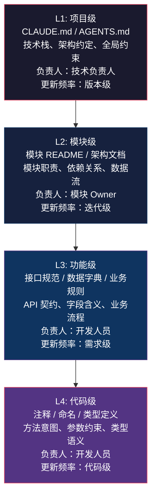

# 第8章：上下文工程 SOP（Context Engineering SOP）

## 8.1 Context Engineering 是什么

Context Engineering 是将项目知识系统化地沉淀为结构化文档资产，使 AI 编码助手在每次任务中都能获取准确、完整、最新的项目上下文，从而产出符合团队规范、架构约束和业务逻辑的高质量代码的工程实践。它不是"写好 Prompt 的技巧"，而是"建好信息环境的工程"——类比软件工程中的依赖管理，Context Engineering 管理的是 AI 的认知依赖。

## 8.2 为什么比 Prompt Engineering 更重要

Prompt Engineering 解决的是"单次对话怎么问得更好"，Context Engineering 解决的是"每次对话 AI 都知道什么"。两者的关系如同函数参数与全局配置：

| 维度 | Prompt Engineering | Context Engineering |
|------|-------------------|---------------------|
| 作用范围 | 单次请求 | 所有请求 |
| 维护成本 | 每次手动编写 | 一次沉淀，持续复用 |
| 一致性 | 依赖个人经验 | 团队统一标准 |
| 可传递性 | 难以传承 | 文档即知识库 |
| 防错能力 | 靠提问质量兜底 | 靠约束前置拦截 |

**核心结论**：Prompt 决定 AI 怎么想，Context 决定 AI 知道什么。知道错了，Prompt 再好也白费。在企业场景中，AI 产出的最大问题不是"写得不够优雅"，而是"写的东西不符合项目实际"——用了错的表名、忽略了已有的工具类、违反了架构分层。这些问题只有 Context Engineering 能解决。

## 8.3 企业项目上下文资产分层

企业项目的上下文资产应按粒度分层管理，每一层有明确的负责人、更新频率和内容边界。



**分层原则**：

- **上层约束下层**：L1 的禁止事项 L2 不能违反，L2 的模块边界 L3 不能跨越。
- **下层细化上层**：L4 的代码注释是 L3 接口规范的具体实现说明。
- **AI 优先读取上层**：CLAUDE.md 是 AI 进入项目的第一入口，再根据需要逐层深入。
- **人维护上层，AI 辅助下层**：L1/L2 由人工维护确保权威性，L3/L4 可借助 AI 生成后人工审核。

## 8.4 八个标准模板

以下八个模板均为 Java / Spring Boot 企业项目设计，可直接复制使用。模板中用 `【】` 标记的部分需要替换为项目实际内容。

### 模板1：CLAUDE.md 模板

```markdown
# 【项目名称】- 银行核心交易系统

## 技术栈

- 语言：Java 17
- 框架：Spring Boot 3.2.x, Spring Cloud 2023.x
- ORM：MyBatis-Plus 3.5.x + 手写 SQL 模板
- 数据库：MySQL 8.0（主库）+ Redis 7.x（缓存）+ Elasticsearch 8.x（日志检索）
- 消息队列：RocketMQ 5.x
- RPC：gRPC（服务间调用） + Feign（网关层）
- 注册中心 / 配置中心：Nacos 2.x
- 构建工具：Maven 3.9.x（多模块）
- 容器化：Docker + K8s

## 项目结构

```
【project-root】/
├── 【project】-common/          # 公共模块：工具类、枚举、统一异常
├── 【project】-dao/             # 数据访问层：Entity、Mapper、SQL XML
├── 【project】-service/         # 业务逻辑层：Service 接口与实现
├── 【project】-facade/          # 对外接口层：Controller、DTO、VO
├── 【project】-rpc/             # RPC 接口定义（gRPC proto + Feign Interface）
├── 【project】-task/            # 定时任务与异步任务
├── 【project】-integration/     # 第三方集成（支付网关、短信、风控）
└── docs/                        # 项目文档
```

## 代码规范

### 分层约束（强制）

```
Controller → Service Interface → Service Impl → Mapper → DB
     ↓              ↓
   DTO/VO        Domain Entity（内部使用，禁止暴露到 Controller 层）
```

- Controller 只做参数校验和 VO 组装，不得包含业务逻辑
- Service 层不直接操作 HttpServletRequest / HttpServletResponse
- Mapper 只做数据访问，不包含业务判断（禁止 if-else 业务逻辑出现在 XML 中）

### 命名规范

- Entity：表名对应，如 `TAccount` → `t_account`
- Service 接口：`I【业务】Service`
- Service 实现：`【业务】ServiceImpl`
- Controller：`【业务】Controller`
- DTO：`【业务】【操作】DTO`，如 `AccountTransferDTO`
- VO：`【业务】VO`，如 `AccountDetailVO`
- 方法名：动词 + 名词，如 `createOrder`、`queryAccountBalance`

### 异常处理

- 统一使用项目自定义异常 `BizException(code, message)`
- Controller 层由全局异常处理器 `GlobalExceptionHandler` 统一捕获
- Service 层抛出 `BizException`，不得 catch 后吞掉
- 错误码定义在 `【project】-common` 的 `ErrorCode` 枚举中，禁止硬编码

### 日志规范

- 使用 Lombok `@Slf4j`
- Controller：info 级别，记录请求入参、出参、耗时
- Service：debug 级别记录业务关键节点，info 级别记录核心操作，error 级别记录异常
- 敏感字段（身份证、手机号、卡号）必须脱敏后输出
- 禁止 `System.out.println` 和 `e.printStackTrace()`

### 事务管理

- 使用 `@Transactional(rollbackFor = Exception.class)`
- 禁止在 Controller 层使用事务注解
- 禁止在事务内进行 RPC 调用、消息发送、文件 IO（耗时操作先完成后提交事务）
- 避免事务嵌套，确有需要时使用 `Propagation.REQUIRES_NEW` 并注释说明原因

## 关键约束

1. 所有金额字段使用 `BigDecimal`，禁止 `float` / `double`
2. 数据库操作必须使用预编译 SQL（MyBatis 的 `#{}`），禁止拼接 SQL（`${}` 仅用于动态表名/列名，且必须白名单校验）
3. 接口返回统一使用 `Result<T>` 包装：`Result.success(data)` / `Result.fail(code, msg)`
4. 涉及金融计算的精度：统一使用 `RoundingMode.HALF_UP`，保留 2 位小数
5. 所有对外 API 必须做幂等性设计（使用唯一请求 ID）
6. 敏感配置（数据库密码、API Key）不得硬编码，统一通过 Nacos 配置中心管理

## AI 使用规范

- 生成代码前先阅读本文件和模块 README
- 新增类时遵循现有包结构和命名规范
- 涉及数据模型变更时同步更新 `docs/data-dictionary.md`
- 生成的 Service 必须包含对应的单元测试
- 涉及 SQL 变更时提供回滚脚本

## 禁止事项

1. 禁止直接操作生产数据库
2. 禁止在代码中硬编码密钥、密码、Token
3. 禁止绕过 Service 层直接从 Controller 调用 Mapper
4. 禁止引入未经技术负责人审批的新依赖
5. 禁止修改公共模块中的枚举定义而不更新受影响的调用方
6. 禁止生成没有参数校验的对外接口
7. 禁止在事务中 sleep / wait / 长轮询

## 验收标准

- [ ] 代码遵循本文件的分层约束和命名规范
- [ ] 异常使用 `BizException`，错误码来自 `ErrorCode` 枚举
- [ ] 日志输出包含关键入参和出参，敏感字段已脱敏
- [ ] 金额使用 `BigDecimal`，精度使用 `HALF_UP`
- [ ] 接口返回统一包装为 `Result<T>`
- [ ] 对外 API 有幂等性设计
- [ ] 单元测试覆盖率 >= 80%（Service 层 100%）
- [ ] SQL 变更附带回滚脚本
```

### 模板2：AGENTS.md 模板

```markdown
# Agent 行为规范

## 工作原则

1. **先读后写**：修改任何模块前，必须先阅读该模块的 README 和相关架构文档
2. **最小变更**：只修改必要的文件，禁止顺手重构无关代码
3. **一致性优先**：新增代码的风格、命名、结构必须与现有代码完全一致
4. **出错即停**：发现不确定的业务逻辑时，停下来询问，不要猜测

## 操作边界

### 允许操作

- 在 `src/main/java` 下新增或修改业务代码
- 在 `src/test/java` 下新增或修改测试代码
- 新增 MyBatis XML 映射文件
- 修改 API 文档注释
- 新增或修改 `docs/` 下的技术文档

### 需要确认

- 新增 Maven 依赖
- 修改数据库表结构
- 新增或修改 RPC 接口定义（proto 文件）
- 修改 Nacos 配置文件
- 修改 `pom.xml` 中的版本号
- 修改已有接口的出入参结构

### 禁止操作

- 修改 `application*.yml` 中的环境相关配置
- 修改 CI/CD 配置文件
- 执行数据库 DDL / DML 语句
- 执行 git push / merge 操作
- 删除已有代码而不加注释说明理由

## 代码生成要求

1. 每个 public 方法必须有 Javadoc，说明：功能、参数、返回值、异常
2. 复杂业务逻辑必须写行内注释说明"为什么这么做"
3. 禁止生成 `// TODO` 注释而不附带对应的 JIRA 单号
4. 生成的单元测试必须包含：正常场景、边界值、异常场景
5. 涉及金额的业务必须包含精确度测试用例

## 安全红线

1. 生成的代码中不得包含任何硬编码的密钥或凭据
2. SQL 查询必须使用参数化查询，不得拼接用户输入
3. 日志输出自动对手机号、身份证、银行卡号进行脱敏
4. 对外接口必须对输入参数做长度限制和格式校验
```

### 模板3：项目背景模板

```markdown
# 项目背景

## 业务背景

【项目名称】是【公司/部门】的核心业务系统，服务于【目标用户群体】，
主要解决【核心业务问题】。

当前业务规模：
- 日均交易量：【XXX】笔
- 注册用户数：【XXX】万
- 日均活跃用户：【XXX】万
- 数据总量：【XXX】GB

## 领域术语

| 术语 | 英文 | 说明 |
|------|------|------|
| 【术语1】 | 【Term1】 | 【详细解释，包含业务含义和技术映射】 |
| 【术语2】 | 【Term2】 | 【详细解释】 |
| 账户 | Account | 用户资金账户，映射表 `t_account`，状态机：正常→冻结→注销 |
| 交易 | Transaction | 一次完整的资金流动记录，包含交易号、金额、类型、状态 |
| 对账 | Reconciliation | 与外部系统（银行、支付渠道）的账务核对过程，每日 T+1 执行 |
| 冲正 | Reversal | 对错误交易的撤销操作，必须保留原始交易记录 |

## 关键干系人

| 角色 | 姓名/团队 | 职责 |
|------|----------|------|
| 产品负责人 | 【姓名】 | 需求决策与优先级排序 |
| 技术负责人 | 【姓名】 | 架构决策、代码审核、技术选型 |
| 业务专家 | 【姓名/团队】 | 业务规则解答、验收测试 |
| QA 负责人 | 【姓名/团队】 | 测试策略、自动化测试、发布审核 |

## 外部依赖

| 系统 | 调用方式 | 用途 | SLA | 联系人 |
|------|---------|------|-----|--------|
| 【支付网关】 | HTTPS + 证书 | 代收代付 | 99.99% | 【团队】 |
| 【短信平台】 | SDK | 验证码、通知 | 99.9% | 【团队】 |
| 【风控引擎】 | gRPC | 交易风控校验 | 99.95% | 【团队】 |
| 【人行征信】 | HTTPS + 专线 | 征信查询 | 99.9% | 【团队】 |

## 关键业务流程

### 交易流程

```
用户发起交易 → Controller 参数校验 → Service 风控校验（RPC）→
Service 账户检查 → Service 创建交易记录 → Mapper 持久化 →
RocketMQ 发送交易消息 → 异步记账 → 返回交易结果
```

### 对账流程

```
定时任务触发 → 拉取渠道对账单（SFTP）→ 解析对账单 → 
比对核心交易记录 → 生成差异报告 → 自动冲正（阈值内）→ 
人工处理（超阈值）→ 发送对账结果通知
```
```

### 模板4：架构说明模板

```markdown
# 系统架构说明

## 整体架构

本项目采用分层微服务架构，遵循 DDD（领域驱动设计）的限界上下文划分原则。

```
┌─────────────────────────────────────────────────────┐
│                     Gateway (Kong)                    │
├──────────┬──────────┬──────────┬────────────────────┤
│ 账户服务  │ 交易服务  │ 对账服务  │ 用户服务            │
│ (8081)   │ (8082)   │ (8083)   │ (8084)             │
├──────────┴──────────┴──────────┴────────────────────┤
│              Nacos（注册中心 + 配置中心）               │
├─────────────────────────────────────────────────────┤
│        MySQL        │    Redis     │   RocketMQ      │
└─────────────────────────────────────────────────────┘
```

## 模块职责

### 【模块1】账户服务 (account-service)

- **职责**：管理用户资金账户的开通、查询、冻结、注销
- **核心实体**：Account、AccountFlow（账户流水）
- **依赖**：用户服务（用户信息校验）、风控引擎（操作授权）
- **对外接口**：gRPC（供交易服务调用）、HTTP（供管理后台调用）
- **技术选型理由**：账户是核心域，数据一致性要求高，使用 gRPC 保证同步调用的可靠性

### 【模块2】交易服务 (transaction-service)

- **职责**：处理所有资金交易的创建、执行、查询
- **核心实体**：Transaction、TransactionDetail
- **依赖**：账户服务（余额检查与扣款）、风控引擎（交易风控）、消息队列（异步通知）
- **对外接口**：HTTP（供客户端调用）、gRPC（供内部服务调用）
- **技术选型理由**：交易是核心业务流程，需要高并发处理能力，采用异步消息削峰填谷

### 【模块3】对账服务 (reconciliation-service)

- **职责**：T+1 日与外部支付渠道的账务核对
- **核心实体**：ReconciliationTask、ReconciliationDiff
- **依赖**：交易服务（获取交易记录）、SFTP（拉取对账单）
- **对外接口**：HTTP（管理后台查看对账结果）
- **技术选型理由**：对账是定时批处理任务，使用 XXL-JOB 调度，独立部署避免影响交易服务

## 数据流

### 交易数据流

```
1. 用户发起交易请求
2. Gateway 鉴权 + 限流后路由到交易服务
3. 交易服务调用风控引擎 gRPC 进行风控校验
4. 交易服务调用账户服务 gRPC 检查余额并预扣
5. 交易服务写入交易记录到 MySQL（事务）
6. 交易服务发送交易消息到 RocketMQ
7. 账户服务消费消息完成实际扣款
8. 交易服务返回交易结果给用户
```

## 技术选型说明

| 技术 | 选型理由 |
|------|---------|
| Spring Boot 3.2 | 最新稳定版，虚拟线程（Project Loom）支持提升并发性能 |
| MyBatis-Plus | 团队历史经验丰富，复杂 SQL 可手写 XML，灵活度优于 JPA |
| Nacos | 阿里系微服务标准组件，与 Spring Cloud Alibaba 集成最佳 |
| RocketMQ | 金融级消息可靠性（事务消息），优于 Kafka 在事务场景的表现 |
| Redis 7 | 缓存热点账户信息，使用 Redisson 分布式锁防止并发扣款 |
| gRPC | 服务间同步调用性能优于 HTTP + JSON，强类型约束降低联调成本 |
```

### 模板5：代码规范模板

```markdown
# Java 代码规范（Spring Boot 项目）

## 包结构规范

```
com.【company】.【project】
├── common/                  # 公共组件
│   ├── constant/            # 常量定义
│   ├── enums/               # 枚举类
│   ├── exception/           # 自定义异常
│   │   ├── BizException.java
│   │   └── ErrorCode.java
│   └── utils/               # 工具类
├── config/                  # 配置类
├── module/                  # 业务模块（按功能分包）
│   ├── account/
│   │   ├── controller/      # 接口层
│   │   ├── service/         # 业务逻辑（接口）
│   │   │   └── impl/        # 业务逻辑（实现）
│   │   ├── mapper/          # 数据访问
│   │   ├── entity/          # 数据库实体
│   │   ├── dto/             # 数据传输对象
│   │   ├── vo/              # 视图对象
│   │   └── converter/       # 对象转换器（MapStruct）
│   ├── transaction/
│   └── reconciliation/
└── infrastructure/          # 基础设施
    ├── mq/                  # 消息队列
    ├── cache/               # 缓存
    └── rpc/                 # RPC 客户端
```

## 命名规范细则

| 元素 | 规范 | 示例 |
|------|------|------|
| 包名 | 全小写，单数 | `com.bank.transaction.service` |
| 类名 | 大驼峰 | `AccountServiceImpl`、`BizException` |
| 方法名 | 小驼峰，动词开头 | `createOrder()`、`queryAccountById()` |
| 变量名 | 小驼峰，禁止单字母（循环除外） | `accountBalance`、`transactionId` |
| 常量 | 全大写，下划线分隔 | `MAX_RETRY_COUNT`、`DEFAULT_PAGE_SIZE` |
| 枚举 | 全大写，下划线分隔 | `OrderStatus.PENDING` |
| 数据库字段 | 小写，下划线分隔 | `create_time`、`account_no` |
| REST URL | 小写，复数，短横线分隔 | `/api/v1/accounts/{id}` |

## 异常处理规范

```java
// 正确示例：抛出业务异常
if (balance.compareTo(amount) < 0) {
    throw new BizException(ErrorCode.INSUFFICIENT_BALANCE, 
        "账户余额不足，当前余额：" + maskAmount(balance));
}

// 错误示例1：返回 null
public Account queryAccount(String id) {
    return null; // 错误：调用方无法区分"不存在"和"异常"
}

// 错误示例2：catch 后只打日志不处理
try {
    doSomething();
} catch (Exception e) {
    log.error("出错了", e); // 错误：吞掉了异常，上层不知道出错了
}

// 错误示例3：Controller 层 try-catch 处理业务异常
@PostMapping("/transfer")
public Result<Void> transfer(@RequestBody TransferDTO dto) {
    try {
        transferService.transfer(dto); // 错误：应由全局异常处理器统一处理
    } catch (BizException e) {
        return Result.fail(e.getCode(), e.getMessage());
    }
}
```

## 日志规范

```java
// Controller 层日志模板
@PostMapping("/transfer")
public Result<TransferResultVO> transfer(@Valid @RequestBody TransferDTO dto) {
    log.info("转账请求：from={}, to={}, amount={}", 
        maskAccountNo(dto.getFromAccountNo()), 
        maskAccountNo(dto.getToAccountNo()), 
        dto.getAmount());
    long start = System.currentTimeMillis();
    TransferResultVO result = transferService.transfer(dto);
    log.info("转账成功：transactionId={}, 耗时={}ms", 
        result.getTransactionId(), 
        System.currentTimeMillis() - start);
    return Result.success(result);
}

// Service 层日志模板
public TransferResultVO transfer(TransferDTO dto) {
    log.debug("开始处理转账，交易流水号={}", dto.getRequestId());
    
    // 幂等校验
    if (transactionMapper.existsByRequestId(dto.getRequestId())) {
        log.warn("重复转账请求被拦截，requestId={}", dto.getRequestId());
        throw new BizException(ErrorCode.DUPLICATE_REQUEST, "重复请求");
    }
    
    // 核心业务处理...
    
    log.debug("转账处理完成，transactionId={}", result.getTransactionId());
    return result;
}
```

## 事务管理规范

```java
// 正确示例
@Override
@Transactional(rollbackFor = Exception.class)
public void createOrder(CreateOrderDTO dto) {
    // 1. 数据库操作
    orderMapper.insert(order);
    orderDetailMapper.batchInsert(details);
    
    // 2. 更新缓存（缓存失败不影响业务，不回滚事务）
    try {
        cacheService.updateOrderCache(order);
    } catch (Exception e) {
        log.warn("更新缓存失败，不影响业务流程", e);
    }
    
    // 3. 事务提交后发送消息（使用 TransactionSynchronization）
    TransactionSynchronizationManager.registerSynchronization(
        new TransactionSynchronization() {
            @Override
            public void afterCommit() {
                mqProducer.send(orderMessage);
            }
        });
}

// 错误示例1：事务内调用 RPC
@Override
@Transactional(rollbackFor = Exception.class)
public void createOrder(CreateOrderDTO dto) {
    orderMapper.insert(order);
    // 错误：RPC 调用可能耗时数秒，长事务锁表
    AccountInfo accountInfo = accountRpcService.queryAccount(dto.getAccountId());
    // ...
}

// 错误示例2：捕获异常但不回滚
@Override
@Transactional(rollbackFor = Exception.class)
public void createOrder(CreateOrderDTO dto) {
    try {
        orderMapper.insert(order);
    } catch (Exception e) {
        log.error("插入失败", e);
        // 错误：捕获后不抛出，事务不会回滚
    }
}
```
```

### 模板6：AI 任务约束模板

```markdown
# AI 任务约束（每次任务必附）

> 以下约束在执行本任务时生效，优先级高于 AI 的默认行为。

## 操作范围

### 允许修改
- `src/main/java/com/【company】/【module】/` 目录下的业务代码
- `src/test/java/com/【company】/【module】/` 目录下的测试代码
- `src/main/resources/mapper/` 目录下的 MyBatis XML 映射文件

### 禁止修改
- `pom.xml` 及所有 Maven 配置文件
- `application.yml` / `application-*.yml` 配置文件
- `src/main/java/com/【company】/common/` 公共模块代码
- RPC 接口定义（`.proto` 文件）
- CI/CD 配置（`Jenkinsfile`, `.gitlab-ci.yml`, `Dockerfile`）

## 质量要求

1. 所有新增的 public 方法必须包含完整的 Javadoc
2. 业务逻辑变更必须同步更新对应的单元测试
3. 新增的数据库操作必须使用参数化查询（MyBatis `#{}` 语法）
4. 代码不得包含任何硬编码的配置值（使用 `@Value` 注入或常量类）
5. 日志输出对敏感字段完成脱敏处理

## 安全红线（违反即驳回）

1. 代码中不得出现任何密钥、密码、Token 的硬编码
2. 不得使用 SQL 字符串拼接（`${}` 仅限动态表名且必须有白名单校验）
3. 不得关闭或绕过已有的参数校验逻辑
4. 不得在日志中明文输出身份证、手机号、银行卡号

## 输出要求

生成代码时，每个文件需附带以下说明：

- **变更目的**：为什么需要这个变更（1-2 句话）
- **影响范围**：会影响哪些已有的功能或模块
- **测试建议**：需要重点测试哪些场景
- **风险点**：可能引入的潜在风险
```

### 模板7：AI 禁止事项模板

```markdown
# AI 禁止事项清单（全局生效）

## 安全类（零容忍）

| 序号 | 禁止事项 | 严重程度 |
|------|---------|---------|
| S1 | 在代码中硬编码密钥、密码、Token、证书 | 致命 |
| S2 | 生成可绕过认证/鉴权逻辑的代码 | 致命 |
| S3 | 使用 SQL 拼接（`${}`）处理用户输入，除非有白名单校验且注释说明 | 致命 |
| S4 | 在日志、错误消息、API 响应中明文输出敏感个人信息 | 致命 |
| S5 | 关闭 HTTPS 证书校验（`trustAllCerts`） | 致命 |
| S6 | 生成可执行任意系统命令的代码（`Runtime.exec` 拼接用户输入） | 致命 |

## 架构类（禁止）

| 序号 | 禁止事项 | 说明 |
|------|---------|------|
| A1 | 不读 CLAUDE.md 就开始写代码 | 每次任务必须先读取项目上下文 |
| A2 | 跨越分层边界调用 | Controller → Mapper（跳过 Service 层） |
| A3 | 修改公共模块而不检查所有调用方 | 修改 `common` 包代码前必须全局搜索引用 |
| A4 | 引入未经审批的新依赖 | 如需新依赖，先在任务说明中提出并等待确认 |
| A5 | 修改数据库表结构而不提供回滚方案 | SQL 变更必须附带 `up.sql` 和 `down.sql` |
| A6 | 绕过 API 网关直接调用内部服务 | 所有外部访问必须经过 Gateway |

## 代码质量类（禁止）

| 序号 | 禁止事项 | 说明 |
|------|---------|------|
| Q1 | 生成空 catch 块 | 异常必须处理或显式向上抛出 |
| Q2 | 使用 `System.out.println` 或 `e.printStackTrace()` | 统一使用 Slf4j 日志框架 |
| Q3 | 使用 `float` / `double` 处理金额 | 必须使用 `BigDecimal` |
| Q4 | 在循环中执行数据库查询 | 必须使用批量查询或缓存 |
| Q5 | 硬编码魔法数字和魔法字符串 | 必须定义为常量或使用枚举 |
| Q6 | 生成超过 200 行的方法 | 必须拆分为多个职责清晰的子方法 |
| Q7 | 仅 catch `Exception` 而不区分具体类型 | 需要区分 `BizException` / `SQLException` / `IOException` |
| Q8 | 注释写"做什么"而不写"为什么" | 代码名已经说明做什么，注释应该写为什么要这么做 |

## 流程类（禁止）

| 序号 | 禁止事项 | 说明 |
|------|---------|------|
| P1 | 跳过代码审查直接合并 | 所有代码变更需要 review |
| P2 | 自行决定发布上线 | 上线决策由技术负责人做出 |
| P3 | 在不确定业务规则时自行猜测 | 必须暂停任务并询问确认 |
| P4 | 删除已有测试用例 | 只允许新增或修改，禁止删除 |
```

### 模板8：项目验收标准模板

```markdown
# AI 生成代码验收标准

## 一、功能正确性（必须全部通过）

- [ ] 代码实现了需求描述中的所有功能点
- [ ] 正常流程可完整执行（Happy Path 测试通过）
- [ ] 边界条件有处理（空值、零值、最大值、超长字符串）
- [ ] 异常场景有处理（数据库异常、网络超时、外部服务不可用）
- [ ] 幂等性设计：重复调用不会产生副作用
- [ ] 并发场景有保护（乐观锁 / 分布式锁 / 唯一索引）

## 二、代码质量（必须全部通过）

- [ ] 类名、方法名、变量名符合团队命名规范
- [ ] 代码风格与现有代码一致（缩进、换行、空行、注释格式）
- [ ] 每个 public 方法有完整的 Javadoc（功能、参数、返回值、异常）
- [ ] 复杂逻辑有行内注释说明"为什么这么做"
- [ ] 没有超过 200 行的方法
- [ ] 没有超过 500 行的类
- [ ] 没有重复代码（相同的逻辑出现在 3 个以上位置）
- [ ] 没有 `// TODO` 注释（或已关联 JIRA 单号）

## 三、安全合规（必须全部通过）

- [ ] 代码中无硬编码的密钥、密码、Token
- [ ] SQL 查询使用参数化查询（MyBatis `#{}` 语法）
- [ ] 对外接口有参数校验（`@Valid` / 手动校验）
- [ ] 敏感信息已在日志中脱敏
- [ ] 文件上传有类型和大小限制
- [ ] API 响应的错误信息不暴露内部实现细节（数据库结构、堆栈信息）

## 四、性能（严重问题必须修复，一般问题需评估）

### 严重（必须修复）

- [ ] 没有在循环内执行数据库查询（N+1 问题）
- [ ] 没有在事务内进行 RPC 调用 / 消息发送 / 文件 IO
- [ ] 没有全表扫描的 SQL（WHERE 条件有索引支持）
- [ ] 没有不设限制的分页查询

### 一般（评估修复）

- [ ] 热点数据有缓存策略
- [ ] 大批量操作使用分页或流式处理
- [ ] 合理的连接池和超时配置

## 五、测试（必须全部通过）

- [ ] 核心 Service 方法有单元测试
- [ ] 单元测试覆盖正常场景、边界值、异常场景
- [ ] 涉及金额计算的方法有精度测试用例
- [ ] 测试用例可独立运行，不依赖外部环境
- [ ] 所有已有测试仍然通过（无回归问题）

## 六、文档（必须全部通过）

- [ ] API 接口有 Swagger / Javadoc 文档
- [ ] 新增数据库表在 `docs/data-dictionary.md` 中有记录
- [ ] 对外接口的请求/响应示例完整
- [ ] 架构有变更时，CLAUDE.md 或模块 README 已同步更新

## 验收流程

1. 开发提交代码 + 自检清单（开发勾选 1-6 项）
2. AI 代码审查（Code Review）自动扫描 1-4 项
3. QA 人工验证第 1 项（功能正确性）和第 5 项（测试）
4. 技术负责人抽查第 2-4 项和第 6 项
5. 全部通过后合并到主分支
```

## 8.5 上下文维护 SOP

### 8.5.1 责任分配

| 上下文资产 | 主要负责人 | 备份负责人 | 审核人 |
|-----------|-----------|-----------|--------|
| CLAUDE.md | 技术负责人 | 高级开发工程师 | 架构师 |
| AGENTS.md | 技术负责人 | 高级开发工程师 | 架构师 |
| 模块 README / 架构文档 | 模块 Owner | 技术负责人 | 架构师 |
| 接口规范 / 数据字典 | 对应开发人员 | 模块 Owner | 技术负责人 |
| 代码注释 / 命名 | 对应开发人员 | 代码审查人 | — |

### 8.5.2 更新触发条件

以下时机必须检查并更新对应的上下文资产：

| 事件 | 需更新的资产 | 时间要求 |
|------|------------|---------|
| 项目初始化 | CLAUDE.md、AGENTS.md、架构文档 | 项目首周 |
| 新增模块 | 模块 README、架构文档 | 模块开发前 |
| 新增外部依赖 | CLAUDE.md（技术栈）、架构文档 | 集成前 |
| 接口变更（入参/出参/路径） | 接口规范文档 | 与代码同步 |
| 数据库表结构变更 | 数据字典 | 与 DDL 同步 |
| 业务规则变更 | 模块 README、接口规范文档 | 需求评审后 |
| 团队规范变更 | CLAUDE.md、代码规范模板 | 规范生效日 |
| 安全策略变更 | AGENTS.md、AI 禁止事项模板 | 策略生效日 |
| 每季度定期审查 | 全部上下文资产 | 季度末 |

### 8.5.3 上下文过期审查流程

每季度执行一次全量上下文审查：

```
审查发起（技术负责人）→
逐层检查（L1 → L2 → L3 → L4）→
标记过期项（标注"已过期"和"过期原因"）→
分配更新任务（指定负责人和截止日期）→
更新完成（发起人复核）→
归档审查记录（记录在 docs/context-review-log.md）
```

**审查检查项**：

1. 技术栈版本是否与 `pom.xml` 一致
2. 包结构描述是否与当前代码一致
3. 模块职责描述是否与实际功能匹配
4. 外部依赖是否仍在运行，联系人是否正确
5. 禁止事项清单是否需要补充（基于近期线上事故根因）
6. 验收标准是否需要调整（基于近期代码审查常见问题）

### 8.5.4 上下文变更审批流程

```
变更发起（任何人）→
PR 提交（附变更说明：改了什么、为什么改、影响范围）→
负责人 Review（检查准确性、完整性）→
架构师 Approve（检查与架构的一致性）→
合并到主分支 →
发布通知（团队群 / 邮件：上下文已更新，所有 AI 任务将使用新版本）
```

**原则**：上下文变更的审批严格度应等同于代码变更，因为错误的上下文比错误的代码影响范围更大。

## 8.6 上下文污染防护

### 8.6.1 不应放入上下文的信息

以下信息绝不应出现在项目上下文资产中：

| 类别 | 示例 | 原因 |
|------|------|------|
| 生产环境配置 | IP 地址、数据库连接串、端口号 | 安全风险，且随环境变化 |
| 密钥和凭证 | API Key、Token、证书密码 | 致命安全风险 |
| 个人身份信息 | 真实姓名、手机号、身份证号、邮箱 | 隐私合规 |
| 临时性信息 | 当前 Sprint 的 JIRA 链接、临时调试命令 | 快速过时，造成噪音 |
| 纯版本历史 | 详细的变更日志（短期的） | CHANGELOG.md 另放，不要在 CLAUDE.md 中维护 |
| 主观意见 | "这个模块写得烂"、"某某代码不要动" | 用客观约束替代主观评价 |
| 过度细节 | 每个类的每个方法说明 | 让代码自描述，上下文只写规范和约定 |

### 8.6.2 清理过期上下文

**标记机制**：

在文档头部添加元信息块，记录最后更新时间和下次审查日期：

```markdown
---
last_updated: 2026-06-15
next_review: 2026-09-15
owner: 【技术负责人姓名】
status: active  # active / outdated / deprecated
---
```

**清理规则**：

1. `status: deprecated` 的文档在下次定期审查时删除
2. 连续两次审查都标记为 `outdated` 且无人更新的资产，降级为 `deprecated`
3. 删除前在 `docs/context-review-log.md` 中记录删除原因和时间
4. AI 读取上下文时，优先读取 `active` 资产，`outdated` 资产仅在显式引用时读取

### 8.6.3 敏感信息泄露防护

**预防措施**：

1. **写入前检查**：CI 中增加上下文文档扫描，检测密钥模式（正则匹配 `sk-`、`Bearer`、`password=` 等）
2. **示例脱敏**：文档中的示例必须使用占位符，如 `your-api-key-here`、`192.0.2.1`（RFC 5737 测试网段）
3. **Git 历史保护**：敏感信息提交后立即使用 `git filter-branch` 清理，并轮换已泄露的密钥
4. **AI 读取限制**：不同 AI 工具可能有不同的数据上传策略，评估后决定哪些上下文资产可被 AI 读取
5. **分层权限**：`CLAUDE.md`（公开给所有 AI 工具读） vs `internal-architecture.md`（仅内部 AI 读）

**泄露后处置流程**：

```
发现泄露 → 立即删除泄露内容 → 轮换所有关联密钥 → 
检查 Git 历史 → 通知安全团队 → 记录事故报告
```

## 8.7 多项目 / 多模块上下文管理策略

### 8.7.1 Monorepo 场景

当多个子项目共存在一个仓库中时，采用"全局 + 局部"的两层上下文结构：

```
monorepo-root/
├── CLAUDE.md                     # 全局上下文：通用规范、禁止事项、验收标准
├── AGENTS.md                     # 全局 Agent 规范
├── docs/
│   └── architecture-overview.md  # 全局架构总览
├── module-a/
│   ├── CLAUDE.md                 # 模块 A 上下文（继承全局，追加模块特定约束）
│   └── README.md                 # 模块 A 说明
├── module-b/
│   ├── CLAUDE.md                 # 模块 B 上下文
│   └── README.md
└── shared-lib/
    ├── CLAUDE.md                 # 共享库上下文（强调 API 稳定性约束）
    └── README.md
```

**全局 CLAUDE.md 内容策略**：

- 只写所有模块通用的规范（命名、异常处理、日志、事务）
- 描述模块间的依赖关系和调用约束（A 不能直接访问 B 的数据库）
- 列出跨模块的禁止事项

**模块 CLAUDE.md 内容策略**：

- 不重复全局内容，头部声明 `## 继承自根目录 CLAUDE.md，本文件仅追加模块特定约束`
- 描述本模块的技术栈差异（如模块 B 使用 MongoDB 而非 MySQL）
- 描述本模块的业务约束和领域规则

**AI 读取策略**：

1. AI 先读根目录 `CLAUDE.md`
2. 根据任务涉及的模块，读取对应模块的 `CLAUDE.md`
3. 如果任务跨模块，同时读取全局架构文档和所有涉及模块的上下文

### 8.7.2 多仓库场景

每个独立仓库维护自己的完整上下文，同时通过"服务目录"建立全局索引：

```
# 服务目录（维护在 Wiki 或独立仓库）
# service-catalog.md

## 服务清单

| 服务名 | 仓库地址 | CLAUDE.md 位置 | 负责人 | 对外接口 |
|--------|---------|---------------|--------|---------|
| account-service | gitlab.com/... | /CLAUDE.md | 【姓名】 | gRPC: account.proto |
| transaction-service | gitlab.com/... | /CLAUDE.md | 【姓名】 | HTTP: /api/v1/transactions |
| reconciliation-service | gitlab.com/... | /CLAUDE.md | 【姓名】 | HTTP: /api/v1/reconciliations |
```

**跨服务任务时的上下文获取流程**：

1. 查阅服务目录，确定涉及哪些服务
2. 获取每个服务的 `CLAUDE.md`（通过 Git API 或本地 clone）
3. 获取每个服务相关的接口规范（proto 文件或 OpenAPI 文档）
4. 在任务说明中明确标注涉及的上下文来源和版本

### 8.7.3 大型单模块场景

对于没有拆分为微服务但代码量巨大的单体应用，使用"领域上下文"替代"模块上下文"：

```
monolith/
├── CLAUDE.md                     # 整体规范 + 架构分层说明
└── docs/
    └── contexts/
        ├── order-domain.md       # 订单领域的业务规则、实体关系、状态机
        ├── payment-domain.md     # 支付领域的业务规则、渠道对接说明
        ├── user-domain.md        # 用户领域的业务规则、权限模型
        └── product-domain.md     # 商品领域的业务规则、库存模型
```

AI 工作时先读 `CLAUDE.md` 了解全局规范，再根据任务涉及的领域加载对应的领域上下文。

## 8.8 常见误区

### 误区1：把 CLAUDE.md 写成大而全的百科全书

**错误做法**：把所有项目信息不分优先级地塞进一个文件，导致 CLAUDE.md 超过 5000 行。

**后果**：AI 的上下文窗口被噪音填满，关键约束淹没在细节中，反而降低产出质量。

**正确做法**：CLAUDE.md 只放全局规范和关键约束，详细内容通过链接引用到各层文档。单文件控制在 300 行以内。使用分层策略（见 8.3 节），让 AI 按需读取。

### 误区2：写完上下文就再也不更新

**错误做法**：项目启动时认真写了 CLAUDE.md，之后架构重构、技术栈升级、团队规范调整，CLAUDE.md 纹丝不动。

**后果**：AI 基于过时的上下文生成代码，新增代码使用已废弃的框架、调用已删除的方法、违反新规范。上下文从"资产"变成了"负债"——有比没有更糟。

**正确做法**：将上下文更新嵌入开发流程（见 8.5.2 的触发条件表），每次 PR 都检查是否需要同步更新上下文。CI 中加入上下文一致性检查。

### 误区3：上下文写得像法律条文，缺少可操作性

**错误做法**：规范全是"应该""建议""最好"这类模糊表述，没有具体示例和检查清单。

**后果**：AI 无法判断什么算"合格"，人工审查也没有标准，上下文形同虚设。

**正确做法**：每个约束附正确的代码示例和错误的代码示例（对比展示），用禁止事项清单（模板 7）给出明确的"可以做 / 不能做 / 需确认"边界，验收标准（模板 8）用二元的通过/不通过检查项。

### 误区4：把上下文当成技术负责人的个人笔记

**错误做法**：CLAUDE.md 中充满"我认为""我习惯"的个人偏好，或使用只有作者看得懂的缩写和黑话。

**后果**：AI 和其他团队成员无法准确理解上下文。换了技术负责人后上下文就废了。

**正确做法**：上下文是团队资产，必须经过团队评审，确保所有人对新成员和 AI 都能理解。用完整的术语表和领域词汇表（见模板 3）消除歧义。使用团队达成共识的规范，而非个人偏好。

### 误区5：所有项目共用一套上下文模板

**错误做法**：把本章的 CLAUDE.md 模板直接复制到所有项目，只改了项目名。

**后果**：每个项目的技术栈、业务约束、架构特点都被忽略，AI 产出的代码"看着都对，实际都错"。

**正确做法**：模板是起点，不是终点。每个项目的上下文必须反映项目的实际特点：用的是什么框架版本、有什么特殊的安全合规要求（金融项目、医疗项目的合规约束完全不同）、有什么历史遗留问题需要避开。上下文的价值在于"精准"，而非"全面"。

---

## 本章检查清单

- [ ] CLAUDE.md 已创建并包含最小必要信息（技术栈、项目结构、分层约束、禁止事项）
- [ ] AGENTS.md 已创建并明确 AI 的操作边界
- [ ] 上下文资产按 L1-L4 四层组织，各层有明确的负责人
- [ ] 上下文更新流程已建立（触发条件、责任人、审批流程）
- [ ] 上下文污染防护机制已启用（敏感信息扫描、过期标记、清理规则）
- [ ] 多项目/多模块的上下文组织策略已确定
- [ ] 团队已就上下文规范达成共识并知悉更新流程
- [ ] 首次全量上下文审查日期已排入日历（建议 3 个月后）
