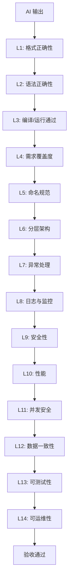
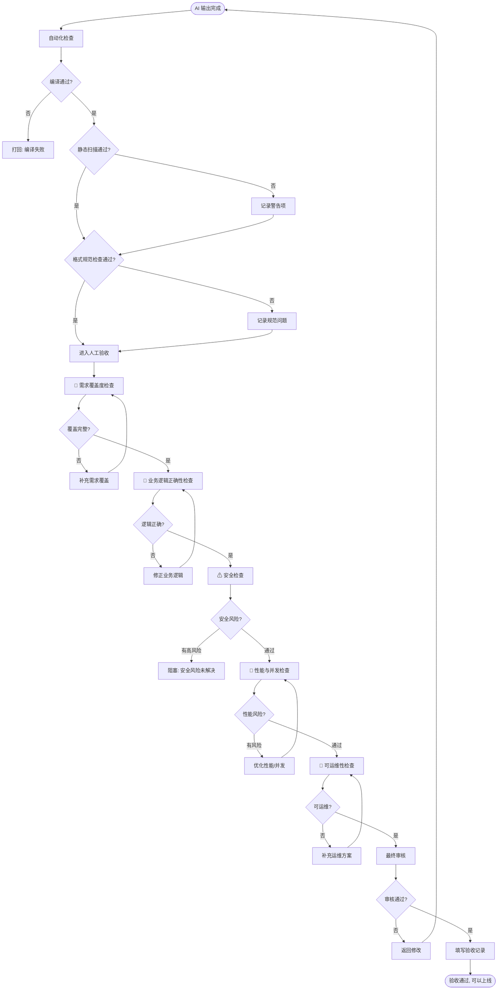

# 第9章 AI 输出验收清单

> **核心原则：AI 生成的东西，不经验收不得上线。验收是人的责任，不是 AI 的责任。**

---

## 9.1 验收总则

### 9.1.1 基本立场

AI 的输出只能作为**草稿**或**候选方案**，不能直接作为最终交付物。无论 AI 的回答看起来多么自信、措辞多么专业、代码多么工整，它仍然可能包含：

- **幻觉**：编造不存在的 API、配置项、数据库字段
- **过时信息**：基于训练数据中的旧版本知识
- **上下文遗漏**：忽略了你之前提到的约束条件
- **逻辑漏洞**：方案在纸面上成立，在真实系统中崩盘
- **安全隐患**：生成的代码中存在注入点、密钥硬编码、权限缺失

**每一项进入生产环境的 AI 产出，都必须经过系统化的验收。**

### 9.1.2 14 层验收框架

企业级的 AI 输出验收不能靠"感觉不对就改改"，需要结构化的分层检查。以下 14 层框架覆盖了从语法到架构的完整验证链条：



### 9.1.3 验收分级体系

每个检查项按重要性和可自动化程度分为四级：

| 级别 | 标记 | 含义 | 处理方式 |
|------|------|------|----------|
| **必须通过** | ★ | 不通过则阻塞合入，必须修复 | 自动化检查 + 人工复核 |
| **建议检查** | ☆ | 不通过应发出警告，由负责人判断 | 自动化检查，警告通知 |
| **高风险项** | ⚠ | 出问题后果严重，必须人工验证 | 禁止自动化放行 |
| **人工确认** | 👤 | 需要人的判断力，AI 无法替代 | 强制人工节点 |

### 9.1.4 验收前置条件

在开始任何验收之前，确保以下前提已满足：

1. **原始需求已确认**：你知道 AI 应该产出什么
2. **验收标准已定义**：每个交付物的"通过"标准是什么
3. **验收人已明确**：谁对验收结果负责，签字画押
4. **验收环境已就绪**：编译环境、测试数据库、依赖服务可用
5. **回滚方案已准备**：如果验收结果被后续证明有误，如何回退

---

## 9.2 十大验收清单

### 清单1：AI 生成需求文档验收清单

**验收对象**：AI 根据原始需求或会议记录生成的 PRD、用户故事、功能规格说明。

| # | 检查项 | 级别 | 说明 |
|---|--------|------|------|
| 1 | 文档结构完整，包含背景、目标、范围、非目标 | ★ | 缺失任何章节都可能造成后续开发理解偏差 |
| 2 | 所有功能需求可追溯至原始需求来源 | ★ | 每条功能点后面标注原始需求编号或来源 |
| 3 | 明确标注了"不在范围内"的内容（Out of Scope） | ★ | 防止范围蔓延，比写"在范围内"更重要 |
| 4 | 用户故事符合 INVEST 原则 | ★ | Independent, Negotiable, Valuable, Estimable, Small, Testable |
| 5 | 验收标准（Acceptance Criteria）使用 Given-When-Then 格式 | ★ | 模糊的验收标准等于没有验收标准 |
| 6 | 不存在相互矛盾的需求描述 | ★ | 重点检查"系统必须...同时必须..."这种句式 |
| 7 | 不存在 AI 臆造的术语或缩写 | ★ | AI 经常自创缩写，逐项核实 |
| 8 | 非功能需求（性能、安全、可用性）已量化 | ☆ | "系统要快"不叫需求，"P99 响应时间 < 200ms"才叫需求 |
| 9 | 边界条件已覆盖（空值、极值、超长输入） | ☆ | 正常流程谁都会写，边界条件才见真章 |
| 10 | 权限矩阵已定义（谁能做什么） | ★ | 缺失权限需求是后期返工的第一大来源 |
| 11 | 与外部系统的交互方式已明确（API/消息队列/文件） | ☆ | 只说"对接XX系统"不够，要说清楚对接方式 |
| 12 | 数据流转方向清晰（输入→处理→输出） | ☆ | 每个功能的数据从哪来、到哪去 |
| 13 | 异常场景描述覆盖了主要的失败模式 | ★ | 至少覆盖：依赖服务不可用、数据异常、并发冲突 |
| 14 | 不存在主观形容词（"友好的""流畅的""强大的"） | ☆ | 所有描述可度量或可验证 |
| 15 | 优先级已标注（P0/P1/P2），且理由不空洞 | ⚠ | AI 给的优先级经常不合理，需负责人确认 |
| 16 | 文档版本号和变更记录已包含 | ☆ | 方便追溯需求变更历史 |

### 清单2：AI 生成技术方案验收清单

**验收对象**：AI 根据需求文档生成的技术方案、架构设计文档。

| # | 检查项 | 级别 | 说明 |
|---|--------|------|------|
| 1 | 方案明确说明了"为什么选这个方案而不是其他方案" | ★ | 没有对比的方案不是方案，是猜测 |
| 2 | 架构图中的每个组件都有明确的职责边界 | ★ | 职责重叠是系统腐化的开始 |
| 3 | 技术选型给出了版本号，且版本在维护期内 | ★ | "用 Redis"不够，"Redis 7.2，EOL 2028-08"才行 |
| 4 | 关键技术决策记录了决策理由和权衡（ADR） | ☆ | Architecture Decision Record |
| 5 | 方案中的数据流图与时序图逻辑一致，不自相矛盾 | ★ | 对照 Mermaid 图和文字描述逐一验证 |
| 6 | 识别了系统的核心链路和非核心链路 | ★ | 核心链路需要最高级别的可靠性保障 |
| 7 | 对系统的可伸缩性给出了具体策略 | ☆ | 水平扩展？分库分表？读写分离？说清楚 |
| 8 | 安全设计覆盖了认证、授权、审计、数据保护 | ★ | 至少包含 OWASP Top 10 相关的防护措施 |
| 9 | 不涉及 AI 臆造的技术或中间件 | ★ | 验证引用的每个技术是否真实存在且有文档 |
| 10 | 依赖的外部服务有降级预案 | ⚠ | 每个外部依赖都要回答"它挂了怎么办" |
| 11 | 数据一致性方案具体可执行 | ⚠ | 最终一致性？强一致性？补偿机制是什么？ |
| 12 | 预估了关键接口的 QPS 和存储容量 | ☆ | 没有量化的方案无法做容量规划 |
| 13 | 包含可执行的迁移/灰度发布策略 | ★ | 数据库变更怎么搞？新旧版本并存期间怎么处理？ |
| 14 | 监控和告警指标已列出 | ☆ | 上线后看什么指标才知道系统正常 |
| 15 | AI 推荐的新技术/新框架有引入风险评估 | ⚠ | AI 倾向于推荐最新最热的技术，但不代表适合你的团队 |

### 清单3：AI 生成 API 设计验收清单

**验收对象**：AI 生成的 RESTful API 接口设计，包含路径、参数、响应结构。

| # | 检查项 | 级别 | 说明 |
|---|--------|------|------|
| 1 | URL 使用名词复数，不使用动词 | ★ | `/users` 而不是 `/getUsers` 或 `/user/list` |
| 2 | HTTP 方法语义正确 | ★ | GET 查询，POST 创建，PUT 全量更新，PATCH 部分更新，DELETE 删除 |
| 3 | 使用 HTTP 状态码准确表达结果 | ★ | 200 成功，201 创建成功，400 参数错误，401 未认证，403 无权限，404 不存在，409 冲突，422 业务校验失败，500 系统异常 |
| 4 | 资源嵌套层级不超过 2 层 | ☆ | `/users/{id}/orders/{orderId}/items` 已经三层，考虑拆分为独立端点 |
| 5 | 分页参数统一（page/pageSize 或 offset/limit） | ★ | 全系统统一，不混用 |
| 6 | 排序、过滤参数风格一致 | ☆ | `sort=name,desc&filter=status:active` 或类似约定 |
| 7 | 版本化策略明确（URL 路径 /v1/ 或 Header） | ★ | 不管选哪种，统一即可 |
| 8 | 请求体包含完整的字段校验规则 | ★ | 类型、长度、格式、必填/可选、取值范围 |
| 9 | 写操作（POST/PUT/PATCH/DELETE）有幂等性设计 | ⚠ | 支付、扣款等关键操作必须有幂等键 |
| 10 | 错误响应结构统一，包含 errorCode + message + details | ★ | 不能每个接口报不一样的错误格式 |
| 11 | GET 请求不使用 Request Body | ★ | 这是 HTTP 规范，不是风格偏好 |
| 12 | 响应不暴露内部实现细节 | ★ | 不要把数据库 ID、内部异常堆栈、表名暴露出去 |
| 13 | 鉴权方式已标注（JWT/OAuth2/API Key） | ★ | 每个接口标注是否需要认证、需要什么角色 |
| 14 | 限流策略已考虑 | ☆ | 登录接口、短信接口必须有严格限流 |
| 15 | 批量操作的接口有数量上限 | ★ | "批量删除"如果没有上限，删 100 万条怎么办 |
| 16 | 时间字段统一为 ISO 8601 格式，带时区 | ☆ | `2026-07-01T14:30:00+08:00` |
| 17 | 金额字段使用字符串传输 | ★ | 避免浮点数精度问题，`"100.50"` 而不是 `100.5` |
| 18 | 枚举值用字符串而非数字 | ☆ | `"status":"active"` 比 `"status":1` 可读性好 |
| 19 | API 文档包含示例请求和响应 | ☆ | 不说"请参考"，直接给出完整 curl 示例 |
| 20 | 长列表查询接口有默认分页大小（不超过 100） | ★ | 防止一次返回 10 万条数据 |
| 21 | 敏感字段（密码、token）不出现在 URL 查询参数中 | ★ | GET 请求的 URL 会被各种中间件记录 |
| 22 | API 命名不与保留字冲突 | ☆ | 避免 `/search`、`/config`、`/admin` 等可能与现有路由冲突的路径 |

### 清单4：AI 生成数据库设计验收清单

**验收对象**：AI 生成的数据库表结构、索引策略、字段定义。

| # | 检查项 | 级别 | 说明 |
|---|--------|------|------|
| 1 | 金额字段使用 DECIMAL 而非 FLOAT/DOUBLE | ★ | **这是排名第一的数据库设计错误。** FLOAT 会有精度丢失，涉及钱的场景不可接受 |
| 2 | 每张表有显式定义的主键 | ★ | 不存在"不需要主键"的表 |
| 3 | 主键策略明确（自增/UUID/雪花ID），且有理由 | ★ | 分布式场景优先雪花ID，自增ID在分库分表时会冲突 |
| 4 | 字符集和排序规则已指定（utf8mb4 + utf8mb4_unicode_ci） | ★ | 需要存储 emoji 就必须 utf8mb4 |
| 5 | 字符串字段长度不是"差不多就行"的 varchar(255) | ☆ | 每个 varchar 长度都应有业务依据，姓名 50，手机号 20，描述 2000 |
| 6 | 每条记录包含 created_at、updated_at 审计字段 | ★ | 没有这两个字段的表在排障时是灾难 |
| 7 | deleted_at 软删除字段（如需）有配套的索引 | ☆ | 如果查所有"未删除"记录，deleted_at 为空的条件必须有索引支撑 |
| 8 | 外键依赖明确标注（物理外键或逻辑外键） | ☆ | 互联网场景倾向逻辑外键，但业务关联关系必须在文档中说清楚 |
| 9 | 索引设计有使用场景支撑，不是"感觉应该加" | ★ | 每个索引标注它服务的 SQL 查询条件 |
| 10 | 联合索引的列顺序遵循最左前缀原则 | ★ | `(a, b, c)` 索引能覆盖 `WHERE a=?` 和 `WHERE a=? AND b=?`，但不能覆盖 `WHERE b=?` |
| 11 | 唯一约束覆盖了业务唯一性要求 | ★ | 用户名、手机号、邮箱等如果业务要求唯一，必须有唯一索引 |
| 12 | 默认值合理（NOT NULL 字段必有 DEFAULT） | ★ | 新增 NOT NULL 无默认值的字段会导致已有数据插入失败 |
| 13 | 枚举类型不滥用（状态数量 < 10 可用 ENUM/CHECK，否则用关联表） | ☆ | 状态超 10 种且频繁变化时，用 tinyint + 代码常量更好 |
| 14 | 数据归档/清理策略已考虑 | ☆ | 日志表、操作记录表如果没有清理策略，终将撑爆磁盘 |
| 15 | 大表分库分表策略已考虑（预计数据行数 > 1000 万） | ⚠ | 设计阶段不规划，后面改的成本是指数级的 |
| 16 | 命名一致：表名使用 snake_case 复数形式 | ★ | `user_orders` 不用 `UserOrder` 或 `user_order` |
| 17 | 不使用数据库保留字作为表名或字段名 | ★ | `order`、`group`、`key`、`status` 等都是保留字，务必检查 |
| 18 | BLOB/TEXT 大字段分离到附属表 | ☆ | 避免拖慢主表查询，除非业务确实每次都查大字段 |
| 19 | 连接池和超时配置已在设计文档中说明 | ☆ | 数据库连接是稀缺资源，不说默认值的方案等于没设计 |
| 20 | 敏感字段标注了加密/脱敏方案 | ⚠ | 身份证、手机号、银行卡号等 PII 数据存储方式必须明确 |
| 21 | 各种 ID 字段类型一致（关联字段与被关联主键类型完全相同） | ★ | 主键用 bigint，外键用 int，上线就炸 |

### 清单5：AI 生成 Java 代码验收清单

**验收对象**：AI 生成的 Java/Spring Boot 业务代码，这是最关键的一张清单。

#### 5.1 编译与基础规范

| # | 检查项 | 级别 | 说明 |
|---|--------|------|------|
| 1 | 代码能编译通过，无编译错误 | ★ | 不可妥协。如果 AI 生成的代码编译不过，说明它引用了不存在的 API |
| 2 | 无未使用的 import | ★ | 用 IDE 自动优化，也是代码洁癖的基本要求 |
| 3 | 包名符合项目约定（如 `com.company.module.layer`） | ★ | AI 经常自创包名，需要对齐实际项目结构 |
| 4 | 类名、方法名、变量名符合 Java 命名规范 | ★ | 类 PascalCase，方法/变量 camelCase，常量 UPPER_SNAKE_CASE |
| 5 | 方法不超过 50 行，类不超过 500 行 | ☆ | 超长的方法要拆分，AI 喜欢在一个方法里写完所有逻辑 |
| 6 | 没有魔法数字和魔法字符串，全部使用常量或枚举 | ☆ | `if (status == 3)` 不如 `if (status == OrderStatus.CANCELLED)` |
| 7 | 没有 System.out.println，使用 SLF4J 日志 | ★ | 生产环境不允许控制台输出 |

#### 5.2 分层架构

| # | 检查项 | 级别 | 说明 |
|---|--------|------|------|
| 8 | Controller 层只做参数接收、校验、调用 Service、封装响应 | ★ | Controller 里出现业务逻辑直接打回 |
| 9 | Service 层包含业务逻辑，不依赖 HTTP 层对象 | ★ | Service 不应接收 HttpServletRequest/HttpServletResponse |
| 10 | DAO/Repository 层只做数据存取，不含业务判断 | ★ | DAO 里出现 if-else 业务分支需要审视 |
| 11 | 各层之间的依赖方向正确（Controller → Service → DAO，不可反向） | ★ | DAO 依赖 Service 是架构腐化的典型标志 |
| 12 | DTO/VO/DO/PO 的转换逻辑位置正确 | ☆ | 用 MapStruct 或手动转换，转换逻辑放在 Assembler/Converter 层 |

#### 5.3 参数校验

| # | 检查项 | 级别 | 说明 |
|---|--------|------|------|
| 13 | Controller 入参使用 @Valid 或 @Validated 注解 | ★ | 没有校验的接口是安全漏洞 |
| 14 | DTO 字段有完整的校验注解 | ★ | @NotNull, @NotBlank, @Size, @Min, @Max, @Email, @Pattern 等 |
| 15 | 校验失败有统一的错误响应格式 | ★ | 不是把 JSR-303 的原始异常信息直接抛给前端 |
| 16 | 自定义业务校验不要放在 Controller 里，放在 Service 或 Validator | ☆ | Controller 只做格式校验，业务规则校验下沉 |

#### 5.4 事务管理

| # | 检查项 | 级别 | 说明 |
|---|--------|------|------|
| 17 | 事务边界正确，@Transactional 标注在 Service 层 | ★ | 不要标在 Controller 上 |
| 18 | 事务传播行为经过思考，不是全部默认 REQUIRED | ⚠ | 消息发送、文件写入通常不应该在事务内 |
| 19 | 事务内没有 RPC/HTTP 调用 | ⚠ | 外部调用在事务内等于分布式锁，极端情况下锁死数据库连接 |
| 20 | 写操作的事务包含所有需要原子性的步骤 | ★ | 扣库存和生成订单在同一个事务里 |
| 21 | 只读操作用 @Transactional(readOnly = true) | ☆ | 告诉数据库这个事务不会写，可以做优化 |

#### 5.5 异常处理

| # | 检查项 | 级别 | 说明 |
|---|--------|------|------|
| 22 | 有 @ControllerAdvice 全局异常处理器 | ★ | 没有这个等于让用户看 500 页面 |
| 23 | 区分业务异常和系统异常 | ★ | BusinessException vs SystemException，前者给用户看，后者告警 |
| 24 | 异常信息不泄露敏感数据 | ★ | 不要把 SQL 语句、数据库结构、内部 IP 放在异常消息里 |
| 25 | 没有吞异常的情况（catch 后不处理也不重新抛出） | ★ | 空 catch 块是线上排障的地狱 |
| 26 | 异常日志包含足够的上下文信息 | ☆ | 不只要记录"什么异常"，还要记录"处理什么数据时出现的异常" |

#### 5.6 日志

| # | 检查项 | 级别 | 说明 |
|---|--------|------|------|
| 27 | 关键业务操作有 INFO 级别日志 | ★ | 下单、支付、退款、状态变更等操作必须留痕 |
| 28 | 异常分支有 ERROR 或 WARN 日志 | ★ | 调用外部服务失败、数据不一致等场景 |
| 29 | 日志中不要记录敏感信息（密码、token、身份证号） | ⚠ | 这是信息安全红线 |
| 30 | 日志使用了参数化而非字符串拼接 | ☆ | `log.info("user={} login", userId)` 而不是 `log.info("user=" + userId + " login")` |

#### 5.7 安全

| # | 检查项 | 级别 | 说明 |
|---|--------|------|------|
| 31 | 没有 SQL 拼接，全部使用参数化查询（MyBatis #{} 而非 ${}） | ★ | ${} 做 SQL 拼接 = SQL 注入。没有任何理由在业务代码中用 ${}处理用户输入 |
| 32 | 权限控制到位（@PreAuthorize 或自定义注解） | ★ | 每个接口都要回答"谁可以调" |
| 33 | 敏感数据在接口响应中已脱敏 | ⚠ | 返回给前端的手机号应该是 `138****1234` |
| 34 | 配置中的密码、密钥不在代码里硬编码 | ★ | 使用配置中心或环境变量 |
| 35 | 文件上传有类型、大小校验 | ★ | 不校验文件类型等于开放了 Webshell 上传通道 |
| 36 | CSRF 防护（如果使用 Cookie 认证） | ☆ | 前后端分离 + JWT 的场景一般不需要，但要确认 |

#### 5.8 并发与幂等

| # | 检查项 | 级别 | 说明 |
|---|--------|------|------|
| 37 | 有并发竞争的写操作使用了乐观锁 | ⚠ | 库存扣减、余额变更等场景，用 version 字段或 CAS |
| 38 | 关键写操作有幂等性保障 | ⚠ | 支付回调可能重复到达，必须幂等 |
| 39 | 使用了正确的并发集合 | ★ | 不要在多线程环境用 HashMap |
| 40 | ThreadLocal 使用后有清理 | ⚠ | 在线程池环境下 ThreadLocal 不清理会造成内存泄漏和数据串扰 |

#### 5.9 性能

| # | 检查项 | 级别 | 说明 |
|---|--------|------|------|
| 41 | 没有 N+1 查询 | ★ | 循环里查数据库是性能杀手。看 ORM 的 SQL 日志 |
| 42 | 没有在循环里调用外部服务 | ★ | 批量处理要用批量接口 |
| 43 | 大数据量查询有分页 | ★ | 不确定数据量的查询必须分页 |
| 44 | 频繁查询的数据有缓存策略 | ☆ | 字典数据、配置数据等 |
| 45 | 大事务已拆分 | ⚠ | 事务覆盖的时间和行数要尽量小 |

#### 5.10 资源管理

| # | 检查项 | 级别 | 说明 |
|---|--------|------|------|
| 46 | 数据库连接、HTTP 连接、文件流使用 try-with-resources | ★ | JDK 7+ 的 try-with-resources 是最佳实践 |
| 47 | 线程池有合理的参数配置，不是无界队列 | ⚠ | newCachedThreadPool 在生产环境是定时炸弹 |
| 48 | 定时任务有分布式锁（如果多实例部署） | ⚠ | 同一任务在多台机器上同时跑会出问题 |

#### 5.11 可测试性

| # | 检查项 | 级别 | 说明 |
|---|--------|------|------|
| 49 | Service 层的依赖通过构造器注入，不用 @Autowired 字段注入 | ☆ | 构造器注入便于单元测试 mock |
| 50 | 关键业务逻辑可独立测试，不依赖 Spring 容器启动 | ☆ | 纯 POJO 的 Service 比必须启动 Spring 才能测的 Service 好得多 |

### 清单6：AI 生成单元测试验收清单

**验收对象**：AI 生成的 JUnit/TestNG 单元测试代码。

| # | 检查项 | 级别 | 说明 |
|---|--------|------|------|
| 1 | 所有测试方法能独立运行，不依赖执行顺序 | ★ | 测试方法之间共享可变状态是常见错误 |
| 2 | 每个测试方法只测一个行为 | ☆ | `testUserService` 不是好名字，`shouldThrowExceptionWhenEmailExists` 才是 |
| 3 | 测试方法命名清晰表达"测什么/预期什么" | ☆ | 推荐 `methodName_scenario_expectedBehavior` 格式 |
| 4 | 边界条件的测试用例已覆盖 | ★ | null、空字符串、0、负数、最大值、超长字符串 |
| 5 | 异常分支有测试覆盖 | ★ | 不是只测 happy path |
| 6 | Mock 对象的行为符合真实场景 | ★ | Mock 返回不可能的值等于测试毫无意义 |
| 7 | 没有 Mock 被测试的类本身 | ★ | 如果被你 Mock 的对象就是你要测的那个，那你在测什么 |
| 8 | 断言包含明确的期望值和错误消息 | ★ | `assertEquals(expected, actual, "error msg")` 三参数版本 |
| 9 | 没有因为依赖外部环境而失败的测试 | ★ | 测试不能依赖数据库里某条特定数据、不能依赖网络 |
| 10 | 测试数据与生产数据的边界相同 | ☆ | 用真实规模的测试数据，不是只有 2 条 |
| 11 | 使用了 @BeforeEach/@AfterEach 管理测试状态 | ☆ | 避免测试间的数据污染 |
| 12 | 没有忽略（@Disabled/@Ignore）的测试，如果有必须有理由 | ☆ | 忽略的测试就是欠下的技术债 |
| 13 | 参数化测试覆盖了多组输入 | ☆ | 同一个逻辑用 @ParameterizedTest 测多组数据 |
| 14 | 关键计算的精度在测试中验证 | ★ | 金额计算、积分计算等 |
| 15 | 测试覆盖率报告已生成，分支覆盖率 > 70% | ☆ | 行覆盖和分支覆盖都要看 |

### 清单7：AI 生成接口测试验收清单

**验收对象**：AI 生成的 API 集成测试（Spring MockMvc、REST Assured 等）。

| # | 检查项 | 级别 | 说明 |
|---|--------|------|------|
| 1 | 验证了成功场景的 HTTP 状态码 | ★ | 200/201 不是靠猜，是检查出来的 |
| 2 | 验证了响应体的结构和字段值 | ★ | 不只看 code=200，还要看 data.name 是否等于预期 |
| 3 | 验证了失败场景的错误码和错误信息 | ★ | 400、404、422 场景的错误响应格式是否符合规范 |
| 4 | 验证了未认证请求返回 401 | ★ | 没有 token 的请求不允许访问受保护资源 |
| 5 | 验证了无权限请求返回 403 | ★ | 普通用户调用管理员接口必须被拒绝 |
| 6 | 验证了请求参数校验 | ★ | 必填字段缺失、格式错误、超长输入 |
| 7 | 验证了分页参数的边界 | ☆ | page=0, page=-1, pageSize=10000 |
| 8 | 验证了并发场景下的数据一致性 | ⚠ | 同时下两单，库存只减了一次 |
| 9 | 验证了幂等性（同一请求发两次结果一致） | ⚠ | 支付回调类型的接口必须测 |
| 10 | 验证了限流机制生效 | ☆ | 超出限流阈值后返回 429 |
| 11 | 验证了响应时间在 SLA 范围内 | ☆ | P95 响应时间 < 目标值 |
| 12 | 测试数据在测试前后做了准备和清理 | ★ | 不清理测试数据的接口测试是不可重复的 |
| 13 | 上传接口验证了文件类型和大小限制 | ★ | 上传 exe、上传 100MB 文件等各种异常 |
| 14 | 敏感字段在响应中已脱敏 | ⚠ | 验证返回的手机号、身份证已做掩码处理 |
| 15 | 断言使用了 JSON Schema 或结构化比较，而非字符串包含 | ☆ | `jsonPath("$.data.name").value("张三")` 优于 `body.contains("张三")` |

### 清单8：AI 生成代码 Review 结果验收清单

**验收对象**：使用 AI 做 Code Review 时，AI 给出的 Review 意见本身需要验收。

| # | 检查项 | 级别 | 说明 |
|---|--------|------|------|
| 1 | AI 标记的问题是否真的存在（检查误报） | ★ | AI Review 的第一原则：不要相信 AI 的判断 |
| 2 | AI 是否遗漏了明显的问题 | ⚠ | AI 倾向于忽略业务逻辑错误和上下文相关的问题 |
| 3 | 严重程度分级是否合理 | ★ | AI 经常把拼写问题标为 Critical，真正的安全漏洞标为 Minor |
| 4 | AI 建议的修复方案是否正确 | ★ | 如果按照 AI 的建议改，会不会引入新问题 |
| 5 | 是否有"为了改而改"的建议 | ☆ | 个人风格偏好不应作为阻塞项，比如 for 循环 vs stream |
| 6 | 空指针风险 AI 是否全部识别 | ⚠ | 这是 AI Review 的高频漏检，必须逐行检查 |
| 7 | 事务和并发问题 AI 是否覆盖 | ⚠ | AI 通常只看语法层面，事务边界和并发竞争经常遗漏 |
| 8 | SQL 注入和 XSS 等安全漏洞是否被标记 | ⚠ | 安全漏洞是高优，如果 AI 漏了要追责"为什么漏了" |
| 9 | Review 意见是否具体可执行，而非"建议优化这段代码" | ☆ | 不可执行的 Review 意见等于噪音 |
| 10 | 是否覆盖了增量代码的全部范围 | ★ | 确认 AI Review 的 diff 范围和实际改动范围一致，没有遗漏文件 |

### 清单9：AI 生成上线说明验收清单

**验收对象**：AI 生成的上线 Checklist、发布说明、运维手册。

| # | 检查项 | 级别 | 说明 |
|---|--------|------|------|
| 1 | 列出了所有需要变更的组件和它们的变更顺序 | ★ | 先部署什么，后部署什么，依赖关系是什么 |
| 2 | 数据库变更（DDL/DML）脚本已包含，且有回滚脚本 | ★ | DDL 变更必须同时提供正向和回滚两个脚本 |
| 3 | 配置项变更（环境变量、配置中心、nginx）全部列出 | ★ | 新增、修改、删除的配置项，区分环境 |
| 4 | 依赖的第三方服务版本更新已标注 | ★ | 如果更新了 pom.xml/build.gradle 中的依赖版本，上线说明必须体现 |
| 5 | 上线对线上服务的影响范围已评估 | ⚠ | 是否有短暂不可用？是否有数据不一致窗口？ |
| 6 | 灰度发布策略已描述（如有） | ☆ | 先放 1% 流量？先放内部用户？ |
| 7 | 监控大盘和告警规则已配置或更新 | ★ | 新接口有没有对应的监控？阈值设好了吗？ |
| 8 | 回滚操作的具体步骤可执行 | ⚠ | 不是"有问题就回滚"，而是"第一步执行什么命令，第二步检查什么指标" |
| 9 | 回滚的决策条件已约定 | ⚠ | 什么情况下触发回滚：错误率 > 5%？P99 延迟翻倍？ |
| 10 | 数据兼容性已验证（新版代码能否处理旧版数据，反之亦然） | ⚠ | 高频事故来源，新字段没默认值、旧代码不认识新状态 |
| 11 | 上线时间窗口和预计耗时已标注 | ☆ | 3:00-4:00 AM，预计 30 分钟 |
| 12 | 上线后的验证步骤具体可执行 | ★ | 登录、下单、查数据，具体到操作步骤和预期结果 |
| 13 | 通知范围已确定（谁需要知道这次上线） | ☆ | 客服、运营、测试分别要不要通知 |
| 14 | 紧急联系人已更新 | ★ | 出了问题找谁，电话多少 |
| 15 | 不合规：没有"大概""应该""可能"等模糊措辞 | ☆ | 上线说明是操作手册，必须是确定的指令 |

### 清单10：AI 生成生产排障结论验收清单

**验收对象**：AI 根据日志、监控数据给出的排障分析和修复建议。

| # | 检查项 | 级别 | 说明 |
|---|--------|------|------|
| 1 | 根因分析的证据链完整，不是猜测 | ★ | "可能是因为..."不等于根因分析 |
| 2 | 引用的日志和监控数据真实可查 | ★ | 自己再去查一遍，确认日志原文没有被 AI 篡改或臆造 |
| 3 | 根因与现象之间的因果关系逻辑自洽 | ★ | 如果"数据库连接池满了"是根因，那么"所有需要数据库的操作都超时"是合理的现象 |
| 4 | 排除了更常见的根因 | ☆ | 大多数故障的原因很普通：配置改错了、流量突增、依赖服务挂了 |
| 5 | 修复方案不会引入新问题 | ⚠ | "先把超时时间改大"可能掩盖真正的问题并让数据库雪上加霜 |
| 6 | 修复方案有验证方式 | ★ | 改了之后怎么确认问题已修复，不是"看起来好了" |
| 7 | 时间线（Timeline）覆盖了问题从发生到发现的完整过程 | ☆ | 明确"先发生什么、后发生什么"才能找到因果链 |
| 8 | 影响范围评估有数据支撑 | ★ | 影响多少用户、多少订单、多少金额，不能靠估计 |
| 9 | AI 建议的修复涉及配置变更时有具体的值和理由 | ★ | "调大超时时间"不够，"将连接超时从 5s 调整为 30s，因为最高峰的接口耗时 P99 是 28s"才对 |
| 10 | 排障结论以结构化格式呈现，不是流水账 | ☆ | 现象→时间线→根因→影响→修复→预防 |

---

## 9.3 验收流程图



---

## 9.4 验收记录模板

每次验收必须填写以下记录，作为交付物的一部分归档。

```markdown
## 验收记录

| 字段 | 内容 |
|------|------|
| 验收编号 | VAL-{YYYYMMDD}-{序号} |
| 验收对象 | [需求文档/技术方案/代码/测试/...] |
| 交付物链接 | [Git commit/文档链接] |
| 验收人 | [姓名] |
| 验收日期 | YYYY-MM-DD |
| 使用清单 | [清单X: AI 生成 XXX 验收清单] |

### 检查统计

| 级别 | 总数 | 通过 | 未通过 | 不适用 | 通过率 |
|------|------|------|--------|--------|--------|
| ★ 必须通过 | | | | | |
| ☆ 建议检查 | | | | | |
| ⚠ 高风险项 | | | | | |
| 👤 人工确认 | | | | | |

### 未通过项详情

| # | 检查项 | 级别 | 问题描述 | 修复建议 | 责任人 | 状态 |
|---|--------|------|----------|----------|--------|------|
| 1 | | | | | | |
| 2 | | | | | | |

### 人工确认记录

| 确认项 | 验证方式 | 验证结果 | 确认人 | 日期 |
|--------|----------|----------|--------|------|
| | | | | |

### 验收结论

- [ ] 通过，可进入下一阶段
- [ ] 有条件通过，以下问题需在下一阶段前修复：[列出]
- [ ] 不通过，需重新提交

### 签字

验收人：________________    日期：________________

复核人：________________    日期：________________
```

---

## 9.5 常见漏检项 Top 10

以下是团队在验收 AI 生成代码时最常遗漏的 10 类问题，每一条都来自血泪教训。

### 漏检1：金额用 FLOAT/DOUBLE

**AI 常犯**，因为它从训练数据中学到了太多反例。

```java
// ❌ AI 经常这样写
private Double amount;
private Float price;

// ✅ 必须这样写
private BigDecimal amount;
// 且必须用 String 构造器
BigDecimal amount = new BigDecimal("100.50");  // 正确
BigDecimal amount = new BigDecimal(100.50);     // 仍然有精度问题！
```

**验收要点**：全局搜索 `Double` 和 `Float` 出现在与钱相关的实体中。数据库字段用 `DECIMAL(18,2)` 或 `DECIMAL(18,6)`。

### 漏检2：MyBatis XML 中用 ${} 拼接动态 SQL

AI 在处理动态排序、动态表名时，经常用 `${}` 而不是 `#{}`。

```xml
<!-- ❌ SQL 注入风险 -->
<select id="getUsers">
    SELECT * FROM user ORDER BY ${orderBy} ${direction}
</select>

<!-- ✅ 做法：白名单校验 orderBy 和 direction 的值，再拼接 -->
```

**验收要点**：全文搜索 XML Mapper 中的 `${`。每一个出现都必须有人工确认，解释为什么不能改用 `#{}`。

### 漏检3：事务中调用远程服务

```java
// ❌ RPC 调用在事务内
@Transactional
public void createOrder(OrderDTO dto) {
    orderDao.insert(order);           // 数据库操作
    inventoryService.deduct(dto);     // RPC 调用 - 持有数据库连接不释放
    paymentService.pay(dto);          // RPC 调用 - 可能超时
}
```

**验收要点**：检查所有 `@Transactional` 方法中是否包含 HTTP/RPC/MQ 调用。必须拆分：先落库，事务提交，再发消息或调远程。

### 漏检4：N+1 查询

AI 生成的 ORM 代码经常在循环中触发懒加载。

```java
// ❌ N+1 查询
List<Order> orders = orderDao.findAll();
for (Order order : orders) {
    User user = order.getUser();  // 每次循环触发一次 SQL
    // ...
}

// ✅ 使用 JOIN FETCH 或批量查询
List<Order> orders = orderDao.findAllWithUser();
```

**验收要点**：开启 SQL 日志，运行接口测试，检查是否有多条相似的 SELECT 语句。

### 漏检5：缺少幂等性设计

支付回调、消息消费等场景，AI 经常忽略幂等性。

```java
// ❌ 没有幂等性
@PostMapping("/payment/callback")
public void callback(@RequestBody PaymentCallbackDTO dto) {
    // 如果同一回调到达两次，会重复处理
    orderService.confirmPayment(dto.getOrderId());
}
```

**验收要点**：识别所有"可能被重复调用"的接口（回调、消息消费、定时任务），逐一确认是否有幂等键或状态机校验。

### 漏检6：敏感数据未脱敏

```java
// ❌ 日志中打印完整手机号
log.info("用户 {} 登录成功", user);  // user.toString() 包含完整手机号

// ❌ 接口返回完整身份证号
{"idNumber": "310101199001011234"}

// ✅ 脱敏后的日志和响应
log.info("用户 {} 登录成功", user.getMaskedPhone());
{"idNumber": "310101********1234"}
```

**验收要点**：检查所有返回给前端的 VO 和所有日志打印点，确认敏感字段已做脱敏处理。

### 漏检7：异常被吞没

AI 经常在 catch 块里只记日志不做处理，或者连日志都不记。

```java
// ❌ 吞异常
try {
    sendNotification(user);
} catch (Exception e) {
    // 什么都不做 - 通知失败静默消失
}

// ✅ 至少记录并决策
try {
    sendNotification(user);
} catch (Exception e) {
    log.warn("通知发送失败, userId={}, orderId={}", userId, orderId, e);
    // 如果是关键通知，可能需要放入重试队列
}
```

**验收要点**：全局搜索 `catch (Exception`，逐一检查是否有空 catch 块或只记了日志就没后续处理的场景，判断"忽略这个异常是否合理"。

### 漏检8：ThreadLocal 泄漏

在使用线程池的场景（Tomcat 默认就是线程池），ThreadLocal 用后不清理会污染后续请求。

```java
// ❌ ThreadLocal 泄漏
public class UserContext {
    private static final ThreadLocal<User> CURRENT_USER = new ThreadLocal<>();
    
    public static void setUser(User user) {
        CURRENT_USER.set(user);
    }
    // 没有 remove 方法！
}

// ✅ 必须清理
// 在 Filter 或 Interceptor 的 finally 块中调用
UserContext.clear();
```

**验收要点**：全局搜索 `ThreadLocal`，确认每个使用点都有对应的 `remove()` 调用，且放在 finally 块中。

### 漏检9：无界线程池

AI 经常直接使用 `Executors.newCachedThreadPool()` 或 `Executors.newFixedThreadPool()` 而不指定队列容量。

```java
// ❌ 无界线程池
ExecutorService executor = Executors.newCachedThreadPool();
// newCachedThreadPool 的队列无界，任务堆积会 OOM

// ✅ 有界线程池
ThreadPoolExecutor executor = new ThreadPoolExecutor(
    10, 20, 60L, TimeUnit.SECONDS,
    new LinkedBlockingQueue<>(1000),       // 有界队列
    new ThreadPoolExecutor.CallerRunsPolicy()  // 拒绝策略
);
```

**验收要点**：搜索 `Executors.new`，确认所有线程池都有合理的核心线程数、最大线程数、队列容量和拒绝策略。

### 漏检10：大对象或集合序列化到缓存/消息

AI 可能把一个巨大的对象图整体放进 Redis 或消息队列。

```java
// ❌ 整个 Order 对象（含 User、OrderItems、Logistics...）放进 Redis
redisTemplate.opsForValue().set("order:" + orderId, order);

// ✅ 只缓存必要字段，或使用专用的缓存 DTO
redisTemplate.opsForValue().set("order:status:" + orderId, order.getStatus());
```

**验收要点**：检查所有缓存和消息序列化点，确认序列化的对象大小在合理范围内（建议单条 < 10KB），且不包含不必要的数据。

---

## 9.6 章节小结

验收不是一道可有可无的手续，而是 AI 辅助开发中最重要的一道质量门。本章的 14 层框架、10 张清单和 10 大漏检项，构成了企业级 AI 产出的验收体系。

**记住这三个数字**：

- **0**：未经人工验收的 AI 输出进入生产的次数 —— 必须是零
- **10**：验收清单数量 —— 从需求到排障，全生命周期覆盖
- **14**：验收层次 —— 从语法到架构，从功能到运维

**验收的最高标准**：你愿意为这段代码的线上故障半夜起来处理吗？如果答案是不，那就别让它上线。
