# 第10章：AI 如何辅助需求与设计

## 10.1 本章要解决的问题

一个 Java 后端项目的需求阶段，典型流程是这样的：产品经理给需求文档（或者一段微信消息），你读完之后开始拆功能、写用户故事、画接口、出技术方案。这些环节里，有大量「结构化整理」的工作——把模糊的东西变清晰，把一句话扩展成一份文档。

这些工作 AI 特别擅长。但「业务判断」AI 做不了——这个功能到底该不该做、优先级怎么排、边界画在哪，必须人拍板。

本章要解决的问题是：**在每个需求和设计环节，AI 具体做什么、人做什么、怎么协作效率最高**。不是原理讲解，是七个可以直接拿去用的完整工作流。

学完本章你会：

- 能把「客户说想要一个报表功能」变成结构化的需求文档，AI 出初稿，你修正
- 能把一个大功能拆成可实现的子功能，避免遗漏边界条件
- 能从需求直接生成带验收标准的用户故事
- 能从用户故事生成详细的功能清单
- 能从功能清单推导出 RESTful API 接口清单
- 能基于需求 + 架构上下文生成技术方案文档
- 能用 AI 评审技术方案，发现设计缺陷和遗漏点

## 10.2 人机分工总表

动手之前先看清楚全局分工。以下是在需求与设计阶段，AI 和人各自的角色：

| 环节 | AI 做 | 人做 | 协作方式 |
|------|-------|------|----------|
| 需求澄清 | 结构化整理、识别矛盾、补充边界条件 | 业务判断、拍板优先级、确认理解 | AI 出初稿 -> 人修正 |
| 需求拆解 | 拆分子功能、识别依赖关系、估算粒度 | 判断技术可行性、调整拆分粒度 | AI 出拆解建议 -> 人调整 |
| 需求转用户故事 | 格式化故事、生成验收标准、识别角色 | 确认故事覆盖完整性、业务规则准确性 | AI 批量生成 -> 人逐条审核 |
| 用户故事转功能清单 | 展开功能点、补充交互细节、归类分组 | 补充隐式需求、砍掉过度设计 | AI 展开 -> 人增删 |
| 功能清单转接口清单 | 推导 RESTful 端点、生成请求响应结构 | 确认接口粒度、认证鉴权策略 | AI 推导 -> 人校验 |
| 技术方案生成 | 按模板填充方案、画架构图、列风险 | 架构决策、技术选型、方案取舍 | AI 出方案稿 -> 人补充决策理由 |
| 技术方案评审 | 检查完整性、发现遗漏、对照最佳实践 | 判断建议是否采纳、做最终决策 | AI 出评审意见 -> 人逐条处理 |

核心原则：**AI 负责结构化产出，人负责决策和判断。AI 不会累所以不会遗漏，但也不会理解业务所以需要你纠正。**

---

## 10.3 工作流1：需求澄清

### 适用场景

产品经理或客户给了一段口头需求或非结构化的文字描述，你需要把它转化为结构化的需求文档。典型场景：客户说「我们要一个报表功能，能看各种数据，最好能导出」，你需要搞清楚到底要什么。

### 输入材料

- 原始需求描述（一段话或会议记录）
- 相关业务背景（系统是干什么的、用户是谁）
- 现有系统接口文档（如有，帮助 AI 理解上下文）

### 流程

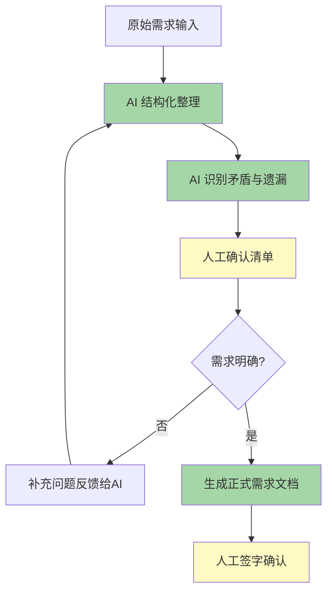

### AI 提示词（完整可复制）

```markdown
## 角色
你是一位资深的企业级 Java 后端需求分析师，有 10 年银行核心系统经验。你的任务是帮我把一段模糊的需求描述转化为结构化、可执行的需求文档。

## 上下文
我们团队使用 Spring Boot + MyBatis-Plus + MySQL 技术栈，是一个企业内部管理系统。系统已有的模块包括：用户管理、权限管理、基础数据管理。

## 原始需求
（在此粘贴原始需求描述）

## 任务

### 第一步：结构化整理
从原始需求中提取并整理为以下结构：

1. **功能概述**：一句话说清楚这个功能要解决什么问题
2. **用户角色**：谁会用到这个功能（如：普通用户、部门经理、系统管理员）
3. **核心场景**：用户分别在什么情况下、以什么目的使用这个功能
4. **输入/输出**：用户给什么、系统返回什么
5. **数据来源**：这些数据从哪些表来（如果提到了具体数据）
6. **非功能需求**：性能、安全、权限等方面有什么要求

### 第二步：发现矛盾与遗漏
列出原始需求中：
1. 互相矛盾的地方（如果 A 又说要 B，逻辑上冲突）
2. 缺失的关键信息（比如没说权限控制、没说分页、没说异常处理）
3. 需要跟产品确认的模糊点

### 第三步：生成确认清单
整理一份给产品经理的确认清单，每一条是一个明确的判断题或选择题，不要开放式问题。

## 输出格式
用 Markdown 格式输出，包含以上三个部分。
```

### AI 输出示例

```markdown
## 一、结构化需求

### 1. 功能概述
为企业内部员工提供多维度的业务数据报表查询与导出功能，支持按时间、部门、业务类型等维度筛选，生成统计报表并支持导出为 Excel。

### 2. 用户角色
- **普通员工**：只能查看本人的数据报表
- **部门经理**：可查看本部门及下属的数据报表
- **系统管理员**：可查看全公司数据，管理报表模板

### 3. 核心场景
| 场景 | 用户 | 操作 | 频率 |
|------|------|------|------|
| 日常查看 | 普通员工 | 登录后查看个人月度业务统计 | 每天 |
| 管理汇总 | 部门经理 | 月底导出部门汇总报表向上汇报 | 每月 |
| 模板配置 | 管理员 | 在后台配置新的报表模板和字段 | 偶尔 |

### 4. 输入/输出
- **输入**：时间范围（起止日期）、部门筛选、业务类型筛选、报表模板选择
- **输出**：表格展示（分页，支持排序）+ Excel 导出按钮

### 5. 数据来源（根据原始需求推断）
- 业务流水表：`t_business_record`
- 用户部门关系表：`t_user_dept`
- 报表模板配置表：`t_report_template` —— ⚠️ 原始需求未提及，推断需要

### 6. 非功能需求
- 单次查询返回不超过 10000 条（前端分页每页 20 条）
- 导出任务超过 5000 条时走异步导出
- 权限：按角色和部门做数据隔离 —— ⚠️ 原始需求未明确说明数据隔离粒度

---

## 二、矛盾与遗漏

### 矛盾点
1. 说「普通员工只能看自己的数据」，但又说「部门内所有人数据共享」——不一致

### 遗漏点
1. **未说明报表模板管理方式**：是固定字段还是可配置？管理员配置模板的交互方式未描述
2. **未说明导出格式**：只说了 Excel，没说是否需要 PDF
3. **未说明历史数据范围**：系统保留多久的数据？是否需要支持跨年度查询？
4. **未说明并发场景**：月底多人同时导出大报表时，系统如何处理？
5. **未说明数据实时性**：报表是实时查询还是走数据仓库 T+1？
6. **未说明移动端适配**：是否需要支持手机查看？

### 需确认的模糊点
1. 「各种数据」具体包含哪些维度和指标？
2. 「最好能导出」——是必须有导出还是一段时间后再说？
3. 是否需要图表可视化（柱状图、折线图）还是纯表格？

---

## 三、确认清单

请产品经理逐条确认：

- [ ] 报表是固定字段还是可配置模板？（A.固定 B.可配置）
- [ ] 数据权限策略是（A.只能看自己的 B.部门内共享 C.分级权限）
- [ ] 导出格式只需要 Excel？（A.是 B.还需要 PDF）
- [ ] 数据实时性要求（A.实时查业务库 B.T+1 数据仓库即可）
- [ ] 是否需要图表可视化？
- [ ] 最大并发导出任务数上限是多少？
- [ ] 第一版 MVP 范围中，导出是否必须包含？
```

### 人工确认点

1. **结构化的核心场景**：检查 AI 推断的用户角色和场景是否覆盖了真实业务，AI 可能漏掉一些特殊的内部角色
2. **矛盾点的判断**：AI 识别的矛盾可能是你自己也没意识到的业务逻辑冲突，确认后需要跟产品对齐
3. **遗漏点的优先级**：AI 列的遗漏点很多，不是每个都要第一版做，你需要在确认清单里标 P0/P1/P2
4. **推断的数据表**：AI 推断的表名和字段名需要对照实际数据库 schema 校验

### 验收标准

- [ ] 需求文档包含了所有用户角色的操作场景
- [ ] 每个场景的输入输出和数据来源都明确了
- [ ] 确认清单全部得到产品经理的回复
- [ ] 原始需求中的矛盾点已跟产品对齐并达成一致
- [ ] 非功能需求（权限、性能、并发）已明确量化指标

### 风险点

- **AI 过度推断**：AI 会基于通用经验补充需求中没有的内容（比如报表模板管理），可能导致需求范围膨胀。人必须逐条判断哪些是真正需要的
- **遗漏业务特有规则**：AI 不了解你公司特有的业务规则（比如某些数据需要脱敏、某些操作需要留痕），这些必须人工补充
- **确认清单太长导致疲劳**：如果 AI 列出 30 个确认项，产品经理可能敷衍回复。建议人工筛选到 10 个以内最关键的

### 团队推广建议

1. 先在内部试跑 3 个需求，对比 AI 辅助前后的需求文档质量差异，用数据说服
2. 把 AI 输出的确认清单固定为团队的需求评审 Checklist，形成团队规范
3. 需求评审会上，用 AI 生成的确认清单作为讨论议程，提高会议效率
4. 注意：不要让产品经理直接跟 AI 对话。由技术人员作为中间人，过滤 AI 输出后再传递

---

## 10.4 工作流2：需求拆解

### 适用场景

拿到一个较大的功能需求（比如「用户管理」或「订单模块」），需要把它拆成可以在一个迭代内完成的子功能。拆得太粗开发估不准工时，拆得太细又失去了整体视角。

### 输入材料

- 上一阶段产出的结构化需求文档
- 系统现有模块清单（帮助 AI 判断哪些子功能可以复用）
- 迭代周期信息（两周、三周还是一个月）

### 流程

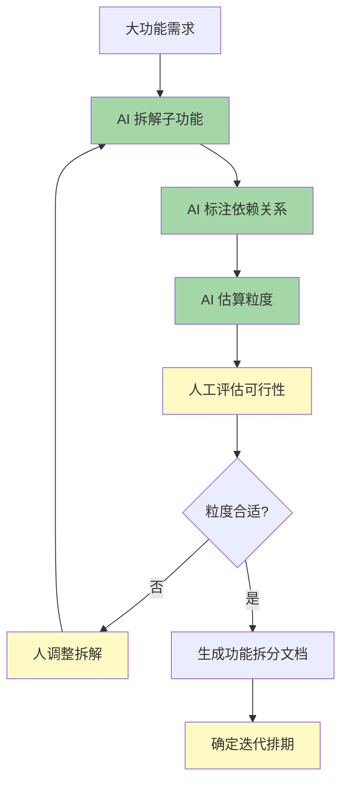

### AI 提示词（完整可复制）

```markdown
## 角色
你是一位有 10 年经验的 Java 技术经理，擅长将大功能拆解为可独立开发的子功能。你的拆解方法论是「每个子功能可以在一周内由一个开发者独立完成，拆解粒度以单表 CRUD + 2-3 个业务规则为基准」。

## 上下文
我们团队使用 Spring Boot + MyBatis-Plus + MySQL，前后端分离架构，迭代周期是两周。团队规模 4 人（2 后端 + 1 前端 + 1 测试）。

## 功能需求
（在此粘贴上一步产出的结构化需求文档）

## 任务

### 第一步：子功能拆解
将大功能拆解为子功能，每个子功能包含：
- **子功能名称**：例如「用户列表查询分页」
- **功能描述**：一句话说明
- **涉及数据表**：明确涉及的表名
- **预估工作量**：用 XS/S/M/L/XL 表示（S=1天 M=3天 L=5天）

### 第二步：标注依赖关系
用依赖图的形式标注子功能之间的依赖：
- A -> B 表示 B 依赖 A 先完成
- 标注哪些子功能可以并行开发

### 第三步：识别技术前置
列出非功能性的技术前置任务：
- 需要新建的数据表
- 需要引入的第三方依赖
- 需要对接的外部系统接口
- 需要搭建的基础设施（如消息队列、缓存）

## 输出格式
```markdown
## 子功能拆解
| 编号 | 子功能 | 描述 | 涉及表 | 工作量 | 优先级 |
|------|--------|------|--------|--------|--------|
| ... | ... | ... | ... | ... | ... |

## 依赖关系
（用文字 + 箭头描述依赖）

## 技术前置任务
- ...
```
```

### AI 输出示例

```markdown
## 子功能拆解

| 编号 | 子功能 | 描述 | 涉及表 | 工作量 | 优先级 |
|------|--------|------|--------|--------|--------|
| F-01 | 报表模板配置 | 管理员创建/编辑/删除报表模板（定义字段、排序、筛选条件） | t_report_template, t_report_template_field | M | P0 |
| F-02 | 报表数据查询 | 按模板 + 筛选条件分页查询报表数据 | t_business_record, t_user_dept | L | P0 |
| F-03 | 数据权限过滤 | 按用户角色和部门自动过滤查询结果 | t_user_dept, t_user_role | M | P0 |
| F-04 | Excel 同步导出 | 前端直接下载当前页数据到 Excel | 无（纯数据转换） | S | P0 |
| F-05 | Excel 异步导出 | 大数据量（>5000条）异步生成 Excel 并通知下载 | t_export_task | L | P1 |
| F-06 | 报表图表展示 | 基于 ECharts 展示柱状图/折线图 | 无（前端渲染） | M | P2 |
| F-07 | 报表定时推送 | 定时任务按配置推送报表到企业微信/邮件 | t_report_schedule, t_report_push_log | L | P2 |
| F-08 | 导出历史管理 | 查看/下载/删除历史导出记录 | t_export_task | S | P1 |
| F-09 | 报表模板权限 | 控制哪些角色可以看到哪些模板 | t_report_template_role | M | P2 |

## 依赖关系

```
F-01（报表模板配置）
  └──> F-02（报表数据查询）──> F-04（同步导出）
  └──> F-03（数据权限过滤）  └──> F-05（异步导出）
                                  └──> F-08（导出历史）
F-02 ──> F-06（图表展示）
F-02 + F-05 ──> F-07（定时推送）
F-01 ──> F-09（模板权限）
```

**可并行开发**：
- 第一批（第一周）：F-01 和 F-03 可并行
- 第二批（第二周）：F-02 依赖 F-01 和 F-03 完成后开始
- 第三批（第三周）：F-04、F-05、F-08 可部分并行
- 第四批：F-06、F-07、F-09（P2，可后续迭代）

## 技术前置任务

### 数据库
- [ ] 新建 `t_report_template` 表（模板定义）
- [ ] 新建 `t_report_template_field` 表（模板字段配置）
- [ ] 新建 `t_export_task` 表（导出任务记录）
- [ ] 新建 `t_report_schedule` 表（定时推送配置）
- [ ] 新建 `t_report_push_log` 表（推送日志）
- [ ] 新建 `t_report_template_role` 表（模板权限关联）

### 第三方依赖
- [ ] 引入 Apache POI（Excel 生成）
- [ ] 引入 xxl-job（异步导出 + 定时推送的调度）

### 外部系统
- [ ] 对接企业微信通知接口（导出完成通知）
- [ ] 对接 MinIO/OSS（导出文件存储）

### 基础设施
- [ ] 消息队列队列配置（异步导出任务队列）——⚠️ 人判断：是否必须 MQ？小团队可以先走数据库轮询
```

### 人工确认点

1. **拆分粒度校准**：AI 按通用经验拆分，但你们团队的实际情况不同——某个功能在你们这可能很简单（因为已有类似模块），也可能很复杂（因为要对接老旧系统）。每个子功能的预估你得重新判断
2. **依赖关系验证**：AI 画的依赖图可能有"过度依赖"的倾向，把不需要串行的也串行了。你需要指出哪些可以更早并行
3. **技术前置的优先级**：AI 列的基础设施要求可能过度（比如 MQ），小团队、小并发可以先从简，后续再升级。标注「简化方案」作为备选
4. **P2 功能的取舍**：AI 倾向于把想到的都列出来，但你要砍掉 MVP 不需要的，避免第一版范围失控
5. **工作量校准**：AI 的 S/M/L/XL 是基于通用经验，结合你团队的实际产出速度调整

### 验收标准

- [ ] 每个子功能有清晰的输入输出描述
- [ ] 依赖关系图无循环依赖
- [ ] 排期计划符合团队人力和迭代周期
- [ ] 数据库表设计在拆解阶段就已识别，不用等开发时再补
- [ ] P0 功能的总工作量在 1-2 个迭代内

### 风险点

- **过度拆解**：一个简单的 CRUD 被 AI 拆成 8 个子功能，实际上 2 个就够了。人需要反向合并过细的拆分
- **漏掉隐式需求**：有些需求产品文档没写但所有人都默认该有的（比如操作日志、数据备份），AI 不会自动补
- **依赖链过长**：AI 可能把 B 依赖 A、C 依赖 B、D 依赖 C 串成一条长链，实际开发中应该尽量解耦并行

### 团队推广建议

1. 需求拆分评审会上用 AI 的输出作为讨论起点，比从零开始高效
2. 把拆分规范固定下来（每个子功能的粒度标准、编号规则），让团队有共同语言
3. 积累团队的历史拆分数据，后续让 AI 参考历史更准确地估算工作量

---

## 10.5 工作流3：需求转用户故事

### 适用场景

已经把需求拆成子功能了，现在需要把每个子功能写成标准格式的用户故事，方便开发团队理解和执行。用户故事的标准格式：`作为<角色>，我希望<功能>，以便<价值>`。

### 输入材料

- 上一阶段产出的功能拆分文档
- 用户角色定义（系统有哪些角色、各自的权限范围）
- 团队约定的用户故事编写规范（如 INVEST 原则）

### 流程

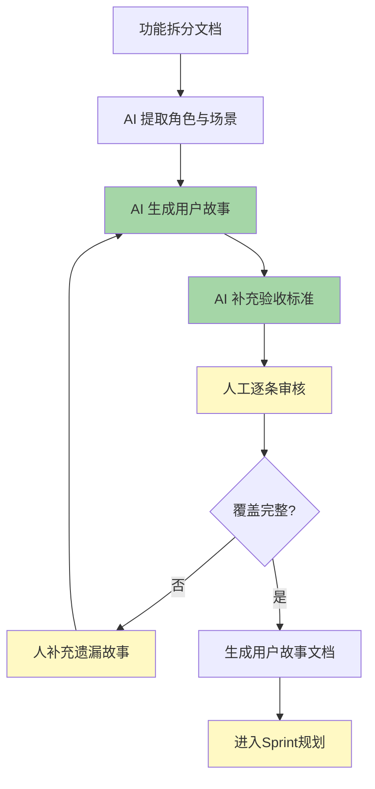

### AI 提示词（完整可复制）

```markdown
## 角色
你是一位资深的敏捷教练和产品负责人（PO），擅长编写高质量的用户故事。你的用户故事严格遵循 INVEST 原则（Independent, Negotiable, Valuable, Estimable, Small, Testable）。

## 上下文
这是一个企业内部管理系统的报表模块。系统的用户角色包括：
- 普通员工：只能查看自己的业务数据
- 部门经理：可查看本部门数据，可导出报表
- 系统管理员：可管理报表模板，查看全公司数据，管理导出任务
- 高管：只读查看汇总数据，不可操作配置

## 功能信息
（在此粘贴上一步的功能拆分文档，包含子功能拆解表和依赖关系）

## 任务

对于每一个子功能，生成 1-3 条用户故事，每条故事包含：

### 用户故事结构
```
故事编号：US-XXX
作为：<角色>
我希望：<功能描述>
以便：<业务价值>
```

### 验收标准（Acceptance Criteria）
每条故事附 3-7 条验收标准，格式：
```
AC-1: <给定条件>，当 <触发操作>，则 <预期结果>
```

### 边界条件
每条故事标注：
- 正常流程
- 异常流程（空数据、超时、无权限等）
- 边界值（最大/最小值、最大条数等）

## 输出格式
对每个子功能，输出以上完整结构。
```

### AI 输出示例

```markdown
## 子功能 F-01：报表模板配置

### US-001：管理员创建报表模板
**作为**：系统管理员
**我希望**：通过后台界面创建一个新的报表模板，定义模板名称、关联的业务数据类型、显示的字段及排序
**以便**：为不同业务场景快速定制报表，而不需要每次开发新功能

**验收标准**：
- AC-1：管理员进入「模板管理」页面，点击「新建模板」，填写模板名称（必填）、选择数据类型（下拉框，必填）、添加字段配置（至少 1 个字段），提交后模板创建成功
- AC-2：模板名称在同数据类型下不可重复，重复时提示「该数据类型下已存在同名模板」
- AC-3：字段配置支持拖拽排序，排序结果在预览和实际报表中生效
- AC-4：创建的模板默认状态为「草稿」，管理员可手动发布

**边界条件**：
- 正常：管理员创建一个包含 5 个字段的模板
- 异常：模板名称为空提交，提示「模板名称不能为空」
- 异常：字段列表为空提交，提示「至少添加一个字段」
- 边界：单个模板最多支持 20 个字段

---

### US-002：管理员编辑和删除报表模板
**作为**：系统管理员
**我希望**：修改已有模板的字段、排序和名称，或删除不再使用的模板
**以便**：灵活适配业务变化，保持模板库整洁

**验收标准**：
- AC-1：管理员在模板列表点击「编辑」，进入编辑页面，修改字段后保存，模板更新
- AC-2：编辑模板时，已使用该模板的报表不受影响（历史记录保留旧字段配置直到下次查询时刷新）
- AC-3：管理员删除模板时，系统弹出二次确认「删除后该模板将无法恢复，确认删除？」
- AC-4：删除模板后，关联该模板的定时推送任务自动停用
- AC-5：已发布的模板不可直接删除，需先「停用」再删除

**边界条件**：
- 正常：修改一个已发布模板的字段排序
- 异常：删除一个仍有关联推送任务的模板，自动停用推送任务后删除
- 边界：正在被使用的模板（有导出任务进行中）不可删除

---

## 子功能 F-02：报表数据查询

### US-003：普通员工查看个人报表
**作为**：普通员工
**我希望**：选择一个报表模板和日期范围，查看我自己相关的业务数据统计
**以便**：了解我的工作产出和业绩情况

**验收标准**：
- AC-1：选择模板（下拉，仅显示该角色有权限的模板）、日期范围（默认本月），点击「查询」后展示报表数据
- AC-2：查询结果按模板配置的默认排序展示，支持前端二次排序（点击列头）
- AC-3：查询结果分页展示，每页 20 条，显示总条数和总页数
- AC-4：日期范围最多跨 12 个月，超出提示「查询时间范围不能超过 12 个月」
- AC-5：如选择了超出其数据权限的筛选条件，系统自动缩小到其权限范围，并提示「已根据您的权限调整查询范围」

**边界条件**：
- 正常：普通员工选择模板查看本月数据
- 异常：选择的日期范围内无数据，提示「所选时间范围内暂无数据」
- 异常：查询超时（30 秒），提示「查询超时，请缩小日期范围后重试」
- 边界：单次查询最大返回 10000 条，超过提示「结果超过 10000 条，请缩小筛选范围或使用导出功能」

---

### US-004：部门经理查看部门汇总报表
**作为**：部门经理
**我希望**：查看本部门及下属部门的数据汇总报表，可按员工维度展开
**以便**：掌握团队整体产出情况，为管理决策提供数据支撑

**验收标准**：
- AC-1：选择模板和日期范围后，默认展示部门汇总数据（按员工分组汇总）
- AC-2：支持点击某员工行展开明细记录
- AC-3：汇总数据行显示合计行（高亮），包括总计和均值
- AC-4：支持按特定指标排序（如按金额、按数量）

**边界条件**：
- 正常：部门经理查看上月本部门汇总数据
- 异常：部门下暂无员工数据，显示空表格 + 提示
- 边界：下属部门超过 10 层时，只汇总到第 3 层，其余归入「其他」
```

### 人工确认点

1. **角色覆盖检查**：检查是否每个角色都有对应的用户故事，AI 可能漏掉某些小众角色（如审计员、合规岗）
2. **验收标准的可测性**：AC 是否全部可以写成自动化测试用例？模糊的 AC（如「用户体验好」）需要改写
3. **业务价值的真实性**：AI 写的「以便」部分可能比较泛（「提高效率」「方便管理」），你需要确认是否反映了真实业务价值
4. **边界条件的完整性**：AI 列的边界条件可能缺了你系统特有的（比如某些状态机流转、某些业务规则），需要按实际业务补充
5. **故事独立性检查**：每个故事应可以独立开发和测试，检查是否有隐式的跨故事依赖

### 验收标准

- [ ] 每个用户角色至少有一条对应的用户故事
- [ ] 每条 AC 都可以写成自动化测试用例
- [ ] 每个故事标识了正常流程、异常流程和边界值
- [ ] 故事之间没有隐式依赖（可独立开发）
- [ ] P0 故事的总点数可在一个迭代内完成

### 风险点

- **故事太多导致评审疲劳**：AI 可能为每个子功能生成 3 条故事，总计 27 条。评审会开 3 小时。人需要在生成前限定范围——「每个子功能只生成核心故事，P2 功能的故事后续再补」
- **验收标准过于理想化**：AI 会写「系统运行流畅」「用户满意度高」这类不可测的标准，人必须替换为可量化的
- **遗漏安全相关故事**：AI 不太会主动写「作为安全管理员，我希望查看操作审计日志」这类合规需求，需要人工补充

### 团队推广建议

1. 用户故事编写是团队协作活动，不要把 AI 的输出直接当最终产物。用它做第一版草案，然后开 1 小时的团队评审
2. 把好的用户故事保存为团队模板，后续新需求让 AI 参考已有模板生成，质量会更高
3. Sprint Planning 时用 AI 生成的用户故事作为估算扑克的输入，比直接拿功能标题估算更准确

---

## 10.6 工作流4：用户故事转功能清单

### 适用场景

用户故事是「用户视角」的描述，但开发需要「系统视角」的详细功能清单：具体有哪些页面、哪些按钮、哪些交互、哪些校验规则。这一步就是把用户故事展开为可编码的功能清单。

### 输入材料

- 上一阶段产出的用户故事文档
- 系统 UI 设计规范（如有）
- 系统现有的通用组件列表（分页组件、文件上传组件等）

### 流程

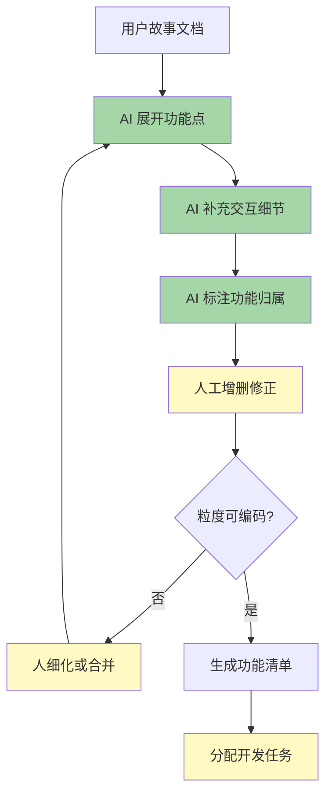

### AI 提示词（完整可复制）

```markdown
## 角色
你是一位资深的 Java 全栈开发工程师，擅长将用户故事转化为详细的功能清单。你的清单要细到「前端开发看完知道有哪些页面和交互，后端开发看完知道有哪些接口和逻辑」。

## 上下文
我们的技术栈：
- 后端：Spring Boot 2.7 + MyBatis-Plus + MySQL 5.7
- 前端：Vue 3 + Element Plus
- 权限：Spring Security + RBAC
- 已有通用组件：分页查询组件、Excel 导出组件、操作日志组件、消息通知组件

## 用户故事
（在此粘贴上一阶段的用户故事文档）

## 任务

对于每个用户故事，展开为详细功能清单，按以下维度组织：

### 前端功能点
- 页面/组件名称
- 页面布局描述（表格/表单/弹窗/抽屉）
- 字段列表（字段名、类型、是否必填、校验规则）
- 按钮及操作（按钮名称、触发条件、点击后的行为）
- 交互规则（加载状态、空状态、错误提示、确认弹窗）

### 后端功能点
- 接口名称和路径
- 业务逻辑描述
- 数据校验规则
- 权限控制点
- 异常处理策略
- 数据库操作（查询/新增/修改/删除哪些表）

### 通用规则
- 所有列表页必须有：分页、搜索、重置、导出按钮
- 所有表单页必须有：表单校验、提交确认、操作日志
- 所有删除操作必须有：二次确认弹窗
- 所有异步操作必须有：loading 状态、成功/失败提示

## 输出格式
按用户故事分组，每个故事下分「前端」和「后端」两部分。
```

### AI 输出示例

```markdown
## US-001：管理员创建报表模板

### 前端功能点

**页面**：模板管理 > 新建模板页面（独立路由 `/report/template/create`）

**页面布局**：
- 上部：面包屑导航（报表管理 > 模板管理 > 新建模板）
- 中部：表单区域
- 底部：操作按钮区（固定在底部）

**表单字段**：

| 字段 | 控件类型 | 必填 | 校验规则 |
|------|---------|------|---------|
| 模板名称 | Input | 是 | 2-50 个字符，同数据类型下唯一 |
| 数据类型 | Select 下拉 | 是 | 从字典表加载 `biz_data_type` |
| 模板描述 | Textarea | 否 | 最长 200 字符 |
| 字段配置区 | 动态列表 | 是 | 至少 1 行，每行选择字段名、别名、排序号、是否汇总 |

**字段配置区交互**：
- 点击「添加字段」在末尾新增一行
- 每行右侧有拖拽手柄和删除按钮
- 支持上下拖拽调整字段顺序
- 字段名从数据类型的字段字典中加载
- 排序号自动递增（可手动修改）

**底部操作按钮**：
| 按钮 | 位置 | 触发条件 | 行为 |
|------|------|---------|------|
| 保存草稿 | 底部左侧 | 始终可用 | 保存，状态=草稿 |
| 保存并发布 | 底部右侧 | 始终可用 | 保存，状态=已发布 |
| 预览 | 底部右侧 | 至少添加 1 个字段 | 右侧弹出预览面板，展示模拟数据 |
| 返回 | 底部左侧 | 始终可用 | 返回上一页，未保存弹窗提示 |

**交互规则**：
- 首次进入页面，表单为空，字段配置区默认展示 3 个空行
- 保存成功后跳转到模板列表页，Toast 提示「模板创建成功」
- 保存失败（名称重复、网络超时等），在当前页提示错误信息，不跳转
- 预览面板为右侧抽屉，宽度 400px，展示 5 行模拟数据
- 离开页面未保存时，弹出「您有未保存的内容，确定离开吗？」

### 后端功能点

**接口**：`POST /api/v1/report/templates`

**请求体**：
```json
{
  "name": "月度业务统计报表",
  "dataType": "BIZ_RECORD",
  "description": "用于月度业务统计汇总",
  "status": "DRAFT",
  "fields": [
    {
      "fieldCode": "biz_date",
      "fieldAlias": "业务日期",
      "sortOrder": 1,
      "isSummary": false,
      "width": 120
    },
    {
      "fieldCode": "biz_amount",
      "fieldAlias": "业务金额",
      "sortOrder": 2,
      "isSummary": true,
      "width": 150
    }
  ]
}
```

**业务逻辑**：
1. 校验模板名称：同一 `dataType` 下不可重名（`SELECT COUNT(*) FROM t_report_template WHERE name = ? AND data_type = ?`）
2. 校验字段列表：`fields` 数组长度 >= 1 且 <= 20
3. 校验每个字段的 `fieldCode` 是否存在于该 `dataType` 的字段字典中
4. 校验 `sortOrder` 在字段列表中唯一
5. 事务写入：
   - 插入 `t_report_template` 主表
   - 批量插入 `t_report_template_field` 子表
6. 记录操作日志（`t_operation_log`）：操作人、操作时间、操作内容（模板名称）、操作结果

**权限控制**：
- 仅 `ROLE_ADMIN` 可访问此接口
- 使用 `@PreAuthorize("hasRole('ADMIN')")`

**异常处理**：
| 场景 | HTTP 状态码 | 错误码 | 提示信息 |
|------|------------|--------|---------|
| 参数校验失败 | 400 | PARAM_INVALID | 具体校验失败信息 |
| 名称重复 | 409 | NAME_DUPLICATE | 该数据类型下已存在同名模板 |
| 字段 code 无效 | 400 | FIELD_CODE_INVALID | 字段 {code} 不在 {dataType} 的字段字典中 |
| 服务器内部错误 | 500 | INTERNAL_ERROR | 系统繁忙，请稍后重试 |

---

## US-003：普通员工查看个人报表

### 前端功能点

**页面**：报表查询页（路由 `/report/query`）

**页面布局**：
- 顶部：筛选条件区（可折叠）
- 中部：操作按钮区 + 数据展示区（表格）
- 底部：分页组件

**筛选条件区**：

| 筛选字段 | 控件类型 | 默认值 | 说明 |
|----------|---------|--------|------|
| 报表模板 | Select | 第一个可用模板 | 仅显示该用户有权限的模板 |
| 开始日期 | DatePicker | 本月 1 日 | 不能晚于结束日期 |
| 结束日期 | DatePicker | 今天 | 不能早于开始日期，跨度不超过 12 个月 |
| 业务类型 | Select（多选） | 全选 | 从字典加载，支持多选 |

**操作按钮区**：

| 按钮 | 触发条件 | 行为 | 位置 |
|------|---------|------|------|
| 查询 | 始终可用 | 调用查询接口，展示数据 | 筛选区下方左侧 |
| 重置 | 始终可用 | 恢复默认筛选条件 | 查询按钮右侧 |
| 导出 Excel | 查询结果 > 0 条 | ≤5000 条同步下载，>5000 条走异步导出 | 查询按钮右侧 |
| 刷新 | 查询结果存在 | 保持当前条件重新查询 | 表格右上角图标 |

**数据表格**：
- 列配置：根据所选模板的字段动态渲染
- 支持列头点击排序（升序/降序/取消）
- 汇总列（`isSummary=true` 的列）在表格底部显示合计行，合计行有浅灰背景
- 金额列右对齐，文本列左对齐，日期列居中
- 空状态：查询无结果时展示 Empty 插画 + 「暂无数据」文字
- Loading：查询过程中表格区域展示 Skeleton 骨架屏

**分页组件**：
- 默认每页 20 条，可选 10/20/50/100
- 显示「共 X 条，第 Y/Z 页」
- 支持页码跳转输入框

**交互规则**：
- 切换模板后，表格列自动刷新为新模板的字段
- 日期范围超出12个月时，自动截断并 Toast 提示
- 查询超时 30 秒后停止 loading，Toast「查询超时，请缩小日期范围后重试」
- 数据权限过滤由后端自动处理，前端不需要额外逻辑

### 后端功能点

**接口**：`POST /api/v1/report/data/query`

**请求体**：
```json
{
  "templateId": 1001,
  "startDate": "2026-06-01",
  "endDate": "2026-06-30",
  "bizTypes": ["TYPE_A", "TYPE_B"],
  "pageNum": 1,
  "pageSize": 20,
  "sortField": "biz_amount",
  "sortOrder": "desc"
}
```

**业务逻辑**：
1. 校验 `templateId` 是否存在且状态=已发布
2. 校验当前用户是否有该模板的查看权限
3. 根据用户角色和部门，构建数据权限过滤条件（注入 WHERE 子句）
4. 根据模板的字段配置，动态构建 SELECT 列
5. 加上筛选条件（日期范围、业务类型），执行分页查询
6. 对 `isSummary=true` 的字段计算合计值，附加到返回体中
7. 单次查询最多 10000 条（`pageNum * pageSize <= 10000`）

**权限控制**：
- 使用 RBAC + 数据权限注解：`@DataScope(deptAlias = "d", userAlias = "u")`
- 普通员工：`WHERE t.user_id = currentUserId`
- 部门经理：`WHERE t.dept_id IN (currentUserDeptTree)`

**异常处理**：
| 场景 | HTTP 状态码 | 错误码 |
|------|------------|--------|
| 模板不存在或未发布 | 400 | TEMPLATE_NOT_FOUND |
| 无模板查看权限 | 403 | TEMPLATE_PERMISSION_DENIED |
| 日期范围超过 12 个月 | 400 | DATE_RANGE_EXCEEDED |
| 查询超时 | 504 | QUERY_TIMEOUT |
| 结果超过 10000 条 | 400 | RESULT_EXCEED_LIMIT |
```

### 人工确认点

1. **前端功能点的完整性**：检查是否有遗漏的页面状态（网络断开、接口报错、数据为空），AI 可能漏掉极端状态
2. **后端逻辑的技术可行性**：AI 写的动态 SQL 拼接方案，需要确认你们的 MyBatis-Plus 版本是否支持，以及这种动态方案的性能是否可接受
3. **业务规则的一致性**：AI 可能在不同故事中写不同的规则（比如 A 故事里默认 20 条每页，B 故事里变成了 10 条），需要统一
4. **权限控制的粒度**：AI 可能写得比实际需要更复杂或更简单，需要对照现有的权限框架评估
5. **隐式需求补充**：操作日志、数据脱敏、接口幂等性等团队规范要求，AI 不会主动加入，需要人补充

### 验收标准

- [ ] 每个用户故事的前端功能点完整到前端可以独立开发
- [ ] 每个用户故事的后端逻辑清晰到后端可以独立开发
- [ ] 所有接口有明确的路径、请求体、响应体、错误码定义
- [ ] 所有的异常场景都有对应的错误处理和提示
- [ ] 交互规则涵盖了加载、空状态、错误、边界情况

### 风险点

- **功能清单变成过度设计**：AI 倾向于把每个交互细节都展开，可能产生大量非核心功能。你需要标注 MVP 范围
- **前后端接口字段不一致**：AI 写的前端表单字段和后端接口字段可能不一致（字段名、类型），需要交叉校验
- **忽略了现有系统的代码复用**：AI 不知道你们已有的公共组件，倾向于每次都重新设计。人需要标注「此处复用 xx 组件」

### 团队推广建议

1. 功能清单是前后端联调的「契约」。让前端和后端同时在 AI 生成的功能清单上标注各自的疑问，然后开 30 分钟的对齐会
2. 用 AI 生成的功能清单作为测试用例的输入，测试团队可以直接从这里提取测试场景
3. 功能清单写完后先别急着开发，拿它给产品经理看一眼——很多时候产品经理看完才会意识到「这里我其实想要的是另一种交互」

---

## 10.7 工作流5：功能清单转接口清单

### 适用场景

功能清单写完了，后端需要定义接口。这一步就是把功能清单中的「前端需要的数据」和「前端提交的操作」转化为 RESTful API 端点列表，包括请求参数、响应结构、状态码。

### 输入材料

- 上一阶段产出的功能清单文档
- 团队 API 设计规范（命名规范、版本号规则、通用响应结构）
- 现有的 Swagger/OpenAPI 文档（帮助 AI 保持风格一致）

### 流程

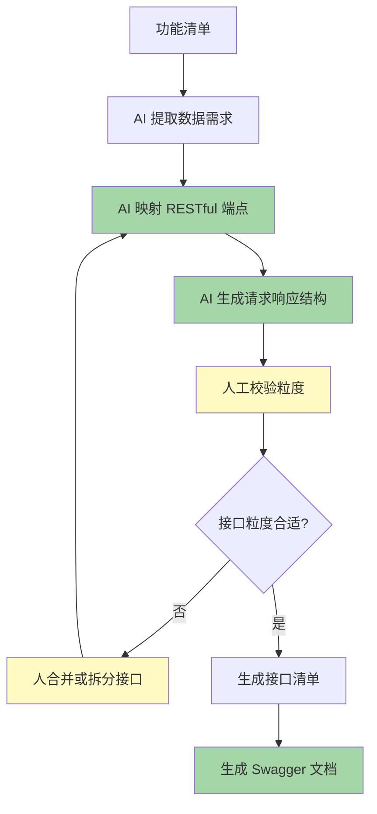

### AI 提示词（完整可复制）

```markdown
## 角色
你是一位资深的 Java 后端架构师，擅长 RESTful API 设计。你的接口设计原则：
1. 资源导向：URL 是名词复数，如 `/api/v1/reports`
2. 统一响应结构：`{ "code": 200, "message": "success", "data": {...} }`
3. 版本管理：URL 路径带版本号 `/api/v1/`
4. 分页统一：`{ "records": [...], "total": 100, "pageNum": 1, "pageSize": 20 }`

## 上下文
我们的通用响应结构：
```json
{
  "code": 200,
  "message": "success",
  "data": {},
  "timestamp": 1751388800000
}
```

分页响应结构：
```json
{
  "code": 200,
  "message": "success",
  "data": {
    "records": [],
    "total": 100,
    "pageNum": 1,
    "pageSize": 20,
    "totalPages": 5
  },
  "timestamp": 1751388800000
}
```

## 功能清单
（在此粘贴上一阶段的功能清单文档）

## 任务

从功能清单中提取所有后端接口，按以下结构组织：

### 接口定义格式

```markdown
### [接口编号] [接口名称]

- **方法**：GET / POST / PUT / DELETE
- **路径**：/api/v1/resource/{id}/action
- **描述**：一句话
- **权限**：需要的角色或权限表达式

**请求参数**：
| 参数名 | 类型 | 必填 | 位置 | 说明 |
|--------|------|------|------|------|
| ... | ... | ... | ... | ... |

**请求体示例**（POST/PUT）：
```json
{ ... }
```

**成功响应示例**：
```json
{ ... }
```

**错误码**：
| HTTP 状态码 | 业务错误码 | 说明 |
|------------|-----------|------|
| ... | ... | ... |
```

### 接口分组
按资源类型分组：
- 报表模板：`/api/v1/report/templates`
- 报表数据：`/api/v1/report/data`
- 导出任务：`/api/v1/report/exports`
- 定时推送：`/api/v1/report/schedules`
```

### AI 输出示例

```markdown
# 报表模块 API 接口清单

## 1. 报表模板

### API-001 创建报表模板

- **方法**：POST
- **路径**：`/api/v1/report/templates`
- **描述**：管理员创建一个新的报表模板
- **权限**：`hasRole('ADMIN')`

**请求体**：
```json
{
  "name": "月度业务统计报表",
  "dataType": "BIZ_RECORD",
  "description": "用于月度业务统计汇总",
  "status": "DRAFT",
  "fields": [
    { "fieldCode": "biz_date", "fieldAlias": "业务日期", "sortOrder": 1, "isSummary": false },
    { "fieldCode": "biz_amount", "fieldAlias": "业务金额", "sortOrder": 2, "isSummary": true }
  ]
}
```

**成功响应**（201 Created）：
```json
{
  "code": 201,
  "message": "创建成功",
  "data": { "id": 1001 },
  "timestamp": 1751388800000
}
```

**错误码**：
| HTTP | 业务错误码 | 说明 |
|------|-----------|------|
| 400 | PARAM_INVALID | 参数校验失败 |
| 409 | NAME_DUPLICATE | 同数据类型下模板名称重复 |
| 400 | FIELD_CODE_INVALID | 字段 code 不在字段字典中 |

---

### API-002 查询模板列表

- **方法**：GET
- **路径**：`/api/v1/report/templates`
- **描述**：分页查询模板列表，支持按名称、数据类型、状态筛选
- **权限**：`hasRole('ADMIN')`

**请求参数**：
| 参数名 | 类型 | 必填 | 位置 | 说明 |
|--------|------|------|------|------|
| name | String | 否 | Query | 模板名称（模糊搜索） |
| dataType | String | 否 | Query | 数据类型编码 |
| status | String | 否 | Query | 状态：DRAFT/PUBLISHED/DISABLED |
| pageNum | Integer | 是 | Query | 页码，默认 1 |
| pageSize | Integer | 是 | Query | 每页条数，默认 20 |

**成功响应**：
```json
{
  "code": 200,
  "message": "success",
  "data": {
    "records": [
      {
        "id": 1001,
        "name": "月度业务统计报表",
        "dataType": "BIZ_RECORD",
        "dataTypeName": "业务记录",
        "status": "PUBLISHED",
        "fieldCount": 5,
        "createTime": "2026-06-15 10:30:00",
        "updateTime": "2026-06-20 14:22:00"
      }
    ],
    "total": 25,
    "pageNum": 1,
    "pageSize": 20,
    "totalPages": 2
  },
  "timestamp": 1751388800000
}
```

---

### API-003 获取模板详情

- **方法**：GET
- **路径**：`/api/v1/report/templates/{id}`
- **描述**：获取单个模板的完整信息，包含字段配置列表
- **权限**：`hasRole('ADMIN')`

**请求参数**：
| 参数名 | 类型 | 必填 | 位置 | 说明 |
|--------|------|------|------|------|
| id | Long | 是 | Path | 模板 ID |

**成功响应**：
```json
{
  "code": 200,
  "message": "success",
  "data": {
    "id": 1001,
    "name": "月度业务统计报表",
    "dataType": "BIZ_RECORD",
    "description": "用于月度业务统计汇总",
    "status": "PUBLISHED",
    "fields": [
      { "id": 1, "fieldCode": "biz_date", "fieldAlias": "业务日期", "sortOrder": 1, "isSummary": false },
      { "id": 2, "fieldCode": "biz_amount", "fieldAlias": "业务金额", "sortOrder": 2, "isSummary": true }
    ],
    "createTime": "2026-06-15 10:30:00",
    "updateTime": "2026-06-20 14:22:00"
  },
  "timestamp": 1751388800000
}
```

---

## 2. 报表数据查询

### API-004 查询报表数据

- **方法**：POST
- **路径**：`/api/v1/report/data/query`
- **描述**：根据模板和筛选条件查询报表数据，自动按用户权限过滤
- **权限**：`hasAnyRole('EMPLOYEE', 'MANAGER', 'ADMIN', 'EXECUTIVE')`

**请求体**：
```json
{
  "templateId": 1001,
  "startDate": "2026-06-01",
  "endDate": "2026-06-30",
  "bizTypes": ["TYPE_A", "TYPE_B"],
  "deptId": null,
  "userId": null,
  "pageNum": 1,
  "pageSize": 20,
  "sortField": "biz_amount",
  "sortOrder": "desc"
}
```

**成功响应**：
```json
{
  "code": 200,
  "message": "success",
  "data": {
    "records": [
      { "biz_date": "2026-06-15", "user_name": "张三", "dept_name": "技术部", "biz_amount": 150000.00 }
    ],
    "total": 156,
    "pageNum": 1,
    "pageSize": 20,
    "totalPages": 8,
    "summary": { "biz_amount": 2340000.00 }
  },
  "timestamp": 1751388800000
}
```

**错误码**：
| HTTP | 业务错误码 | 说明 |
|------|-----------|------|
| 400 | TEMPLATE_NOT_FOUND | 模板不存在或未发布 |
| 403 | TEMPLATE_PERMISSION_DENIED | 无该模板查看权限 |
| 400 | DATE_RANGE_EXCEEDED | 日期跨度超限 |
| 400 | RESULT_EXCEED_LIMIT | 结果超过 10000 条 |
| 504 | QUERY_TIMEOUT | 查询超时 |

---

## 3. 报表导出

### API-005 同步导出 Excel

- **方法**：POST
- **路径**：`/api/v1/report/data/export-sync`
- **描述**：直接导出当前查询结果为 Excel 文件（≤5000 条）
- **权限**：同 API-004
- **Content-Type**：`application/vnd.openxmlformats-officedocument.spreadsheetml.sheet`
- **响应**：二进制文件流，文件名 `报表_月度业务统计报表_20260601-20260630.xlsx`

---

### API-006 提交异步导出任务

- **方法**：POST
- **路径**：`/api/v1/report/exports`
- **描述**：提交一个异步导出任务（>5000 条），返回任务 ID
- **权限**：`hasAnyRole('MANAGER', 'ADMIN')`

**请求体**：
```json
{
  "templateId": 1001,
  "startDate": "2026-01-01",
  "endDate": "2026-06-30",
  "bizTypes": ["TYPE_A", "TYPE_B"]
}
```

**成功响应**（202 Accepted）：
```json
{
  "code": 202,
  "message": "导出任务已提交",
  "data": { "taskId": "EXP20260630001", "estimatedSeconds": 30 },
  "timestamp": 1751388800000
}
```

---

### API-007 查询导出任务状态

- **方法**：GET
- **路径**：`/api/v1/report/exports/{taskId}`
- **描述**：查询异步导出任务的状态和下载链接
- **权限**：仅任务创建人

**成功响应**：
```json
{
  "code": 200,
  "message": "success",
  "data": {
    "taskId": "EXP20260630001",
    "status": "COMPLETED",
    "fileName": "报表_月度业务统计报表_20260101-20260630.xlsx",
    "fileSize": 2457600,
    "downloadUrl": "/api/v1/report/exports/EXP20260630001/download",
    "createTime": "2026-06-30 10:00:00",
    "completeTime": "2026-06-30 10:00:25"
  },
  "timestamp": 1751388800000
}
```

---

## 完整接口汇总

| 编号 | 方法 | 路径 | 描述 | 权限 |
|------|------|------|------|------|
| API-001 | POST | `/api/v1/report/templates` | 创建模板 | ADMIN |
| API-002 | GET | `/api/v1/report/templates` | 模板列表 | ADMIN |
| API-003 | GET | `/api/v1/report/templates/{id}` | 模板详情 | ADMIN |
| API-004 | PUT | `/api/v1/report/templates/{id}` | 更新模板 | ADMIN |
| API-005 | DELETE | `/api/v1/report/templates/{id}` | 删除模板 | ADMIN |
| API-006 | PUT | `/api/v1/report/templates/{id}/status` | 发布/停用模板 | ADMIN |
| API-007 | POST | `/api/v1/report/data/query` | 查询报表数据 | ALL |
| API-008 | POST | `/api/v1/report/data/export-sync` | 同步导出 Excel | ALL |
| API-009 | POST | `/api/v1/report/exports` | 提交异步导出 | MANAGER+ |
| API-010 | GET | `/api/v1/report/exports/{taskId}` | 查询导出状态 | 创建人 |
| API-011 | GET | `/api/v1/report/exports/{taskId}/download` | 下载导出文件 | 创建人 |
| API-012 | GET | `/api/v1/report/exports` | 导出历史列表 | 创建人 |
| API-013 | GET | `/api/v1/report/templates/available` | 当前用户可用模板 | ALL |
```

### 人工确认点

1. **接口粒度校验**：AI 可能把一个功能拆得太细（比如「修改模板名称」单独一个接口），也可能太粗（比如一个接口干了三件事）。你要按团队约定的粒度标准统一。原则上一个接口对应一个用户操作
2. **权限标注准确性**：AI 不知道你们系统具体的角色编码（ROLE_ADMIN 还是 ADMIN），需要替换为实际的角色标识。以及你们是否有数据权限的额外逻辑
3. **分页参数命名一致性**：确认 `pageNum/pageSize` vs `page/pageSize` vs `offset/limit` 在团队内统一
4. **文件下载接口的认证方式**：如果导出文件下载是通过 URL，需要考虑鉴权方式（Token 在 Header 还是 Query 参数？文件存储在 MinIO 的话 URL 如何保护？）
5. **接口版本管理**：AI 默认用 `/api/v1/`，确认这是你们团队的版本规范

### 验收标准

- [ ] 每个用户操作（增删改查）至少有一个对应的接口
- [ ] 所有接口的请求和响应结构明确定义（字段名、类型、是否必填、含义）
- [ ] 每个接口有明确的权限要求
- [ ] 错误码覆盖了主要异常场景
- [ ] 接口命名遵循团队约定的 RESTful 规范

### 风险点

- **RESTful 洁癖**：AI 可能严格遵循 RESTful 标准，产生不适合实际业务的接口设计（比如用 5 个接口做一件简单的事）。实际开发中，「实用性 > RESTful 纯正性」
- **漏掉批量操作接口**：功能清单中的批量操作（批量删除、批量导出），AI 可能设计成循环调用单个接口。需要补充真正的批量接口
- **文件下载的安全风险**：导出文件如果直接返回文件流而没有鉴权，可能导致数据泄露。人必须补充鉴权方案
- **响应结构中的敏感字段**：AI 可能在接口响应中暴露了不应该返回的字段（如密码哈希、内部 ID），需要审核

### 团队推广建议

1. 接口清单生成后，直接导入 Swagger Editor 或 Apifox，生成可视化的 API 文档，方便前端直接使用 Mock
2. 接口清单出来后，后端和前端一起过一遍，确认每个接口的请求和响应都满足前端需要——提前发现问题比联调时发现强 10 倍
3. 团队建立接口清单的 Review Checklist：权限、分页、错误码、幂等性、版本号，每项必须打勾

---

## 10.8 工作流6：技术方案生成

### 适用场景

需求和接口都清楚了，需要写技术方案文档。技术方案需要回答几个核心问题：怎么做、为什么这么做、有哪些风险。这不是纯粹的模板填空——AI 需要理解你的系统架构上下文，才能写出有意义的方案。

### 输入材料

- 前面产出的需求文档、用户故事、功能清单、接口清单
- 系统架构说明文档（技术栈、部署架构、现有模块依赖关系）
- 团队的技术决策记录（ADR，如果有的话）
- 非功能需求（性能指标、SLA、安全要求）

### 流程

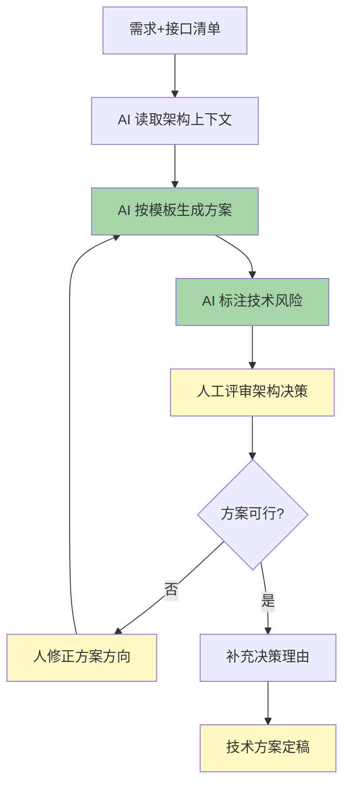

### AI 提示词（完整可复制）

```markdown
## 角色
你是一位资深的 Java 后端架构师，有 10 年企业级系统设计经验。你的技术方案文档以「可落地」为首要原则。

## 系统架构上下文
（在此描述你的系统当前架构，越具体 AI 产出的方案越有价值）
- 技术栈：Spring Boot 2.7 + MyBatis-Plus 3.5 + MySQL 5.7 + Redis 6 + RabbitMQ
- 部署架构：2 台应用服务器（16C/32G）+ 1 台 MySQL 主库 + 1 台只读从库 + Redis Cluster
- 每日活跃用户：约 2000 人
- 核心业务表 `t_business_record` 日增量约 50 万条，当前总量约 3 亿条
- 已有模块：用户中心、权限管理、工作流引擎、消息通知中心
- 命名约定：包名 `com.company.project.report`，表名前缀 `t_report_`

## 需求文档与接口清单
（在此粘贴前面产出的完整需求文档和接口清单）

## 任务

请按照以下模板生成技术方案文档：

### 1. 方案概述
- 业务背景（1-2 段）
- 设计目标（列出量化的目标，如「查询响应时间 < 2s」「支持 100 并发导出」）
- 设计原则（如「优先复用现有组件」「不引入新的中间件」）

### 2. 架构设计
- 模块划分（用文字描述模块及其职责）
- 模块间调用关系（用 Mermaid 画）
- 与现有系统的集成点

### 3. 数据库设计
- 新增表的 DDL（完整字段、索引、注释）
- 表之间的 ER 关系
- 索引设计理由
- 数据量预估和分表策略（如果需要）

### 4. 核心流程设计
- 关键业务流程的时序图（用 Mermaid 画）
- 每个步骤的详细说明
- 状态流转（如果涉及）

### 5. 缓存设计
- 哪些数据适合缓存
- 缓存 Key 设计
- 缓存更新策略（旁路缓存 / 写穿 / 写回）
- 缓存失效时间

### 6. 性能设计
- 针对性能瓶颈的设计（SQL 优化、索引、异步化）
- 数据量增长后的应对策略

### 7. 安全设计
- 权限控制方案
- 数据脱敏方案
- SQL 注入防护
- 敏感数据传输加密

### 8. 风险与应对
- 技术风险（如大表查询性能）
- 业务风险（如数据权限合规）
- 应对措施和降级方案

## 输出格式
完整 Markdown 文档，每个部分不要省略。
```

### AI 输出示例

限于篇幅，这里展示核心部分的示例，实际 AI 会输出完整文档：

```markdown
# 报表模块技术方案

## 1. 方案概述

### 业务背景
当前系统已积累约 3 亿条业务流水记录，日均增量 50 万条。业务部门长期依赖手工导出 Excel 做数据统计，效率低且容易出错。本方案构建统一的报表模块，实现报表模板可配置、数据查询实时化、导出异步化。

### 设计目标
| 指标 | 目标值 |
|------|--------|
| 报表查询 P95 响应时间 | < 2 秒 |
| 异步导出任务完成时间 | < 60 秒（1 万条以内） |
| 并发导出任务数 | 支持 50 个任务并行 |
| 数据权限过滤 | 100% 覆盖，零数据泄漏 |

### 设计原则
1. **复用优先**：报表模块复用现有权限框架（RBAC + 数据权限注解），不重复造轮子
2. **不引入新中间件**：现有 RabbitMQ 做异步导出消息队列，不引入 Kafka
3. **模板化驱动**：报表字段由模板配置驱动，新增报表类型不改代码

---

## 2. 架构设计

### 模块划分

```
com.company.project.report
├── report-admin          # 管理端（模板 CRUD、导出任务管理）
├── report-query           # 查询端（报表数据查询、同步导出）
├── report-export          # 导出服务（异步导出任务消费、文件生成）
├── report-schedule        # 定时推送（定时任务调度与推送）
└── report-common          # 公共模块（数据权限拦截、工具类）
```

### 模块间调用关系

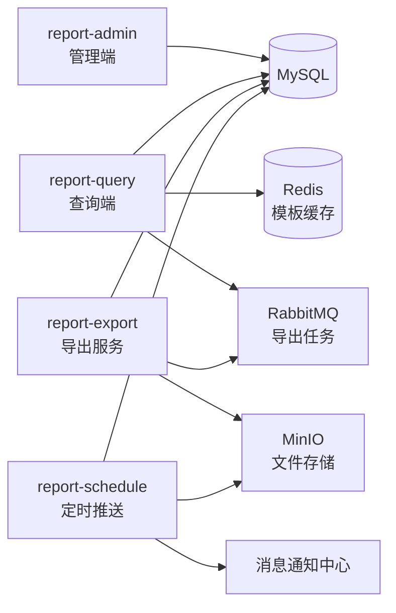

### 与现有系统集成
- **用户中心**：通过 Feign 调用获取用户信息、部门树
- **权限管理**：复用 `@DataScope` 注解实现数据权限过滤
- **消息通知中心**：导出完成后通过通知中心推送消息（企业微信/站内信）
- **工作流引擎**：（暂不集成，后续考虑导出任务审批流程）

---

## 3. 数据库设计

### 新增表

#### t_report_template（报表模板主表）

```sql
CREATE TABLE `t_report_template` (
    `id` BIGINT NOT NULL AUTO_INCREMENT COMMENT '主键',
    `name` VARCHAR(100) NOT NULL COMMENT '模板名称',
    `data_type` VARCHAR(50) NOT NULL COMMENT '数据类型编码',
    `description` VARCHAR(500) DEFAULT NULL COMMENT '模板描述',
    `status` VARCHAR(20) NOT NULL DEFAULT 'DRAFT' COMMENT '状态：DRAFT-草稿, PUBLISHED-已发布, DISABLED-已停用',
    `is_deleted` TINYINT NOT NULL DEFAULT 0 COMMENT '逻辑删除：0-未删除, 1-已删除',
    `create_user` VARCHAR(50) NOT NULL COMMENT '创建人',
    `create_time` DATETIME NOT NULL DEFAULT CURRENT_TIMESTAMP COMMENT '创建时间',
    `update_user` VARCHAR(50) DEFAULT NULL COMMENT '修改人',
    `update_time` DATETIME NOT NULL DEFAULT CURRENT_TIMESTAMP ON UPDATE CURRENT_TIMESTAMP COMMENT '修改时间',
    PRIMARY KEY (`id`),
    KEY `idx_data_type_status` (`data_type`, `status`),
    KEY `idx_name` (`name`)
) ENGINE=InnoDB DEFAULT CHARSET=utf8mb4 COMMENT='报表模板主表';
```

#### t_report_template_field（模板字段配置表）

```sql
CREATE TABLE `t_report_template_field` (
    `id` BIGINT NOT NULL AUTO_INCREMENT COMMENT '主键',
    `template_id` BIGINT NOT NULL COMMENT '模板ID',
    `field_code` VARCHAR(100) NOT NULL COMMENT '字段编码',
    `field_alias` VARCHAR(100) NOT NULL COMMENT '字段别名（显示名）',
    `sort_order` INT NOT NULL DEFAULT 0 COMMENT '排序号',
    `is_summary` TINYINT NOT NULL DEFAULT 0 COMMENT '是否汇总：0-否, 1-是',
    `width` INT DEFAULT NULL COMMENT '列宽（px）',
    PRIMARY KEY (`id`),
    KEY `idx_template_id` (`template_id`)
) ENGINE=InnoDB DEFAULT CHARSET=utf8mb4 COMMENT='模板字段配置表';
```

#### t_export_task（导出任务表）

```sql
CREATE TABLE `t_export_task` (
    `id` BIGINT NOT NULL AUTO_INCREMENT COMMENT '主键',
    `task_id` VARCHAR(32) NOT NULL COMMENT '任务编号（业务唯一标识）',
    `template_id` BIGINT NOT NULL COMMENT '模板ID',
    `template_name` VARCHAR(100) NOT NULL COMMENT '模板名称（冗余）',
    `query_params` JSON NOT NULL COMMENT '查询参数（JSON）',
    `status` VARCHAR(20) NOT NULL DEFAULT 'PENDING' COMMENT '状态：PENDING-待处理, PROCESSING-处理中, COMPLETED-已完成, FAILED-失败',
    `total_records` INT DEFAULT NULL COMMENT '导出总条数',
    `file_name` VARCHAR(200) DEFAULT NULL COMMENT '文件名',
    `file_path` VARCHAR(500) DEFAULT NULL COMMENT '文件存储路径',
    `file_size` BIGINT DEFAULT NULL COMMENT '文件大小（字节）',
    `error_msg` VARCHAR(1000) DEFAULT NULL COMMENT '错误信息',
    `create_user` VARCHAR(50) NOT NULL COMMENT '创建人',
    `create_time` DATETIME NOT NULL DEFAULT CURRENT_TIMESTAMP COMMENT '创建时间',
    `complete_time` DATETIME DEFAULT NULL COMMENT '完成时间',
    PRIMARY KEY (`id`),
    UNIQUE KEY `uk_task_id` (`task_id`),
    KEY `idx_create_user_status` (`create_user`, `status`),
    KEY `idx_status_create_time` (`status`, `create_time`)
) ENGINE=InnoDB DEFAULT CHARSET=utf8mb4 COMMENT='导出任务表';
```

### 索引设计理由
- `idx_data_type_status`：模板查询最常用的筛选条件（按数据类型 + 状态），联合索引避免回表
- `uk_task_id`：导出任务编号的唯一索引，防止重复提交和快速查询
- `idx_create_user_status`：用户查看自己导出历史的高频查询组合

### 数据量预估
- `t_report_template`：模板数量有限，预估 < 500 条，无需分表
- `t_export_task`：按日均 200 个导出任务，年增长约 7 万条，保留最近 90 天数据，定时归档
- 报表查询不新建数据表，直接查 `t_business_record`（已有 3 亿条），关键依靠索引和查询条件限制

---

## 4. 核心流程设计

### 4.1 报表数据查询流程

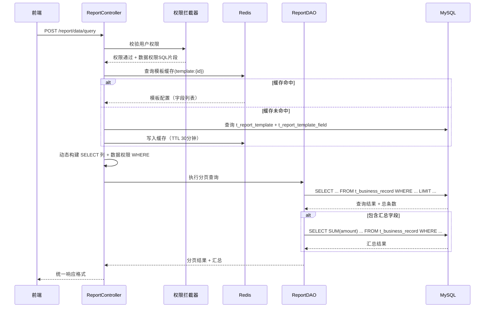

**关键设计决策**：
- **动态 SQL 方案**：根据模板字段配置，在 MyBatis 层使用 `<if>` 和 `<foreach>` 动态拼接 SELECT 列。不使用 MyBatis-Plus 的自动映射，因为列是不确定的
- **数据权限注入**：使用 MyBatis 拦截器，在 SQL 执行前注入 `WHERE` 条件片段，避免在每个 DAO 方法中手动拼权限条件
- **汇总查询优化**：如果模板包含汇总字段，在同一个数据库连接中执行第二条 COUNT/SELECT 查询，不额外开连接

### 4.2 异步导出流程

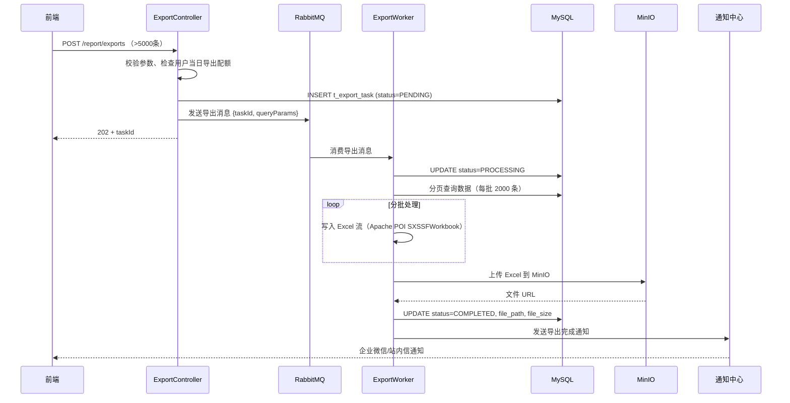

### 4.3 导出任务状态流转

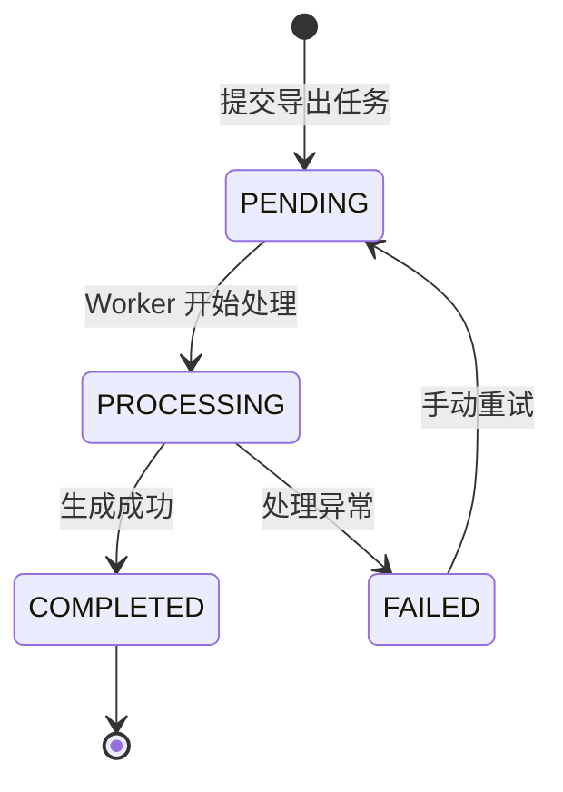

---

## 5. 缓存设计

| 缓存数据 | Key 设计 | TTL | 更新策略 |
|---------|---------|-----|---------|
| 模板配置 | `report:template:{templateId}` | 30 分钟 | 模板更新时主动删除缓存 |
| 模板列表（管理端） | `report:template:list:{dataType}` | 10 分钟 | 模板变更时主动删除 |
| 字段字典 | `report:field:dict:{dataType}` | 60 分钟 | 定时刷新 + 手动刷新 |
| 用户可用模板 | `report:template:user:{userId}` | 5 分钟 | 权限变更时删除 |

**缓存更新策略**：采用 Cache-Aside（旁路缓存）模式。查询时先读缓存，未命中读 DB 并回写缓存；更新时先更新 DB，再删除缓存。

---

## 6. 性能设计

### 关键查询优化

**t_business_record 大表查询**：
1. **强制时间范围**：查询必须带日期范围，且跨度 <= 12 个月，利用分区裁剪（如果做了时间分区）
2. **覆盖索引**：为高频查询字段组合建联合索引 `idx_dept_date_type (dept_id, biz_date, biz_type)`
3. **汇总查询分离**：汇总字段走从库查询，避免影响主库写入
4. **结果集限制**：单次查询最大返回 10000 条，超过强制走异步导出

### 导出性能优化
- 使用 SXSSFWorkbook（流式写入），内存中只保留 100 行，避免 OOM
- 分批查询（每次 2000 条），避免一次性加载全部数据
- 导出任务在独立线程池中执行，核心线程数 = 10，最大线程数 = 50
- 单个用户同时只能有 3 个处理中的导出任务，超过拒绝

---

## 7. 安全设计

### 权限控制
- **接口级**：Spring Security `@PreAuthorize` 注解
- **数据级**：自定义 `@DataScope` 注解 + MyBatis 拦截器注入 SQL
- **字段级**：管理员可查看全部字段，普通员工部分金额字段脱敏（返回 `***`）

### SQL 注入防护
- 动态列名和排序字段使用白名单校验，拒绝不在模板字段列表中的值
- 所有用户输入使用 MyBatis `#{ }` 参数化查询

### 导出文件安全
- MinIO 文件访问通过预签名 URL（有效期 10 分钟）
- 仅任务创建人可下载自己的导出文件

---

## 8. 风险与应对

| 风险 | 影响 | 概率 | 应对措施 | 降级方案 |
|------|------|------|---------|---------|
| 3 亿大表查询超时 | P0 查询不可用 | 中 | 强制时间范围 + 索引优化 + 只读从库 | 限制查询跨度为 3 个月 |
| 异步导出挤压任务过多 | P1 导出延迟 | 中 | 用户配额限制 + 任务队列监控 | 暂停新导出，优先消费积压 |
| 模板字段配置错误 | P2 数据显示异常 | 低 | 模板发布前预览校验 | 回滚模板版本 |
| MinIO 不可用 | P1 导出文件丢失 | 低 | MinIO Cluster 多副本 | 本地临时存储 + 手动迁移 |
```

### 人工确认点

1. **架构决策的确认**：AI 提出的架构方案（比如动态 SQL、分页策略、缓存方案）是基于你的上下文推断的，但不是唯一方案。你需要判断这些方案是否适合你的实际环境——比如 AI 假设你用 RabbitMQ，但你们实际用的是 RocketMQ
2. **数据库设计的审阅**：AI 生成的 DDL 包含字段类型、索引、注释，非常完整，但你需要确认：字段长度是否够用、索引是否过多（每个索引都有写入成本）、字段命名是否符合团队规范
3. **时序图的逻辑正确性**：AI 画的时序图可能漏掉一些步骤（比如事务边界、锁机制、补偿逻辑），需要对照实际代码流程走查
4. **性能假设的验证**：AI 说的「加这个索引就能达到 < 2s」，是基于通用经验，你需要结合实际的 3 亿条数据量和数据分布重新评估
5. **安全方案的完整性**：AI 覆盖了权限、SQL 注入、文件下载鉴权这些常见点，但你们的系统可能有额外的合规要求（比如等保三级要求操作日志不可删除、要求三员分立），这些需要人工补充

### 验收标准

- [ ] 方案回答了「怎么做」「为什么这么做」「有什么风险」三个核心问题
- [ ] 数据库设计给出了完整 DDL 和索引设计理由
- [ ] 核心流程有清晰的时序图
- [ ] 性能设计有针对已知瓶颈的具体优化措施
- [ ] 风险清单包含了备选方案和降级策略

### 风险点

- **方案过度设计**：AI 倾向于把方案写得尽善尽美，可能导致第一版的技术方案过于复杂。MVP 应该从简，后续迭代再补
- **复制的架构假设不成立**：AI 基于「你说了你用 RabbitMQ」来设计，但可能你们实际并没有把 MQ 用于业务异步，需要新增。需要评估引入 MQ 的额外成本
- **忽略了运维复杂度**：AI 设计的方案可能开发和测试阶段没问题，但上线后的监控、告警、日志排查方案是缺失的，人工需要补充运维视图

### 团队推广建议

1. 技术方案文档是团队集体智慧的结晶，不要一个人 + AI 写完就拍板。至少拉上 1-2 个后端同事做 30 分钟的方案评审
2. 把 AI 生成的方案中的「设计决策」段落提取出来，跟团队已有的 ADR（架构决策记录）格式对齐，收入团队知识库
3. 技术方案中的 Mermaid 时序图和架构图可以直接用于团队分享和新人 onboarding

---

## 10.9 工作流7：技术方案评审

### 适用场景

技术方案写完了，需要做一次系统性的评审，发现方案中的设计缺陷、遗漏点、不符合团队最佳实践的地方。传统方案评审依赖评审人的经验，经验不足的人可能看不出问题。AI 在这步可以作为一个「永不疲倦的评审人」，按检查清单逐项排查。

### 输入材料

- 待评审的技术方案文档
- 团队编码规范和架构规范
- 团队已知的常见设计缺陷清单（如有）
- 类似模块的历史事故记录（帮助 AI 识别风险模式）

### 流程

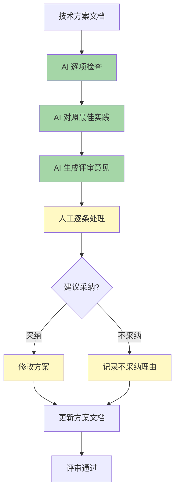

### AI 提示词（完整可复制）

```markdown
## 角色
你是一位严苛的技术评审人，有 15 年 Java 企业级系统架构经验。你的评审风格是「假设方案有问题，逐项证明它没问题」。你不会因为「看起来差不多」而放过任何细节。

## 评审原则
1. 任何接口都必须有鉴权方案
2. 任何数据库操作都必须考虑数据量增长后的性能
3. 任何异步操作都必须有失败补偿机制
4. 任何对外接口都必须是幂等的（POST 除外）
5. 任何涉及金额的字段都必须使用 BigDecimal
6. 任何文件操作都必须考虑存储空间和清理策略
7. 任何定时任务都必须有防重机制
8. 任何缓存都必须有过期时间和更新策略

## 团队规范对齐
（在此粘贴你们团队的编码规范和架构规范要点）
- 禁止在 Controller 层写业务逻辑
- 所有 SQL 必须使用参数化查询，动态排序字段必须白名单校验
- 金额字段统一使用 Decimal(18,2)，Java 侧 BigDecimal
- 分页查询必须有 count 上限（最大 100 页）
- 导出功能必须限制单日导出次数

## 系统上下文
（在此粘贴系统架构上下文）

## 待评审方案
（在此粘贴完整的技术方案文档）

## 任务

请从以下 8 个维度逐项评审，每个维度给出具体的改进建议（不要只说「这里有问题」，要说「什么问题、怎么改」）：

### 1. 架构设计评审
- 模块划分是否合理？是否有循环依赖？
- 与现有系统的集成方式是否正确？
- 是否引入了不必要的复杂度？

### 2. 数据库设计评审
- 表结构是否满足第三范式？是否有反范式设计？理由是否充分？
- 索引设计是否合理？是否遗漏关键查询的索引？是否有多余索引？
- 是否有分表/分区策略的必要性？当前方案是否支持未来数据增长？
- 字段类型是否正确（金额 Decimal、状态 VARCHAR 还是 ENUM、JSON 字段的 MySQL 版本兼容性）？

### 3. 接口设计评审
- RESTful 规范是否一致（命名、路径、方法、状态码）？
- 请求参数是否有完整的校验规则？
- 响应体是否包含敏感信息？
- 分页参数是否有默认值和上限约束？

### 4. 性能设计评审
- 是否有慢查询风险？是否做了性能预估？
- 缓存策略是否合理？是否有缓存穿透/雪崩/击穿的防护？
- 是否有大事务风险？事务边界是否正确？
- 并发场景是否有考虑（乐观锁、分布式锁）？

### 5. 安全设计评审
- 权限控制是否覆盖所有接口？
- 是否有水平越权风险（修改不属于自己的数据）？
- 文件上传/下载是否有安全校验？
- SQL 注入/XSS/CSRF 是否有防护？

### 6. 异常处理评审
- 异常分类是否完整（业务异常 vs 系统异常）？
- 异常日志是否有足够上下文（用户、参数、traceId）？
- 是否有降级和熔断策略？
- 异步任务的失败重试机制？

### 7. 可维护性评审
- 关键设计决策是否有注释说明理由？
- 是否有过度抽象或不必要的设计模式？
- 方案是否包含运维视图（监控指标、告警规则、日志格式）？

### 8. 完整性评审
- 方案是否遗漏了功能需求中的某些场景？
- 是否有未覆盖的边界条件？
- 是否有隐含的技术债务（临时方案、硬编码、TODO）？

## 输出格式

```markdown
# 技术方案评审报告

## 评审概要
- 方案名称：xxx
- 评审时间：xxx
- 总体评分：X/10
- 严重问题：X 个（阻塞上线）
- 重要问题：X 个（建议修改）
- 建议优化：X 个（可选）
- 亮点：X 个

## 严重问题（阻塞上线）
| # | 维度 | 问题 | 影响 | 修改建议 |
|---|------|------|------|---------|
| ... | ... | ... | ... | ... |

## 重要问题（建议修改）
| # | 维度 | 问题 | 影响 | 修改建议 |
|---|------|------|------|---------|
| ... | ... | ... | ... | ... |

## 建议优化（可选）
| # | 维度 | 问题 | 修改建议 |
|---|------|------|---------|
| ... | ... | ... | ... |

## 方案亮点
- ...
```
```

### AI 输出示例

```markdown
# 技术方案评审报告

## 评审概要
- 方案名称：报表模块技术方案
- 评审时间：2026-07-01
- 总体评分：7/10（方案整体可行，有若干需要修正的点）
- 严重问题：2 个（阻塞上线）
- 重要问题：5 个（建议修改）
- 建议优化：4 个（可选）
- 亮点：3 个

---

## 严重问题（阻塞上线）

| # | 维度 | 问题 | 影响 | 修改建议 |
|---|------|------|------|---------|
| 1 | 安全 | 导出文件下载接口 `GET /api/v1/report/exports/{taskId}/download` 没有描述鉴权方案。当前方案只说「仅任务创建人可下载」，但未说明如何验证下载人身份。如果预签名 URL 被转发，任何拿到 URL 的人都能下载 | 数据泄露风险 | 明确下载鉴权方案：方案 A——下载时校验 Token + taskId 归属；方案 B——预签名 URL 中嵌入临时 Token 并验证。推荐方案 A |
| 2 | 数据库 | `t_report_template_field` 表的 `sort_order` 字段没有唯一约束，同一模板内可能出现重复排序号，导致字段展示顺序不稳定 | 字段排序异常 | 在 `(template_id, sort_order)` 上加唯一联合索引，或在应用层做 sort_order 调整逻辑 |

---

## 重要问题（建议修改）

| # | 维度 | 问题 | 影响 | 修改建议 |
|---|------|------|------|---------|
| 1 | 性能 | 方案提到 t_business_record 有 3 亿条数据，但没有设计分区策略。按当前设计，即使加了索引，跨月查询仍需扫描大量数据 | P95 < 2s 的目标可能达不成 | 增加按 `biz_date` 做 RANGE 分区的设计，按月分区。同时评估是否可以在查询时强制分区裁剪 |
| 2 | 性能 | 汇总查询「在同一个数据库连接中执行第二条 SUM 查询」——但没有说明如果 SUM 查询也超时怎么办 | 汇总行不出来，用户体验差 | 汇总查询设置独立超时时间（< 500ms），超时则汇总行为空 + 标注「汇总数据加载超时」，不阻塞主查询 |
| 3 | 异常处理 | 异步导出 Worker 处理失败后状态变为 FAILED，但没有任何重试机制。方案提到「手动重试」但没有给出手动重试的交互方式 | 用户导出失败后不知道该怎么办 | 补充自动重试策略：首次失败 1 分钟后自动重试 1 次，仍失败则通知用户并提供「手动重试」按钮 |
| 4 | 异常处理 | 方案没有提到分布式锁，如果多个 Worker 同时消费同一条导出消息怎么办 | 重复导出浪费资源 | 在消费消息时增加分布式锁（Redis SETNX），锁 Key = `export:lock:{taskId}`，超时 30 分钟，处理完释放 |
| 5 | 可维护性 | 动态 SQL 拼接方案依赖 MyBatis 的 `<if>` 和 `<foreach>`，但没有设计抽象层。未来新增模板查询逻辑会很重复 | 维护成本高 | 设计一个 `DynamicQueryBuilder` 工具类，封装动态 SELECT、动态 WHERE 的拼接逻辑 |

---

## 建议优化（可选）

| # | 维度 | 问题 | 修改建议 |
|---|------|------|---------|
| 1 | 架构 | `report-query` 和 `report-admin` 分为两个模块，但目前看起来它们共享大量 DAO 和 Service。两个模块的边界比较模糊 | 合并为 `report-service` 单一模块，用 Controller 层的路径区分管理和查询 |
| 2 | 数据库 | `t_export_task` 使用 JSON 类型存 `query_params`，但 MySQL 5.7 的 JSON 支持不完全（JSON 函数少、性能一般） | 改用 TEXT 字段，应用层做序列化/反序列化。或者确认 MySQL 版本 >= 5.7.8 且 JSON 查询不频繁 |
| 3 | 性能 | 缓存设计只考虑了单 Key，没有说批量失效策略。管理端修改字段字典后，可能影响多个模板缓存 | 补充缓存批量失效方案：维护一个 `report:template:version` 全局版本号，所有模板缓存 Key 拼上版本号，全局刷新时递增版本号 |
| 4 | 可维护性 | 方案中用了多处「后续考虑」——导出任务的审批流程、模板版本回滚 | 在方案末尾增加一个「后续规划」章节，把这些 TODO 集中管理，标注优先级和负责人 |

---

## 方案亮点

1. **模板驱动 + 动态 SQL 的设计**：将报表字段抽象为模板配置，新增报表类型不改代码，设计思路清晰且可扩展性好
2. **缓存旁路策略的完整设计**：明确标注了 Cache-Aside 模式的选择，给出了 Key 设计、TTL 和更新策略，比绝大多数方案完整
3. **风险清单的实用性**：风险标注了概率、影响和降级方案，可操作性强，不是形式主义
```

### 人工确认点

1. **严重问题的威胁评估**：AI 标记的「严重问题」不一定完全严重。比如「数据库缺少分区」在某些场景下可能不是阻塞问题（3 亿数据在加了索引 + 时间范围限制后性能可接受）。需要人基于实际数据量判断
2. **建议的实操性**：AI 给出的修改建议是否在你的系统中切实可行？比如「把这 2 个模块合并」，需要确认是否跟团队的模块管理策略一致
3. **不采纳理由的记录**：对于不采纳 AI 建议的条目，必须记录理由。这些理由本身就是团队知识资产——后续评审时可以回顾「为什么当时选择不做分区」
4. **评分的主观性**：AI 给的 7/10 不代表什么，不要纠结于分数，关注具体的评审条目

### 验收标准

- [ ] 所有严重问题都有修改方案或明确的不采纳理由
- [ ] 重要问题至少处理了 80%
- [ ] 建议优化项有明确处理计划（采纳/延期/不采纳）
- [ ] 评审报告已归档到方案文档的附录中
- [ ] 方案修改后二次评审通过

### 风险点

- **评审过严导致方案返工过度**：AI 会列出大量「应该这样做」的建议，全部采纳可能导致方案过于复杂。需要人判断哪些是 MVP 必须的，哪些可以后续迭代
- **AI 的评审不够深入**：AI 只能基于你给的上下文和通用最佳实践评审，无法发现跟你的业务逻辑深层耦合的问题。这类问题仍然需要人脑发现
- **评审成为一种形式主义**：如果团队只是跑完 AI 评审然后存档，不逐条讨论处理，这个流程就失去了意义。必须强制要求逐条回复

### 团队推广建议

1. 把技术方案评审作为方案定稿的前置条件——方案没有 AI 评审报告不允许进入开发
2. 积累团队自己的评审规则，在 AI 提示词中补充团队特有的检查项（比如「必须支持灰度发布」「必须有数据回滚方案」）
3. 评审结果不只是给写方案的人看——严重问题应该同步给 Tech Lead 和项目经理，作为风险评估的输入
4. 定期回顾 AI 评审的历史记录，分析团队方案的常见问题模式，更新编码规范

---

## 10.10 七个工作流的串联

下面是七个工作流在企业实际流程中的位置和关系：

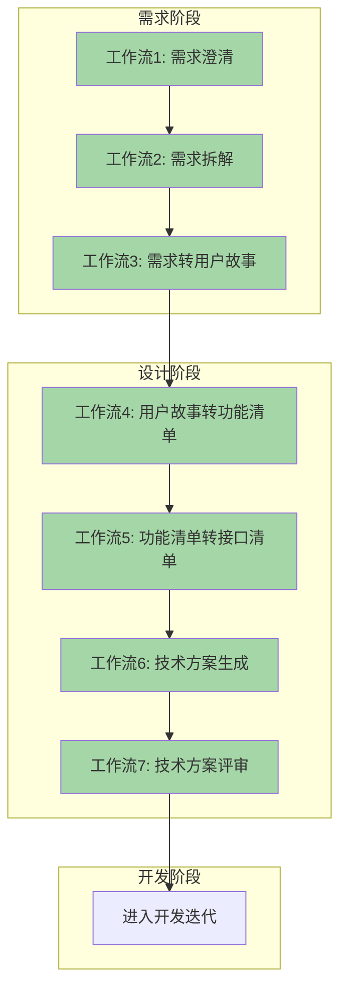

需要注意：

1. **不是每个需求都要走完七个工作流**。一个简单的 CRUD 可能跳过工作流1-3，直接从功能清单开始。一个技术优化需求可能跳过需求阶段的三个工作流。用你的判断力
2. **每个工作流的输入是上一个工作流的输出**。如果你跳过了前面的工作流，需要自己手动准备好输入材料
3. **人工确认点不可跳过**。AI 的产出是初稿，人的审阅是质量关卡。跳过人工确认直接进入下一步工作流，错误会层层放大
4. **逐步建立团队的 AI 协作规范**。刚开始可以每个工作流都让人完整审阅，随着对 AI 输出质量的信任积累，可以逐步降低审阅深度（从「逐行审阅」到「抽查关键部分」）

---

## 10.11 实际落地路线

如果你的团队想从零开始用 AI 辅助需求和设计，推荐的落地路径：

### 第一周：个人试点

1. 选一个这周要做的新需求（中等复杂度，不要太大也不要太小）
2. 按工作流1-3跑一遍，拿到 AI 产物，跟平时的做法对比
3. 记录：AI 省了多少时间、AI 产出的质量怎么样、哪些地方 AI 做得比人好、哪些地方不如
4. 把对比结果写成一份简短的内部笔记（半页就够了），用在第二周说服团队

### 第二-三周：小范围推广

1. 在团队周会上分享你的试点结果（用数据说话：「省了 40% 的需求文档编写时间」「AI 提醒了 3 个我之前没想到的边界条件」）
2. 邀请 2-3 个对 AI 感兴趣的同事组成试行小组
3. 统一使用相同的提示词（本章提供的就是经过验证的版本）
4. 试行小组每周同步一次：遇到了什么问题、哪一步 AI 的输出不够好、提示词怎么改

### 一个月后：建立团队规范

1. 基于试行小组的反馈，定制化提示词（补充团队特有的业务术语、模块信息、历史经验）
2. 把本章的七个工作流订制为你们团队的「需求设计阶段 AI 协作手册」
3. 在团队内部确定「必用场景」（哪些需求必须走 AI 工作流）和「选用场景」（哪些可选的）
4. 建立 AI 产物的归档模板——保证换一个人打开 AI 生成的产物，能看懂当时做了什么

### 关键提醒

- **AI 是加速器，不是决策器**。任何需求决策、方案取舍，最终拍板的是人
- **不要追求 AI 的一次性完美输出**。把 AI 当成「一次给出 80% 正确」的工具，把人工审阅当成「补上剩下的 20%」
- **提示词是团队资产**。把经过反复验证的好用提示词汇编起来，这是团队的 AI 协作基础设施，比代码库里的工具类还重要
- **质量底线不放松**。AI 帮你省了时间，意味着你有更多时间做深度思考和质量把关——不要把省下的时间也砍掉，把它投入到提高质量上

---

## 10.12 本章要点回顾

1. **七个完整工作流覆盖了从模糊需求到技术方案评审的完整链路**。每个工作流都包含完整的提示词、AI 输出示例和人工确认点，可以直接复制使用
2. **人机分工的核心原则：AI 做结构化产出，人做业务判断和最终决策**。AI 不会累所以适合做全面覆盖，但不会理解业务所以需要人纠偏
3. **工作流可以串联也可以独立使用**。简单需求跳步，复杂需求走完整流程
4. **每个工作流的人工确认点不是形式**。这一步是质量闸门——AI 会在你不注意的地方犯低级错误
5. **提示词是你跟 AI 之间的 SDK**。写得越具体，AI 的输出越精准。不要用模糊提示词碰运气
6. **不要只看 AI 做得好的部分**——更要关注它漏了什么，那些遗漏才是你真正的价值所在

> AI 让你把时间从「写文档」转移到「审文档」。审查永远比创作快——前提是你已经知道自己要什么。
