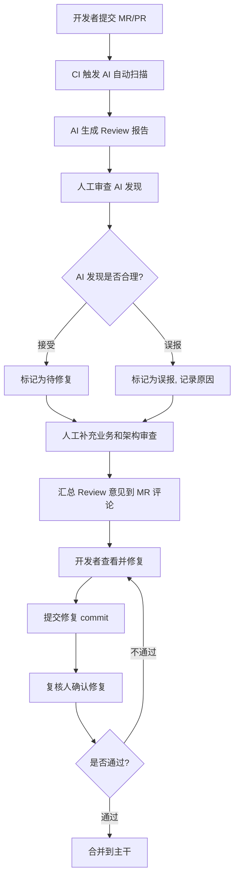

# 第12章 AI 代码 Review 实战

> **目标读者**：Java 后端 Tech Lead，希望用 AI 提升团队 Code Review 效率和质量。
> **本章回答的核心问题**：AI 做 Code Review 到底靠不靠谱？能审什么、不能审什么？怎么把 AI Review 嵌入现有流程？

---

## 12.1 AI Code Review 能做什么、不能做什么

先用一张表把边界划清楚。很多团队对 AI Review 的期望过高或过低，都是因为没搞清楚这张表。

| 检查维度 | AI 能做 | AI 做不好 | 为什么 |
|----------|---------|-----------|--------|
| 空指针风险 | 很好 | | 模式固定：未判空直接调用、Optional 用法错误、返回 null 不标注 @Nullable，AI 训练数据中有大量空指针 bug 修复案例 |
| SQL 注入风险 | 很好 | | MyBatis `${}` vs `#{}` 是确定的语法模式，AI 能精确识别；字符串拼接 SQL 也是明确的反模式 |
| 代码风格 | 很好 | | 命名规范、缩进、import 排序、注释格式都是机械规则，AI 执行比人更一致 |
| 异常处理完整性 | 较好 | | 能发现 catch 后吞异常、未记录日志、未处理特定异常类型，但判断"这个异常是否应该在这里捕获"需要业务上下文 |
| 资源释放 | 很好 | | try-with-resources、close() 调用、连接池归还都是确定的模式，漏掉就是 bug |
| N+1 查询 | 较好 | | 能从代码结构识别"循环内调用 Mapper"的模式，但跨文件跨层的情况（Service 调 Service 再调 Mapper）可能漏检 |
| 权限校验缺失 | 较好 | | @PreAuthorize、@Secured 注解的有无是确定的，但"这个接口到底需要什么权限"AI 判断不了 |
| 参数校验 | 较好 | | @Valid、@NotNull 等注解的有无可机械检查，但校验规则是否完备（比如金额必须 > 0）AI 可能想不到 |
| 并发安全问题 | 部分 | 部分 | HashMap 代替 ConcurrentHashMap、SimpleDateFormat 线程不安全等已知反模式能识别；但复杂的竞态条件、分布式锁粒度问题 AI 基本不懂 |
| 事务边界正确性 | 部分 | 部分 | @Transactional 放错位置（比如放在 Controller 层）、事务传播行为明显错误能识别；但长事务拆分、事务隔离级别选择需要业务判断 |
| 日志完整性 | 部分 | 部分 | 关键分支缺少日志、异常处理中未记录日志能发现；但"这个日志级别应该是 WARN 还是 ERROR"需要运维经验判断 |
| 敏感数据泄露 | 较好 | | 日志中打印明文密码、返回 JSON 中包含敏感字段、脱敏缺失都是确定的检查项 |
| 可维护性判断 | 部分 | 部分 | 方法过长、圈复杂度过高、重复代码能识别；但"这个抽象是否合理""这个设计要不要重构"是主观判断 |
| 代码覆盖合理性 | 部分 | 部分 | 能检查测试方法是否存在、是否覆盖了主要分支；但"这个边界条件要不要测"取决于业务风险判断 |
| 业务逻辑正确性 | 不行 | 人必须做 | AI 不知道你的业务规则——它不知道"VIP 用户免运费"只适用于订单金额 > 50 的情况，也不知道"这个字段虽然叫 status 但在特定场景下不能是 3" |
| 架构合理性 | 不行 | 人必须做 | 分层是否合理、依赖方向是否正确、模块边界是否清晰，这些需要全局视野和领域经验，AI 最多指出明显的反模式（比如 Controller 直接调 DAO） |
| 安全漏洞深度分析 | 不行 | 人必须做 | OWASP Top 10 的表面模式 AI 能识别，但攻击链分析、权限提升路径、逻辑漏洞挖掘需要安全专家的攻击者思维 |

**关键认知**：AI 擅长的是"模式匹配"类检查，不擅长的是"语义理解"类检查。把 AI 当成一个永不疲倦的初级 Review 者——它能帮你扫掉 60-70% 的机械问题，但业务和架构的判断必须人来做。

---

## 12.2 AI Code Review 提示词模板

下面是一套完整的 Java 后端 Review Prompt，直接复制到你的 AI 工具中使用。模板分为"系统设定"和"单次 Review 指令"两部分。

### 12.2.1 系统设定（System Prompt）

```
你是一名资深 Java 后端代码审查专家，拥有 10 年以上 Spring Boot + MyBatis 技术栈经验。
你的任务是对提交的代码变更（diff）进行系统化审查，找出潜在缺陷和改进点。

## 审查原则
1. 只指出真正有问题的地方，不要为了凑数提无意义的建议
2. 每个问题必须给出具体的位置（文件名 + 行号范围或方法名）
3. 每个问题必须给出修复建议和判断依据
4. 按严重程度排序：P0（阻断）> P1（高危）> P2（建议）> P3（优化）
5. 对不确定的问题，明确标注"置信度：低/中/高"，而不是用模糊语言
6. 明确指出你审查的范围和假设前提

## 审查清单（按优先级排序）

### P0 - 阻断级别（必须修复才能合并）
- 空指针风险：未对返回值、参数、Optional 进行 null 检查
- SQL 注入：MyBatis 中使用 ${} 而非 #{} 拼接用户输入
- 敏感数据泄露：日志中打印密码、token、身份证号等敏感信息
- 事务边界错误：资金操作未加事务、事务范围包含外部调用
- 权限缺失：对外接口缺少 @PreAuthorize 或 @Secured 注解

### P1 - 高危级别（强烈建议修复）
- 异常处理不完整：catch 块为空、吞掉异常未记录日志
- 资源未释放：未使用 try-with-resources，未在 finally 中 close
- 并发安全问题：使用 HashMap 而非 ConcurrentHashMap 在多线程环境
- 参数校验缺失：Controller 入参未添加 @Valid/@Validated 注解
- 不安全的反序列化：接受外部 ObjectInputStream 未做类型检查

### P2 - 建议级别（应当修复）
- N+1 查询：在循环中调用 Mapper 方法
- 日志不完整：关键分支未记录日志、异常处理中缺少上下文信息
- 事务传播行为不当：嵌套事务使用了错误的 Propagation 级别
- 异常类型不当：抛出了过于宽泛的 Exception 而非具体异常
- 线程安全类使用不当：SimpleDateFormat 作为静态变量

### P3 - 优化级别（建议考虑）
- 方法过长（超过 50 行）
- 圈复杂度过高（嵌套超过 3 层）
- 重复代码：相同的逻辑出现在多个地方
- 命名不规范：变量名、方法名不符合 Java 命名约定
- 缺少必要的注释：复杂算法、魔法数字缺少说明
- 可选优化：可以使用 Stream API 简化集合操作

## 上下文假设
- 项目使用 Spring Boot 2.x/3.x + MyBatis/MyBatis-Plus
- 使用 Maven/Gradle 构建
- API 使用 RESTful 风格
- 数据库使用 MySQL/PostgreSQL

## 输出格式
对每个发现的问题，按以下格式输出：

**严重程度**：[P0/P1/P2/P3]
**文件位置**：`文件名:行号` 或 `类名.方法名()`
**置信度**：[高/中/低]
**问题描述**：（一句话描述问题）
**当前代码**：
```java
// 相关代码片段
```
**风险**：（为什么这是个问题，可能导致什么后果）
**修复建议**：
```java
// 修复后的代码
```
**判断依据**：（引用的规范、最佳实践或推理过程）
```

### 12.2.2 单次 Review 指令模板

```
请审查以下代码变更，遵循系统设定中的审查清单和输出格式。

## 变更说明
[简述这次变更的目的和业务背景，帮助 AI 理解上下文]

## 变更文件列表
- src/main/java/com/xxx/controller/OrderController.java
- src/main/java/com/xxx/service/OrderService.java
- src/main/java/com/xxx/mapper/OrderMapper.java
...

## 代码变更 (diff)

```diff
[粘贴 git diff 内容]
```

## 额外关注点（可选）
- [比如：重点关注金额计算相关的逻辑]
- [比如：本次变更涉及支付回调，请特别注意幂等性处理]
```

### 12.2.3 专项检查 Prompt 片段

针对特定场景，可以在通用 Prompt 基础上追加以下专项指令。

**资金操作专项**：
```
本次变更涉及资金操作，请额外检查：
1. 所有金额计算是否使用 BigDecimal（禁止使用 float/double）
2. 金额比较是否使用 compareTo() 而非 ==
3. 扣款/退款操作是否有幂等性保护（唯一流水号 + 状态机）
4. 事务边界是否覆盖了所有写操作
5. 是否有并发扣款的超卖风险
```

**支付回调专项**：
```
本次变更涉及第三方支付回调，请额外检查：
1. 回调接口是否做了签名验证
2. 是否处理了重复回调（幂等性）
3. 回调处理是否在事务之外做了异步化（避免回调超时）
4. 回调失败是否有重试机制或人工补偿入口
```

**定时任务专项**：
```
本次变更涉及定时任务，请额外检查：
1. 是否添加了 @DistributedLock 或类似的分布式锁
2. 批量处理是否有分页，避免一次加载全部数据
3. 异常处理是否做了"单条失败不影响其他"的隔离
4. 是否有执行时长监控和超时告警
```

---

## 12.3 AI Code Review 工作流

把 AI Review 嵌入团队日常流程，推荐以下 8 步工作流。



### 各步骤详解

**第 1 步：开发者提交 MR/PR**

开发者完成代码后，按正常流程提交 Merge Request。MR 描述中必须包含：
- 变更目的（一段话）
- 影响范围（涉及哪些模块）
- 测试情况（自测了哪些场景）
- 额外关注点（哪些地方需要 Review 者特别注意）

填写完整的 MR 描述有两个好处：一是帮助人工 Review 者快速理解，二是可以直接作为 AI Review 的"变更说明"输入。

**第 2 步：CI 触发 AI 自动扫描**

在 CI 流水线中配置（详见 12.8 节），当 MR 创建或更新时自动执行：
1. 获取 MR 的 diff
2. 读取 MR 描述中的"变更说明"
3. 调用 AI API，传入 diff + 系统设定 Prompt
4. 等待 AI 返回审查结果

这个过程大约需要 30 秒到 2 分钟，取决于 diff 大小和 AI 响应速度。

**第 3 步：AI 生成 Review 报告**

AI 按 12.2 节的输出格式，生成结构化的 Review 报告。报告包含：
- 按严重程度排序的问题列表
- 每个问题的文件位置、问题描述、修复建议
- AI 的置信度标注

**第 4 步：人工审查 AI 发现（约 10 分钟）**

Review 者逐条检查 AI 的发现：
- 确认：AI 的判断正确，标记为"待修复"
- 误报：AI 判断有误（比如标记为空指针风险，但实际上一行已经判空了），标记为"误报"并记录原因
- 存疑：AI 判断部分正确但建议不适用，标记为"讨论"等待沟通

这一步的关键不是"相不相信 AI"，而是"AI 提了一个检查点，你确认它过了"——这是把 AI 当成检查清单来用。

**第 5 步：人工补充业务和架构审查（约 15 分钟）**

AI 扫完机械问题后，Review 者补充 AI 做不到的审查：
- **业务逻辑正确性**：对照需求文档，确认每个业务分支的处理是否正确
- **架构合理性**：新增的类和方法是否放在了正确的包/模块中，依赖方向是否正确
- **可维护性**：这个设计是否容易被后续维护者理解和扩展
- **数据库变更影响**：DDL 变更是否对现有数据有影响、索引是否合理
- **外部依赖变更**：第三方 API 调用方式是否正确、超时和重试策略是否合理

**第 6 步：汇总 Review 意见**

将 AI 的有效发现 + 人工补充的审查结果，整理成统一的 Review 意见，发布到 MR 评论区。

推荐格式：先列出 AI 发现的 P0/P1 问题（让开发者优先处理），再列出人工补充的意见，最后附上 AI 误报列表（让开发者知道这些不需要改）。

**第 7 步：开发者修复**

开发者按 Review 意见逐条修复，每条修复单独提交或在 Commit Message 中关联对应的 Review 意见编号。

**第 8 步：复核**

Review 者确认所有问题都已修复或已讨论达成共识。这一步可以再次触发 AI Review 来检查修复是否引入了新问题。

---

## 12.4 Review 报告模板

AI 生成的每条发现都按以下标准格式输出，确保信息完整、可直接执行。

### 12.4.1 单条发现格式

```markdown
### [P0] 空指针风险 - OrderService.java:45

**置信度**：高

**问题描述**：
`getOrderById()` 返回值未做 null 检查，直接调用 `order.getStatus()`，存在 NPE 风险。

**当前代码**：
```java
Order order = orderMapper.selectById(orderId);
if (order.getStatus() == OrderStatus.PAID) {  // NPE risk
    // ...
}
```

**风险**：
当 `orderId` 对应的记录不存在时，MyBatis 返回 null，调用 `order.getStatus()` 会抛出 NullPointerException。如果此方法在事务中且异常未被正确处理，可能导致事务回滚或数据库连接泄漏。

**修复建议**：
```java
Order order = orderMapper.selectById(orderId);
if (order == null) {
    throw new BusinessException(ErrorCode.ORDER_NOT_FOUND, "订单不存在: " + orderId);
}
if (order.getStatus() == OrderStatus.PAID) {
    // ...
}
```

**判断依据**：
- 《阿里巴巴 Java 开发手册》第 7 条：防止 NPE 是程序员的基本修养
- MyBatis selectById() 在记录不存在时返回 null（非 Optional），调用方必须判空
```

### 12.4.2 完整报告汇总格式

```markdown
# AI Code Review 报告

**MR**：[MR 编号或链接]
**审查时间**：2026-07-01 14:30:00
**审查范围**：5 个文件，+120 行，-45 行
**审查耗时**：45 秒

---

## 摘要

| 严重程度 | 数量 | 说明 |
|---------|------|------|
| P0 阻断 | 1 | 空指针风险（需立即修复） |
| P1 高危 | 2 | 异常处理不完整、事务传播行为不当 |
| P2 建议 | 3 | N+1 查询、日志缺失、方法过长 |
| P3 优化 | 4 | 命名不规范、魔法数字、Stream 可优化 |
| **合计** | **10** | |

---

## P0 阻断级别

### [P0-1] 空指针风险 - OrderService.java:45
（详细内容同上）

---

## P1 高危级别

### [P1-1] 异常处理不完整 - PaymentService.java:78
### [P1-2] 事务传播行为不当 - OrderService.java:120

---

## P2 建议级别

### [P2-1] N+1 查询 - OrderController.java:56
...

---

## P3 优化级别

### [P3-1] 方法过长 - OrderServiceImpl.java:200（87行，建议拆分）
...

---

## AI 审查局限声明

以下方面 AI 无法有效判断，请人工审查补充：
- [ ] 业务逻辑是否符合需求文档
- [ ] 新增数据库字段/索引是否合理
- [ ] 架构分层和模块划分是否合理
- [ ] 第三方接口调用的超时和重试策略
- [ ] 性能影响（如：大数据量下的 SQL 执行计划）
```

---

## 12.5 AI Review 和人工 Review 分工 SOP

把 AI 当成 Review 流水线的第一道工序。以下是标准操作流程，总计约 30 分钟完成一次 MR Review。

### 12.5.1 三步分工法

```
┌─────────────────────────────────────────────────────┐
│                    AI 先扫（5分钟）                    │
│  检查：空指针、SQL注入、资源释放、异常处理、          │
│        权限校验、参数校验、并发安全、N+1查询          │
│  输出：结构化发现列表（P0-P3 分级）                   │
└─────────────────────┬───────────────────────────────┘
                      │
                      ▼
┌─────────────────────────────────────────────────────┐
│               人工复查 AI 发现（10分钟）               │
│  逐条确认：接受 / 误报 / 存疑                         │
│  记录误报原因 → 反馈给团队（改进 AI Prompt）          │
└─────────────────────┬───────────────────────────────┘
                      │
                      ▼
┌─────────────────────────────────────────────────────┐
│              人工补充业务审查（15分钟）                │
│  检查：业务逻辑、架构合理性、可维护性、               │
│        数据库变更、外部依赖、性能影响                  │
│  输出：补充 Review 意见                               │
└─────────────────────────────────────────────────────┘
```

### 12.5.2 分工明细表

| 检查项 | 负责人 | 时间 | 备注 |
|--------|--------|------|------|
| 空指针风险 | AI | 自动 | AI 准确率 > 90%，人工快速确认 |
| SQL 注入 | AI | 自动 | MyBatis `${}` 是确定模式，AI 基本 100% 识别 |
| 敏感数据泄露 | AI | 自动 | 模式明确，AI 效果好 |
| 资源释放 | AI | 自动 | try-with-resources 缺失是机械检查 |
| 参数校验注解 | AI | 自动 | @Valid/@NotNull 缺失是机械检查 |
| 异常处理完整性 | AI + 人工确认 | 自动+3分钟 | AI 找问题 → 人工判断异常处理策略是否合理 |
| 事务边界 | AI + 人工确认 | 自动+2分钟 | AI 找明显问题（如 Controller 层用 @Transactional）→ 人工判断事务策略 |
| 并发安全 | AI + 人工确认 | 自动+2分钟 | AI 找已知反模式 → 人工判断实际并发场景 |
| N+1 查询 | AI + 人工确认 | 自动+2分钟 | AI 找循环内调 Mapper → 人工判断数据量和优化必要性 |
| 日志完整性 | 人工为主 | 5分钟 | AI 辅助发现缺失 → 人工判断级别和内容 |
| 测试覆盖 | 人工为主 | 3分钟 | AI 检查测试方法存在性 → 人工判断覆盖充分性 |
| 业务逻辑正确性 | 纯人工 | 10分钟 | AI 无法判断 |
| 架构合理性 | 纯人工 | 5分钟 | AI 最多指出明显分层违规 |
| 数据库变更影响 | 纯人工 | 5分钟 | 需要人工判断索引合理性和数据迁移影响 |

### 12.5.3 SOP 要点

1. **AI 的发现必须逐条确认**：不要扫一眼就觉得"AI 说的都对"，也不要觉得"AI 肯定不准"。逐条看，判断每一条。
2. **误报要记录**：每次 AI 误报都记录下来，积累 10-20 次后，分析误报模式，优化 System Prompt 来减少同类误报。
3. **AI 不做的检查要补上**：使用 12.5.2 的分工表，Review 者按表格逐项确认"纯人工"的部分没有被遗漏。
4. **时间预算 30 分钟**：如果超过 30 分钟，说明 diff 太大——要求开发者拆成更小的 MR。

---

## 12.6 Java 后端 Review 实战示例

下面是一个真实的例子：一段订单取消的 Java 代码，分别展示 AI 发现了什么、人工又补充了什么。

### 12.6.1 待审查代码

```java
// OrderController.java
@RestController
@RequestMapping("/api/orders")
public class OrderController {

    @Autowired
    private OrderService orderService;

    @PostMapping("/{orderId}/cancel")
    public Result<Void> cancelOrder(@PathVariable String orderId, @RequestBody CancelRequest request) {
        orderService.cancel(orderId, request.getReason());
        return Result.success();
    }
}

// CancelRequest.java
public class CancelRequest {
    private String reason;
    // getter/setter 省略
}

// OrderServiceImpl.java
@Service
public class OrderServiceImpl implements OrderService {

    @Autowired
    private OrderMapper orderMapper;
    @Autowired
    private InventoryService inventoryService;
    @Autowired
    private CouponService couponService;

    @Override
    @Transactional
    public void cancel(String orderId, String reason) {
        Order order = orderMapper.selectById(orderId);
        if (order.getStatus().equals("CANCELLED")) {
            throw new BusinessException("订单已取消");
        }

        order.setStatus("CANCELLED");
        order.setCancelReason(reason);
        orderMapper.updateById(order);

        // 恢复库存
        for (OrderItem item : order.getItems()) {
            inventoryService.restore(item.getSkuId(), item.getQuantity());
        }

        // 退还优惠券
        couponService.refundCoupon(order.getCouponId());

        log.info("订单取消成功: {}", orderId);
    }
}
```

### 12.6.2 AI Review 发现

AI 对以上代码的审查结果：

---

**[P0-1] 空指针风险 - OrderServiceImpl.java:19**

`orderMapper.selectById(orderId)` 返回值未判空，直接调用 `order.getStatus()`。

当 `orderId` 不存在时，MyBatis 返回 null，触发 NPE。

修复：
```java
Order order = orderMapper.selectById(orderId);
if (order == null) {
    throw new BusinessException(ErrorCode.ORDER_NOT_FOUND);
}
```

---

**[P0-2] 空指针风险 - OrderServiceImpl.java:32**

`order.getItems()` 返回值可能为 null（取决于数据库映射配置），直接 for-each 可能 NPE。

修复：
```java
List<OrderItem> items = order.getItems();
if (items != null) {
    for (OrderItem item : items) {
        inventoryService.restore(item.getSkuId(), item.getQuantity());
    }
}
```

---

**[P1-1] 事务边界过宽 - OrderServiceImpl.java:17**

`@Transactional` 标注在方法级别，事务范围包含了 `inventoryService.restore()` 和 `couponService.refundCoupon()`。

这两个操作可能是远程 RPC 调用。事务中包含外部调用会导致：
- 事务持有时间过长，数据库连接无法释放
- 外部调用失败回滚所有操作，但库存可能已被部分恢复

修复建议：使用事务消息表或 Saga 模式处理分布式事务，而非依赖本地事务。

---

**[P1-2] 并发安全问题 - OrderServiceImpl.java:20**

取消操作没有并发控制。两个请求同时取消同一订单，`if (order.getStatus().equals("CANCELLED"))` 的检查和 `orderMapper.updateById(order)` 的更新之间存在竞态条件，可能导致库存被重复恢复、优惠券被重复退还。

修复建议（二选一）：
```java
// 方案1：乐观锁
int updated = orderMapper.updateStatusWithVersion(orderId, "CANCELLED", order.getVersion());
if (updated == 0) {
    throw new BusinessException("订单状态已变更，请刷新后重试");
}

// 方案2：数据库行级锁
Order order = orderMapper.selectByIdForUpdate(orderId); // SELECT ... FOR UPDATE
```

---

**[P1-3] 权限校验缺失 - OrderController.java:12**

`cancelOrder` 接口没有权限注解。任何登录用户都可以取消任意订单。

修复：
```java
@PostMapping("/{orderId}/cancel")
@PreAuthorize("@orderAuth.canCancel(#orderId)")
public Result<Void> cancelOrder(...) { ... }
```

---

**[P2-1] 参数校验缺失 - CancelRequest.java**

`CancelRequest.reason` 字段没有校验注解。取消原因可能为空或过长。

修复：
```java
public class CancelRequest {
    @NotBlank(message = "取消原因不能为空")
    @Size(max = 200, message = "取消原因不能超过200字")
    private String reason;
}
```

同时 Controller 需要加 `@Valid`：
```java
public Result<Void> cancelOrder(@PathVariable String orderId, @Valid @RequestBody CancelRequest request)
```

---

**[P2-2] 日志不完整 - OrderServiceImpl.java:35**

异常场景（订单已取消、订单不存在）没有记录日志，排查问题时缺少关键信息。

修复：在每个异常抛出前记录 WARN 级别日志，包含 orderId 等关键参数。

---

**[P3-1] 状态值硬编码 - OrderServiceImpl.java:20**

`"CANCELLED"` 字符串硬编码在多处。应该使用枚举或常量。

---

**AI 审查结果汇总**：P0: 2, P1: 3, P2: 2, P3: 1，共 8 个发现。

### 12.6.3 人工补充审查

Review 者在 AI 发现的基础上，补充以下 AI 无法发现的问题：

---

**人工补充 1：业务逻辑缺陷 - 库存恢复顺序问题**

当前逻辑是先改订单状态再恢复库存。如果恢复库存失败（抛异常），事务回滚后订单状态也会回滚——看起来没问题。但实际业务中，应该**先恢复库存，再改订单状态**。原因：

- 如果先改状态为"已取消"，用户看到订单取消了但库存没恢复（事务回滚前有一瞬间的状态），可能投诉
- 正确的顺序：恢复库存 → 退还优惠券 → 更新订单状态。即使中间失败，用户看到的状态是正确的

**AI 为什么没发现**：AI 不知道库存恢复和状态更新的业务先后顺序，它只检查了代码层面的问题。

---

**人工补充 2：缺少年龄校验逻辑**

需求文档明确写了"已发货订单不允许取消"。这段代码完全没有检查订单是否已发货。

**AI 为什么没发现**：AI 不知道需求文档中的这条规则，它无法判断代码是否覆盖了所有业务分支。

---

**人工补充 3：缺少操作审计**

取消订单是敏感操作，需要记录操作人和操作时间到审计表。当前代码没有任何审计日志。

**AI 为什么没发现**：是否记录审计日志取决于公司的合规要求，AI 不知道你的合规策略。

---

### 12.6.4 AI vs 人工对比总结

| 发现类型 | 数量 | 发现者 | 说明 |
|---------|------|--------|------|
| 空指针风险 | 2 | AI | 人工也大概率会发现，但 AI 更快更全 |
| 并发安全问题 | 1 | AI | 人工 Review 容易遗漏 |
| 权限校验缺失 | 1 | AI | AI 不会忘记检查注解 |
| 参数校验缺失 | 1 | AI | 机械检查，AI 做得比人好 |
| 事务边界问题 | 1 | AI | AI 识别了"事务包含外部调用"的反模式 |
| 日志不完整 | 1 | AI | AI 补充了细节 |
| 硬编码 | 1 | AI | 风格问题，AI 直接指出 |
| 业务顺序错误 | 1 | **人工** | AI 不知道业务逻辑 |
| 缺少业务分支 | 1 | **人工** | AI 不知道需求文档 |
| 缺少审计日志 | 1 | **人工** | AI 不知道合规要求 |

**结论**：这段代码 AI 发现了 8 个问题，人工补充了 3 个。AI 覆盖了代码层面的问题，但业务和安全合规问题必须人工把关。

---

## 12.7 常见漏检项

根据实际使用经验，以下是 AI 最容易漏掉的检查项，Review 者需要特别关注。

### 12.7.1 漏检项清单

| 漏检项 | 典型场景 | 为什么 AI 会漏 | 如何弥补 |
|--------|---------|---------------|---------|
| 业务状态机完整性 | 订单从"待支付"直接变成"已完成"，跳过了"已支付"状态 | AI 不知道你的状态流转规则 | Review 时对着需求文档的状态图逐条检查 |
| 金额精度问题 | 使用 `double` 或 `float` 计算金额，或者 `BigDecimal` 构造用了 `new BigDecimal(0.1)` | AI 有时能发现，但不稳定——取决于代码中是否有明显的 `double` 关键字 | 资金相关 MR 强制人工专项检查 |
| 分布式事务一致性 | 多个微服务之间状态不一致的回滚和补偿 | AI 只能看单服务代码，看不到全局调用链 | 跨服务变更需要架构师参与 Review |
| 数据库索引影响 | 新增的 SQL 在百万级数据量下是否走索引 | AI 不知道实际数据量和索引情况 | 要求开发者在 MR 描述中附上 EXPLAIN 结果 |
| 消息队列的可靠性 | 消息发送失败是否重试、消费失败是否有死信队列、消息是否幂等 | AI 对消息队列的复杂语义理解有限 | 涉及消息队列的变更，人工重点检查这三个方面 |
| 缓存一致性 | 更新数据库后缓存是否同步失效，双写是否会导致不一致 | AI 能发现"写了 DB 没删缓存"的明显疏漏，但延迟双删、Canal 订阅等复杂方案理解不了 | 缓存相关变更需要专项 Review |
| API 兼容性 | 修改接口签名导致调用方编译失败 | AI 通常只看到服务端代码，看不到调用方 | 对外接口变更需要在 MR 中明确标注 Breaking Change |
| 超时与降级策略 | 第三方调用没有设置超时，或者降级逻辑不合理 | AI 有时能发现"没设超时"，但降级策略是否合理需要业务判断 | 涉及外部调用的变更，人工检查超时/重试/降级/熔断配置 |
| 循环依赖 | Spring Bean 之间的循环依赖 | AI 通常不做全局依赖分析 | 依赖 IDE 的循环依赖检测或 `spring.main.allow-circular-references=false` |
| 时区问题 | 时间字段使用 `Date` 而非带时区的类型，跨时区场景逻辑错误 | AI 对时区的理解停留在注释层面 | 国际化/跨时区系统的人工检查专项 |

### 12.7.2 漏检原因分析

AI Code Review 漏检的根本原因有三个：

1. **缺少全局视图**：AI 看到的是一次 MR 的 diff，看不到完整的系统架构、数据流向、上下游依赖。很多问题需要"跳出这次 diff"才能发现。
2. **缺少业务语义**：AI 理解代码的字面意思，但不理解业务意图。它不知道"这个 if 分支应该包含已退款状态"——除非你的注释或 MR 描述中明确写了。
3. **训练数据偏差**：AI 的训练数据中，某些模式（空指针、SQL 注入）的案例极多，识别率高；但分布式事务、消息可靠性这类模式的案例少且变体多，识别率低。

### 12.7.3 弥补策略

- **MR 描述必须有上下文**：要求开发者写清楚"变更目的"和"影响范围"，AI 可以更好地判断
- **建立人工检查清单**：针对 12.7.1 中的高漏检项，Review 者逐项过一遍
- **持续优化 System Prompt**：每次发现漏检，如果属于"AI 应该能发现但没发现"的类型，补充到 System Prompt 中

---

## 12.8 CI/CD 集成建议

### 12.8.1 集成原则

1. **AI Review 不阻塞流水线**：AI 结果作为参考，不要让 AI 的判断直接决定 MR 能否合并
2. **AI Review 异步执行**：不增加 MR 创建后的等待时间
3. **结果以 MR 评论形式呈现**：和人工 Review 意见放在同一个上下文中
4. **可追溯**：每次 AI Review 的结果保留在 MR 评论中，事后可查

### 12.8.2 GitHub Actions 示例

```yaml
name: AI Code Review

on:
  pull_request:
    types: [opened, synchronize, reopened]

jobs:
  ai-review:
    runs-on: ubuntu-latest
    permissions:
      contents: read
      pull-requests: write

    steps:
      - name: Checkout code
        uses: actions/checkout@v4
        with:
          fetch-depth: 0

      - name: Get diff
        id: diff
        run: |
          git diff origin/${{ github.base_ref }}...HEAD > diff.txt
          echo "diff_size=$(wc -l < diff.txt)" >> $GITHUB_OUTPUT

      - name: Skip if diff too large
        if: steps.diff.outputs.diff_size > 1000
        run: |
          echo "Diff too large (${{ steps.diff.outputs.diff_size }} lines), skipping AI review"
          exit 0

      - name: Run AI Code Review
        id: ai-review
        env:
          AI_API_KEY: ${{ secrets.AI_API_KEY }}
          AI_API_URL: ${{ secrets.AI_API_URL }}
        run: |
          # 构建 Prompt（将系统设定 + diff 拼接）
          # 调用 AI API
          # 将结果写入 review-result.md
          python scripts/ai_review.py \
            --diff diff.txt \
            --pr-title "${{ github.event.pull_request.title }}" \
            --pr-body "${{ github.event.pull_request.body }}" \
            --output review-result.md

      - name: Post review as PR comment
        uses: actions/github-script@v7
        with:
          script: |
            const fs = require('fs');
            const reviewResult = fs.readFileSync('review-result.md', 'utf8');

            // 查找之前的 AI Review 评论并更新
            const { data: comments } = await github.rest.issues.listComments({
              owner: context.repo.owner,
              repo: context.repo.repo,
              issue_number: context.issue.number,
            });

            const aiComment = comments.find(c =>
              c.body.includes('AI Code Review 报告') && c.user.login === 'github-actions[bot]'
            );

            if (aiComment) {
              await github.rest.issues.updateComment({
                owner: context.repo.owner,
                repo: context.repo.repo,
                comment_id: aiComment.id,
                body: reviewResult,
              });
            } else {
              await github.rest.issues.createComment({
                owner: context.repo.owner,
                repo: context.repo.repo,
                issue_number: context.issue.number,
                body: reviewResult,
              });
            }
```

### 12.8.3 GitLab CI 示例

```yaml
# .gitlab-ci.yml
ai-code-review:
  stage: review
  image: python:3.11
  only:
    - merge_requests
  script:
    - pip install requests
    - git fetch origin $CI_MERGE_REQUEST_TARGET_BRANCH_NAME
    - git diff origin/$CI_MERGE_REQUEST_TARGET_BRANCH_NAME...HEAD > diff.txt
    - |
      DIFF_SIZE=$(wc -l < diff.txt)
      if [ "$DIFF_SIZE" -gt 1000 ]; then
        echo "Diff too large (${DIFF_SIZE} lines), skipping AI review"
        exit 0
      fi
    - python scripts/ai_review.py \
        --diff diff.txt \
        --mr-title "$CI_MERGE_REQUEST_TITLE" \
        --mr-description "$CI_MERGE_REQUEST_DESCRIPTION" \
        --output review-result.md
    - |
      # 通过 GitLab API 发布 MR 评论
      curl --request POST \
        --header "PRIVATE-TOKEN: $GITLAB_API_TOKEN" \
        --header "Content-Type: application/json" \
        --data "$(python -c "
  import json, sys
  with open('review-result.md') as f:
      body = f.read()
  print(json.dumps({'body': body}))
  ")" \
        "$CI_API_V4_URL/projects/$CI_PROJECT_ID/merge_requests/$CI_MERGE_REQUEST_IID/notes"
  allow_failure: true  # AI review 失败不影响 CI 状态
```

### 12.8.4 辅助脚本示例 (ai_review.py)

```python
#!/usr/bin/env python3
"""AI Code Review 辅助脚本

调用 AI API 对 git diff 进行代码审查。
支持 OpenAI 兼容 API（包括内网部署的私有模型）。
"""

import argparse
import os
import sys
import requests


SYSTEM_PROMPT = """你是一名资深 Java 后端代码审查专家..."""
# （完整的 System Prompt 见 12.2.1 节）


def load_diff(filepath: str) -> str:
    with open(filepath, 'r', encoding='utf-8') as f:
        content = f.read()
    if not content.strip():
        print("Diff is empty, nothing to review.")
        sys.exit(0)
    return content


def build_user_prompt(diff: str, title: str, body: str) -> str:
    prompt = f"""请审查以下代码变更。

## 变更说明
MR 标题: {title}

MR 描述:
{body if body else '（无额外描述）'}

## 代码变更
```diff
{diff}
```
"""
    return prompt


def call_ai_api(system_prompt: str, user_prompt: str) -> str:
    """调用 OpenAI 兼容 API"""
    api_url = os.environ.get('AI_API_URL', 'https://api.openai.com/v1/chat/completions')
    api_key = os.environ.get('AI_API_KEY', '')
    model = os.environ.get('AI_MODEL', 'gpt-4')

    headers = {
        'Authorization': f'Bearer {api_key}',
        'Content-Type': 'application/json',
    }

    payload = {
        'model': model,
        'messages': [
            {'role': 'system', 'content': system_prompt},
            {'role': 'user', 'content': user_prompt},
        ],
        'temperature': 0.1,  # 低温度保证一致性
        'max_tokens': 4000,
    }

    response = requests.post(api_url, headers=headers, json=payload, timeout=120)
    response.raise_for_status()

    result = response.json()
    return result['choices'][0]['message']['content']


def main():
    parser = argparse.ArgumentParser(description='AI Code Review')
    parser.add_argument('--diff', required=True, help='Path to diff file')
    parser.add_argument('--pr-title', default='', help='PR/MR title')
    parser.add_argument('--pr-body', default='', help='PR/MR description')
    parser.add_argument('--output', required=True, help='Output file path')
    args = parser.parse_args()

    diff = load_diff(args.diff)
    user_prompt = build_user_prompt(diff, args.pr_title, args.pr_body)

    try:
        result = call_ai_api(SYSTEM_PROMPT, user_prompt)
    except Exception as e:
        print(f"AI API call failed: {e}", file=sys.stderr)
        sys.exit(1)

    # 添加 AI 审查局限声明
    full_report = result + """

---

## AI 审查局限声明

以下方面 AI 无法有效判断，请人工审查补充：
- [ ] 业务逻辑是否符合需求文档
- [ ] 新增数据库字段/索引是否合理
- [ ] 架构分层和模块划分是否合理
- [ ] 第三方接口调用的超时和重试策略
- [ ] 性能影响（如：大数据量下的 SQL 执行计划）
- [ ] API 兼容性（是否有 Breaking Change）
"""

    with open(args.output, 'w', encoding='utf-8') as f:
        f.write(full_report)

    print(f"AI review report written to {args.output}")


if __name__ == '__main__':
    main()
```

### 12.8.5 内网部署注意事项

对于银行、金融等数据敏感行业，代码不能上传到外部 AI 服务。推荐的部署方案：

1. **私有化部署模型**：在内网部署 Llama 3、Qwen、DeepSeek 等开源模型，通过 OpenAI 兼容 API 暴露服务
2. **内网 AI 网关**：搭建统一的 AI API 网关，统一管理多个模型的调用、限流和审计
3. **数据脱敏**：在 diff 传入 AI 之前，可以替换掉敏感的表名、字段名（用一个映射表管理脱敏关系）
4. **审计日志**：记录每次 AI 调用的时间、调用人、输入大小、输出内容摘要

---

## 12.9 效果度量与持续改进

### 12.9.1 关键指标

引入 AI Review 后，建议追踪以下指标：

| 指标 | 计算方式 | 目标 | 说明 |
|------|---------|------|------|
| AI 发现数/MR | AI 平均每 MR 发现的问题数 | 3-8 个 | 太少说明 diff 太小或 AI 太宽松；太多可能 diff 太大或质量太差 |
| AI 准确率 | 接受数 ÷ (接受数 + 误报数) | > 80% | 如果低于 70%，需要优化 System Prompt |
| Review 总耗时 | 从 MR 创建到合并的时间 | 比引入 AI 前缩短 40% | 核心 ROI 指标 |
| P0 漏出率 | 上线后发现的 P0 问题数 ÷ 总 MR 数 | 趋近于 0 | AI + 人工的双重防线，P0 不应该漏出 |
| 开发者接受率 | 开发者主动修复的 AI 意见比例 | > 70% | 太低说明 AI 建议质量差；太高可能开发者盲目接受 |

### 12.9.2 持续改进循环

```
收集数据 → 分析误报/漏检 → 优化 Prompt → 验证改进 → 收集数据
```

每月做一次分析：
1. 统计上个月的 AI 误报和漏检
2. 分析误报模式：AI 在哪个检查项上误报最多？为什么？
3. 分析漏检模式：人工发现了哪些 AI 漏掉的问题？能否加入检查清单？
4. 更新 System Prompt 或检查清单
5. 对比更新前后的指标

### 12.9.3 逐步提升 AI 参与度

不要一步到位让 AI 审查所有维度。建议分阶段推进：

| 阶段 | AI 检查范围 | 人工角色 | 时间 |
|------|-----------|---------|------|
| 第 1 个月 | 仅 P0 阻断项（空指针、SQL 注入、敏感数据） | 完全人工 Review + AI 辅助 | 建立信任 |
| 第 2 个月 | P0 + P1（加上异常处理、资源释放、并发安全） | 人工复查 AI 发现 + 人工补充业务 | 扩大范围 |
| 第 3 个月 | 全部 4 级（P0-P3） | 人工快速确认 AI 发现 + 专注业务架构 | 稳定运行 |
| 第 6 个月+ | 全量 + 自定义规则 | 人工专注高价值判断，AI 处理机械检查 | 形成规范 |

---

## 12.10 本章行动清单

1. **评估现状**（15 分钟）：统计团队当前 Review 平均耗时时长，建立基线
2. **选定 AI 工具**（30 分钟）：选择公有云 API 或内网部署方案，完成接口调试
3. **定制 System Prompt**（1 小时）：以 12.2 节模板为基础，根据团队技术栈和规范调整
4. **搭建 CI 集成**（2 小时）：参考 12.8 节，在 CI 中接入 AI Review
5. **试点运行**（2 周）：选 2-3 个活跃项目试点，按 12.5 节 SOP 执行
6. **首次复盘**（试点结束后 1 小时内）：统计 AI 准确率、漏检项，优化 Prompt
7. **全团队推广**（试点成功后）：制定团队 Review 规范，包含 AI + 人工分工

第一周的目标不是"AI 审查了 100 个 MR"，而是"AI 发现了人工漏掉的问题且得到了团队认可"。拿到一个真实案例后，推广就水到渠成了。

---

> **下一章预告**：代码写完了，测试怎么办？第 13 章讲 AI 生成单元测试——从 JUnit + Mockito 模板到覆盖率达标策略，让 AI 帮你搞定团队最不想写的代码。
