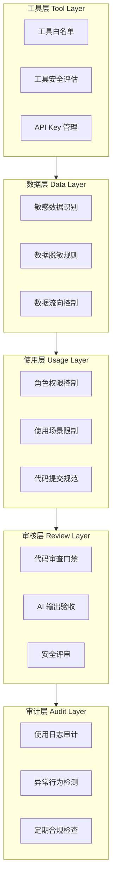
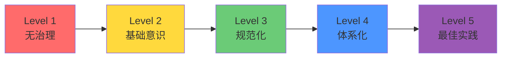

# 第15章 企业 AI 使用治理

> **目标读者**：CTO、技术总监、安全负责人、合规负责人，以及需要制定团队 AI 使用规范的 Tech Lead。
> **本章回答的核心问题**：AI 工具用起来了，怎么管？没有治理框架，一个工程师把生产环境报错贴进 ChatGPT 就可能构成数据泄漏事故。

---

## 15.1 AI 治理框架总览

企业 AI 治理不是一份文档或一个审批流程，而是一个层层递进的体系。每一层都是上一层的防线，任何一层缺失都会在下面形成监管真空。



五层框架的核心逻辑：先管住用哪些工具（工具层），再管住传什么数据（数据层），然后管住谁在什么场景下用（使用层），接着管住产出的东西能不能上线（审核层），最后靠审计层兜底。每层都是前一层失效时的最后防线。

---

## 15.2 六大治理维度

### 15.2.1 工具准入

**核心原则**：不是每个 AI 工具都能进企业环境。接入前必须评估，评估通过才能进白名单。

#### AI 工具白名单模板

| 工具名称 | 用途 | 数据存储位置 | 允许使用范围 | 审批状态 | 有效期 |
|---------|------|-------------|-------------|---------|--------|
| GitHub Copilot | 代码补全 | 云端（美国） | 所有代码仓库（不含敏感项目） | 已批准 | 2026-12-31 |
| Cursor | AI IDE | 云端 + 本地 | 非生产环境开发 | 已批准 | 2026-12-31 |
| Claude Code | AI CLI 助手 | 云端（API） | 开发、文档、非敏感运维 | 已批准 | 2026-12-31 |
| 内部 LLM 代理 | 通用 AI 对话 | 内网私有部署 | 全公司 | 已批准 | 长期 |
| ChatGPT | 通用 AI 对话 | 云端（美国） | 仅非敏感文本生成 | 有条件批准 | 2026-06-30 |

#### 工具评估标准（每个工具逐项打分，总分 ≥ 70 且关键项不挂）

| 评估项 | 权重 | 评分标准 | 关键项 |
|--------|------|---------|--------|
| 数据存储位置 | 30% | 纯本地=100，国内云=70，海外云=30，不明=0 | **是** |
| API 数据回传策略 | 20% | 不回传=100，可选择关闭=70，强制回传=0 | **是** |
| 认证与权限 | 15% | 支持 SSO/SAML=100，仅账号密码=50，无认证=0 | 否 |
| 日志与审计 | 15% | 完整审计日志+API=100，基础日志=60，无日志=0 | 否 |
| 数据加密 | 10% | 传输+存储均加密=100，仅传输加密=60，无=0 | 否 |
| 供应商合规认证 | 10% | SOC2+ISO27001=100，仅一项=70，无=0 | 否 |

> **关键项一票否决**：数据存储位置或 API 数据回传策略评分 < 60，不论总分多高都不予批准。

#### 禁止使用的工具类型

以下类型的 AI 工具**明确禁止**在企业环境使用：

1. **无隐私政策的 AI 工具**：无法确认数据去向、是否被用于训练模型的工具。典型特征：免费、匿名使用、页面没找到隐私政策链接。
2. **要求上传完整代码库的工具**：需要将整个 Git 仓库同步到第三方服务器才能使用的 AI 代码审查工具。
3. **无法关闭数据收集的浏览器插件**：部分 AI 翻译插件、AI 写作助手会收集所有浏览内容，包括内网页面。
4. **个人注册的企业 AI 账号**：使用个人邮箱注册的 ChatGPT Plus / Copilot 等，数据流入个人账户，企业无法审计。

#### 工具引入流程

```
申请人提交《AI 工具使用申请》 → 安全团队评估（≤5 个工作日）→ 审批 → 加入白名单 → 通知全员
```

无白名单记录的工具，安全团队可在网络层面阻断其 API 域名。

---

### 15.2.2 数据安全

这是治理体系中最关键的一环。AI 工具的核心风险不是"产出质量差"，而是"数据出去了回不来"。

#### 敏感数据定义

企业中以下数据视为敏感数据，**未经脱敏绝对禁止**输入任何外部 AI 工具：

| 数据类别 | 具体示例 | 风险等级 |
|---------|---------|---------|
| 个人身份信息（PII） | 姓名+身份证号、手机号、家庭地址、生物特征 | **严重** |
| 认证凭据 | 密码、API Key、Token、SSH 私钥、数据库连接串 | **严重** |
| 金融数据 | 银行卡号、交易流水、账户余额、客户资产信息 | **严重** |
| 商业机密 | 未公开的财务数据、合同条款、报价单、战略规划 | **高** |
| 客户数据 | 客户名称、联系方式、合同内容、业务数据 | **高** |
| 内部系统信息 | 服务器 IP、内网拓扑、端口信息、漏洞详情 | **高** |
| 源代码（部分场景） | 核心算法实现、加密逻辑、风控规则 | **中** |

#### 数据脱敏规则

在将代码、日志、文档输入 AI 工具之前，必须执行脱敏：

**1. 代码脱敏指南**

```java
// ❌ 错误：原始代码包含真实配置直接贴给 AI
public class PaymentConfig {
    private static final String API_KEY = "sk-live-abc123xyz789";  // 真实 Key
    private static final String DB_URL = "jdbc:mysql://10.0.1.50:3306/pay_db";  // 内网 IP
    private static final String DB_PASS = "P@ssw0rd!2024";  // 真实密码
}

// ✅ 正确：脱敏后再问 AI
public class PaymentConfig {
    private static final String API_KEY = "sk-xxx";           // 脱敏
    private static final String DB_URL = "jdbc:mysql://<host>:<port>/<db>";  // 脱敏
    private static final String DB_PASS = "***";              // 脱敏
}
```

**2. 日志脱敏规则**

| 敏感模式 | 正则替换 | 示例 |
|---------|---------|------|
| 手机号 | `(\d{3})\d{4}(\d{4})` → `$1****$2` | `138****1234` |
| 身份证号 | `(\d{6})\d{8}(\d{4})` → `$1********$2` | `310101********1234` |
| 邮箱 | `(.{2}).*(@.*)` → `$1***$2` | `ka***@company.com` |
| API Key | `(sk-[a-zA-Z0-9]{4})[a-zA-Z0-9]+` → `$1****` | `sk-live****` |
| Token | `(eyJ)[a-zA-Z0-9_-]+\.[a-zA-Z0-9_-]+\.[a-zA-Z0-9_-]+` → `[JWT_REMOVED]` | |
| 内网 IP | `10\.\d{1,3}\.\d{1,3}\.\d{1,3}` → `[INTERNAL_IP]` | |
| 密码参数 | `(password|passwd|pwd|secret)\s*[:=]\s*\S+` → `$1=***` | |

**3. 禁止上传到 AI 的数据类型清单**

以下数据类型**绝对禁止**传入任何外部 AI 工具：

- [ ] 包含真实 PII 的生产数据
- [ ] 数据库完整 schema（含字段名、索引信息）
- [ ] 未脱敏的生产日志（包含用户 IP、请求参数、响应体）
- [ ] 任何包含密钥、Token、密码的配置文件
- [ ] 客户合同、报价单、招标文件原文
- [ ] 内部安全审计报告
- [ ] 未公开的产品路线图或商业计划
- [ ] 第三方供应商的保密协议内容
- [ ] 完整的生产环境拓扑信息
- [ ] 风控规则或反欺诈模型参数

#### 数据分级使用策略

| 数据等级 | 可用的 AI 工具 | 要求 |
|---------|--------------|------|
| 公开数据 | 所有白名单工具 | 无特殊要求 |
| 内部数据（非敏感） | 国内云部署工具、内部私有部署 | 不得使用海外服务器工具 |
| 敏感数据（脱敏后） | 仅内部私有部署 LLM | 需审批，脱敏确认后方可使用 |
| 敏感数据（原始） | **仅本地运行模型** | 禁止网络传输，模型和数据在同一台机器 |

---

### 15.2.3 权限控制

#### AI 工具访问权限分级

| 角色 | 可用工具范围 | 每日用量上限 | 数据等级限制 |
|------|------------|-------------|-------------|
| 实习生 / 外包人员 | 仅 IDE 代码补全（Copilot） | 标准 | 仅公开和内部数据 |
| 初级开发 | 代码补全 + AI 对话（内部 LLM） | 标准 | 内部数据及以下 |
| 高级开发 | 全部白名单开发工具 | 标准 | 内部数据及以下 |
| Tech Lead | 全部白名单工具 + API 调用 | 高 | 脱敏敏感数据及以下 |
| 架构师 | 全部白名单工具 | 高 | 脱敏敏感数据及以下 |
| 安全 / 合规 | 仅内部 LLM + 审计系统 | 按需 | 按需（特殊审批） |

#### API Key 管理规范

API Key 是企业 AI 使用中最容易被忽视的安全漏洞。一个开发者在 GitHub 上泄漏了 API Key，账单损失可能上万。

**管理规则：**

1. **统一采购**：所有 AI 服务的 API Key 由 IT 部门统一申请和管理，禁止个人账号公司报销。
2. **Key 不落盘**：API Key 统一存入公司密钥管理服务（如 HashiCorp Vault、AWS Secrets Manager），应用运行时注入。
3. **用量配额**：每个 Key 设置月度费用上限和每分钟调用上限，防止意外超支。
4. **定期轮换**：API Key 每 90 天强制轮换，人员离职当日吊销其名下所有 Key。
5. **泄漏检测**：集成 GitHub Secret Scanning，一旦检测到 Key 泄漏自动吊销并告警。

```bash
# ❌ 错误：API Key 写在代码或环境变量文件中
export OPENAI_API_KEY="sk-proj-abc123..."
# ✅ 正确：运行时从密钥管理服务获取
export OPENAI_API_KEY=$(vault read -field=api_key secret/ai/openai)
```

---

### 15.2.4 日志审计

没有日志的 AI 使用是黑盒。审计日志不仅是合规要求，更是追责和优化的基础。

#### AI 使用日志记录要求

每条 AI 使用记录至少包含以下字段：

| 字段 | 说明 | 示例 |
|------|------|------|
| `timestamp` | 请求时间（ISO 8601） | `2026-07-01T14:32:15+08:00` |
| `user_id` | 用户企业账号 | `kane@company.com` |
| `tool_name` | 使用的 AI 工具 | `GitHub Copilot` / `Claude Code` |
| `tool_version` | 工具版本 | `v1.32.0` |
| `request_type` | 请求类型 | `code_completion` / `chat` / `api_call` |
| `prompt_hash` | 输入内容的 SHA256（脱敏后） | `a1b2c3...` |
| `prompt_length` | 输入长度（字符数） | `1247` |
| `response_length` | 输出长度（字符数） | `856` |
| `data_level` | 涉及的数据等级 | `internal` / `sensitive_desensitized` |
| `project` | 所属项目 | `payment-service` |
| `source_ip` | 请求来源 IP | `10.x.x.x` |
| `session_id` | 会话 ID（关联多轮对话） | `uuid` |

> 注意：日志中**不记录原始 prompt 内容**，仅记录哈希值。原始内容通过哈希在独立的安全审计系统中关联，仅合规审计时可查阅。

#### 审计日志保留策略

| 日志类型 | 热存储（可实时查询） | 冷存储（归档） | 销毁 |
|---------|-------------------|-------------|------|
| 使用统计（聚合） | 12 个月 | 3 年 | 3 年后 |
| 详细日志（含哈希） | 3 个月 | 2 年 | 2 年后 |
| 原始 prompt 内容 | 仅合规系统保存 | 1 年 | 1 年后 |
| 异常告警记录 | 12 个月 | 5 年 | 5 年后 |

#### 异常使用检测

设置以下自动告警规则：

```yaml
alerts:
  - name: "单日用量异常飙升"
    condition: daily_requests > avg_7d_daily * 5
    severity: warning
    action: 通知直属 Leader

  - name: "非工作时间高强度使用"
    condition: requests_between(22:00, 06:00) > 50
    severity: info
    action: 标记审查

  - name: "大量敏感标记请求"
    condition: daily_requests_with_sensitive_flag > 20
    severity: critical
    action: 立即通知安全团队

  - name: "单次 Prompt 超过阈值"
    condition: single_prompt_length > 50000
    severity: warning
    action: 通知用户 + 记录

  - name: "异常 API Key 使用"
    condition: key_usage_from_new_ip AND off_hours
    severity: critical
    action: 自动吊销 Key + 紧急通知
```

---

### 15.2.5 知识产权

AI 生成代码的知识产权问题在各国司法实践中仍属于灰色地带，但企业不能因此什么都不做。

#### AI 生成代码的版权归属

当前阶段务实做法：

1. **默认立场**：AI 生成代码的版权风险由使用方承担。主流 AI 工具（OpenAI、GitHub Copilot、Anthropic）的服务条款均将输出内容的"所有权"转让给用户，但不保证输出不侵犯第三方版权。
2. **企业策略**：AI 生成代码视为"员工借助工具完成的智力成果"，版权归企业。但必须保留生成记录以便未来可能的版权纠纷举证。
3. **高风险领域规避**：以下场景**禁止**使用 AI 生成代码：
   - 核心专利算法实现
   - 加密和签名算法
   - 竞业协议覆盖的竞品功能

#### 开源协议传染风险

AI 模型训练数据中包含大量开源代码，AI 生成的代码片段可能无意中复现了 GPL 等"传染性"协议的代码。

**应对措施：**

| 风险等级 | 场景 | 措施 |
|---------|------|------|
| 低 | 工具类、CRUD 代码 | 不做特殊限制 |
| 中 | 业务逻辑实现 | 代码审查时检查与已知开源项目的相似性 |
| 高 | 核心模块、对外分发的 SDK | 用 `scanoss` / `fossology` 做开源协议扫描 |
| 严重 | 计划开源的内部项目 | **禁止使用 AI 生成代码**，确保版权清洁 |

```bash
# 集成到 CI：对 AI 生成的 commit 做额外扫描
if git log -1 --pretty=%B | grep -q "Co-Authored-By: Claude\|Generated by Copilot"; then
  scanoss scan --path ./src --output license-report.json
  # 检查是否有 GPL / AGPL 匹配，有则阻断合并
fi
```

#### 代码来源溯源

提交 AI 生成代码时，commit message 中应包含来源标记：

```
# ✅ 推荐的 commit message
feat: add user export service

Co-Authored-By: Claude <noreply@anthropic.com>
Reviewed-by: Kane <kane@company.com>
AI-Generated: yes
AI-Tool: Claude Code
AI-Reviewed: yes
```

这样当未来某段代码出现版权纠纷时，可以快速追溯到：
- 谁请求 AI 生成的
- 使用哪个 AI 工具
- 谁审查了这段代码
- 当时是什么样的上下文

---

### 15.2.6 输出责任

AI 是工具，责任在人。这条原则没有任何模糊空间。

#### 责任归属

```
AI 工具 → 提供建议和生成内容
    ↓
使用员工 → 审查、验证、决定是否采纳
    ↓  （出了问题）
使用员工 → 承担主要责任
审批人（如有）→ 承担连带责任
AI 工具 / 供应商 → 不承担直接责任（除非服务 SLA 违约）
```

**无论 AI 生成了什么，最终提交代码、发布配置、上线服务的是人，责任在人。**

#### 人工审批要求

| 场景 | 审批要求 | 审批人 |
|------|---------|--------|
| AI 生成的业务代码 | Code Review（同普通代码） | 同组开发 |
| AI 生成的核心模块代码 | Code Review + 安全 Review | Tech Lead + 安全 |
| AI 生成的数据库 DDL | DBA 审批 | DBA |
| AI 生成的生产配置 | 变更审批 + 灰度发布 | Tech Lead |
| AI 生成的对外文档 | 内容审核 | Tech Lead + 业务方 |
| AI 生成的 SQL（生产执行） | **禁止直接执行**，必须 DBA 审核后执行 | DBA |

> **红线**：AI 生成的任何内容都**禁止未经人工审查直接用于生产环境**。

#### 责任追溯机制

建立三级追溯：

| 层级 | 追溯内容 | 工具 |
|------|---------|------|
| 代码级 | 哪些 commit 包含 AI 生成代码 | Git log + commit convention |
| 变更级 | 哪些 MR/PR 引入了 AI 生成内容 | GitLab/GitHub API + label |
| 事故级 | 生产事故中哪些环节涉及 AI 输出 | 事故复盘模板增加"是否涉及 AI 工具"字段 |

事故复盘模板必须包含：

```markdown
## AI 工具关联分析

- 事故相关代码是否由 AI 生成：是 / 否
- 如是，AI 工具名称：
- AI 生成占比（估算）：
- 人工审查人：
- 审查时是否发现相关问题：是 / 否
- AI 工具的 prompt 哈希（可追溯）：______
```

---

## 15.3 企业 AI 使用规范模板（完整可复制）

以下是一份可直接落地的企业 AI 使用规范模板。企业可根据自身情况调整后发布。

---

# 《[公司名称] AI 工具使用管理规范》

**版本**：v1.0
**生效日期**：YYYY-MM-DD
**制定部门**：技术部 / 信息安全部
**适用范围**：全体员工（含外包、实习生、远程办公人员）

---

### 一、目的与适用范围

**1.1 目的**

为规范公司内部人工智能工具（以下简称"AI 工具"）的使用行为，防范数据泄漏、知识产权侵权、合规违规等风险，保障公司和客户的信息安全，特制定本规范。

**1.2 适用范围**

本规范适用于：
- 公司全体员工（正式员工、实习生、外包人员）
- 使用公司设备或网络访问 AI 工具的所有行为
- 使用个人设备处理公司事务时涉及 AI 工具的行为
- 通过 API、IDE 插件、CLI 工具等任何形式使用 AI 工具的行为

**1.3 基本原则**

1. **数据不出门原则**：涉及敏感数据时，优先使用内部部署的 AI 工具。
2. **人工兜底原则**：AI 输出必须经人工审查后方可用于生产环境。
3. **责任到人原则**：AI 工具的使用者对其输入和输出负全部责任。
4. **最小权限原则**：仅授予工作所需的 AI 工具使用权限。

---

### 二、允许使用的 AI 工具

**2.1 工具白名单**

| 工具名称 | 用途范围 | 数据限制 | 责任人 |
|---------|---------|---------|--------|
| [内部 LLM 平台] | 通用 AI 对话、文档生成 | 内部数据及以下 | IT 部 |
| GitHub Copilot | 代码补全 | 非敏感代码 | IT 部 |
| [经审批的 AI IDE] | 开发辅助 | 非敏感代码 | IT 部 |
| [经审批的 AI CLI] | 开发、文档、运维 | 内部数据及以下 | IT 部 |

白名单由信息安全部维护，每季度审核一次。不在白名单上的 AI 工具，员工不得在公司设备或网络中使用。

**2.2 工具使用申请**

需要使用白名单外的 AI 工具，应提交《AI 工具使用申请》，经直属 Leader 和信息安全部审批后方可使用。

---

### 三、禁止行为

以下行为**严格禁止**，违反者按照本规范第八章处理：

1. **禁止向外部 AI 工具输入敏感数据**：包括但不限于客户个人信息、密码、密钥、Token、未公开的商业数据。
2. **禁止使用未审批的 AI 工具**：包括个人注册的 AI 账号、浏览器插件、第三方 API 代理。
3. **禁止将公司代码完整上传至外部 AI 平台**：禁止 `git push` 整个仓库到第三方 AI 代码分析工具。
4. **禁止 AI 生成内容未经审查直接上线**：包括代码、配置、数据库变更、文档等。
5. **禁止使用 AI 生成绕过安全策略的代码**：包括但不限于 SQL 拼接绕过、权限绕过、加密降级。
6. **禁止在 AI 工具中讨论公司未公开的战略、财务、法务信息**。
7. **禁止共享或转售公司采购的 AI 工具账号**。
8. **禁止将 API Key 写入代码、配置文件或日志**。

---

### 四、数据安全要求

**4.1 数据分类与 AI 工具对应**

| 数据等级 | 定义 | 可用工具 |
|---------|------|---------|
| 公开 | 已公开发布的信息 | 所有白名单工具 |
| 内部 | 公司内部流转但非敏感 | 内部 LLM + 国内云端工具 |
| 敏感 | 涉及 PII、商业机密、客户数据 | 仅内部部署 LLM，需脱敏 |
| 绝密 | 核心商业机密、法务文件 | 仅本地运行模型，需特批 |

**4.2 脱敏要求**

输入 AI 工具前，必须移除以下信息：
- 真实姓名、身份证号、手机号、邮箱、地址
- 密码、Token、API Key、SSH 私钥、证书
- 银行卡号、交易流水
- 服务器 IP 地址、内网域名、端口信息
- 客户名称、合同内容

**4.3 文件上传限制**

上传文件到 AI 工具前，检查文件内容是否含上述敏感信息。以下文件类型**禁止上传**到外部 AI 工具：
- 数据库 dump 文件（.sql, .dump）
- 包含环境变量的配置文件（.env, application.yml, application.properties）
- 生产日志文件（.log）
- 客户数据文件（.csv, .xlsx）
- 私钥或证书文件（.pem, .key, .crt, .p12）
- 完整项目源代码（.zip, .tar.gz）

---

### 五、代码质量要求

AI 生成代码与人工编写代码适用**相同的质量标准**：

1. **必须通过 CI 流水线**：包括编译、单元测试、静态代码检查、安全扫描。
2. **必须有 Code Review**：且至少一名人类 Reviewer 明确批准。
3. **必须标注来源**：commit message 中使用 `AI-Generated: yes` 标记。
4. **禁止 AI 生成的测试覆盖 AI 生成的代码**：AI 生成的代码，测试必须由人工编写或人工补充边界用例。
5. **开源协议扫描**：核心模块的 AI 生成代码需通过开源协议合规扫描。

---

### 六、验收与审批流程

```
AI 生成内容
    ↓
开发者自检
    │  ├─ 是否正确理解了需求
    │  ├─ 是否移除了敏感信息
    │  ├─ 是否标注了 AI 来源
    │  └─ 是否通过了本地测试
    ↓
Code Review（同级审查）
    │  ├─ 逻辑正确性
    │  ├─ 安全性（OWASP Top 10）
    │  └─ 代码可维护性
    ↓
CI 流水线
    │  ├─ 编译通过
    │  ├─ 单元测试通过（覆盖率 ≥ 现有水平）
    │  ├─ 安全扫描通过
    │  └─ 开源协议扫描通过（核心模块）
    ↓
合并 & 上线
```

特殊场景额外审批：

| 场景 | 额外审批 |
|------|---------|
| 数据库变更（DDL/DML） | DBA 审批 |
| 生产配置变更 | Tech Lead 审批 |
| 涉及资金、权限的代码 | 架构师 + Tech Lead 双审批 |
| 对外发布的文档 | 业务方 + Tech Lead 审批 |

---

### 七、违规处理

违反本规范的行为，按情节严重程度处理：

| 等级 | 行为示例 | 处理措施 |
|------|---------|---------|
| 一级（轻微） | 使用白名单外但无安全风险的 AI 工具 | 口头警告 + 限期整改 |
| 二级（一般） | 未脱敏的内部数据上传至内部 LLM | 书面警告 + 强制培训 |
| 三级（严重） | 向外部 AI 工具泄露脱敏不彻底的客户数据 | 书面警告 + 扣除绩效 + 全公司通报 |
| 四级（极其严重） | 故意上传密钥、生产数据到外部 AI | 解除劳动合同 + 保留法律追诉权 |

---

### 八、培训要求

1. **入职培训**：新员工入职一个月内完成 AI 使用规范培训，考试通过后方可开通 AI 工具权限。
2. **年度复训**：全体员工每年完成一次 AI 安全意识复训。
3. **违规再训**：发生二级以上违规后，须在 7 天内完成强化培训。

---

### 九、例外申请流程

如需在特定场景下突破本规范限制，必须提交例外申请：

1. 填写《AI 使用例外申请表》，说明：使用场景、涉及数据、必要性、风险缓解措施。
2. 直属 Leader 审批 → 信息安全部审批 → CTO 终审。
3. 例外批准后有时效性（最长 30 天），到期自动失效。
4. 例外期间的使用记录单独归档，纳入下次审计。

---

### 十、附录

**附录 A：工具白名单（完整版）**

（见 15.2.1 工具准入一节，由信息安全部维护）

**附录 B：禁止上传到 AI 的数据类型清单**

（见 15.2.2 数据安全一节，共 10 项，打印张贴于办公区）

**附录 C：脱敏参考手册**

（见 15.2.2 数据安全一节，含正则表达式和代码示例）

**附录 D：AI 使用日志模板**

（见 15.2.4 日志审计一节）

---

*本规范由信息安全部负责解释和修订。*
*首次发布：YYYY-MM-DD*

---

---

## 15.4 开发团队 AI 使用准则（一页速查）

以下是可直接发给开发团队的 A4 纸速查页，建议打印张贴或设为团队 Wiki 首页。

---

# 开发团队 AI 使用准则

## 可以做的事 ✅

- [ ] 用 AI 写单元测试、生成 Mock 数据
- [ ] 用 AI 解释遗留代码逻辑
- [ ] 用 AI 生成 CRUD 模板代码
- [ ] 用 AI 优化已有的 SQL 查询（脱敏后）
- [ ] 用 AI 生成 API 文档、变更日志
- [ ] 用 AI 辅助排查 Bug（只贴报错信息，不贴完整日志）
- [ ] 用 AI 翻译技术文档
- [ ] 用 AI 写正则表达式、Shell 脚本
- [ ] 用 AI 重构小段代码（200 行以内）

## 绝对不能做的事 ❌

- [ ] 把真实客户数据、密码、Key、Token 贴进 AI
- [ ] 把完整数据库 Schema、内网 IP、服务器配置贴进 AI
- [ ] 把公司未公开的战略规划、合同发给 AI
- [ ] 绕过公司 VPN 或代理，用个人网络访问外部 AI
- [ ] AI 生成的 SQL 不经 DBA 直接跑生产库
- [ ] AI 生成的代码不经 Code Review 直接合 master
- [ ] 用个人账号注册 AI 工具处理公司事务
- [ ] 用 AI 生成绕过安全策略的代码（白盒加密、权限伪造等）

## 提交前检查（AI 生成的代码）

```
□ 移除了敏感信息（密码/Key/Token/IP）
□ 理解了每行代码在做什么（不只是"能跑"）
□ 本地跑通了单元测试
□ commit message 里标注了 AI-Generated
□ 提交了 MR 并指定了 Reviewer
□ 不在「禁止使用 AI 生成」的模块列表中
```

## 哪些模块禁止用 AI 生成

- 加密/解密/签名算法
- 支付/资金结算逻辑
- 认证授权核心模块
- 风控/反欺诈规则
- 竞业限制范围内的功能

## 脱敏四步法（贴代码前必做）

1. **替换**：真实值 → 占位符（`"sk-live-abc123"` → `"sk-xxx"`）
2. **隐藏**：IP/域名 → `[INTERNAL_HOST]`
3. **裁剪**：只贴出问题的片段，不要整段代码全贴
4. **检查**：快速扫一遍，有没有漏网的手机号/邮箱/身份证号

## 使用工具清单

| 工具 | 能传什么 | 不能传什么 |
|------|---------|-----------|
| 内部 LLM | 脱敏后的代码、文档、非敏感数据 | PII、生产配置 |
| Copilot | IDE 打开的非敏感代码 | 敏感项目的任何代码 |
| 外部 AI（ChatGPT 等） | 通用问题、非敏感文本 | 任何公司数据 |

## 有问题找谁

- 不确定能不能贴的数据 → 先问信息安全部
- 不确定能不能用的工具 → 查白名单，不在名单上的先申请
- 发现同事违规 → 提醒 + 报告 Leader

---

*更新日期：2026-07-01 | 信息安全部 x 技术部*

---

---

## 15.5 银行/金融行业特殊要求

银行和金融机构的 AI 使用治理需要在通用框架上叠加行业监管要求。

### 15.5.1 数据不出内网

这是银行 AI 使用的**第一铁律**。

- 所有 AI 工具必须部署在内网（私有云或本地数据中心），**不允许使用任何将数据传输到外网的 AI 服务**。
- 网络层面通过防火墙白名单阻断所有已知外部 AI 服务 API 域名（`api.openai.com`、`api.anthropic.com`、`api.githubcopilot.com` 等）。
- 开发环境中也必须遵守，不能以"开发环境没真实数据"为由豁免。
- 内部部署的模型需要定期进行数据泄漏扫描：检查模型推理日志中是否意外记录了用户输入。

### 15.5.2 AI 辅助的审计轨迹

银行监管要求系统变更必须有完整的审批和追溯链条。AI 引入后，这个链条必须延伸：

```
传统审计链：
需求文档 → 设计文档 → 代码 → 测试报告 → 审批签字 → 上线记录

AI 时代审计链（新增）：
需求文档 → AI 生成标记 → prompt 哈希 → AI 输出记录 → 人工审查记录 →
代码 → AI 来源标注 → 测试报告（常规 + AI 专项）→ 审批签字 → 上线记录
```

**具体要求：**

1. 每个涉及 AI 的 commit 必须关联唯一的 `prompt_id`。
2. AI 生成内容的人工审查记录必须单独存档（审查人、时间、审查结论）。
3. 关键系统（核心交易、账务）的上线审批增加 AI 使用合规检查项。

### 15.5.3 监管合规要求

| 监管要求 | AI 使用影响 | 应对措施 |
|---------|------------|---------|
| 数据本地化（《个人信息保护法》） | PII 不能出境 | AI 模型必须境内部署 |
| 等保 2.0 | 系统变更需安全评估 | AI 生成的代码纳入安全评估范围 |
| 银保监外包风险管理 | 第三方服务需风险评估 | AI 服务商纳入供应商风险管理 |
| GDPR（如有跨境业务） | 数据主体权利保障 | AI 训练数据需可追溯、可删除 |
| 模型风险管理（MRM） | 模型需验证和监控 | 内部 AI 模型纳入模型风险管理体系 |

### 15.5.4 模型可解释性要求

银行业 AI 使用的一个特殊要求：对于影响客户权益的决策，AI 的输出必须可解释。

- **决策类场景**（如 AI 辅助信贷审批）：禁止使用"黑盒"模型直接决策。AI 只能做辅助建议，最终决策必须是人类做出并能解释理由。
- **代码生成类场景**：不要求 AI 解释"为什么生成这段代码"，但要求审查者理解并在 Code Review 中记录关键逻辑判断。
- **内部 LLM 选型**：优先选择提供 attention 可视化、推理链输出的模型，便于后续审计时追溯。

---

## 15.6 外包团队 AI 使用边界

外包团队和正式员工在 AI 使用上的风险和管控力度完全不同。外包人员的流动率高、企业控制力弱，必须建立更严格的边界。

### 15.6.1 外包人员 AI 使用限制

| 限制项 | 具体要求 |
|--------|---------|
| 工具范围 | 仅允许使用公司指定的内部 AI 工具；**禁止**使用任何外部 AI 服务（ChatGPT、GitHub Copilot 个人版等） |
| 代码可见范围 | AI 辅助仅限其负责的模块代码，**禁止**将非其负责模块的代码输入 AI |
| 数据库访问 | **禁止**将任何包含数据库 Schema 或数据的内容输入 AI |
| 网络限制 | 外包人员使用的开发环境默认阻断外部 AI 服务 API |
| 账号管理 | 禁止使用个人 AI 账号；必须使用公司分配的内部 LLM 账号 |

### 15.6.2 代码归属声明

外包合同中必须增加 AI 使用条款：

> **AI 工具使用声明条款（建议合同语言）**
>
> 乙方（外包方）开发人员在使用人工智能辅助工具（包括但不限于代码生成、代码补全、文档生成）时，应遵守以下约定：
>
> 1. 仅使用甲方指定的 AI 工具，不得使用其他任何外部 AI 服务处理本项目相关数据。
> 2. 所有 AI 辅助生成的代码、文档、配置等产出物，其知识产权完整归属于甲方。
> 3. 乙方应在代码提交时标注 AI 辅助标记（`AI-Generated: yes` 及使用的 AI 工具名称）。
> 4. 乙方对 AI 生成内容的正确性、安全性承担与手写代码同等的责任。
> 5. 乙方违反上述约定造成数据泄漏或知识产权纠纷的，由乙方承担全部赔偿责任。

### 15.6.3 知识转移要求

外包项目的常见痛点：AI 生成的代码外包人员自己也讲不清楚，项目交接时知识断层。

**强制要求：**

1. **禁止"AI 生成但未理解"的代码入库**：外包人员在 Code Review 中需要口头解释 AI 生成代码的逻辑。讲不清楚的不予通过。
2. **关键模块 AI 使用说明**：交付文档中必须包含 AI 使用说明章节，列出哪些模块使用了 AI 辅助、使用方式、prompt 简要描述。
3. **知识转移 checklist 增加 AI 专项**：
   - [ ] 确认外包人员能解释所有 AI 生成代码的逻辑
   - [ ] 确认没有将敏感数据输入过外部 AI
   - [ ] 确认所有 AI 来源标记完整

---

## 15.7 传统 IT 部门 AI 引入注意事项

很多企业 IT 部门并不抗拒 AI，但被"安全审批怎么过"、"现有流程怎么兼容"、"会不会出事故"这三个问题卡住。本节给出可操作的渐进式引入策略。

### 15.7.1 现有流程兼容性

不要试图用 AI 推翻现有 IT 治理流程，而是在现有流程上打一个"AI 补丁"。

| 现有流程 | AI 补丁 |
|---------|--------|
| 代码审查 | 增加"是否 AI 生成"检查项，AI 生成代码至少两人 Review |
| 变更管理 | AI 辅助的变更标注来源，关键变更禁止 AI 生成 |
| 安全审查 | 增加"AI 输出安全扫描"环节 |
| 事故复盘 | 增加"是否涉及 AI"的分析维度 |
| 供应商管理 | AI 工具供应商纳入供应商风险评估清单 |

### 15.7.2 安全审批流程

传统 IT 安全审批是为"引入一个系统"设计的，AI 工具不太一样，审批需要适配。

**简化版 AI 工具审批 checklist：**

```
□ 数据存储位置？境内 / 境外 / 本地
□ 是否回传用户数据用于模型训练？是 / 否 / 可配置
□ 认证方式？SSO / 账号密码
□ 是否有审计日志 API？
□ 供应商是否通过 SOC2 / ISO27001？
□ 是否支持数据删除请求？
□ 使用场景评估：生成代码 / 分析数据 / 处理文档 / 其他
□ 涉及的最高数据等级：公开 / 内部 / 敏感
```

非生产环境、低风险工具（如内部部署 LLM）适用简化审批（3 个工作日）。高风险工具（外部服务、涉及生产数据）适用标准审批（10 个工作日）。

### 15.7.3 渐进式引入策略

传统 IT 部门做 AI 引入不追求一步到位，推荐四阶段法：

```
第一阶段：试点（1-2 月）
├── 选 1 个非核心团队
├── 用 1-2 个内部 AI 工具（代码补全 + 内部 LLM 对话）
├── 限制：仅限非敏感代码和文档
├── 产出：使用数据、问题清单、团队反馈
│
第二阶段：扩面（2-3 月）
├── 扩大到 3-5 个团队
├── 工具范围不变
├── 建立基础日志收集
├── 产出：团队使用指南 v1、常见问题 FAQ
│
第三阶段：规范（1-2 月）
├── 制定正式治理规范（参考本章模板）
├── 部署审计日志系统
├── 全公司培训 + 考试
├── 产出：AI 使用管理规范、白名单、培训材料
│
第四阶段：常态化
├── 全公司推广
├── 定期审计 + 季度规范更新
├── 工具白名单动态维护
├── 产出：季度合规报告、工具使用数据仪表板
```

**每个阶段的前置条件：**

- 第一阶段：完成安全评估（AI 工具的数据流向确认）
- 第二阶段：第一阶段无安全事故
- 第三阶段：积累了足够的使用数据和问题案例
- 第四阶段：规范发布、全员培训完成、日志系统上线

---

## 15.8 AI 治理成熟度模型

评估企业 AI 治理的当前水平，规划提升路径。

### 五级成熟度模型



### Level 1：无治理（Ad Hoc）

**特征：**
- 员工自由使用任何 AI 工具，无统一管理
- 没有 AI 使用相关制度或规范
- 发生过因 AI 使用导致的数据泄漏或未察觉
- 管理者不清楚团队是否在用 AI、用哪些

**→ 升级到 Level 2 的第一步：**
1. 摸底调查：发匿名问卷了解团队实际 AI 使用情况
2. 禁用已知高风险工具（通过防火墙阻断）
3. 发布一份临时通知（禁止向外部 AI 输入敏感数据）

---

### Level 2：基础意识（Aware）

**特征：**
- 管理层意识到 AI 使用的风险
- 发布了基础的 AI 使用通知或提醒
- 有一个简单的禁止事项清单
- 但没有系统化的管理制度

**→ 升级到 Level 3 的第一步：**
1. 建立 AI 工具白名单
2. 制定数据分级标准
3. 部署基础日志收集（至少记录谁用了什么工具）
4. 全员完成一次 AI 安全意识培训

---

### Level 3：规范化（Standardized）

**特征：**
- 有正式的 AI 使用管理规范文件
- AI 工具白名单定期维护
- 员工完成培训并通过考核
- 有基本的日志审计（可追溯到人和工具）
- 数据脱敏有明确的规则和检查方式

**→ 升级到 Level 4 的第一步：**
1. 部署自动化审计系统（异常检测、用量告警）
2. 将 AI 使用纳入事故复盘流程
3. 建立季度审计和合规报告机制
4. 内外包团队 AI 使用有差异化管理

---

### Level 4：体系化（Managed）

**特征：**
- 完整的五层治理体系（工具→数据→使用→审核→审计）运转良好
- 异常使用自动告警，安全事件 24 小时内响应
- 审计日志自动化分析，季度合规报告自动生成
- AI 使用纳入绩效考核（合规性指标）
- 新 AI 工具引入有标准化的评估和审批流
- 外包、远程团队的 AI 使用有明确的管控措施

**→ 升级到 Level 5 的第一步：**
1. 建立 AI 治理的持续改进机制（月度回顾、季度优化）
2. 引入 AI 使用效益分析（ROI 仪表板，不只是管控还要赋能）
3. 参与行业 AI 治理标准制定
4. 开放 AI 治理实践给行业交流

---

### Level 5：最佳实践（Optimizing）

**特征：**
- AI 治理从"被动防控"转向"主动赋能"
- 有专门的 AI 治理团队或岗位（AI Governance Officer）
- 治理体系具备自优化能力（基于数据驱动持续调优规则）
- 行业标杆，对外输出治理经验
- AI 使用效率和安全性形成正向循环

---

### 自评工具

各级别可按以下 checklist 自评。一项打勾得 1 分，计算各级别完成率：

**Level 2 自评：**
- [ ] 管理层已公开强调整 AI 使用风险
- [ ] 已发布 AI 使用基础通知
- [ ] 已明确列出禁止行为
- [ ] 已阻断已知高风险外部 AI 工具

**Level 3 自评：**
- [ ] 已发布正式 AI 使用管理规范
- [ ] 已建立工具白名单（≥ 1 次/季度更新）
- [ ] 全员培训完成率 ≥ 90%
- [ ] 有基本日志记录（用户、工具、时间）
- [ ] 数据脱敏有明确指导

**Level 4 自评：**
- [ ] 自动化审计系统已上线
- [ ] 安全事件平均响应时间 ≤ 24h
- [ ] 季度合规报告自动生成
- [ ] 新工具引入标准化流程已建立
- [ ] 外包团队 AI 使用有独立管控

**Level 5 自评：**
- [ ] 有专门的 AI 治理角色或团队
- [ ] 治理规则基于数据驱动持续优化
- [ ] 对外输出过 AI 治理经验（文章/演讲/标准制定）
- [ ] AI 使用效益可量化分析
- [ ] 治理体系成为业务竞争力的组成部分

**评估结果计算：**
- Level 2 完成率 < 60% → 当前为 Level 1
- Level 2 完成率 ≥ 80%，Level 3 < 60% → 当前为 Level 2
- Level 3 完成率 ≥ 80%，Level 4 < 60% → 当前为 Level 3
- Level 4 完成率 ≥ 80%，Level 5 < 60% → 当前为 Level 4
- Level 5 完成率 ≥ 80% → 当前为 Level 5

---

## 15.9 本章要点回顾

1. **五层治理框架**：工具层 → 数据层 → 使用层 → 审核层 → 审计层，层层递进、互为防线。
2. **数据安全是核心**：不是 AI 能力不够，是数据出去了回不来。先定义敏感数据，再定脱敏规则，最后定使用边界。
3. **责任在人不在 AI**：无论 AI 生成了什么，最终提交、上线的是人，承担责任的也是人。
4. **可以从简开始**：不需要一步到位建成 Level 4 治理体系。先摸底、发通知、建白名单，三个月内做到 Level 3 就是巨大进步。
5. **行业特殊性不可忽略**：银行金融业必须数据不出内网，外包团队必须有更严格的边界，传统 IT 部门需要渐进式引入。
6. **治理不只是限制**：好的 AI 治理让团队"放心用"而不是"不敢用"。成熟度越高，AI 使用效率和安全性的平衡越好。

---

> **下一章预告**：第16章将讨论 AI 时代的团队能力重塑——从个人技能升级到团队结构变化，以及 Tech Lead 在这个转型期的角色转换。
