# 第16章 团队 AI 推广方案（从 0 到 1）

> **目标读者**：Tech Lead、架构师、工程经理，需要在团队中系统性推广 AI 工具。
> **本章回答的核心问题**：AI 工具很好，但怎么让整个团队用起来？从一两个先行者到全员日常使用，这条路怎么走？

---

## 16.1 为什么需要阶段性推广

直接把 AI 工具扔给全团队，说"大家用起来"，结果一定是失败。不是工具不好，是推广方式错了。

团队接受一项新技术，遵循经典的技术采纳曲线：创新者（2.5%）→ 早期采纳者（13.5%）→ 早期大众（34%）→ 晚期大众（34%）→ 落后者（16%）。推广方案要做的，是顺着这条曲线一步一步推动，而不是期望所有人同时跳上车。

本章给出一套经过验证的 7 阶段推广路线图，覆盖从"第一个试用者"到"AI 成为团队基础设施"的完整过程。每条行动项都是可执行的，每个阶段都有明确的成功标志。

---

## 16.2 七阶段推广路线图总览

```mermaid
flowchart LR
    subgraph 阶段1_点燃期[阶段一：个人试用<br/>第1-2周]
        S1_1[选2-3个积极者]
        S1_2[每人试一个任务]
        S1_3[记录体验和效果]
    end

    subgraph 阶段2_验证期[阶段二：小组试点<br/>第3-4周]
        S2_1[成立试点小组<br/>3-5人]
        S2_2[建立CLAUDE.md]
        S2_3[试点SDD流程]
    end

    subgraph 阶段3_沉淀期[阶段三：沉淀模板<br/>第5-6周]
        S3_1[整理Prompt模板]
        S3_2[编写SOP文档]
        S3_3[建立验收清单]
    end

    subgraph 阶段4_标准化[阶段四：建立SOP<br/>第7-8周]
        S4_1[各环节AI使用SOP]
        S4_2[AI输出验收标准]
        S4_3[AI使用日志]
    end

    subgraph 阶段5_嵌入期[阶段五：接入研发流程<br/>第9-10周]
        S5_1[Code Review接入AI]
        S5_2[CI/CD接入AI检查]
        S5_3[测试/需求引入AI]
    end

    subgraph 阶段6_治理期[阶段六：建立治理规范<br/>第11-12周]
        S6_1[AI使用规范]
        S6_2[数据安全规则]
        S6_3[审计与违规处理]
    end

    subgraph 阶段7_平台化[阶段七：平台化推广<br/>第13周起]
        S7_1[AI助手平台]
        S7_2[共享知识库]
        S7_3[AI使用社区]
    end

    阶段1_点燃期 --> 阶段2_验证期 --> 阶段3_沉淀期 --> 阶段4_标准化
    阶段4_标准化 --> 阶段5_嵌入期 --> 阶段6_治理期 --> 阶段7_平台化

    style 阶段1_点燃期 fill:#e8f5e9,stroke:#4caf50
    style 阶段2_验证期 fill:#e3f2fd,stroke:#2196f3
    style 阶段3_沉淀期 fill:#fff3e0,stroke:#ff9800
    style 阶段4_标准化 fill:#f3e5f5,stroke:#9c27b0
    style 阶段5_嵌入期 fill:#fce4ec,stroke:#e91e63
    style 阶段6_治理期 fill:#e0f7fa,stroke:#00bcd4
    style 阶段7_平台化 fill:#fff9c4,stroke:#fdd835
```



**核心理念**：不追求一步到位，每个阶段只做该阶段的事。前一个阶段的成功是后一个阶段的前提，跳过阶段必然翻车。

---

## 16.3 各阶段详细说明

### 16.3.1 阶段一：个人试用（第 1-2 周）

**目标**：让 2-3 个积极者先试起来，形成第一手经验和数据。

**参与角色**：志愿者开发者（2-3 人）

**为什么要从个人而不是全团队开始？**
全团队推广最怕"开局即翻车"。一个人试失败了，影响一个人；全团队试失败了，所有人对 AI 的印象就定了，后面再推阻力极大。先让愿意试的人跑通，用他们的真实案例说服其他人，比任何 PPT 都有用。

**具体行动**：

1. **选人（最关键的一步）**
   - 找主动问过"AI 能不能帮我们写代码"的人，不要找被安排来参加的人
   - 优先选日常工作涉及高频重复任务的人（写单测、CRUD、文档）
   - 避开对新技术有明显抵触情绪的人——他们适合在阶段四之后被带动，而不是阶段一当先锋
   - 至少选 2 人，避免单人无法形成讨论；最多 3 人，多了管理不过来

2. **选任务（第二关键）**
   - 每人选一个简单任务试用 Claude Code 或 Codex CLI
   - 任务必须满足三个条件：输入明确（代码是确定的）、输出可验证（能跑测试）、出错影响小（不涉及资金/安全）
   - 推荐起点任务：生成单元测试、写 Swagger 文档、生成 DTO 类、格式转换脚本
   - 第一次不要给太复杂的任务，30 分钟能完成是最理想的时长。太简单没感觉，太难会放弃

3. **记录使用体验**
   - 记录任务完成时间（不用 AI vs 用 AI 的对比）
   - 记录 AI 生成的代码质量（可运行率、需要修改的比例）
   - 记录主观感受：哪个环节最有用？哪个环节最让人不放心？
   - 做一份试用报告（模板见下方交付物）

**交付物：试用报告**

试用者每人填写以下报告（控制在 1-2 页）：

```
【AI 试用报告】

试用者：
试用工具：Claude Code / Codex CLI / 其他
试用任务：
任务简述：
AI 使用方式（prompt 要点）：

对比数据：
- 不用 AI 预计耗时：
- 实际耗时（含 prompt 编写和验收）：
- AI 生成代码可运行率：
- 需要人工修改的比例：
- 修改类型（逻辑错误 / 风格不统一 / 缺少边界处理 / 其他）：

效果评价：
- 最有效的环节：
- 最不放心的环节：
- 是否会继续使用：是 / 否 / 看情况
- 推荐同事使用的理由：

意外发现（好或坏的 surprise）：
```

**评估指标**：

| 指标 | 测量方式 | 目标值（第一阶段） |
|------|----------|-------------------|
| 任务完成时间 | 对比不用 AI 和自己手写的时间 | 节省 30% 以上 |
| 代码可用率 | AI 产出经人工修改后可提交的比例 | 60% 以上 |
| 试用者满意度 | 试用者是否愿意继续用 | 至少 2/3 的人说"会继续用" |

不要追求 100% 的指标——第一阶段是证明"有用"而非"完美"。

**风险与应对**：

| 风险 | 原因 | 应对 |
|------|------|------|
| 选错了人（选了抵触者） | 被安排来试用的人没有内在动力，敷衍了事 | 只选主动报名的人。领导可以号召，不能指定 |
| 选错了任务（太难/太敏感） | 第一次就用 AI 改核心业务代码，翻车后对 AI 失去信心 | 严格遵守选任务三条件。第一个任务宁简勿难 |
| 试用效果不明显 | 任务本身太简单，AI 优势体现不出来 | 选一个有点重复性但不至于太琐碎的任务。写一个类的 CRUD 代码正合适，写 println 太简单 |
| 没有记录数据 | 试用者觉得"感觉还行"但没有具体数字，难以说服下一批人 | 报告模板必须填。没有数字就没有弹药 |

**程序员应该做什么**：
- 主动尝试，不要等完美时机
- 记录每个使用细节，好的坏的都记
- 在团队群里分享一次成功案例和一次翻车案例，真实比宣传有用

**管理层关注点**：
- 要不要批准？需要批准的事项：AI 工具的 API 密钥费用、是否允许接入内部代码库
- 安全吗？第一阶段只用公开 API 做不涉及敏感数据的任务，不需要特殊安全审批

---

### 16.3.2 阶段二：小组试点（第 3-4 周）

**目标**：在一个开发小组内形成 AI 使用习惯，验证 AI 在真实团队协作中的效果。

**参与角色**：1 个开发小组（3-5 人）+ Tech Lead

**前提条件**：阶段一的试用报告为正面评价，且有至少 2 人愿意继续用。

**具体行动**：

1. **成立试点小组**
   - 选一个完整的功能小组（不是跨组拼凑），保证日常工作有真实的协作关系
   - Tech Lead 必须参与且带头使用——TL 不用，组员不会用
   - 在试点开始前，召开一次 30 分钟的启动会，明确试点目标和时间

2. **选一个适合 AI 的项目**
   - 参考第 2 章"十维评分模型"选择场景，建议优先选：单元测试补充、接口文档生成、DTO/Entity 生成、数据迁移脚本
   - 项目周期 2 周以内，不能太短（感受不到协作效应）也不能太长（试点结束没结果）
   - 明确该项目中 AI 做什么、人做什么（例如：AI 生成单测骨架 + 边界用例，人写核心业务逻辑测试）

3. **建立小组 CLAUDE.md**
   - 这是最关键的一步，也是大多数团队会漏掉的一步
   - CLAUDE.md 是 AI 理解你们项目的说明书，没有它，AI 的产出质量会大打折扣
   - 内容至少包含：技术栈版本、目录结构约定、命名规范、代码风格要求、禁止事项
   - 由 Tech Lead 编写第一版，试点小组成员在使用中持续补充
   - CLAUDE.md 每两周回顾一次，更新过时内容

4. **制定 AI 使用约定**
   - AI 生成的代码在提交前必须经过人工 Review
   - 哪些类型的文件不允许 AI 生成（如：安全相关配置、数据库 migration 脚本）
   - AI 生成的代码需要标注 `@ai-generated` 注释（方便后续统计和审计）
   - prompt 中不能包含生产环境的配置信息、密钥、客户数据

5. **试点 Spec-Driven Development**
   - 这是试点期间的"进阶练习"
   - 选一个中等复杂度的新功能，按 SDD 流程走一遍：写 spec → AI 生成代码 → 人验收 → 补充测试
   - 目的不是证明 SDD 一定比 Vibe Coding 好，而是让团队体会"有规格约束时 AI 的产出质量提升多少"

**交付物**：

| 交付物 | 负责人 | 内容要点 |
|--------|--------|----------|
| 小组 AI 使用约定 | Tech Lead | AI 使用边界、标注规范、禁止事项 |
| 项目 CLAUDE.md | Tech Lead + 全员 | 技术栈信息、目录结构、编码规范 |
| 试点项目代码 | 试点小组 | 含 `@ai-generated` 标注的实际项目代码 |
| 效果对比数据 | Tech Lead | 开发效率提升、Bug 率变化、团队满意度 |

**评估指标**：

| 指标 | 测量方式 | 基线对比 |
|------|----------|----------|
| 开发效率提升 | 试点项目人天数 vs 同类历史项目 | 目标提升 20-30% |
| Bug 率变化 | 试点项目上线后 2 周的 Bug 数 vs 历史同类项目 | 不应明显上升 |
| AI 生成代码占比 | `@ai-generated` 标注的代码行数 / 总代码行数 | 建议 20-40% 为健康区间 |
| 团队满意度 | 匿名问卷调查（1-5 分） | 目标 3.5 分以上 |

**风险与应对**：

| 风险 | 原因 | 应对 |
|------|------|------|
| 小组内有人抵触 | 被拉进试点而非主动加入 | 不强制。抵触者不参加试点，等阶段四之后用成果说话 |
| 缺乏 CLAUDE.md 导致 AI 输出质量差 | 没有给 AI 足够的项目上下文，AI 只能靠猜测 | TL 必须先写好 CLAUDE.md 再开始试点，不要本末倒置 |
| 试点项目太复杂 | 一次性验证太多东西 | 控制项目范围。试点验证的是"流程可行性"而非"AI 能力上限" |
| AI 生成的代码未经 Review 直接提交 | 团队觉得"AI 写的应该没问题" | 使用约定中必须写清楚 Review 要求，TL 在 Code Review 环节检查 |

**程序员应该做什么**：
- 积极参与试点，这是学习和建立 AI 使用习惯的最佳窗口
- 试用过程中发现问题立刻反馈，不要忍到试点结束
- 主动帮忙完善 CLAUDE.md——你用的时候发现 AI 哪里理解错了，就把正确信息补进去

---

### 16.3.3 阶段三：沉淀模板（第 5-6 周）

**目标**：把阶段一和阶段二积累的经验，变成可复用的团队资产。

**参与角色**：Tech Lead + 试点小组成员

**为什么需要专门一个阶段做沉淀？**
很多团队推广时直接跳到"全团队推广"，跳过了沉淀这一步。结果就是：试点团队用得很好，但其他人不会用，因为没有被沉淀下来的知识和模板。试点团队的经验停留在他们的脑子里，没有变成团队资产。

这两个周就是要做这件事：把隐性经验显性化。

**具体行动**：

1. **整理有效 Prompt 模板**
   - 汇总阶段一和阶段二中实际使用过、效果好的 prompt
   - 按场景分类：单测生成、文档生成、代码重构、Bug 分析、SQL 优化
   - 每个模板包含：适用场景描述、完整 prompt 文本、预期输出格式、使用注意事项
   - Prompt 模板不是"复制粘贴直接用"，而是"理解意图后按自己的场景调整"

2. **编写 AI 工作流 SOP**
   - 针对团队最高频的 3-5 个场景，写标准操作流程
   - 例如"用 AI 生成单元测试的标准流程"：
     ```
     1. 将被测类代码和已有测试作为上下文给 AI
     2. 告诉 AI 需要覆盖的测试场景（正常/异常/边界）
     3. AI 生成测试代码
     4. 运行 mvn test 验证编译通过
     5. 检查 JaCoCo 覆盖率报告
     6. 人工检查断言是否合理
     7. 补充 AI 遗漏的测试场景
     8. 提交代码（标注 @ai-generated）
     ```
   - SOP 不追求完整，追求"新手跟着做就能跑通"

3. **建立验收清单**
   - 针对 AI 生成的每一类产出，建立检查要点
   - 示例——AI 生成代码的验收清单：
     - [ ] 编译通过
     - [ ] 没有明显的逻辑错误（死循环、空指针、数组越界）
     - [ ] 异常处理完整（不是只 catch 不处理）
     - [ ] 没有硬编码的密钥或敏感信息
     - [ ] 命名风格与项目一致
     - [ ] 事务边界正确（涉及数据库操作时）
     - [ ] 参数校验完整（涉及对外接口时）
   - 验收清单的作用是防止"看起来能用所以通过了"——给 Review 一个结构化的检查框架

4. **编写培训材料**
   - 基于前面产出的模板 + SOP + 验收清单，编写一份 30 分钟的培训 PPT
   - 包含：为什么用 AI、怎么用（现场演示）、注意什么（踩过的坑）、哪里找模板和 SOP
   - 培训材料以演示为主，PPT 只是辅助——现场跑一遍比讲 10 张 slide 有用

**交付物**：

| 交付物 | 格式 | 内容规模 |
|--------|------|----------|
| Prompt 模板库 | Markdown 文件集合 | 5-10 个核心模板 |
| SOP 文档 | Markdown，按场景分文件 | 3-5 个核心场景 |
| 验收清单 | Markdown 表格 | 按产出类型，每类 5-10 条 |
| 培训 PPT | PPT 或 Markdown slides | 30 分钟内容量 |

**评估指标**：

| 指标 | 测量方式 |
|------|----------|
| 模板复用率 | 团队群中模板被引用/使用的次数 |
| 新人上手时间 | 新人从拿到培训材料到独立使用 AI 完成一个任务的时间 |

**风险与应对**：

| 风险 | 原因 | 应对 |
|------|------|------|
| 模板质量差没人用 | 为了凑数写了很多"理论正确但实际没用"的模板 | 只收实际用过且效果好的。数量不重要，"用得上"才重要 |
| 维护跟不上 | 沉淀完没人更新，很快过期 | 指定 Tech Lead 每月回顾一次，过期的标记为 `[已弃用]` 而非删除 |
| 文档太多看不完 | 把沉淀变成了写文档比赛 | 每个文档控制在 2 页以内。太长的 SOP 没人看 |

---

### 16.3.4 阶段四：建立 SOP（第 7-8 周）

**目标**：在前三阶段基础上，将 AI 使用流程标准化，形成覆盖全研发环节的 SOP 体系。

**参与角色**：Tech Lead + 架构师

**阶段三和阶段四的区别**：阶段三是"收集试点中的经验"，阶段四是"把经验变成团队的正式流程文档"。阶段三的产出是"供参考的模板"，阶段四的产出是"需要遵守的标准"。

**具体行动**：

1. **编写各环节 AI 使用 SOP**
   - 需求环节：AI 辅助需求澄清的 SOP（见第 1 章全景图）
   - 设计环节：AI 辅助技术方案设计的 SOP
   - 编码环节：AI 辅助编码的 SOP（核心环节，分 Vibe Coding 和 Spec-Driven 两条路径）
   - 测试环节：AI 辅助测试生成和 Bug 分析的 SOP
   - Code Review 环节：AI 辅助 Review 的 SOP
   - 每个 SOP 文档包含：适用条件、操作步骤、验收标准、常见问题、升级路径（遇到 SOP 没覆盖的情况怎么办）

2. **定义 AI 输出验收标准**
   - 此标准写入 SOP，是"AI 产出物能否被接受"的判断依据
   - 验收标准分三层：
     - L1 基础层（必过）：编译通过、无安全硬编码、无明显逻辑错误
     - L2 规范层（应过）：命名规范、事务正确、异常处理完整、日志合理
     - L3 业务层（视情况）：业务逻辑正确性、性能考量、扩展性
   - AI 生成的代码至少必须通过 L1，重要模块必须通过 L2

3. **建立 AI 使用日志**
   - 设计一个简单的日志模板，由使用者记录每次 AI 使用的情况
   - 日志记录项：日期、使用者、使用场景、使用的 prompt 模板（如有）、AI 输出质量评价（1-5）、是否采纳、备注
   - 日志的目的不是监控，而是积累数据——三个月后你可以用数据回答"AI 到底帮我们省了多少时间"
   - 日志形式可以很简单：共享 Excel 表格、飞书多维表格、钉钉智能表格都可以

**交付物**：

| 交付物 | 负责人 | 说明 |
|--------|--------|------|
| 完整 SOP 文档集 | Tech Lead | 覆盖需求/设计/编码/测试/Review 五个环节 |
| AI 输出验收标准 | 架构师 | L1/L2/L3 三层验收标准文档 |
| AI 使用日志模板 | Tech Lead | 共享表格模板，含统计公式 |

**评估指标**：

| 指标 | 测量方式 | 目标 |
|------|----------|------|
| SOP 执行率 | 抽查：随机抽 10 次 AI 使用，SOP 中被执行的步骤占比 | >70% |
| AI 输出质量 | 使用日志中 AI 输出质量评分的均值 | >3.5 分（5 分制） |

**风险与应对**：

| 风险 | 原因 | 应对 |
|------|------|------|
| SOP 太复杂没人遵守 | 追求"完整"而写了 10 页 SOP | 每个 SOP 控制在 1-2 页，只写必要步骤。如果超过 2 页，拆成两个 SOP |
| SOP 脱离实际 | TL 关起门写 SOP，没有和实际使用的人对齐 | SOP 草稿先让试点小组成员试用一周，反馈调整后再发布 |
| 日志变成形式主义 | 团队成员觉得"又多了一个要填的表" | 日志项不超过 7 个字段，填一次不超过 1 分钟。如果大家不填，TL 应该在周会上花 2 分钟让大家补一下，而不是发邮件催 |

---

### 16.3.5 阶段五：接入研发流程（第 9-10 周）

**目标**：把 AI 从"个人工具"变成"团队流程的一部分"，嵌入日常研发流水线。

**参与角色**：全体开发 + QA + PM

**前提条件**：前四个阶段已完成，SOP 体系建立且团队有基本的 AI 使用习惯。

**这一步是质变**：之前 AI 是个人选择（用不用自己决定），这一步之后 AI 是流程的一部分（流程默认包含 AI 环节）。

**具体行动**：

1. **Code Review 环节加入 AI Review**
   - 在人工 Review 之前，增加一轮 AI Review
   - AI Review 检查项：代码风格一致性、潜在的 NPE/资源泄漏、SQL 注入风险、明显的逻辑问题
   - AI Review 的结果作为人工 Review 的参考，不是替代
   - 操作方式：MR 创建时自动触发 AI Review（通过 CI pipeline 中的脚本），AI 的 Review 意见以 comment 形式贴在 MR 上
   - AI Review 不能 approve MR，最终审批权在人手里

2. **CI/CD 加入 AI 代码检查**
   - 在 CI pipeline 中增加 AI 代码检查步骤（或复用 AI Review 的结果作为门禁）
   - 检查项：是否有 `@ai-generated` 标记但缺少人工 Review 记录的代码、是否有 AI 常见错误模式
   - 对于标记为 `@ai-generated` 的代码，CI 可以设置更严格的门禁（如覆盖率要求更高）
   - 注意：CI 中的 AI 检查是"辅助提醒"，不能作为阻断条件（除非团队明确决定某些检查项必须通过）

3. **需求评审引入 AI 辅助**
   - PM 写需求文档时，用 AI 做需求澄清（追问遗漏点、识别矛盾、补全边界条件）
   - 需求评审会前，AI 先出一份"潜在问题清单"，评审会上讨论
   - 注意：AI 生成的追问清单是给 PM 和评审者看的，不是给 AI 做决策的

4. **测试用例生成引入 AI**
   - QA 用 AI 生成测试用例草稿，覆盖正常流程和异常流程
   - AI 分析接口文档（Swagger/OpenAPI）生成接口测试数据组合
   - QA 审核并补充业务特有的测试场景
   - AI 生成的数据驱动测试（DDT），QA 只需维护数据文件

**交付物**：

| 交付物 | 负责人 | 说明 |
|--------|--------|------|
| 更新后的研发流程文档 | Tech Lead | 标注 AI 介入环节和标准 |
| CI/CD 配置文件 | DevOps/架构师 | 包含 AI Review 和 AI 代码检查步骤 |
| AI Review 脚本 | 架构师 | 集成到 CI pipeline 的检查脚本 |
| MR/PR 模板更新 | Tech Lead | 模板中增加"AI Review 结果"栏 |

**评估指标**：

| 指标 | 测量方式 |
|------|----------|
| AI Review 覆盖率 | 有 AI Review 的 MR 数 / 总 MR 数 |
| CI 中 AI 检查通过率 | AI 检查通过的 MR 数 / 总 MR 数 |
| 流程效率变化 | 从 MR 创建到合并的平均时间（对比接入前） |

**风险与应对**：

| 风险 | 原因 | 应对 |
|------|------|------|
| 流程变更阻力 | 团队成员觉得"多了步骤，变慢了" | 用数据说话。展示 AI Review 提前发现了多少问题、减少了多少轮人工 Review 往返 |
| 工具集成困难 | CI/CD 接入 AI API 的脚本写不好或不稳定 | 先用最简单的实现（一个 curl 调 API 的 shell 脚本），跑通后再优化 |
| AI Review 噪音太大 | AI 提了很多"正确但无关紧要"的意见，反而干扰人工 Review | 给 AI Review 设阈值，只报告 confidence 高的 issue。或者 AI Review 的结果折叠在 MR 的一个"可选查看"区域 |

---

### 16.3.6 阶段六：建立治理规范（第 11-12 周）

**目标**：在 AI 广泛使用后，建立安全和合规体系，确保"提效"不以"失控"为代价。

**参与角色**：Tech Lead + 安全负责人 + 合规负责人

**为什么不是第一阶段就建规范？**
规范要在"知道会出什么事"之后建立才有意义。如果在阶段一就写一套复杂规范，里面一半的条款是在假设问题，另一半是不切实际的限制。先用起来，把真实问题暴露出来，再建规范。

**具体行动**：

1. **制定 AI 使用规范**
   - 明确 AI 工具在团队中的使用边界
   - 规范内容至少包含：
     - 允许使用的 AI 工具列表（Claude Code、Codex、Gemini 等）
     - 禁止提交到 AI 的数据类型：生产环境密钥、客户 PII、内部未公开的业务数据、第三方保密协议涵盖的内容
     - AI 生成代码的标注要求（`@ai-generated` + 使用的 prompt 模板）
     - AI 生成内容的归属和责任：谁用了 AI，谁对最终产出负责。不允许"这是 AI 写的所以有问题不怪我"
     - prompt 管理规范：包含业务逻辑的 prompt 需要保存在项目仓库中，不能只存在个人聊天记录里

2. **建立数据安全规则**
   - 生产数据脱敏规则：任何需要给 AI 看的代码或数据，必须先脱敏
   - 脱敏内容至少包括：数据库连接串、API 密钥、Token、客户姓名/手机号/身份证号/银行卡号
   - 建议做法：在项目中维护 `.env.example` 作为 AI 可读的配置模板，实际值从不在 AI 对话中出现
   - IDE 插件（如 Claude Code）的工作目录权限管理：限制 AI 工具可以访问的文件范围

3. **建立审计日志**
   - 记录 AI 工具的使用情况：谁、什么时候、对什么代码、用了什么 AI 工具
   - 日志目的：事故回溯（如果出了问题，能追溯到 AI 的使用记录）、合规证据（应对内部安全审计）
   - 不需要自建系统——AI 工具本身通常有使用日志，定期导出即可
   - 关键事件必须记录：AI 生成了涉及资金计算、权限检查、数据导出的代码

4. **建立违规处理机制**
   - 定义什么是违规：把生产密钥发给 AI、未经 Review 直接提交 AI 代码到核心模块、用 AI 处理客户敏感数据未脱敏
   - 违规分级：轻度（未造成实际影响）→ 提醒纠正；中度（可能造成影响）→ 警告 + 补充培训；重度（已造成事故）→ 按公司事故处理流程
   - 处理原则：目标是预防和改进，不是惩罚。第一次违规通常是"不知道"而非"故意"
   - 规范每季度回顾一次，根据实际发生的问题调整

**交付物**：

| 交付物 | 负责人 | 说明 |
|--------|--------|------|
| AI 使用规范文档 | Tech Lead + 安全负责人 | 正式发布，全员知悉 |
| 数据安全指南 | 安全负责人 | 包含脱敏规则和操作示例 |
| 审计方案 | 安全负责人 | 审计日志记录方案、导出频率、存储周期 |
| 违规处理机制 | Tech Lead | 分级标准和处理流程 |

**评估指标**：

| 指标 | 测量方式 |
|------|----------|
| 合规检查通过率 | 定期抽查 AI 标注规范执行情况的通过率 |
| 安全事故数 | 因 AI 使用引发的安全事件数量（目标为 0） |
| 规范知悉率 | 团队成员确认已阅读规范的比例（目标 100%） |

**风险与应对**：

| 风险 | 原因 | 应对 |
|------|------|------|
| 规范太严限制效率 | 为了"安全"把所有可能的风险都堵住，结果开发者没法正常用 AI | 安全规则要精确打击：只禁具体的行为（如"不能把生产密钥发给 AI"），不禁模糊的类别（如"不能用 AI"） |
| 规范太松有安全隐患 | 起草时"觉得不会出事"，写的规则太宽泛 | 请安全团队参与审核。最低限度必须覆盖：敏感数据不泄露、生成代码必 Review |

---

### 16.3.7 阶段七：平台化推广（第 13 周起）

**目标**：让 AI 成为团队基础设施，人人可用，新人第一天就能用。

**参与角色**：平台团队 + 全体开发

**从工具到平台**：前六个阶段，AI 在每个人各自的环境里运行。阶段七把 AI 能力集中化，降低每个人的使用门槛和维护成本。

**具体行动**：

1. **搭建内部 AI 助手平台**
   - 核心能力：RAG（检索增强生成）+ MCP（模型上下文协议）
   - RAG 部分：索引团队的知识库（CLAUDE.md、SOP 文档、Prompt 模板、技术文档），让 AI 能基于团队真实上下文回答
   - MCP 部分：对接内部工具和 API（GitLab、Jira、Confluence、监控系统），AI 可以直接查询 issue、读取文档、查看监控
   - 平台形态取决于团队规模和投入：小团队可以是一套共享的 CLAUDE.md + 知识库 Markdown 文件，大团队可以是自建的 RAG 服务
   - 第一阶段（MVP）只需要做到"AI 能读取团队知识库回答问题"，不需要一步到位

2. **建立共享上下文资产库**
   - 把 CLAUDE.md 从"每个项目的本地文件"升级为"团队级的共享上下文"
   - 结构：
     ```
     context/
     ├── global/           # 公司级技术规范（所有项目通用）
     │   ├── java-style.md
     │   ├── api-standard.md
     │   └── security-rules.md
     ├── platform/         # 平台级上下文（中间件、基础库）
     │   ├── db-conventions.md
     │   └── mq-usage.md
     └── projects/         # 项目级上下文
         ├── order-system/
         │   └── CLAUDE.md
         └── user-center/
             └── CLAUDE.md
     ```
   - AI 工作时自动加载 global + platform + 当前 project 的上下文
   - 资产库有 Owner，定期更新，过期内容标记或清理

3. **建立 AI 使用社区**
   - 团队内部建一个 AI 使用讨论群（微信群/钉钉群/Slack channel）
   - 分享内容：好用的 prompt、解决的有趣问题、翻车经验教训、新发现的功能
   - Tech Lead 每周至少在群里分享一个案例，带动讨论氛围
   - 每月整理一次群里的有效分享，更新到 Prompt 模板库或 SOP 文档

4. **纳入新人培训**
   - 新人入职第一周内，必须完成 AI 工具使用培训（30 分钟）
   - 培训内容：可用工具介绍、SOP 快速浏览、验收清单、安全红线、遇到问题找谁
   - 新人第一个任务中必须有"用 AI 辅助完成"的环节——越早用越容易养成习惯
   - 新人培训材料由阶段三和阶段四的产出直接整理而来，不需要从零写

**交付物**：

| 交付物 | 负责人 | 说明 |
|--------|--------|------|
| AI 助手平台（MVP） | 平台团队 | RAG + MCP 的最小可用版本 |
| 共享知识库 | 平台团队 | 按 global/platform/projects 三级组织的上下文资产库 |
| 培训课程 | Tech Lead | 新人 AI 使用培训课程（含演示和练习） |

**评估指标**：

| 指标 | 测量方式 | 目标 |
|------|----------|------|
| 平台使用率 | 每周至少使用一次平台的人数 / 团队总人数 | >80% |
| 用户满意度 | 匿名调查 | >4 分（5 分制） |
| 知识库覆盖率 | 有 CLAUDE.md 的项目数 / 总活跃项目数 | >90% |

---

## 16.4 七阶段汇总表

| 阶段 | 周期 | 目标 | 关键人 | 交付物 | 成功标志 |
|------|------|------|--------|--------|----------|
| 阶段一：个人试用 | 第 1-2 周 | 2-3 个积极者跑通，拿到一手效果数据 | 志愿者开发者 | 试用报告（每人一份） | 至少 2 人愿意继续用，且有具体效率提升数据 |
| 阶段二：小组试点 | 第 3-4 周 | 一个小组形成 AI 使用习惯，验证团队协作效果 | 试点小组（3-5 人）+ TL | 小组 AI 使用约定、CLAUDE.md、效果对比数据 | 试点项目效率提升 20%+，Bug 率无明显上升 |
| 阶段三：沉淀模板 | 第 5-6 周 | 将经验转化为可复用团队资产 | TL + 试点小组 | Prompt 模板库、SOP 文档、验收清单、培训材料 | 模板被非试点成员主动使用，新人能靠材料独立上手 |
| 阶段四：建立 SOP | 第 7-8 周 | 标准化全研发环节 AI 使用流程 | TL + 架构师 | 完整 SOP 文档集、三层验收标准、使用日志模板 | SOP 执行率 >70%，AI 输出质量评分 >3.5 |
| 阶段五：接入研发流程 | 第 9-10 周 | AI 嵌入 Code Review / CI/CD / 需求评审 / 测试 | 全体开发 + QA + PM | 更新后的流程文档、CI/CD 配置、AI Review 脚本 | AI Review 覆盖率 >60%，MR 平均合入时间减少 |
| 阶段六：建立治理规范 | 第 11-12 周 | 建立安全与合规体系 | TL + 安全负责人 + 合规 | AI 使用规范、数据安全指南、审计方案、违规处理机制 | 安全事故数 = 0，全员规范知悉率 100% |
| 阶段七：平台化推广 | 第 13 周起 | AI 成为团队基础设施 | 平台团队 + 全体 | AI 助手平台（MVP）、共享知识库、培训课程 | 平台使用率 >80%，知识库覆盖率 >90% |

---

## 16.5 常见阻力与应对

推广过程中一定会遇到以下阻力。每个阻力的本质不是"对方反对 AI"，而是"对方的真实顾虑没有被回应"。逐条拆解。

### 阻力一："AI 生成的代码质量不行"

**背后真正的意思**：看到过 AI 写出的烂代码（或者在网上看到过 AI 翻车的案例），担心引入 AI 会拉低代码质量。

**应对策略**：

1. **不要争论"AI 代码质量到底行不行"**——这个争论没有意义。AI 生成的代码质量取决于三件事：prompt 质量、上下文充分性、验收流程严格度。这三件事是你的团队可以控制的。

2. **用数据回应，用流程保证**：
   - 展示阶段一和阶段二的真实数据：AI 生成代码的可用率是多少？需要修改的比例是多少？
   - 强调"AI 生成的代码 + 人工 Review + 验收清单"这个组合拳。单独看 AI 生成的代码可能不行，但加上 Review 和验收流程，最终质量不会低于手写代码
   - 反问："你 Review 手写的代码和 Review AI 生成的代码，花的精力差多少？"——通常 AI 生成的代码在 Review 时问题更集中（风格、边界处理），反而更容易 Review

3. **让对方先试一个低风险场景**——写注释、写文档、写单测骨架。这些场景质量不好也影响可控，但一旦体验到了 AI 的提效，态度通常会松动。

### 阻力二："我们项目太复杂，AI 用不上"

**背后真正的意思**：给 AI 看过业务代码，AI 理解不了业务逻辑，产出的代码不能用。

**应对策略**：

1. **AI 用不上整个项目，不等于用不上项目中的某些环节**。拆开看：
   - 业务逻辑复杂的部分：AI 确实用不上（或只能做辅助理解）——这个承认
   - 基础设施代码（Entity/DTO/Mapper/配置）：AI 非常适合，和业务复杂度无关
   - 文档和测试：AI 可以生成骨架，人工补充业务细节
   - 技术调研：AI 可以快速给出方案对比，人做最终判断

2. **复杂度不是障碍，没有给 AI 足够上下文才是**。如果你们项目有 CLAUDE.md 记录了核心业务规则和领域模型，AI 对复杂业务的理解能力会大幅提升。复杂项目的团队更需要 CLAUDE.md。

3. **建议对方列出项目中最机械最重复的 3 个任务，从那里开始**——哪怕只在这些任务上用 AI，也是有价值的。

### 阻力三："安全部门不批准"

**背后真正的意思**：不是不批准，是不知道批什么。安全部门需要看到具体的风险控制措施才能审批。

**应对策略**：

1. **不要空手去问"能不能用 AI"**。准备好一份一页纸的说明，包含：
   - 我们具体要用什么工具（Claude Code / Codex）
   - 这些工具的数据处理方式（API 调用，数据传到 OpenAI/Anthropic 的服务器）
   - 我们的数据安全措施：哪些数据不会给 AI（列出禁止清单）、脱敏规则、审计日志方案
   - 试点范围和风险控制：先在小范围试验，不涉及生产环境，不涉及客户数据
   - 如果出了问题怎么发现和止损

2. **先做再报 vs 先报再做**：如果公司的安全审批流程很长，可以考虑先用完全公开的数据（开源项目的代码、内部文档、技术调研）跑通试点流程。安全审批时已经有数据支撑，通过率更高。

3. **了解公司现有的安全政策**：大型企业通常已经有"第三方 AI 服务使用指南"或类似的规范。找到它，对照着准备申请材料，通过速度会快很多。

### 阻力四："大家不愿意学"

**背后真正的意思**：团队成员觉得"学 AI 工具是额外负担"，或者"不相信 AI 能帮到自己"。

**应对策略**：

1. **"不愿意学"分两层**：
   - 第一层：觉得学了没用。用阶段一的试用报告和演示视频说服——看同事用 AI 比自己看文档有说服力 10 倍
   - 第二层：觉得学起来麻烦。降低门槛——30 分钟的培训，只教最高频的 2-3 个用法，不追求全面

2. **不强制，先带动**。强制使用会产生对抗。正确做法：让积极者持续在群里分享成功案例，制造"群体氛围"。当 30% 的人日常使用 AI 且效率明显更高时，剩下的人自然会跟上来——不是因为被说服了，而是因为"不用就落后了"的压力。

3. **把 AI 使用算成绩效加分项，不是必选项**。初期用激励而非考核。例如："本月用 AI 完成了某个任务且效果很好的，周会上分享，加团队贡献分"。

4. **对年龄较大的资深开发者，不要推销"新技术"**，而是强调"AI 能帮你省掉那些无聊的重复劳动，让你专注做更有趣的设计和架构工作"。资深开发者不是不愿意学新东西，是不愿意学"看起来花里胡哨实际上没用的东西"。

### 阻力五："管理层觉得是浪费钱"

**背后真正的意思**：没有看到投入产出比。管理层愿意花 20 美金一个月的 API 费用，但不想花 3 个月的人力去"推广一个工具"。

**应对策略**：

1. **用管理层的语言说话：ROI**。
   - 算一笔账：5 人团队，每人每天用 AI 节省 30 分钟，一个月节省 5 × 30 × 22 = 3300 分钟 = 55 小时。按人天成本折算，一个月省的钱远远超过 API 费用。
   - 不要用模糊的说法（"提升效率"），用具体的数字和场景（"之前写一个模块的单测要 4 小时，用 AI 生成 + 验收现在 1 小时"）。

2. **先要最小的投入**：第一个月只要 API 费用（几百元）和 2 个志愿者的试用时间。跑出数据后再要下一阶段的投入。不要一上来就申请"3 个月推广期、专用服务器、专职 AI 平台团队"。

3. **对标行业**：举同行的例子——"XX 银行已经在用 AI 辅助代码生成""YY 互联网公司的 AI Review 覆盖率超过 80%"。管理层更容易被行业案例说服。

4. **降低风险感知**：明确告诉管理层："AI 生成的代码必须经过人工 Review 才能提交，AI 只是写初稿，人做最终决策。"——这句话把"AI 替代人"的认知扭转为"AI 辅助人"。

---

## 16.6 向领导汇报的模板

以下是一个月度汇报模板，用于向管理层汇报 AI 推广进展。核心原则：**说数据不说感觉，说成果不说计划**。

---

### AI 推广月度简报

**汇报周期**：YYYY 年 MM 月
**汇报人**：[Tech Lead 姓名]
**推广阶段**：[当前处于阶段 X，启动第 Y 周]

---

**一、本月核心数据**

| 指标 | 本月数值 | 上月数值 | 变化 | 目标 |
|------|----------|----------|------|------|
| AI 使用人数 | [X 人] | [Y 人] | [+Z] | [目标] |
| AI 生成代码行数 | [X 行] | [Y 行] | [+/-] | — |
| AI 生成代码可用率 | [X%] | [Y%] | [+/-] | >60% |
| 估计节省人天 | [X 人天] | [Y 人天] | [+/-] | — |
| 安全事故 | [0] | [0] | — | 0 |

**二、本月关键进展**

1. [进展一：如"完成小组试点，试点项目效率提升 25%"]
2. [进展二：如"完成 Prompt 模板库 8 个核心模板的整理"]
3. [进展三：如"CI/CD 中接入 AI Review，覆盖 60% 的 MR"]

**三、典型案例**

*案例一：*
- 场景：[如"订单模块单测补充"]
- 做法：[简述：AI 生成 + 人工验收]
- 效果：[具体数字：之前 4 小时，现在 1.5 小时，节省 62.5%]

*案例二：*
- 场景：[如"API 文档自动补全"]
- 做法：[简述]
- 效果：[具体数字]

**四、遇到的问题与解决方案**

| 问题 | 影响 | 已采取措施 | 需要支持 |
|------|------|------------|----------|
| [如：部分成员抵触] | [进度延迟一周] | [通过成功案例分享带动] | 无需额外支持 |
| [如：安全审批流程] | [暂未接入核心业务代码] | [已提交审批材料] | 请领导帮忙推动审批 |

**五、下月计划**

1. [计划一]
2. [计划二]
3. [计划三]

**六、需要的支持**

1. [具体诉求一：如"请审批 AI 工具使用规范文档"]
2. [具体诉求二：如"请协调安全部门完成数据安全评估"]
3. [具体诉求三：如"请批准下月 API 费用预算 X 元"]

---

### 汇报注意事项

1. **每月固定时间汇报**（如每月第一个周一），形成制度。不要等到被问了才报，主动汇报建立信任。
2. **效率数据必须有对比基线**。"提升 25%"比"提升明显"有力得多。没有数据宁可不报这个指标，也不要用模糊描述。
3. **问题和求助要诚实**。管理层不期望推广过程一帆风顺。遇到问题第一时间说明 + 你的解决思路，比掩盖问题然后出了事故再解释好得多。
4. **把"需要的支持"写具体**。不要写"需要领导支持"，而是写"请领导在下周三的部门周会上用 2 分钟介绍一下 AI 推广进展"。具体的请求更容易被满足。

---

## 16.7 关键提醒

**不要跳阶段**。

见过太多团队直接从阶段一跳阶段五——试点刚出结果，还没沉淀模板和 SOP，就急着全流程推广。结果就是：每个人按自己的理解用 AI，质量参差不齐，翻车之后管理层叫停，AI 推广变成"上次那个失败的项目"。

每个阶段的存在都有原因：
- 阶段一和二：证明有用
- 阶段三和四：把经验变成标准
- 阶段五：把标准嵌入流程
- 阶段六：确保安全
- 阶段七：规模化

跳过任一阶段，后面必然补课——而且代价更大。

**推广 AI 不是技术项目，是变革管理项目**。技术选什么工具、怎么接入 CI/CD，这些问题最多占 30% 的精力。剩下 70% 花在：说服人、建立信任、消除顾虑、展示价值、培养习惯。技术本身不是瓶颈，人的接受度才是。

最后记住一条铁律：**你的目标不是让团队用上 AI，而是让团队不想回到没有 AI 的状态**。当团队成员在 AI 工具不可用的那天感到明显不便时，推广才算真正成功。
