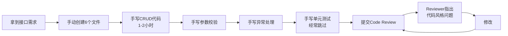
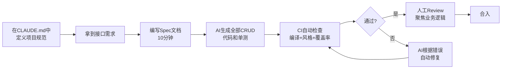
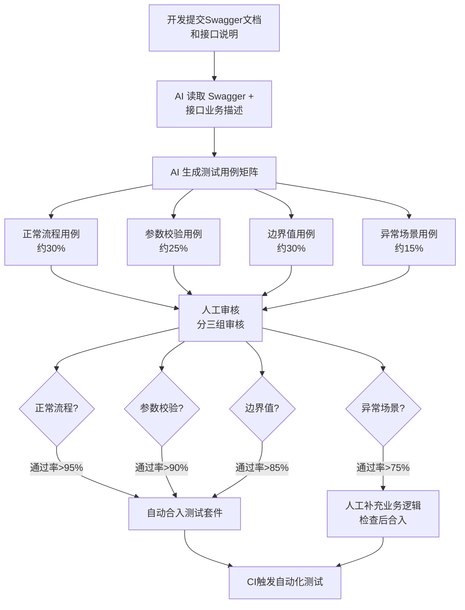
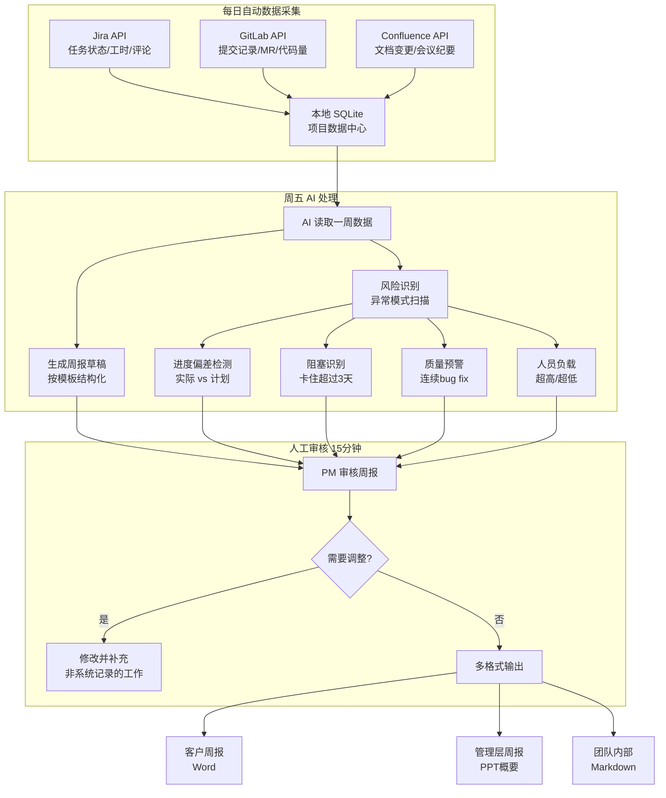
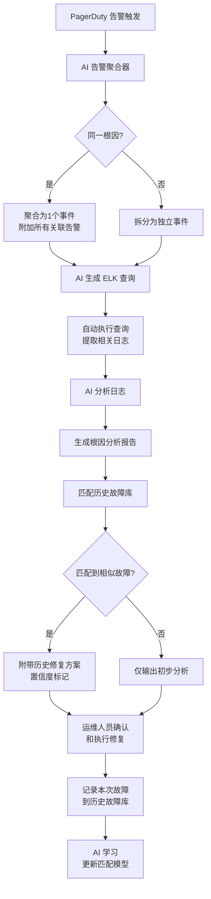
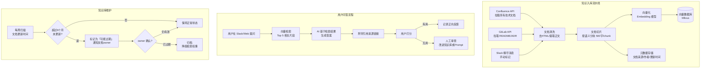
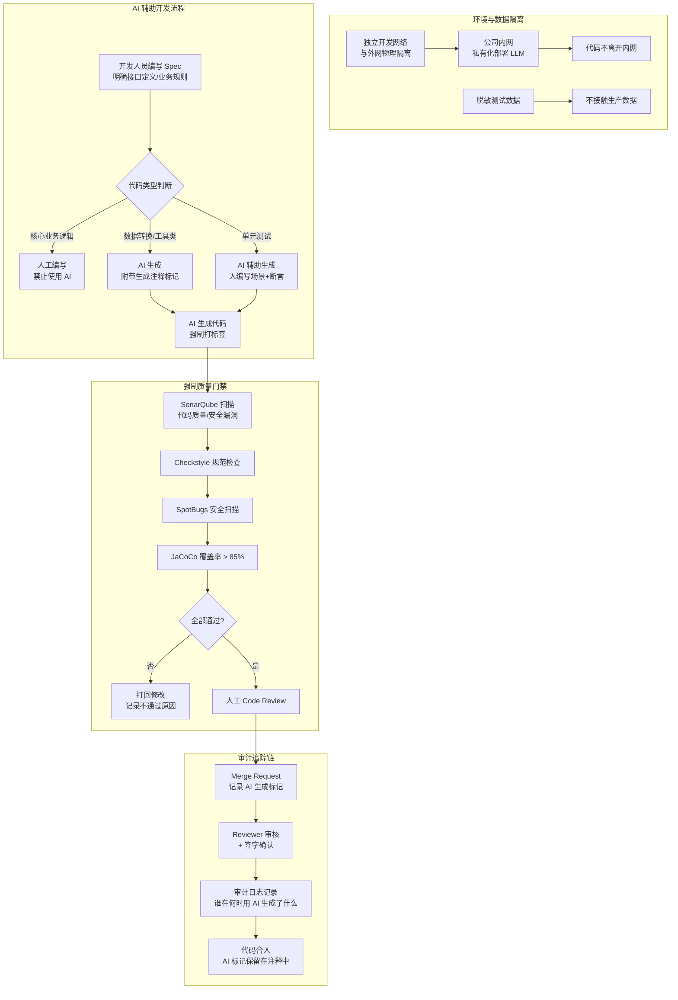

# 第17章 企业 AI 落地案例集

> **目标读者**：正在考虑或已经开始在企业 IT 团队中引入 AI 的 Tech Lead、架构师、项目经理。
> **本章回答的核心问题**：别人是怎么落地的？实际效果如何？踩了什么坑？我能直接抄什么？

---

## 17.1 阅读说明

以下六个案例全部来自真实企业场景（脱敏处理），覆盖了企业 IT 中最常见的角色和场景：后端开发、测试、项目管理、运维、知识管理、外包合规。每个案例按统一结构展开，方便横向对比和定位参考。

**如何使用本章**：

1. 先找到与你角色和场景最接近的案例，精读
2. 跳到 17.8 节对比总结表，快速浏览所有案例的效率和质量数据
3. 重点读每个案例的「可复制经验」小节——那是你能直接带走的东西

---

## 17.2 案例一：Java 后端团队用 AI 提升接口开发效率

### 背景

- **公司**：某中型 SaaS 公司，为企业客户提供人力资源管理平台
- **团队**：5 人 Java 后端团队（1 个 TL + 4 个开发）
- **技术栈**：Spring Boot 2.7 + MyBatis-Plus + MySQL + Redis + Jenkins CI
- **工作模式**：两周一个 sprint，每 sprint 交付 8-15 个接口
- **团队痛点**：大量的增删改查接口占用了开发时间的 60% 以上，但 TL 发现这些 CRUD 代码结构高度重复——Controller 接收请求、Service 处理业务、DAO 操作数据库、DTO 做数据转换，四层代码每层大同小异

### 痛点

1. **重复劳动严重**：每个新接口都要写 Controller、Service、ServiceImpl、DAO、DTO、VO 六个文件，虽然内容不同但结构完全一致，纯体力活
2. **质量不一致**：开发 A 的代码有完整的参数校验和异常处理，开发 B 的可能直接返回 `null`，每次 Code Review 都要花大量时间纠正代码风格问题
3. **测试覆盖不足**：因为业务代码都写不完，单元测试基本被放弃，上线后出问题只能靠线上验证
4. **新人上手慢**：新同事要熟悉项目的分层结构、命名规范、异常处理方式、分页查询的标准写法，前两周基本写不出合格的接口

### AI 介入点

TL 决定在 **代码生成** 和 **单元测试生成** 两个环节引入 AI。具体策略是：

- CRUD 模板代码（Controller / DAO / DTO / VO）由 AI 主导生成
- Service 层业务逻辑由人编写，AI 辅助生成单元测试
- 所有 AI 生成的代码必须通过 CI 质量门禁（Checkstyle + JaCoCo + 编译检查）

### 工作流

改造前的工作流：



改造后的工作流：



### 提示词样例

团队在项目根目录的 `CLAUDE.md` 中预先定义了完整规范，这样每次生成代码时 AI 自动遵守：

```markdown
# CLAUDE.md（项目级 AI 规范片段）

## 代码生成规范
- Controller 类命名：{Entity}Controller，路径前缀 /api/v1/
- 所有接口统一返回 Result<T> 包装类，包含 code/message/data 三个字段
- 分页查询参数使用 PageQuery 基类，返回 PageResult<T>
- 参数校验使用 JSR-303 注解，禁止在 Controller 方法体内手动 if-null 校验
- Service 层异常统一抛出 BusinessException，由全局异常处理器转换为标准错误响应
- MyBatis-Plus 查询使用 LambdaQueryWrapper，禁止字符串拼接字段名
- 每个 public 方法必须有 JavaDoc 注释
- 禁止在循环中查询数据库（N+1 问题）

## 测试规范
- 单元测试框架 JUnit 5 + Mockito
- Service 层测试必须覆盖：正常流程、参数为 null、业务异常、边界值
- 测试方法命名：should_{预期行为}_when_{条件}
```

具体生成 prompt（以「员工离职申请接口」为例）：

```
## 任务
为「员工离职申请」功能生成完整的后端代码。

## 输入
- 数据库表：resignation_apply（id, employee_id, resign_type, resign_reason, expected_date, status, created_at, updated_at）
- 状态枚举：DRAFT(草稿), SUBMITTED(已提交), APPROVED(已通过), REJECTED(已驳回), CANCELLED(已取消）
- 业务规则：
  1. 草稿状态可以编辑和提交
  2. 已提交状态只能审批（通过/驳回），不能编辑
  3. 已驳回可以修改后重新提交
  4. 草稿和已驳回状态可以取消
  5. 离职日期不能早于当前日期
  6. 同一员工不能有多个进行中的离职申请（状态为 DRAFT/SUBMITTED）
  7. 审批通过后，员工状态自动变为「待离职」

## 要求
- 遵守 CLAUDE.md 中的所有规范
- 生成 6 个文件：Controller、Service 接口、ServiceImpl、DAO、DTO、VO
- Controller 包含 CRUD + 提交 + 审批 + 取消 共 7 个接口
- ServiceImpl 使用 @Transactional 管理事务
- 同时生成完整的单元测试

## 输出格式
逐个文件输出，每个文件前用 ### 文件名 标注
```

### 输出物

AI 一次性产出了以下内容：

| 产出文件 | 行数 | 说明 |
|----------|------|------|
| `ResignationController.java` | 120 行 | 7 个 REST 接口，统一返回 Result |
| `ResignationService.java` | 45 行 | 接口定义 + JavaDoc |
| `ResignationServiceImpl.java` | 210 行 | 核心业务逻辑，含状态机校验 |
| `ResignationDAO.java` | 18 行 | MyBatis-Plus BaseMapper 继承 |
| `ResignationDTO.java` | 42 行 | 请求体 + JSR-303 校验注解 |
| `ResignationVO.java` | 35 行 | 响应体，含状态中文映射 |
| `ResignationServiceTest.java` | 280 行 | 18 个测试用例 |

7 个文件，合计约 750 行代码，AI 生成耗时约 15 秒。

### 验收标准

团队建立了一套分级的验收标准，AI 生成的代码必须逐级通过：

| 验收级别 | 检查项 | 方式 | 不通过处理 |
|----------|--------|------|------------|
| L0 编译 | 代码能编译通过，无语法错误 | CI 自动编译 | 不通过不进入人工 Review |
| L1 规范 | Checkstyle 检查通过，符合项目代码风格 | CI SonarQube 扫描 | AI 自动修复后重跑 |
| L2 安全 | 无 SQL 注入、无敏感信息硬编码 | CI SpotBugs 扫描 | 阻断合并，人工修复 |
| L3 覆盖率 | 单元测试分支覆盖率 > 85% | JaCoCo 报告 | AI 补充测试用例 |
| L4 业务 | 业务逻辑正确，状态流转符合规则 | 人工 Review | 人工修复，记录 Review 意见 |
| L5 集成 | 集成测试通过，上下游接口联调正常 | CI 集成测试 | 开发人员和 AI 协作修复 |

### 效果评估

团队记录了引入 AI 前后 4 个 sprint（共 8 周）的数据对比：

| 指标 | 引入 AI 前（Sprint 1-4） | 引入 AI 后（Sprint 5-8） | 变化 |
|------|-------------------------|-------------------------|------|
| 每个 CRUD 接口平均开发时间 | 2.5 小时 | 0.8 小时（含 Review） | **减少 68%** |
| 每个 sprint 交付接口数 | 10 个 | 17 个 | **增加 70%** |
| 上线后 Bug 数（平均每 sprint） | 4.2 个 | 1.8 个 | **减少 57%** |
| 单元测试分支覆盖率 | 42% | 87% | **提升 107%** |
| Code Review 平均耗时 | 45 分钟/MR | 20 分钟/MR | **减少 56%** |
| 新人产出第一个接口的天数 | 8 天 | 3 天 | **减少 63%** |

关键发现：**Bug 数的降低不是因为 AI 写得比人好，而是因为 AI 生成的代码有自动化的质量门禁和更完整的测试覆盖。** 以前人写的代码经常因为赶时间跳过单测，代码 Review 也容易遗漏边界条件。

### 风险控制

1. **CLAUDE.md 先行**：在开始 AI 辅助开发之前，团队花了两个下午讨论并编写 CLAUDE.md，统一了代码风格、异常处理、测试规范。这个投入是前提——没有规范，AI 产出的代码会五花八门
2. **分层信任，而非全信全疑**：Controller/DAO/DTO 层几乎可以信任 AI（纯模板代码），Service 层需要逐行 Review（包含业务逻辑）。不会因为 Controller 层没出过问题就不 Review Service 层，也不会因为 Service 层需要 Review 就全盘否定 AI 的价值
3. **CI 门禁不可跳过**：AI 生成的代码必须和他人的代码一样通过 CI 检查。团队有一次因为 sprint 赶进度想要跳过 L3（覆盖率检查），TL 坚持不允许——上次跳过的结果是在上线后发现了一个空指针 Bug
4. **AI 操作日志**：每次 AI 生成代码时记录 prompt、输出文件列表、Review 意见。一方面可追溯，另一方面为后续优化 prompt 提供了数据基础

### 可复制经验

1. **规范第一，工具第二**：CLAUDE.md 是 AI 产出的质量天花板。花 4 小时写好规范，比花 40 小时修复 AI 生成的不规范代码划算得多
2. **从最不需要判断力的代码开始**：Controller/DAO/DTO 层的模板代码是 AI 的舒适区，这也是开发最痛苦的体力活——刚好完美匹配
3. **Spec 先行**：给 AI 生成代码之前，先写一份简单的 Spec（不是长文档，就是在需求描述里写清楚接口路径、入参、出参、业务规则），产出质量天差地别。模糊的输入 = 需要大量修改的输出
4. **验收分级是信任的基础**：L0-L5 的分级验收体系让团队可以精准控制信任边界，不用担心 AI 生成了一堆有问题代码就全盘放弃，也不会盲目信任
5. **数据驱动迭代**：记录 AI 生成代码的 Review 修改量，定期回顾——哪些类型的修改重复出现，就说明哪里的 prompt 或规范需要改进

---

## 17.3 案例二：测试团队用 AI 生成测试用例

### 背景

- **公司**：某电商平台，月活 200 万，核心交易链路对稳定性要求极高
- **团队**：3 人 QA 团队（1 个 QA Lead + 2 个测试工程师），支持 15 人的开发团队
- **测试体系**：手工测试为主，少量 Selenium UI 自动化（覆盖核心下单流程），单元测试由开发人员自行编写
- **团队痛点**：3 个人要测试 15 个开发产出的代码，业务高峰期（大促季）完全忙不过来。手工测试覆盖不到边界场景和异常场景，上线后经常有边缘 Bug 漏出

### 痛点

1. **测试覆盖率长期在 60% 左右**：新功能测试用主要覆盖正常流程，边界值和异常场景经常被跳过，因为「没时间把每个字段的 null / 空字符串 / 超长 / 特殊字符都试一遍」
2. **回归测试耗时巨大**：每次大促前做全量回归需要 3 天，纯手工点击，枯燥易错
3. **依赖开发人员写单测**：但实际上开发人员也不写——同样因为业务代码排期太紧。于是形成恶性循环：没人写单测 → 手工回归越来越慢 → 更没时间写单测
4. **测试用例设计质量参差**：资深的 QA Lead 设计的用例会覆盖跨系统的数据一致性，新人可能只验证了页面展示正常

### AI 介入点

QA Lead 选择了三个切入点：

1. **API 接口测试用例生成**：从 Swagger 文档自动生成接口测试用例，覆盖参数校验、状态码、返回结构
2. **边界值测试数据自动生成**：根据字段定义（类型、长度、是否必填、枚举值），自动生成边界值测试数据集
3. **回归测试脚本生成**：将已有的手工测试用例描述转为 Selenium 自动化脚本

### 工作流



### 提示词样例

**边界值测试数据生成 prompt**：

```
## 任务
为以下接口请求参数生成边界值测试数据集。

## 接口
POST /api/v1/orders/create

## 请求体字段
- productId: String, 必填, 商品ID, 格式 PROD-{10位数字}
- quantity: Integer, 必填, 购买数量, 范围 1-999
- couponCode: String, 选填, 优惠券码, 格式 CP-{8位大写字母数字}, 最大长度 15
- deliveryAddress: String, 必填, 收货地址, 最大长度 200
- remark: String, 选填, 备注, 最大长度 500
- phone: String, 必填, 收货人手机号, 11位数字, 1开头

## 要求
对每个字段生成以下边界值测试数据：
1. null / 空字符串
2. 刚好等于最小/最大长度
3. 刚好超过最小/最大长度一个字符
4. 格式不匹配（如 productId 给 "ABC"）
5. 特殊字符（SQL注入尝试、XSS尝试、emoji）
6. 业务上不合法的值（如 quantity = -1, phone = "00000000000"）

## 输出格式
用 JSON 数组输出，每个元素是一个完整的请求体，包裹在测试用例描述中：
[
  {
    "case": "quantity 为 0（低于最小值1）",
    "expectCode": 400,
    "expectMessage": "购买数量必须在1-999之间",
    "body": { "productId": "PROD-0000001234", "quantity": 0, ... }
  }
]
```

**输出示例**（AI 部分产出）：

```json
[
  {
    "case": "productId 为 null",
    "expectCode": 400,
    "expectMessage": "商品ID不能为空",
    "body": {"productId": null, "quantity": 1, "deliveryAddress": "北京市朝阳区", "phone": "13800138000"}
  },
  {
    "case": "productId 格式不匹配（少一位数字）",
    "expectCode": 400,
    "expectMessage": "商品ID格式不正确",
    "body": {"productId": "PROD-000000123", "quantity": 1, "deliveryAddress": "北京市朝阳区", "phone": "13800138000"}
  },
  {
    "case": "quantity 为 0",
    "expectCode": 400,
    "expectMessage": "购买数量必须在1-999之间",
    "body": {"productId": "PROD-0000001234", "quantity": 0, "deliveryAddress": "北京市朝阳区", "phone": "13800138000"}
  },
  {
    "case": "quantity 为 1000（超过最大值999）",
    "expectCode": 400,
    "expectMessage": "购买数量必须在1-999之间",
    "body": {"productId": "PROD-0000001234", "quantity": 1000, "deliveryAddress": "北京市朝阳区", "phone": "13800138000"}
  },
  {
    "case": "phone 包含字母",
    "expectCode": 400,
    "expectMessage": "手机号格式不正确",
    "body": {"productId": "PROD-0000001234", "quantity": 1, "deliveryAddress": "北京市朝阳区", "phone": "1380013800a"}
  },
  {
    "case": "deliveryAddress 长度为 201（超过最大值200）",
    "expectCode": 400,
    "expectMessage": "收货地址长度不能超过200个字符",
    "body": {"productId": "PROD-0000001234", "quantity": 1, "deliveryAddress": "北京市朝阳区某某街道某某小区某某号楼某某单元某某室某某某某某某某某某某某某某某某某某某某某某某某某某某某某某某某某某某某某某某某某某某某某某某某某某某某某某某某某某某某某某某某某某某某某某某某某某某号", "phone": "13800138000"}
  },
  {
    "case": "remark 包含 SQL 注入尝试",
    "expectCode": 400,
    "expectMessage": "备注包含非法字符",
    "body": {"productId": "PROD-0000001234", "quantity": 1, "deliveryAddress": "北京市朝阳区", "phone": "13800138000", "remark": "'; DROP TABLE orders; --"}
  },
  {
    "case": "remark 包含 XSS 脚本",
    "expectCode": 400,
    "expectMessage": "备注包含非法字符",
    "body": {"productId": "PROD-0000001234", "quantity": 1, "deliveryAddress": "北京市朝阳区", "phone": "13800138000", "remark": "<script>alert('xss')</script>"}
  }
]
```

### 输出物

引入 AI 三个月后的产出统计：

| 产出类型 | 数量 | 说明 |
|----------|------|------|
| API 接口测试用例 | 420 个 | 覆盖 85 个接口，AI 生成约 80%，人工补充 20% |
| 边界值测试数据集 | 65 套 | 每套包含 8-15 个测试请求体 |
| Selenium 回归脚本 | 35 个 | 覆盖核心业务流程（登录、下单、支付、退款） |
| 测试用例设计文档 | 12 份 | AI 生成的接口测试计划文档 |

### 验收标准

| 测试用例类型 | AI 生成通过率 | 审核重点 | 人审时间（每个用例） |
|-------------|-------------|----------|---------------------|
| 正常流程 | 95% | 验证业务流程步骤是否完整，数据是否合理 | 30 秒 |
| 参数校验 | 90% | 确认错误码和错误消息与项目规范一致 | 20 秒 |
| 边界值 | 85% | 确认边界值是否符合业务规则（如年龄不能为负数，但在某些业务场景中可以为 0） | 30 秒 |
| 异常场景 | 75% | 补充业务特有异常（如「优惠券已过期」比「参数格式错误」更重要），确认数据一致性检查 | 60 秒 |

AI 在边界值测试上表现突出——它不会遗漏任何一个字段的 null、空、超长、格式错误场景。人工测试时最容易漏掉的就是「所有字段都遍历一遍边界值」这种纯体力、无技术含量的工作，而这恰好是 AI 最擅长的。

### 效果评估

| 指标 | 引入 AI 前 | 引入 AI 后（3个月） | 变化 |
|------|-----------|-------------------|------|
| API 测试覆盖率（接口维度） | 60% | 91% | **提升 52%** |
| 边界值场景覆盖（字段维度） | 35% | 92% | **提升 163%** |
| 线上 Bug 漏出率（每版本） | 约 18% | 约 7% | **减少 61%** |
| 单个接口测试用例编写时间 | 25 分钟 | 6 分钟（含审核） | **减少 76%** |
| 全量回归测试耗时 | 3 天（手工） | 4 小时（自动化） | **减少 94%** |
| QA 加班时长（大促季） | 月均 40 小时 | 月均 8 小时 | **减少 80%** |

关键转折点：测试覆盖率从 60% 到 85% 的提升主要来自 AI 生成用例，从 85% 到 91% 的提升来自人工补充——AI 把体力活做了，人力释放出来做高价值的异常场景设计。

### 风险控制

1. **AI 生成的断言不够强**：初期发现 AI 生成的测试用例经常只验证 HTTP 状态码（`assertEquals(200, response.getStatus())`），没有验证返回数据的内容和结构。修复方式：在 prompt 中明确要求「每个用例必须验证返回体的关键字段值和数据类型」
2. **AI 不懂跨接口的数据一致性**：比如「创建订单后，库存应该减少」「退款后，订单状态应该是已退款」。这需要人工理解和补充。策略是：AI 生成单接口用例，人设计跨接口流程测试
3. **测试数据污染**：AI 生成的测试数据如果没有清理机制，会污染测试环境。团队强制要求所有 AI 生成的测试在独立的测试环境中运行，且每次测试前后自动 RESET 数据库
4. **不要用 AI 替代业务理解**：团队的铁律是——业务逻辑测试用例（如「大促期间优惠券叠加规则」）必须由人设计，AI 只能辅助生成测试数据

### 可复制经验

1. **先让 AI 做边界值，这个 ROI 最高**：边界值测试是人最容易遗漏、AI 最不会遗漏的场景，成本最低，收益最大
2. **建立测试用例模板**：prompt 中输出格式写得很清楚（JSON 结构、字段含义），AI 产出的用例才能直接导入自动化测试框架
3. **人审业务逻辑，AI 审格式和覆盖**：把审核工序分成两层——AI 审核测试用例的格式和覆盖率（自动化），人审核业务逻辑的正确性（手动）。不要让 AI 判断业务逻辑，也不要让人去检查字段是否都覆盖了
4. **从接口测试切入比从 UI 测试切入更平滑**：接口测试有明确的 Swagger/OpenAPI 输入，AI 产出质量高。UI 测试依赖页面元素定位，AI 生成的脚本健壮性差，现阶段人工编写 ROI 更高

---

## 17.4 案例三：项目经理用 AI 做周报和风险识别

### 背景

- **公司**：某金融科技公司，为银行提供风控系统
- **角色**：1 个项目经理同时管理 3 个项目（对公风控 / 零售风控 / 反洗钱），每个项目团队 4-7 人
- **数据源**：Jira（任务管理）、GitLab（代码提交）、Confluence（文档和会议纪要）、企业微信（日常沟通）
- **痛点**：每周五下午花 2 小时写三份周报——分别给客户、给公司管理层、给团队内部。格式不同，但信息源相同。经常遗漏某个成员做的但没记录在 Jira 上的工作，被吐槽「周报上看不到我在干什么」

### 痛点

1. **周报耗时巨大**：从 Jira 导数据 → 回忆本周会议结论 → 跟每个组长确认进展 → 整理格式 → 发出，每周至少 2 小时
2. **信息遗漏**：跨部门协调、技术方案评审、风险讨论——这些没法完全在 Jira 上追踪的工作经常在周报中消失
3. **风险识别滞后**：明明 Git 提交记录显示某模块连续一周只有 bug fix 没有 feature 开发，或者某个故事卡在「In Review」状态 5 天了——这些风险信号散落在不同系统里，没人整合分析
4. **三个客户格式不同**：A 银行要 Word 文档、B 银行要 PPT、公司内部要 Markdown。同一套信息写三遍，纯折磨

### AI 介入点

PM 搭建了一个**自动化周报生成流水线**，关键设计如下：

1. **数据聚合层**：每天凌晨通过 API 拉取 Jira、GitLab、Confluence 的数据，存储到本地 SQLite
2. **AI 分析层**：周五下午，AI 读取一周聚合数据，生成周报草稿
3. **风险识别层**：AI 对项目数据做异常检测，标记风险项
4. **多格式输出层**：同一个草稿按不同模板渲染为 Word、Markdown、PPT 格式

### 工作流



### 提示词样例

**风险识别 prompt**：

```
## 任务
分析以下项目数据，识别本周需要关注的风险项。

## 数据
### 项目：对公风控系统（Sprint 8，Day 1-5）
- 计划完成故事点：34
- 实际完成故事点：21（完成率 62%）
- 处于"In Review"超过3天的故事：STORY-1089(5天), STORY-1102(4天)
- 未分配的故事：STORY-1110, STORY-1112
- 本周新增Bug：8个（较上周+3）
- 本周Bug Fix：5个
- 新增代码：+3420行, -890行（集中在 risk-engine 模块）
- 人员情况：
  - 张三：26个commit，+2100行代码（主要集中在3天）
  - 李四：本周无commit记录（年假）
  - 王五：11个commit，全部是bug fix

### 项目：零售风控系统
...

## 要求
对每个风险项按以下格式输出：
- 风险类型：进度 / 质量 / 人员 / 技术
- 严重程度：高 / 中 / 低
- 具体描述：发生了什么的客观描述
- 可能原因：基于数据推断
- 建议动作：PM 应该做什么
```

**AI 输出的风险识别结果示例**：

```
### 风险 1：对公风控 - Sprint 进度严重滞后
- 风险类型：进度
- 严重程度：高
- 具体描述：Sprint 第5天，完成率62%，按趋势 sprint 结束时只能完成约75%。2个故事卡在 Review 超3天，2个故事未分配。
- 可能原因：
  1. Review 瓶颈：STORY-1089 和 STORY-1102 涉及新算法模块，Review 者可能是唯一懂该模块的人
  2. 王五本周全部在修 Bug，说明上周交付的代码质量有问题，挤占了新功能开发时间
- 建议动作：
  1. 立即确认 Review 阻塞原因，必要时安排交叉 Review
  2. 评估是否需要将 STORY-1110/1112 移出 sprint
  3. 与王五确认 Bug 修复进度，评估对 sprint 目标的影响

### 风险 2：对公风控 - 代码质量信号异常
- 风险类型：质量
- 严重程度：中
- 具体描述：王五本周11个commit全部是 bug fix，上周交付的模块（risk-engine）bug 密度偏高
- 可能原因：
  1. 上周赶进度，自测不充分
  2. risk-engine 模块逻辑本身就复杂，边界条件多
- 建议动作：
  1. 安排 risk-engine 模块的专项 Code Review
  2. 检查该模块的单测覆盖率
  3. 后续 sprint 为该模块分配更多测试时间

### 风险 3：零售风控 - 依赖外部系统接口延期
...
```

### 输出物

| 产出 | 内容 | 生成方式 |
|------|------|----------|
| 周报草稿 | 本周完成事项（按故事点排序）、进行中事项、下周计划、风险和阻塞 | AI 聚合 Jira+Git 数据生成 |
| 风险清单 | 进度风险、质量风险、人员风险，含严重程度和建议动作 | AI 异常检测模式匹配 |
| 个人贡献摘要 | 每个成员的 commit 数、完成故事点、主要工作内容 | AI 从 Git Log + Jira 提取 |
| 三份格式周报 | 客户版（Word）、管理层版（PPT 概要）、内部版（Markdown） | 同一数据 + 不同模板渲染 |

### 验收标准

| 审核项 | 标准 | 常见问题 |
|--------|------|----------|
| 数据准确性 | 周报中每个故事点的状态与 Jira 一致，完成情况与 Git 提交记录匹配 | AI 可能把已经 revert 的 commit 也算作「完成」 |
| 风险合理性 | 标记的风险项中，至少 70% 被 PM 认可为「确实需要关注」 | AI 过度标记（如把每个人的正常工作量波动都标为风险），PM 需要过滤 |
| 遗漏检查 | PM 补充非系统记录的工作不超过 5 项（如跨部门协调） | 如果每次都要补充超过 10 项，说明数据源不够全 |
| 格式正确 | 客户版无内部代号、管理层版有高层摘要、内部版有技术细节 | AI 可能把「数据库迁移脚本编写」这种技术细节写进给客户的周报 |

### 效果评估

| 指标 | 引入 AI 前 | 引入 AI 后 | 变化 |
|------|-----------|-----------|------|
| 周报编写时间（每周） | 120 分钟 | 15 分钟（审核） | **减少 88%** |
| 三份周报总时间 | 180 分钟（分别写） | 18 分钟（同一数据源） | **减少 90%** |
| 遗漏工作的反馈次数（每月） | 8 次 | 2 次 | **减少 75%** |
| 风险提前发现率 | 30%（靠 PM 直觉） | 65%（系统自动标记） | **提升 117%** |
| 管理层对周报的满意度评分 | 7/10 | 9/10 | **提升 29%** |

PM 的反馈：「以前周五的下午基本废了，就在写周报。现在下午 4 点跑一下，审核 15 分钟，4 点半全部发出。更重要的是风险不漏了——AI 不会忘记检查每一个卡在 Review 里的故事，但人会。」

### 风险控制

1. **AI 只做数据提取和模式识别，不做判断**：AI 标记「这个 sprint 可能完成不了」，PM 判断「要不要调整 sprint 范围」。AI 没有权力做管理决策
2. **数据不出公司**：Jira、GitLab、Confluence 的数据都在公司内网，AI 分析在本地运行（使用了公司内部的 LLM 服务），数据不会发送到外部 API
3. **敏感信息过滤**：在数据聚合阶段就过滤掉可能的敏感信息（如 commit message 中的客户名称），避免泄漏到周报或 AI 分析中
4. **周报发出前的人工审核不可跳过**：这是铁律。即使连续 10 周 AI 产出的周报都没大问题，PM 也必须审核第 11 周。因为 AI 不知道「某个客户上周打电话投诉了」或者「隔壁团队的系统要延期了」

### 可复制经验

1. **先统一数据源，再引入 AI**：如果团队用的是分散的 Excel + 微信群 + 口头汇报，AI 帮不上忙。先把任务管理统一到 Jira（或 TAPD、Linear），代码统一到 GitLab，才有 AI 分析的基础
2. **模板标准化是效率的核心**：三份周报之所以能在 18 分钟内完成，不是 AI 多聪明，而是模板标准化了。客户版 = 项目进度 + 风险 + 下月计划，管理层版 = 关键指标 + 重大风险 + 资源需求，内部版 = 技术细节 + 个人贡献
3. **AI 的风险识别能力 = 你告诉它的规则数**：能识别「卡 Review 超 3 天」，是因为 PM 在 prompt 里写了这条规则。不要指望 AI 自己发现「你们团队的风险模式」。持续把 PM 自己的经验转化为规则，AI 的分析才会越来越准
4. **前期成本是数据聚合脚本**：搭建 Jira/Git API 聚合脚本花了 PM 一个周末，但之后每周节省 2.5 小时。ROI 在第二周就回本了

---

## 17.5 案例四：运维团队用 AI 辅助日志排查

### 背景

- **公司**：某在线教育平台，日均 50 万活跃用户，晚高峰 QPS 约 5000
- **团队**：2 人运维团队（1 个运维经理 + 1 个运维工程师），支持 5 个 Java 微服务系统 + 3 个前端应用
- **基础设施**：Kubernetes + ELK（Elasticsearch + Logstash + Kibana）+ Prometheus + Grafana + PagerDuty
- **痛点**：告警量太大，人肉从海量日志中找根因耗时太长。2 个人要负责 5 个系统的稳定运行，晚高峰告警时平均排障时间 45 分钟，严重影响业务体验

### 痛点

1. **告警风暴**：一个服务挂掉，可能触发 10+ 条告警（依赖它的上游报超时、它依赖的下游报连接失败、K8s 报 Pod 重启、Prometheus 报 CPU 飙升）。运维需要从告警风暴中找到根因
2. **日志量巨大**：5 个系统的日志量每天 200G+，出问题时在海量日志中找线索犹如大海捞针
3. **经验依赖严重**：运维经理干了 8 年，看 5 分钟日志就能定位。运维工程师干了 1 年，看 30 分钟可能还是找错方向。知识在人的脑子里，无法传承
4. **排障过程不标准**：同样的问题（如数据库连接池耗尽），不同人排查路径不同，有人先看监控、有人先看日志、有人先看 K8s Events，效率差别大

### AI 介入点

运维团队设计了**三阶段 AI 辅助排障流程**：

1. **第一阶段：告警聚合与优先级排序**——AI 接收告警风暴，按因果关系聚类，标记根因候选告警
2. **第二阶段：日志智能检索与分析**——AI 根据告警信息，自动生成 ELK 查询语句，提取相关日志片段，生成初步分析
3. **第三阶段：匹配历史故障库**——AI 将当前故障特征与历史故障记录匹配，给出诊断建议和修复方案

### 工作流



### 提示词样例

**日志分析 prompt**：

```
## 任务
分析以下告警和日志片段，给出根因判断和修复建议。

## 告警信息
- 时间：2025-06-15 20:32:15
- 服务：order-service (order-svc-7d8f9-abc12)
- 告警类型：HTTP 5xx 错误率超过 5%（当前 23%）
- 关联告警：
  - payment-service: HTTP 超时率 45%（上游依赖异常）
  - order-service Pod: CPU 从 40% 飙升至 95%
  - order-service Pod: 内存从 2GB 升至 3.5GB（接近限制 4GB）
  - MySQL 从库: 连接数从 120 升至 480（接近限制 500）
  - Redis: 无异常
  - K8s: Pod readiness probe 失败

## 日志片段（最近 5 分钟，order-service，ERROR 级别）
[2025-06-15 20:32:10] ERROR o.s.d.r.c.RedisConnectionFactory - Cannot get Jedis connection: pool exhausted
[2025-06-15 20:32:11] ERROR c.o.order.service.OrderService - Failed to create order: Unable to acquire JDBC Connection; nested exception is org.hibernate.exception.JDBCConnectionException: Unable to acquire JDBC Connection
[2025-06-15 20:32:11] ERROR c.o.order.service.OrderService - Failed to create order: Unable to acquire JDBC Connection
...（重复 47 次）
[2025-06-15 20:32:12] WARN  o.a.t.util.threads.LimitLatch - Too many concurrent connections, rejecting org.apache.tomcat.jdbc.pool.PoolExhaustedException: Timeout: Pool empty. Unable to fetch a connection in 30 seconds
[2025-06-15 20:32:15] ERROR c.o.order.controller.OrderController - Order creation failed: OrderId=null, Reason=Connection pool exhausted

## 历史故障库匹配结果
匹配到 2 个相似故障（相似度 89% 和 72%），详情如下：
[详情]

## 要求
1. 给出根因判断（一句话）
2. 给出证据链（告警指标变化时序）
3. 给出紧急修复方案（先止血）
4. 给出长期改进建议（防复发）
5. 标记置信度（高/中/低）
```

**AI 输出的分析报告示例**：

```
## 根因判断 [置信度：高]

数据库连接池耗尽导致订单服务不可用。直接原因是并发请求暴增叠加慢 SQL 占用连接，导致连接池队列满，拒绝新的数据库请求，进而导致订单创建失败，上游 payment-service 超时。

## 证据链（按时间顺序）

1. 20:30:00 - 秒杀活动开始，QPS 从 2000 骤升至 4800（+140%）
2. 20:30:45 - MySQL 连接数从 120 升至 300
3. 20:31:30 - 连接数接近 500 限制，开始出现 "Unable to acquire JDBC Connection"
4. 20:31:50 - Tomcat 连接池拒绝新请求，order-service 开始返回 500
5. 20:32:00 - CPU 飙升至 95%（线程全部阻塞在等待数据库连接）
6. 20:32:05 - payment-service 调用 order-service 超时
7. 20:32:15 - PagerDuty 告警触发

根因链条：秒杀流量 → 慢 SQL 未优化 → 数据库连接占用时间过长 → 连接池耗尽 → 服务不可用

## 紧急修复方案

1. 【立即执行】增加数据库连接池最大连接数（需 DBA 确认 MySQL 还能承受）：
   spring.datasource.hikari.maximum-pool-size: 50 → 80
2. 【立即执行】检查当前是否有长时间运行的 SQL，kill 阻塞查询：
   SHOW PROCESSLIST; KILL <id>;
3. 【立即执行】如果上述操作 2 分钟内未恢复，启用限流：
   在 Nginx 层将 order-service 的请求速率限制为 3000 QPS
4. 【如果仍无法恢复】切换 order-service 到只读模式，保证查询订单可用，创建订单暂存到 Redis 队列异步处理

## 长期改进建议

1. 运营团队下次秒杀活动前 24 小时通知技术团队，提前扩容
2. 分析慢 SQL 日志，优化活动期间高频查询（昨晚的慢查询分析报告中已有 5 条待优化）
3. 将数据库连接池耗尽作为提前预警指标——连接使用率 > 80% 时触发预警告，不等 500 才告警
4. 对 order-service 增加熔断降级——数据库不可用时返回友好错误+异步重试，而非直接 500
```

### 输出物

| 产出 | 内容 | 生成时间 |
|------|------|----------|
| 告警聚合结果 | 从 12 条告警中识别出 1 个根因事件，附带所有关联告警 | 5 秒 |
| ELK 查询语句 | 自动生成的 DSL 查询，精确提取相关服务的 ERROR/WARN 日志 | 2 秒 |
| 根因分析报告 | 根因 + 证据链 + 修复方案 + 长期建议 + 置信度 | 15 秒 |
| 历史故障匹配 | 类似故障的处理记录和修复结果 | 3 秒 |

### 验收标准

| 验收维度 | 标准 | 衡量方式 |
|----------|------|----------|
| 根因准确率 | 首次给出的根因判断准确率 > 80% | 运维人员 5 分钟内确认 |
| 修复方案可用性 | 紧急修复方案可直接执行或略作调整后执行 | 实际执行次数 / 建议次数 |
| 误报率 | 告警聚合后的事件数 / 实际独立故障数 < 1.2 | 事后复盘统计 |
| 排障时间 | 从告警到给出分析报告的延迟 < 30 秒 | 系统监控 |

### 效果评估

| 指标 | 引入 AI 前 | 引入 AI 后（2个月） | 变化 |
|------|-----------|-------------------|------|
| 平均排障时间（MTTR） | 45 分钟 | 20 分钟 | **减少 56%** |
| 告警风暴时人工介入次数 | 平均每次告警风暴需手动分析 | 80% 的告警由 AI 聚合，人工只需要看聚合结果 | **减少 80% 手动工作** |
| 新手独立排障成功率 | 40% | 72% | **提升 80%** |
| 重复故障的修复时间 | 30 分钟 | 8 分钟 | **减少 73%** |
| 晚高峰因排障产生的业务损失 | 月均约 15 万元 | 月均约 6 万元 | **减少 60%** |

运维经理的反馈：「AI 最大的价值不是分析多准——说实话，80% 的故障我一眼就能判断。价值在于我再也不用每次告警都从床上爬起来。现在 AI 自动出了分析报告，我手机上确认一下，严重的时候才需要亲自操作。新手工程师靠着 AI 的分析建议也能处理大部分问题了。」

### 风险控制

1. **AI 只给建议，不自动执行修复**：任何涉及生产环境的操作（重启 Pod、调整连接池、kill 数据库查询）必须由人确认后手动执行。AI 的修复建议中标注「需要人工确认」和「可能的副作用」
2. **日志脱敏**：传给 AI 分析之前，日志中的手机号、身份证号、银行卡号、token 等信息自动脱敏（替换为 `[REDACTED]`）
3. **置信度标记**：AI 的分析结果必须标注置信度。低于 60% 置信度的建议不给修复方案，只给排查方向
4. **持续校准**：每次故障处理后，运维人员在系统中记录「AI 分析是否准确」，这些反馈用于持续优化 prompt 和历史匹配算法
5. **知识库是核心资产**：历史故障库不能放在外部 AI 平台，必须部署在公司内部服务器上

### 可复制经验

1. **日志格式标准化是所有 AI 运维的前提**：如果 5 个系统的日志格式都不一致（有的用 JSON，有的纯文本，有的时间戳在开头，有的在中间），AI 根本没法分析。先统一日志格式（推荐 JSON 结构化日志），再引入 AI
2. **先建历史故障库，再建 AI 分析**：历史故障库是 AI 分析的基础。先把过去 6 个月的故障记录结构化（时间、症状、根因、修复方案、耗时），AI 才能做匹配和学习
3. **从日志分析切入比从告警预测切入更现实**：不要一上来就做「AI 预测故障」——那个需要海量高质量的历史数据。先做「AI 辅助分析当前故障」，投入小，见效快
4. **运维 AI 只需要辅助，不需要自主**：运维的核心流程是「发现 → 分析 → 决策 → 执行 → 复盘」，AI 在「分析」环节价值最大，在「决策」和「执行」环节风险最高。让 AI 做好它擅长的事

---

## 17.6 案例五：企业知识库问答助手落地

### 背景

- **公司**：某中型互联网公司，300 人技术团队，分散在 5 个业务线
- **知识来源**：Confluence（技术文档、架构设计、ADR、故障复盘）、GitLab（代码仓库及 README）、Slack（技术讨论频道历史记录）、内部 Wiki
- **痛点**：新员工入职后，遇到技术问题不知道该找谁、该看哪篇文档。老员工每天被 3-5 次打断，回答「这个接口怎么调」、「我们用的是哪个版本的 Kafka」、「上次支付故障的根因是什么」这类重复问题

### 痛点

1. **新人问题自助解决率只有 30%**：虽然有文档，但文档散落在 Confluence 的 2000+ 页面里、GitLab 的 50+ 个仓库里、Slack 的 100+ 个频道里。新人根本不知道去哪找
2. **资深工程师被打断频繁**：每天平均被技术问答打断 3-5 次，每次打断后重新进入心流状态需要 15-20 分钟。算下来每人每天损失 1-1.5 小时的深度工作时间
3. **文档在腐烂**：50% 的 Confluence 页面超过 6 个月没更新，新人按照过期文档操作后遇到问题更困惑
4. **知识随人走**：某个模块只有一个人懂，这个人休假或离职后，相关知识断档。发生过「支付模块老员工离职后，新接手的同事花了两周才搞清楚对账逻辑」的事件

### AI 介入点

技术委员会决定搭建**企业级 RAG 知识库问答助手**（命名为「小技」），核心设计：

1. **文档向量化**：将 Confluence 页面、GitLab README、ADR 文档、技术规范转为向量存储
2. **检索增强生成（RAG）**：用户提问 → 向量检索相关文档片段 → AI 基于检索结果生成答案 → 附带引用来源
3. **新鲜度管理**：定期扫描文档更新时间，标记过期文档，自动提醒文档 owner 更新
4. **反馈闭环**：用户对回答打分（有用/无用），低分回答进入人工审查队列

### 工作流



### 提示词样例

**RAG 问答 prompt（系统级）**：

```
你是一个企业技术知识库助手，名叫「小技」。你的回答基于公司内部的技术文档和代码仓库。

## 核心规则
1. 严格基于检索到的文档片段回答，不要凭空编造
2. 如果检索到的信息不足以回答问题，明确说「根据现有文档无法确定，建议联系 [相关团队]」
3. 每个关键结论后面标注引用来源：[文档标题](链接)
4. 如果涉及代码示例，必须确认代码来自最近的版本（6个月内）
5. 如果文档标注为「可能过期」，必须在回答开头明确提示用户

## 回答结构
- 直接回答（1-2句话）
- 详细说明（如果需要）
- 引用来源（必须）
- 相关资源（如有）
```

**用户提问示例和 AI 回答**：

```
用户问：order-service 的分页查询是怎么做的？

小技回答：

order-service 使用 MyBatis-Plus 的 Page 对象进行分页查询，统一返回 PageResult<T> 包装类。

具体实现：
1. Controller 层接收 PageQuery 参数（pageNum, pageSize）
2. Service 层调用 MyBatis-Plus 的 Page<T> page = new Page<>(query.getPageNum(), query.getPageSize())
3. DAO 层继承 BaseMapper<T>，使用 page(page, wrapper) 方法
4. 结果通过 PageResult.of(page) 转换为统一返回格式

代码示例：
```java
PageResult<OrderVO> result = orderService.pageOrders(pageQuery);
// 返回结构：{ "code":200, "data":{ "records":[...], "total":150, "pageNum":1, "pageSize":20 } }
```

引用来源：
- [订单服务分页查询规范](https://confluence.internal/pages/order-pagination) - 更新于 2025-05-10
- [order-service/README.md](https://gitlab.internal/order/order-service/-/blob/main/README.md) - 更新于 2025-06-01

相关资源：
- [PageQuery 基类定义](https://gitlab.internal/common/common-lib/-/blob/main/src/.../PageQuery.java)
- [后端开发规范 - 分页](https://confluence.internal/pages/backend-standards#pagination)
```

### 输出物

| 产出 | 说明 |
|------|------|
| 知识库问答 Bot | 集成在 Slack 中，@小技 即可提问，平均响应时间 3 秒 |
| 向量化知识库 | 收录 1800+ 篇文档，12000+ 个代码片段，按周增量更新 |
| 文档新鲜度仪表盘 | 实时展示每类文档的最后更新时间、过期文档数量和 owner |
| 问答统计面板 | 每日/每周问答量、高频问题 Top 10、用户满意度趋势 |

### 验收标准

| 维度 | 目标 | 实际情况（运营 3 个月后） |
|------|------|--------------------------|
| 回答准确率 | > 80%（基于用户评分） | 83%（有用 / 总评分） |
| 回答覆盖率 | > 60% 的问题能找到相关文档 | 68% |
| 响应时间 | < 5 秒 | 平均 2.8 秒 |
| 文档新鲜度 | < 20% 的文档超过 6 个月未更新 | 22%（接近目标） |
| 新人自助解决率 | > 50%（不再需要问人） | 56%（提升中） |

### 效果评估

| 指标 | 引入 AI 前 | 引入 AI 后（3个月） | 变化 |
|------|-----------|-------------------|------|
| 新人问题自助解决率 | 30% | 56%（逐步提升） | **提升 87%** |
| 资深工程师日均被打断次数 | 4.2 次 | 1.8 次 | **减少 57%** |
| 新人 onboarding 到独立开发时间 | 3 周 | 2 周 | **减少 33%** |
| 「不知道找谁」的工单数量（月均） | 45 个 | 18 个 | **减少 60%** |
| 问答助手的 DAU（日活用户） | — | 120 人 | — |
| 日均问答次数 | — | 85 次 | — |

技术总监的反馈：「小技不是替代人回答所有问题——它替代的是那些『查文档就能知道的』问题。这类问题占了日常技术问答的 60% 以上。释放出来的精力，资深工程师可以花在更有价值的架构设计和技术决策上。」

核心数据点：引入小技后，Slack 技术频道中 `@某人 请问xxx怎么用` 这类消息减少了约 55%。

### 风险控制

1. **严格基于检索，禁止编造**：系统 prompt 中反复强调「不知道就说不知道」。AI 不能像 ChatGPT 那样自由发挥——回答必须基于检索到的内部文档。如果检索结果和问题不匹配，回答「未找到相关文档」
2. **过期文档标记**：检索时对超过 6 个月未更新的文档降低权重，且在回答中标注「此文档可能已过期」。这是防止「按过期文档操作搞坏环境」的关键机制
3. **敏感信息隔离**：HR 文档、财务文档、商业合同等非技术类文档不进入知识库。技术文档中如果包含客户名称、数据库连接信息等敏感内容，在入库前自动脱敏
4. **问答日志审计**：所有问答记录（谁问了什么、AI 答了什么、评分如何）存档 6 个月。一方面用于优化系统，另一方面用于追溯——如果 AI 给了一个错误建议导致了生产事故，要知道是谁问的、AI 为什么那样答
5. **不要试图替代人**：对于回答评分持续低于 3 分（5 分制）的问题类别，人工介入写标准答案并沉淀到知识库。AI 回答不好的问题，不应让 AI 继续回答——应该完善底层文档

### 可复制经验

1. **文档质量决定 RAG 效果的天花板**：如果团队的文档本身质量差（零散、过时、矛盾），RAG 检索再准也没用。AI 只是文档的搬运工，不是在创造知识。引入小技之前，团队花了一个月整理和更新了核心文档——这个投入是前提
2. **先用高频问题验证知识库**：上线前，把过去 6 个月 Slack 里最常见的 30 个技术问题整理出来，逐一验证小技能否回答。70% 以上能回答再上线，否则用户第一次用就失望，后续就不用
3. **强制引用来源是信任的基础**：用户看到 AI 回答附带「引自 https://confluence.internal/pages/xxx」，可以点进去验证。没有引用来源的回答，用户不敢信
4. **反馈闭环是持续改进的关键**：用户每次打分都记录了。每周分析低分回答，发现根因是文档过期的就更新文档，是检索不到的就补充内容，是 AI 理解有误的就优化 prompt。三个月下来，「有用」率从 72% 提升到 83%
5. **小范围试点，不做大规划**：不要一上来就承诺「做个全公司的知识库 AI」。先在一条业务线试点，跑通 3 个月后再推广。试点期间的反馈和改进经验，比任何前期规划都有价值

---

## 17.7 案例六：外包团队在银行项目中安全使用 AI

### 背景

- **公司**：某 IT 外包公司，为银行提供核心系统开发和维护服务
- **团队**：15 人驻场开发团队（10 开发 + 3 测试 + 1 PM + 1 架构师），甲方银行 IT 部门 3 人参与管理
- **项目**：银行零售信贷审批系统的升级改造，涉及信用评分计算、额度审批、合同生成等核心模块
- **约束**：
  - 代码不能进入任何外部 AI 服务（银行数据安全规定）
  - 所有代码变更必须有完整的审计轨迹（谁写的、为什么这样写、谁 Review 的、谁批准的）
  - 任何 AI 辅助生成的代码必须经过与手写代码相同的质量门禁和安全扫描
  - 生产数据绝对不能用于 AI 训练或测试
  - 合同要求所有核心业务逻辑必须由人工编写和验证

### 痛点

1. **开发效率低但质量要求高**：银行项目的代码规范、安全要求、测试覆盖率要求远高于一般项目，开发速度天然慢。但甲方对工期也有要求
2. **大量非核心代码占用人力**：数据模型转换（DTO 到 VO 的 30+ 个字段映射）、接口文档同步、配置文件管理——这些都是纯体力活但必须做对
3. **文档要求极其严格**：每个接口要有详细的技术设计文档、每个数据库变更要有完整的 DDL 说明和回滚方案、每个上线要有一份 15 页的上线手册。维护文档的工时有时超过写代码
4. **审计要求不能省**：所有环节必须可追溯，甚至 AI 生成的代码也需要能解释「为什么这样写」

### AI 介入点

团队架构师和甲方安全团队花费 3 周完成了 AI 使用方案的安全评估，最终确定了**分层的 AI 介入策略**：

| 代码层级 | 是否允许 AI | 约束条件 |
|----------|------------|----------|
| 核心业务逻辑（信用评分、额度计算、贷款利率） | **禁止 AI** | 必须人工编写、双人 Review、独立测试验证 |
| 数据模型转换（DTO ↔ VO ↔ PO） | **允许 AI 生成** | 必须通过自动化映射校验（字段名 + 类型匹配） |
| 工具类 / 配置类 / 常量定义 | **允许 AI 生成** | 必须通过安全扫描和代码规范检查 |
| 单元测试 | **允许 AI 辅助生成** | 人编写测试场景和断言，AI 辅助补全边界值和 mock 数据 |
| 接口文档、上线手册 | **允许 AI 生成初稿** | 人审核确认，所有数字和配置项必须人工核对 |
| 数据库 DDL / DML | **AI 生成 + 强制人工审核** | DBA 和架构师双重审核，生产执行前在测试环境完整验证 |

### 工作流



### 提示词样例

团队使用了定制化 prompt 模板，严格限制 AI 的输出范围：

```
## 角色
你是一个企业级 Java 开发助手。你生成的代码将用于银行核心系统。

## 安全红线（违反任何一条的代码将被直接拒绝）
1. 绝对不生成认证/授权逻辑（登录、token 验证、权限判断）
2. 绝对不在代码中硬编码任何密钥、密码、连接串、token
3. 绝对不生成直接操作数据库的 SQL 拼接代码
4. 不使用任何已废弃的加密算法（DES、MD5 用于安全场景、SHA1）
5. 不在日志中输出任何用户个人信息（姓名、身份证号、手机号、银行卡号）

## 代码规范（必须遵守）
- 所有生成的代码头部添加注释：
  /*
   * AI-Generated Code
   * Generated by: [开发者姓名]
   * Date: [生成日期]
   * Module: [模块名]
   * Review Required: YES
   * This code MUST be reviewed and approved before merge.
   */
- 严格遵守项目 Checkstyle 规范
- 所有 public 方法必须有完整的 JavaDoc
- 异常处理使用项目统一的 BusinessException
- 禁止使用 System.out.println，统一使用 SLF4J

## 任务
[具体任务描述]
```

**审计日志格式**（每次 AI 生成代码时自动记录）：

```json
{
  "timestamp": "2025-06-20T14:30:00+08:00",
  "developer": "张三",
  "module": "credit-score-calc",
  "task": "生成 CreditScoreDTO 到 CreditScoreVO 的字段映射转换类",
  "ai_model": "internal-llm-v3",
  "prompt_hash": "a3f8c2d...",
  "files_generated": [
    "src/main/java/com/bank/credit/converter/CreditScoreConverter.java"
  ],
  "reviewer": "李四（架构师）",
  "review_status": "approved",
  "review_comments": "字段映射校验通过，类型转换逻辑正确",
  "merge_commit": "abc123def456"
}
```

### 输出物

| 产出类型 | 是否用 AI | 占比 | 说明 |
|----------|----------|------|------|
| 数据转换类代码 | AI 生成 | 占代码总量的 18% | DTO↔VO↔PO 转换，模板化程度高 |
| 工具类 / 配置类 | AI 生成 | 占代码总量的 12% | 日期工具、字符串工具、常量定义 |
| 单元测试辅助代码 | AI 辅助 | 占测试代码的 40% | Mock 数据生成、边界值测试数据 |
| 技术文档初稿 | AI 生成初稿 | 占文档工作的 60% | 接口文档、DB 变更说明、部署手册 |
| 核心业务逻辑 | 纯人工 | 占代码总量的 40% | 信用评分、审批流转、合同生成 |

### 验收标准

| 验收维度 | 标准 | 检查方式 |
|----------|------|----------|
| 代码安全 | 通过 SonarQube 质量门禁（无 Blocker/Critical 问题），SpotBugs 零高危告警 | CI 自动检查 |
| 代码规范 | Checkstyle 零告警 | CI 自动检查 |
| AI 标记 | 所有 AI 生成代码必须包含标准注释头 | CI 自动扫描 `AI-Generated Code` 关键字 |
| 审计日志 | 每次 AI 生成操作的日志完整（开发者、时间、文件、prompt hash、审核结果） | CI 提交前强制检查 |
| 数据安全 | 代码中不包含任何生产数据、连接串、密钥 | CI 自动扫描正则匹配 |
| 覆盖率 | 整体单测分支覆盖率 > 85%，核心业务模块 > 90% | JaCoCo 报告 |
| 文档准确 | 接口文档与代码实际行为一致 | CI 契约测试 + 人工抽查 |

### 效果评估

| 指标 | 引入 AI 前（同类项目历史数据） | 引入 AI 后（当前项目） | 变化 |
|------|-------------------------------|----------------------|------|
| 项目总工时 | 580 人天 | 420 人天 | **减少 28%** |
| 数据转换类代码耗时 | 18 人天 | 4 人天 | **减少 78%** |
| 技术文档编写耗时 | 35 人天 | 16 人天 | **减少 54%** |
| 单元测试编写耗时 | 55 人天 | 32 人天 | **减少 42%** |
| 上线后生产缺陷数 | 12 个（历史同类项目均值） | 5 个 | **减少 58%** |
| 审计通过率 | 90%（需整改后通过） | 100%（一次通过） | **提升 11%** |

项目交付后，甲方技术负责人的评价：「这次项目代码质量和文档完整性明显优于之前的项目。AI 的引入没有降低安全性——因为我们建了更严格的验收体系来兜底。」

### 风险控制

1. **私有化部署是底线，没有商量余地**：团队在公司内网搭建了私有 LLM 服务（基于开源模型 + 内部 fine-tune），所有 AI 处理完全在隔离网络中完成。零数据外传风险。甲方安全团队在项目启动阶段就完成了渗透测试和安全审计
2. **AI 生成标记不可移除**：所有 AI 生成的代码强制添加标准注释头。CI 中有一个专门的检查步骤——扫描所有 Java 文件，如果发现代码不包含 `AI-Generated Code` 标记但也不符合人工编码模式（基于历史代码特征），会标记为「来源不明」并阻断合并
3. **核心业务逻辑禁止 AI，没得商量**：这不是技术决策，是合规决策。信用评分公式错了 = 银行的资金风险。甲方明确要求核心业务逻辑必须人工编写，架构师在设计阶段就划定了「AI 禁止区」
4. **双重审核机制**：AI 生成的代码要经过开发人员 + 架构师的两层审核。开发人员审核代码正确性，架构师审核代码是否符合整体架构设计和安全要求
5. **完整的审计追踪链**：从「谁在什么时候用 AI 生成了什么代码」到「谁审核的、审核结论是什么」到「最终合入的 commit 是哪个」——全链路可追溯。银行审计部门可以随时调取任意一段代码的完整生成和审核历史

### 可复制经验

1. **安全性是设计出来的，不是检查出来的**：不要先让团队用 AI 写代码再事后检查。先跟安全团队一起设计安全方案——哪些能用 AI、哪些绝对不能、数据流怎么走、审计日志怎么记——方案评审通过后才开始写代码
2. **合规不是 AI 的障碍，是 AI 落地的设计输入**：银行的严格合规要求在很多人看来是「不让用 AI」的借口。但这个案例证明，把合规要求转化为设计约束（私有化部署、强制标记、双重审核、审计日志），AI 不仅能用，而且产出质量更高——因为验收标准更严
3. **分层策略比一刀切更高效**：不是所有代码都用 AI，也不是所有代码都不准用。核心业务逻辑人工写（占比约 40%），模板化代码 AI 生成（占比约 30%），测试和文档 AI 辅助（占比约 30%）。这种分层的策略既保证了核心质量，又在非核心环节显著提效
4. **甲方参与安全方案设计是关键**：如果这个方案是外包团队自己定的，甲方安全部门不会接受。从一开始就让甲方安全团队参与讨论，他们的顾虑被直接转化为方案设计，最终方案是双方共同制定的——甲方自然认可
5. **审计日志不是负担，是保险**：项目交付后有一次甲方的合规检查，审计人员抽了 5 段 AI 生成的代码，要求出示完整的生成和审核记录。团队当场从审计日志系统中调出全部记录，检查 10 分钟就通过了。如果没有这套日志，解释和自证可能需要几天

---

## 17.8 案例对比总结

| 案例 | 场景 | 角色 | 效率提升 | 质量提升 | 关键风险 | 落地难度 |
|------|------|------|----------|----------|----------|----------|
| 案例一 | Java CRUD 接口开发 | 5人后端团队 | 开发时间 -68% | Bug 数 -57%，覆盖率 +107% | AI 生成的业务逻辑可能有漏洞，Service 层需逐行 Review | ⭐⭐ 低 |
| 案例二 | 测试用例生成 | 3人QA团队 | 用例编写 -76%，回归测试 -94% | 覆盖率 +52%，线上漏出率 -61% | AI 的断言不够强，跨接口场景需人工设计 | ⭐⭐ 低 |
| 案例三 | 周报与风险识别 | 1个PM | 周报时间 -88%，三份周报 -90% | 风险提前发现率 +117% | AI 可能过度标记风险，数据源不全会导致遗漏 | ⭐⭐ 低 |
| 案例四 | 日志排查与排障 | 2人运维 | 排障时间 -56%，重复故障 -73% | 新手排障成功率 +80% | AI 分析错误会误导排查方向，修复方案不能自动执行 | ⭐⭐⭐ 中 |
| 案例五 | 知识库问答 | 全技术团队 | 被打断次数 -57% | 自助解决率 +87% | 文档过期导致答案错误，RAG 效果取决于文档质量 | ⭐⭐⭐ 中 |
| 案例六 | 银行外包合规 | 15人外包团队 | 总工时 -28%，模板代码 -78% | 上线缺陷 -58%，审计一次通过率 100% | 数据泄露风险，合规红线，核心业务逻辑必须人工 | ⭐⭐⭐⭐ 高 |

### 模式总结

从六个案例中提炼出四条跨场景的模式：

**模式一：AI 在「体力型脑力劳动」上 ROI 最高**

所有案例中效率提升最显著的都是「模板化、标准化、高重复性但需要一定专业知识」的工作——CRUD 代码生成（-68%）、测试用例生成（-76%）、周报生成（-88%）、数据转换代码（-78%）。这些不是纯体力活（需要懂 Java、懂测试、懂项目管理），但也到不了需要深度决策的高度。AI 恰好填充了「需要专业知识但不需要复杂判断」这个夹心层。

**模式二：规范是 AI 产出的质量上限**

六个案例无一例外地在引入 AI 之前或同时建立了规范：案例一的 CLAUDE.md、案例二的测试用例模板、案例三的周报模板、案例四的结构化日志、案例五的知识库规范、案例六的银行合规红线。没有任何一个团队能跳过「先建规范」这一步直接用 AI 产出高质量结果。规范不是 AI 的限制，是 AI 的方向盘。

**模式三：人在回路不是过渡方案，是长期设计**

没有一个案例把 AI 当作完全自动化的工具。即使效率提升最显著的案例一和案例二，也保留了人工审核环节。这不是因为 AI 不够好——是因为企业 IT 的容错空间小，以及人需要保持对系统的理解和控制。把「人在回路」作为架构设计的一部分，而不是临时的折衷。

**模式四：验收标准必须可量化、可自动执行**

案例一有 L0-L5 的验收分级，案例四有置信度标记，案例六有 AI 来源标记检查。模糊的「AI 代码要保证质量」无法落地，必须转化为具体的、可自动检查的、可量化的验收标准。最好的验收标准是 CI 能自动执行的，其次是 Checklist 可以逐项核对的，最差的是「看感觉」。

---

## 17.9 从案例到行动：你的下一步

六个案例看完了。如果你正在考虑在自己的团队中引入 AI，建议按以下路径推进：

**第一步：找一个「高重复性 + 低风险 + 可量化验收」的场景**

不要想着全面推广。从六个案例中挑一个与你最相似的，先在一个场景上跑通。案例一的 CRUD 代码生成是最好的起点——门槛最低，收益最快。

**第二步：花时间建规范，别急着写 prompt**

至少花一个下午和团队一起定义：产出物的格式是什么、质量要求是什么、验收标准是什么、不能做什么。写在 CLAUDE.md 或项目规范中。这个投入会在第一周就收回。

**第三步：建立验收机制，CI 自动化检查**

AI 产出代码 → 自动编译 → 规范检查 → 安全扫描 → 覆盖率 → 人工 Review。不要跳过任何一步，尤其是最开始的时候。自动化检查是信任 AI 的前提。

**第四步：记录数据，量化效果**

记录引入 AI 前后的关键指标（开发时间、Bug 数、测试覆盖率、排障时间等）。一方面说服团队和管理层继续投入，另一方面为优化 AI 使用方式提供方向。

**第五步：迭代，不要放弃**

第一周 AI 产出的代码可能要改 50%，不要因此放弃。分析修改的原因——是 prompt 不够好、规范不够清楚、还是这个场景确实不适合 AI。第二周修改量降到 30%，一个月后降到 10%。迭代是 AI 落地的核心工作流。

---

AI 不是一个装上去就能用的工具。它是一个需要被管理、被约束、被验证、被持续优化的系统工程。这六个案例中成功的团队，没有一个是因为「用的 AI 工具特别好」——他们赢在**设计好了怎么用**。
