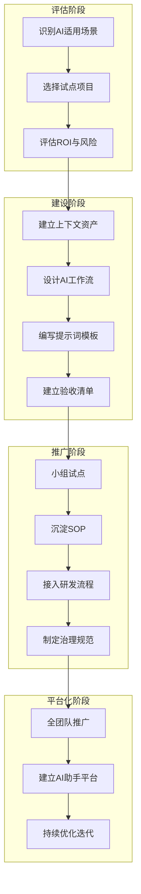

# 《企业 IT AI 落地实战手册：工作流、提示词、验收清单与团队推广方案》

> 让一个企业 IT 团队看完之后，知道哪些工作可以用 AI、怎么把 AI 放进现有研发流程、每个环节怎么写提示词、AI 生成的东西怎么验收、如何从个人使用升级到团队使用。

---

## 一、这本手册解决什么问题

企业 IT 团队在使用 AI 时，最大的问题不是"AI 不够强"，而是：

- 不知道哪些工作适合用 AI
- 不知道怎么写有效的提示词
- AI 生成的东西不知道怎么验收
- 个人用 AI 很熟练，但不知道怎么推广到团队
- 担心安全、合规、代码质量
- 银行/金融/外包场景下有特殊顾虑

这本手册解决的就是这些问题。

**核心定位**：不是 AI 科普，不是工具手册，不是学习路线——**是企业 IT AI 落地的操作手册**。

## 二、适合谁看

- Java 后端开发（Spring Boot / Spring Cloud / MyBatis）
- 技术组长 / Tech Lead（要推动团队使用 AI）
- 架构师（要设计 AI 工作流和治理规范）
- 测试负责人（要用 AI 提升测试效率）
- 项目经理（要用 AI 辅助项目管理）
- 外包项目交付人员（要在约束条件下安全使用 AI）
- 企业 IT 部门负责人（要制定 AI 使用规范）

## 三、不适合谁看

- 零编程基础想学 AI 的初学者
- 想做 AI 科研的研究人员
- 想学 LLM 训练或微调的工程师
- 只想要"AI 常用 Prompt 合集"的轻度用户（虽然本手册有大量 Prompt）

## 四、如何使用这本手册

### 按角色阅读

| 角色 | 优先阅读 | 时间 |
|------|----------|------|
| **Tech Lead / 架构师** | 01 → 02 → 03 → 05 → 08 → 15 → 16 → 20 | 4-5 小时 |
| **Java 后端开发** | 03 → 04 → 07 → 11 → 18 → 附录 | 3-4 小时 |
| **测试负责人** | 01 → 04 → 09 → 11 → 19 | 2-3 小时 |
| **项目经理** | 01 → 14 → 16 → 20 | 2 小时 |
| **企业 IT 负责人** | 01 → 02 → 15 → 16 → 17 → 20 | 3-4 小时 |

### 按场景查阅

- 想看**全景**：`01-ai-landing-map.md`
- 想选**试点项目**：`02-ai-use-case-selection.md`
- 想设计**工作流**：`03-ai-workflow-design.md`
- 需要**提示词模板**：`04-prompt-templates.md` 或 `appendix/prompt-library.md`
- 需要**验收清单**：`09-ai-validation-checklists.md` 或 `appendix/checklist-library.md`
- 想用 **Spec-Driven Development**：`05-spec-driven-development-playbook.md`
- 想用 **Vibe Coding**（安全地）：`06-vibe-coding-playbook.md`
- 想制定**AI 使用规范**：`15-enterprise-ai-governance.md`
- 想**推广到团队**：`16-team-adoption-plan.md`
- 参考**实际案例**：`17-enterprise-case-studies.md`
- **Java 后端专用**工作流：`18-java-backend-ai-workflows.md`
- 需要 **SOP 模板**：`19-ai-sop-templates.md`
- 30 天**落地计划**：`20-30-day-enterprise-rollout-plan.md`

## 五、企业 AI 落地的总体框架

AI 落地不是"买一个工具"就结束，而是要改造：

1. **工作流**：每个环节的输入、AI 执行步骤、人工检查点、输出物
2. **上下文资产**：CLAUDE.md、架构文档、代码规范、接口规范
3. **验收标准**：从编译通过到安全检查的完整验收框架
4. **责任边界**：AI 做什么、人做什么、谁对最终质量负责
5. **团队习惯**：从"自己写"到"描述需求→AI 生成→人验收"
6. **安全治理**：工具白名单、数据脱敏、日志审计、合规检查

## 六、核心方法论速览

### AI 工作流公式
> 目标 + 输入 + 上下文 + 约束 + 工具 + 步骤 + 检查点 + 输出物 + 验收标准 + 人工介入点 + 风险控制

### Vibe Coding
> 用自然语言描述目标，快速迭代。**适合原型、探索。不适合无治理的生产交付。**

### Spec-Driven Development
> 先写 Spec → AI 生成 Plan → 拆 Tasks → 逐 Task 实现 → 每步验收。**适合企业级生产系统。**

### Context Engineering
> 上下文不是越多越好——给 AI 精选的信息比堆满文档更有效。

### 验收框架
> 14 层验收：语法→编译→单元测试→接口测试→业务规则→数据库→权限→异常→日志→性能→安全→可维护性→人工 Review

## 七、核心原则

1. **AI 不是替代整个研发流程，而是嵌入研发流程。**
2. **AI 不能天然保证正确，必须设计验收机制。**
3. **企业落地 AI 的核心不是 Prompt，而是工作流。**
4. **工作流的核心不是让 AI 自由发挥，而是明确输入、约束、输出和验收。**
5. **Vibe Coding 适合探索，不适合无治理的生产交付。**
6. **Spec-Driven Development 更适合企业级 AI 编码。**
7. **Context Engineering 是团队级 AI 使用的基础设施。**
8. **程序员未来的价值在于定义问题、设计流程、约束 AI、验收结果。**
9. **企业普适化 AI 的关键是模板、SOP、Checklist 和治理。**
10. **AI 输出的最终责任必须由人承担。**

## 八、最小可行落地路径

如果你只有一个人、一周时间，这样开始：

1. **Day 1**：阅读 `01-ai-landing-map.md`，选一个适合 AI 的任务
2. **Day 2**：建立项目的 CLAUDE.md（参考 `08-context-engineering-sop.md` 模板）
3. **Day 3**：用 `04-prompt-templates.md` 的模板完成第一个 AI 辅助任务
4. **Day 4**：用 `09-ai-validation-checklists.md` 验收 AI 的产出
5. **Day 5**：写一份简单的使用总结，给 Tech Lead 看

如果你是一个 Tech Lead，有 30 天时间，按 `20-30-day-enterprise-rollout-plan.md` 执行。

## 九、配套教程

本手册是实战操作手册。如果需要系统学习背后的理论和方法论，请参考同目录下的：

- `../ai-it-workflow-roadmap/` — 《AI 时代程序员成长路线图》教程

建议顺序：先读本手册快速上手，再读教程深入理解原理。

---

**开始使用**：从 `01-ai-landing-map.md` 开始，了解 AI 在企业 IT 中的全景应用。
