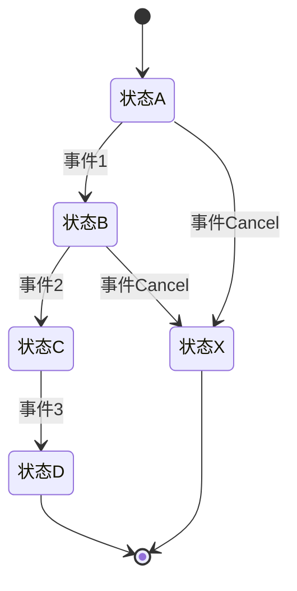
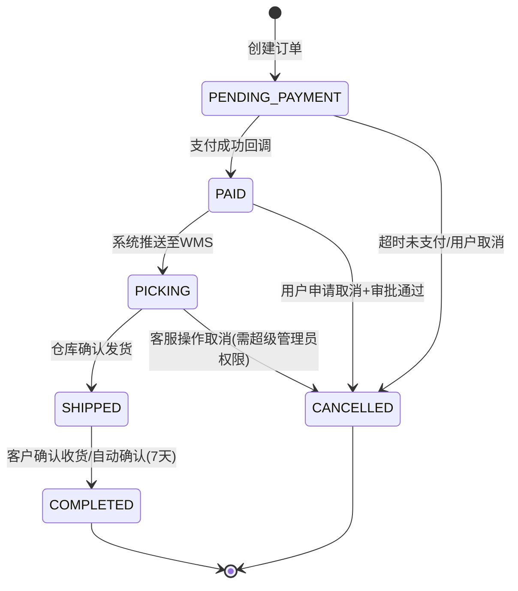

# Spec 标准模板

> 使用说明：本模板面向 Java/Spring Boot 企业项目。使用时复制全文，按照每个章节中的说明填写具体内容。示例以"订单管理"模块贯穿始终。

---

## 1. 背景与目标

### 说明

描述业务场景、痛点、预期解决的问题。回答两个问题：为什么要做？做成什么样算成功？

### 模板

```markdown
## 业务背景

<描述当前业务流程、存在的问题或机会>

## 核心目标

1. <目标1：量化指标或定性结果>
2. <目标2>
3. <目标3>

## 非目标（本次不做的）

1. <明确排除的内容>
2. <明确排除的内容>
```

### 示例：订单管理

```markdown
## 业务背景

当前电商平台的订单处理完全靠人工：客服在微信群接收订单信息，手动录入 Excel，再通过邮件转发给仓库出货。日均 200 单时勉强应付，现在日均 800 单，错误率上升到 3%，客诉量月增 40%。亟需一套订单管理系统实现线上化。

## 核心目标

1. 订单创建到发货全流程线上化，日均处理能力 >= 2000 单
2. 订单状态实时可查，客户、客服、仓库三方数据一致
3. 与现有支付系统、物流系统完成对接，数据自动流转

## 非目标（本次不做的）

1. 不做库存管理（已有独立 WMS 系统）
2. 不做售后/退货流程（二期需求）
3. 不做数据分析和报表（已有 BI 系统对接）
```

---

## 2. 功能范围

### 说明

明确做什么、不做什么。功能边界清晰才能防止范围蔓延。功能清单用表格形式列出优先级。

### 模板

```markdown
## 功能清单

| 编号 | 功能 | 优先级 | 说明 |
|------|------|--------|------|
| F-001 | <功能名称> | P0/P1/P2 | <一句话描述> |

## 明确不做

| 编号 | 功能 | 不做原因 |
|------|------|----------|
| N-001 | <功能名称> | <原因> |

## 功能依赖

| 功能 | 依赖的系统/模块 | 依赖内容 |
|------|----------------|----------|
| F-001 | <外部系统名> | <具体依赖什么> |
```

### 示例：订单管理

```markdown
## 功能清单

| 编号 | 功能 | 优先级 | 说明 |
|------|------|--------|------|
| F-001 | 订单创建 | P0 | 支持客户自助下单和客服代下单两种模式 |
| F-002 | 订单列表与查询 | P0 | 支持多条件组合筛选、排序、分页 |
| F-003 | 订单详情查看 | P0 | 含订单基本信息、商品明细、操作日志 |
| F-004 | 订单状态流转 | P0 | 待支付→已支付→配货中→已发货→已完成→已取消 |
| F-005 | 订单修改 | P1 | 未支付状态下可修改收货地址和商品数量 |
| F-006 | 订单取消 | P0 | 已支付未发货可申请取消，需审批 |
| F-007 | 订单导出 | P2 | 导出为 Excel，用于财务对账 |

## 明确不做

| 编号 | 功能 | 不做原因 |
|------|------|----------|
| N-001 | 库存校验 | WMS 系统负责，订单系统只传数据不校验 |
| N-002 | 支付对接 | 支付网关统一处理，订单系统只接收支付回调 |
| N-003 | 退款处理 | 售后系统负责，二期统一做 |

## 功能依赖

| 功能 | 依赖的系统/模块 | 依赖内容 |
|------|----------------|----------|
| F-001 | 用户中心 | 获取客户基本信息、收货地址列表 |
| F-002 | 商品中心 | 获取商品名称、SKU、价格 |
| F-003 | 支付网关 | 接收支付成功/失败回调 |
| F-004 | WMS 仓储系统 | 推送发货单、接收发货状态回调 |
| F-005 | 物流系统 | 获取物流单号和轨迹 |
```

---

## 3. 用户角色与权限矩阵

### 说明

列出所有参与角色及其职责，用矩阵表达角色-功能权限关系。

### 模板

```markdown
## 角色定义

| 角色 | 标识 | 说明 |
|------|------|------|
| <角色名> | ROLE_XXX | <职责描述> |

## 权限矩阵

| 功能 | ROLE_A | ROLE_B | ROLE_C |
|------|--------|--------|--------|
| <功能1> | 增/删/改/查 | 查 | - |
| <功能2> | 查 | 增/改/查 | 查 |
```

### 示例：订单管理

```markdown
## 角色定义

| 角色 | 标识 | 说明 |
|------|------|------|
| 普通客户 | ROLE_CUSTOMER | 查看自己的订单、创建订单、取消自己的订单 |
| 客服人员 | ROLE_CS | 代客户创建订单、查看所有订单、修改未支付订单 |
| 仓库管理员 | ROLE_WAREHOUSE | 查看待配货订单、确认发货 |
| 系统管理员 | ROLE_ADMIN | 所有权限、订单配置管理 |

## 权限矩阵

| 功能 | ROLE_CUSTOMER | ROLE_CS | ROLE_WAREHOUSE | ROLE_ADMIN |
|------|--------------|---------|---------------|------------|
| 创建订单 | 自己 | 代客 | - | 全部 |
| 查看订单列表 | 自己 | 全部 | 待配货 | 全部 |
| 查看订单详情 | 自己 | 全部 | 全部 | 全部 |
| 修改订单 | 自己(未支付) | 全部(未支付) | - | 全部 |
| 取消订单 | 自己(未支付) | 全部(未支付) | - | 全部(含已支付) |
| 确认发货 | - | - | 全部 | 全部 |
| 导出订单 | - | 全部 | 无 | 全部 |
| 订单配置 | - | - | - | 全部 |
```

---

## 4. 业务流程图

### 说明

使用 Mermaid state diagram 描述核心业务流程的状态变化。状态图最清晰表达"什么状态→什么事件→到什么状态"。

### 模板

```markdown

```

### 示例：订单管理

```markdown
订单状态流转：



## 关键状态说明

| 状态 | 标识 | 说明 |
|------|------|------|
| 待支付 | PENDING_PAYMENT | 订单已创建，等待客户支付 |
| 已支付 | PAID | 支付已确认，等待推送WMS |
| 配货中 | PICKING | 已推送WMS，仓库正在配货 |
| 已发货 | SHIPPED | 仓库已出库，物流已揽件 |
| 已完成 | COMPLETED | 客户确认收货或超时自动确认 |
| 已取消 | CANCELLED | 订单已取消，不再流转 |
```

---

## 5. API Spec

### 说明

每个 RESTful 端点需明确：路径、HTTP 方法、请求参数/请求体、响应体结构、错误码。使用统一响应格式。

### 模板

```markdown
## 统一响应格式

```json
{
  "code": 200,
  "message": "success",
  "data": {},
  "timestamp": 1700000000000
}
```

## 通用错误码

| 错误码 | 说明 | HTTP Status |
|--------|------|-------------|
| 400 | 请求参数校验失败 | 400 |
| 401 | 未认证 | 401 |
| 403 | 无权限 | 403 |
| 404 | 资源不存在 | 404 |
| 409 | 业务冲突（如重复提交） | 409 |
| 500 | 服务内部错误 | 500 |

## 端点列表

### <编号> <接口名称>

- **路径**: `<METHOD> /api/v1/<resource>`
- **权限**: <角色标识>

**请求参数**:

| 参数名 | 类型 | 必填 | 说明 |
|--------|------|------|------|
| <param> | String | 是 | <说明> |

**请求体**:

```json
{
  "field": "value"
}
```

**响应体**:

```json
{
  "code": 200,
  "message": "success",
  "data": {
    "id": 1001
  }
}
```

**业务错误码**:

| 错误码 | 说明 |
|--------|------|
| ORDER_001 | 订单不存在 |
| ORDER_002 | 订单状态不允许此操作 |
```

### 示例：订单管理

```markdown
## 统一响应格式

```json
{
  "code": 200,
  "message": "success",
  "data": {},
  "timestamp": 1700000000000
}
```

## 端点列表

### API-01 创建订单

- **路径**: `POST /api/v1/orders`
- **权限**: ROLE_CUSTOMER, ROLE_CS

**请求体**:

```json
{
  "customerId": 10001,
  "items": [
    {
      "skuCode": "PROD-001",
      "quantity": 2,
      "unitPrice": 9900
    }
  ],
  "shippingAddress": {
    "receiverName": "张三",
    "phone": "13800138000",
    "province": "浙江省",
    "city": "杭州市",
    "district": "余杭区",
    "detail": "文一西路 969 号"
  },
  "remark": "请发顺丰"
}
```

**响应体**:

```json
{
  "code": 200,
  "message": "success",
  "data": {
    "orderId": 202407010001,
    "orderNo": "ORD202407010001",
    "totalAmount": 19800,
    "status": "PENDING_PAYMENT",
    "createdAt": "2024-07-01T10:30:00"
  }
}
```

**业务错误码**:

| 错误码 | HTTP Status | 说明 |
|--------|-------------|------|
| ORDER_PARAM_INVALID | 400 | 参数校验失败，含具体字段提示 |
| ORDER_SKU_NOT_FOUND | 404 | SKU 不存在或已下架 |
| ORDER_ADDR_INVALID | 400 | 收货地址不完整 |
| ORDER_DUPLICATE | 409 | 重复提交，请勿重复操作 |

### API-02 查询订单列表

- **路径**: `GET /api/v1/orders`
- **权限**: ROLE_CUSTOMER(仅自己), ROLE_CS(全部), ROLE_ADMIN(全部)

**请求参数**:

| 参数名 | 类型 | 必填 | 说明 |
|--------|------|------|------|
| status | String | 否 | 订单状态，多选用逗号分隔 |
| customerName | String | 否 | 客户姓名，模糊匹配 |
| startDate | String | 否 | 创建开始日期，格式 yyyy-MM-dd |
| endDate | String | 否 | 创建结束日期 |
| pageNum | Integer | 否 | 页码，默认 1 |
| pageSize | Integer | 否 | 每页条数，默认 20，最大 100 |

**响应体**:

```json
{
  "code": 200,
  "message": "success",
  "data": {
    "total": 856,
    "pageNum": 1,
    "pageSize": 20,
    "records": [
      {
        "orderId": 202407010001,
        "orderNo": "ORD202407010001",
        "customerName": "张三",
        "totalAmount": 19800,
        "status": "PENDING_PAYMENT",
        "statusDesc": "待支付",
        "createdAt": "2024-07-01T10:30:00"
      }
    ]
  }
}
```

### API-03 查询订单详情

- **路径**: `GET /api/v1/orders/{orderId}`
- **权限**: ROLE_CUSTOMER(仅自己), 其他角色(全部)

**路径参数**:

| 参数名 | 类型 | 必填 | 说明 |
|--------|------|------|------|
| orderId | Long | 是 | 订单 ID |

**响应体**:

```json
{
  "code": 200,
  "message": "success",
  "data": {
    "orderId": 202407010001,
    "orderNo": "ORD202407010001",
    "customerId": 10001,
    "customerName": "张三",
    "status": "SHIPPED",
    "statusDesc": "已发货",
    "totalAmount": 19800,
    "payAmount": 19800,
    "paymentMethod": "WECHAT_PAY",
    "paidAt": "2024-07-01T10:35:00",
    "items": [
      {
        "skuCode": "PROD-001",
        "skuName": "无线蓝牙耳机",
        "quantity": 2,
        "unitPrice": 9900,
        "subtotal": 19800
      }
    ],
    "shippingAddress": {
      "receiverName": "张三",
      "phone": "13800138000",
      "province": "浙江省",
      "city": "杭州市",
      "district": "余杭区",
      "detail": "文一西路 969 号"
    },
    "logistics": {
      "company": "顺丰速运",
      "trackingNo": "SF1234567890",
      "shippedAt": "2024-07-02T09:00:00",
      "estimatedDelivery": "2024-07-04"
    },
    "createdAt": "2024-07-01T10:30:00",
    "updatedAt": "2024-07-02T09:00:00"
  }
}
```

**业务错误码**:

| 错误码 | HTTP Status | 说明 |
|--------|-------------|------|
| ORDER_NOT_FOUND | 404 | 订单不存在 |
| ORDER_ACCESS_DENIED | 403 | 无权查看该订单 |

### API-04 取消订单

- **路径**: `POST /api/v1/orders/{orderId}/cancel`
- **权限**: ROLE_CUSTOMER(自己+未支付), ROLE_CS(所有未支付), ROLE_ADMIN(所有)

**请求体**:

```json
{
  "reason": "不想要了"
}
```

**响应体**:

```json
{
  "code": 200,
  "message": "success",
  "data": {
    "orderId": 202407010001,
    "status": "CANCELLED",
    "cancelledAt": "2024-07-01T10:40:00"
  }
}
```

**业务错误码**:

| 错误码 | HTTP Status | 说明 |
|--------|-------------|------|
| ORDER_NOT_FOUND | 404 | 订单不存在 |
| ORDER_STATUS_INVALID | 409 | 当前订单状态不允许取消 |
| ORDER_CANCEL_NEED_APPROVAL | 409 | 已支付订单需先提交取消审批 |
```

---

## 6. 数据模型 Spec

### 说明

每张表需要：表名、字段定义（名称/类型/长度/是否必填/默认值/说明）、主键、索引、唯一约束、外键。

### 模板

```markdown
## <表名> -- <表中文名>

### 字段定义

| 字段名 | 类型 | 长度 | 必填 | 默认值 | 说明 |
|--------|------|------|------|--------|------|
| id | BIGINT | - | 是 | 自增 | 主键 |
| <field> | VARCHAR | 64 | 是 | - | <说明> |
| created_at | DATETIME | - | 是 | CURRENT_TIMESTAMP | 创建时间 |
| updated_at | DATETIME | - | 是 | CURRENT_TIMESTAMP | 更新时间 |
| deleted | TINYINT | 1 | 是 | 0 | 逻辑删除 0=正常 1=删除 |

### 索引

| 索引名 | 类型 | 字段 | 说明 |
|--------|------|------|------|
| idx_<table>_<field> | NORMAL/UNIQUE | <字段列表> | <说明> |

### DDL

```sql
CREATE TABLE `<table_name>` (
  `id` BIGINT NOT NULL AUTO_INCREMENT COMMENT '主键',
  ...
  PRIMARY KEY (`id`),
  ...
) ENGINE=InnoDB DEFAULT CHARSET=utf8mb4 COMMENT='<表注释>';
```
```

### 示例：订单管理

```markdown
## t_order -- 订单主表

### 字段定义

| 字段名 | 类型 | 长度 | 必填 | 默认值 | 说明 |
|--------|------|------|------|--------|------|
| id | BIGINT | - | 是 | 自增 | 主键 |
| order_no | VARCHAR | 32 | 是 | - | 订单号，唯一，规则：ORD+yyyyMMdd+6位序号 |
| customer_id | BIGINT | - | 是 | - | 客户 ID |
| customer_name | VARCHAR | 64 | 是 | - | 客户姓名（冗余，避免频繁关联查询） |
| total_amount | DECIMAL | 12,2 | 是 | - | 订单总额，单位：分 |
| pay_amount | DECIMAL | 12,2 | 否 | NULL | 实际支付金额 |
| status | VARCHAR | 32 | 是 | PENDING_PAYMENT | 订单状态 |
| payment_method | VARCHAR | 32 | 否 | NULL | 支付方式 |
| paid_at | DATETIME | - | 否 | NULL | 支付时间 |
| completed_at | DATETIME | - | 否 | NULL | 完成时间 |
| cancelled_at | DATETIME | - | 否 | NULL | 取消时间 |
| cancel_reason | VARCHAR | 256 | 否 | NULL | 取消原因 |
| remark | VARCHAR | 512 | 否 | '' | 订单备注 |
| created_by | BIGINT | - | 是 | - | 创建人 ID |
| created_at | DATETIME | - | 是 | CURRENT_TIMESTAMP | 创建时间 |
| updated_by | BIGINT | - | 否 | NULL | 更新人 ID |
| updated_at | DATETIME | - | 是 | CURRENT_TIMESTAMP | 更新时间 |
| deleted | TINYINT | 1 | 是 | 0 | 逻辑删除 |

### 索引

| 索引名 | 类型 | 字段 | 说明 |
|--------|------|------|------|
| uk_order_no | UNIQUE | order_no | 订单号唯一 |
| idx_customer_id | NORMAL | customer_id | 按客户查询 |
| idx_status | NORMAL | status | 按状态筛选 |
| idx_created_at | NORMAL | created_at | 按时间范围查询 |
| idx_customer_status | NORMAL | customer_id, status | 客户+状态组合查询 |

### DDL

```sql
CREATE TABLE `t_order` (
  `id` BIGINT NOT NULL AUTO_INCREMENT COMMENT '主键',
  `order_no` VARCHAR(32) NOT NULL COMMENT '订单号',
  `customer_id` BIGINT NOT NULL COMMENT '客户ID',
  `customer_name` VARCHAR(64) NOT NULL COMMENT '客户姓名',
  `total_amount` DECIMAL(12,2) NOT NULL COMMENT '订单总额，单位分',
  `pay_amount` DECIMAL(12,2) DEFAULT NULL COMMENT '实际支付金额',
  `payment_method` VARCHAR(32) DEFAULT NULL COMMENT '支付方式：WECHAT_PAY/ALIPAY/BANK_TRANSFER',
  `status` VARCHAR(32) NOT NULL DEFAULT 'PENDING_PAYMENT' COMMENT '订单状态',
  `paid_at` DATETIME DEFAULT NULL COMMENT '支付时间',
  `completed_at` DATETIME DEFAULT NULL COMMENT '完成时间',
  `cancelled_at` DATETIME DEFAULT NULL COMMENT '取消时间',
  `cancel_reason` VARCHAR(256) DEFAULT NULL COMMENT '取消原因',
  `remark` VARCHAR(512) DEFAULT '' COMMENT '订单备注',
  `created_by` BIGINT NOT NULL COMMENT '创建人ID',
  `created_at` DATETIME NOT NULL DEFAULT CURRENT_TIMESTAMP COMMENT '创建时间',
  `updated_by` BIGINT DEFAULT NULL COMMENT '更新人ID',
  `updated_at` DATETIME NOT NULL DEFAULT CURRENT_TIMESTAMP ON UPDATE CURRENT_TIMESTAMP COMMENT '更新时间',
  `deleted` TINYINT(1) NOT NULL DEFAULT 0 COMMENT '逻辑删除 0=正常 1=删除',
  PRIMARY KEY (`id`),
  UNIQUE KEY `uk_order_no` (`order_no`),
  KEY `idx_customer_id` (`customer_id`),
  KEY `idx_status` (`status`),
  KEY `idx_created_at` (`created_at`),
  KEY `idx_customer_status` (`customer_id`, `status`)
) ENGINE=InnoDB DEFAULT CHARSET=utf8mb4 COMMENT='订单主表';
```

---

## t_order_item -- 订单商品明细表

### 字段定义

| 字段名 | 类型 | 长度 | 必填 | 默认值 | 说明 |
|--------|------|------|------|--------|------|
| id | BIGINT | - | 是 | 自增 | 主键 |
| order_id | BIGINT | - | 是 | - | 订单 ID |
| sku_code | VARCHAR | 64 | 是 | - | SKU 编码 |
| sku_name | VARCHAR | 256 | 是 | - | 商品名称（冗余） |
| quantity | INT | - | 是 | - | 购买数量 |
| unit_price | DECIMAL | 12,2 | 是 | - | 单价，单位：分 |
| subtotal | DECIMAL | 12,2 | 是 | - | 小计，单位：分 |
| created_at | DATETIME | - | 是 | CURRENT_TIMESTAMP | 创建时间 |

### 索引

| 索引名 | 类型 | 字段 | 说明 |
|--------|------|------|------|
| idx_order_id | NORMAL | order_id | 按订单查询明细 |

### DDL

```sql
CREATE TABLE `t_order_item` (
  `id` BIGINT NOT NULL AUTO_INCREMENT COMMENT '主键',
  `order_id` BIGINT NOT NULL COMMENT '订单ID',
  `sku_code` VARCHAR(64) NOT NULL COMMENT 'SKU编码',
  `sku_name` VARCHAR(256) NOT NULL COMMENT '商品名称',
  `quantity` INT NOT NULL COMMENT '购买数量',
  `unit_price` DECIMAL(12,2) NOT NULL COMMENT '单价，单位分',
  `subtotal` DECIMAL(12,2) NOT NULL COMMENT '小计，单位分',
  `created_at` DATETIME NOT NULL DEFAULT CURRENT_TIMESTAMP COMMENT '创建时间',
  PRIMARY KEY (`id`),
  KEY `idx_order_id` (`order_id`)
) ENGINE=InnoDB DEFAULT CHARSET=utf8mb4 COMMENT='订单商品明细表';
```

---

## t_order_log -- 订单操作日志表

### 字段定义

| 字段名 | 类型 | 长度 | 必填 | 默认值 | 说明 |
|--------|------|------|------|--------|------|
| id | BIGINT | - | 是 | 自增 | 主键 |
| order_id | BIGINT | - | 是 | - | 订单 ID |
| operate_type | VARCHAR | 32 | 是 | - | 操作类型：CREATE/PAY/CANCEL/SHIP/COMPLETE |
| from_status | VARCHAR | 32 | 否 | NULL | 操作前状态 |
| to_status | VARCHAR | 32 | 否 | NULL | 操作后状态 |
| operator_id | BIGINT | - | 是 | - | 操作人 ID |
| operator_name | VARCHAR | 64 | 是 | - | 操作人姓名（冗余） |
| remark | VARCHAR | 512 | 否 | '' | 操作备注 |
| created_at | DATETIME | - | 是 | CURRENT_TIMESTAMP | 创建时间 |

### 索引

| 索引名 | 类型 | 字段 | 说明 |
|--------|------|------|------|
| idx_order_id | NORMAL | order_id | 按订单查询日志 |
| idx_operate_type | NORMAL | operate_type | 按操作类型筛选 |

### DDL

```sql
CREATE TABLE `t_order_log` (
  `id` BIGINT NOT NULL AUTO_INCREMENT COMMENT '主键',
  `order_id` BIGINT NOT NULL COMMENT '订单ID',
  `operate_type` VARCHAR(32) NOT NULL COMMENT '操作类型',
  `from_status` VARCHAR(32) DEFAULT NULL COMMENT '操作前状态',
  `to_status` VARCHAR(32) DEFAULT NULL COMMENT '操作后状态',
  `operator_id` BIGINT NOT NULL COMMENT '操作人ID',
  `operator_name` VARCHAR(64) NOT NULL COMMENT '操作人姓名',
  `remark` VARCHAR(512) DEFAULT '' COMMENT '操作备注',
  `created_at` DATETIME NOT NULL DEFAULT CURRENT_TIMESTAMP COMMENT '创建时间',
  PRIMARY KEY (`id`),
  KEY `idx_order_id` (`order_id`),
  KEY `idx_operate_type` (`operate_type`)
) ENGINE=InnoDB DEFAULT CHARSET=utf8mb4 COMMENT='订单操作日志表';
```
```

---

## 7. 权限规则

### 说明

定义角色对资源的操作权限，包括行级权限（能看哪些数据）和列级权限（能看哪些字段）。权限检查点在 Controller 层通过注解声明。

### 模板

```markdown
## 权限规则表

### 接口级权限

| 接口 | <角色1> | <角色2> | <角色3> | 说明 |
|------|---------|---------|---------|------|
| <接口路径> | 允许/拒绝 | 允许/拒绝 | 允许/拒绝 | <条件说明> |

### 数据级权限（行级）

| 角色 | 可见数据范围 | SQL 过滤条件 |
|------|------------|-------------|
| <角色1> | <范围描述> | WHERE customer_id = {currentUserId} |

### 字段级权限（列级）

| 字段 | <角色1> | <角色2> | 说明 |
|------|---------|---------|------|
| <敏感字段> | 可见 | 不可见 | <脱敏规则> |
```

### 示例：订单管理

```markdown
## 权限规则表

### 接口级权限

| 接口 | ROLE_CUSTOMER | ROLE_CS | ROLE_WAREHOUSE | ROLE_ADMIN | 说明 |
|------|--------------|---------|---------------|------------|------|
| POST /orders | 允许 | 允许 | 拒绝 | 允许 | 客服代客下单时需传 customerId |
| GET /orders | 允许（仅自己） | 允许（全部） | 允许（仅PICKING） | 允许（全部） | - |
| GET /orders/{id} | 允许（仅自己） | 允许（全部） | 允许（全部） | 允许（全部） | - |
| PUT /orders/{id} | 允许（仅自己+未支付） | 允许（全部+未支付） | 拒绝 | 允许（全部） | 仅未支付状态可修改 |
| POST /orders/{id}/cancel | 允许（仅自己+未支付） | 允许（全部+未支付） | 拒绝 | 允许（全部） | 已支付需走审批 |
| POST /orders/{id}/ship | 拒绝 | 拒绝 | 允许 | 允许 | 仓库确认发货 |
| GET /orders/export | 拒绝 | 允许 | 拒绝 | 允许 | 导出 Excel |

### 数据级权限（行级）

| 角色 | 可见数据范围 | SQL 过滤条件 |
|------|------------|-------------|
| ROLE_CUSTOMER | 仅自己 | WHERE customer_id = #{currentUserId} |
| ROLE_CS | 全部订单 | 无限制 |
| ROLE_WAREHOUSE | 待配货订单 | WHERE status = 'PAID' OR status = 'PICKING' |
| ROLE_ADMIN | 全部订单 | 无限制 |

**实现方式**: MyBatis-Plus DataPermissionInterceptor 自动拼接 WHERE 条件，通过注解 `@DataScope` 声明即可。

### 字段级权限（列级）

| 字段 | ROLE_CUSTOMER | ROLE_CS | ROLE_WAREHOUSE | 说明 |
|------|--------------|---------|---------------|------|
| pay_amount | 可见 | 可见 | 可见 | 支付金额所有人都可见 |
| shippingAddress.phone | 可见 | 可见 | 可见 | 用于发货联系 |
| created_by | 不可见 | 可见 | 不可见 | 创建人 ID 仅客服和管理员可见 |

**实现方式**: Jackson `@JsonView` 注解 + Controller 层按角色选择 View 序列化。
```

---

## 8. 状态流转规则

### 说明

明确定义所有合法状态、事件、触发条件。使用状态机模型，列出每个状态允许的操作及操作后的目标状态。不合法的状态变更必须被拒绝。

### 模板

```markdown
## 状态枚举

| 状态标识 | 中文名 | 说明 |
|----------|--------|------|
| STATUS_A | <状态A> | <说明> |
| STATUS_B | <状态B> | <说明> |

## 事件枚举

| 事件标识 | 中文名 | 说明 |
|----------|--------|------|
| EVENT_A | <事件A> | <说明> |

## 状态流转矩阵

| 当前状态 | 允许的事件 | 目标状态 | 前置条件 | 后置动作 |
|----------|-----------|----------|----------|----------|
| STATUS_A | EVENT_1 | STATUS_B | <条件> | <动作> |
| STATUS_A | EVENT_CANCEL | STATUS_X | <条件> | <动作> |
```

### 示例：订单管理

```markdown
## 状态枚举

| 状态标识 | 中文名 | 说明 |
|----------|--------|------|
| PENDING_PAYMENT | 待支付 | 订单已创建，等待客户支付 |
| PAID | 已支付 | 支付成功，等待推送 WMS |
| PICKING | 配货中 | 已推送给 WMS 系统，仓库配货中 |
| SHIPPED | 已发货 | 仓库已出库，物流已揽件 |
| COMPLETED | 已完成 | 客户确认收货，或 7 天后自动确认 |
| CANCELLED | 已取消 | 订单已取消，终态 |

## 事件枚举

| 事件标识 | 中文名 | 说明 |
|----------|--------|------|
| CUSTOMER_CANCEL | 客户取消 | 客户主动取消订单 |
| CS_CANCEL | 客服取消 | 客服代客户取消 |
| ADMIN_CANCEL | 管理员取消 | 管理员强制取消 |
| PAYMENT_SUCCESS | 支付成功 | 支付网关回调支付成功 |
| PAYMENT_TIMEOUT | 支付超时 | 30 分钟未支付自动取消 |
| PUSH_WMS | 推送仓库 | 订单信息推送至 WMS 系统 |
| WMS_SHIPPED | 仓库发货 | WMS 回调发货完成 |
| CUSTOMER_CONFIRM | 客户确认收货 | 客户点击确认收货 |
| AUTO_COMPLETE | 自动完成 | 发货后 7 天自动确认 |

## 状态流转矩阵

| 当前状态 | 允许的事件 | 目标状态 | 前置条件 | 后置动作 |
|----------|-----------|----------|----------|----------|
| PENDING_PAYMENT | CUSTOMER_CANCEL | CANCELLED | 订单创建人是当前用户 | 释放优惠券 |
| PENDING_PAYMENT | CS_CANCEL | CANCELLED | - | 释放优惠券 |
| PENDING_PAYMENT | PAYMENT_SUCCESS | PAID | 支付金额 = 订单金额 | 记录支付流水号 |
| PENDING_PAYMENT | PAYMENT_TIMEOUT | CANCELLED | 创建时间 + 30分钟 < 当前时间 | 释放库存 |
| PAID | PUSH_WMS | PICKING | - | 调用 WMS 创建发货单 API |
| PAID | CUSTOMER_CANCEL | CANCELLED | 需提交取消审批 | 创建审批工单 |
| PAID | ADMIN_CANCEL | CANCELLED | - | 发起退款流程 |
| PICKING | ADMIN_CANCEL | CANCELLED | 需超级管理员权限 | 通知 WMS 取消发货单 |
| PICKING | WMS_SHIPPED | SHIPPED | 物流单号不为空 | 发短信通知客户 |
| SHIPPED | CUSTOMER_CONFIRM | COMPLETED | - | 积分发放、完成时间记录 |
| SHIPPED | AUTO_COMPLETE | COMPLETED | shipped_at + 7天 < 当前时间 | 积分发放 |

## 状态流转约束

1. **不可跳跃**: 必须按定义的状态路径流转，不可从 PENDING_PAYMENT 直接跳到 SHIPPED
2. **不可逆转**: SHIPPED→PICKING 这种逆向流转不允许（取消除外，取消是独立的终态路径）
3. **不可跨权**: 普通客户不能执行 ADMIN_CANCEL

**实现方式**: Spring State Machine 或自研状态机框架 `OrderStateMachine`，在 Service 层统一校验。
```

---

## 9. 异常处理规则

### 说明

对每种可预见的异常场景，定义：什么情况、返回什么错误码、通知谁、是否需要人工介入。

### 模板

```markdown
## 异常处理规则表

| 异常场景 | 触发条件 | HTTP状态码 | 业务错误码 | 用户提示 | 日志级别 | 通知 | 人工介入 |
|----------|----------|-----------|-----------|----------|----------|------|----------|
| <场景名> | <条件> | <状态码> | <错误码> | <前端提示文案> | WARN/ERROR | 无/告警/短信 | 是/否 |
```

### 示例：订单管理

```markdown
## 异常处理规则表

| 异常场景 | 触发条件 | HTTP状态码 | 业务错误码 | 用户提示 | 日志级别 | 通知 | 人工介入 |
|----------|----------|-----------|-----------|----------|----------|------|----------|
| 参数校验失败 | @Validated 校验不通过 | 400 | ORDER_PARAM_INVALID | "提交信息有误：{具体字段提示}" | WARN | 无 | 否 |
| 订单不存在 | 查询结果为空 | 404 | ORDER_NOT_FOUND | "订单不存在或已被删除" | INFO | 无 | 否 |
| 无权限访问 | @PreAuthorize 校验不通过 | 403 | ORDER_ACCESS_DENIED | "您无权查看该订单" | WARN | 无 | 否 |
| 订单状态不允许操作 | 状态不在允许列表中 | 409 | ORDER_STATUS_INVALID | "订单当前状态为[{statusDesc}]，无法执行[{action}]操作" | WARN | 无 | 否 |
| 重复提交 | 相同幂等键 5 秒内重复请求 | 409 | ORDER_DUPLICATE | "请勿重复提交，如需再次操作请刷新页面" | WARN | 无 | 否 |
| 支付金额不匹配 | 回调金额 != 订单金额 | 200(对网关) | - | 不提示用户(内部处理) | ERROR | 钉钉告警 | 是 |
| WMS 发货单创建失败 | WMS API 调用超时或返回错误 | 500 | ORDER_WMS_ERROR | "系统繁忙，请稍后重试" | ERROR | 钉钉告警 | 否(自动重试3次) |
| WMS 连续重试仍失败 | 3 次重试后仍失败 | - | - | - | FATAL | 钉钉告警+电话 | 是 |
| 并发状态冲突 | 乐观锁 version 不匹配 | 409 | ORDER_CONCURRENT_MODIFY | "订单信息已被他人修改，请刷新后重试" | WARN | 无 | 否 |
| 数据库连接超时 | Connection timeout | 500 | SERVICE_UNAVAILABLE | "系统繁忙，请稍后重试" | FATAL | 钉钉告警 | 是(运维) |
| 支付回调重复 | 相同支付流水号第2次回调 | 200(对网关) | - | 不提示 | WARN | 无 | 否(幂等处理) |

## 全局异常处理器

使用 `@RestControllerAdvice` 统一处理，异常类体系：

- `BusinessException` → 业务异常，返回对应业务错误码
- `ValidationException` → 参数校验异常，返回 400
- `AccessDeniedException` → 权限异常，返回 403
- `DuplicateSubmitException` → 重复提交异常，返回 409
- `Exception` → 兜底异常，返回 500，记录详细日志并告警
```

---

## 10. 日志审计规则

### 说明

定义哪些操作需要记日志、记什么内容、存哪里、保留多久。审计日志和业务操作日志分开管理。

### 模板

```markdown
## 日志分类

| 日志类型 | 存储位置 | 保留时间 | 示例 |
|----------|----------|----------|------|
| 业务操作日志 | t_order_log 表 | 永久 | 创建订单、支付、发货、取消 |
| 审计日志 | 审计日志表/ELK | 5年 | 管理员操作、权限变更、敏感数据查看 |
| 系统日志 | 日志文件/ELK | 90天 | 请求日志、异常日志、性能日志 |

## 操作日志记录规则

| 业务操作 | 记录内容 | 记录时机 |
|----------|----------|----------|
| <操作1> | <记录字段> | 操作成功时 |
| <操作2> | <记录字段> | 操作前+操作后 |

## 审计日志记录规则

| 审计事件 | 触发条件 | 记录内容 |
|----------|----------|----------|
| <事件1> | <条件> | <字段> |
```

### 示例：订单管理

```markdown
## 日志分类

| 日志类型 | 存储位置 | 保留时间 | 示例 |
|----------|----------|----------|------|
| 业务操作日志 | t_order_log 表 | 永久（归档策略：3年后迁移至冷存储） | 创建订单、支付、发货、取消 |
| 审计日志 | t_audit_log 表 + ELK 双写 | 5年 | 管理员取消订单、强制修改订单、导出操作 |
| 系统日志 | ELK（日志文件本地保留7天） | 90天 | 请求参数、响应结果、异常堆栈 |

## 业务操作日志记录规则

| 业务操作 | 记录内容 | 记录时机 |
|----------|----------|----------|
| 创建订单 | orderId, operatorId, operatorName, operateType=CREATE | 订单入库成功后 |
| 支付成功 | orderId, paymentMethod, payAmount, paidAt | 收到支付回调并校验通过后 |
| 取消订单 | orderId, cancelReason, fromStatus, toStatus=CANCELLED | 状态变更成功后 |
| 确认发货 | orderId, logisticsCompany, trackingNo, shippedAt | WMS 回调成功后 |
| 确认收货 | orderId, confirmType(MANUAL/AUTO) | 状态变更成功后 |
| 修改订单 | orderId, 修改前字段值, 修改后字段值, 修改字段列表 | 每次修改成功后（用 JSON 记录 diff） |

## 审计日志记录规则

| 审计事件 | 触发条件 | 记录内容 |
|----------|----------|----------|
| 管理员取消已支付订单 | ROLE_ADMIN 取消 PAID/PICKING 状态订单 | operatorId, orderId, 原状态, 取消原因, 操作 IP |
| 管理员强制修改订单金额 | ROLE_ADMIN 修改 totalAmount | operatorId, orderId, 原金额, 新金额, 操作 IP |
| 批量导出订单 | 调用导出接口 | operatorId, 导出筛选条件, 导出条数, 导出时间 |
| 查看敏感订单 | 访问标记为 VIP 客户的订单 | operatorId, orderId, 访问时间, 操作 IP |

## 审计日志不可篡改

- 审计日志写入后不允许 UPDATE/DELETE 操作
- 审计日志表的数据库用户仅有 INSERT 和 SELECT 权限
- 审计日志定期导出为只读 PDF 归档，防止数据库级篡改
```

---

## 11. 非功能约束

### 说明

定义性能、安全、可用性等技术约束。这些是设计决策的上限和下限，不是可选项。

### 模板

```markdown
## 性能约束

| 指标 | 要求 | 说明 |
|------|------|------|
| 接口响应时间 | P99 < Xms | <说明> |
| QPS | >= X | <说明> |
| 并发数 | >= X | <说明> |

## 安全约束

| 要求 | 说明 |
|------|------|
| <约束1> | <说明> |

## 可用性约束

| 指标 | 要求 |
|------|------|
| 服务可用率 | >= 99.9% |
| 数据一致性 | 最终一致性 / 强一致性 |
```

### 示例：订单管理

```markdown
## 性能约束

| 指标 | 要求 | 说明 |
|------|------|------|
| 创建订单接口 | P99 < 500ms | 含参数校验、库存检查、订单入库、事务提交 |
| 查询订单列表 | P99 < 200ms | 含权限过滤、多条件筛选、分页，列表最多 1000 条 |
| 查询订单详情 | P99 < 100ms | 含订单信息+商品明细+操作日志+物流信息 |
| 订单状态变更 | P99 < 300ms | 含状态校验、数据更新、操作日志写入 |
| 创建订单 QPS | >= 500 | 大促期间峰值预估 |
| 查询订单 QPS | >= 2000 | 日常查询量是写操作的 4 倍 |
| 并发下单 | 支持 100 并发无死锁 | 使用乐观锁 + 幂等键防重 |

## 安全约束

| 要求 | 说明 |
|------|------|
| 所有接口必须认证 | 通过 JWT Token，无 Token 直接返回 401 |
| 行级权限强制过滤 | SQL 层面通过 DataPermissionInterceptor 自动拼接 WHERE 条件 |
| 敏感字段脱敏 | 手机号返回 `138****8000`，日志中自动脱敏 |
| SQL 注入防护 | 全部使用 MyBatis 参数化查询，禁止拼接 SQL |
| XSS 防护 | 输入参数自动 HTML 转义，输出使用 JsonSerializer 处理 |
| CSRF 防护 | 关键操作（取消、修改金额）校验 Referer + CSRF Token |
| 幂等性保证 | 创建订单、支付回调使用唯一幂等键，有效期 24 小时 |
| 接口限流 | 查询接口 100次/分钟/用户，创建订单 20次/分钟/用户 |

## 可用性约束

| 指标 | 要求 |
|------|------|
| 服务可用率 | >= 99.95%（年度允许宕机时间 < 4.38 小时） |
| 数据一致性 | 订单状态与支付状态：最终一致性（允许秒级延迟）；订单金额与支付金额：强一致性 |
| 数据库 | 主从架构，读写分离 |
| 缓存 | Redis Cluster，订单详情缓存 5 分钟，状态变更主动失效 |
| 降级策略 | 支付回调超时时，异步重试 + 定时对账兜底 |
| 灾备 | RPO < 1小时，RTO < 30分钟 |
```

---

## 12. 验收标准

### 说明

分功能验收、性能验收、安全验收三类。验收标准是上线门槛，不满足不发版。

### 模板

```markdown
## 功能验收

| 编号 | 验收项 | 验收方法 | 通过标准 |
|------|--------|----------|----------|
| AC-F-001 | <验收项> | <测试方法> | <预期结果> |

## 性能验收

| 编号 | 验收项 | 验收方法 | 通过标准 |
|------|--------|----------|----------|
| AC-P-001 | <指标> | <压测方法> | <阈值> |

## 安全验收

| 编号 | 验收项 | 验收方法 | 通过标准 |
|------|--------|----------|----------|
| AC-S-001 | <检查项> | <测试方法> | <预期结果> |
```

### 示例：订单管理

```markdown
## 功能验收

| 编号 | 验收项 | 验收方法 | 通过标准 |
|------|--------|----------|----------|
| AC-F-001 | 客户下单 | 登录客户账号，选择商品，填写地址，提交订单 | 订单创建成功，返回订单号，状态为待支付 |
| AC-F-002 | 支付回调 | 模拟支付网关发送成功回调 | 订单状态变为已支付，支付记录写入 |
| AC-F-003 | 订单查询-客户 | 登录客户账号，查询订单列表 | 仅显示自己的订单，可按状态筛选 |
| AC-F-004 | 订单查询-客服 | 登录客服账号，查询全部订单 | 显示全部订单，可按客户姓名搜索 |
| AC-F-005 | 取消订单-未支付 | 客户取消自己的待支付订单 | 取消成功，状态变为已取消 |
| AC-F-006 | 取消订单-已支付 | 客户申请取消已支付订单 | 进入审批流程，审批通过后取消 |
| AC-F-007 | 订单修改 | 客服修改未支付订单的收货地址 | 修改成功，操作日志记录完整 |
| AC-F-008 | 仓库发货 | 仓库管理员确认发货，填写物流信息 | 状态变为已发货，物流信息入库 |
| AC-F-009 | 确认收货 | 客户点击确认收货 | 状态变为已完成，积分发放 |
| AC-F-010 | 自动完成 | 定时任务处理发货超 7 天的订单 | 状态变为已完成，完成时间正确 |
| AC-F-011 | 状态越权保护 | 发起非法的状态转换请求 | 返回 409 错误，提示当前状态不可操作 |
| AC-F-012 | 权限越权保护 | 客户尝试查看他人订单 | 返回 403 错误，查询列表仅显示自己的 |
| AC-F-013 | 订单导出 | 客服导出订单 Excel | 导出的数据与列表查询结果一致 |
| AC-F-014 | 幂等性 | 相同请求 5 秒内重复提交 | 第二次返回 409，提示勿重复提交 |

## 性能验收

| 编号 | 验收项 | 验收方法 | 通过标准 |
|------|--------|----------|----------|
| AC-P-001 | 查询接口 RT | JMeter 并发 500，持续 5 分钟 | P99 < 200ms |
| AC-P-002 | 创建订单 RT | JMeter 并发 100，持续 5 分钟 | P99 < 500ms |
| AC-P-003 | 查询 QPS | 逐步加压到 2000 QPS | 错误率 < 0.1% |
| AC-P-004 | 创建 QPS | 逐步加压到 500 QPS | 错误率 < 0.1% |
| AC-P-005 | 数据库连接池 | 在高并发下观察连接池使用率 | 峰值 < 80%，无连接泄漏 |

## 安全验收

| 编号 | 验收项 | 验收方法 | 通过标准 |
|------|--------|----------|----------|
| AC-S-001 | 未登录访问 | 不带 JWT Token 调用任意接口 | 返回 401 |
| AC-S-002 | SQL 注入 | 在查询参数中注入 `' OR '1'='1` | 查询结果正常过滤，无数据泄露 |
| AC-S-003 | XSS 攻击 | 在备注字段提交 `<script>alert(1)</script>` | 存储原样或转义，输出时不执行 |
| AC-S-004 | 越权查询 | 客户 A 查询客户 B 的订单详情 | 返回 403 |
| AC-S-005 | 行级数据泄露 | 客服导出订单 Excel | 文件中不含脱敏字段原文 |
| AC-S-006 | 日志脱敏 | 查看接口日志输出 | 手机号在日志中为 `138****8000` 格式 |
| AC-S-007 | 审计日志完整性 | 执行管理员取消订单操作后检查审计表 | 审计表中有对应记录且不可删除 |
| AC-S-008 | 限流验证 | 短时间大量调用同一接口 | 超过阈值后返回 429 |

## 验收总门槛

- 功能验收：14 项全部通过
- 性能验收：5 项全部通过
- 安全验收：8 项全部通过
- 任一不通过，禁止上线
```

---

## 13. 给 AI 的执行提示词

### 说明

这是一份专门的提示词，给 AI 用的。基于前面的 Spec 内容，让 AI 生成代码、测试、配置。这份提示词的目标是让 AI 的输出可复现——不同的 AI、不同的时间，用同一份提示词得到结果一致。

### 模板

```markdown
你是一个资深 Java/Spring Boot 后端开发工程师。请基于以下 Spec 完成开发任务。

## Spec 文档

<在此粘贴或引用上面的完整 Spec>

## 技术栈

- Spring Boot 2.7.x / 3.x
- MyBatis-Plus
- MySQL 8.0
- Redis
- JWT + Spring Security
- Lombok
- MapStruct
- 统一响应格式：com.xxx.common.Result<T>
- 统一异常处理：com.xxx.common.exception.BusinessException

## 执行要求

### 代码生成要求

1. 严格遵循 Spec 中的 API Spec（路径、参数、响应体格式）
2. 严格遵循 Spec 中的数据模型（DDL、字段名、类型、长度、索引）
3. 严格遵循 Spec 中的状态流转规则（只允许合法状态转换）
4. 严格遵循 Spec 中的权限规则（接口级+行级+列级）
5. 所有业务校验逻辑从 Spec 的"异常处理规则""状态流转矩阵"中获取，不自创规则
6. 字段名、枚举值、状态标识必须与 Spec 完全一致（驼峰命名统一）

### 代码质量要求

1. Controller → Service → Mapper 三层结构
2. Service 层接口+实现类分离
3. 参数校验使用 JSR-303 注解（@Validated + @NotNull/@NotBlank 等）
4. 跨表操作加 @Transactional，明确回滚条件
5. 状态变更使用乐观锁（version 字段）或状态前置校验防并发
6. 外部系统调用必须加超时和重试（3次，指数退避）
7. 日志使用 Slf4j，关键操作打 INFO，异常打 ERROR

### 测试生成要求

1. 为每个 Service 方法生成单元测试，覆盖正常+边界+异常场景
2. 状态流转的每个合法/非法路径都要有测试用例
3. 权限校验的每个角色组合都要有测试用例
4. Mock 外部系统调用（支付网关、WMS）

### 配置生成要求

1. application.yml 中需要的自定义配置项
2. 限流配置
3. 线程池配置
4. 重试配置

## 输出格式

按以下顺序输出：

1. **DDL** — 所有建表 SQL
2. **Entity + Mapper** — 实体类 + Mapper 接口
3. **DTO/VO** — 请求/响应对象
4. **Service 接口 + ServiceImpl** — 业务逻辑
5. **Controller** — 接口层
6. **配置文件** — application.yml 片段
7. **单元测试** — 每个 Service 的测试类
8. **异常枚举** — 业务错误码枚举定义

## 不做的

1. 不要生成前端代码
2. 不要修改 Spec 中定义的接口签名的核心结构
3. 不要自行增减 Spec 中没有的状态或事件
4. 不要忽略 Spec 中标注为 P0 的功能
```

### 示例：订单管理

```markdown
你是一个资深 Java/Spring Boot 后端开发工程师。请基于以下订单管理 Spec 完成开发任务。

## Spec 文档

<此处引用本文件的全部内容，从第一章到第十二章>

## 技术栈

- Spring Boot 2.7.x
- MyBatis-Plus 3.5.x
- MySQL 8.0
- Redis 7.x
- JWT + Spring Security
- Lombok
- MapStruct
- 统一响应格式：com.example.common.Result<T>
- 统一异常处理：com.example.common.exception.BusinessException

## 执行要求

### 代码生成要求

1. 严格遵循 Spec 中的 API Spec：4 个端点（创建、列表查询、详情查询、取消），路径、参数名、响应体结构完全一致
2. 严格遵循 Spec 中的数据模型：3 张表（t_order, t_order_item, t_order_log），字段名、类型、长度、索引与 DDL 完全一致
3. 严格遵循 Spec 中的状态流转规则：6 个状态、9 个事件、11 条流转路径，只允许定义的状态变更
4. 严格遵循 Spec 中的权限规则：4 个角色，每个接口的行级+列级权限
5. 所有业务校验逻辑从 Spec 中获取：
   - 取消订单：未支付直接取消，已支付需走审批
   - 支付回调：校验金额匹配，不一致告警但不返回失败给网关
   - 状态变更：仅允许"状态流转矩阵"中定义的路径
6. 字段名、枚举值全部使用 Spec 中的定义：
   - 订单状态枚举：OrderStatus（PENDING_PAYMENT, PAID, PICKING, SHIPPED, COMPLETED, CANCELLED）
   - 操作类型枚举：OperateType（CREATE, PAY, CANCEL, SHIP, COMPLETE）

### 代码质量要求

1. Controller → Service → Mapper 三层结构
2. Service 层接口+实现类分离（OrderService + OrderServiceImpl）
3. 参数校验使用 JSR-303 注解
4. 创建订单加 @Transactional，含两张表写入
5. 状态变更使用乐观锁：t_order 表加 version 字段
6. WMS 调用加超时（3秒）和重试（3次，间隔 1s/2s/4s）
7. 日志使用 Slf4j：创建订单 INFO，支付金额不匹配 ERROR，异常 ERROR

### 测试生成要求

1. 每个状态流转路径都有测试用例（11 条合法路径 + N 条非法路径）
2. 每个角色的权限校验都有测试用例
3. 并发下单测试：100 线程同时创建同一 SKU 的订单
4. 幂等性测试：相同请求 5 秒内重复提交

### 配置生成要求

1. 限流：创建订单 20次/分钟/用户，查询 100次/分钟/用户
2. WMS 调用线程池：核心 10，最大 20，队列 200
3. 重试：3 次，固定间隔 1s

## 输出格式

1. **DDL** — 3 张表的建表 SQL
2. **Entity** — Order, OrderItem, OrderLog 实体类（含 @TableName, @TableField, @TableLogic）
3. **Enums** — OrderStatus, OperateType 枚举
4. **DTO** — CreateOrderRequest, OrderListQuery, CancelOrderRequest，OrderVO, OrderDetailVO
5. **Mapper** — OrderMapper, OrderItemMapper, OrderLogMapper（含自定义 SQL）
6. **Service** — OrderService 接口 + OrderServiceImpl
7. **Controller** — OrderController（含权限注解）
8. **Config** — application.yml 片段（限流、线程池、WMS 地址）
9. **Test** — OrderServiceTest, OrderControllerTest
10. **ErrorCode** — OrderErrorCode 枚举（ORDER_NOT_FOUND, ORDER_STATUS_INVALID 等）

## 不做的

1. 不要生成前端代码
2. 不要修改 Spec 中定义的 API 路径和方法
3. 不要自行增加 Spec 中没有的订单状态或事件
4. 不要忽略 Spec 中的性能约束和安全约束
5. 不要跳过异常处理规则中的告警逻辑
```

---

## 附录：Spec 编写检查清单

在完成 Spec 编写后，逐项检查以下内容：

- [ ] 背景与目标：业务背景清晰、目标可量化、非目标明确
- [ ] 功能范围：功能清单完整、优先级标记、明确不做已列出
- [ ] 用户角色与权限矩阵：所有角色已定义、每个角色的增删改查权限明确
- [ ] 业务流程图：状态流转图完整、每个状态和事件有说明
- [ ] API Spec：每个端点的路径/方法/参数/响应/错误码完整
- [ ] 数据模型 Spec：每张表的字段/类型/长度/索引/DDL 完整
- [ ] 权限规则：接口级+行级+列级权限全覆盖
- [ ] 状态流转规则：所有合法路径定义、前置条件和后置动作明确
- [ ] 异常处理规则：每种异常的错误码、提示语、通知方式、是否需要人工介入
- [ ] 日志审计规则：什么操作记日志、记什么、存哪里、保留多久
- [ ] 非功能约束：性能/安全/可用性有具体指标
- [ ] 验收标准：功能/性能/安全验收项完整且有通过标准
- [ ] 给 AI 的执行提示词：技术栈明确、执行要求具体、输出格式清晰
